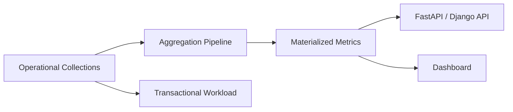
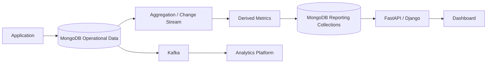

# 12- Aggregation Framework

## Overview

MongoDB's Aggregation Framework provides a server-side pipeline for filtering, transforming, grouping, joining, and analyzing documents.

Unlike a simple `find()` query, aggregation can transform the shape of data and produce derived results:

```text
Collection
    |
    v
$match
    |
    v
$project / $set
    |
    v
$unwind
    |
    v
$group
    |
    v
$sort
    |
    v
API / Report / Materialized Collection
```

Aggregation is commonly used for:

- Reporting APIs
- Dashboards
- Analytics
- Operational metrics
- Data transformation
- Data enrichment
- Grouped statistics
- Pagination with metadata
- ETL pipelines
- Materialized views
- Search and recommendation workloads
- Synchronizing derived data

The important engineering principle is:

> Design aggregation pipelines around access patterns, indexes, document cardinality, memory usage, and workload characteristics rather than treating them as arbitrary sequences of database commands.

Aggregation runs primarily on the MongoDB server. This avoids transferring every source document to Python or another application service merely to calculate a result.

## Why Aggregation Matters

Consider an orders collection:

```json
{
  "_id": "...",
  "tenant_id": "TENANT-100",
  "customer_id": "CUST-1001",
  "status": "paid",
  "total": 1250,
  "created_at": "2026-09-20T10:00:00Z",
  "items": [
    {
      "product_id": "PRD-1001",
      "quantity": 2,
      "price": 500
    },
    {
      "product_id": "PRD-1002",
      "quantity": 1,
      "price": 250
    }
  ]
}
```

A backend may need:

```text
Total revenue by status
Orders per customer
Top products
Daily revenue
Average order value
Paginated order results
Orders joined with customer metadata
```

Without aggregation, the application may need to:

```text
Read many documents
      ↓
Transfer over network
      ↓
Deserialize into application objects
      ↓
Group and transform in Python
      ↓
Calculate results
```

Aggregation moves much of this work to MongoDB:

```text
MongoDB
  |
  +-- Filter
  +-- Transform
  +-- Group
  +-- Sort
  +-- Join
  |
  v
Small result set
  |
  v
Backend API
```

This can significantly reduce network transfer and application-side processing.

## Aggregation Pipeline Model

An aggregation pipeline consists of ordered stages.

Example:

```javascript
db.orders.aggregate([
  {
    $match: {
      status: "paid"
    }
  },
  {
    $group: {
      _id: null,
      revenue: {
        $sum: "$total"
      }
    }
  }
])
```

Conceptually:

```text
Input documents
      |
      v
+-------------+
|   $match    |
+-------------+
      |
      v
Filtered documents
      |
      v
+-------------+
|   $group    |
+-------------+
      |
      v
Aggregated result
```

Each stage receives documents from the previous stage and produces documents for the next stage.

## Pipeline Execution

A pipeline can be viewed as:

```text
Stage A
  |
  v
Stage B
  |
  v
Stage C
  |
  v
Stage D
  |
  v
Final result
```

The order matters.

For example:

```javascript
[
  {
    $match: {
      tenant_id: "TENANT-100",
      status: "paid"
    }
  },
  {
    $group: {
      _id: "$customer_id",
      revenue: {
        $sum: "$total"
      }
    }
  }
]
```

is generally more efficient than grouping the entire collection and filtering afterward when the filter can substantially reduce the working set.

Aggregation stages are not interchangeable.

## Core Aggregation Stages

| Stage | Primary purpose |
|---|---|
| `$match` | Filter documents |
| `$project` | Select or reshape fields |
| `$set` | Add or modify fields |
| `$unset` | Remove fields |
| `$group` | Group and aggregate |
| `$sort` | Sort documents |
| `$limit` | Restrict result count |
| `$skip` | Skip documents |
| `$unwind` | Expand array elements |
| `$lookup` | Join with another collection |
| `$facet` | Run multiple pipelines over the same input |
| `$count` | Count documents |
| `$bucket` | Group values into explicit ranges |
| `$bucketAuto` | Automatically generate ranges |
| `$replaceWith` | Replace the current document |
| `$replaceRoot` | Replace the root document |
| `$unionWith` | Combine results from collections |
| `$merge` | Write results into a collection |
| `$out` | Replace/write an aggregation result into a collection |

## `$match`

`$match` filters documents.

```javascript
db.orders.aggregate([
  {
    $match: {
      tenant_id: "TENANT-100",
      status: "paid",
      total: {
        $gte: 1000
      }
    }
  }
])
```

Use `$match` early whenever possible.

A useful rule is:

```text
Filter early
    ↓
Process fewer documents
    ↓
Reduce CPU
    ↓
Reduce memory
    ↓
Reduce downstream work
```

### `$match` and Indexes

An early `$match` can benefit from indexes.

For example:

```javascript
db.orders.createIndex({
  tenant_id: 1,
  status: 1,
  created_at: -1
})
```

Then:

```javascript
db.orders.aggregate([
  {
    $match: {
      tenant_id: "TENANT-100",
      status: "paid"
    }
  },
  {
    $sort: {
      created_at: -1
    }
  }
])
```

may be able to use the index effectively depending on the complete query and planner.

Do not assume that adding an index automatically makes every aggregation fast. Inspect the actual plan.

## `$project`

`$project` controls the fields flowing through the pipeline and can reshape documents.

```javascript
db.orders.aggregate([
  {
    $project: {
      _id: 0,
      order_id: 1,
      customer_id: 1,
      total: 1
    }
  }
])
```

It can also compute fields:

```javascript
db.orders.aggregate([
  {
    $project: {
      order_id: 1,
      total: 1,
      tax: {
        $multiply: [
          "$total",
          0.18
        ]
      }
    }
  }
])
```

Use `$project` when the transformation itself is part of the result contract.

Do not add projection stages mechanically after every stage. Pipeline design should be driven by actual data flow and workload behavior.

## `$set`

`$set` adds or modifies fields.

```javascript
db.orders.aggregate([
  {
    $set: {
      total_with_tax: {
        $multiply: [
          "$total",
          1.18
        ]
      }
    }
  }
])
```

It is especially useful for intermediate computed values.

Example:

```javascript
[
  {
    $set: {
      line_count: {
        $size: "$items"
      }
    }
  },
  {
    $match: {
      line_count: {
        $gt: 5
      }
    }
  }
]
```

## `$unset`

`$unset` removes fields from pipeline documents.

```javascript
db.users.aggregate([
  {
    $unset: [
      "internal_notes",
      "security_metadata"
    ]
  }
])
```

This is useful when the final aggregation result should not expose internal fields.

For API responses, still enforce authorization and response schemas at the application layer.

Aggregation projection is not a substitute for authorization.

## `$group`

`$group` groups documents by a key and calculates accumulated values.

Example:

```javascript
db.orders.aggregate([
  {
    $group: {
      _id: "$status",
      order_count: {
        $sum: 1
      },
      revenue: {
        $sum: "$total"
      }
    }
  }
])
```

Result shape:

```json
{
  "_id": "paid",
  "order_count": 1200,
  "revenue": 850000
}
```

### Grouping by Multiple Fields

```javascript
db.orders.aggregate([
  {
    $group: {
      _id: {
        tenant_id: "$tenant_id",
        status: "$status"
      },
      revenue: {
        $sum: "$total"
      }
    }
  }
])
```

This is useful for multi-dimensional reporting.

## Common Accumulators

| Accumulator | Purpose |
|---|---|
| `$sum` | Sum values |
| `$avg` | Average |
| `$min` | Minimum |
| `$max` | Maximum |
| `$first` | First value encountered |
| `$last` | Last value encountered |
| `$push` | Build an array |
| `$addToSet` | Build a unique-value array |
| `$count` | Count grouped documents |

Example:

```javascript
db.orders.aggregate([
  {
    $group: {
      _id: "$customer_id",
      order_count: {
        $sum: 1
      },
      average_order_value: {
        $avg: "$total"
      },
      maximum_order_value: {
        $max: "$total"
      }
    }
  }
])
```

## `$sort`

`$sort` orders documents.

```javascript
db.orders.aggregate([
  {
    $sort: {
      created_at: -1
    }
  }
])
```

Multiple fields can define deterministic ordering:

```javascript
{
  $sort: {
    created_at: -1,
    _id: -1
  }
}
```

The `_id` tie-breaker is useful when implementing stable pagination.

Sorting can become expensive when MongoDB cannot satisfy the sort through an appropriate index.

## `$limit`

`$limit` restricts the number of documents flowing downstream.

```javascript
db.orders.aggregate([
  {
    $sort: {
      total: -1
    }
  },
  {
    $limit: 20
  }
])
```

This is useful for:

- Top-N queries
- API limits
- Dashboards
- Leaderboards

For large datasets, an appropriate index can make a major difference.

## `$skip`

`$skip` discards the first N documents.

```javascript
db.orders.aggregate([
  {
    $sort: {
      created_at: -1,
      _id: -1
    }
  },
  {
    $skip: 10000
  },
  {
    $limit: 50
  }
])
```

This is easy to implement but can become inefficient for deep pagination.

For high-volume APIs, keyset-style pagination is generally preferable.

## `$unwind`

`$unwind` expands an array into multiple documents.

Given:

```json
{
  "order_id": "ORD-1001",
  "items": [
    {
      "product_id": "PRD-1",
      "quantity": 2
    },
    {
      "product_id": "PRD-2",
      "quantity": 1
    }
  ]
}
```

Pipeline:

```javascript
db.orders.aggregate([
  {
    $unwind: "$items"
  }
])
```

Conceptually produces:

```text
ORD-1001 + PRD-1
ORD-1001 + PRD-2
```

This is useful for:

- Product-level analytics
- Array filtering
- Array grouping
- Event processing

### Cardinality Warning

If a collection has:

```text
1 million documents
```

and each document contains:

```text
100 array elements
```

then `$unwind` can potentially create a working stream of roughly:

```text
100 million intermediate documents
```

before later stages reduce it.

This is one of the most important aggregation performance considerations.

## `$unwind` Options

You can preserve documents with missing or empty arrays:

```javascript
{
  $unwind: {
    path: "$items",
    preserveNullAndEmptyArrays: true
  }
}
```

An array index can also be captured:

```javascript
{
  $unwind: {
    path: "$items",
    includeArrayIndex: "item_index"
  }
}
```

## `$lookup`

`$lookup` performs a join-like operation.

Example:

```javascript
db.orders.aggregate([
  {
    $lookup: {
      from: "customers",
      localField: "customer_id",
      foreignField: "customer_id",
      as: "customer"
    }
  }
])
```

The result contains:

```json
{
  "order_id": "ORD-1001",
  "customer_id": "CUST-1001",
  "customer": [
    {
      "customer_id": "CUST-1001",
      "name": "Alice"
    }
  ]
}
```

MongoDB remains document-oriented, but `$lookup` allows controlled cross-collection enrichment.

## `$lookup` with Pipeline

A pipeline-based lookup provides more control.

```javascript
db.orders.aggregate([
  {
    $lookup: {
      from: "customers",
      let: {
        customer_id: "$customer_id"
      },
      pipeline: [
        {
          $match: {
            $expr: {
              $eq: [
                "$customer_id",
                "$$customer_id"
              ]
            }
          }
        },
        {
          $project: {
            _id: 0,
            customer_id: 1,
            name: 1
          }
        }
      ],
      as: "customer"
    }
  }
])
```

This is useful when the joined collection needs:

- Additional filtering
- Projection
- Sorting
- Multiple conditions
- More complex correlation

## `$lookup` and Data Modeling

Repeated heavy `$lookup` operations can indicate that the document model does not align with the application's access patterns.

Prefer embedding when:

- Related data is small
- Relationship is naturally owned by the parent
- Data is commonly read together
- Duplication is manageable

References plus `$lookup` may be appropriate when:

- Related data is large
- Related data is shared
- Data changes independently
- Embedding would cause excessive document growth

Aggregation does not eliminate the need for good data modeling.

## `$facet`

`$facet` runs multiple pipelines against the same input.

Example:

```javascript
db.products.aggregate([
  {
    $match: {
      category: "electronics"
    }
  },
  {
    $facet: {
      products: [
        {
          $sort: {
            created_at: -1
          }
        },
        {
          $limit: 20
        }
      ],
      total: [
        {
          $count: "value"
        }
      ],
      price_stats: [
        {
          $group: {
            _id: null,
            average: {
              $avg: "$price"
            },
            maximum: {
              $max: "$price"
            }
          }
        }
      ]
    }
  }
])
```

This is useful for API responses containing:

```text
Data
+
Total count
+
Aggregated metadata
```

It can be significantly more efficient than running multiple independent queries when the same filtered input would otherwise be scanned repeatedly.

However, `$facet` can also consume substantial memory if its branches process large intermediate datasets.

## `$count`

`$count` returns the number of documents entering the stage.

```javascript
db.orders.aggregate([
  {
    $match: {
      status: "paid"
    }
  },
  {
    $count: "total"
  }
])
```

Result:

```json
{
  "total": 12500
}
```

For APIs, distinguish between:

- Exact count
- Estimated count
- Whether a total count is actually necessary

Exact counts can become expensive on large filtered datasets.

## `$bucket`

`$bucket` groups values into explicit ranges.

```javascript
db.orders.aggregate([
  {
    $bucket: {
      groupBy: "$total",
      boundaries: [
        0,
        100,
        500,
        1000,
        5000
      ],
      default: "5000+",
      output: {
        count: {
          $sum: 1
        }
      }
    }
  }
])
```

Useful for:

- Price distributions
- Order-value analysis
- Latency buckets
- Capacity reports

## `$bucketAuto`

`$bucketAuto` automatically determines bucket boundaries.

```javascript
db.orders.aggregate([
  {
    $bucketAuto: {
      groupBy: "$total",
      buckets: 5,
      output: {
        count: {
          $sum: 1
        }
      }
    }
  }
])
```

Use it for exploratory analytics where exact business-defined boundaries are not required.

For operational reporting, explicit `$bucket` boundaries are often easier to reason about and keep stable.

## `$replaceWith`

`$replaceWith` replaces the current document with a computed document.

Example:

```javascript
db.orders.aggregate([
  {
    $replaceWith: {
      order_id: "$order_id",
      total: "$total",
      status: "$status"
    }
  }
])
```

It is useful when the final document should have a fundamentally different root structure.

## `$replaceRoot`

`$replaceRoot` replaces the root document with another document expression.

For embedded documents:

```javascript
db.orders.aggregate([
  {
    $replaceRoot: {
      newRoot: "$customer"
    }
  }
])
```

Use carefully when fields from the original document are no longer needed.

## `$unionWith`

`$unionWith` combines results from another collection.

```javascript
db.events.aggregate([
  {
    $match: {
      severity: "critical"
    }
  },
  {
    $unionWith: {
      coll: "archived_events",
      pipeline: [
        {
          $match: {
            severity: "critical"
          }
        }
      ]
    }
  }
])
```

This is useful when logically similar records are physically separated.

If this becomes a common operational query, reconsider whether the physical data model creates unnecessary query complexity.

## `$merge`

`$merge` writes aggregation results into a collection.

Example:

```javascript
db.orders.aggregate([
  {
    $group: {
      _id: "$customer_id",
      total_spend: {
        $sum: "$total"
      }
    }
  },
  {
    $merge: {
      into: "customer_metrics",
      on: "_id",
      whenMatched: "replace",
      whenNotMatched: "insert"
    }
  }
])
```

This can implement materialized views.

A common architecture is:

```text
Operational collection
        |
        v
Aggregation pipeline
        |
        v
customer_metrics
        |
        v
Fast API/dashboard reads
```

Materialization trades computation during reads for additional storage and refresh complexity.

## `$out`

`$out` writes aggregation results to a collection.

Conceptually:

```javascript
db.orders.aggregate([
  {
    $group: {
      _id: "$status",
      count: {
        $sum: 1
      }
    }
  },
  {
    $out: "order_status_report"
  }
])
```

Unlike `$merge`, `$out` is intended to write the pipeline result to a collection in a more replacement-oriented manner.

Use it carefully for production workloads because replacing a derived collection can have operational implications.

## Aggregation Expressions

Aggregation stages use expressions to compute values.

Example:

```javascript
{
  $project: {
    order_id: 1,
    net_total: {
      $subtract: [
        "$total",
        "$discount"
      ]
    }
  }
}
```

Expressions can operate on:

- Fields
- Constants
- Arrays
- Dates
- Strings
- Numbers
- Conditions
- Nested expressions

Expressions can be composed.

```javascript
{
  $project: {
    discounted_total: {
      $multiply: [
        {
          $subtract: [
            "$total",
            "$discount"
          ]
        },
        1.18
      ]
    }
  }
}
```

Keep deeply nested expressions readable. Complex business logic can become difficult to test and maintain.

## Conditional Expressions

`$cond` implements conditional logic.

```javascript
{
  $project: {
    risk_level: {
      $cond: [
        {
          $gte: [
            "$total",
            5000
          ]
        },
        "high",
        "normal"
      ]
    }
  }
}
```

`$ifNull` can provide fallback values:

```javascript
{
  $set: {
    country: {
      $ifNull: [
        "$profile.country",
        "unknown"
      ]
    }
  }
}
```

`$switch` is useful for multiple branches.

```javascript
{
  $set: {
    tier: {
      $switch: {
        branches: [
          {
            case: {
              $gte: ["$total_spend", 10000]
            },
            then: "gold"
          },
          {
            case: {
              $gte: ["$total_spend", 5000]
            },
            then: "silver"
          }
        ],
        default: "standard"
      }
    }
  }
}
```

## Array Expressions

Aggregation can transform arrays without necessarily using `$unwind`.

For example, `$filter` can retain matching elements:

```javascript
db.orders.aggregate([
  {
    $project: {
      order_id: 1,
      expensive_items: {
        $filter: {
          input: "$items",
          as: "item",
          cond: {
            $gte: [
              "$$item.price",
              1000
            ]
          }
        }
      }
    }
  }
])
```

This can be preferable to `$unwind` when the desired result remains one document per parent.

## Date Expressions

Date expressions are useful for time-series and reporting workloads.

Example:

```javascript
db.orders.aggregate([
  {
    $group: {
      _id: {
        year: {
          $year: "$created_at"
        },
        month: {
          $month: "$created_at"
        }
      },
      revenue: {
        $sum: "$total"
      }
    }
  }
])
```

For production reporting, carefully define timezone semantics.

A "day" in an API's business timezone may not correspond to a UTC calendar day.

## String Expressions

Aggregation can transform strings.

Example:

```javascript
db.users.aggregate([
  {
    $project: {
      normalized_email: {
        $toLower: "$email"
      }
    }
  }
])
```

Other string operations can support:

- Concatenation
- Substring extraction
- Case normalization
- String splitting
- Pattern-oriented transformations

For frequently queried normalized values, it can be better to store the normalized representation rather than recomputing it on every query.

## Aggregation and Indexes

Indexes can improve aggregation when early stages can use them.

Consider:

```javascript
db.orders.createIndex({
  tenant_id: 1,
  status: 1,
  created_at: -1
})
```

Pipeline:

```javascript
db.orders.aggregate([
  {
    $match: {
      tenant_id: "TENANT-100",
      status: "paid"
    }
  },
  {
    $sort: {
      created_at: -1
    }
  },
  {
    $limit: 50
  }
])
```

This is a workload where filter and sort requirements can align with a compound index.

Do not choose an index merely because it matches the fields in the pipeline. Consider:

- Selectivity
- Equality fields
- Sort requirements
- Range predicates
- Result cardinality
- Write overhead

## ESR Guideline and Aggregation

The Equality, Sort, Range guideline is useful when designing compound indexes for many query patterns.

For example:

```javascript
{
  tenant_id: 1,
  status: 1,
  created_at: -1
}
```

can align with:

```text
Equality:
tenant_id
status

Sort:
created_at
```

For a range query, the exact ordering must be evaluated against the complete workload rather than blindly applying a formula.

Always verify with `explain()`.

## Explain and Aggregation

Use `explain()` to understand aggregation performance.

```javascript
db.orders.explain("executionStats").aggregate([
  {
    $match: {
      tenant_id: "TENANT-100",
      status: "paid"
    }
  },
  {
    $sort: {
      created_at: -1
    }
  },
  {
    $limit: 50
  }
])
```

Important metrics include:

| Metric | Why it matters |
|---|---|
| `nReturned` | Number of final documents |
| `totalKeysExamined` | Index entries examined |
| `totalDocsExamined` | Documents examined |
| Execution time | Overall execution cost |
| `IXSCAN` | Index scan |
| `COLLSCAN` | Collection scan |
| `SORT` | Explicit sort stage |

A senior engineer should compare the amount of work with the size of the result.

For example:

```text
Returned: 50
Documents examined: 2,500,000
```

is a strong signal that the workload may need optimization.

## Aggregation Optimization Workflow

A practical workflow is:

```text
Define API/report requirement
          |
          v
Build correct pipeline
          |
          v
Measure baseline
          |
          v
Inspect explain()
          |
          v
Reduce input cardinality
          |
          v
Review indexes
          |
          v
Reduce expensive stages
          |
          v
Measure again
          |
          v
Load test production-like data
```

Do not optimize an aggregation based solely on intuition.

## `$match` Early Filtering

Compare:

```javascript
[
  {
    $unwind: "$items"
  },
  {
    $match: {
      status: "paid"
    }
  }
]
```

with:

```javascript
[
  {
    $match: {
      status: "paid"
    }
  },
  {
    $unwind: "$items"
  }
]
```

The second form can dramatically reduce work when only a small fraction of orders are paid.

The general principle is:

> Reduce document and array cardinality before expensive transformations whenever semantics allow it.

## Reduce Before `$unwind`

Suppose only orders from one tenant are needed.

Prefer:

```javascript
[
  {
    $match: {
      tenant_id: "TENANT-100"
    }
  },
  {
    $unwind: "$items"
  }
]
```

rather than unwinding the entire collection first.

This becomes increasingly important as arrays grow.

## `$sort` and Memory

Sorting large intermediate result sets can consume substantial memory.

A sort can be cheaper when an appropriate index provides the ordering.

For example:

```javascript
db.orders.createIndex({
  tenant_id: 1,
  created_at: -1
})
```

can support workloads shaped around:

```javascript
{
  $match: {
    tenant_id: "TENANT-100"
  }
}
```

followed by:

```javascript
{
  $sort: {
    created_at: -1
  }
}
```

Always validate the actual plan.

## Large Aggregations

For large datasets:

- Filter early.
- Avoid unnecessary `$unwind`.
- Avoid unnecessary `$lookup`.
- Project only required fields where useful.
- Use indexes for selective entry points.
- Avoid large in-memory sorts.
- Avoid deep `$skip`.
- Consider pre-aggregation.
- Consider materialized collections.
- Run heavy analytics away from latency-sensitive workloads where architecture permits.

For recurring dashboards, repeatedly scanning the operational collection may be inferior to maintaining derived metrics.

## Materialized Aggregation

A common production architecture is:



The derived collection can be refreshed:

- Periodically
- Incrementally
- On relevant events
- Through scheduled workers
- Through change streams

The correct strategy depends on freshness requirements.

## Aggregation with Change Streams

Change streams can drive incremental derived data.

```text
MongoDB
   |
   v
Change Stream
   |
   v
Consumer
   |
   +---- Update derived metrics
   +---- Invalidate Redis cache
   +---- Publish Kafka event
   +---- Update search index
```

This can avoid repeatedly scanning a large source collection.

Consumers should handle:

- Resume tokens
- Temporary failures
- Reconnects
- Duplicate processing
- Idempotency
- Backpressure
- Monitoring

## `$lookup` Performance

Before using `$lookup`, inspect:

- Join cardinality
- Foreign-side indexes
- Number of source documents
- Number of matching foreign documents
- Projection size
- Additional pipeline stages

The foreign collection should generally have appropriate indexes for the lookup predicate.

A common mistake is:

```text
Large collection
      +
Large collection
      +
Unbounded $lookup
      =
Large intermediate result
```

If an API performs this lookup on every request, consider whether the result should be embedded, cached, materialized, or represented differently.

## Aggregation and Pagination

A common API pattern is:

```javascript
[
  {
    $match: {
      tenant_id: "TENANT-100"
    }
  },
  {
    $sort: {
      created_at: -1,
      _id: -1
    }
  },
  {
    $limit: 51
  }
]
```

The API can return 50 records and use the extra record to determine:

```text
has_more = true
```

This is usually preferable to using large `$skip` values.

For cursor pagination, the next request can use the last document's sort keys.

Conceptually:

```text
Page 1
  |
  +-- created_at = T1
  +-- _id = ID1
  |
  v
Cursor
  |
  v
Page 2 filter
  |
  +-- created_at < T1
  |
  +-- OR created_at = T1 AND _id < ID1
```

This provides stable pagination under appropriate indexing and sort semantics.

## `$facet` for API Pagination

A `$facet` pipeline can return both page data and metadata:

```javascript
db.orders.aggregate([
  {
    $match: {
      tenant_id: "TENANT-100",
      status: "paid"
    }
  },
  {
    $facet: {
      data: [
        {
          $sort: {
            created_at: -1,
            _id: -1
          }
        },
        {
          $limit: 50
        }
      ],
      metadata: [
        {
          $count: "total"
        }
      ]
    }
  }
])
```

This can be convenient but should not automatically be used for every API.

If the total count is expensive and the client only needs `has_more`, a count query may be unnecessary.

## Aggregation in Python

PyMongo accepts aggregation pipelines as Python lists and dictionaries.

```python
from pymongo.collection import Collection


def get_customer_revenue(
    collection: Collection,
    tenant_id: str,
) -> list[dict]:
    pipeline = [
        {
            "$match": {
                "tenant_id": tenant_id,
                "status": "paid",
            }
        },
        {
            "$group": {
                "_id": "$customer_id",
                "revenue": {
                    "$sum": "$total",
                },
                "order_count": {
                    "$sum": 1,
                },
            }
        },
        {
            "$sort": {
                "revenue": -1,
            }
        },
    ]

    return list(collection.aggregate(pipeline))
```

Keep pipelines close to the repository or data-access layer.

Avoid constructing large aggregation pipelines directly inside HTTP route handlers.

## Aggregation Cursor in Python

Aggregation results are returned through a cursor.

```python
cursor = collection.aggregate(
    pipeline,
    batchSize=500,
)

for document in cursor:
    process(document)
```

Avoid unnecessarily converting huge result sets into a list:

```python
results = list(
    collection.aggregate(pipeline)
)
```

For large workloads, streaming through the cursor can reduce application memory pressure.

## FastAPI Aggregation Pattern

A service architecture can look like:

```text
HTTP Request
    |
    v
FastAPI Router
    |
    v
Service Layer
    |
    v
Repository
    |
    v
MongoDB Aggregation
    |
    v
Aggregation Cursor
    |
    v
Response Model
```

Example:

```python
from fastapi import APIRouter, Depends

router = APIRouter()


@router.get("/reports/customer-revenue")
def customer_revenue(
    tenant_id: str,
    repository=Depends(get_repository),
):
    return repository.customer_revenue(
        tenant_id=tenant_id,
    )
```

The repository owns MongoDB-specific details.

## Sync and Async Considerations

For synchronous PyMongo usage:

```python
collection.aggregate(pipeline)
```

executes through a synchronous client.

For an asynchronous FastAPI architecture, use the supported asynchronous MongoDB driver/API appropriate to the application's dependency strategy.

The important architectural concern is consistency:

```text
Async application
    |
    +-- synchronous database calls
          ↓
    worker-thread blocking / event-loop impact
```

Do not place blocking database operations directly into an async request path without understanding their execution model.

Choose the database client strategy based on:

- Application concurrency
- Driver support
- Framework architecture
- Operational maturity
- Connection management
- Team familiarity

## Django Integration

Aggregation should generally be isolated behind a repository or service layer when MongoDB is used with Django.

```python
class SalesReportRepository:
    def __init__(self, collection):
        self.collection = collection

    def revenue_by_status(self, tenant_id):
        pipeline = [
            {
                "$match": {
                    "tenant_id": tenant_id,
                }
            },
            {
                "$group": {
                    "_id": "$status",
                    "revenue": {
                        "$sum": "$total",
                    },
                }
            }
        ]

        return self.collection.aggregate(pipeline)
```

Do not assume Django's relational ORM concepts map directly to MongoDB aggregation.

The aggregation pipeline is a MongoDB-specific query model.

## Aggregation and PostgreSQL

MongoDB aggregation and PostgreSQL SQL solve many overlapping analytical problems but use different execution models.

| Requirement | MongoDB | PostgreSQL |
|---|---|---|
| Filter | `$match` | `WHERE` |
| Projection | `$project` | `SELECT` |
| Grouping | `$group` | `GROUP BY` |
| Sorting | `$sort` | `ORDER BY` |
| Join | `$lookup` | `JOIN` |
| Array expansion | `$unwind` | `unnest()` / relational patterns |
| Pipeline composition | Aggregation stages | SQL clauses / CTEs |
| Materialization | `$merge` / `$out` | Materialized views / tables |

The choice should be driven by:

- Data model
- Query workload
- Transaction requirements
- Analytical complexity
- Operational requirements
- Team expertise

Do not select MongoDB merely because an aggregation query looks convenient.

## Aggregation and Redis

Redis is useful for caching expensive aggregation results.

For example:

```text
MongoDB aggregation
        |
        v
customer revenue
        |
        v
Redis
        |
        v
API response
```

Use caching when:

- The aggregation is expensive.
- The result is requested frequently.
- Freshness requirements permit caching.
- Cache invalidation can be designed safely.

Avoid using Redis to hide a fundamentally inefficient MongoDB query indefinitely.

## Aggregation and Kafka

For high-volume event-driven systems:

```text
Application
    |
    v
MongoDB
    |
    v
Change Stream
    |
    v
Kafka
    |
    +---- Analytics Consumer
    +---- Search Consumer
    +---- Cache Consumer
```

Large-scale analytics may be better handled by specialized analytical systems rather than repeatedly aggregating operational MongoDB collections.

Aggregation remains valuable for operational and near-real-time workloads.

## Aggregation and Sharding

In a sharded deployment, aggregation behavior depends heavily on the shard key and pipeline shape.

A selective filter involving the shard key can allow MongoDB to target relevant shards.

A query that cannot be targeted may become a scatter-gather workload:

```text
mongos
  |
  +----> Shard A
  +----> Shard B
  +----> Shard C
  |
  v
Merge results
```

Scatter-gather queries can increase:

- Network traffic
- CPU
- Latency
- Coordinator workload

Aggregation design should therefore consider shard-key targeting.

## Security Considerations

Aggregation pipelines can expose sensitive information if authorization is implemented only at the endpoint level.

For multi-tenant systems, include tenant isolation in the pipeline:

```javascript
{
  $match: {
    tenant_id: "TENANT-100"
  }
}
```

Do not allow clients to inject arbitrary aggregation pipelines unless the API is specifically designed for that capability.

Unsafe pattern:

```python
pipeline = request.json["pipeline"]

collection.aggregate(pipeline)
```

Potential risks include:

- Data exposure
- Unauthorized collection access
- Expensive queries
- Resource exhaustion
- Sensitive field exposure
- Cross-tenant access

Prefer controlled query parameters that are translated into approved pipeline stages.

## Aggregation Resource Protection

Public aggregation endpoints should enforce:

- Maximum page size
- Maximum time range
- Allowed filters
- Allowed sort fields
- Allowed grouping dimensions
- Query timeouts where appropriate
- Authentication
- Authorization
- Tenant filtering
- Rate limits

For example:

```text
GET /reports/orders
    |
    +-- tenant_id from authenticated identity
    +-- max date range
    +-- allowed status values
    +-- max result size
    +-- controlled aggregation pipeline
```

Do not allow clients to create arbitrary expensive database workloads.

## Monitoring Aggregation Workloads

Monitor:

- Query latency
- Execution time
- CPU utilization
- Memory utilization
- Disk activity
- Working-set pressure
- Slow operations
- Lock/contention behavior where applicable
- Replication lag
- Connection usage
- Query shape frequency
- Error rates

For important pipelines, track:

```text
Baseline latency
p50
p95
p99
Documents examined
Keys examined
Returned documents
Execution frequency
```

A pipeline that runs once per hour can tolerate different costs from one executed thousands of times per second.

## Cost Considerations

Aggregation cost is affected by:

- Collection size
- Number of documents examined
- Number of array elements processed
- `$lookup` cardinality
- Sort complexity
- Index usage
- CPU consumption
- Memory consumption
- Storage I/O
- Frequency of execution
- Cluster size

For managed deployments, inefficient aggregation can translate directly into higher infrastructure cost.

A useful optimization target is:

```text
Less data scanned
+
Less data transformed
+
Less data transferred
=
Lower latency and cost
```

## Aggregation Anti-Patterns

### Filtering Too Late

Bad:

```javascript
[
  {
    $unwind: "$items"
  },
  {
    $lookup: {
      from: "customers",
      ...
    }
  },
  {
    $match: {
      tenant_id: "TENANT-100"
    }
  }
]
```

Better:

```javascript
[
  {
    $match: {
      tenant_id: "TENANT-100"
    }
  },
  {
    $unwind: "$items"
  }
]
```

### Excessive `$lookup`

If every API request requires several large joins, reconsider the data model.

### Unbounded `$unwind`

Large arrays can multiply intermediate document counts dramatically.

### Deep `$skip`

Large offsets can increase the amount of work required for pagination.

### Sorting Without Considering Indexes

A large in-memory sort can become a major bottleneck.

### Returning Huge Aggregation Results

Do not expose unlimited report exports through synchronous HTTP requests.

Use:

```text
API request
    |
    v
Create report job
    |
    v
Celery / worker
    |
    v
MongoDB aggregation
    |
    v
Object storage
    |
    v
Download link
```

for large asynchronous reports where appropriate.

### Using Aggregation as a Replacement for Data Modeling

A sophisticated pipeline cannot always compensate for an unsuitable schema.

If every request requires multiple expensive transformations and joins, reconsider the underlying document model.

## Production Reporting Architecture

For a high-volume application, a reporting pipeline may look like:



This separates transactional workloads from heavier analytical workloads.

The appropriate architecture depends on freshness, scale, and reporting complexity.

## Testing Aggregation Pipelines

Test aggregation at multiple levels.

### Unit-Level Pipeline Construction

Verify that the expected pipeline is generated:

```python
def test_customer_revenue_pipeline(repository):
    pipeline = repository.build_customer_revenue_pipeline(
        tenant_id="TENANT-100",
    )

    assert pipeline[0] == {
        "$match": {
            "tenant_id": "TENANT-100",
        }
    }
```

### Integration Tests

Run the pipeline against representative MongoDB data.

Test:

- Empty collections
- Missing fields
- Null values
- Large arrays
- Duplicate relationships
- Unexpected document shapes
- Multiple tenants
- Boundary dates
- Large result sets

### Performance Tests

Test with production-like:

- Document counts
- Array cardinality
- Indexes
- Data distributions
- Concurrent request volume

A pipeline that works correctly against 1,000 documents may behave very differently against 100 million.

## Query Regression Testing

Aggregation performance can regress after:

- Data growth
- Index changes
- Schema changes
- Pipeline changes
- MongoDB upgrades
- Different data distributions

Maintain representative performance tests for important workloads.

Useful metrics include:

```text
Execution time
Documents examined
Keys examined
Returned documents
Memory usage
CPU usage
```

Compare before and after changes.

## Operational Troubleshooting

### Aggregation Is Slow

```text
Symptom
↓
Aggregation endpoint has high latency
↓
Possible causes
↓
Large collection scan, poor index, expensive sort, $lookup, $unwind, high cardinality
↓
Isolation strategy
↓
Run the pipeline with execution statistics and inspect each major stage
↓
Diagnostic commands
↓
Use explain(), inspect indexes, query shape, collection size, and server metrics
↓
Root cause
↓
Excessive documents or intermediate results are being processed
↓
Corrective action
↓
Filter earlier, improve indexes, reduce cardinality, simplify joins, or materialize results
↓
Prevention
↓
Performance-test critical pipelines and monitor production query latency
```

### Aggregation Consumes Excessive Memory

```text
Symptom
↓
High memory usage during aggregation
↓
Possible causes
↓
Large $group, $sort, $facet, $lookup, or $unwind stages
↓
Isolation strategy
↓
Identify the stage causing the largest intermediate result
↓
Diagnostic commands
↓
Use explain() and inspect collection/document cardinality and server metrics
↓
Root cause
↓
Large intermediate working set
↓
Corrective action
↓
Filter earlier, reduce fields/cardinality, batch workloads, or materialize results
↓
Prevention
↓
Load-test with production-scale data and monitor memory pressure
```

### `$lookup` Produces Unexpected Results

```text
Symptom
↓
Joined array is empty, duplicated, or much larger than expected
↓
Possible causes
↓
Incorrect join fields, missing foreign-side index, one-to-many cardinality, inconsistent identifiers
↓
Isolation strategy
↓
Test the join independently with a small representative dataset
↓
Diagnostic commands
↓
Inspect localField/foreignField values and run the lookup pipeline directly
↓
Root cause
↓
Join relationship or cardinality differs from the application's assumption
↓
Corrective action
↓
Fix join predicates, indexes, or data modeling
↓
Prevention
↓
Document relationship cardinality and test representative cases
```

### Aggregation Works in Development but Fails at Scale

```text
Symptom
↓
Pipeline is fast on development data but slow in production
↓
Possible causes
↓
Data volume, array cardinality, skewed distributions, missing production indexes, concurrency
↓
Isolation strategy
↓
Compare execution statistics and data distributions
↓
Diagnostic commands
↓
Use explain(), collection statistics, index inspection, and production metrics
↓
Root cause
↓
The pipeline's cost grows significantly with production cardinality
↓
Corrective action
↓
Redesign the pipeline, indexing, schema, or reporting architecture
↓
Prevention
↓
Benchmark against production-like datasets before deployment
```

## CLI and `mongosh` Examples

Run an aggregation:

```javascript
db.orders.aggregate([
  {
    $match: {
      status: "paid"
    }
  },
  {
    $group: {
      _id: "$customer_id",
      revenue: {
        $sum: "$total"
      }
    }
  },
  {
    $sort: {
      revenue: -1
    }
  },
  {
    $limit: 20
  }
])
```

Inspect the plan:

```javascript
db.orders.explain("executionStats").aggregate([
  {
    $match: {
      status: "paid"
    }
  },
  {
    $group: {
      _id: "$customer_id",
      revenue: {
        $sum: "$total"
      }
    }
  }
])
```

Inspect indexes:

```javascript
db.orders.getIndexes()
```

Inspect collection statistics:

```javascript
db.orders.stats()
```

The exact operational commands available can vary with MongoDB deployment and version, so production runbooks should be validated against the deployed environment.

## Senior-Level Aggregation Design Checklist

Before shipping a production aggregation:

- Define the expected result shape.
- Identify the expected input cardinality.
- Filter as early as semantics allow.
- Check whether the initial `$match` can use an index.
- Review compound index ordering.
- Estimate `$unwind` cardinality.
- Review `$lookup` cardinality.
- Check sort requirements.
- Avoid unnecessary `$skip`.
- Limit intermediate and final result sizes.
- Inspect the execution plan.
- Measure `nReturned`, `totalDocsExamined`, and `totalKeysExamined`.
- Test with production-like data.
- Consider materialization for repeated expensive reports.
- Consider caching where freshness permits.
- Enforce tenant isolation.
- Restrict user-controlled aggregation parameters.
- Protect expensive reporting endpoints with authentication and rate limits.
- Monitor latency, CPU, memory, and replication impact.
- Re-test after major data-growth or index changes.

## Interview Perspective

### What is the MongoDB Aggregation Framework?

It is a server-side pipeline system for filtering, transforming, grouping, joining, and producing derived document results.

### Why should `$match` usually appear early?

Early filtering reduces the number of documents processed by subsequent stages, lowering CPU, memory, network, and intermediate-result costs.

### What is the difference between `$project` and `$group`?

`$project` reshapes individual documents. `$group` combines multiple documents into grouped results and can calculate aggregates.

### What does `$unwind` do?

It expands an array into separate pipeline documents, which is useful for element-level processing but can dramatically increase intermediate cardinality.

### What is `$lookup`?

`$lookup` performs a join-like enrichment between collections.

### When should `$lookup` be avoided?

Avoid unnecessary or high-cardinality joins, especially on latency-sensitive endpoints. Repeated expensive joins can indicate a schema or materialization problem.

### Why is `explain()` important?

It reveals how MongoDB executes the pipeline and helps identify collection scans, excessive document examination, expensive sorts, and inefficient index usage.

### What is a materialized aggregation result?

It is a persisted representation of derived data, often produced using `$merge` or another processing workflow, allowing expensive computations to be performed ahead of read requests.

### Why can an aggregation be fast with 100,000 documents and slow with 100 million?

Aggregation cost depends on input and intermediate cardinality. Stages such as `$sort`, `$group`, `$lookup`, and `$unwind` can become substantially more expensive as data volume grows.

## Key Takeaways

- MongoDB aggregation is a server-side data-processing pipeline; production performance depends heavily on reducing input and intermediate cardinality.
- `$match` early, appropriate indexes, controlled `$unwind`/`$lookup`, and stable sorting are foundational techniques for efficient pipelines.
- Use `explain()` and execution statistics rather than intuition to diagnose aggregation performance, especially `nReturned`, `totalDocsExamined`, and `totalKeysExamined`.
- Expensive recurring aggregations may be better handled through materialized results, caching, change streams, or dedicated analytics infrastructure.
- Treat aggregation pipelines as production application code: validate inputs, enforce tenant isolation, test with realistic data, monitor resource usage, and protect expensive workloads.