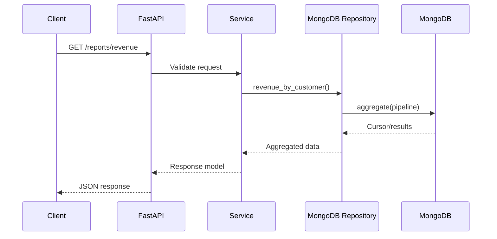
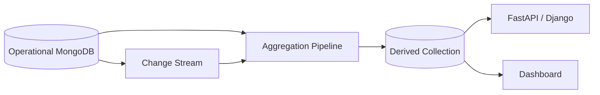
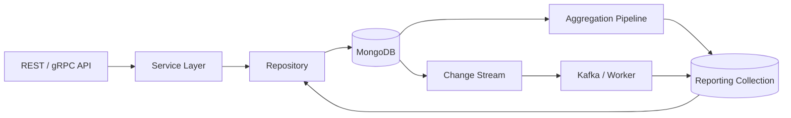

# 13- Aggregation Pipeline

## Overview

A MongoDB aggregation pipeline is an ordered sequence of processing stages that transforms a stream of documents into a result set.

Each stage receives documents from the previous stage, performs an operation, and passes the resulting documents to the next stage.

```text
Collection
    |
    v
+----------------+
|    $match      |
+----------------+
    |
    v
Filtered documents
    |
    v
+----------------+
| $project/$set  |
+----------------+
    |
    v
Transformed documents
    |
    v
+----------------+
|    $group      |
+----------------+
    |
    v
Aggregated results
    |
    v
+----------------+
| $sort / $limit |
+----------------+
    |
    v
API / Report / Materialized Data
```

A pipeline is different from a simple `find()` operation because it can perform multi-stage transformations, grouping, joins, array expansion, calculations, sorting, pagination, and persistence of derived results.

For backend systems, aggregation pipelines are commonly used for:

- Reporting APIs
- Operational dashboards
- Revenue and usage metrics
- Search result enrichment
- Data transformation
- ETL workflows
- Materialized views
- API pagination with metadata
- Data synchronization
- Analytics
- Background processing

The senior-level concern is not memorizing every stage. It is understanding how document cardinality, indexes, pipeline ordering, memory, joins, and workload frequency affect the cost of the pipeline.

## Aggregation Pipeline Mental Model

A pipeline should be treated as a data-processing graph:

```text
Input documents
      |
      v
Filter
      |
      v
Reduce fields
      |
      v
Expand / transform
      |
      v
Group / calculate
      |
      v
Sort
      |
      v
Limit
      |
      v
Output
```

For example:

```javascript
db.orders.aggregate([
  {
    $match: {
      tenant_id: "TENANT-100",
      status: "paid"
    }
  },
  {
    $group: {
      _id: "$customer_id",
      revenue: {
        $sum: "$total"
      }
    }
  },
  {
    $sort: {
      revenue: -1
    }
  },
  {
    $limit: 20
  }
])
```

The pipeline performs:

```text
All orders
   ↓
Orders for one tenant
   ↓
Paid orders
   ↓
Group by customer
   ↓
Calculate revenue
   ↓
Sort by revenue
   ↓
Return top 20
```

The order of stages matters because each stage changes the amount and shape of data processed downstream.

## Pipeline Stage Categories

Stages can be grouped conceptually.

| Category | Examples | Purpose |
|---|---|---|
| Filtering | `$match` | Reduce input documents |
| Projection | `$project`, `$unset` | Control document shape |
| Transformation | `$set`, `$replaceWith` | Compute or reshape data |
| Array processing | `$unwind` | Expand array elements |
| Grouping | `$group` | Aggregate documents |
| Sorting | `$sort` | Order results |
| Limiting | `$limit`, `$skip` | Control result range |
| Joining | `$lookup`, `$unionWith` | Combine collections |
| Faceting | `$facet` | Produce multiple result branches |
| Bucketing | `$bucket`, `$bucketAuto` | Group values into ranges |
| Counting | `$count` | Count documents |
| Materialization | `$merge`, `$out` | Persist pipeline results |

## Pipeline Construction

A pipeline is represented as an array of stage documents.

```javascript
const pipeline = [
  {
    $match: {
      status: "paid"
    }
  },
  {
    $group: {
      _id: "$customer_id",
      revenue: {
        $sum: "$total"
      }
    }
  }
]

db.orders.aggregate(pipeline)
```

Each stage should contain one primary aggregation operator.

For example:

```javascript
{
  $match: {
    status: "paid"
  }
}
```

A pipeline is therefore structurally different from a normal query filter:

```javascript
db.orders.find({
  status: "paid"
})
```

`find()` primarily retrieves matching documents.

`aggregate()` creates a processing pipeline where the output of one stage becomes the input to another.

## Pipeline Data Flow

Consider:

```json
{
  "order_id": "ORD-1001",
  "customer_id": "CUST-1001",
  "status": "paid",
  "total": 1500,
  "items": [
    {
      "product_id": "PRD-1",
      "quantity": 2,
      "price": 500
    },
    {
      "product_id": "PRD-2",
      "quantity": 1,
      "price": 500
    }
  ]
}
```

A pipeline:

```javascript
[
  {
    $match: {
      status: "paid"
    }
  },
  {
    $unwind: "$items"
  },
  {
    $group: {
      _id: "$items.product_id",
      quantity: {
        $sum: "$items.quantity"
      }
    }
  }
]
```

changes the data shape:

```text
Order documents
      |
      | $match
      v
Paid orders
      |
      | $unwind
      v
One document per order item
      |
      | $group
      v
One document per product
```

Understanding this transformation is essential when debugging aggregation behavior.

## `$match`

`$match` filters documents entering the pipeline.

```javascript
db.orders.aggregate([
  {
    $match: {
      tenant_id: "TENANT-100",
      status: "paid",
      created_at: {
        $gte: ISODate("2026-09-01T00:00:00Z")
      }
    }
  }
])
```

### Why `$match` Matters

If the collection contains:

```text
100,000,000 documents
```

and only:

```text
500,000 documents
```

are relevant, filtering early can prevent later stages from processing the other 99.5 million documents.

The general optimization principle is:

```text
Reduce input cardinality
        ↓
Reduce downstream work
        ↓
Reduce memory
        ↓
Reduce CPU
        ↓
Reduce latency
```

### `$match` and Indexes

An initial `$match` can often use an index.

```javascript
db.orders.createIndex({
  tenant_id: 1,
  status: 1,
  created_at: -1
})
```

Pipeline:

```javascript
db.orders.aggregate([
  {
    $match: {
      tenant_id: "TENANT-100",
      status: "paid"
    }
  },
  {
    $sort: {
      created_at: -1
    }
  }
])
```

Whether the index is actually beneficial depends on the complete query shape and data distribution.

Always verify with `explain()`.

## `$project`

`$project` reshapes documents and controls which fields continue through the pipeline.

```javascript
db.orders.aggregate([
  {
    $project: {
      _id: 0,
      order_id: 1,
      customer_id: 1,
      total: 1
    }
  }
])
```

It can also calculate fields:

```javascript
db.orders.aggregate([
  {
    $project: {
      order_id: 1,
      total: 1,
      tax: {
        $multiply: [
          "$total",
          0.18
        ]
      }
    }
  }
])
```

Use `$project` when the transformation is part of the pipeline's logical data flow or final result.

Avoid adding projection stages solely because they seem like a performance optimization. The benefit depends on the actual pipeline and workload.

## `$set`

`$set` adds or modifies fields.

```javascript
db.orders.aggregate([
  {
    $set: {
      total_with_tax: {
        $multiply: [
          "$total",
          1.18
        ]
      }
    }
  }
])
```

It is useful for intermediate calculations:

```javascript
[
  {
    $set: {
      item_count: {
        $size: "$items"
      }
    }
  },
  {
    $match: {
      item_count: {
        $gt: 5
      }
    }
  }
]
```

The calculated field exists for subsequent stages.

## `$unset`

`$unset` removes fields from pipeline documents.

```javascript
db.users.aggregate([
  {
    $unset: [
      "internal_notes",
      "security_metadata"
    ]
  }
])
```

This is useful when preparing a result document.

It should not be considered an authorization mechanism. Sensitive-field access should be controlled by the application and database permissions as appropriate.

## `$group`

`$group` combines documents according to a grouping key.

```javascript
db.orders.aggregate([
  {
    $group: {
      _id: "$status",
      count: {
        $sum: 1
      },
      revenue: {
        $sum: "$total"
      }
    }
  }
])
```

Example output:

```json
[
  {
    "_id": "paid",
    "count": 12500,
    "revenue": 8500000
  },
  {
    "_id": "cancelled",
    "count": 700,
    "revenue": 250000
  }
]
```

### Grouping by Multiple Fields

```javascript
db.orders.aggregate([
  {
    $group: {
      _id: {
        tenant_id: "$tenant_id",
        status: "$status"
      },
      revenue: {
        $sum: "$total"
      },
      order_count: {
        $sum: 1
      }
    }
  }
])
```

This creates one group for each unique combination.

## Accumulators

Common accumulators include:

| Accumulator | Purpose |
|---|---|
| `$sum` | Calculate totals |
| `$avg` | Calculate averages |
| `$min` | Find minimum |
| `$max` | Find maximum |
| `$first` | Select first value |
| `$last` | Select last value |
| `$push` | Build an array |
| `$addToSet` | Build a unique-value array |
| `$count` | Count documents |

Example:

```javascript
db.orders.aggregate([
  {
    $group: {
      _id: "$customer_id",
      order_count: {
        $sum: 1
      },
      total_spend: {
        $sum: "$total"
      },
      average_order: {
        $avg: "$total"
      },
      maximum_order: {
        $max: "$total"
      }
    }
  }
])
```

## `$sort`

`$sort` orders pipeline documents.

```javascript
{
  $sort: {
    created_at: -1
  }
}
```

For stable ordering:

```javascript
{
  $sort: {
    created_at: -1,
    _id: -1
  }
}
```

The `_id` tie-breaker is useful when multiple documents have identical timestamps.

### Sorting and Indexes

A sort can be expensive when MongoDB must explicitly sort a large intermediate result.

A suitable index can sometimes provide the required ordering.

For example:

```javascript
db.orders.createIndex({
  tenant_id: 1,
  created_at: -1,
  _id: -1
})
```

may support a workload shaped like:

```javascript
[
  {
    $match: {
      tenant_id: "TENANT-100"
    }
  },
  {
    $sort: {
      created_at: -1,
      _id: -1
    }
  }
]
```

Verify the actual execution plan rather than assuming the index is used.

## `$limit`

`$limit` restricts the number of documents passed downstream.

```javascript
[
  {
    $sort: {
      created_at: -1
    }
  },
  {
    $limit: 50
  }
]
```

It is common for:

- Top-N queries
- API result limits
- Leaderboards
- Dashboards
- Pagination

A `$limit` can significantly reduce downstream work when placed appropriately.

## `$skip`

`$skip` discards documents from the beginning of the pipeline stream.

```javascript
[
  {
    $sort: {
      created_at: -1,
      _id: -1
    }
  },
  {
    $skip: 10000
  },
  {
    $limit: 50
  }
]
```

It is simple but can become inefficient for deep pagination.

For large APIs, prefer cursor/keyset pagination where possible.

## `$unwind`

`$unwind` expands an array into multiple pipeline documents.

Given:

```json
{
  "order_id": "ORD-1001",
  "items": [
    {
      "product_id": "PRD-1",
      "quantity": 2
    },
    {
      "product_id": "PRD-2",
      "quantity": 1
    }
  ]
}
```

Pipeline:

```javascript
{
  $unwind: "$items"
}
```

Conceptually produces:

```text
ORD-1001 + PRD-1
ORD-1001 + PRD-2
```

### Cardinality Explosion

`$unwind` is one of the most important stages to reason about from a performance perspective.

If:

```text
10 million documents
×
20 array elements
```

are unwound, the downstream stream can contain up to:

```text
200 million intermediate documents
```

before later filtering or grouping.

Always ask:

```text
How many documents enter $unwind?
How many array elements exist per document?
How many survive downstream filtering?
```

### Unwind Options

```javascript
{
  $unwind: {
    path: "$items",
    preserveNullAndEmptyArrays: true,
    includeArrayIndex: "item_index"
  }
}
```

`preserveNullAndEmptyArrays` keeps documents that have no array elements.

`includeArrayIndex` records the original array position.

## `$filter` vs `$unwind`

Not every array operation requires `$unwind`.

If the desired result should remain one document per order, `$filter` may be more appropriate:

```javascript
{
  $set: {
    expensive_items: {
      $filter: {
        input: "$items",
        as: "item",
        cond: {
          $gte: [
            "$$item.price",
            1000
          ]
        }
      }
    }
  }
}
```

Use `$unwind` when you need each array element to participate independently in downstream stages such as `$group`.

## `$lookup`

`$lookup` performs a join-like operation.

```javascript
db.orders.aggregate([
  {
    $lookup: {
      from: "customers",
      localField: "customer_id",
      foreignField: "customer_id",
      as: "customer"
    }
  }
])
```

The result contains an array:

```json
{
  "order_id": "ORD-1001",
  "customer_id": "CUST-1001",
  "customer": [
    {
      "customer_id": "CUST-1001",
      "name": "Alice"
    }
  ]
}
```

### `$lookup` with a Pipeline

```javascript
db.orders.aggregate([
  {
    $lookup: {
      from: "customers",
      let: {
        customer_id: "$customer_id"
      },
      pipeline: [
        {
          $match: {
            $expr: {
              $eq: [
                "$customer_id",
                "$$customer_id"
              ]
            }
          }
        },
        {
          $project: {
            _id: 0,
            customer_id: 1,
            name: 1
          }
        }
      ],
      as: "customer"
    }
  }
])
```

This is useful when the foreign collection requires additional filtering or transformation.

### `$lookup` Performance

Review:

- Join cardinality
- Foreign-side indexes
- Number of source documents
- Number of matching foreign documents
- Fields returned from the foreign collection
- Additional pipeline stages

Repeated large `$lookup` operations can indicate that the schema or read model needs redesign.

## `$facet`

`$facet` executes multiple sub-pipelines against the same input.

```javascript
db.products.aggregate([
  {
    $match: {
      category: "electronics"
    }
  },
  {
    $facet: {
      data: [
        {
          $sort: {
            created_at: -1
          }
        },
        {
          $limit: 20
        }
      ],
      metadata: [
        {
          $count: "total"
        }
      ],
      price_stats: [
        {
          $group: {
            _id: null,
            average: {
              $avg: "$price"
            },
            maximum: {
              $max: "$price"
            }
          }
        }
      ]
    }
  }
])
```

This is useful for API responses containing:

```text
Page data
+
Total count
+
Additional statistics
```

However, every facet branch has processing cost. Do not use `$facet` automatically for every endpoint.

## `$count`

`$count` converts the incoming document stream into a count result.

```javascript
[
  {
    $match: {
      status: "paid"
    }
  },
  {
    $count: "total"
  }
]
```

Result:

```json
{
  "total": 12500
}
```

For large APIs, ask whether an exact total is actually required.

If the client only needs:

```json
{
  "has_more": true
}
```

a `limit + 1` strategy can avoid an expensive exact count.

## `$bucket`

`$bucket` creates explicit ranges.

```javascript
db.orders.aggregate([
  {
    $bucket: {
      groupBy: "$total",
      boundaries: [
        0,
        100,
        500,
        1000,
        5000
      ],
      default: "5000+",
      output: {
        count: {
          $sum: 1
        }
      }
    }
  }
])
```

Useful for:

- Revenue distribution
- Price ranges
- Latency classes
- Usage levels

## `$bucketAuto`

`$bucketAuto` creates approximately even buckets based on the data distribution.

```javascript
db.orders.aggregate([
  {
    $bucketAuto: {
      groupBy: "$total",
      buckets: 5,
      output: {
        count: {
          $sum: 1
        }
      }
    }
  }
])
```

It is useful for exploratory analysis.

For business reports where ranges have explicit meaning, `$bucket` is usually easier to reason about.

## `$replaceWith`

`$replaceWith` replaces the current pipeline document.

```javascript
db.orders.aggregate([
  {
    $replaceWith: {
      order_id: "$order_id",
      customer_id: "$customer_id",
      total: "$total"
    }
  }
])
```

Use it when the final or intermediate document should have a fundamentally different structure.

## `$replaceRoot`

`$replaceRoot` replaces the root document with another document expression.

For example:

```javascript
db.orders.aggregate([
  {
    $replaceRoot: {
      newRoot: "$customer"
    }
  }
])
```

This is useful when a nested object should become the new document root.

Be careful because fields from the original root are no longer available unless explicitly preserved.

## `$unionWith`

`$unionWith` combines pipeline results from another collection.

```javascript
db.events.aggregate([
  {
    $match: {
      severity: "critical"
    }
  },
  {
    $unionWith: {
      coll: "archived_events",
      pipeline: [
        {
          $match: {
            severity: "critical"
          }
        }
      ]
    }
  }
])
```

This is useful when current and archived data are stored separately.

If the same union is required by nearly every application request, reconsider the storage strategy.

## `$merge`

`$merge` writes pipeline output into a target collection.

```javascript
db.orders.aggregate([
  {
    $group: {
      _id: "$customer_id",
      total_spend: {
        $sum: "$total"
      },
      order_count: {
        $sum: 1
      }
    }
  },
  {
    $merge: {
      into: "customer_metrics",
      on: "_id",
      whenMatched: "replace",
      whenNotMatched: "insert"
    }
  }
])
```

This is useful for materialized or derived data.

Example architecture:

```text
Orders
  |
  v
Aggregation
  |
  v
customer_metrics
  |
  +---- FastAPI
  +---- Dashboard
  +---- Reporting
```

The trade-off is:

```text
More write/refresh complexity
        +
More storage
        ↓
Faster repeated reads
```

## `$out`

`$out` writes aggregation results into a collection.

```javascript
db.orders.aggregate([
  {
    $group: {
      _id: "$status",
      count: {
        $sum: 1
      }
    }
  },
  {
    $out: "order_status_report"
  }
])
```

Use it carefully for production workloads because replacing a derived collection can have operational consequences.

`$merge` is often more appropriate when the destination needs incremental or controlled update semantics.

## Aggregation Expressions

Aggregation expressions calculate values inside pipeline stages.

Example:

```javascript
{
  $project: {
    order_id: 1,
    net_total: {
      $subtract: [
        "$total",
        "$discount"
      ]
    }
  }
}
```

Expressions can be composed:

```javascript
{
  $project: {
    total_with_tax: {
      $multiply: [
        {
          $subtract: [
            "$total",
            "$discount"
          ]
        },
        1.18
      ]
    }
  }
}
```

Complex expressions should remain readable. If a pipeline contains large amounts of business logic, consider whether that logic belongs in the database, service layer, or a dedicated processing pipeline.

## Conditional Expressions

`$cond` provides conditional logic.

```javascript
{
  $set: {
    risk_level: {
      $cond: [
        {
          $gte: [
            "$total",
            5000
          ]
        },
        "high",
        "normal"
      ]
    }
  }
}
```

`$ifNull` provides fallback behavior:

```javascript
{
  $set: {
    country: {
      $ifNull: [
        "$profile.country",
        "unknown"
      ]
    }
  }
}
```

For multiple conditions, `$switch` can be clearer:

```javascript
{
  $set: {
    customer_tier: {
      $switch: {
        branches: [
          {
            case: {
              $gte: ["$total_spend", 10000]
            },
            then: "gold"
          },
          {
            case: {
              $gte: ["$total_spend", 5000]
            },
            then: "silver"
          }
        ],
        default: "standard"
      }
    }
  }
}
```

## Array Expressions

Array expressions can transform arrays without necessarily expanding them.

Example:

```javascript
{
  $project: {
    order_id: 1,
    expensive_items: {
      $filter: {
        input: "$items",
        as: "item",
        cond: {
          $gte: [
            "$$item.price",
            1000
          ]
        }
      }
    }
  }
}
```

This preserves one result document per order.

Use array expressions when the desired output remains at the parent-document level.

## Date Expressions

Date expressions are important for reporting.

```javascript
db.orders.aggregate([
  {
    $group: {
      _id: {
        year: {
          $year: "$created_at"
        },
        month: {
          $month: "$created_at"
        }
      },
      revenue: {
        $sum: "$total"
      }
    }
  }
])
```

Production systems should explicitly define timezone semantics.

For example:

```text
UTC storage
     +
Business timezone
     ↓
Correct reporting day
```

Do not assume that UTC date boundaries are equivalent to business-local date boundaries.

## String Expressions

Aggregation supports string transformations.

```javascript
db.users.aggregate([
  {
    $project: {
      email: {
        $toLower: "$email"
      }
    }
  }
])
```

Common uses include:

- Normalization
- Concatenation
- Extraction
- Splitting
- Formatting

If a normalized field is queried frequently, consider storing the normalized value rather than recalculating it for every request.

## Pipeline Ordering

Pipeline ordering is one of the most important aggregation concepts.

Consider:

```javascript
[
  {
    $unwind: "$items"
  },
  {
    $match: {
      tenant_id: "TENANT-100"
    }
  }
]
```

versus:

```javascript
[
  {
    $match: {
      tenant_id: "TENANT-100"
    }
  },
  {
    $unwind: "$items"
  }
]
```

If tenant filtering eliminates most documents, the second pipeline processes substantially fewer array elements.

General rule:

```text
Selective filtering
        ↓
Cardinality reduction
        ↓
Expensive transformations
        ↓
Grouping / sorting
        ↓
Final limiting
```

This is a guideline, not a mechanical rule. Stage semantics and optimizer behavior must still be considered.

## Aggregation Pipeline Optimization

A practical optimization workflow is:

```text
Define expected result
        |
        v
Build correct pipeline
        |
        v
Measure baseline
        |
        v
Run explain()
        |
        v
Identify expensive stage
        |
        v
Review indexes
        |
        v
Reduce input/intermediate cardinality
        |
        v
Measure again
        |
        v
Load test with production-like data
```

Never optimize only by looking at source code.

## `explain()` for Aggregation

Use execution statistics:

```javascript
db.orders.explain("executionStats").aggregate([
  {
    $match: {
      tenant_id: "TENANT-100",
      status: "paid"
    }
  },
  {
    $sort: {
      created_at: -1
    }
  },
  {
    $limit: 50
  }
])
```

Important indicators include:

| Metric / Stage | Interpretation |
|---|---|
| `nReturned` | Final result count |
| `totalDocsExamined` | Documents examined |
| `totalKeysExamined` | Index entries examined |
| `COLLSCAN` | Collection scan |
| `IXSCAN` | Index scan |
| `FETCH` | Fetch documents after index access |
| `SORT` | Explicit sorting work |
| `LIMIT` | Result limitation |
| Execution time | Measured query cost |

A query returning:

```text
50 documents
```

after examining:

```text
20,000,000 documents
```

deserves investigation.

## Index Design for Pipelines

Consider this workload:

```javascript
[
  {
    $match: {
      tenant_id: "TENANT-100",
      status: "paid"
    }
  },
  {
    $sort: {
      created_at: -1
    }
  },
  {
    $limit: 50
  }
]
```

A possible index is:

```javascript
db.orders.createIndex({
  tenant_id: 1,
  status: 1,
  created_at: -1
})
```

This aligns:

```text
Equality
tenant_id
status

Sort
created_at
```

The ESR guideline is useful for reasoning about compound indexes, but it should not replace workload-specific testing.

Consider:

- Selectivity
- Cardinality
- Equality predicates
- Sort requirements
- Range predicates
- Write frequency
- Index size
- Query frequency

## Covered Aggregation Workloads

A covered query can avoid fetching complete documents when the index contains the required fields.

For example:

```javascript
db.orders.createIndex({
  tenant_id: 1,
  status: 1,
  customer_id: 1
})
```

A pipeline that only requires those fields may benefit from index coverage depending on the complete execution plan.

Coverage is not an automatic property of having an index. Verify the actual plan.

## Memory and Intermediate Results

Aggregation can create large intermediate datasets.

Potentially expensive stages include:

- `$group`
- `$sort`
- `$facet`
- `$lookup`
- `$unwind`

Consider:

```text
10M documents
      |
      | $unwind
      v
100M documents
      |
      | $group
      v
Large aggregation state
      |
      | $sort
      v
Large memory requirement
```

Reducing cardinality earlier can have a much larger impact than micro-optimizing individual expressions.

## Large Aggregation Workloads

For large workloads:

- Filter early.
- Use selective indexes.
- Avoid unnecessary `$unwind`.
- Avoid unnecessary `$lookup`.
- Avoid deep `$skip`.
- Limit result sets.
- Reduce intermediate document size where useful.
- Avoid repeatedly scanning operational collections.
- Consider materialized results.
- Consider asynchronous processing.
- Separate analytics from latency-sensitive APIs when appropriate.

For very large analytical workloads, a dedicated analytical platform may be more appropriate than repeatedly executing heavy aggregation pipelines against transactional data.

## Aggregation and Pagination

Offset pagination:

```javascript
[
  {
    $sort: {
      created_at: -1,
      _id: -1
    }
  },
  {
    $skip: 10000
  },
  {
    $limit: 50
  }
]
```

is simple but becomes increasingly expensive at large offsets.

Cursor pagination can instead use the last document's sort keys.

Conceptually:

```text
Page 1
  |
  +-- created_at = T1
  +-- _id = ID1
  |
  v
Cursor
  |
  v
Page 2
  |
  +-- created_at < T1
  |
  +-- OR
  |
  +-- created_at = T1
      AND _id < ID1
```

The corresponding filter can be:

```javascript
{
  $or: [
    {
      created_at: {
        $lt: ISODate("2026-09-20T10:00:00Z")
      }
    },
    {
      created_at: ISODate("2026-09-20T10:00:00Z"),
      _id: {
        $lt: ObjectId("64f000000000000000000001")
      }
    }
  ]
}
```

The sort and index must match the pagination design.

## `$facet` Pagination Pattern

An API may need both page data and metadata.

```javascript
db.orders.aggregate([
  {
    $match: {
      tenant_id: "TENANT-100",
      status: "paid"
    }
  },
  {
    $facet: {
      data: [
        {
          $sort: {
            created_at: -1,
            _id: -1
          }
        },
        {
          $limit: 50
        }
      ],
      metadata: [
        {
          $count: "total"
        }
      ]
    }
  }
])
```

This is convenient but exact counting can be expensive.

If the API only needs:

```text
has_more
```

fetch:

```text
page_size + 1
```

and avoid an exact count.

## `$lookup` and Cardinality

Suppose:

```text
1,000,000 orders
```

and each order matches:

```text
5 customer-related records
```

A join can produce a very large intermediate result.

Before adding `$lookup`, determine:

```text
Source cardinality
+
Join cardinality
+
Result cardinality
```

A senior engineer should treat join cardinality as an architectural concern, not merely a query-syntax concern.

## Aggregation in Python

PyMongo accepts a pipeline as a list of dictionaries.

```python
from pymongo.collection import Collection


def revenue_by_customer(
    collection: Collection,
    tenant_id: str,
) -> list[dict]:
    pipeline = [
        {
            "$match": {
                "tenant_id": tenant_id,
                "status": "paid",
            }
        },
        {
            "$group": {
                "_id": "$customer_id",
                "revenue": {
                    "$sum": "$total",
                },
                "order_count": {
                    "$sum": 1,
                },
            }
        },
        {
            "$sort": {
                "revenue": -1,
            }
        },
    ]

    return list(collection.aggregate(pipeline))
```

For small result sets, converting the cursor to a list is reasonable.

For large results:

```python
cursor = collection.aggregate(
    pipeline,
    batchSize=500,
)

for document in cursor:
    process(document)
```

This avoids unnecessarily loading the entire result set into application memory.

## Repository Pattern

Keep MongoDB-specific pipeline construction inside the repository or data-access layer.

```python
class OrderRepository:
    def __init__(self, collection):
        self.collection = collection

    def revenue_by_customer(
        self,
        tenant_id: str,
    ):
        pipeline = [
            {
                "$match": {
                    "tenant_id": tenant_id,
                    "status": "paid",
                }
            },
            {
                "$group": {
                    "_id": "$customer_id",
                    "revenue": {
                        "$sum": "$total",
                    },
                }
            },
        ]

        return self.collection.aggregate(pipeline)
```

This keeps:

```text
FastAPI / Django
       |
       v
Service
       |
       v
Repository
       |
       v
MongoDB aggregation
```

instead of embedding database-specific pipelines directly into HTTP handlers.

## FastAPI Aggregation Architecture

A production request flow can look like:



Keep authorization and tenant resolution outside the arbitrary pipeline supplied by the client.

For example:

```python
def build_pipeline(tenant_id: str) -> list[dict]:
    return [
        {
            "$match": {
                "tenant_id": tenant_id,
                "status": "paid",
            }
        },
        {
            "$group": {
                "_id": "$customer_id",
                "revenue": {
                    "$sum": "$total",
                },
            }
        },
    ]
```

The authenticated tenant identity should come from trusted application context rather than an untrusted aggregation parameter.

## Async FastAPI Considerations

If FastAPI uses asynchronous request handling, database access must match the application's concurrency model.

A synchronous MongoDB client used directly inside an async endpoint can block the event loop if not handled appropriately.

Architecture should be deliberate:

```text
Async FastAPI
      |
      v
Async-compatible database access
      |
      v
MongoDB
```

or:

```text
Async FastAPI
      |
      v
Controlled thread execution
      |
      v
Synchronous database client
      |
      v
MongoDB
```

Choose based on the application's driver strategy, concurrency requirements, and operational characteristics.

## Django Integration

For Django applications using PyMongo or a MongoDB-specific integration, keep aggregation logic in a repository or service layer.

```python
class ReportRepository:
    def __init__(self, collection):
        self.collection = collection

    def daily_revenue(self, tenant_id):
        pipeline = [
            {
                "$match": {
                    "tenant_id": tenant_id,
                    "status": "paid",
                }
            },
            {
                "$group": {
                    "_id": {
                        "$dateToString": {
                            "format": "%Y-%m-%d",
                            "date": "$created_at",
                        }
                    },
                    "revenue": {
                        "$sum": "$total",
                    },
                }
            },
            {
                "$sort": {
                    "_id": 1,
                }
            },
        ]

        return self.collection.aggregate(pipeline)
```

Do not assume MongoDB aggregation behaves like Django ORM query composition.

## Aggregation and Redis

Expensive but frequently requested aggregation results can be cached.

```text
MongoDB
    |
    v
Aggregation
    |
    v
Derived result
    |
    v
Redis
    |
    v
API
```

Caching is appropriate when:

- The result is expensive to calculate.
- The same result is requested frequently.
- Slightly stale data is acceptable.
- Cache invalidation is manageable.

Do not use Redis as a permanent workaround for a badly designed aggregation pipeline.

## Aggregation and Kafka

Aggregation can be part of event-driven architectures.

```text
MongoDB
   |
   v
Change Stream
   |
   v
Kafka
   |
   +---- Consumer A
   +---- Consumer B
   +---- Analytics
   +---- Cache invalidation
```

For high-volume analytics, event-driven processing can avoid repeatedly scanning the operational collection.

The trade-off is additional infrastructure and eventual consistency.

## Aggregation and Sharding

In a sharded cluster, pipeline performance depends partly on whether queries can target relevant shards.

A shard-key-aware filter can reduce the amount of data processed:

```text
mongos
  |
  +---- Shard A
  |
  +---- Shard B
```

A query that cannot be targeted may require:

```text
mongos
  |
  +---- Shard A
  +---- Shard B
  +---- Shard C
  |
  v
Merge results
```

This scatter-gather pattern can increase:

- Network traffic
- CPU consumption
- Latency
- Coordinator workload

Aggregation design should therefore account for the shard key.

## Materialized Aggregation

Repeated expensive pipelines are candidates for materialization.



Possible refresh strategies include:

- Scheduled batch jobs
- Incremental updates
- Change streams
- Celery workers
- Kubernetes CronJobs
- Event-driven consumers

The decision depends on:

- Freshness requirements
- Data volume
- Query frequency
- Failure recovery
- Operational complexity

## Security Considerations

Aggregation endpoints should not accept arbitrary pipelines from untrusted clients.

Avoid:

```python
pipeline = request.json["pipeline"]

collection.aggregate(pipeline)
```

Potential risks include:

- Unauthorized data access
- Cross-tenant access
- Sensitive-field exposure
- Excessive database CPU
- Excessive memory usage
- Expensive joins
- Resource exhaustion

Prefer controlled parameters:

```text
HTTP parameters
      |
      v
Validate allowed values
      |
      v
Build approved pipeline
      |
      v
MongoDB
```

For multi-tenant applications, enforce tenant filtering inside the database query:

```javascript
{
  $match: {
    tenant_id: "TENANT-100"
  }
}
```

Do not rely solely on filtering after data has already been retrieved.

## Performance Protection for Public APIs

Aggregation endpoints should typically enforce:

- Authentication
- Authorization
- Tenant isolation
- Maximum page size
- Maximum date range
- Allowed filter fields
- Allowed sort fields
- Allowed grouping dimensions
- Rate limits
- Request timeouts
- Maximum report size

For large exports:

```text
API
 |
 v
Create report job
 |
 v
Celery / worker
 |
 v
MongoDB aggregation
 |
 v
Object storage
 |
 v
Download
```

Do not run unlimited analytical queries synchronously inside latency-sensitive HTTP requests.

## Testing Aggregation Pipelines

Test both correctness and performance.

### Functional Tests

Cover:

- Empty input
- Missing fields
- `null` values
- Duplicate relationships
- Empty arrays
- Large arrays
- Boundary dates
- Multiple tenants
- Unexpected document shapes
- No matching records

Example:

```python
def test_revenue_by_customer(repository):
    results = list(
        repository.revenue_by_customer(
            tenant_id="TENANT-100",
        )
    )

    assert results
    assert results[0]["revenue"] >= 0
```

### Integration Tests

Use a real MongoDB-compatible test environment where possible.

Aggregation behavior should not be validated exclusively through mocked repository methods because mocks do not verify:

- Pipeline syntax
- BSON semantics
- Index behavior
- Actual stage behavior
- Query planner behavior

### Performance Tests

Benchmark with realistic:

- Document counts
- Array sizes
- Data distributions
- Indexes
- Concurrent requests
- Collection growth

A pipeline that performs well against 10,000 documents can fail operationally against 100 million.

## Common Aggregation Mistakes

### Filtering Too Late

Bad:

```javascript
[
  {
    $unwind: "$items"
  },
  {
    $lookup: {
      from: "customers",
      localField: "customer_id",
      foreignField: "customer_id",
      as: "customer"
    }
  },
  {
    $match: {
      tenant_id: "TENANT-100"
    }
  }
]
```

Better:

```javascript
[
  {
    $match: {
      tenant_id: "TENANT-100"
    }
  },
  {
    $unwind: "$items"
  }
]
```

### Unbounded `$unwind`

Large arrays can multiply the number of intermediate documents dramatically.

### Excessive `$lookup`

Repeated large joins can indicate a poor read model.

### Deep `$skip`

Large offsets can cause increasing work.

### Sorting Without Index Analysis

A large explicit sort can become a major latency and memory bottleneck.

### Exact Counts Everywhere

An exact count can be significantly more expensive than simply determining whether another page exists.

### Aggregating in Python Unnecessarily

Avoid:

```python
documents = list(collection.find(filter))

result = {}

for document in documents:
    # Large application-side aggregation
    ...
```

when the transformation can efficiently be performed by MongoDB.

However, do not automatically move every computation into MongoDB. Application-side processing may be more appropriate when the business logic is complex or when the workload belongs in a dedicated processing system.

## Aggregation Pipeline Anti-Patterns

### One Massive Pipeline

A single pipeline containing:

```text
$match
$lookup
$unwind
$lookup
$facet
$group
$sort
$lookup
$project
...
```

may technically work but become difficult to reason about.

Break complex workflows into:

- Materialized intermediate data
- Background jobs
- Separate read models
- Specialized analytics systems

when appropriate.

### Using Aggregation to Compensate for Poor Schema Design

If every request requires multiple joins and transformations, the problem may be the data model.

Aggregation is not a substitute for access-pattern-driven schema design.

### Running Heavy Reports on the Primary Workload

A large aggregation can compete with latency-sensitive application traffic.

Consider:

- Read replicas where appropriate
- Dedicated reporting collections
- Scheduled jobs
- Materialization
- Analytics systems

Architecture should be based on workload isolation requirements.

## Performance Regression Workflow

When an aggregation becomes slower:

```text
Latency regression
       |
       v
Capture current pipeline
       |
       v
Run explain()
       |
       v
Compare historical execution metrics
       |
       v
Check indexes
       |
       v
Check data growth/cardinality
       |
       v
Check document/array growth
       |
       v
Check concurrent workload
       |
       v
Optimize
       |
       v
Load test
       |
       v
Deploy and monitor
```

Do not assume that a pipeline code change is the only possible cause.

Performance can regress because:

- Collection size increased.
- Array cardinality increased.
- Data distribution changed.
- Indexes changed.
- Traffic increased.
- Cache/working-set behavior changed.
- Cluster resources became constrained.

## Operational Monitoring

For important aggregation workloads, monitor:

- p50 latency
- p95 latency
- p99 latency
- Execution time
- Error rate
- CPU
- Memory
- Disk I/O
- Connections
- Replication lag
- Query frequency
- Documents examined
- Keys examined
- Result cardinality

Track aggregation performance as an application workload rather than only monitoring MongoDB availability.

## Cost Considerations

Aggregation cost grows with:

```text
Input cardinality
+
Intermediate cardinality
+
Join cardinality
+
Sort/group complexity
+
Execution frequency
```

A pipeline executed:

```text
1 time/hour
```

can have a very different infrastructure impact from the same pipeline executed:

```text
10,000 times/minute
```

Optimize based on workload frequency as well as individual execution latency.

## Troubleshooting

### Pipeline Returns Unexpected Results

```text
Symptom
↓
Aggregation result contains missing, duplicate, or unexpected documents
↓
Possible causes
↓
Incorrect stage ordering, $unwind cardinality, join mismatch, grouping key error
↓
Isolation strategy
↓
Run the pipeline one stage at a time
↓
Diagnostic commands
↓
Inspect intermediate results with mongosh or Compass
↓
Root cause
↓
A stage transformed the document stream differently than expected
↓
Corrective action
↓
Correct the stage or its ordering
↓
Prevention
↓
Test intermediate cardinality and representative document shapes
```

### Pipeline Is Slow

```text
Symptom
↓
Aggregation endpoint has high latency
↓
Possible causes
↓
COLLSCAN, inefficient index, large $group, $sort, $lookup, or $unwind
↓
Isolation strategy
↓
Run explain("executionStats") and identify the expensive stage
↓
Diagnostic commands
↓
Inspect execution statistics, indexes, collection size, and server metrics
↓
Root cause
↓
Too much data or too many intermediate documents are being processed
↓
Corrective action
↓
Filter earlier, improve indexes, reduce cardinality, simplify joins, or materialize results
↓
Prevention
↓
Benchmark critical pipelines with production-like data
```

### Pipeline Works in Development but Not Production

```text
Symptom
↓
Pipeline is fast on development data but slow in production
↓
Possible causes
↓
Collection growth, larger arrays, different data distribution, missing indexes, higher concurrency
↓
Isolation strategy
↓
Compare production and development cardinality and execution statistics
↓
Diagnostic commands
↓
Use explain(), collection statistics, index inspection, and workload metrics
↓
Root cause
↓
Pipeline cost scales poorly with production data characteristics
↓
Corrective action
↓
Redesign the pipeline, index, schema, or reporting architecture
↓
Prevention
↓
Test against production-like volumes and distributions before release
```

### `$lookup` Produces Too Many Results

```text
Symptom
↓
Joined result becomes unexpectedly large
↓
Possible causes
↓
One-to-many or many-to-many relationship, duplicate foreign records, incorrect join predicate
↓
Isolation strategy
↓
Test the join independently and inspect matching cardinality
↓
Diagnostic commands
↓
Run the lookup with a small dataset and inspect foreign-side indexes and identifiers
↓
Root cause
↓
Actual relationship cardinality differs from the pipeline assumption
↓
Corrective action
↓
Fix join conditions, data integrity, or the underlying data model
↓
Prevention
↓
Document relationship cardinality and test representative cases
```

## MongoDB Compass Workflow

Compass can be useful for developing and troubleshooting aggregation pipelines.

Typical workflow:

```text
Connect to cluster
      |
      v
Select database
      |
      v
Select collection
      |
      v
Open Aggregations
      |
      v
Add stages
      |
      v
Inspect intermediate output
      |
      v
Review performance
      |
      v
Export/copy pipeline
      |
      v
Move validated pipeline into application code
```

Use Compass primarily for interactive exploration and debugging.

Production pipeline definitions should remain version-controlled in application code, migration scripts, or operational repositories rather than existing only inside a GUI.

## `mongosh` Examples

Run a pipeline:

```javascript
db.orders.aggregate([
  {
    $match: {
      status: "paid"
    }
  },
  {
    $group: {
      _id: "$customer_id",
      revenue: {
        $sum: "$total"
      }
    }
  },
  {
    $sort: {
      revenue: -1
    }
  },
  {
    $limit: 20
  }
])
```

Inspect the execution plan:

```javascript
db.orders.explain("executionStats").aggregate([
  {
    $match: {
      status: "paid"
    }
  },
  {
    $group: {
      _id: "$customer_id",
      revenue: {
        $sum: "$total"
      }
    }
  }
])
```

Inspect indexes:

```javascript
db.orders.getIndexes()
```

Inspect collection statistics:

```javascript
db.orders.stats()
```

## Production Architecture

A typical aggregation-backed reporting architecture can be:



This architecture separates:

```text
Operational data
        from
Derived reporting data
```

when repeated heavy aggregation would otherwise compete with transactional workloads.

## Senior-Level Pipeline Design Checklist

Before deploying an important aggregation pipeline:

- Define the input and output document shapes.
- Identify expected input cardinality.
- Identify intermediate cardinality.
- Put selective filtering as early as semantics allow.
- Review `$unwind` multiplication.
- Review `$lookup` cardinality.
- Check sort requirements.
- Design indexes around actual query patterns.
- Use `explain()` to verify assumptions.
- Measure `nReturned`, `totalDocsExamined`, and `totalKeysExamined`.
- Avoid deep `$skip` for large datasets.
- Limit result sizes.
- Avoid exact counts when `has_more` is sufficient.
- Consider materialization for frequently repeated expensive computations.
- Protect aggregation endpoints from arbitrary user-supplied pipelines.
- Enforce tenant isolation in the pipeline.
- Test against production-like data.
- Monitor latency and resource consumption.
- Consider workload isolation for large analytical operations.
- Keep production pipeline definitions version-controlled.

## Interview Perspective

### What is an aggregation pipeline?

It is an ordered sequence of MongoDB stages that processes documents and produces transformed or aggregated results.

### Why does pipeline order matter?

Each stage changes the stream consumed by subsequent stages. Filtering or reducing cardinality early can dramatically reduce downstream processing.

### Why is `$unwind` potentially expensive?

It converts array elements into separate pipeline documents. Large arrays can multiply intermediate document cardinality.

### What is the difference between `$project` and `$set`?

`$project` reshapes and controls the fields in a document. `$set` adds or modifies fields while retaining the other fields unless subsequently removed.

### When would you use `$lookup`?

Use it when data stored in another collection must be enriched into the pipeline result and the join aligns with the application's access pattern.

### Why can `$lookup` be a performance problem?

High-cardinality joins can generate large intermediate results and consume significant CPU, memory, and I/O.

### Why should aggregation pipelines use indexes?

Indexes can reduce the number of documents MongoDB must examine and can sometimes provide required ordering, particularly for selective early `$match` and compatible `$sort` patterns.

### How do you diagnose a slow aggregation?

Start with:

```javascript
db.collection.explain("executionStats").aggregate(pipeline)
```

Then inspect:

```text
nReturned
totalDocsExamined
totalKeysExamined
COLLSCAN
IXSCAN
SORT
execution time
```

and correlate the results with data cardinality and workload characteristics.

### When should aggregation results be materialized?

Materialize results when expensive computations are repeated frequently and the application can tolerate the additional storage, refresh complexity, and potential staleness.

## Key Takeaways

- An aggregation pipeline is an ordered data-processing workflow; understanding how each stage changes document shape and cardinality is more important than memorizing individual operators.
- Filter early, control `$unwind` and `$lookup` cardinality, and design indexes around real pipeline entry points and sort requirements.
- Use `explain("executionStats")` and production-like data to diagnose aggregation performance rather than relying on assumptions.
- Heavy or frequently repeated pipelines may require materialized collections, caching, asynchronous workers, change streams, or dedicated analytics infrastructure.
- Production aggregation requires the same engineering discipline as application code: version control, testing, authorization, tenant isolation, observability, performance testing, and operational safeguards.