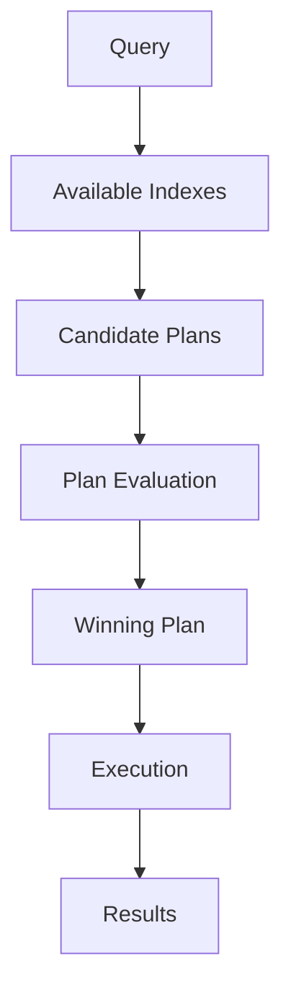

# 15- Indexes

## Overview

MongoDB indexes are data structures that allow the database to locate matching documents without scanning an entire collection.

Without a suitable index, a query may require:

```text
Query
  ↓
Scan collection
  ↓
Inspect documents
  ↓
Return matching documents
```

With an appropriate index:

```text
Query
  ↓
Search index
  ↓
Locate matching keys
  ↓
Fetch required documents
  ↓
Return results
```

Indexes are one of the most important performance mechanisms in MongoDB, but they are not free. Every index consumes memory and storage, increases write cost, and introduces maintenance overhead.

The senior-level question is therefore not:

> "Should this collection have an index?"

It is:

> "Which indexes support the actual access patterns of this workload, and what is their measurable cost?"

MongoDB automatically creates a unique index on `_id`. Application-specific indexes must be designed around real query, sorting, uniqueness, and lifecycle requirements.

## Why Indexes Matter

Consider a collection containing 10 million orders:

```javascript
{
  tenant_id: "tenant-100",
  status: "paid",
  created_at: ISODate("2026-09-20T10:30:00Z"),
  customer_id: "customer-500",
  total: 1250
}
```

Suppose the API frequently executes:

```javascript
db.orders.find({
  tenant_id: "tenant-100",
  status: "paid"
})
```

Without a suitable index, MongoDB may perform a collection scan:

```text
10,000,000 documents
        ↓
Check tenant_id
        ↓
Check status
        ↓
Return matching documents
```

An index can reduce the amount of data MongoDB needs to inspect.

The improvement can be substantial when:

- Collections are large.
- Queries are selective.
- The workload is read-heavy.
- The same query pattern occurs frequently.
- Sorting can also be supported by the index.
- The working set fits effectively in memory.

Indexes do not guarantee fast queries. An inappropriate index can be ignored by the query planner or can introduce additional write and memory overhead without meaningful benefit.

## MongoDB Index Architecture

At a conceptual level:


The query planner evaluates available plans and selects an execution strategy.

Common execution stages include:

- `IXSCAN` — scans an index.
- `FETCH` — retrieves documents referenced by index entries.
- `COLLSCAN` — scans the collection.
- `SORT` — performs an explicit sort.
- `LIMIT` — restricts the number of results.

A senior engineer should inspect the actual execution plan rather than assuming that an index is being used merely because it exists.

## Default `_id` Index

MongoDB automatically creates a unique index on `_id`.

Inspect indexes:

```javascript
db.orders.getIndexes()
```

Typical output includes:

```json
[
  {
    "v": 2,
    "key": {
      "_id": 1
    },
    "name": "_id_"
  }
]
```

The `_id` index provides efficient lookup by document identifier:

```javascript
db.orders.findOne({
  _id: ObjectId("68c000000000000000000001")
})
```

The `_id` index cannot be dropped while the collection is in normal use.

The `_id` field is also required to be unique within a collection.

## Index Key Direction

For a single-field index:

```javascript
db.orders.createIndex({
  created_at: -1
})
```

`1` represents ascending order.

`-1` represents descending order.

Example:

```javascript
db.orders.createIndex({
  created_at: -1
})
```

supports access patterns such as:

```javascript
db.orders.find({
  tenant_id: "tenant-100"
}).sort({
  created_at: -1
})
```

when the full index design also accounts for the equality predicate.

For compound indexes, field order becomes significantly more important.

## Single-Field Indexes

A single-field index contains one indexed field.

```javascript
db.users.createIndex({
  email: 1
})
```

This is appropriate when queries frequently access users by email:

```javascript
db.users.findOne({
  email: "user@example.com"
})
```

A unique index is usually appropriate when email addresses must be unique:

```javascript
db.users.createIndex(
  {
    email: 1
  },
  {
    unique: true
  }
)
```

This makes uniqueness an enforced database invariant rather than an application-only assumption.

## When Single-Field Indexes Are Appropriate

Use a single-field index when:

- A field is frequently queried independently.
- The query pattern is simple.
- The field has useful selectivity.
- The index is needed for sorting.
- A uniqueness constraint is required.
- The index has a clear operational purpose.

Avoid creating single-field indexes for every field simply because the field appears in queries.

## Compound Indexes

A compound index contains multiple fields.

```javascript
db.orders.createIndex({
  tenant_id: 1,
  status: 1,
  created_at: -1
})
```

This can support query patterns such as:

```javascript
db.orders.find({
  tenant_id: "tenant-100",
  status: "paid"
}).sort({
  created_at: -1
})
```

The order of fields is part of the index design.

A compound index is not equivalent to several unrelated single-field indexes.

## Compound Index Ordering

Consider:

```javascript
{
  tenant_id: 1,
  status: 1,
  created_at: -1
}
```

Conceptually, entries are ordered by:

```text
tenant_id
    ↓
status
    ↓
created_at
```

This allows MongoDB to efficiently navigate the index according to compatible query patterns.

An index such as:

```javascript
{
  created_at: -1,
  tenant_id: 1,
  status: 1
}
```

may behave very differently for the same workload.

Index ordering must be derived from actual query patterns.

## Equality, Sort, Range — ESR Guideline

A useful MongoDB index-design heuristic is ESR:

```text
E = Equality
S = Sort
R = Range
```

For example:

```javascript
db.orders.find({
  tenant_id: "tenant-100",
  status: "paid",
  created_at: {
    $gte: ISODate("2026-09-01T00:00:00Z"),
    $lt: ISODate("2026-10-01T00:00:00Z")
  }
}).sort({
  customer_id: 1
})
```

A candidate index needs to be reasoned about based on:

- Equality fields.
- Sort requirements.
- Range predicates.
- Selectivity.
- Actual workload.

ESR is a guideline, not a mechanical rule.

Data distribution, query shape, sort requirements, index size, and workload characteristics can change the optimal design.

## Practical Compound Index Example

Suppose an API frequently executes:

```javascript
db.orders.find({
  tenant_id: "tenant-100",
  status: "paid"
}).sort({
  created_at: -1
}).limit(50)
```

A natural candidate is:

```javascript
db.orders.createIndex({
  tenant_id: 1,
  status: 1,
  created_at: -1
})
```

The design corresponds to:

```text
tenant_id      → Equality
status         → Equality
created_at     → Sort
```

This is more targeted than creating:

```javascript
{ tenant_id: 1 }
{ status: 1 }
{ created_at: -1 }
```

without analyzing the complete query pattern.

## Index Prefixes

For:

```javascript
{
  tenant_id: 1,
  status: 1,
  created_at: -1
}
```

the leading prefix is:

```text
tenant_id
```

and the next prefix is:

```text
tenant_id + status
```

The complete index is:

```text
tenant_id + status + created_at
```

This is why compound index design can cover multiple related access patterns.

However, the fact that a field appears somewhere in a compound index does not mean every query involving that field will efficiently use the index.

The position of the field matters.

## Multikey Indexes

MongoDB creates a multikey index when indexing an array field.

Example document:

```json
{
  "product_id": "P100",
  "tags": [
    "database",
    "backend",
    "mongodb"
  ]
}
```

Index:

```javascript
db.products.createIndex({
  tags: 1
})
```

Query:

```javascript
db.products.find({
  tags: "mongodb"
})
```

MongoDB can index the array values.

Conceptually:

```text
Document
  |
  +-- tags[0]
  +-- tags[1]
  +-- tags[2]
        |
        v
Multiple index entries
```

This is why array indexing can increase index size.

## Multikey Index Considerations

Multikey indexes are useful for:

- Tags
- Categories
- Embedded arrays
- Membership queries

Production concerns include:

- Larger indexes.
- More index entries per document.
- Increased write cost.
- Compound multikey restrictions.
- Large arrays causing index amplification.

Avoid unbounded arrays when they are also heavily indexed.

## Compound Multikey Indexes

Suppose:

```javascript
{
  tags: ["backend", "mongodb"],
  categories: ["database"]
}
```

Creating a compound index over multiple array fields requires careful consideration because MongoDB has restrictions around compound multikey indexes and how multiple array fields are represented.

Do not blindly index every nested array field together.

When multiple arrays participate in a query, test the actual schema and index behavior with `explain()`.

## Unique Indexes

A unique index enforces uniqueness.

```javascript
db.users.createIndex(
  {
    email: 1
  },
  {
    unique: true
  }
)
```

Attempting to insert a duplicate value results in a duplicate-key error.

Unique indexes are appropriate for database invariants such as:

- Email addresses.
- External identifiers.
- Tenant-scoped identifiers when designed appropriately.
- Idempotency keys.
- Business reference numbers.

## Tenant-Scoped Uniqueness

A multi-tenant application may require:

```text
tenant A + username
```

to be unique, while allowing the same username in another tenant.

Use a compound unique index:

```javascript
db.users.createIndex(
  {
    tenant_id: 1,
    username: 1
  },
  {
    unique: true
  }
)
```

This is preferable to implementing uniqueness only in application code.

## Sparse Indexes

A sparse index contains entries only for documents where the indexed field exists.

Example:

```javascript
db.users.createIndex(
  {
    secondary_email: 1
  },
  {
    sparse: true
  }
)
```

Sparse indexes can be useful for optional fields.

However, sparse indexes have semantic differences from ordinary indexes and should not be used simply because a field is nullable.

When the requirement is conditional indexing based on an explicit predicate, a partial index is often a better fit.

## Partial Indexes

A partial index only indexes documents satisfying a filter expression.

Example:

```javascript
db.orders.createIndex(
  {
    customer_id: 1,
    created_at: -1
  },
  {
    partialFilterExpression: {
      status: "active"
    }
  }
)
```

This is useful when only a subset of documents participates in a workload.

Examples:

- Active records.
- Unprocessed jobs.
- Non-deleted records.
- Documents belonging to a particular lifecycle state.

Partial indexes can reduce:

- Index size.
- Memory consumption.
- Write overhead.

They also encode workload assumptions into the index definition, so changes to business lifecycle states should trigger index review.

## Sparse vs Partial Index

| Feature | Sparse | Partial |
|---|---|---|
| Controls indexed documents | Field existence | Arbitrary supported filter |
| Flexible filtering | Limited | High |
| Common use | Optional fields | Lifecycle/status subsets |
| Explicit predicate | No | Yes |
| Index-size reduction | Yes | Yes |

Prefer a partial index when the business condition can be expressed explicitly.

## TTL Indexes

TTL indexes automatically remove documents after a configured period.

Example:

```javascript
db.sessions.createIndex(
  {
    expires_at: 1
  },
  {
    expireAfterSeconds: 0
  }
)
```

A document with:

```json
{
  "session_id": "S100",
  "expires_at": "2026-09-21T10:00:00Z"
}
```

can expire based on the `expires_at` value.

TTL indexes are useful for:

- Temporary sessions.
- Ephemeral tokens.
- Short-lived application state.
- Temporary event data.
- Retention-controlled collections.

TTL deletion is asynchronous. It should not be treated as an exact-time scheduling mechanism.

Do not build correctness-critical workflows around the assumption that a document disappears at the exact expiration timestamp.

## Text Indexes

Text indexes support text-search use cases.

Example:

```javascript
db.articles.createIndex({
  title: "text",
  body: "text"
})
```

Query:

```javascript
db.articles.find({
  $text: {
    $search: "mongodb indexing"
  }
})
```

Text indexes can be useful for basic search requirements, but sophisticated search workloads may be better served by dedicated search technologies depending on requirements such as:

- Relevance ranking.
- Typo tolerance.
- Faceting.
- Complex analyzers.
- Search-scale requirements.

Do not assume a MongoDB text index is a replacement for every search platform.

## Geospatial Indexes

MongoDB supports geospatial indexes for location-based queries.

For GeoJSON data:

```json
{
  "location": {
    "type": "Point",
    "coordinates": [
      88.3639,
      22.5726
    ]
  }
}
```

Create a `2dsphere` index:

```javascript
db.stores.createIndex({
  location: "2dsphere"
})
```

This supports geospatial queries such as nearby-location searches.

Coordinate order for GeoJSON is:

```text
[longitude, latitude]
```

A common production mistake is reversing them.

## Covered Queries

A covered query can be satisfied entirely from an index without fetching the full documents.

Suppose:

```javascript
db.users.createIndex({
  tenant_id: 1,
  email: 1
})
```

and the query only needs:

```javascript
db.users.find(
  {
    tenant_id: "tenant-100",
    email: "user@example.com"
  },
  {
    _id: 0,
    email: 1
  }
)
```

If the required filter and projection can be satisfied by the index, MongoDB may avoid fetching documents.

This can reduce:

- Disk access.
- Memory pressure.
- Document fetch cost.

Covered queries should be validated with `explain()` rather than assumed.

## Index Intersection

MongoDB can sometimes combine multiple indexes for a query.

For example:

```javascript
db.orders.createIndex({
  tenant_id: 1
})

db.orders.createIndex({
  status: 1
})
```

A query involving both fields may potentially use index intersection.

However, index intersection should not generally replace deliberate compound-index design for a frequent, performance-sensitive query.

A compound index often provides a more predictable access path.

## Index Selectivity

Selectivity describes how effectively an index narrows the candidate set.

Suppose:

```text
10,000,000 documents
```

and:

```text
status = "active"
```

matches:

```text
9,500,000 documents
```

The predicate has low selectivity.

An index on `status` alone may provide limited benefit.

By contrast:

```text
tenant_id = "tenant-100"
```

might match only:

```text
20,000 documents
```

and be much more selective.

Selectivity depends on data distribution, not just the number of distinct values in the schema.

## Cardinality

Cardinality is the number of distinct values in a field.

Examples:

| Field | Typical cardinality |
|---|---|
| `status` | Low |
| `country` | Low/medium |
| `tenant_id` | Medium/high |
| `email` | High |
| `order_id` | Very high |

High cardinality often provides better selectivity, but cardinality alone does not determine index usefulness.

The query pattern and workload still matter.

## Sort and Index Interaction

Sorting can be expensive when MongoDB must perform an explicit in-memory sort.

Example:

```javascript
db.orders.find({
  tenant_id: "tenant-100"
}).sort({
  created_at: -1
})
```

A suitable compound index can potentially provide both filtering and ordering:

```javascript
db.orders.createIndex({
  tenant_id: 1,
  created_at: -1
})
```

This can eliminate or reduce the need for an explicit sort.

Large unindexed sorts can become a production bottleneck.

## Equality and Sort Example

Query:

```javascript
db.orders.find({
  tenant_id: "tenant-100",
  status: "paid"
}).sort({
  created_at: -1
})
```

Candidate:

```javascript
db.orders.createIndex({
  tenant_id: 1,
  status: 1,
  created_at: -1
})
```

The index aligns with:

```text
tenant_id → equality
status    → equality
created_at → sort
```

This is a common backend API access pattern.

## Range Queries

Consider:

```javascript
db.orders.find({
  tenant_id: "tenant-100",
  created_at: {
    $gte: ISODate("2026-09-01T00:00:00Z"),
    $lt: ISODate("2026-10-01T00:00:00Z")
  }
})
```

A candidate index:

```javascript
db.orders.createIndex({
  tenant_id: 1,
  created_at: 1
})
```

allows the equality predicate to narrow the index region before scanning the date range.

This is one reason tenant-scoped time-based queries commonly use compound indexes.

## Query Planner

MongoDB's query planner evaluates possible execution plans.

Conceptually:



Possible plans can include:

```text
COLLSCAN
IXSCAN
IXSCAN + FETCH
IXSCAN + SORT
Compound index scan
Index intersection
```

The selected plan depends on the query shape, available indexes, data distribution, and planner behavior.

## `explain()`

Use `explain()` to understand actual query execution.

Example:

```javascript
db.orders.explain("executionStats").find({
  tenant_id: "tenant-100",
  status: "paid"
})
```

For aggregation:

```javascript
db.orders.explain("executionStats").aggregate([
  {
    $match: {
      tenant_id: "tenant-100",
      status: "paid"
    }
  },
  {
    $sort: {
      created_at: -1
    }
  },
  {
    $limit: 50
  }
])
```

## Important Explain Metrics

| Metric | Meaning |
|---|---|
| `nReturned` | Number of returned documents |
| `totalKeysExamined` | Number of index keys examined |
| `totalDocsExamined` | Number of documents examined |
| `executionTimeMillis` | Execution time reported by the plan |
| `IXSCAN` | Index scan |
| `COLLSCAN` | Collection scan |
| `FETCH` | Document fetch |

A useful first comparison is:

```text
totalDocsExamined
        vs
nReturned
```

If MongoDB examines millions of documents to return a small number of results, the query/index combination deserves investigation.

## Healthy Query Pattern

Conceptually:

```text
nReturned = 50
totalDocsExamined = 50
```

This can indicate highly targeted access, although exact behavior depends on the query and execution plan.

## Suspicious Query Pattern

```text
nReturned = 20
totalDocsExamined = 5,000,000
```

This indicates substantial work relative to the result size.

Possible causes include:

- Missing index.
- Poor index ordering.
- Low selectivity.
- Query shape mismatch.
- Large range.
- Inappropriate schema design.

## `COLLSCAN`

A `COLLSCAN` means MongoDB is scanning the collection.

It is not automatically a problem.

For example:

```javascript
db.healthcheck.find({})
```

against a tiny collection may reasonably perform a collection scan.

The question is:

> Is the collection scan expensive for this workload?

A `COLLSCAN` over 500 documents is very different from a `COLLSCAN` over 500 million documents.

## `IXSCAN`

`IXSCAN` indicates that MongoDB is scanning an index.

Example:

```text
IXSCAN
  ↓
FETCH
  ↓
Results
```

An `IXSCAN` is generally useful, but its existence alone does not prove that the query is efficient.

An index can still scan a large portion of the index.

## Index Lifecycle

Indexes should be treated as production infrastructure.

Lifecycle:

```text
Query requirement
      ↓
Candidate index
      ↓
Benchmark
      ↓
Create
      ↓
Observe
      ↓
Validate usage
      ↓
Retain / modify / remove
```

Before adding an index:

1. Identify the query pattern.
2. Measure current performance.
3. Design candidate indexes.
4. Test with representative data.
5. Measure execution plans.
6. Estimate write and storage overhead.
7. Deploy safely.
8. Monitor usage.
9. Remove redundant indexes after validation.

## Creating Indexes

Basic:

```javascript
db.orders.createIndex({
  tenant_id: 1
})
```

Compound:

```javascript
db.orders.createIndex({
  tenant_id: 1,
  status: 1,
  created_at: -1
})
```

Unique:

```javascript
db.users.createIndex(
  {
    email: 1
  },
  {
    unique: true
  }
)
```

Partial:

```javascript
db.jobs.createIndex(
  {
    tenant_id: 1,
    created_at: 1
  },
  {
    partialFilterExpression: {
      status: "pending"
    }
  }
)
```

TTL:

```javascript
db.sessions.createIndex(
  {
    expires_at: 1
  },
  {
    expireAfterSeconds: 0
  }
)
```

## Listing Indexes

```javascript
db.orders.getIndexes()
```

From `mongosh`, this is one of the first commands to run when diagnosing a query problem.

## Dropping an Index

Drop a specific index by name:

```javascript
db.orders.dropIndex("tenant_id_1_status_1_created_at_-1")
```

Or use the key specification when appropriate:

```javascript
db.orders.dropIndex({
  tenant_id: 1,
  status: 1,
  created_at: -1
})
```

Do not drop production indexes casually.

Validate:

- Query impact.
- Application traffic.
- Deployment timing.
- Rollback plan.
- Current index usage.

## Index Statistics

MongoDB provides index usage statistics that can help identify indexes that are candidates for removal.

Example:

```javascript
db.orders.aggregate([
  {
    $indexStats: {}
  }
])
```

This can help answer:

```text
Which indexes are actually being accessed?
```

However, low usage during a short observation window does not prove that an index is unnecessary.

Consider:

- Seasonal traffic.
- Batch jobs.
- Rare administrative operations.
- Disaster-recovery workflows.
- Scheduled reports.

## Index Size

Indexes consume:

- Disk.
- Memory.
- Cache capacity.
- Build resources.
- Write resources.

A collection with many large compound indexes can significantly increase storage requirements.

Inspect collection statistics:

```javascript
db.orders.stats()
```

Review index-related metrics and storage characteristics before and after major index changes.

## Write Overhead

When inserting or updating a document:

```text
Application
    |
    v
Document write
    |
    +----> Collection
    |
    +----> Index 1
    |
    +----> Index 2
    |
    +----> Index 3
    |
    +----> Index N
```

Every affected index may need maintenance.

Therefore:

```text
More indexes
    ↓
Potentially faster reads
    +
More write work
    +
More storage
    +
More memory pressure
```

There is no universally optimal number of indexes.

## Over-Indexing

A common mistake is creating:

```javascript
{ tenant_id: 1 }
{ status: 1 }
{ created_at: 1 }
{ customer_id: 1 }
{ total: 1 }
```

without understanding the actual workload.

This can result in:

- Redundant indexes.
- Large storage consumption.
- Increased write latency.
- More memory pressure.
- More complex operational maintenance.

Indexes should be workload-driven.

## Redundant Indexes

Suppose you have:

```javascript
{
  tenant_id: 1,
  status: 1,
  created_at: -1
}
```

and also:

```javascript
{
  tenant_id: 1
}
```

The second index may be redundant for some workloads because the compound index has `tenant_id` as its leading field.

Whether it can safely be removed depends on the complete workload.

Do not delete indexes solely because they appear redundant. Verify usage and query behavior first.

## Index Design from API Requirements

Consider:

```http
GET /orders?status=paid&limit=50
```

with tenant context supplied by authentication.

The underlying query might be:

```javascript
db.orders.find({
  tenant_id: "tenant-100",
  status: "paid"
}).sort({
  created_at: -1
}).limit(50)
```

The index should be derived from the query:

```javascript
db.orders.createIndex({
  tenant_id: 1,
  status: 1,
  created_at: -1
})
```

The important design process is:

```text
API endpoint
    ↓
Service method
    ↓
Repository query
    ↓
Filter + sort + pagination
    ↓
Index design
    ↓
explain()
    ↓
Production measurement
```

Indexes should therefore be part of application architecture rather than an afterthought.

## Indexes and Pagination

Offset pagination:

```javascript
db.orders.find({
  tenant_id: "tenant-100"
})
.sort({
  created_at: -1
})
.skip(100000)
.limit(50)
```

can become increasingly expensive as the offset grows.

A common alternative is keyset-style pagination.

For example:

```javascript
db.orders.find({
  tenant_id: "tenant-100",
  created_at: {
    $lt: ISODate("2026-09-20T10:00:00Z")
  }
})
.sort({
  created_at: -1
})
.limit(50)
```

with:

```javascript
db.orders.createIndex({
  tenant_id: 1,
  created_at: -1
})
```

For stable pagination, use a deterministic tie-breaker such as `_id` when timestamps are not unique.

A suitable index might then be:

```javascript
db.orders.createIndex({
  tenant_id: 1,
  created_at: -1,
  _id: -1
})
```

The application must implement the corresponding cursor predicate correctly.

## Indexes and Soft Deletes

Suppose documents contain:

```json
{
  "tenant_id": "tenant-100",
  "deleted": false
}
```

and most queries exclude deleted records.

A partial index can be useful:

```javascript
db.orders.createIndex(
  {
    tenant_id: 1,
    created_at: -1
  },
  {
    partialFilterExpression: {
      deleted: false
    }
  }
)
```

This can keep the active workload's index smaller than indexing every document.

## Indexes and Multi-Tenant Systems

Tenant-aware indexes are often critical.

A common access pattern:

```javascript
{
  tenant_id: "tenant-100",
  status: "active"
}
```

can use:

```javascript
{
  tenant_id: 1,
  status: 1
}
```

For a multi-tenant system, indexes should be evaluated against:

- Tenant cardinality.
- Tenant size distribution.
- Large-tenant behavior.
- Cross-tenant administrative queries.
- Sharding strategy.
- Security isolation.

A tenant ID in a query is not merely a performance filter. It is also part of the authorization boundary.

## Indexes and Sharding

In a sharded cluster, index design must be considered together with the shard key.

```text
Application
     |
     v
mongos
     |
     v
Shard targeting
     |
     +----> Shard A
     |
     +----> Shard B
     |
     +----> Shard C
```

A good index cannot compensate for a fundamentally unsuitable shard key.

Evaluate:

- Query targeting.
- Shard-key inclusion.
- Cardinality.
- Data distribution.
- Hot shards.
- Scatter-gather behavior.
- Per-shard indexes.

Index design and shard-key design are separate decisions but must work together.

## Indexes and Aggregation

Aggregation pipelines often benefit from indexes at the beginning of the pipeline.

Example:

```javascript
db.orders.aggregate([
  {
    $match: {
      tenant_id: "tenant-100",
      status: "paid"
    }
  },
  {
    $sort: {
      created_at: -1
    }
  },
  {
    $limit: 100
  }
])
```

Candidate:

```javascript
db.orders.createIndex({
  tenant_id: 1,
  status: 1,
  created_at: -1
})
```

Early filtering reduces the amount of data subsequent stages need to process.

Indexes do not automatically optimize every aggregation stage.

## Index Build Considerations

Creating a large index can consume substantial system resources.

Production planning should consider:

- Collection size.
- Available CPU.
- Memory.
- Disk capacity.
- Disk throughput.
- Replication impact.
- Application traffic.
- Maintenance windows.
- Deployment strategy.

For large production collections, index creation should be treated as an operational change rather than an ordinary application deployment step.

## Indexes in CI/CD

Index definitions should be version-controlled when they are part of application architecture.

For example:

```text
repository/
├── app/
├── migrations/
├── scripts/
└── database/
    └── indexes/
```

A deployment process can then make index changes explicit.

Conceptually:

```text
Git commit
    ↓
CI validation
    ↓
Staging
    ↓
Performance verification
    ↓
Production rollout
    ↓
Monitoring
```

Avoid having application startup blindly recreate or modify every production index on every deployment.

## Python and PyMongo

Indexes can be managed through PyMongo.

```python
from pymongo import ASCENDING, DESCENDING

collection.create_index(
    [
        ("tenant_id", ASCENDING),
        ("status", ASCENDING),
        ("created_at", DESCENDING),
    ],
    name="tenant_status_created_at",
)
```

Unique index:

```python
collection.create_index(
    [("email", ASCENDING)],
    unique=True,
    name="unique_email",
)
```

Partial index:

```python
collection.create_index(
    [
        ("tenant_id", ASCENDING),
        ("created_at", DESCENDING),
    ],
    partialFilterExpression={
        "deleted": False,
    },
    name="active_orders",
)
```

Index creation should normally be part of controlled deployment or migration workflows rather than request handling.

## FastAPI Integration

A typical FastAPI architecture:

```text
FastAPI
   |
   v
Service
   |
   v
Repository
   |
   +---- Query
   |
   +---- Index assumptions
   |
   v
MongoDB
```

Example repository method:

```python
from pymongo.collection import Collection


class OrderRepository:
    def __init__(self, collection: Collection):
        self.collection = collection

    def list_recent_paid_orders(
        self,
        tenant_id: str,
        limit: int,
    ) -> list[dict]:
        cursor = (
            self.collection
            .find(
                {
                    "tenant_id": tenant_id,
                    "status": "paid",
                },
                {
                    "_id": 1,
                    "customer_id": 1,
                    "total": 1,
                    "created_at": 1,
                },
            )
            .sort("created_at", -1)
            .limit(limit)
        )

        return list(cursor)
```

The repository query and index should be reviewed together.

## Django Integration

When Django uses PyMongo or MongoDB-specific libraries, indexes should still be treated as database infrastructure.

Do not assume that Django's relational ORM index abstractions map directly to MongoDB behavior.

For MongoDB-specific applications:

```text
Django View
    ↓
Service
    ↓
Repository
    ↓
PyMongo
    ↓
MongoDB Index
```

Index requirements should be derived from actual MongoDB query patterns.

## Operational Monitoring

Index monitoring should include:

- Query latency.
- Query throughput.
- Index usage.
- Index size.
- Cache behavior.
- Write latency.
- Storage growth.
- Replication impact.
- CPU utilization.
- Disk utilization.

A useful production loop is:

```text
Application metrics
       ↓
Slow-query detection
       ↓
explain()
       ↓
Index analysis
       ↓
Change index
       ↓
Measure
       ↓
Monitor regression
```

## Performance Optimization Workflow

Use a disciplined process:

```text
Slow query
    ↓
Capture exact query
    ↓
Measure baseline
    ↓
Run explain("executionStats")
    ↓
Inspect indexes
    ↓
Check data distribution
    ↓
Design candidate index
    ↓
Benchmark
    ↓
Deploy safely
    ↓
Monitor
```

Do not optimize based only on intuition.

## Before-and-After Example

Suppose:

```javascript
db.orders.find({
  tenant_id: "tenant-100",
  status: "paid"
}).sort({
  created_at: -1
}).limit(50)
```

Before:

```text
COLLSCAN
totalDocsExamined: 2500000
nReturned: 50
```

Candidate index:

```javascript
db.orders.createIndex({
  tenant_id: 1,
  status: 1,
  created_at: -1
})
```

After:

```text
IXSCAN
FETCH
LIMIT
```

The exact metrics depend on data distribution and MongoDB version, but the goal is to reduce unnecessary document and index examination while preserving the required result ordering.

Always validate the actual plan rather than assuming the candidate index produced the expected result.

## Common Index Mistakes

### Indexing Every Query Field Independently

Bad strategy:

```text
Create an index for every field used anywhere.
```

Why it fails:

- Increased storage.
- Increased write cost.
- Redundant indexes.
- Memory pressure.
- More complex operations.

Better:

```text
Group queries into access patterns
        ↓
Design compound indexes
        ↓
Measure
```

### Ignoring Sort Requirements

An index that supports filtering but not sorting may still leave MongoDB with an expensive sort.

Review:

```text
filter
+
sort
+
limit
```

together.

### Ignoring Cardinality

An index on a low-cardinality field may provide limited benefit.

Example:

```javascript
{
  status: 1
}
```

when 95% of documents have:

```text
status = "active"
```

may not be sufficient for a selective workload.

### Assuming `IXSCAN` Means Fast

An index scan can still examine a large portion of the index.

Always inspect:

```text
totalKeysExamined
totalDocsExamined
nReturned
executionTimeMillis
```

### Using `skip()` for Deep Pagination

Large offsets can require MongoDB to walk through many preceding results.

Prefer cursor-based pagination for large datasets.

### Creating Indexes During Application Startup

This can cause:

- Startup delays.
- Unexpected database operations.
- Multiple instances attempting the same work.
- Deployment unpredictability.

Manage indexes through controlled operational or migration processes.

### Ignoring Write Performance

An index optimized for reads has a cost on:

```text
insert
update
delete
```

especially when indexed fields change.

### Leaving Unused Indexes Forever

An index created for a removed feature may continue consuming:

- Storage.
- Memory.
- Write capacity.

Periodically review index usage.

## Production Pitfalls

### Large Compound Indexes

Including many fields in one index can make it large and expensive.

Prefer the smallest index that effectively supports the access pattern.

### Indexing Large Arrays

Large arrays can generate many multikey index entries.

If the array is unbounded, this can become a significant scaling problem.

### Too Many Similar Indexes

These:

```javascript
{ tenant_id: 1, created_at: -1 }
{ tenant_id: 1, status: 1, created_at: -1 }
{ tenant_id: 1, type: 1, created_at: -1 }
{ tenant_id: 1, customer_id: 1, created_at: -1 }
```

may all be valid, but they should correspond to meaningful query patterns.

Do not create variants without measuring their necessity.

### Incorrect Unique Constraints

A unique index changes application behavior.

Before deploying one, verify existing data for duplicates.

For example:

```javascript
db.users.aggregate([
  {
    $group: {
      _id: "$email",
      count: {
        $sum: 1
      }
    }
  },
  {
    $match: {
      count: {
        $gt: 1
      }
    }
  }
])
```

Resolve duplicates before creating the unique index.

## Security Considerations

Indexes are not an authorization mechanism.

An index such as:

```javascript
{
  tenant_id: 1,
  status: 1
}
```

improves access performance but does not enforce tenant isolation.

Authorization should be enforced through:

- Authentication.
- Authorization.
- Tenant context.
- Repository/service boundaries.
- Database permissions where appropriate.

For sensitive systems, avoid allowing arbitrary clients to submit:

```text
sort field
index hint
aggregation pipeline
query operators
```

without strict validation.

## Reliability Considerations

Indexes are part of the runtime dependency graph.

A production database change should have:

- Change tracking.
- Rollback planning.
- Capacity assessment.
- Monitoring.
- Performance validation.
- Deployment ownership.

For high-availability MongoDB deployments, index operations should also be evaluated for their impact on replication and system resources.

## Cost Considerations

Indexes increase:

```text
Storage
+
Memory
+
Write CPU
+
Write latency
+
Operational complexity
```

The benefit is generally:

```text
Lower read latency
+
Higher read throughput
+
Efficient sorting/filtering
```

The correct objective is not to minimize the number of indexes.

It is to maximize useful workload performance within acceptable infrastructure cost.

## Troubleshooting Index Problems

### Query Is Slow

```text
Symptom
↓
Query latency increased
↓
Possible causes
- Missing index
- Wrong index ordering
- Low selectivity
- Large result set
- Poor pagination
- Data growth
↓
Isolation strategy
- Capture exact query
- Run explain("executionStats")
- Inspect getIndexes()
↓
Diagnostic commands
```

```javascript
db.orders.explain("executionStats").find({
  tenant_id: "tenant-100",
  status: "paid"
}).sort({
  created_at: -1
})
```

```javascript
db.orders.getIndexes()
```

```text
Root cause
↓
Identify inefficient access path
↓
Corrective action
- Add/modify index
- Change query
- Change pagination
- Change data model
↓
Prevention
- Query performance tests
- Production monitoring
- Index review
```

### Index Exists but Is Not Used

```text
Symptom
↓
Expected index is ignored
↓
Possible causes
- Query is not selective
- Query shape differs
- Another plan is cheaper
- Index ordering is unsuitable
- Data distribution changed
↓
Isolation strategy
- Run explain()
- Compare candidate indexes
- Inspect actual predicates and sort
↓
Corrective action
- Redesign index
- Rewrite query
- Remove unnecessary index
↓
Prevention
- Test representative workloads
- Monitor query plans
```

### Writes Became Slower After Adding an Index

```text
Symptom
↓
Insert/update latency increased
↓
Possible causes
- Too many indexes
- Large index
- High write volume
- Indexed fields frequently changing
↓
Isolation strategy
- Compare write latency before/after
- Inspect index count and size
- Review index usage
↓
Corrective action
- Remove redundant indexes
- Consolidate indexes
- Redesign access patterns
↓
Prevention
- Include write cost in index reviews
```

## MongoDB Index Command Reference

| Operation | Command |
|---|---|
| List indexes | `db.collection.getIndexes()` |
| Create index | `db.collection.createIndex({...})` |
| Create unique index | `db.collection.createIndex({...}, {unique: true})` |
| Create partial index | `db.collection.createIndex({...}, {partialFilterExpression: {...}})` |
| Create TTL index | `db.collection.createIndex({...}, {expireAfterSeconds: ...})` |
| Drop index | `db.collection.dropIndex("index_name")` |
| Explain query | `db.collection.explain("executionStats").find({...})` |
| Explain aggregation | `db.collection.explain("executionStats").aggregate([...])` |
| Index statistics | `db.collection.aggregate([{$indexStats: {}}])` |
| Collection statistics | `db.collection.stats()` |

## Senior-Level Index Design Checklist

Before approving a production index, ask:

### Query Shape

- What exact queries require this index?
- What filters are used?
- What sorting is required?
- Is pagination involved?
- Is the query tenant-scoped?

### Data Distribution

- What is the field cardinality?
- How selective is the predicate?
- Are values evenly distributed?
- Are there large tenants or hot partitions?

### Index Structure

- Should this be single-field or compound?
- Is field ordering correct?
- Does ESR reasoning apply?
- Can the index support filtering and sorting together?
- Could an existing compound index already satisfy the query?

### Operational Cost

- How large will the index become?
- How much write overhead will it introduce?
- How much memory can it consume?
- What happens as the collection grows?

### Production Validation

- What does `explain("executionStats")` show?
- What are `nReturned`, `totalKeysExamined`, and `totalDocsExamined`?
- Does the index remain useful under production-like data?
- Is the index actually used?
- What is the rollback strategy?

## Interview Traps

### Does MongoDB automatically index every field?

No.

MongoDB automatically creates the `_id` index. Application-specific indexes must be created deliberately.

### Is one index per query field the best strategy?

No.

Compound indexes should usually be designed around complete access patterns rather than creating independent indexes for every field.

### Does a compound index make every field in it independently searchable?

No.

Field order matters. The leading portion of the index is particularly important.

### Is `COLLSCAN` always bad?

No.

A collection scan over a tiny collection can be entirely reasonable. The concern is excessive work relative to the workload.

### Is `IXSCAN` always good?

No.

An index scan may still examine a large number of keys.

### Do indexes improve writes?

Generally, no.

Indexes usually add work to writes because index entries must be maintained.

### Can indexes enforce uniqueness?

Yes.

Use a unique index when uniqueness is a database invariant.

### Are TTL indexes exact schedulers?

No.

TTL cleanup is asynchronous and should not be used as an exact-time execution mechanism.

### Does a partial index index all documents?

No.

Only documents satisfying the partial filter expression are included.

### Should `$lookup` queries always get indexes?

The answer depends on the join pattern and collection design. Indexes on appropriate join fields can be important, but large joins may still be expensive and may indicate a data-modeling problem.

## Key Takeaways

- MongoDB indexes must be designed around real query patterns, especially filter, sort, pagination, and tenant-isolation requirements; compound indexes are often more useful than many independent single-field indexes.
- ESR is a practical index-design guideline, but cardinality, selectivity, data distribution, workload shape, and measured execution plans must determine the final design.
- `explain("executionStats")` is essential for validating index effectiveness; inspect `nReturned`, `totalKeysExamined`, `totalDocsExamined`, execution stages, and execution time rather than assuming an index is useful.
- Every index has operational cost through storage, memory, write amplification, and maintenance, so unused and redundant indexes should be identified and removed carefully.
- Production index design is an application-architecture concern: derive indexes from repository queries, validate them with realistic workloads, version controlled changes, monitor their impact, and review them as data and access patterns evolve.