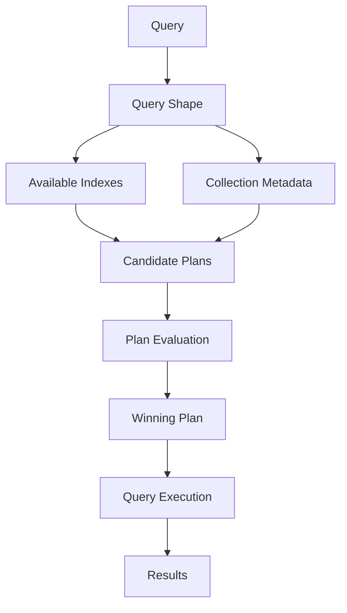

# 16- Query Planner and Explain

## Overview

MongoDB's query planner determines how a query should access data. It evaluates available execution strategies and selects a plan intended to execute the query efficiently.

For backend engineers, understanding the query planner is critical because query performance is determined by the actual execution path, not simply by whether an index exists.

A typical request flows through:

```text
API Request
    ↓
Repository Query
    ↓
MongoDB Query
    ↓
Query Planner
    ↓
Candidate Execution Plans
    ↓
Winning Plan
    ↓
Execution
    ↓
Documents / Aggregation Results
```

The `explain()` command exposes the execution plan and execution statistics.

A production performance investigation should therefore follow:

```text
Slow query
    ↓
Capture exact query
    ↓
Run explain("executionStats")
    ↓
Inspect winning plan
    ↓
Inspect keys/documents examined
    ↓
Review indexes and data distribution
    ↓
Change query or index
    ↓
Measure again
```

The goal is not to force MongoDB to use an index. The goal is to produce an efficient execution plan for the actual workload.

## Query Planner Responsibilities

The query planner is responsible for selecting an execution strategy for a query.

Conceptually:



The planner considers factors such as:

- Query predicates.
- Available indexes.
- Index key ordering.
- Sort requirements.
- Query shape.
- Data distribution.
- Estimated execution cost.
- Historical planner information where applicable.

The selected plan can change as:

- Data volume grows.
- Data distribution changes.
- Indexes change.
- Query shapes change.
- MongoDB versions change.
- Collection statistics and workload characteristics change.

This is why query performance should be continuously measured rather than validated only once during development.

## Query Shape

A query shape represents the structural characteristics of a query.

For example:

```javascript
db.orders.find({
  tenant_id: "tenant-100",
  status: "paid"
})
```

and:

```javascript
db.orders.find({
  tenant_id: "tenant-200",
  status: "pending"
})
```

have the same basic shape:

```text
tenant_id equality
+
status equality
```

even though the literal values differ.

Query-shape thinking is important for identifying repeated access patterns that deserve dedicated indexes.

## Candidate Execution Plans

Suppose the collection contains:

```text
10 million orders
```

and indexes:

```javascript
{ tenant_id: 1 }
{ status: 1 }
{ tenant_id: 1, status: 1, created_at: -1 }
```

For:

```javascript
db.orders.find({
  tenant_id: "tenant-100",
  status: "paid"
}).sort({
  created_at: -1
})
```

MongoDB may consider different strategies:

```text
COLLSCAN
    ↓
Scan collection

tenant_id index
    ↓
Scan matching tenant entries
    ↓
Filter status

status index
    ↓
Scan matching status entries
    ↓
Filter tenant

compound index
    ↓
Match tenant + status
    ↓
Provide created_at ordering
```

The planner evaluates candidate plans and chooses a winning strategy.

## Winning Plan

The winning plan is the execution plan selected for a query.

A simplified explain result might contain:

```json
{
  "winningPlan": {
    "stage": "FETCH",
    "inputStage": {
      "stage": "IXSCAN"
    }
  }
}
```

The exact explain structure varies by query, MongoDB version, execution engine, and workload.

The important question is:

> What work does the winning plan actually perform?

Do not judge a plan solely from its top-level stage.

## Rejected Plans

Explain output can also contain candidate plans that were considered but not selected.

Conceptually:

```text
Candidate Plan A
    ↓
Rejected

Candidate Plan B
    ↓
Rejected

Candidate Plan C
    ↓
Winning
```

Rejected plans can be useful when diagnosing why MongoDB selected a particular index.

However, an engineer should not assume that a rejected plan is universally inferior. It was rejected for the specific query shape and planning conditions being evaluated.

## `explain()`

`explain()` provides information about how MongoDB executes a query.

A basic query:

```javascript
db.orders.explain().find({
  tenant_id: "tenant-100",
  status: "paid"
})
```

For aggregation:

```javascript
db.orders.explain().aggregate([
  {
    $match: {
      tenant_id: "tenant-100",
      status: "paid"
    }
  },
  {
    $sort: {
      created_at: -1
    }
  },
  {
    $limit: 50
  }
])
```

For performance investigation, `executionStats` is generally more useful than merely inspecting the chosen plan.

## Explain Verbosity Modes

MongoDB provides explain verbosity levels.

| Mode | Purpose |
|---|---|
| `queryPlanner` | Shows planner information |
| `executionStats` | Executes the query and reports execution statistics |
| `allPlansExecution` | Provides additional information about candidate plan execution |

Example:

```javascript
db.orders.explain("executionStats").find({
  tenant_id: "tenant-100",
  status: "paid"
})
```

Use `executionStats` when you need to understand actual work performed.

`allPlansExecution` can be useful for deeper planner analysis, but it may execute additional work and should be used deliberately on production systems.

## `queryPlanner`

Example:

```javascript
db.orders.explain("queryPlanner").find({
  tenant_id: "tenant-100",
  status: "paid"
})
```

This mode helps answer:

- What plan was selected?
- Which index is involved?
- Is the query using `COLLSCAN`?
- What candidate plans were considered?

It does not provide the same level of actual execution statistics as `executionStats`.

## `executionStats`

Example:

```javascript
db.orders.explain("executionStats").find({
  tenant_id: "tenant-100",
  status: "paid"
})
```

This mode is useful for answering:

```text
How much work did MongoDB actually perform?
```

Important metrics include:

- `nReturned`
- `executionTimeMillis`
- `totalKeysExamined`
- `totalDocsExamined`

These metrics should be interpreted together.

## `nReturned`

`nReturned` is the number of documents returned by the execution plan.

Example:

```text
nReturned: 50
```

This means the query produced 50 documents.

By itself, this tells you little about efficiency.

Compare it with:

```text
totalDocsExamined
totalKeysExamined
executionTimeMillis
```

## `totalKeysExamined`

This represents index keys examined during execution.

Example:

```text
totalKeysExamined: 75
```

If:

```text
nReturned: 50
totalKeysExamined: 75
```

the index scan may be reasonably targeted.

But:

```text
nReturned: 50
totalKeysExamined: 2,000,000
```

indicates substantial index work.

This does not automatically mean the index is wrong. A large range query may legitimately require scanning many keys.

## `totalDocsExamined`

This represents documents examined during execution.

Example:

```text
nReturned: 50
totalDocsExamined: 50
```

is generally much more targeted than:

```text
nReturned: 50
totalDocsExamined: 5,000,000
```

A large gap is a useful signal for query or index investigation.

## `executionTimeMillis`

This reports execution time for the explain execution.

For example:

```text
executionTimeMillis: 8
```

or:

```text
executionTimeMillis: 1500
```

Execution time is important, but it should not be treated as a universal production latency measurement.

Application latency also includes:

```text
Network
+
Connection checkout
+
MongoDB execution
+
Serialization
+
Application processing
```

For production monitoring, combine explain analysis with application-level metrics.

## `COLLSCAN`

`COLLSCAN` means MongoDB scans the collection.

Example:

```json
{
  "stage": "COLLSCAN"
}
```

Conceptually:

```text
Collection
    ↓
Document 1
Document 2
Document 3
...
Document N
    ↓
Evaluate predicate
```

A collection scan is not inherently incorrect.

It may be acceptable when:

- The collection is very small.
- The query intentionally reads most documents.
- An index would not meaningfully reduce work.

It becomes concerning when a large collection is repeatedly scanned to return a small result set.

## `IXSCAN`

`IXSCAN` represents an index scan.

Conceptually:

```text
Index
  ↓
Matching index keys
  ↓
Record locations
  ↓
FETCH
  ↓
Documents
```

Example:

```json
{
  "stage": "IXSCAN",
  "indexName": "tenant_status_created_at"
}
```

An `IXSCAN` is generally preferable for selective access patterns, but it does not guarantee efficient execution.

An index can still require scanning a large number of keys.

## `FETCH`

`FETCH` retrieves the actual documents after index traversal.

Conceptually:

```text
IXSCAN
   ↓
Index entries
   ↓
FETCH
   ↓
Full documents
```

This is normal for many queries.

A covered query may avoid document fetching when the index contains everything required for the filter and projection.

## `SORT`

A `SORT` stage indicates that MongoDB needs to perform sorting rather than obtaining the required order directly from an appropriate index.

Example:

```text
IXSCAN
   ↓
FETCH
   ↓
SORT
   ↓
LIMIT
```

For large datasets, an unnecessary sort can become expensive.

If the query is:

```javascript
db.orders.find({
  tenant_id: "tenant-100"
}).sort({
  created_at: -1
})
```

a candidate index is:

```javascript
db.orders.createIndex({
  tenant_id: 1,
  created_at: -1
})
```

The objective is to allow the index to provide the required ordering.

## `LIMIT`

`LIMIT` restricts the number of returned documents.

Example:

```javascript
db.orders.find({
  tenant_id: "tenant-100"
})
.sort({
  created_at: -1
})
.limit(50)
```

A useful index can allow MongoDB to find the first 50 matching records efficiently without processing unnecessary later records.

This is one reason pagination and index design should be considered together.

## Typical Execution Trees

### Collection Scan

```text
COLLSCAN
    ↓
Filter
    ↓
Results
```

### Index Scan with Fetch

```text
IXSCAN
    ↓
FETCH
    ↓
Results
```

### Index Scan with Sort

```text
IXSCAN
    ↓
FETCH
    ↓
SORT
    ↓
LIMIT
    ↓
Results
```

### Covered Query

Conceptually:

```text
IXSCAN
    ↓
Projection
    ↓
Results
```

The exact execution stages depend on the query and MongoDB execution engine.

## Reading Explain Output

A useful workflow is:

```text
1. Find winningPlan
2. Identify COLLSCAN / IXSCAN
3. Identify index name
4. Inspect executionStats
5. Compare nReturned
6. Compare totalKeysExamined
7. Compare totalDocsExamined
8. Inspect sort behavior
9. Check execution time
10. Compare against expected workload
```

Do not focus on one field in isolation.

## Efficiency Ratios

A useful diagnostic heuristic is:

```text
totalDocsExamined / nReturned
```

For example:

```text
50 docs examined
50 returned
```

is highly targeted.

Whereas:

```text
5,000,000 docs examined
50 returned
```

indicates substantial filtering work.

Similarly:

```text
totalKeysExamined / nReturned
```

can reveal an inefficient index traversal.

These are diagnostic heuristics rather than formal performance guarantees.

## Query Planner and Index Selection

Consider:

```javascript
db.orders.find({
  tenant_id: "tenant-100",
  status: "paid"
}).sort({
  created_at: -1
})
```

Available indexes:

```javascript
{ tenant_id: 1 }
{ status: 1 }
{ tenant_id: 1, status: 1, created_at: -1 }
```

The compound index aligns with the complete query pattern.

```text
tenant_id
    ↓
status
    ↓
created_at
```

This can provide:

- Equality filtering.
- Efficient traversal.
- Required sort order.

The planner may still choose another plan under particular circumstances. Verify the actual plan.

## Why MongoDB May Ignore an Index

An existing index may not be selected because:

- The query is not selective.
- Another index is cheaper.
- The collection is small.
- The index does not support the complete query pattern.
- Index ordering is unsuitable.
- A sort cannot be efficiently satisfied.
- The query requires examining too many index entries.
- Data distribution changed.
- The query shape differs from the expected workload.

Do not use `hint()` merely to force an index without understanding why the planner rejected it.

## Query Selectivity

Consider:

```javascript
{
  status: "active"
}
```

where:

```text
95% of documents = active
5% of documents = inactive
```

An index on `status` may not significantly reduce the work for:

```javascript
{
  status: "active"
}
```

because most documents match.

By contrast:

```javascript
{
  order_id: "ORD-982341"
}
```

is typically much more selective.

The planner evaluates cost based on actual query characteristics rather than the simplistic rule:

> "Indexed field means fast query."

## Data Distribution Matters

Suppose an index was highly effective when:

```text
active = 20%
inactive = 80%
```

but six months later:

```text
active = 98%
inactive = 2%
```

The same index may provide much less benefit for queries targeting `active`.

This is why performance validation should use production-like data distributions.

## Query Planner and Compound Indexes

Suppose:

```javascript
db.orders.createIndex({
  tenant_id: 1,
  status: 1,
  created_at: -1
})
```

Query:

```javascript
db.orders.find({
  tenant_id: "tenant-100",
  status: "paid"
}).sort({
  created_at: -1
})
```

This is a strong alignment.

But:

```javascript
db.orders.find({
  created_at: {
    $gte: ISODate("2026-09-01T00:00:00Z")
  }
})
```

does not necessarily benefit from the same index efficiently because `created_at` is not the leading field.

Index prefixes matter.

## Query Planner and Pagination

Offset pagination:

```javascript
db.orders.find({
  tenant_id: "tenant-100"
})
.sort({
  created_at: -1
})
.skip(100000)
.limit(50)
```

can require substantial work.

A cursor-based query can be more efficient:

```javascript
db.orders.find({
  tenant_id: "tenant-100",
  created_at: {
    $lt: ISODate("2026-09-20T10:00:00Z")
  }
})
.sort({
  created_at: -1
})
.limit(50)
```

with:

```javascript
db.orders.createIndex({
  tenant_id: 1,
  created_at: -1
})
```

For stable ordering when timestamps can collide, include `_id` as a deterministic tie-breaker and construct the corresponding range predicate.

## Covered Queries

Consider:

```javascript
db.users.createIndex({
  tenant_id: 1,
  email: 1
})
```

Query:

```javascript
db.users.find(
  {
    tenant_id: "tenant-100",
    email: "user@example.com"
  },
  {
    _id: 0,
    email: 1
  }
)
```

If the index contains everything needed for the query and projection, MongoDB may avoid fetching the full document.

This can reduce document I/O.

Use `explain()` to verify whether document fetching occurs.

## Aggregation and Explain

Aggregation pipelines can also be analyzed.

Example:

```javascript
db.orders.explain("executionStats").aggregate([
  {
    $match: {
      tenant_id: "tenant-100",
      status: "paid"
    }
  },
  {
    $sort: {
      created_at: -1
    }
  },
  {
    $limit: 100
  },
  {
    $project: {
      _id: 1,
      customer_id: 1,
      total: 1,
      created_at: 1
    }
  }
])
```

The investigation should consider:

- Whether `$match` can use an index.
- Whether `$sort` is index-supported.
- How many documents enter later stages.
- Whether `$lookup` or `$unwind` increases cardinality.
- Whether the pipeline processes substantially more data than it returns.

## Explain and Aggregation Optimization

A common optimization pattern is:

```text
Large collection
      ↓
Early $match
      ↓
Small working set
      ↓
$sort / $group / $lookup
      ↓
Small result
```

rather than:

```text
Large collection
      ↓
$lookup / $unwind / $group
      ↓
$match
      ↓
Result
```

The second pattern may perform unnecessary work.

Query planner analysis should therefore be combined with pipeline design.

## `hint()`

MongoDB supports explicitly specifying an index in appropriate query contexts.

Example:

```javascript
db.orders.find({
  tenant_id: "tenant-100",
  status: "paid"
}).hint({
  tenant_id: 1,
  status: 1,
  created_at: -1
})
```

`hint()` can be useful for:

- Controlled experiments.
- Diagnosing planner behavior.
- Temporary troubleshooting.
- Specialized operational scenarios.

It should not normally be used as a permanent workaround for poor index design.

A forced index can become harmful when:

- Data distribution changes.
- The query shape changes.
- Another index becomes more appropriate.
- Collection size changes.

## Plan Cache

MongoDB can retain query-planning information for repeated query shapes.

This can improve performance by avoiding unnecessary planning work for every execution.

However, cached planning behavior means that query-plan investigations should distinguish between:

```text
Planning behavior
```

and:

```text
Execution behavior
```

When diagnosing unusual behavior, inspect the relevant plan-cache state and MongoDB version-specific behavior rather than assuming every execution starts from a completely fresh planning decision.

## Query Planner and Data Growth

A query that performs well on:

```text
100,000 documents
```

may behave differently at:

```text
100 million documents
```

because:

- Indexes become larger.
- Working sets change.
- Data distribution changes.
- Cache behavior changes.
- Candidate plan costs change.
- Sort and aggregation workloads increase.
- Storage latency becomes more significant.

Production performance testing must therefore include realistic growth projections.

## Slow Query Investigation

A senior engineer should start with the exact query.

Bad diagnostic approach:

```text
"The endpoint is slow, so add an index."
```

Better approach:

```text
Endpoint slow
    ↓
Identify repository query
    ↓
Capture exact filter/sort/projection
    ↓
Run explain("executionStats")
    ↓
Inspect plan
    ↓
Inspect data distribution
    ↓
Review indexes
    ↓
Measure alternative
```

The query should be investigated before changing database infrastructure.

## Before-and-After Example

Query:

```javascript
db.orders.find({
  tenant_id: "tenant-100",
  status: "paid"
}).sort({
  created_at: -1
}).limit(50)
```

Initial observation:

```text
COLLSCAN
nReturned: 50
totalDocsExamined: 2500000
executionTimeMillis: high
```

Candidate index:

```javascript
db.orders.createIndex({
  tenant_id: 1,
  status: 1,
  created_at: -1
})
```

After optimization, the plan may use:

```text
IXSCAN
   ↓
FETCH
   ↓
LIMIT
```

The exact improvement must be measured.

The important comparison is:

```text
Before
- execution time
- documents examined
- keys examined
- sort behavior

After
- execution time
- documents examined
- keys examined
- sort behavior
```

## Query Planner and Write Performance

Query optimization cannot be evaluated independently from writes.

Adding:

```javascript
{
  tenant_id: 1,
  status: 1,
  created_at: -1
}
```

may improve reads but adds index maintenance to:

```text
insert
update
delete
```

especially when indexed fields change.

Therefore:

```text
Read benefit
    vs
Write cost
    vs
Storage cost
    vs
Memory cost
```

must be considered together.

## Query Planner in High-Traffic APIs

Suppose a FastAPI service handles:

```text
10,000 requests/second
```

and every request executes the same MongoDB query.

A small inefficiency becomes a large infrastructure problem.

For example:

```text
100 unnecessary documents/request
×
10,000 requests/second
=
1,000,000 unnecessary document examinations/second
```

This is why query-plan optimization can have a larger impact than application-level micro-optimizations.

## Python and PyMongo

PyMongo can execute MongoDB queries normally, while `explain()` can be issued for diagnostic analysis.

Example:

```python
from pymongo.collection import Collection


def explain_recent_orders(
    collection: Collection,
    tenant_id: str,
) -> dict:
    command = {
        "explain": {
            "find": collection.name,
            "filter": {
                "tenant_id": tenant_id,
                "status": "paid",
            },
            "sort": {
                "created_at": -1,
            },
            "limit": 50,
        },
        "verbosity": "executionStats",
    }

    return collection.database.command(command)
```

This type of diagnostic operation should generally remain an operational or diagnostic workflow rather than being executed for every production request.

## FastAPI Performance Workflow

A practical FastAPI investigation:

```text
HTTP latency
    ↓
Application metrics
    ↓
Identify MongoDB-heavy endpoint
    ↓
Repository query
    ↓
MongoDB explain()
    ↓
Index/query optimization
    ↓
Load test
    ↓
Production monitoring
```

Do not assume all endpoint latency originates from MongoDB.

Measure:

- API latency.
- MongoDB execution time.
- Connection pool wait.
- Serialization time.
- Network latency.
- Downstream dependencies.

## Django Performance Workflow

For Django applications using MongoDB:

```text
Django request
    ↓
View
    ↓
Service
    ↓
Repository / PyMongo
    ↓
MongoDB
```

Profile the actual MongoDB query.

Do not infer database performance from Django view latency alone.

## Query Planner and Microservices

In microservices, each service should own and understand the query patterns it generates.

For example:

```text
Order Service
    |
    +---- orders queries
    |
    +---- order indexes

Customer Service
    |
    +---- customer queries
    |
    +---- customer indexes
```

Avoid centralized indexing decisions without understanding service-specific workloads.

A schema or index change should consider all consumers of the collection.

## Query Planner and Caching

Redis can reduce repeated database queries:

```text
API
 ↓
Redis
 ↓ miss
MongoDB
 ↓
Redis
 ↓
API
```

However, caching does not remove the need for efficient MongoDB queries.

Cache misses still execute the database query, and cache invalidation may increase complexity.

Optimize the database path first for critical workloads.

## Production Monitoring

Monitor query performance at multiple layers.

### Application Metrics

Track:

- Endpoint latency.
- Database latency.
- Request throughput.
- Error rate.
- Timeout rate.

### MongoDB Metrics

Track:

- Query latency.
- Query throughput.
- Connections.
- CPU.
- Memory.
- Disk utilization.
- Replication lag.
- Storage growth.

### Query-Level Diagnostics

Use:

- `explain()`
- Slow-query profiling where appropriate.
- Index statistics.
- Collection statistics.
- Application traces.

A useful observability chain is:

```text
HTTP Request
    ↓
Trace ID
    ↓
Repository query
    ↓
MongoDB operation
    ↓
Execution statistics / profiler
```

## Production Profiling

MongoDB provides database profiling capabilities for diagnosing slow operations.

Profiling should be enabled and configured carefully in production because diagnostic collection itself has overhead and can generate substantial data.

Use targeted thresholds and operational controls appropriate to the environment.

Do not leave aggressive diagnostic settings enabled indefinitely without evaluating their cost.

## Detecting Unused Indexes

Index statistics can help identify indexes that receive little or no usage.

Example:

```javascript
db.orders.aggregate([
  {
    $indexStats: {}
  }
])
```

This should be combined with:

- Application traffic analysis.
- Deployment history.
- Scheduled workloads.
- Reporting workloads.
- Administrative operations.

An index with low recent usage is not automatically safe to remove.

## Query Regression

A query regression occurs when a previously acceptable query becomes slower.

Possible causes:

```text
Data growth
+
Data distribution changes
+
Index changes
+
Query changes
+
MongoDB upgrade
+
Workload changes
```

A regression investigation should compare:

```text
Previous plan
vs
Current plan
```

and:

```text
Previous data volume
vs
Current data volume
```

## Regression Testing

Critical queries should have representative performance tests.

For example:

```text
Query
  ↓
Representative dataset
  ↓
Baseline explain
  ↓
Schema/index change
  ↓
New explain
  ↓
Compare
```

Useful regression indicators include:

- Execution time.
- Documents examined.
- Keys examined.
- Result count.
- Sort behavior.
- Query plan.

## Query Planner and Transactions

Transactions can contain multiple operations:

```text
Session
  ↓
Transaction
  ├── Query A
  ├── Update B
  └── Insert C
  ↓
Commit
```

Each operation still needs efficient access paths.

A transaction does not make inefficient queries cheap.

Poorly indexed operations inside transactions can increase:

- Transaction duration.
- Lock/resource contention.
- Retry probability.
- Application latency.

Keep transactions short and optimize every query involved.

## Query Planner and Replica Sets

Read preference affects where reads execute.

For example:

```text
Primary
   |
   +---- writes
   |
Secondaries
   |
   +---- eligible reads
```

A query may be efficient on an individual node but still experience latency because of:

- Secondary load.
- Replication lag.
- Network latency.
- Read routing.
- Connection topology.

Query-plan analysis should therefore consider deployment topology, not just the local execution plan.

## Query Planner and Sharding

In a sharded cluster:

```text
Application
    ↓
mongos
    ↓
Query targeting
    ↓
+-----------+-----------+
|           |           |
Shard A     Shard B     Shard C
```

An efficient local index does not solve inefficient shard targeting.

A query may become a scatter-gather operation:

```text
mongos
  |
  +----> Shard A
  +----> Shard B
  +----> Shard C
  |
  ↓
Merge results
```

Senior-level optimization therefore considers:

```text
Shard key
+
Query targeting
+
Per-shard indexes
+
Query plan
```

## Common Mistakes

### Assuming Every Slow Query Needs an Index

The root cause may instead be:

- Poor pagination.
- Large result sets.
- Inefficient aggregation.
- Bad schema design.
- Large documents.
- Data distribution.
- Network latency.
- Connection-pool contention.

Always measure first.

### Looking Only at `executionTimeMillis`

Execution time is important but insufficient.

Review:

```text
nReturned
totalKeysExamined
totalDocsExamined
winningPlan
```

together.

### Treating `COLLSCAN` as Automatically Wrong

Small collections and full-collection analytical queries may legitimately use collection scans.

### Treating `IXSCAN` as Automatically Good

An index scan can still examine millions of keys.

### Ignoring Sorts

A query may use an index but still perform an expensive `SORT`.

### Ignoring Data Distribution

An index that worked six months ago may perform differently after significant data growth.

### Forcing Indexes Permanently

`hint()` can be useful diagnostically but can become a maintenance liability if data or query patterns change.

### Running Heavy `explain()` Operations on Production Traffic

`executionStats` actually executes the query.

Do not casually run expensive explain workloads against production collections during peak traffic.

## Production Pitfalls

### Small Development Dataset

A query may appear fast because:

```text
10,000 documents
```

fit comfortably in memory.

Production may contain:

```text
500 million documents
```

with different distributions.

### Large Result Sets

Returning thousands or millions of documents can dominate performance even with a perfect index.

Use:

- Projection.
- Pagination.
- Limits.
- Streaming.
- Asynchronous processing.

### Large Documents

Even when the index finds the correct records efficiently, fetching very large documents can remain expensive.

Use projections when the endpoint requires only a subset of fields.

### Poor Tenant Distribution

A multi-tenant system may contain:

```text
999 small tenants
+
1 extremely large tenant
```

An index can be technically correct but still produce heavy workloads for the large tenant.

### Query Changes Without Index Review

Changing:

```javascript
sort({
  created_at: -1
})
```

to:

```javascript
sort({
  priority: -1,
  created_at: -1
})
```

can invalidate assumptions behind the existing index.

Treat query and index changes as a coupled design decision.

## Troubleshooting Methodology

### Slow Query

```text
Symptom
↓
API/database operation is slow
↓
Possible causes
- COLLSCAN
- Poor index
- Inefficient sort
- Large range
- Large result set
- Data growth
- Connection contention
↓
Isolation strategy
- Capture exact query
- Run explain("executionStats")
- Inspect indexes
- Compare application and DB latency
↓
Diagnostic commands
```

```javascript
db.orders.explain("executionStats").find({
  tenant_id: "tenant-100",
  status: "paid"
}).sort({
  created_at: -1
}).limit(50)
```

```javascript
db.orders.getIndexes()
```

```text
Root cause
↓
Identify expensive execution stage
↓
Corrective action
- Add/change index
- Rewrite query
- Change pagination
- Reduce projection
- Change schema
↓
Prevention
- Performance regression tests
- Query monitoring
- Slow-query analysis
```

### Unexpected `COLLSCAN`

```text
Symptom
↓
Expected IXSCAN but explain shows COLLSCAN
↓
Possible causes
- Missing index
- Low selectivity
- Query shape mismatch
- Planner selected another plan
- Collection is small
↓
Isolation strategy
- Inspect exact query
- Inspect available indexes
- Run queryPlanner and executionStats
↓
Corrective action
- Redesign index
- Rewrite query
- Remove unnecessary index assumptions
↓
Prevention
- Test production-like data
- Monitor query plans
```

### Excessive `totalDocsExamined`

```text
Symptom
↓
Small result, large documents examined
↓
Possible causes
- Poor index
- Low-selectivity index
- Missing compound index
- Filter not supported by index
↓
Isolation strategy
- Compare query predicates with index prefixes
- Inspect winningPlan
↓
Corrective action
- Create appropriate compound index
- Rewrite query
- Change data model if necessary
↓
Prevention
- Query performance tests
- Index reviews
```

### Query Becomes Slow After Data Growth

```text
Symptom
↓
Previously fast query regresses
↓
Possible causes
- Collection growth
- Index growth
- Data distribution change
- Working-set pressure
- Query-plan change
↓
Isolation strategy
- Compare historical metrics
- Compare explain output
- Inspect collection/index statistics
↓
Corrective action
- Redesign index
- Archive data
- Change pagination
- Scale infrastructure
- Change workload architecture
↓
Prevention
- Capacity planning
- Production-like benchmarks
- Query monitoring
```

## Senior Query Optimization Checklist

Before changing a MongoDB query or index:

### Query

- What is the exact query shape?
- What filters are used?
- What fields are projected?
- Is there sorting?
- Is there pagination?
- Is the result set bounded?

### Explain

- Is the winning plan using `IXSCAN`?
- Is there a `COLLSCAN`?
- Is there a `SORT`?
- Which index is selected?
- Are candidate plans rejected?
- What are `nReturned`, `totalKeysExamined`, and `totalDocsExamined`?

### Data

- How large is the collection?
- What is the field cardinality?
- How selective are predicates?
- How large are documents?
- Are arrays causing multikey amplification?
- Is data distribution skewed?

### Index

- Does an appropriate compound index exist?
- Is field ordering correct?
- Does the index support sorting?
- Is a covered query possible?
- Is the index redundant?
- What is the write cost?

### Production

- What is the request frequency?
- What is peak traffic?
- What happens with production-sized data?
- Does the query run inside a transaction?
- Is the collection sharded?
- Which replica receives the read?
- What is the rollback plan for index changes?

## Interview Traps

### Does `explain()` itself make a query faster?

No.

It is a diagnostic mechanism that exposes planning and execution information.

### Is `COLLSCAN` always a performance bug?

No.

It can be reasonable for small collections or workloads that intentionally process most documents.

### Is `IXSCAN` sufficient evidence of an efficient query?

No.

The index may still examine a large number of keys.

### What does `totalDocsExamined` tell you?

It indicates how many documents the execution examined. Comparing it with `nReturned` helps identify queries doing excessive document-level work.

### What does `totalKeysExamined` tell you?

It indicates how many index keys were examined during execution.

### Why can a query with an index still be slow?

Possible reasons include:

- Low selectivity.
- Large index range.
- Expensive document fetches.
- Sorting.
- Large results.
- Poor compound-index ordering.
- Data growth.
- Sharding overhead.
- Network or application latency.

### Why is `nReturned` alone insufficient?

A query returning 10 documents could have examined:

```text
10 documents
```

or:

```text
10 million documents
```

The amount of work matters.

### Should `hint()` always be used for performance-critical queries?

No.

Forcing a plan can prevent MongoDB from adapting when workload characteristics change.

### Does an efficient local query plan guarantee efficient sharded execution?

No.

Shard targeting and scatter-gather behavior must also be considered.

## Key Takeaways

- MongoDB query optimization is about understanding the actual execution plan, not simply checking whether an index exists; `explain("executionStats")` is the primary tool for investigating execution behavior.
- Read `nReturned`, `totalKeysExamined`, `totalDocsExamined`, execution time, and execution stages together to determine whether MongoDB is doing excessive work.
- `COLLSCAN`, `IXSCAN`, `FETCH`, `SORT`, and `LIMIT` describe important parts of the execution tree, but none should be judged in isolation.
- Query performance depends on query shape, index design, data distribution, document size, workload, pagination, replica topology, and sharding; performance must therefore be measured with production-like conditions.
- Senior-level MongoDB optimization follows a measurable loop: capture the real query, inspect the plan, identify the expensive operation, change the query or index, benchmark the result, and monitor for regression in production.