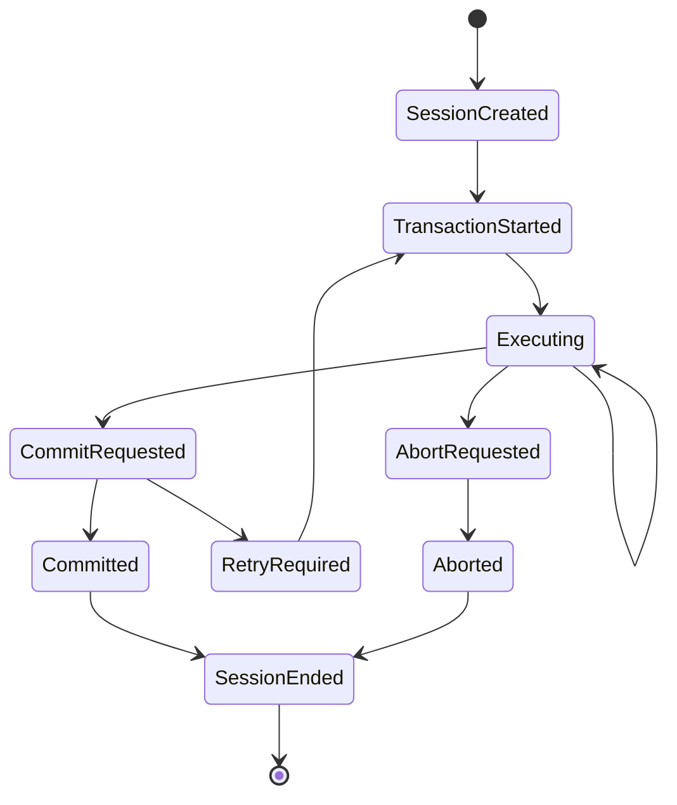
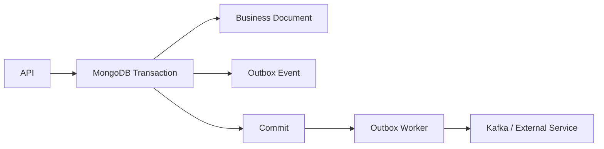

# 17- Transactions

## Overview

MongoDB transactions provide atomicity across multiple database operations. They allow a group of reads and writes to commit as one unit or roll back as a unit when the transaction fails.

MongoDB already provides atomicity for operations against a single document. Transactions become necessary when a business operation must modify multiple documents or collections while preserving a consistent state.

Typical transaction flow:

```text
Application Request
        |
        v
Start Session
        |
        v
Start Transaction
        |
        +---- Read / Write A
        |
        +---- Read / Write B
        |
        +---- Read / Write C
        |
        v
Commit
   |         |
 Success    Failure
   |         |
   v         v
Persist    Abort
changes    changes
```

Transactions should not be the default solution for every multi-step operation. MongoDB's document model is designed so that related data can often be embedded and updated atomically within a single document.

A senior-level design decision is therefore:

```text
Can the operation be modeled as one atomic document update?
        |
       Yes
        |
        v
Prefer single-document atomicity

       No
        |
        v
Are multiple documents required for one business invariant?
        |
       Yes
        |
        v
Evaluate a transaction
```

Transactions introduce additional coordination, resource usage, latency, and failure modes. They should be short, intentional, and designed around clear consistency requirements.

## Single-Document Atomicity

MongoDB provides atomicity for writes affecting a single document.

For example:

```javascript
db.accounts.updateOne(
  {
    _id: ObjectId("68c000000000000000000001"),
    balance: {
      $gte: 100
    }
  },
  {
    $inc: {
      balance: -100
    }
  }
)
```

The update is atomic for that document.

This is often preferable to a transaction.

Consider an order document:

```json
{
  "_id": "ORDER-1001",
  "status": "pending",
  "payment": {
    "status": "pending",
    "amount": 2500
  },
  "items": [
    {
      "product_id": "P100",
      "quantity": 2
    }
  ]
}
```

A state transition such as:

```text
pending → paid
```

can often be represented as one atomic document update.

## Why Transactions Exist

Transactions solve a different problem.

Suppose a bank transfer requires:

```text
Account A balance - ₹1,000
Account B balance + ₹1,000
Transfer status = completed
```

These may involve multiple documents:

```text
accounts/A
accounts/B
transfers/T100
```

Without transactional coordination, a failure between operations could leave an inconsistent state.

```text
Debit A
   ↓
Success
   ↓
Credit B
   ↓
Failure
```

The system could then contain:

```text
A = debited
B = not credited
Transfer = incomplete
```

A transaction allows the application to make the changes atomic.

## MongoDB Transaction Model

A transaction is associated with a session.

Conceptually:

```text
MongoClient
    |
    v
ClientSession
    |
    v
Transaction
    |
    +---- Operation 1
    +---- Operation 2
    +---- Operation 3
    |
    v
Commit / Abort
```

The application controls the transaction lifecycle.

A transaction normally contains:

1. Session creation.
2. Transaction start.
3. Database operations.
4. Commit or abort.
5. Session cleanup.

## Transaction Lifecycle



A transaction is not simply a wrapper around multiple independent operations.

The database must maintain transactional state until the transaction commits or aborts.

## When to Use Transactions

Transactions are appropriate when multiple operations represent one business invariant that must be atomically committed.

Typical examples:

- Financial transfers.
- Inventory reservation across multiple documents.
- Creating related records that must either all exist or none exist.
- Multi-document state transitions.
- Maintaining consistency across related collections.
- Certain workflow state transitions.

Example:

```text
Create order
+
Reserve inventory
+
Create payment record
```

If these operations must succeed or fail together, a transaction may be appropriate.

## When Not to Use Transactions

Do not use a transaction merely because an operation contains multiple database calls.

For example:

```text
Read configuration
+
Write application log
```

does not normally require a transaction.

Likewise:

```text
Update one document
```

does not require a transaction because MongoDB already provides single-document atomicity.

Avoid transactions when:

- Data can be embedded into one document.
- Operations are independent.
- Eventual consistency is acceptable.
- A background workflow is more appropriate.
- The transaction would remain open while calling external services.
- The transaction is used to compensate for poor data modeling.

## Data Modeling Before Transactions

MongoDB's document model should be evaluated before introducing transactions.

Suppose an order and its line items are tightly coupled.

Instead of:

```text
orders
order_items
```

you may model:

```json
{
  "_id": "ORDER-1001",
  "customer_id": "C100",
  "items": [
    {
      "product_id": "P100",
      "quantity": 2,
      "unit_price": 1250
    }
  ],
  "total": 2500
}
```

The order and its items can then often be updated atomically as one document.

Transactions become more useful when the business model genuinely spans independent documents.

## Transactions vs Relational Database Transactions

MongoDB transactions provide ACID transaction semantics across supported transactional operations, including operations across multiple documents and collections.

The conceptual model is familiar to engineers coming from PostgreSQL or other relational systems:

| Concern | MongoDB | Relational Database |
|---|---|---|
| Single-record/document atomicity | Yes | Yes |
| Multi-record transactions | Yes | Yes |
| Commit / abort | Yes | Yes |
| Sessions/connections | Session-based | Connection/transaction-based |
| Document embedding | Native design pattern | Usually modeled with related tables |
| Joins | `$lookup` and application patterns | Native relational joins |
| Schema flexibility | High | Usually schema-defined |
| Primary transaction design tool | Document model + transactions | Tables + transactions |

The important difference is architectural.

MongoDB encourages designing documents around access patterns and atomicity boundaries. Transactions should supplement that model, not turn MongoDB into a relational database by default.

## Sessions

A transaction runs within a client session.

A session provides context for:

- Transaction state.
- Transaction lifecycle.
- Causal consistency behavior where configured.
- Retryable transactional operations.

In PyMongo:

```python
with client.start_session() as session:
    with session.start_transaction():
        ...
```

The same session must be passed to operations that belong to the transaction.

## Starting a Transaction in `mongosh`

A basic transaction can be executed in `mongosh` using a session:

```javascript
const session = db.getMongo().startSession();

const sessionDb = session.getDatabase("banking");

session.startTransaction();

try {
  sessionDb.accounts.updateOne(
    { _id: "A100" },
    { $inc: { balance: -100 } }
  );

  sessionDb.accounts.updateOne(
    { _id: "B100" },
    { $inc: { balance: 100 } }
  );

  session.commitTransaction();
} catch (error) {
  session.abortTransaction();
  throw error;
} finally {
  session.endSession();
}
```

The exact shell APIs available can vary by MongoDB tooling version, so operational scripts should be tested against the deployed environment.

## Commit

A successful transaction ends with commit.

```text
Transaction
    |
    v
All operations successful
    |
    v
Commit
    |
    v
Changes become durable according to configured write concern
```

Applications should not assume that reaching the end of the transaction body means the transaction has successfully committed.

Commit itself can encounter transient failures.

## Abort

Abort discards the transaction's uncommitted changes.

```text
Transaction
    |
    +---- Operation A
    +---- Operation B
    +---- Operation C fails
                |
                v
             Abort
                |
                v
No transaction changes committed
```

Application code should handle errors carefully so that failed business operations do not accidentally continue as if they succeeded.

## Python Transaction Example

A production-style PyMongo transaction can use the callback API:

```python
from pymongo import MongoClient
from pymongo.errors import PyMongoError


def transfer(
    client: MongoClient,
    from_account: str,
    to_account: str,
    amount: int,
) -> None:
    db = client["banking"]
    accounts = db["accounts"]

    with client.start_session() as session:
        try:
            with session.with_transaction():
                source = accounts.update_one(
                    {
                        "_id": from_account,
                        "balance": {"$gte": amount},
                    },
                    {
                        "$inc": {"balance": -amount},
                    },
                    session=session,
                )

                if source.modified_count != 1:
                    raise ValueError("Insufficient balance")

                destination = accounts.update_one(
                    {
                        "_id": to_account,
                    },
                    {
                        "$inc": {"balance": amount},
                    },
                    session=session,
                )

                if destination.modified_count != 1:
                    raise ValueError("Destination account not found")

        except PyMongoError:
            raise
```

The exact helper method and retry semantics should be verified against the PyMongo version used by the application.

The important design principle is that every operation intended to participate in the transaction receives the same session.

## Explicit Transaction Control

Applications can also manage the lifecycle explicitly when more control is required.

```python
with client.start_session() as session:
    session.start_transaction()

    try:
        collection_a.update_one(
            {"_id": "A"},
            {"$set": {"status": "processed"}},
            session=session,
        )

        collection_b.insert_one(
            {
                "reference": "A",
                "status": "created",
            },
            session=session,
        )

        session.commit_transaction()

    except Exception:
        session.abort_transaction()
        raise
```

Explicit control is useful when the application needs custom handling around:

- Retry logic.
- Commit behavior.
- Transaction options.
- Complex workflows.

## Transaction Options

Transaction behavior can be influenced by:

- Read concern.
- Write concern.
- Read preference.
- Max transaction lifetime settings.
- Retry behavior.

Example:

```python
with client.start_session() as session:
    with session.start_transaction(
        read_concern=...,
        write_concern=...,
        read_preference=...,
    ):
        ...
```

The exact configuration should be chosen according to business consistency requirements rather than copied from another application.

## Read Concern

Read concern controls the consistency characteristics of reads.

Common concepts include:

- `local`
- `majority`
- `snapshot`
- `available`

The appropriate options depend on deployment topology and operation type.

For transactional workloads, read concern can affect what data the transaction observes.

### `local`

Reads generally observe data available on the node handling the operation without requiring majority commitment.

This can provide lower latency but weaker durability guarantees.

### `majority`

Reads observe data committed according to the replica-set majority model.

This is useful when applications need stronger guarantees about replicated data.

### `snapshot`

Transactions can use snapshot-style read semantics to provide a consistent view across transactional operations where supported.

This is useful when multiple reads must observe a coherent database state.

## Write Concern

Write concern controls how much acknowledgment the application requires for writes.

Examples:

```text
w: 1
```

and:

```text
w: "majority"
```

A majority write generally provides stronger durability behavior across replica-set members than acknowledging only the primary.

The trade-off can be:

```text
Stronger acknowledgment
        ↓
Potentially higher latency
```

Write concern should be selected based on business requirements.

## Acknowledged vs Unacknowledged Writes

An acknowledged write requires the server to provide confirmation according to the configured write concern.

An unacknowledged write allows the client to continue without waiting for normal server acknowledgment.

For transactional business operations, unacknowledged writes are generally inappropriate because the application needs confirmation of the operation's outcome.

## Read Preference

Read preference controls where reads are routed in replica-set deployments.

Common modes include:

- `primary`
- `primaryPreferred`
- `secondary`
- `secondaryPreferred`
- `nearest`

For transactions, read preference has important constraints and should normally be configured consistently with the transaction's consistency requirements.

A common production principle is:

```text
Strong transactional consistency
        ↓
Prefer primary-oriented transactional access
```

Do not casually route transaction reads to secondaries merely to reduce primary load.

## Transaction Retry Behavior

Distributed systems can experience transient failures such as:

- Primary elections.
- Network interruptions.
- Temporary server errors.
- Write conflicts.
- Commit uncertainty.

MongoDB drivers provide transaction-aware retry mechanisms for supported transient cases.

This creates an important application requirement:

> Transaction bodies must be safe to execute again when the driver retries them.

## Idempotency

Consider:

```text
Charge customer
+
Create payment record
```

If a transaction or commit operation is retried, external side effects must not accidentally occur twice.

Database operations can often be made idempotent with unique business identifiers.

Example:

```javascript
db.payments.createIndex(
  {
    tenant_id: 1,
    idempotency_key: 1
  },
  {
    unique: true
  }
)
```

Then:

```text
Request
   ↓
idempotency_key
   ↓
Transaction
   ↓
Unique database constraint
   ↓
Safe duplicate detection
```

Transactions do not automatically make external side effects idempotent.

## External Services and Transactions

Avoid keeping a transaction open while calling:

- Payment gateways.
- HTTP APIs.
- gRPC services.
- Kafka brokers.
- Email providers.
- External databases.

Bad architecture:

```text
Start transaction
      ↓
MongoDB write
      ↓
HTTP payment API
      ↓
Wait 2 seconds
      ↓
MongoDB write
      ↓
Commit
```

This unnecessarily extends transaction duration.

Prefer an architecture such as:

```text
Application
    |
    v
MongoDB transaction
    |
    v
Persist workflow state / outbox
    |
    v
Commit
    |
    v
Worker
    |
    +---- Payment API
    +---- Kafka
    +---- Email
```

This reduces transaction duration and makes external processing independently retryable.

## Transaction Duration

Transactions should generally be kept short.

Long-running transactions can increase:

- Resource usage.
- Conflict probability.
- Lock/contention effects.
- Replication pressure.
- Application latency.
- Retry probability.

Avoid:

```python
with session.start_transaction():
    expensive_http_call()
    expensive_computation()
    process_large_file()
    mongodb_write()
```

Prefer:

```text
Prepare data
    ↓
Start transaction
    ↓
Small set of MongoDB operations
    ↓
Commit
```

## Transaction Size

Large transactions can be expensive because MongoDB must track transactional state and preserve the necessary consistency guarantees.

Avoid using a transaction as a bulk-processing mechanism for millions of documents.

For large workflows, prefer:

- Batched writes.
- Idempotent processing.
- Background jobs.
- Checkpointing.
- Change streams.
- Kafka.
- Materialized views.
- Explicit workflow state.

## Transaction Performance

Transactions introduce overhead compared with independent single-document operations.

Potential sources include:

- Session management.
- Snapshot/transaction state.
- Coordination.
- Additional network round trips.
- Write concern.
- Conflict detection.
- Commit processing.
- Retry behavior.

For a high-throughput API:

```text
Single atomic update
        ↓
Usually simpler and cheaper

Multi-document transaction
        ↓
Stronger consistency boundary
        +
Additional overhead
```

Use transactions when the consistency requirement justifies the cost.

## Write Conflicts

Concurrent transactions may attempt to modify overlapping data.

Example:

```text
Transaction A
    ↓
Update inventory item P100

Transaction B
    ↓
Update inventory item P100
```

Depending on timing and operation characteristics, one transaction may encounter a write conflict.

Applications should treat transient transaction failures as expected distributed-system behavior rather than as impossible events.

## Transaction Isolation

MongoDB transaction behavior depends on:

- Read concern.
- Write concern.
- Replica-set topology.
- Transaction lifecycle.
- Operation types.

Do not assume that a transaction behaves identically to every PostgreSQL isolation level.

When migrating relational workloads, map the actual business consistency requirement rather than translating transaction code line-for-line.

## Transaction and Atomicity Boundary

A useful architectural decision is to define the atomicity boundary.

Example:

```text
Order
├── customer_id
├── status
├── items[]
└── total
```

If all order state belongs in one document:

```text
Atomicity boundary = Order document
```

If inventory is maintained separately:

```text
Order document
       +
Inventory document
       +
Payment document
```

the consistency boundary may require a transaction or an asynchronous workflow depending on business requirements.

## Transaction Example: Inventory Reservation

Suppose an inventory document is:

```json
{
  "_id": "P100",
  "available": 20,
  "reserved": 5
}
```

A conditional atomic update may be enough:

```javascript
db.inventory.updateOne(
  {
    _id: "P100",
    available: {
      $gte: 2
    }
  },
  {
    $inc: {
      available: -2,
      reserved: 2
    }
  }
)
```

No transaction is required for this single-document invariant.

A transaction becomes relevant if the reservation must atomically update another document:

```text
Inventory
+
Order
+
Reservation
```

## Transaction Example: Order Creation

Suppose an order creation operation requires:

```text
Create order
+
Reserve inventory
+
Create reservation
```

A transaction can establish:

```text
All succeed
    ↓
Commit

Any transactional operation fails
    ↓
Abort
```

However, if payment is an external service, do not place the payment API call inside the transaction.

## Transaction and Outbox Pattern

For reliable integration with Kafka or external workers, an outbox-style design can be useful.



The transaction guarantees that:

```text
Business state
+
Event intent
```

are committed together.

The worker can then publish the event asynchronously.

This avoids the dual-write problem:

```text
MongoDB write succeeds
Kafka publish fails
```

because the event intent is persisted with the business state.

## Transaction and Kafka

A MongoDB transaction does not provide atomicity across MongoDB and Kafka.

This is not atomic:

```text
MongoDB transaction
+
Kafka transaction
```

unless an application architecture explicitly coordinates the two systems and accepts the resulting complexity.

A more common design is:

```text
MongoDB transaction
    ↓
Outbox
    ↓
Worker
    ↓
Kafka
```

The worker should be idempotent.

## Transaction and Redis

Redis operations are not automatically part of a MongoDB transaction.

Do not assume:

```text
MongoDB transaction
+
Redis update
```

will commit atomically.

Prefer:

```text
MongoDB authoritative state
        ↓
Commit
        ↓
Invalidate/update Redis
```

or an event-driven invalidation architecture.

## Transaction and Celery

For background workflows:

```text
API
 ↓
MongoDB transaction
 ↓
Persist job state
 ↓
Commit
 ↓
Celery
 ↓
Process job
```

Avoid sending a Celery task before the transaction commits if the worker might read data that has not yet been committed.

A safer pattern is:

```text
Transaction
   |
   +---- Business state
   |
   +---- Job/outbox state
   |
   ↓
Commit
   |
   ↓
Worker discovers/processes job
```

## Transaction and Change Streams

Change streams observe committed changes.

This makes them useful for downstream processing:

```text
Transaction
   |
   +---- Order
   +---- Reservation
   |
   ↓
Commit
   |
   ↓
Change Stream
   |
   ↓
Worker
```

Consumers should still implement:

- Resume tokens.
- Idempotency.
- Error handling.
- Backpressure.
- Retry behavior.

## Transactions in FastAPI

A clean architecture is:

```text
FastAPI Endpoint
      |
      v
Service Layer
      |
      v
Transaction Boundary
      |
      +---- Repository A
      +---- Repository B
      +---- Repository C
      |
      v
Commit
```

The transaction boundary should generally live in the service layer rather than being scattered across repositories.

Example:

```python
class OrderService:
    def __init__(self, client, orders, inventory):
        self.client = client
        self.orders = orders
        self.inventory = inventory

    def create_order(self, order: dict, product_id: str, quantity: int):
        with self.client.start_session() as session:
            with session.start_transaction():
                result = self.inventory.update_one(
                    {
                        "_id": product_id,
                        "available": {"$gte": quantity},
                    },
                    {
                        "$inc": {
                            "available": -quantity,
                        }
                    },
                    session=session,
                )

                if result.modified_count != 1:
                    raise ValueError("Insufficient inventory")

                self.orders.insert_one(
                    order,
                    session=session,
                )
```

The endpoint should not manage low-level transaction details.

## FastAPI Async Considerations

PyMongo's synchronous API should not be used indiscriminately inside an async FastAPI request path if it can block the event loop.

Architecture should distinguish:

```text
FastAPI async endpoint
        |
        +---- Async MongoDB driver
```

from:

```text
FastAPI endpoint
        |
        +---- Synchronous PyMongo
```

If synchronous database access is used, it must be integrated in a way that does not block the application's async event loop.

Driver selection should follow the current MongoDB/Python driver support available for the application's deployment.

## Transactions in Django

For Django applications using MongoDB through PyMongo or MongoDB-specific libraries, transaction management should remain explicit.

A practical architecture is:

```text
Django View
    |
    v
Service
    |
    v
Transaction Boundary
    |
    +---- Repository
    +---- Repository
    |
    v
MongoDB
```

Do not assume Django's native relational `transaction.atomic()` semantics automatically apply to a PyMongo-based MongoDB integration.

The MongoDB driver/session must participate explicitly.

## Error Handling

Transaction code should distinguish between:

- Business validation errors.
- Duplicate-key errors.
- Transient transaction errors.
- Network failures.
- Commit uncertainty.
- Permanent database errors.

Example:

```python
try:
    with client.start_session() as session:
        with session.with_transaction():
            perform_business_operations(session)
except ValueError:
    # Business rule failure.
    raise
except Exception:
    # Log transaction failure with correlation context.
    raise
```

Production code should avoid catching every exception and silently converting it into success.

## Commit Uncertainty

A particularly important distributed-systems issue is uncertainty around commit.

Consider:

```text
Application
    |
    | commit
    v
MongoDB
    |
    | commit succeeds
    v
Network failure
    |
    v
Application does not receive response
```

The application may not know whether the transaction committed.

This is why blindly retrying a business operation can be dangerous.

Use driver-supported transaction retry mechanisms and idempotent business identifiers rather than inventing simplistic retry logic.

## Retryable Transactions

A transaction may need to be retried after transient failures.

Conceptually:

```text
Transaction attempt
      |
      v
Transient error?
   /       \
 Yes       No
 |          |
 v          v
Retry     Commit
 |
 v
New attempt
```

The transaction body must therefore be safe for retry.

Avoid non-idempotent external side effects inside the transaction.

## Transaction and Unique Constraints

Unique indexes are useful for enforcing business invariants during transactions.

Example:

```javascript
db.reservations.createIndex(
  {
    tenant_id: 1,
    order_id: 1
  },
  {
    unique: true
  }
)
```

A transaction attempting to create a duplicate reservation can fail cleanly.

Database constraints should complement application validation.

## Transaction and Schema Validation

Schema validation can still apply to documents written within a transaction.

A transaction does not bypass document validation rules.

This creates multiple layers:

```text
API validation
      ↓
Service validation
      ↓
MongoDB schema validation
      ↓
Transaction
      ↓
Persistent state
```

The database should enforce important invariants that must not depend solely on application correctness.

## Transaction Security

Transactions do not bypass MongoDB authorization.

The authenticated MongoDB user still requires appropriate permissions for:

- Reading collections.
- Inserting documents.
- Updating documents.
- Deleting documents.

Use least privilege.

Do not give application accounts administrative database roles merely because the application uses transactions.

## Transaction Monitoring

Monitor:

- Transaction latency.
- Commit latency.
- Abort rate.
- Retry rate.
- Write conflicts.
- Transaction duration.
- Transaction volume.
- Database CPU.
- Memory.
- Connection utilization.
- Replication lag.
- Application timeouts.

A useful metric set is:

```text
transaction_attempts
transaction_commits
transaction_aborts
transaction_retries
transaction_duration
commit_duration
```

Break these down by service and operation type.

## Transaction Logging

Application logs should include:

- Request/correlation ID.
- Transaction operation name.
- Tenant where appropriate.
- Duration.
- Retry count.
- Outcome.
- Error classification.

Avoid logging sensitive data such as:

- Passwords.
- Access tokens.
- Payment credentials.
- Full personal records.

Example structured log:

```json
{
  "event": "mongodb_transaction",
  "operation": "create_order",
  "duration_ms": 42,
  "retry_count": 0,
  "outcome": "committed"
}
```

## Production Transaction Checklist

Before introducing a transaction:

- [ ] Identify the exact business invariant.
- [ ] Determine whether one-document atomicity can solve it.
- [ ] Identify all documents involved.
- [ ] Keep the transaction boundary minimal.
- [ ] Avoid external network calls inside the transaction.
- [ ] Define read concern requirements.
- [ ] Define write concern requirements.
- [ ] Define read preference appropriately.
- [ ] Implement retry-safe logic.
- [ ] Design idempotency where necessary.
- [ ] Ensure required indexes exist.
- [ ] Validate duplicate-key behavior.
- [ ] Monitor commit and abort rates.
- [ ] Test primary failover scenarios.
- [ ] Test transient failures.
- [ ] Test transaction timeout behavior.
- [ ] Load-test realistic concurrency.
- [ ] Document the transaction boundary.

## Performance Optimization

### Keep Transactions Short

Bad:

```text
Start transaction
    ↓
Read many documents
    ↓
Call external API
    ↓
Process large dataset
    ↓
Write many documents
    ↓
Commit
```

Better:

```text
Prepare data
    ↓
Start transaction
    ↓
Small number of targeted operations
    ↓
Commit
```

### Index Transaction Queries

Every query inside a transaction should have an appropriate access path.

For example:

```javascript
db.inventory.createIndex({
  product_id: 1,
  available: 1
})
```

The transaction itself does not compensate for an inefficient query.

### Avoid Large Reads

Do not load thousands of documents into a transaction when the business operation can be expressed as:

```javascript
updateOne(...)
```

or:

```javascript
updateMany(...)
```

with appropriate predicates.

### Reduce Round Trips

Prefer operations that minimize network communication where correctness allows it.

Bulk operations can sometimes reduce round trips, although transaction semantics and failure handling must be considered carefully.

## Transaction Anti-Patterns

### Transaction for Every Request

Not every API endpoint needs a transaction.

For example:

```text
GET /products
```

does not need a transaction simply because MongoDB is involved.

### Transaction Around Independent Operations

This:

```text
Update analytics
+
Update cache
+
Write log
```

may not require one transaction if the operations do not represent one atomic business invariant.

### External API Calls Inside Transactions

Avoid:

```text
MongoDB transaction
    ↓
HTTP API
    ↓
Kafka
    ↓
Email
    ↓
Commit
```

External systems cannot participate in MongoDB's transaction automatically.

### Long Transactions

Long transactions increase operational risk and resource usage.

### Using Transactions to Compensate for Poor Modeling

If every request requires a transaction across five collections, reconsider the data model.

MongoDB often benefits from embedding tightly coupled state.

## Troubleshooting Methodology

### Transaction Aborts

```text
Symptom
↓
Transaction frequently aborts
↓
Possible causes
- Write conflicts
- Validation errors
- Duplicate keys
- Transaction timeout
- Transient topology failure
- Application exception
↓
Isolation strategy
- Classify error
- Inspect transaction logs
- Check retry count
- Check database health
- Check query performance
↓
Diagnostic commands
```

```javascript
db.serverStatus()
```

```javascript
db.currentOp()
```

Use additional deployment-specific monitoring and MongoDB diagnostics as appropriate.

```text
Root cause
↓
Identify database or application failure
↓
Corrective action
- Fix conflict pattern
- Improve indexes
- Shorten transaction
- Handle retryable errors
- Fix business validation
↓
Prevention
- Transaction metrics
- Failure testing
- Load testing
- Retry-safe design
```

### Transaction Timeout

```text
Symptom
↓
Transaction exceeds configured lifetime
↓
Possible causes
- Too many operations
- Slow queries
- Large reads
- External calls
- Database contention
↓
Isolation strategy
- Measure each operation
- Run explain() on transaction queries
- Inspect application timing
↓
Corrective action
- Reduce transaction scope
- Optimize indexes
- Move external work outside
- Batch processing
↓
Prevention
- Transaction duration monitoring
- Performance regression tests
```

### Duplicate-Key Failure

```text
Symptom
↓
Transaction fails with duplicate-key error
↓
Possible causes
- Concurrent request
- Repeated operation
- Missing idempotency handling
↓
Isolation strategy
- Identify unique index
- Inspect business identifier
- Inspect retry behavior
↓
Corrective action
- Make operation idempotent
- Handle duplicate as expected business state
- Correct request retry behavior
↓
Prevention
- Unique constraints
- Idempotency keys
- Concurrency tests
```

### Unexpected Duplicate Business Effect

```text
Symptom
↓
Business operation appears to happen twice
↓
Possible causes
- Application retry
- Transaction retry
- Client retry
- External side effect inside transaction
↓
Isolation strategy
- Trace request ID
- Inspect transaction attempts
- Inspect external service calls
↓
Corrective action
- Remove external side effect from transaction
- Add idempotency
- Use outbox/event-driven processing
↓
Prevention
- Retry-safe design
- Idempotency tests
- Distributed tracing
```

## Failure Testing

Transactions should be tested under failure conditions.

Test scenarios such as:

- Primary step-down.
- Network interruption.
- Duplicate-key failure.
- Write conflict.
- Validation failure.
- Transaction timeout.
- Application process termination.
- Connection interruption.
- Retry during commit.
- Worker restart.

The goal is to verify not only:

```text
Happy path
```

but also:

```text
Failure
+
Retry
+
Recovery
+
Idempotency
```

## Disaster Recovery Considerations

Transactions protect atomicity; they do not replace backups.

A transaction can guarantee:

```text
All changes commit
or
None commit
```

but it cannot protect against:

- Accidental deletion.
- Corrupted application logic.
- Data corruption.
- Operator error.
- Complete infrastructure loss.

Production systems still require:

- Backups.
- Restore testing.
- Replication.
- Disaster-recovery procedures.
- Defined RPO.
- Defined RTO.

## Architecture Decision Guide

| Requirement | Preferred approach |
|---|---|
| Update one document atomically | Single-document operation |
| Update related embedded state | Single-document operation |
| Modify independent documents atomically | Transaction |
| Publish event with database state | Transaction + outbox |
| Call external payment API | Outside MongoDB transaction |
| Large background processing | Batch/job workflow |
| Cache update | Post-commit invalidation/update |
| Kafka integration | Outbox/change-stream/event workflow |
| Temporary derived state | Eventual consistency where acceptable |
| Enforce uniqueness | Unique index |
| Enforce document shape | Schema validation |

## Interview Traps

### Does MongoDB require transactions for every multi-step operation?

No.

First determine whether the data can be modeled within a single document or whether eventual consistency is acceptable.

### Is a single-document update atomic?

Yes. MongoDB provides atomicity for operations on a single document.

### Does a transaction make external API calls atomic?

No.

MongoDB cannot automatically roll back an HTTP request, Kafka publication, Redis operation, or external payment.

### Should transactions contain long-running business logic?

No.

Keep transactional database operations short and move external or expensive work outside the transaction.

### What is the role of a session?

The session provides the context in which transactional operations execute.

### Does a transaction automatically guarantee durability?

The resulting durability depends on the configured write concern and deployment behavior.

### Can a transaction be retried?

Supported transient transaction failures can be retried using driver-supported transaction mechanisms. Application logic must be designed to tolerate repeated transaction attempts.

### Why is idempotency important with transactions?

Because retries can cause the same logical transaction body to execute more than once.

### Should MongoDB transactions be treated exactly like PostgreSQL transactions?

No.

The transaction mechanism is similar conceptually, but MongoDB's document model, read/write concerns, replication architecture, and data-modeling strategy differ.

### Can a transaction solve poor schema design?

No.

If an application constantly requires large cross-collection transactions, reconsider the data model and access patterns.

## Key Takeaways

- MongoDB provides atomic single-document operations by default; use multi-document transactions only when a business invariant genuinely spans multiple documents or collections.
- Transactions are session-based and should be short, targeted, retry-safe, and built around explicit read concern, write concern, and consistency requirements.
- Never rely on a MongoDB transaction to make external HTTP, Kafka, Redis, payment, or other side effects atomic; use idempotency, outbox patterns, or event-driven workflows instead.
- Transaction performance depends heavily on query efficiency, transaction duration, contention, network behavior, and replication topology, so transaction operations require the same indexing and performance discipline as normal queries.
- Production transaction design must account for transient failures, commit uncertainty, retries, unique constraints, observability, failover testing, backups, and disaster recovery rather than treating commit/abort as the only failure cases.