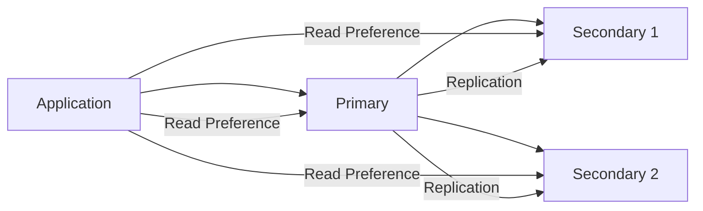
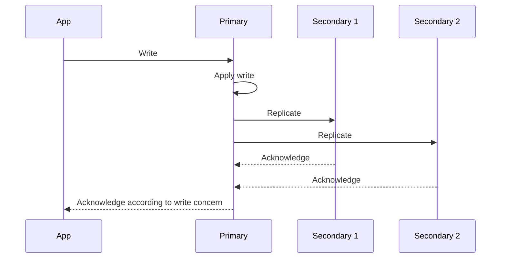

# 18- Write Concerns and Read Concerns

## Overview

MongoDB's consistency and durability behavior is controlled through three closely related concepts:

- **Read concern** — controls the consistency and visibility guarantees of reads.
- **Write concern** — controls the acknowledgment and durability guarantees of writes.
- **Read preference** — controls which replica-set members are eligible to serve reads.

These settings become especially important in replica sets, transactions, high-availability systems, and geographically distributed deployments.

A useful mental model is:

```text
                    MongoDB Client
                         |
             +-----------+-----------+
             |                       |
             v                       v
       Write Operation          Read Operation
             |                       |
             v                       v
      Write Concern             Read Concern
             |                       |
             v                       v
   "When is the write          "What version/state
      acknowledged?"              may I observe?"
             |                       |
             +-----------+-----------+
                         |
                         v
                  Read Preference
                         |
                         v
              "Which node may serve
                    the read?"
```

These settings solve different problems and should not be treated as interchangeable.

For production systems, the important questions are:

```text
How much durability does this write require?
How consistent must this read be?
Which replica-set member can serve the read?
What happens during failover?
What latency is acceptable?
What happens if the network breaks?
```

The correct configuration depends on the business invariant rather than simply choosing the strongest setting everywhere.

## Read Concern vs Write Concern vs Read Preference

| Setting | Controls | Primary question |
|---|---|---|
| Read concern | Read consistency | What data can this read observe? |
| Write concern | Write acknowledgment/durability | When should the write be considered acknowledged? |
| Read preference | Read routing | Which replica-set member can serve the read? |

For example:

```text
writeConcern = majority
```

does not mean:

```text
readConcern = majority
```

Likewise:

```text
readPreference = secondaryPreferred
```

does not define the durability of writes.

## Replica Set Context

Read and write concerns become particularly important with replica sets.

A simplified topology is:



The primary normally receives writes.

Secondaries replicate the primary's operations.

This means that a write can exist on the primary before it is replicated to a majority of voting members.

That distinction is central to understanding write concern.

## Write Concern

Write concern determines the level of acknowledgment requested for a write operation.

Conceptually:

```text
Application
    |
    | write
    v
MongoDB Primary
    |
    +---- Local persistence
    |
    +---- Replication
    |
    v
Acknowledgment according to write concern
```

A write concern does not merely answer whether the server accepted a request. It determines what conditions must be satisfied before the driver considers the write acknowledged.

## Write Concern Options

Common write concern components include:

- `w`
- `j`
- `wtimeout`

Example:

```javascript
{
  w: "majority"
}
```

or:

```javascript
{
  w: 1,
  j: true
}
```

The exact durability semantics depend on the deployment topology and storage configuration.

## `w: 1`

`w: 1` requests acknowledgment from the primary after the write has been accepted.

Conceptually:

```text
Application
    |
    v
Primary
    |
    | acknowledge
    v
Application

Secondary replication
may still be in progress
```

This can provide lower latency than waiting for majority acknowledgment.

It is appropriate for workloads where:

- Low write latency is important.
- Temporary loss of the latest acknowledged writes is acceptable under certain failure scenarios.
- The application does not require majority acknowledgment.

It is not equivalent to majority durability.

## `w: "majority"`

A majority write concern requests acknowledgment after the write has been committed according to the replica-set majority model.

Conceptually:

```text
             Primary
                |
        +-------+-------+
        |               |
   Secondary 1      Secondary 2
        |
        +---- Majority acknowledgment
```

For a typical three-member voting replica set, majority means at least two voting members have acknowledged the operation according to MongoDB's majority commit rules.

This is commonly appropriate for important business state where losing an acknowledged write during a primary failure is unacceptable.

Typical examples:

- Financial state.
- Orders.
- Inventory changes.
- User account changes.
- Workflow state.
- Important configuration.

## `j: true`

The `j` option requests journal acknowledgment.

```javascript
{
  w: 1,
  j: true
}
```

This asks for acknowledgment after the write has been committed to the journal according to the server's journaling behavior.

It should not be confused with replication to a majority.

For example:

```text
w: 1, j: true

Primary journal
      |
      v
Acknowledgment

Secondaries may still be behind
```

Whereas:

```text
w: "majority"

Primary
 +
Majority of voting members
      |
      v
Acknowledgment
```

For modern production replica sets, `w: "majority"` is often more relevant when the requirement is protection against primary failure.

## `wtimeout`

`wtimeout` limits how long the server waits for the requested write concern to be satisfied.

Example:

```javascript
{
  w: "majority",
  wtimeout: 5000
}
```

This means the application should not wait indefinitely for the requested acknowledgment condition.

A timeout does not necessarily mean that the write did not occur.

This distinction is critical:

```text
Write sent
    |
    v
Write may have been accepted
    |
    v
Acknowledgment condition not satisfied in time
    |
    v
Application receives timeout
```

Therefore, application retry logic must not blindly assume:

```text
timeout = write did not happen
```

## Acknowledged vs Unacknowledged Writes

An acknowledged write asks MongoDB to confirm the requested write concern.

An unacknowledged write uses:

```javascript
{
  w: 0
}
```

The client does not wait for normal write acknowledgment.

Conceptually:

```text
Application
    |
    | write
    v
MongoDB

Application continues immediately
```

This can reduce client-side latency but provides weaker error visibility.

Potential failures may include:

- Invalid operations.
- Network problems.
- Server-side write failures.
- Duplicate-key errors.

For important business writes, unacknowledged writes are generally inappropriate.

They can sometimes be considered for workloads where occasional loss is acceptable and the application deliberately prioritizes throughput.

## Write Concern Trade-Offs

| Write concern | Latency | Durability/acknowledgment | Typical use |
|---|---:|---|---|
| `w: 0` | Lowest | Minimal acknowledgment | Non-critical telemetry |
| `w: 1` | Low | Primary acknowledgment | General workloads |
| `w: 1, j: true` | Higher | Journal acknowledgment | Stronger local durability requirement |
| `w: "majority"` | Potentially higher | Majority acknowledgment | Important business state |

These are not absolute performance guarantees. Actual latency depends on hardware, topology, network distance, storage, replication lag, and workload.

## Read Concern

Read concern controls the consistency and visibility guarantees associated with reads.

A useful mental model is:

```text
Data exists somewhere in the deployment
        |
        +---- Is it locally visible?
        |
        +---- Is it majority committed?
        |
        +---- Is a transaction snapshot required?
```

Read concern determines which state the operation is allowed to observe.

## `local` Read Concern

`local` allows reads to return data that is available on the node serving the operation, without requiring majority commitment.

This generally favors lower latency and availability.

For a primary:

```text
Write reaches primary
       |
       v
Primary can expose local state
       |
       v
Read with local concern
```

The data may not yet be majority committed.

This can be useful for:

- Operational dashboards.
- Non-critical reads.
- Workloads where the latest locally available state is acceptable.

## `majority` Read Concern

`majority` reads only data that is committed according to the replica-set majority model.

Conceptually:

```text
Primary
   |
   +---- Secondary 1
   |
   +---- Secondary 2
   |
   v
Majority commit point
   |
   v
Read with majority concern
```

This is useful when an application should avoid observing data that could subsequently be rolled back due to a primary failure.

Typical use cases include:

- Important business reads.
- Consistency-sensitive workflows.
- Systems where rollback visibility is undesirable.

## `snapshot` Read Concern

`snapshot` provides snapshot-style transactional reads.

It is particularly relevant to multi-document transactions where several operations need a consistent view of data.

Example:

```text
Transaction
    |
    +---- Read A
    |
    +---- Read B
    |
    +---- Read C
          |
          v
Consistent transactional view
```

Snapshot semantics are not a generic replacement for `majority` reads.

Use them when the transaction's consistency requirements justify them.

## `available` Read Concern

`available` provides very weak consistency guarantees and can allow reads to return the most readily available data.

It is mainly relevant to specific deployments and workloads where availability and latency matter more than strong consistency.

It should not be selected casually for business-critical reads.

## Read Concern Comparison

| Read concern | General guarantee | Typical use |
|---|---|---|
| `local` | Locally available data | Low-latency operational reads |
| `majority` | Majority-committed data | Consistency-sensitive reads |
| `snapshot` | Consistent transactional snapshot | Multi-document transactions |
| `available` | Availability-oriented reads | Specialized workloads |

The exact behavior depends on deployment topology and operation context.

## Read Preference

Read preference answers a different question:

> Which replica-set member should serve the read?

Common modes include:

- `primary`
- `primaryPreferred`
- `secondary`
- `secondaryPreferred`
- `nearest`

Read preference is primarily about routing and topology, not durability.

## Primary Read Preference

```text
readPreference = primary
```

Reads are directed to the primary.

Architecture:

```text
             +----------------+
             |   Application  |
             +-------+--------+
                     |
                     v
                  Primary
                 /       \
                v         v
          Secondary    Secondary
```

This is the simplest model for strongly consistent application behavior when combined with appropriate read concern.

It is common for:

- User-facing APIs.
- Read-after-write workflows.
- Financial operations.
- Transactional application logic.

## Primary Preferred

`primaryPreferred` prefers the primary but can allow a secondary when the primary is unavailable according to the driver's selection behavior.

This can improve availability for certain read workloads but may introduce stale reads.

## Secondary

`secondary` directs reads to secondary members.

This can reduce read pressure on the primary:

```text
Application
    |
    +---- Writes ---> Primary
    |
    +---- Reads ----> Secondary
```

The major trade-off is replication lag.

A secondary may not yet contain the latest primary state.

## Secondary Preferred

`secondaryPreferred` prefers secondaries but can fall back to the primary when appropriate.

This is useful for workloads that prioritize distributing read traffic while maintaining a fallback path.

It should not be used when every read must observe the latest state.

## Nearest

`nearest` selects an eligible member with suitable network latency.

This can be useful for geographically distributed deployments.

However:

```text
Nearest node
    !=
Latest data
```

Network proximity does not imply replication freshness.

## Read Preference Comparison

| Read preference | Preferred node | Main benefit | Main risk |
|---|---|---|---|
| `primary` | Primary | Strong application consistency | Primary read load |
| `primaryPreferred` | Primary | Primary-first with fallback | Potential stale reads |
| `secondary` | Secondary | Offload primary | Replication lag |
| `secondaryPreferred` | Secondary | Read scaling + fallback | Potential stale reads |
| `nearest` | Lowest-latency eligible member | Geographic latency optimization | Potentially stale data |

## The Three Settings Together

A production read is better understood as:

```text
                Read Operation
                      |
          +-----------+-----------+
          |                       |
          v                       v
    Read Preference          Read Concern
          |                       |
          v                       v
   Which node?              What data?
          |                       |
          +-----------+-----------+
                      |
                      v
                Returned data
```

For example:

```text
readPreference = secondaryPreferred
readConcern = local
```

means:

```text
Prefer a secondary
+
Return locally available data
```

This can be appropriate for dashboards or reporting.

By contrast:

```text
readPreference = primary
readConcern = majority
```

means:

```text
Read from primary
+
Require majority-committed data
```

This provides stronger consistency expectations.

## Read-After-Write Consistency

Consider:

```text
POST /orders
    |
    v
Write order
    |
    v
GET /orders/{id}
```

If the write goes to the primary and the subsequent read goes to a lagging secondary:

```text
Write ---> Primary
             |
             | replication pending
             v
         Secondary

Read ---> Secondary
             |
             v
        Order not found
```

The application may observe an apparent inconsistency immediately after a successful write.

For read-after-write workflows, common approaches include:

- Reading from the primary.
- Using appropriate consistency/session semantics.
- Avoiding unnecessary secondary reads for consistency-sensitive requests.

## Stale Reads

A secondary can lag behind the primary.

Example:

```text
Primary
  version = 105

Secondary
  version = 102
```

A read from the secondary may return version 102.

This is not necessarily a MongoDB failure.

It is a consequence of asynchronous replication and the chosen read-routing policy.

Applications using secondary reads should explicitly tolerate stale data.

## Replication Lag

Replication lag can be caused by:

- High write throughput.
- Slow secondary storage.
- CPU saturation.
- Network latency.
- Large write bursts.
- Long-running operations.
- Resource contention.

Architecture:

```text
Primary
   |
   | high write rate
   v
Oplog
   |
   +------------------+
   |                  |
   v                  v
Secondary A       Secondary B
   |
   | lag
   v
Older state
```

Monitor lag before relying heavily on secondary reads.

## Read Preference Does Not Override Read Concern

Consider:

```text
readPreference = secondary
readConcern = majority
```

The read is routed toward a secondary, but the read concern still controls which committed state can be observed.

Do not reason about these settings as one combined "consistency level."

They solve different dimensions of the problem.

## Write Concern and Replication

A write is initially processed by the primary.

Replication then propagates the operation through the replica set.



With `w: 1`, the acknowledgment does not require a majority.

With `w: "majority"`, the acknowledgment waits for the majority requirement.

## Failure Scenarios

### Primary Failure After `w: 1`

Consider:

```text
Application
    |
    v
Primary
    |
    | write acknowledged
    v
Application

Replication not yet completed
    |
    v
Primary fails
```

Depending on the exact timing and failure, the acknowledged write may not survive a failover.

This is one reason majority acknowledgment matters for important data.

### Primary Failure After Majority Acknowledgment

With a suitable replica-set configuration:

```text
Write
  |
  v
Primary + majority
  |
  v
Acknowledged
  |
  v
Primary failure
  |
  v
New primary
  |
  v
Majority-committed state remains available
```

This provides a stronger durability property.

## Rollback

Rollback can occur when a former primary contains writes that were not committed to the required majority and then loses leadership.

For example:

```text
Old Primary
    |
    +---- Write X
    |
    +---- Not majority committed
    |
    v
Primary fails
    |
    v
New Primary elected
    |
    v
Write X may be rolled back
```

This is an important reason to understand the distinction between:

```text
Accepted by primary
```

and:

```text
Majority committed
```

## Majority and Availability

Majority write concern improves durability guarantees but can affect availability.

Suppose a three-member replica set has:

```text
Primary
Secondary A
Secondary B
```

If both secondaries become unavailable, the primary may not be able to satisfy a majority acknowledgment.

This creates a trade-off:

```text
Higher durability guarantee
        ↕
Potentially lower write availability
```

The correct choice depends on business requirements.

## Geographic Deployments

Consider a deployment across regions:

```text
Region A
  Primary
     |
     +------------------+
     |                  |
     v                  v
Region B            Region C
Secondary           Secondary
```

Majority acknowledgment can be affected by network latency and topology.

If the majority required for acknowledgment spans regions, write latency can increase.

Production design should consider:

- Region placement.
- Voting-member placement.
- Network latency.
- Failure domains.
- Election behavior.
- RPO requirements.
- RTO requirements.

## Write Concern and RPO

Write concern influences how much recently acknowledged data can potentially be lost during certain failures.

Conceptually:

```text
Lower acknowledgment guarantee
        ↓
Potentially greater acknowledged-data loss
        ↓
Lower latency

Higher acknowledgment guarantee
        ↓
Stronger durability
        ↓
Potentially higher latency
```

RPO should therefore influence write-concern decisions.

## Read Concern and Consistency Requirements

Different endpoints may require different consistency models.

| Workload | Typical approach |
|---|---|
| Payment status | Primary + strong consistency requirements |
| Order creation response | Primary/read-your-write semantics |
| Product catalog | Primary or secondary depending on freshness needs |
| Analytics dashboard | Secondary/secondaryPreferred may be appropriate |
| Operational metrics | Local reads may be sufficient |
| Financial reconciliation | Strong consistency requirements |
| Search-like experience | Stale reads may be acceptable |

These are architectural examples, not universal defaults.

## Transactions

Read and write concerns are particularly important inside transactions.

A transaction can specify appropriate:

- Read concern.
- Write concern.
- Read preference.

Conceptually:

```text
Transaction
    |
    +---- Read concern
    |
    +---- Write concern
    |
    +---- Read preference
    |
    v
Consistency + durability behavior
```

For example, a consistency-sensitive transaction may use majority-oriented guarantees.

Transaction configuration should be selected according to the business invariant.

## Python Configuration

With PyMongo, client-level defaults can be configured and overridden where appropriate.

```python
from pymongo import MongoClient, ReadPreference, WriteConcern
from pymongo.read_concern import ReadConcern

client = MongoClient(
    "mongodb://mongo-1,mongo-2,mongo-3/?replicaSet=rs0",
    read_preference=ReadPreference.PRIMARY,
    w="majority",
    retryWrites=True,
)

db = client.get_database(
    "orders",
    read_concern=ReadConcern("majority"),
)
```

Application code should avoid scattering consistency configuration throughout repositories.

Prefer a centralized configuration strategy with explicit overrides only when a workload has a documented reason.

## Per-Operation Configuration

Different operations can require different policies.

For example:

```python
orders = db.get_collection(
    "orders",
    write_concern=WriteConcern(w="majority"),
)
```

For a reporting workload:

```python
from pymongo import ReadPreference

reports = db.get_collection(
    "orders",
    read_preference=ReadPreference.SECONDARY_PREFERRED,
)
```

The exact API should match the PyMongo version used by the application.

## FastAPI Architecture

A production FastAPI service should centralize MongoDB client configuration.

```text
FastAPI
   |
   v
MongoClient
   |
   +---- Primary
   +---- Secondary
   +---- Secondary
```

Example configuration:

```python
from pymongo import MongoClient, ReadPreference

client = MongoClient(
    settings.mongodb_uri,
    read_preference=ReadPreference.PRIMARY,
    w="majority",
    retryWrites=True,
    serverSelectionTimeoutMS=5_000,
    connectTimeoutMS=5_000,
)
```

Application-specific read routing can then be introduced deliberately.

Avoid creating a new `MongoClient` for every request.

## Connection Pooling

`MongoClient` manages connection pooling.

Bad:

```python
def get_database():
    client = MongoClient(MONGODB_URI)
    return client["orders"]
```

called for every request.

Prefer:

```python
client = MongoClient(MONGODB_URI)

db = client["orders"]
```

and reuse the client throughout the application process.

This reduces connection establishment overhead and provides predictable resource management.

## Django Architecture

For Django applications using PyMongo, consistency settings should be part of the MongoDB integration layer.

```text
Django View
    |
    v
Service
    |
    v
MongoDB Repository
    |
    +---- Write Concern
    +---- Read Concern
    +---- Read Preference
    |
    v
MongoDB Replica Set
```

Do not assume Django's relational database configuration automatically maps to MongoDB consistency semantics.

The MongoDB driver remains responsible for MongoDB-specific behavior.

## Microservices

Different services may have different consistency requirements.

For example:

```text
Order Service
    |
    +---- Majority writes
    +---- Primary reads

Analytics Service
    |
    +---- SecondaryPreferred reads
    +---- Stale data acceptable
```

This can be a valid architecture when the business explicitly tolerates different consistency models.

The important requirement is to document those assumptions.

## REST and gRPC Services

Consistency settings should generally be chosen based on the operation's semantics rather than whether the API uses REST or gRPC.

For example:

```text
POST /payments
        |
        v
Majority write

GET /analytics
        |
        v
SecondaryPreferred read
```

Likewise:

```text
gRPC CreateOrder
        |
        v
Strong write concern

gRPC GetDashboard
        |
        v
Read-scaled consistency
```

The transport protocol does not determine MongoDB consistency requirements.

## Redis Interaction

Redis caching introduces another consistency layer.

Consider:

```text
MongoDB
   |
   v
Redis Cache
```

If MongoDB accepts a write but Redis still contains the previous value:

```text
MongoDB = new state
Redis   = old state
```

Read/write concern configuration does not automatically synchronize Redis.

A common architecture is:

```text
Write
  |
  v
MongoDB
  |
  v
Commit
  |
  v
Invalidate cache
```

For critical workflows, cache invalidation should be designed as part of the application's consistency model.

## Kafka Interaction

MongoDB write concern does not make Kafka publication atomic.

Avoid assuming:

```text
MongoDB majority write
+
Kafka publish
=
atomic operation
```

These are independent systems.

For reliable integration:

```text
MongoDB transaction
    |
    +---- Business state
    |
    +---- Outbox
    |
    v
Commit
    |
    v
Outbox publisher
    |
    v
Kafka
```

## Security Considerations

Read and write concerns are not authorization controls.

A user with read access can still potentially read data according to the configured consistency behavior.

Security should separately enforce:

- Authentication.
- Authorization.
- Least privilege.
- TLS.
- Network restrictions.
- Secret management.
- Auditing where required.

Do not use read preference as a security mechanism.

For example:

```text
secondary reads
```

does not mean:

```text
less privileged reads
```

## Monitoring

Production monitoring should track consistency-related behavior.

Important metrics include:

- Replication lag.
- Write latency.
- Majority commit latency.
- Read latency.
- Connection utilization.
- Primary elections.
- Secondary health.
- Transaction aborts.
- Write errors.
- Read errors.
- Timeout rates.

A useful operational relationship is:

```text
Replication lag
       ↓
Secondary freshness decreases
       ↓
Secondary-read staleness risk increases
```

## Alerting

Useful alerts include:

| Condition | Why it matters |
|---|---|
| High replication lag | Secondary reads may become stale |
| Majority write latency increase | Commit latency may affect APIs |
| Frequent elections | Cluster instability |
| Write concern timeouts | Durability requirement cannot be satisfied promptly |
| Connection saturation | Application capacity issue |
| Secondary unavailable | Reduced redundancy/read capacity |
| Increased read latency | Query or topology issue |

Thresholds should be based on the application's SLOs and deployment characteristics rather than arbitrary universal values.

## Performance Considerations

Stronger consistency can increase latency.

For example:

```text
w: 1
```

may require less acknowledgment coordination than:

```text
w: "majority"
```

Likewise:

```text
primary
```

may have different latency characteristics from:

```text
nearest
```

or:

```text
secondaryPreferred
```

Performance should be measured in the real deployment.

Do not optimize consistency settings before measuring:

- P50 latency.
- P95 latency.
- P99 latency.
- Replication lag.
- Write throughput.
- Read throughput.
- Error rate.

## Cost Considerations

Consistency choices can affect infrastructure cost indirectly.

For example:

```text
Read scaling
    ↓
More secondary capacity
    ↓
Higher infrastructure cost
```

Likewise:

```text
Cross-region majority acknowledgment
    ↓
Higher network dependency
    ↓
Potentially higher latency and network cost
```

Read preference should therefore be considered together with capacity planning and geographic architecture.

## Production Configuration Principles

A practical production baseline for important business data is often:

```text
Writes:
    majority acknowledgment

Transactional reads:
    primary-oriented / transaction-appropriate concern

General application reads:
    primary unless stale reads are explicitly acceptable

Analytics/reporting:
    secondary or secondaryPreferred where appropriate
```

This is a starting architecture, not a universal configuration.

The correct configuration should be derived from:

```text
Business consistency
+
Durability requirement
+
Latency SLO
+
Failure model
+
Topology
+
Cost
```

## Common Mistakes

### Treating `w: 1` as Majority Durability

`w: 1` acknowledges the primary's write without requiring majority acknowledgment.

Use majority when the business requires stronger replica-set durability semantics.

### Assuming `w: "majority"` Means Zero Data Loss

Majority acknowledgment protects against specific failure scenarios, but it does not replace backups or disaster recovery.

It does not protect against:

- Accidental deletion.
- Malicious writes.
- Application bugs.
- Logical corruption.
- Operator mistakes.

### Using Secondary Reads Without Considering Lag

Secondary reads can return stale data.

Before using them, explicitly define the acceptable staleness window.

### Using `secondaryPreferred` Everywhere

This can introduce subtle read-after-write inconsistencies.

Use it only for workloads that tolerate stale data.

### Confusing Read Concern With Read Preference

These are different:

```text
read concern = what state can be observed
read preference = which node can serve the read
```

### Assuming a Write Timeout Means No Write Occurred

A timeout can mean the acknowledgment condition was not satisfied even though the write may have been accepted.

Retries must therefore be designed carefully.

### Using Unacknowledged Writes for Business State

`w: 0` reduces acknowledgment guarantees and error visibility.

It is generally unsuitable for important state.

### Ignoring Topology

A configuration that works in a single-region three-member replica set may behave differently in a cross-region deployment.

Always evaluate:

- Voting members.
- Region placement.
- Network latency.
- Failure domains.
- Election behavior.

## Troubleshooting Methodology

### Unexpected Stale Reads

```text
Symptom
↓
Recently written data is not visible
↓
Possible causes
- Read routed to secondary
- Replication lag
- Weak read concern
- Different application clients using different policies
↓
Isolation strategy
- Inspect read preference
- Check read concern
- Check replica lag
- Repeat read against primary
↓
Diagnostic commands
```

```javascript
rs.status()
```

```javascript
rs.printSecondaryReplicationInfo()
```

```text
Root cause
↓
Secondary is behind primary
↓
Corrective action
- Use primary for consistency-sensitive reads
- Improve secondary capacity
- Reduce replication lag
- Adjust read policy
↓
Prevention
- Document stale-read tolerance
- Monitor replication lag
- Test read-after-write behavior
```

### Write Concern Timeout

```text
Symptom
↓
Writes return write concern timeout
↓
Possible causes
- Secondary unavailable
- Replication lag
- Network latency
- Majority cannot be satisfied
- Resource saturation
↓
Isolation strategy
- Inspect replica-set health
- Check replication lag
- Check server resources
- Check network connectivity
↓
Diagnostic commands
```

```javascript
rs.status()
```

```javascript
db.serverStatus()
```

```text
Root cause
↓
Identify unavailable or slow voting member
↓
Corrective action
- Restore member health
- Resolve replication lag
- Review topology
- Review timeout configuration
↓
Prevention
- Replica-set monitoring
- Capacity planning
- Failure testing
```

### Unexpected Read Failover

```text
Symptom
↓
Reads suddenly come from another replica-set member
↓
Possible causes
- Primary election
- Read preference allows fallback
- Driver server selection
↓
Isolation strategy
- Inspect driver configuration
- Inspect replica-set state
- Inspect application logs
↓
Diagnostic commands
```

```javascript
rs.status()
```

```text
Root cause
↓
Topology changed or preferred member unavailable
↓
Corrective action
- Validate intended read policy
- Verify application consistency requirements
↓
Prevention
- Test elections
- Monitor topology changes
- Document read-routing behavior
```

## Operational Commands

Inspect replica-set health:

```javascript
rs.status()
```

Inspect replication information:

```javascript
rs.printSecondaryReplicationInfo()
```

Inspect server status:

```javascript
db.serverStatus()
```

Inspect current operations where appropriate:

```javascript
db.currentOp()
```

Inspect replica configuration:

```javascript
rs.conf()
```

These commands should be used carefully in production, particularly on busy clusters.

## Configuration Checklist

Before deploying a production MongoDB application:

- [ ] Define the durability requirement for each important write path.
- [ ] Decide whether majority acknowledgment is required.
- [ ] Define acceptable read staleness.
- [ ] Decide which reads must use the primary.
- [ ] Identify workloads that can use secondary reads.
- [ ] Configure read concern intentionally.
- [ ] Configure write concern intentionally.
- [ ] Configure read preference intentionally.
- [ ] Configure driver timeouts.
- [ ] Enable appropriate retry behavior.
- [ ] Monitor replication lag.
- [ ] Monitor write concern latency.
- [ ] Test primary failover.
- [ ] Test secondary failure.
- [ ] Test read-after-write behavior.
- [ ] Test write concern timeout behavior.
- [ ] Document consistency assumptions.
- [ ] Validate backup and recovery independently.

## Architecture Decision Guide

| Requirement | Typical decision |
|---|---|
| Critical business write | `w: "majority"` |
| Low-value telemetry | Lower acknowledgment may be acceptable |
| Read-after-write API | Primary-oriented read |
| Analytics | Secondary reads may be appropriate |
| Strongly consistent business read | Appropriate strong read concern + suitable routing |
| Geographic read optimization | `nearest` may be considered |
| Transactional workflow | Explicit transaction read/write concerns |
| Cache data | MongoDB remains authoritative |
| Kafka integration | Outbox/change-stream architecture |
| Disaster recovery | Replication + backups + restore testing |

The important word is **requirement**. These are architectural patterns, not universal defaults.

## Interview Traps

### What is the difference between read concern and read preference?

Read concern controls the consistency/visibility characteristics of the data being read.

Read preference controls which replica-set member is eligible to serve the read.

### What does `w: "majority"` mean?

It requests acknowledgment after the write has satisfied the replica-set majority write requirement.

It is stronger than simply receiving acknowledgment from the primary.

### Does `w: "majority"` mean the data is backed up?

No.

Replication and backup solve different problems.

### Does `readPreference: "secondary"` guarantee stale data?

No, but it permits reads from secondaries, which may lag behind the primary.

The application must tolerate potential staleness.

### Does `readConcern: "majority"` force reads to the primary?

No.

Read concern and read preference are separate settings.

### Why can `w: "majority"` increase latency?

The acknowledgment may depend on replication and the availability of the required voting members.

### What happens if a majority cannot acknowledge a write?

The write may fail or time out according to the configured write concern and timeout behavior.

The application must handle the result correctly.

### Is `j: true` the same as `w: "majority"`?

No.

`j: true` concerns journal acknowledgment on the relevant server. `w: "majority"` concerns acknowledgment across the replica-set majority.

### Why can a read immediately after a write return older data?

The read may be routed to a lagging secondary.

### Should all reads use `majority`?

Not necessarily.

The correct choice depends on consistency requirements, latency targets, topology, and workload.

## Key Takeaways

- **Write concern** controls when a write is acknowledged and how strongly it is tied to replica-set durability; **read concern** controls what consistency state a read may observe; **read preference** controls which replica-set member serves the read.
- `w: "majority"` is commonly appropriate for important business writes, while secondary-oriented read preferences are useful only when the application explicitly tolerates replication lag and stale reads.
- Read-after-write consistency must be designed deliberately; routing reads to secondaries can expose older state even when the preceding write succeeded on the primary.
- Consistency settings affect latency, availability, replication behavior, and cross-region architecture, so production configuration should be derived from business requirements, SLOs, failure models, and topology.
- Write/read concerns do not replace transactions, idempotency, caching strategy, backups, or disaster recovery; each addresses a different reliability and consistency boundary.