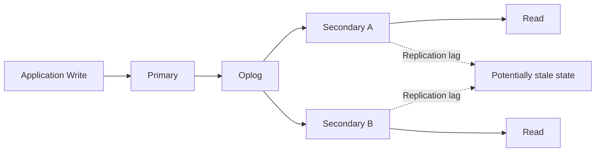

# 19- Read Preference

## Overview

MongoDB read preference controls which members of a replica set are eligible to serve read operations.

In a replica-set deployment, MongoDB normally sends writes to the primary while allowing applications to choose how reads are routed:

```text
                    Application
                         |
              +----------+----------+
              |                     |
            Writes                 Reads
              |                     |
              v                     v
           Primary           Read Preference
                                   |
                  +----------------+----------------+
                  |                |                |
                  v                v                v
               Primary         Secondary         Nearest
```

Read preference is primarily a **read-routing policy**. It does not define the durability of writes and does not by itself define the consistency guarantees of reads.

Three MongoDB concepts should be kept separate:

| Concept | Controls | Example |
|---|---|---|
| Read preference | Which replica-set member can serve a read | `secondaryPreferred` |
| Read concern | What consistency/visibility guarantee the read requires | `majority` |
| Write concern | When a write is acknowledged | `w: "majority"` |

A senior backend engineer should choose read preference based on:

- Data freshness requirements.
- Read-after-write requirements.
- Read throughput.
- Replica-set topology.
- Replication lag.
- Geographic distribution.
- Availability requirements.
- Latency SLOs.
- Failure behavior.
- Cost.

## Why Read Preference Exists

Replica sets provide multiple MongoDB servers:

```text
             Primary
             /     \
            /       \
           v         v
      Secondary   Secondary
```

The primary handles writes and normally serves reads.

As read traffic grows, applications may want to distribute reads across secondaries:

```text
                    Application
                   /     |      \
                  v      v       v
             Primary  Secondary Secondary
                |          ^         ^
                +----------+---------+
                   Replication
```

This can reduce primary read pressure, but secondaries replicate asynchronously and can therefore be behind the primary.

Read preference allows the application to explicitly choose the trade-off.

## Read Preference Modes

MongoDB provides five main read preference modes:

- `primary`
- `primaryPreferred`
- `secondary`
- `secondaryPreferred`
- `nearest`

| Mode | Normal target | Fallback behavior | Main use |
|---|---|---|---|
| `primary` | Primary | No secondary fallback | Strong application consistency |
| `primaryPreferred` | Primary | Secondary if primary unavailable | Primary-first workloads |
| `secondary` | Secondary | No primary fallback | Read scaling |
| `secondaryPreferred` | Secondary | Primary if suitable secondary unavailable | Read scaling with fallback |
| `nearest` | Lowest-latency eligible member | Based on server selection | Geographic/latency-sensitive reads |

These modes determine **where** MongoDB looks for a server. They do not independently guarantee that the selected server has the newest data.

## Primary

`primary` is the default read preference.

```text
Application
     |
     +------ Write ------> Primary
     |
     +------ Read -------> Primary
```

Example URI:

```text
mongodb://mongo-1,mongo-2,mongo-3/?replicaSet=rs0&readPreference=primary
```

Python:

```python
from pymongo import MongoClient, ReadPreference

client = MongoClient(
    "mongodb://mongo-1,mongo-2,mongo-3/?replicaSet=rs0",
    read_preference=ReadPreference.PRIMARY,
)
```

### Advantages

- Simple consistency model.
- Natural read-after-write behavior.
- No dependency on secondary freshness.
- Suitable for transactional application workloads.

### Limitations

- All reads remain concentrated on the primary.
- Read-heavy workloads can increase primary CPU, memory, and connection pressure.
- Scaling reads requires scaling the primary or changing the architecture.

### Typical Use Cases

Use `primary` when:

- Users expect to immediately see their changes.
- Reads participate in transactional workflows.
- Stale data would cause incorrect business behavior.
- The workload is not sufficiently read-heavy to justify secondary routing.

Examples:

- Account balances.
- Order status.
- Inventory availability.
- Payment status.
- User profile updates.
- Administrative configuration.

## Primary Preferred

`primaryPreferred` normally routes reads to the primary.

If the primary is unavailable, eligible secondary members can be considered.

```text
                    Read
                     |
                     v
                  Primary
                 /       \
          available     unavailable
              |              |
              v              v
            Read          Secondary
```

Example:

```text
mongodb://mongo-1,mongo-2,mongo-3/?replicaSet=rs0&readPreference=primaryPreferred
```

Python:

```python
client = MongoClient(
    MONGODB_URI,
    read_preference=ReadPreference.PRIMARY_PREFERRED,
)
```

### Advantages

- Primary-first behavior.
- Can improve read availability during primary failure.
- Useful when secondary reads are acceptable during failover.

### Limitations

During fallback, reads may come from a secondary that is behind the old primary.

Therefore:

```text
primaryPreferred
```

does not mean:

```text
always read the latest state
```

It means:

```text
prefer the primary when available
```

### Typical Use Cases

- Read-heavy services where temporary stale reads during failover are acceptable.
- Catalog or content workloads.
- Systems where availability is more important than strict read-after-write behavior during failover.

## Secondary

`secondary` routes reads to secondary members.

```text
Application
     |
     +---- Writes ----> Primary
     |
     +---- Reads -----> Secondary
```

Example:

```text
mongodb://mongo-1,mongo-2,mongo-3/?replicaSet=rs0&readPreference=secondary
```

Python:

```python
client = MongoClient(
    MONGODB_URI,
    read_preference=ReadPreference.SECONDARY,
)
```

### Advantages

- Offloads reads from the primary.
- Allows horizontal read scaling.
- Useful for workloads that tolerate replication lag.
- Can isolate reporting workloads from transactional traffic.

### Limitations

- Reads can be stale.
- If no eligible secondary is available, the read fails rather than automatically using the primary.
- Replication lag directly affects freshness.
- Application behavior becomes more topology-dependent.

### Typical Use Cases

- Analytics.
- Reporting.
- Historical queries.
- Search-like experiences where slight staleness is acceptable.
- Read-heavy services with explicit eventual-consistency requirements.

## Secondary Preferred

`secondaryPreferred` prefers secondary members but can fall back to the primary when suitable secondary members are unavailable.

```text
                    Read
                     |
                     v
                 Secondary
                 /        \
            available   unavailable
                |             |
                v             v
              Read         Primary
```

Example:

```text
mongodb://mongo-1,mongo-2,mongo-3/?replicaSet=rs0&readPreference=secondaryPreferred
```

Python:

```python
client = MongoClient(
    MONGODB_URI,
    read_preference=ReadPreference.SECONDARY_PREFERRED,
)
```

### Advantages

- Offloads reads under normal conditions.
- Maintains a fallback path to the primary.
- Useful for large read-heavy workloads.

### Limitations

The application must tolerate potentially different freshness characteristics depending on which server serves the request.

For example:

```text
Normal:
Read → Secondary

Secondary unavailable:
Read → Primary
```

This can produce different latency and consistency behavior during topology changes.

### Typical Use Cases

- Product catalogs.
- Content delivery.
- Reporting APIs.
- Recommendation data.
- Non-critical dashboards.

## Nearest

`nearest` selects among eligible members based primarily on network latency.

Eligible members can include both primary and secondary members.

```text
             Application
                  |
          +-------+-------+
          |       |       |
          v       v       v
       Primary  Sec-A   Sec-B
          |       |       |
        20 ms   80 ms   25 ms

             ↓
         Lowest latency
```

Example:

```text
mongodb://mongo-1,mongo-2,mongo-3/?replicaSet=rs0&readPreference=nearest
```

Python:

```python
client = MongoClient(
    MONGODB_URI,
    read_preference=ReadPreference.NEAREST,
)
```

### Advantages

- Can reduce network latency.
- Useful for geographically distributed applications.
- Can distribute reads across multiple eligible members.

### Limitations

The nearest server is not necessarily the freshest server.

For example:

```text
Nearest secondary
    |
    +---- 10 ms away
    +---- 30 seconds replication lag
```

The primary may be:

```text
Primary
    |
    +---- 80 ms away
    +---- Current state
```

Therefore:

```text
lowest latency != newest data
```

## Read Preference and Read Concern

Read preference and read concern solve different problems.

```text
Read Preference
       |
       v
Which member can serve the read?

Read Concern
       |
       v
What consistency state may the read observe?
```

For example:

```text
readPreference = secondaryPreferred
readConcern = majority
```

means:

```text
Prefer secondary members
+
Require the read's consistency guarantee associated with majority concern
```

Changing read preference does not automatically change read concern.

## Read Preference Does Not Guarantee Freshness

A common mistake is assuming:

```text
secondary
```

means:

```text
latest replicated state
```

It does not.

Consider:

```text
Primary
  version = 105

Secondary
  version = 102
```

A secondary read may observe version 102.

Replication is asynchronous, so the application must define how much staleness is acceptable.

## Replication Lag

Replication lag is one of the most important operational considerations when using secondary reads.



Lag can increase because of:

- High write throughput.
- Slow storage.
- CPU saturation.
- Network latency.
- Large write batches.
- Resource contention.
- Secondary maintenance.
- Long-running operations.

Before introducing secondary reads, monitor replication lag under realistic production load.

## Read-After-Write Consistency

Consider an API:

```text
POST /orders
     |
     v
Create order
     |
     v
GET /orders/{id}
```

Suppose the write goes to the primary:

```text
POST
 |
 v
Primary
 |
 +---- Order created
 |
 +---- Replication pending
          |
          v
       Secondary
```

If the subsequent GET goes to the secondary:

```text
GET
 |
 v
Secondary
 |
 v
Order not visible yet
```

The user may observe:

```text
POST succeeded
GET immediately says "not found"
```

This is a common production failure when secondary reads are introduced without considering read-after-write behavior.

## Solving Read-After-Write Problems

Common approaches include:

### Primary Reads

Route consistency-sensitive reads to the primary.

```text
Write → Primary
Read  → Primary
```

This is the simplest approach.

### Session-Based Consistency

MongoDB sessions can provide causal consistency semantics for supported operations.

Conceptually:

```text
Write
  |
  v
Session
  |
  v
Subsequent read
  |
  v
Causally consistent observation
```

This can be useful when a workflow needs stronger ordering semantics without globally forcing every read to the primary.

### Application-Level Routing

A service can intentionally route:

```text
Immediately after mutation:
    primary

General read:
    secondaryPreferred
```

This requires careful request lifecycle and consistency design.

## Causal Consistency

Causal consistency preserves an ordering relationship between operations in a session.

For example:

```text
Operation A:
Create Order

happens-before

Operation B:
Read Order
```

A causally consistent session helps ensure that the second operation does not observe a state that predates the causally related first operation.

This is useful for distributed request workflows where operations span different MongoDB members.

## Session Example in Python

```python
from pymongo import MongoClient, ReadPreference

client = MongoClient(MONGODB_URI)

with client.start_session(causal_consistency=True) as session:
    orders = client["orders"]["orders"]

    orders.insert_one(
        {
            "_id": "ORDER-1001",
            "status": "created",
        },
        session=session,
    )

    order = orders.find_one(
        {"_id": "ORDER-1001"},
        session=session,
    )
```

The session carries causal context across the operations.

The exact consistency guarantees should still be evaluated against the configured read concern, topology, and driver behavior.

## Read Preference in Transactions

Transactions have stricter requirements than ordinary reads.

A transaction normally executes against the primary in a replica-set deployment, and read preference cannot be used to arbitrarily distribute transactional reads across secondaries.

This is intentional.

A transaction requires a coherent transactional execution context rather than independently routing each operation to whichever secondary happens to be closest.

For transaction-specific consistency requirements, configure:

- Read concern.
- Write concern.
- Transaction options.

Do not attempt to use secondary read scaling inside a normal multi-document transaction.

## Read Preference and Sharded Clusters

Read preference also applies in sharded MongoDB deployments.

The architecture becomes:

```text
Application
    |
    v
   mongos
    |
    +------------+------------+
    |            |            |
    v            v            v
  Shard A      Shard B      Shard C
  Primary      Primary      Primary
  Secondary    Secondary    Secondary
```

The application communicates with `mongos`, while server selection and read routing operate within the sharded topology.

Read preference does not replace good shard-key design.

A poorly targeted query can still produce:

```text
Application
    |
    v
  mongos
    |
    +---- Shard A
    +---- Shard B
    +---- Shard C
```

resulting in scatter-gather work regardless of read preference.

## Tag-Based Read Preference

MongoDB supports tag sets for directing reads toward members with matching topology tags.

This is useful for topology-aware routing.

Example topology:

```text
Primary       region=us-east
Secondary A   region=us-east
Secondary B   region=eu-west
```

An application can prefer members associated with a particular deployment characteristic.

Conceptually:

```text
Application in EU
       |
       v
Prefer:
region = eu-west
```

Tag-aware routing is useful for:

- Regional workloads.
- Reporting nodes.
- Dedicated analytics members.
- Geographic routing.
- Workload isolation.

Tags should represent deliberate infrastructure topology, not business authorization.

## Read Preference and Geographic Architecture

A multi-region topology may look like:

```text
                Application
                     |
        +------------+------------+
        |            |            |
        v            v            v
     Region A     Region B     Region C
     Primary      Secondary    Secondary
```

Potential policies include:

```text
Transactional API
    ↓
Primary

Regional analytics
    ↓
Nearest / topology-aware secondary

Global reporting
    ↓
SecondaryPreferred
```

Geographic routing must account for:

- Replication latency.
- Failover behavior.
- Data residency requirements.
- Network partitions.
- Cross-region bandwidth.
- RPO/RTO.
- Compliance requirements.

## Read Preference and High Availability

Read preference can affect availability during failures.

### `primary`

If the primary is unavailable:

```text
Read → Failure / server selection wait
```

until a suitable primary becomes available.

### `primaryPreferred`

The driver may use an eligible secondary when the primary is unavailable.

### `secondary`

If no suitable secondary exists:

```text
Read → Failure
```

rather than automatically switching to primary.

### `secondaryPreferred`

The driver may fall back to primary when an eligible secondary is unavailable.

This creates an important distinction:

```text
Read availability
        ≠
Read consistency
```

A configuration can improve read availability while allowing stale data.

## Server Selection

The MongoDB driver does not simply select a server randomly.

It considers:

- Replica-set state.
- Read preference.
- Server eligibility.
- Server latency.
- Topology information.
- Tags where configured.
- Server selection timeout.

Conceptually:

```text
Available topology
       |
       v
Apply read preference
       |
       v
Filter eligible servers
       |
       v
Apply tag requirements
       |
       v
Select according to latency/topology
       |
       v
Execute read
```

This happens dynamically as the topology changes.

## Local Threshold

For latency-aware selection, MongoDB drivers use a local latency threshold when selecting among suitable servers.

The practical implication is that the driver does not necessarily choose only the mathematically fastest server.

Several servers within the acceptable latency window can be considered.

This helps distribute traffic while avoiding unnecessarily strict dependence on one server.

## Read Preference in PyMongo

Basic configuration:

```python
from pymongo import MongoClient, ReadPreference

client = MongoClient(
    MONGODB_URI,
    read_preference=ReadPreference.SECONDARY_PREFERRED,
)

db = client["catalog"]
products = db["products"]
```

The client can then reuse its connection pool across requests.

## Collection-Level Read Preference

A service can use different read policies for different collections.

```python
from pymongo import ReadPreference

catalog = db.get_collection(
    "products",
    read_preference=ReadPreference.SECONDARY_PREFERRED,
)

orders = db.get_collection(
    "orders",
    read_preference=ReadPreference.PRIMARY,
)
```

This can be useful when:

```text
Catalog:
    stale data acceptable

Orders:
    stale data unacceptable
```

The policy should be explicit and documented.

## Database-Level Read Preference

A database handle can also be configured with a read preference.

```python
from pymongo import ReadPreference

reporting_db = client.get_database(
    "analytics",
    read_preference=ReadPreference.SECONDARY_PREFERRED,
)
```

This is useful when an entire workload has similar consistency requirements.

## FastAPI Architecture

A FastAPI service can expose separate repository paths for transactional and reporting workloads.

```text
FastAPI
   |
   +-------------------+
   |                   |
   v                   v
OrderRepository   ReportingRepository
   |                   |
   v                   v
Primary            SecondaryPreferred
```

Example:

```python
from pymongo import MongoClient, ReadPreference

client = MongoClient(
    settings.mongodb_uri,
)

transactional_db = client.get_database(
    "orders",
    read_preference=ReadPreference.PRIMARY,
)

reporting_db = client.get_database(
    "orders",
    read_preference=ReadPreference.SECONDARY_PREFERRED,
)
```

This makes the consistency decision visible in the architecture rather than hiding it inside individual query calls.

## Django Integration

For Django applications using PyMongo, keep read preference in the MongoDB repository or infrastructure layer.

```text
Django View
    |
    v
Service
    |
    +------------------+
    |                  |
    v                  v
Primary Repository   Reporting Repository
    |                  |
    v                  v
Primary             Secondary
```

Do not attempt to treat MongoDB read preference as if it were a native Django ORM routing feature unless the chosen MongoDB integration explicitly provides equivalent semantics.

The MongoDB driver's topology and read preference configuration remain authoritative.

## Read Preference and Redis

A Redis cache can hide some database read traffic, but it does not eliminate the need for a correct MongoDB consistency model.

Example:

```text
Client
  |
  v
Redis
  |
  +---- Cache hit → Response
  |
  +---- Cache miss
           |
           v
    MongoDB secondary
```

If the cache is stale and the secondary is also stale:

```text
Application
    |
    v
Stale cache
    |
    v
Stale secondary
```

the system can have multiple layers of staleness.

Define freshness expectations explicitly.

## Read Preference and Kafka

Kafka consumers commonly perform read-heavy operations against MongoDB.

For example:

```text
Kafka
  |
  v
Consumer
  |
  v
MongoDB
```

If the consumer is performing analytical or enrichment reads, secondary reads may be appropriate.

If the consumer is processing state transitions where the latest committed state is required, primary-oriented reads may be safer.

Read preference should follow the consumer's business semantics.

## Read Preference and Celery

Celery workers often execute background jobs that do not require immediate read-after-write behavior.

For example:

```text
Celery Worker
     |
     v
Reporting Query
     |
     v
Secondary
```

This can reduce primary pressure.

However, jobs that perform:

```text
read state
+
make business decision
+
write state
```

should be carefully evaluated for stale reads.

A stale read could cause an incorrect decision.

## Production Read Routing

A useful production architecture is to classify reads.

| Read category | Typical preference | Freshness requirement |
|---|---|---|
| Account balance | `primary` | Very high |
| Order status | `primary` | High |
| Inventory decision | `primary` | Very high |
| Product catalog | `secondaryPreferred` | Moderate |
| Reporting | `secondary` | Low to moderate |
| Analytics | `secondaryPreferred` | Moderate |
| Geographic read workload | `nearest` | Application-dependent |
| Administrative configuration | `primary` | High |

These are architectural examples. The application must validate the actual consistency requirements.

## Performance Considerations

Secondary reads can improve throughput by distributing read traffic.

Consider:

```text
Without secondary reads:

10,000 reads/s
       |
       v
Primary
```

versus:

```text
With secondary reads:

10,000 reads/s
       |
       +---- Primary
       +---- Secondary A
       +---- Secondary B
```

However, adding secondary reads can introduce:

- Replication lag.
- Increased network traffic.
- More complex failure behavior.
- More complicated debugging.
- Stale data.
- Additional infrastructure cost.

Read scaling is therefore not free.

## Connection Pooling

Read preference does not require creating separate clients per request.

Bad:

```python
def read_product(product_id: str):
    client = MongoClient(
        MONGODB_URI,
        read_preference=ReadPreference.SECONDARY,
    )

    return client["catalog"]["products"].find_one(
        {"_id": product_id}
    )
```

Prefer long-lived clients:

```python
client = MongoClient(
    MONGODB_URI,
    read_preference=ReadPreference.SECONDARY_PREFERRED,
)

products = client["catalog"]["products"]
```

The driver manages pooled connections and topology discovery.

## Monitoring Secondary Reads

Monitor at least:

- Replication lag.
- Secondary availability.
- Read latency.
- Read error rate.
- Primary read load.
- Secondary CPU.
- Secondary memory.
- Connection utilization.
- Server selection latency.
- Query performance.

A useful relationship is:

```text
Replication lag increases
        |
        v
Secondary freshness decreases
        |
        v
Risk of stale reads increases
```

## Observability

Application logs should make important consistency decisions visible.

Example:

```json
{
  "operation": "get_product",
  "read_preference": "secondaryPreferred",
  "server_role": "secondary",
  "latency_ms": 18
}
```

For sensitive workflows, tracing can help identify:

```text
Request
  |
  v
Service
  |
  v
MongoDB driver
  |
  v
Selected server
```

Avoid logging credentials, connection strings containing secrets, or sensitive document contents.

## Capacity Planning

If secondary reads are introduced, secondary nodes become part of application-serving capacity.

Plan capacity for:

- Query CPU.
- Working-set memory.
- Disk I/O.
- Connections.
- Network throughput.
- Replication workload.
- Reporting workloads.

A secondary that is overloaded by analytics queries can fall behind replication.

That creates a feedback loop:

```text
Heavy secondary queries
        ↓
Secondary resource pressure
        ↓
Replication slows
        ↓
Replication lag increases
        ↓
Read freshness decreases
```

## Workload Isolation

Dedicated secondary members can sometimes be used to isolate workloads.

Example:

```text
                    Replica Set
                         |
          +--------------+--------------+
          |              |              |
          v              v              v
       Primary       Secondary A    Secondary B
                         |              |
                    Application      Analytics
                       reads           reads
```

Topology-aware routing can direct analytics traffic toward a designated member.

This can prevent reporting workloads from consuming the same resources used by latency-sensitive application reads.

## Read Preference and Security

Read preference is not an authorization mechanism.

Do not assume:

```text
secondary = safe
primary = sensitive
```

Both can contain the same logical data.

Authorization should be enforced independently through:

- Authentication.
- Roles.
- Least privilege.
- Network restrictions.
- TLS.
- Encryption.
- Auditing.

If a secondary contains production data, it should receive the same security treatment as the primary.

## Disaster Recovery

Read preference does not replace disaster recovery.

A secondary is part of replication and high availability, but it is not a substitute for independent backups.

Replication can propagate:

```text
Accidental delete
```

to every replica.

Therefore:

```text
Replica set
    +
Backups
    +
Restore testing
    +
Disaster recovery plan
```

are all required for production resilience.

## Common Mistakes

### Using Secondary Reads for Inventory Decisions

A stale inventory read can cause overselling.

Prefer a primary-oriented transactional workflow for decisions that depend on the latest state.

### Assuming `secondaryPreferred` Means Secondary Only

It does not.

The driver can use the primary when an eligible secondary is unavailable.

### Assuming `secondary` Improves Every Read

Secondary reads can increase total system capacity, but they also add replication and topology complexity.

### Ignoring Replication Lag

A secondary with high lag can become an unsuitable application read target.

### Using `nearest` Without Understanding Freshness

The nearest server may be a stale secondary.

### Creating a MongoClient per Request

This wastes connection and topology-management resources.

### Mixing Consistency Policies Without Documentation

If one repository uses primary reads and another uses secondary reads for the same business entity, engineers may accidentally introduce inconsistent behavior.

Document the policy at the service or repository boundary.

### Assuming Read Preference Controls Durability

Read preference affects reads.

Write concern determines write acknowledgment and durability behavior.

### Assuming Secondary Reads Are Always Cheaper

They can reduce primary pressure but require additional replica capacity and can increase cross-region or network traffic.

## Troubleshooting Methodology

### Read Returns Stale Data

```text
Symptom
↓
Application receives older data than expected
↓
Possible causes
- Read routed to secondary
- Replication lag
- Weak read concern
- Cached response
- Different service using different read policy
↓
Isolation strategy
- Identify selected MongoDB server
- Inspect read preference
- Inspect read concern
- Check replication lag
- Compare primary and secondary results
↓
Diagnostic commands
```

```javascript
rs.status()
```

```javascript
rs.printSecondaryReplicationInfo()
```

```text
Root cause
↓
Secondary is behind primary
↓
Corrective action
- Route consistency-sensitive reads to primary
- Improve secondary capacity
- Reduce reporting workload
- Review read concern
↓
Prevention
- Define freshness requirements
- Monitor replication lag
- Test read-after-write behavior
```

### Read Fails When Primary Is Down

```text
Symptom
↓
Read requests fail during primary election
↓
Possible causes
- readPreference = primary
- No eligible fallback member
- Server selection timeout
- Replica-set instability
↓
Isolation strategy
- Inspect driver configuration
- Inspect replica-set state
- Check server selection errors
↓
Diagnostic commands
```

```javascript
rs.status()
```

```text
Root cause
↓
Read policy intentionally requires primary
↓
Corrective action
- Keep primary routing if consistency is required
- Consider primaryPreferred only if stale fallback reads are acceptable
↓
Prevention
- Test failover behavior
- Document consistency vs availability trade-offs
```

### Secondary Read Latency Increases

```text
Symptom
↓
Secondary reads become slow
↓
Possible causes
- Secondary CPU saturation
- Large reporting queries
- Missing indexes
- Disk I/O pressure
- Replication workload
↓
Isolation strategy
- Inspect query performance
- Check server resources
- Check replication lag
- Inspect indexes
↓
Diagnostic commands
```

```javascript
db.serverStatus()
```

```javascript
db.currentOp()
```

```text
Root cause
↓
Secondary is overloaded
↓
Corrective action
- Optimize queries
- Add appropriate indexes
- Isolate reporting workloads
- Increase secondary capacity
↓
Prevention
- Capacity planning
- Query monitoring
- Replication-lag alerting
```

### Inconsistent Behavior Across Services

```text
Symptom
↓
Two services return different MongoDB results
↓
Possible causes
- Different read preferences
- Different read concerns
- Different clients/topologies
- Secondary lag
- Application caching
↓
Isolation strategy
- Compare MongoDB client configuration
- Compare selected server
- Compare query timestamps
- Compare cache behavior
↓
Diagnostic commands
```

```javascript
rs.status()
```

```text
Root cause
↓
Services use different consistency policies
↓
Corrective action
- Standardize policy
- Document intentional exceptions
↓
Prevention
- Centralized configuration
- Repository-level consistency contracts
- Integration tests
```

## Testing Read Preference

Production applications should test topology changes rather than only the happy path.

Test:

- Primary failure.
- Secondary failure.
- Secondary lag.
- Network latency.
- Network partition scenarios.
- Replica-set election.
- Read-after-write behavior.
- Reporting workload saturation.
- Server selection timeout.
- Connection pool exhaustion.

A useful test matrix is:

| Scenario | Expected behavior |
|---|---|
| Primary healthy | Reads follow configured preference |
| Primary unavailable | Fallback follows configured policy |
| Secondary unavailable | No fallback for `secondary`; fallback possible for `secondaryPreferred` |
| Secondary lagging | Application tolerates documented staleness |
| Immediate read after write | Business-critical reads observe expected state |
| Election in progress | Application handles temporary topology errors |
| Reporting load increases | Transactional read SLO remains protected |

## Configuration Checklist

Before enabling non-primary read preferences:

- [ ] Define acceptable data staleness.
- [ ] Identify read-after-write workflows.
- [ ] Measure replication lag.
- [ ] Identify which services can tolerate stale reads.
- [ ] Choose read preference intentionally.
- [ ] Choose read concern separately.
- [ ] Configure appropriate server-selection timeouts.
- [ ] Reuse `MongoClient`.
- [ ] Monitor secondary CPU and memory.
- [ ] Monitor replication lag.
- [ ] Test primary elections.
- [ ] Test secondary failures.
- [ ] Test stale-read scenarios.
- [ ] Document service-level consistency expectations.
- [ ] Verify security controls on all replicas.
- [ ] Include secondary capacity in infrastructure planning.

## Architecture Decision Guide

| Requirement | Suitable starting point |
|---|---|
| Latest business state required | `primary` |
| Primary preferred but fallback acceptable | `primaryPreferred` |
| Secondary-only read scaling | `secondary` |
| Secondary-first with primary fallback | `secondaryPreferred` |
| Lowest-latency eligible member | `nearest` |
| Financial state decision | Usually `primary` |
| Reporting | Often `secondary` |
| Analytics | Often `secondaryPreferred` |
| Read-after-write workflow | `primary` or carefully designed session-based consistency |
| Geographic read optimization | `nearest` or topology-aware routing |
| Multi-document transaction | Primary-oriented transactional execution |

These are starting points. The correct policy depends on the application's consistency contract.

## Senior-Level Design Principles

### Separate Freshness From Availability

A read can be highly available while returning stale data.

```text
High availability
       ≠
Strong consistency
```

### Treat Read Policy as Part of the API Contract

If an endpoint can return stale data, that should be an intentional property of the service.

For example:

```text
GET /analytics/dashboard
```

may tolerate eventual consistency.

```text
GET /orders/{id}/payment-status
```

may not.

### Make Consistency Boundaries Explicit

Prefer:

```text
OrderRepository
    → primary

AnalyticsRepository
    → secondaryPreferred
```

over an invisible global configuration where developers do not know why reads are routed differently.

### Optimize After Measuring

Do not move reads to secondaries merely because the primary appears busy.

Measure:

- Query latency.
- CPU.
- Memory.
- Connection usage.
- Replication lag.
- Cache hit rate.
- Read/write ratio.

Then choose the architecture.

## Interview Traps

### What is MongoDB read preference?

It is the policy that determines which replica-set members are eligible to serve read operations.

### What is the default read preference?

`primary`.

### Does `secondary` guarantee fresh data?

No. A secondary can lag behind the primary.

### Does `secondaryPreferred` always read from a secondary?

No. It prefers secondaries but can fall back to the primary.

### What is the difference between `primaryPreferred` and `secondaryPreferred`?

`primaryPreferred` prefers the primary and falls back toward secondaries.

`secondaryPreferred` prefers secondaries and can fall back toward the primary.

### What is `nearest`?

It selects among eligible members based primarily on network latency.

### Does `nearest` guarantee the latest data?

No.

A nearby secondary can be behind the primary.

### Does read preference control write durability?

No.

Write concern controls write acknowledgment and durability semantics.

### Can read preference solve read-after-write consistency?

Not by itself.

Primary routing is the simplest approach, while sessions and causal consistency can address certain more advanced consistency requirements.

### Should reporting workloads use secondaries?

They can, when the workload tolerates stale data and the secondary has sufficient capacity.

### Can a secondary become overloaded?

Yes.

Heavy reporting queries can consume CPU, memory, disk, and connections and can also increase replication lag.

### Does adding secondaries automatically scale reads?

No.

Applications must actually route eligible reads to those members, and the queries must be efficient enough to benefit from the additional capacity.

## Key Takeaways

- MongoDB read preference controls **where reads are served**, not how durable writes are or what consistency guarantee a read has; keep it separate from read concern and write concern.
- `primary` is the safest default for consistency-sensitive application reads, while `secondary` and `secondaryPreferred` are useful when the application explicitly accepts replication lag and stale data.
- `nearest` optimizes for network proximity among eligible members, but the nearest server is not necessarily the freshest server.
- Secondary-read architectures require monitoring replication lag, secondary capacity, server-selection behavior, read-after-write consistency, and failover scenarios.
- Treat read preference as part of the service's consistency contract: choose it from business requirements, latency SLOs, topology, workload characteristics, and failure behavior rather than using it only as a performance switch.