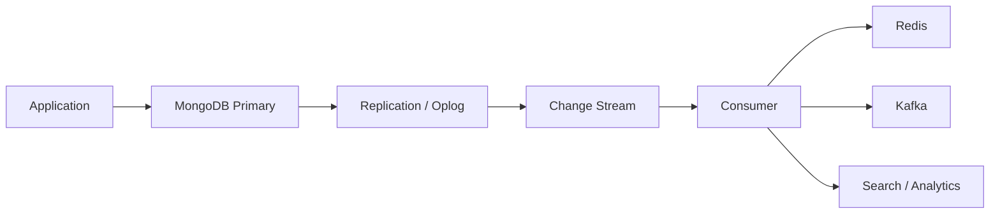
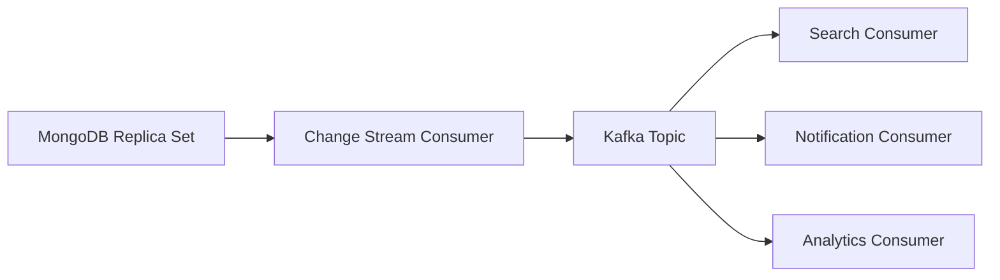

# 21- Change Streams

## Overview

MongoDB Change Streams provide a server-side mechanism for observing data changes in real time without requiring applications to continuously poll collections.

A change stream can expose events such as:

- Inserts
- Updates
- Replacements
- Deletes
- Invalidations

This enables MongoDB to participate directly in event-driven backend architectures.

A typical flow is:

```text
MongoDB Replica Set
       |
       v
Change Stream
       |
       v
Consumer Service
       |
       +---- Kafka
       +---- Celery
       +---- Search Index
       +---- Cache Invalidation
       +---- WebSocket/SSE
       +---- Audit Pipeline
```

Change streams are particularly useful when downstream systems need to react to database changes without introducing database polling.

They should not, however, be treated as a general-purpose message queue. Consumers must account for resume tokens, retries, duplicate processing, ordering semantics, backpressure, and idempotency.

## Why Change Streams Exist

A polling architecture might look like:

```text
Every 5 seconds
     |
     v
Query MongoDB
     |
     v
Find recently changed documents
     |
     v
Process changes
```

Polling introduces several problems:

- Additional database queries.
- Polling latency.
- Difficult change detection.
- Duplicate processing.
- Race conditions around timestamps.
- Inefficient behavior during low activity.
- Increased load during high activity.

Change streams instead allow MongoDB to notify consumers as changes become available:

```text
Database Change
      |
      v
MongoDB
      |
      v
Change Stream
      |
      v
Consumer
```

This makes event-driven integration substantially simpler.

## Change Stream Architecture

Change streams are built on MongoDB's replication infrastructure.

A simplified architecture is:



The important distinction is that the application does not directly consume the oplog.

Instead:

```text
Application
    |
    v
Change Stream API
    |
    v
MongoDB replication machinery
```

MongoDB exposes a supported change-stream interface with structured change events and resume capabilities.

## Deployment Requirements

Change streams require a MongoDB deployment that supports replication semantics, such as:

- A replica set.
- A sharded cluster.

A standalone MongoDB deployment is not the normal production topology for change streams.

For local development, configure MongoDB as a single-node replica set if change-stream functionality is required.

Example connection:

```text
mongodb://localhost:27017/?replicaSet=rs0
```

## Change Stream Levels

A change stream can be opened at different scopes.

| Scope | Purpose |
|---|---|
| Collection | Observe changes to one collection |
| Database | Observe changes across collections in one database |
| Deployment | Observe changes across the deployment |

Collection-level streams are usually easier to reason about because they have a narrower event domain.

For example:

```text
orders
  |
  +---- insert
  +---- update
  +---- replace
  +---- delete
```

A database-level stream can observe multiple collections:

```text
orders
customers
payments
shipments
      |
      v
Database Change Stream
```

Choose the smallest scope that satisfies the architecture.

## Opening a Change Stream

Using `mongosh`, a collection-level stream can be opened with:

```javascript
const cursor = db.orders.watch();

while (cursor.hasNext()) {
    printjson(cursor.next());
}
```

This creates a long-lived cursor that waits for change events.

In production applications, the consumer should handle:

- Connection interruptions.
- Resume tokens.
- Shutdown.
- Exceptions.
- Backpressure.
- Duplicate processing.
- Observability.

## Change Event Structure

A typical change event contains metadata describing the operation and affected document.

A simplified insert event resembles:

```json
{
  "operationType": "insert",
  "fullDocument": {
    "_id": "..."
  },
  "ns": {
    "db": "orders",
    "coll": "orders"
  },
  "documentKey": {
    "_id": "..."
  }
}
```

An update event can contain:

```json
{
  "operationType": "update",
  "documentKey": {
    "_id": "..."
  },
  "updateDescription": {
    "updatedFields": {
      "status": "shipped"
    },
    "removedFields": []
  }
}
```

The exact event fields depend on the operation and stream configuration.

## Operation Types

Important operation types include:

| Operation | Meaning |
|---|---|
| `insert` | New document inserted |
| `update` | Existing document modified |
| `replace` | Existing document replaced |
| `delete` | Existing document deleted |
| `invalidate` | Stream can no longer continue normally |
| `drop` | Watched collection dropped |
| `rename` | Watched collection renamed |
| `dropDatabase` | Watched database dropped |

Applications should not assume that every event represents a normal document mutation.

## Insert Events

An insert event is generated when a new document is created.

Example:

```json
{
  "operationType": "insert",
  "documentKey": {
    "_id": "..."
  },
  "fullDocument": {
    "_id": "...",
    "customer_id": "C123",
    "status": "created"
  }
}
```

Typical uses include:

- Publishing domain events.
- Updating search indexes.
- Triggering asynchronous processing.
- Cache population.
- Audit pipelines.

## Update Events

An update event represents modification of an existing document.

For example:

```javascript
db.orders.updateOne(
    { _id: orderId },
    { $set: { status: "shipped" } }
);
```

A corresponding event can contain:

```json
{
  "operationType": "update",
  "documentKey": {
    "_id": "..."
  },
  "updateDescription": {
    "updatedFields": {
      "status": "shipped"
    }
  }
}
```

This can be more efficient than retrieving the entire document when only changed fields are required.

## Replace Events

A replacement operation is different from a modifier-based update.

For example:

```javascript
db.orders.replaceOne(
    { _id: orderId },
    {
      _id: orderId,
      status: "shipped",
      total: 1500
    }
);
```

The resulting event has:

```text
operationType = replace
```

Consumers should distinguish:

```text
update
```

from:

```text
replace
```

when downstream processing depends on the difference.

## Delete Events

A delete event identifies the deleted document through its document key.

Example:

```json
{
  "operationType": "delete",
  "documentKey": {
    "_id": "..."
  }
}
```

The deleted document itself is generally not available in the event.

If downstream systems need information beyond the identifier, the application may need a different data-retention or event-design strategy.

## Full Document Lookup

For updates, consumers may need the complete post-update document instead of only the changed fields.

A change stream can be configured to request the full document where supported.

Python example:

```python
from pymongo import MongoClient

client = MongoClient(MONGODB_URI)
collection = client["orders"]["orders"]

with collection.watch(
    full_document="updateLookup",
) as stream:
    for change in stream:
        print(change)
```

This is useful when:

```text
Update event
     |
     v
Need complete current document
     |
     v
Full document lookup
```

However, full document lookup can introduce additional database work and should not be enabled indiscriminately for high-volume streams.

## Update Descriptions

For update operations, MongoDB can expose information about modified and removed fields.

Example:

```json
{
  "updateDescription": {
    "updatedFields": {
      "status": "completed",
      "updated_at": "..."
    },
    "removedFields": [
      "temporary_flag"
    ]
  }
}
```

This is useful when downstream consumers can efficiently process field-level changes.

For example:

```text
status changed
    |
    v
Update search index

temporary_flag removed
    |
    v
Remove indexed field
```

## Resume Tokens

A change stream event contains a resume token that identifies the stream position.

Conceptually:

```text
Event A
   |
Resume Token A
   |
Event B
   |
Resume Token B
   |
Event C
   |
Resume Token C
```

The consumer can persist the resume token and use it to continue processing after a restart or recoverable failure.

This is one of the most important reliability mechanisms in change-stream consumers.

## Why Resume Tokens Matter

Consider:

```text
Consumer
   |
   v
Process Event A
   |
   X
Consumer crashes
```

Without checkpointing:

```text
Restart
   |
   v
Unclear processing position
```

With a persisted resume token:

```text
Restart
   |
   v
Load last token
   |
   v
Resume from known stream position
```

This significantly reduces the risk of missing events.

## Resume Strategy

A production consumer should distinguish between:

- Resuming from a stored resume token.
- Starting from a specific operation time where appropriate.
- Starting a new stream from the current point.

A simplified state machine is:

```text
Start
  |
  v
Load checkpoint
  |
  +---- Found ----> Resume
  |
  +---- Not found -> Start new stream
                         |
                         v
                    Process events
                         |
                         v
                    Persist checkpoint
```

Checkpoint persistence should be durable.

Possible stores include:

- MongoDB.
- PostgreSQL.
- Redis with appropriate durability semantics.
- A durable event-processing system.

For critical workflows, do not rely solely on in-memory state.

## Resume Tokens and Processing Semantics

A resume token does not automatically make a consumer exactly-once.

Consider:

```text
Receive event
    |
    v
Perform side effect
    |
    X
Crash before checkpoint
```

After restart:

```text
Resume from previous checkpoint
    |
    v
Same event processed again
```

Therefore, change-stream consumers should normally be designed for **at-least-once processing** and idempotent side effects.

## Idempotency

Idempotency means processing the same logical event multiple times does not produce an incorrect final state.

Poor design:

```text
Change event
    |
    v
Charge customer
```

If the consumer retries the event, the customer might be charged twice.

Better design:

```text
Change event
    |
    v
Generate deterministic event ID
    |
    v
Check processing state
    |
    +---- Already processed --> Skip
    |
    +---- New -------------> Process
                              |
                              v
                         Record result
```

Use:

- Unique event identifiers.
- Idempotency keys.
- Unique database constraints.
- Upserts.
- Transactional state transitions where appropriate.

## Event Identity

A consumer should establish a stable identifier for processed events.

For example:

```text
MongoDB change-stream resume token
+
Domain identifier
+
Operation context
```

The exact identifier strategy depends on the downstream system.

Do not assume:

```text
document _id
=
event id
```

A single document can generate many change events over its lifetime.

## Change Streams vs Polling

| Concern | Change Streams | Polling |
|---|---|---|
| Latency | Near real-time | Poll interval dependent |
| Database reads | Event-driven | Repeated queries |
| Change detection | Built in | Application-managed |
| Failure recovery | Resume tokens | Custom checkpointing |
| Idle workload | Efficient | Still polls |
| Implementation | More specialized | Simpler initially |
| Backpressure | Consumer responsibility | Query scheduling |
| Event ordering | Stream semantics | Application-defined |
| High-volume integration | Suitable with careful design | Often inefficient |

Polling can still be appropriate for simple workloads or systems where change-stream infrastructure is unavailable.

## Change Streams vs Kafka

Change streams and Kafka solve different problems.

```text
MongoDB
   |
Change Stream
   |
Consumer
   |
Kafka
   |
Multiple consumers
```

MongoDB change streams provide a database-native change feed.

Kafka provides a durable distributed event-streaming platform with:

- Multiple consumer groups.
- Long-lived event retention.
- Partitioning.
- Independent consumers.
- Replay from retained offsets.

A common architecture is:

```text
MongoDB
   |
Change Stream Consumer
   |
Kafka Topic
   |
+----------+----------+
|          |          |
v          v          v
Search    Analytics  Notifications
```

This separates MongoDB change capture from downstream event distribution.

## Domain Events vs Database Change Events

A MongoDB change event is a **persistence-level event**.

A domain event represents a **business-level event**.

For example:

```text
MongoDB update:
status = "paid"
```

versus:

```text
OrderPaid
{
    "order_id": "...",
    "customer_id": "...",
    "amount": 1500
}
```

A database change event may not contain sufficient business context for downstream services.

For complex microservice architectures, consider translating persistence changes into explicit domain events.

## Change Stream Pipeline Filtering

A consumer does not necessarily need every database event.

A pipeline can filter events.

Example:

```python
pipeline = [
    {
        "$match": {
            "operationType": {
                "$in": ["insert", "update", "replace"]
            }
        }
    }
]

with collection.watch(pipeline) as stream:
    for change in stream:
        process(change)
```

This reduces unnecessary application processing.

Filtering should be designed carefully because the change-stream pipeline itself is part of the event consumption path.

## Filtering by Document Fields

Consumers can also filter based on event content where available.

For example:

```python
pipeline = [
    {
        "$match": {
            "fullDocument.tenant_id": "tenant-123"
        }
    }
]
```

This can be useful for tenant-specific consumers.

However, high-cardinality tenant-specific streams can create operational complexity.

Prefer a shared stream with efficient routing when many tenants exist unless isolated streams are a deliberate architectural requirement.

## Change Streams and Multi-Tenancy

A multi-tenant system may produce:

```text
MongoDB
  |
  +---- tenant A
  +---- tenant B
  +---- tenant C
```

A consumer can route events:

```text
Change Stream
      |
      v
Tenant Router
   /    |    \
  v     v     v
A      B      C
```

Security boundaries must be enforced by the consumer.

Do not assume that filtering events is sufficient authorization.

## Python Consumer Architecture

A production Python consumer should separate:

- Stream handling.
- Event parsing.
- Business processing.
- Checkpoint management.
- Retry handling.
- Observability.

A useful architecture is:

```text
Change Stream
      |
      v
Stream Consumer
      |
      v
Event Handler
      |
      +---- Validation
      +---- Idempotency
      +---- Business Logic
      +---- Side Effects
      |
      v
Checkpoint
```

## PyMongo Consumer

A basic production-oriented consumer can look like:

```python
from __future__ import annotations

import logging
import time

from pymongo import MongoClient
from pymongo.errors import PyMongoError

logger = logging.getLogger(__name__)

client = MongoClient(
    MONGODB_URI,
    retryWrites=True,
    serverSelectionTimeoutMS=5_000,
)

collection = client["orders"]["orders"]


def process_change(change: dict) -> None:
    operation = change["operationType"]

    if operation == "insert":
        handle_insert(change)
    elif operation in {"update", "replace"}:
        handle_update(change)
    elif operation == "delete":
        handle_delete(change)


def consume() -> None:
    while True:
        try:
            with collection.watch(
                max_await_time_ms=1_000,
            ) as stream:
                for change in stream:
                    process_change(change)

        except PyMongoError:
            logger.exception("Change stream interrupted; retrying")
            time.sleep(2)
```

This illustrates the basic lifecycle, but production systems should add durable checkpointing, idempotency, bounded retries, health reporting, and graceful shutdown.

## Persisting Resume Tokens

A consumer can persist the latest successfully processed resume token.

Conceptually:

```text
Receive Event
     |
     v
Process Event
     |
     v
Commit Side Effect
     |
     v
Persist Resume Token
```

The order matters.

If the token is persisted before the side effect succeeds:

```text
Checkpoint
   |
   v
Side effect fails
```

the event may be skipped after restart.

A safer conceptual flow is:

```text
Receive
  |
  v
Process successfully
  |
  v
Persist processing state/checkpoint
```

For strict atomicity between the downstream side effect and checkpoint, use a storage system that can commit both pieces of state atomically where the architecture permits.

## Change Stream Consumer With Checkpointing

A simplified checkpoint repository might look like:

```python
from pymongo import MongoClient


class CheckpointRepository:
    def __init__(self, collection):
        self.collection = collection

    def save(self, consumer_name: str, token: dict) -> None:
        self.collection.update_one(
            {"_id": consumer_name},
            {
                "$set": {
                    "resume_token": token,
                }
            },
            upsert=True,
        )

    def load(self, consumer_name: str) -> dict | None:
        document = self.collection.find_one({"_id": consumer_name})
        return document["resume_token"] if document else None
```

In a production implementation, checkpoint updates need to be coordinated carefully with event processing.

## Async Python Considerations

MongoDB change-stream consumers are long-lived I/O workloads.

For an asynchronous application architecture, use an async-compatible MongoDB driver strategy rather than blocking an event loop with synchronous database operations.

The architecture should remain:

```text
Async Event Loop
       |
       v
Async Change Stream
       |
       v
Async Handler
       |
       v
Async Side Effect
```

Do not run blocking PyMongo operations directly inside an async FastAPI event loop without an appropriate execution strategy.

## FastAPI Integration

Change streams are generally better implemented as a background worker rather than as part of an HTTP request handler.

Poor architecture:

```text
GET /orders
    |
    v
Start change stream
    |
    v
Wait forever
```

Better:

```text
FastAPI
  |
  +---- HTTP API
  |
  +---- Application lifecycle
            |
            v
       Background consumer
            |
            v
       Change stream
```

For horizontally scaled FastAPI deployments, be careful about accidentally creating one independent consumer per application replica.

If every pod runs the same consumer:

```text
Pod A ---> Change Stream
Pod B ---> Change Stream
Pod C ---> Change Stream
```

each pod may receive and process the same database changes.

If a single logical consumer is required, use a dedicated worker deployment or an appropriate coordination/event-distribution architecture.

## Kubernetes Consumer Deployment

A dedicated worker is often cleaner:

```text
Kubernetes
    |
    +---- API Deployment
    |       +---- Pod
    |       +---- Pod
    |
    +---- Change Stream Worker
            |
            +---- Pod
```

Scaling the HTTP API does not automatically scale the database event consumer.

If the consumer itself must scale horizontally, design explicit partitioning or event distribution rather than simply increasing replica count.

## Kafka Integration

A common production pattern is:



The MongoDB consumer translates database changes into Kafka events.

Example event:

```json
{
  "event_type": "OrderStatusChanged",
  "event_id": "01J...",
  "aggregate_id": "order-123",
  "occurred_at": "2026-09-21T10:00:00Z",
  "data": {
    "status": "shipped"
  }
}
```

This creates a clean boundary between persistence-level change capture and downstream business events.

## Celery Integration

For moderate asynchronous workloads:

```text
MongoDB
   |
Change Stream
   |
Consumer
   |
Celery
   |
Worker
```

The consumer should avoid performing long-running work directly inside the stream loop.

Instead:

```python
for change in stream:
    task_queue.enqueue(build_task_payload(change))
```

This prevents a slow downstream operation from blocking event consumption.

The task itself must still be idempotent.

## Backpressure

A change stream can produce events faster than the consumer can process them.

Example:

```text
MongoDB
10,000 events/sec
       |
       v
Consumer
5,000 events/sec
       |
       v
Backlog grows
```

Possible responses include:

- Increase consumer capacity.
- Batch downstream processing.
- Introduce Kafka.
- Reduce unnecessary events.
- Optimize handlers.
- Move expensive work to asynchronous workers.
- Apply backpressure.

Do not solve sustained overload by simply increasing memory indefinitely.

## Ordering

Change streams provide ordering semantics within the relevant stream, but distributed consumers can change the effective processing order.

For example:

```text
Event A
Event B
Event C
```

may be consumed in order but processed concurrently:

```text
Worker 1 -> A
Worker 2 -> B
Worker 3 -> C
```

Result:

```text
B completes
C completes
A completes
```

If business correctness depends on ordering, partition work by an ordering key such as:

```text
aggregate_id
```

For an order service:

```text
order-123 -> Worker partition A
order-456 -> Worker partition B
```

This allows independent orders to process concurrently while preserving ordering within an aggregate where the architecture supports it.

## Failure Handling

Consumers should classify failures.

| Failure | Recommended response |
|---|---|
| Temporary network error | Retry with backoff |
| MongoDB primary transition | Reconnect/resume |
| Transient downstream failure | Retry |
| Permanent malformed event | Quarantine / dead-letter |
| Duplicate event | Idempotently ignore |
| Consumer crash | Restart and resume |
| Backpressure | Scale or buffer |
| Invalid resume token | Re-establish according to recovery policy |

Avoid catching every exception and continuing silently.

## Poison Events

A poison event repeatedly fails processing.

Example:

```text
Event 123
   |
   v
Process
   |
   X
Failure
   |
   v
Retry
   |
   X
Failure
   |
   v
Retry forever
```

This can block the stream.

A production architecture should have a strategy such as:

```text
Event
  |
  v
Retry
  |
  +---- Success -> checkpoint
  |
  +---- Repeated failure
            |
            v
       Dead-letter path
            |
            v
       Continue stream
```

The exact implementation depends on whether the event is recoverable and whether skipping it is acceptable.

## Monitoring Change Stream Consumers

Monitor at least:

- Consumer availability.
- Stream reconnect count.
- Processing latency.
- Event throughput.
- Error rate.
- Retry count.
- Processing backlog.
- Last successful event timestamp.
- Last checkpoint timestamp.
- Downstream latency.
- Dead-letter count.

Useful derived metrics include:

```text
Event age
=
Current time - event timestamp
```

and:

```text
Processing lag
=
Current time - last processed event time
```

These help distinguish:

```text
MongoDB is healthy
```

from:

```text
Consumer is falling behind
```

## Logging

A consumer should log structured information such as:

```json
{
  "event": "change_stream_processing_failed",
  "operation_type": "update",
  "collection": "orders",
  "document_id": "order-123",
  "consumer": "order-indexer",
  "error_type": "TimeoutError"
}
```

Avoid logging sensitive document contents unnecessarily.

Logs should support correlation without becoming a source of data leakage.

## Security

Change-stream consumers may have access to sensitive data.

Apply least privilege.

A consumer that only needs to read changes from one collection should not necessarily receive administrative privileges.

Security considerations include:

- Authentication.
- Authorization.
- TLS.
- Secret management.
- Network restrictions.
- Sensitive-field handling.
- Log redaction.
- Consumer isolation.

Full-document lookup can expose fields that were not required by the downstream workflow, so use it deliberately.

## Change Streams and Sensitive Data

Consider a document:

```json
{
  "_id": "...",
  "email": "user@example.com",
  "phone": "...",
  "payment_reference": "...",
  "internal_notes": "..."
}
```

Publishing the entire document to Kafka or logs may unnecessarily distribute sensitive information.

Prefer event payloads containing only required fields:

```json
{
  "event_type": "OrderStatusChanged",
  "order_id": "...",
  "status": "shipped"
}
```

Data minimization should be part of event architecture.

## Performance Considerations

Change streams introduce additional workload.

Consider:

- Number of open streams.
- Event volume.
- Full-document lookups.
- Consumer processing time.
- Downstream throughput.
- Network traffic.
- Number of consumers.
- Stream scope.

A single shared consumer can often be more efficient than opening many tenant-specific streams.

Avoid creating a new change stream for every HTTP request.

## Large Event Volumes

For high-volume systems:

```text
MongoDB
  |
High event volume
  |
  v
Change Stream
  |
  v
Capture Layer
  |
  v
Kafka
  |
  +---- Consumer A
  +---- Consumer B
  +---- Consumer C
```

This architecture provides stronger separation between:

```text
Database change capture
```

and:

```text
Downstream event processing
```

Kafka also allows downstream consumers to process events independently.

## Change Streams and Sharding

In a sharded deployment, change streams can observe changes across the sharded cluster.

The architecture becomes:

```text
                Mongos
                  |
        +---------+---------+
        |         |         |
      Shard A   Shard B   Shard C
        |         |         |
        +---------+---------+
                  |
                  v
            Change Stream
                  |
                  v
               Consumer
```

Consumers should not assume that a sharded deployment behaves exactly like a single replica set.

Production testing should cover:

- Resharding.
- Shard failures.
- Consumer reconnects.
- Event ordering assumptions.
- High event volume.
- Resume behavior.

## Change Streams and Transactions

Transactions can produce change events representing the committed changes.

This is important for event-driven architectures because consumers should not assume that an uncommitted transaction is externally visible as committed business state.

A simplified flow is:

```text
Transaction
   |
   +---- Write A
   +---- Write B
   |
   v
Commit
   |
   v
Change Stream
   |
   v
Consumer
```

Consumers should design around committed database state rather than intermediate transaction state.

## Change Streams and Redis

A common cache invalidation pattern is:

```text
MongoDB
   |
Change Stream
   |
Consumer
   |
Redis
```

For example:

```text
Product updated
      |
      v
Change event
      |
      v
Invalidate:
product:123
```

This is preferable to having every application code path manually remember to invalidate every cache key, although the consumer itself must be reliable and idempotent.

## Change Streams and Search Indexes

Another common architecture is:

```text
MongoDB
   |
Change Stream
   |
Indexer
   |
OpenSearch / Elasticsearch
```

The consumer can:

- Insert new documents.
- Update indexed documents.
- Delete indexed documents.

A rebuild mechanism should still exist because a change-stream consumer alone does not guarantee that an external index can never drift.

A robust architecture supports:

```text
Full rebuild
     +
Incremental change stream updates
```

## Change Streams and Audit Pipelines

Change streams can feed audit processing:

```text
MongoDB
   |
Change Stream
   |
Audit Consumer
   |
Immutable Audit Store
```

Do not assume the change stream itself is a long-term audit archive.

If regulatory or forensic retention is required, persist events in a durable system with an explicit retention policy.

## Deployment

### Local Development

A single-node replica set can be sufficient for development.

```text
MongoDB
  |
rs0
  |
single member
```

This provides the replication topology required for testing change-stream behavior without requiring three local servers.

### Production

Production should generally use:

- Multiple replica-set members.
- Appropriate failure-domain distribution.
- Monitoring.
- Authentication.
- TLS.
- Backup and recovery.
- Dedicated consumers.
- Durable checkpointing.
- Operational runbooks.

## Testing

Test change-stream consumers against failure scenarios rather than only the happy path.

Important cases include:

- Insert.
- Update.
- Replace.
- Delete.
- Consumer restart.
- MongoDB primary election.
- Temporary network failure.
- Duplicate event processing.
- Downstream timeout.
- Invalid event.
- Poison event.
- Consumer lag.
- Resume from checkpoint.
- Missing or invalid resume state.

A useful integration-test flow is:

```text
Insert test document
      |
      v
Consume event
      |
      v
Verify downstream effect
      |
      v
Restart consumer
      |
      v
Verify resume behavior
```

## Testing Idempotency

A strong test should deliberately process the same event twice:

```text
Event
  |
  +---- First processing ----> Success
  |
  +---- Duplicate processing -> No incorrect side effect
```

For example, if the consumer updates a search index:

```text
Process event twice
        |
        v
Same final indexed document
```

not:

```text
Duplicate indexed document
```

## Common Mistakes

### Treating Change Streams as a Message Queue

Change streams expose database changes; they do not automatically provide all the capabilities of Kafka.

Use Kafka or another event infrastructure when durable multi-consumer event distribution is required.

### Not Handling Resume Tokens

A consumer that simply reconnects from the current stream position can create event-loss or recovery problems.

Persist and manage resume state for critical consumers.

### Assuming Exactly-Once Processing

A consumer can crash after performing a side effect but before saving its checkpoint.

Design for at-least-once delivery and idempotent processing.

### Running a Consumer Inside Every API Pod

Scaling FastAPI from:

```text
2 pods
```

to:

```text
20 pods
```

can unintentionally create 20 independent consumers.

Separate API scaling from event-consumer scaling.

### Performing Long Operations in the Stream Loop

Slow handlers increase consumer lag.

Move expensive work to:

- Celery.
- Kafka.
- Dedicated workers.
- Batch processing.

### Loading Full Documents Unnecessarily

Full-document lookup can increase database workload and network traffic.

Request full documents only when the consumer actually needs them.

### Ignoring Ordering

Concurrent downstream processing can reorder events.

Partition or serialize processing when business correctness depends on order.

### No Poison-Event Strategy

A permanently failing event can prevent progress if retries are infinite.

Use bounded retries and an appropriate quarantine/dead-letter strategy.

### Logging Entire Documents

This can expose:

- PII.
- Credentials.
- Internal metadata.
- Financial information.

Log identifiers and relevant metadata rather than full documents.

### No Rebuild Strategy

A downstream search index or cache can drift due to bugs or outages.

Maintain a way to rebuild derived state from authoritative data.

## Production Pitfalls

| Pitfall | Impact | Prevention |
|---|---|---|
| No checkpointing | Difficult recovery | Persist resume state |
| Non-idempotent handler | Duplicate side effects | Idempotency keys/state |
| Infinite retries | Consumer stuck | Bounded retries |
| Too many streams | Resource overhead | Shared consumers where appropriate |
| Full document lookup everywhere | Extra database load | Request only when needed |
| API pods consume independently | Duplicate processing | Dedicated worker architecture |
| No lag monitoring | Silent backlog | Processing-lag metrics |
| No dead-letter path | Poison event blocks progress | Quarantine failed events |
| No rebuild process | Permanent derived-state drift | Full rebuild capability |
| Sensitive event logging | Data leakage | Structured redacted logs |

## Troubleshooting Methodology

### Consumer Stops Receiving Events

```text
Symptom
↓
No new events are being processed
↓
Possible causes
- MongoDB connectivity failure
- Consumer process stopped
- Invalid resume token
- Network issue
- No database changes
- Consumer blocked on slow processing
↓
Isolation strategy
- Check consumer health
- Check MongoDB connectivity
- Generate a controlled test change
- Inspect consumer logs
- Inspect processing lag
↓
Diagnostic commands
```

```javascript
rs.status()
```

```javascript
db.runCommand({
  connectionStatus: 1
})
```

```text
Root cause
↓
Determine whether the problem is source availability, stream state, or consumer processing
↓
Corrective action
- Reconnect
- Recover from checkpoint
- Fix network
- Restart consumer
- Resolve blocked processing
↓
Prevention
- Health checks
- Lag alerts
- Resume-token monitoring
- Automated restart
```

### Consumer Falls Behind

```text
Symptom
↓
Processing lag continually increases
↓
Possible causes
- Handler too slow
- Event rate too high
- Downstream service slow
- Insufficient consumer capacity
- Blocking I/O
↓
Isolation strategy
- Measure event rate
- Measure handler latency
- Measure downstream latency
- Check CPU and memory
↓
Diagnostic commands
```

```text
Consumer throughput
Processing latency
Retry count
Downstream latency
```

```text
Root cause
↓
Consumer throughput < event production rate
↓
Corrective action
- Optimize handler
- Batch work
- Scale consumers
- Introduce Kafka
- Move expensive work to workers
↓
Prevention
- Throughput testing
- Backpressure strategy
- Lag alerts
```

### Duplicate Processing

```text
Symptom
↓
Downstream effect occurs more than once
↓
Possible causes
- Consumer restarted before checkpoint
- Retry after timeout
- Multiple consumer instances
- Non-idempotent handler
↓
Isolation strategy
- Trace event identity
- Inspect checkpoint timing
- Inspect consumer deployment
↓
Diagnostic commands
```

```text
Consumer logs
Checkpoint state
Deployment replica count
Downstream request logs
```

```text
Root cause
↓
At-least-once delivery combined with non-idempotent processing
↓
Corrective action
- Add idempotency key
- Store processing state
- Fix consumer topology
↓
Prevention
- Explicit idempotency design
- Duplicate-event tests
- Consumer ownership model
```

### Invalid Resume Token

```text
Symptom
↓
Consumer cannot resume from stored stream position
↓
Possible causes
- Resume token no longer valid
- Retention/history limitation
- Incorrect checkpoint persistence
- Stream topology changed
↓
Isolation strategy
- Inspect checkpoint
- Inspect consumer logs
- Determine whether a recovery point exists
↓
Diagnostic commands
```

```javascript
rs.status()
```

```text
Root cause
↓
Stored stream position cannot be resumed
↓
Corrective action
- Follow documented recovery policy
- Re-establish stream from an appropriate point
- Reconcile downstream state if required
↓
Prevention
- Checkpoint validation
- Monitoring
- Reconciliation/rebuild procedures
```

## Operational Checklist

- [ ] Run change streams on a supported MongoDB deployment.
- [ ] Use a replica set in production.
- [ ] Define the stream scope deliberately.
- [ ] Filter unnecessary events.
- [ ] Persist resume state for critical consumers.
- [ ] Design consumers for at-least-once processing.
- [ ] Make downstream operations idempotent.
- [ ] Handle reconnects and primary elections.
- [ ] Bound retries.
- [ ] Define a poison-event strategy.
- [ ] Monitor consumer lag.
- [ ] Monitor processing latency.
- [ ] Monitor reconnects and errors.
- [ ] Avoid unnecessary full-document lookups.
- [ ] Separate API scaling from consumer scaling.
- [ ] Protect sensitive event data.
- [ ] Test duplicate processing.
- [ ] Test restart and resume behavior.
- [ ] Test MongoDB failover.
- [ ] Maintain a downstream rebuild/reconciliation strategy.
- [ ] Document operational recovery procedures.

## Architecture Decision Guide

| Requirement | Recommended approach |
|---|---|
| React to MongoDB changes | Change stream |
| Simple cache invalidation | Change stream consumer |
| Search index synchronization | Change stream + idempotent indexer |
| Moderate background processing | Change stream + worker queue |
| Multiple independent consumers | Change stream + Kafka |
| Long-term event retention | Kafka or durable event store |
| Business-level events | Translate database changes into domain events |
| Strict ordering per entity | Partition by aggregate/entity ID |
| Critical processing | Durable checkpoint + idempotency |
| High event volume | Capture layer + Kafka |
| Regulatory audit | Durable audit store with explicit retention |
| Rebuilding derived state | Full data scan/rebuild mechanism |

## Interview Traps

### What are MongoDB Change Streams?

They provide a server-side API for observing changes to MongoDB data in near real time without application-level polling.

### What deployment does a change stream require?

Change streams rely on MongoDB replication capabilities and are used with replica sets and sharded clusters rather than standalone deployments.

### What is a resume token?

A resume token identifies a position in a change stream so a consumer can resume after interruption.

### Does a resume token provide exactly-once processing?

No. A consumer can perform a side effect and crash before checkpointing, causing the event to be processed again.

### How should consumers handle this?

Design downstream processing to be idempotent and use durable checkpointing.

### Can Change Streams replace Kafka?

Not generally. Change streams provide a database change feed; Kafka provides durable, partitioned, replayable event distribution and independent consumer groups.

### What is `fullDocument: "updateLookup"` used for?

It allows an update consumer to request the current full document rather than relying only on the update description.

### Why can full-document lookup be expensive?

It can require additional database work and increases the amount of data transferred to the consumer.

### Should a FastAPI application start a change stream per HTTP request?

No. Change streams are long-lived consumers and should normally run in a dedicated worker or controlled application lifecycle process.

### Why can multiple FastAPI replicas be problematic?

Each replica may create its own consumer and process the same change stream events, causing duplicate downstream effects unless the architecture explicitly supports that model.

### How do you handle duplicate events?

Use deterministic event identity, idempotency keys, unique constraints, transactional state where appropriate, and durable processing state.

### How do you handle a poison event?

Use bounded retries and a quarantine or dead-letter strategy when skipping the event is acceptable.

### What is the difference between a database change event and a domain event?

A database change event describes a persistence operation such as an update or delete. A domain event describes a business occurrence such as `OrderPaid` or `ShipmentCreated`.

### Why are change streams useful for cache invalidation?

They allow cache consumers to react to database changes centrally rather than requiring every application code path to manually coordinate invalidation.

## Key Takeaways

- MongoDB Change Streams provide a **near-real-time database change feed** for inserts, updates, replacements, deletes, and other topology-related events, using MongoDB's replication infrastructure.
- Production consumers should use **durable resume-token management, bounded retries, idempotent processing, and explicit failure handling** rather than assuming exactly-once delivery.
- Change streams are a **capture mechanism, not a complete event-streaming platform**; Kafka or another durable event system may be appropriate when multiple consumers, replay, retention, and independent scaling are required.
- Long-running consumers should be operationally isolated from HTTP request handling, with **monitoring for lag, throughput, errors, reconnects, checkpoint state, and downstream latency**.
- Senior-level designs distinguish **database change events from business domain events**, minimize sensitive payloads, preserve required ordering, and maintain reconciliation or rebuild mechanisms for downstream derived state.