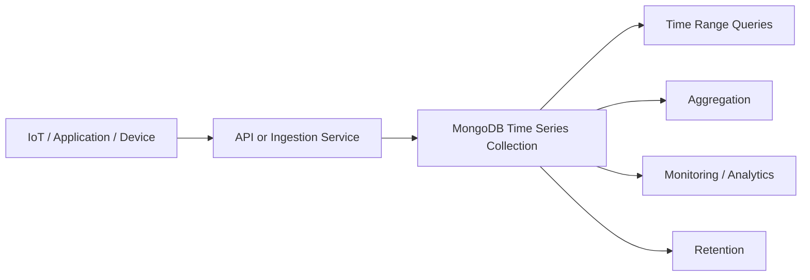
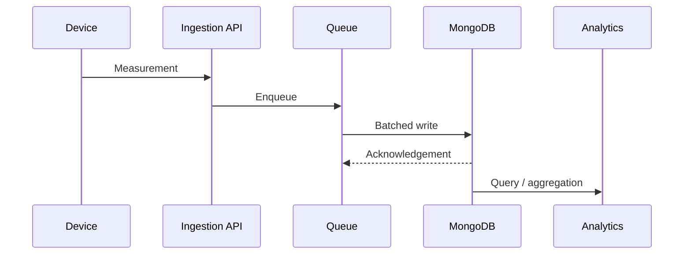
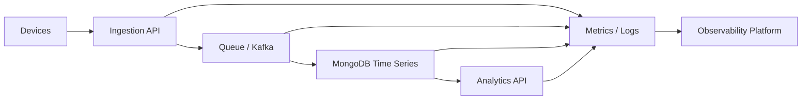
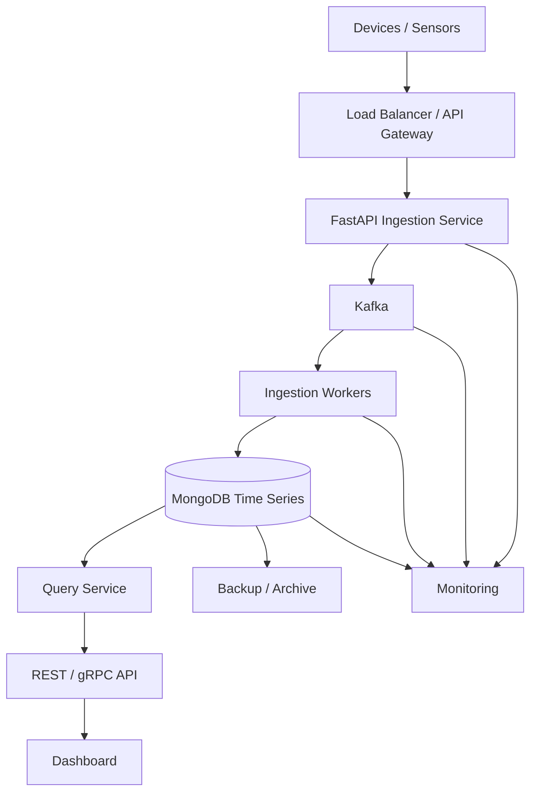

# 22- Time Series Collections

## Overview

MongoDB Time Series Collections are specialized collections designed for workloads where documents represent measurements observed over time.

Typical examples include:

- Application metrics
- IoT sensor readings
- Device telemetry
- Infrastructure monitoring
- Financial market observations
- Environmental measurements
- User activity measurements
- Industrial equipment telemetry
- GPS/location measurements

A normal MongoDB collection can store time-series data, but a dedicated time series collection provides MongoDB with information about the temporal structure of the data. MongoDB can use that information to organize and optimize storage and queries for time-oriented workloads.

A typical model is:

```text
Device / Sensor
      |
      +---- timestamp
      +---- temperature
      +---- humidity
      +---- location
      +---- metadata
```

The core design principle is:

```text
One measurement
      |
      v
Timestamp + Metadata + Measurements
      |
      v
Time Series Collection
```

Time series collections are particularly valuable when applications continuously append measurements and query them over time ranges.

## Why Time Series Collections Exist

A traditional collection might contain:

```json
{
  "device_id": "sensor-001",
  "timestamp": "2026-09-21T10:00:00Z",
  "temperature": 27.4
}
```

With millions or billions of measurements, several characteristics become important:

- Writes are predominantly append-oriented.
- Queries frequently use time ranges.
- Data is naturally grouped by a measurement source.
- Older data may have different retention requirements.
- Storage efficiency matters.
- Queries frequently aggregate measurements over time.

MongoDB Time Series Collections are designed around these characteristics.

The architecture can be viewed as:



## When to Use Time Series Collections

Time series collections are appropriate when documents represent measurements associated with a time dimension.

Good examples:

| Workload | Suitable |
|---|---|
| IoT sensor readings | Yes |
| Application metrics | Yes |
| CPU/memory measurements | Yes |
| Device telemetry | Yes |
| Temperature readings | Yes |
| Stock price observations | Often |
| GPS telemetry | Often |
| Audit records | Usually not the primary choice |
| User accounts | No |
| Orders | No |
| Product catalog | No |
| Highly relational transactional data | Usually no |

The important question is not simply whether a document has a timestamp.

The workload should have a meaningful time-series access pattern.

## Time Series Collection Model

A time series collection is created with configuration describing the time field and, optionally, metadata.

Conceptually:

```text
Time Series Collection
|
+-- timeField
|     |
|     +-- timestamp
|
+-- metaField
|     |
|     +-- device_id
|     +-- location
|     +-- sensor_type
|
+-- measurement fields
      |
      +-- temperature
      +-- humidity
      +-- pressure
```

For example:

```json
{
  "timestamp": "2026-09-21T10:15:00Z",
  "metadata": {
    "device_id": "sensor-001",
    "location": "factory-a",
    "sensor_type": "environment"
  },
  "temperature": 27.4,
  "humidity": 63.2
}
```

The exact field names are application-defined.

## `timeField`

The `timeField` identifies the field containing the timestamp associated with the measurement.

Example:

```javascript
db.createCollection("sensor_readings", {
  timeseries: {
    timeField: "timestamp"
  }
})
```

The time field should contain date values representing when the measurement occurred.

A good time field should be:

- Consistently populated.
- Semantically meaningful.
- Stored as a BSON `Date`.
- Suitable for range-based queries.
- Generated using a consistent time standard.

For distributed systems, UTC timestamps are generally the safest application convention.

## `metaField`

The `metaField` identifies metadata that describes the source or context of measurements.

Example:

```javascript
db.createCollection("sensor_readings", {
  timeseries: {
    timeField: "timestamp",
    metaField: "metadata"
  }
})
```

A document can then contain:

```json
{
  "timestamp": "2026-09-21T10:15:00Z",
  "metadata": {
    "device_id": "sensor-001",
    "site": "factory-a"
  },
  "temperature": 27.4
}
```

Metadata should describe the measurement source rather than represent frequently changing measurements.

Good metadata:

```json
{
  "device_id": "sensor-001",
  "site": "factory-a",
  "sensor_type": "temperature"
}
```

Poor metadata:

```json
{
  "temperature": 27.4,
  "current_status": "warning"
}
```

Frequently changing values generally belong in measurement fields rather than metadata.

## Measurement vs Metadata

This distinction is important for both modeling and performance.

| Field | Category | Example |
|---|---|---|
| `timestamp` | Time | `2026-09-21T10:00:00Z` |
| `device_id` | Metadata | `sensor-001` |
| `site` | Metadata | `factory-a` |
| `sensor_type` | Metadata | `temperature` |
| `temperature` | Measurement | `27.4` |
| `humidity` | Measurement | `63.2` |
| `pressure` | Measurement | `1012.4` |

A useful rule is:

> Metadata identifies the source or context; measurements describe the observed value.

## Creating a Time Series Collection

Using `mongosh`:

```javascript
db.createCollection("sensor_readings", {
  timeseries: {
    timeField: "timestamp",
    metaField: "metadata",
    granularity: "minutes"
  }
})
```

The `granularity` setting provides MongoDB with information about the expected frequency of measurements.

Common granularity choices are:

- `seconds`
- `minutes`
- `hours`

Choose the value based on the actual measurement frequency rather than arbitrarily selecting the smallest possible value.

## Granularity

Granularity communicates the approximate interval between measurements for a time series.

For example:

```text
Measurement frequency:
1 event every 5 seconds
        |
        v
seconds-oriented workload
```

versus:

```text
Measurement frequency:
1 event every 15 minutes
        |
        v
minutes/hours-oriented workload
```

Granularity affects how MongoDB organizes time-series data internally.

The goal is not to make the granularity exactly equal to every individual measurement interval. It should represent the general workload characteristics.

### Granularity Selection

| Workload | Typical consideration |
|---|---|
| High-frequency telemetry | `seconds` |
| Application metrics | `seconds` or `minutes` |
| IoT measurements every few minutes | `minutes` |
| Hourly business measurements | `hours` |

If the workload changes significantly over time, reassess the collection configuration rather than assuming one configuration fits every workload.

## Time Series Storage Model

Time series collections are implemented differently from ordinary collections.

MongoDB internally organizes measurements into optimized storage structures rather than treating every measurement exactly like an independent ordinary document.

Conceptually:

```text
Application Measurements
        |
        v
Time Series Collection
        |
        v
Internal bucket organization
        |
        +---- related time range
        +---- related metadata
        +---- measurements
```

Applications interact with the logical measurement documents.

The internal bucket representation is an implementation detail and should not be treated as an application-level schema.

This distinction matters because developers should query and update the logical time-series documents rather than building application logic around internal bucket structures.

## Bucket Concept

A time series collection groups related measurements into internal buckets.

Conceptually:

```text
Device A
|
+-- Bucket 1
|    +-- 10:00
|    +-- 10:01
|    +-- 10:02
|
+-- Bucket 2
     +-- 10:03
     +-- 10:04
     +-- 10:05
```

This can improve storage efficiency because multiple measurements can share structural information.

The bucket model is one reason time series collections can be significantly more storage-efficient for appropriate workloads than treating every measurement as an unrelated document.

## Bucket Design Implications

Bucket organization makes the choice of metadata important.

If measurements from the same source are logically grouped together:

```text
metadata.device_id = sensor-001
```

MongoDB can organize the workload more effectively than if every document has highly unstable source metadata.

Avoid creating metadata values that change for every measurement.

For example:

```json
{
  "metadata": {
    "request_id": "unique-for-every-measurement"
  }
}
```

is usually a poor time-series metadata design.

## Inserting Measurements

A normal insert operation can be used.

```javascript
db.sensor_readings.insertOne({
  timestamp: new Date(),
  metadata: {
    device_id: "sensor-001",
    site: "factory-a"
  },
  temperature: 27.4,
  humidity: 63.2
})
```

Multiple measurements can be inserted in batches:

```javascript
db.sensor_readings.insertMany([
  {
    timestamp: new Date("2026-09-21T10:00:00Z"),
    metadata: {
      device_id: "sensor-001"
    },
    temperature: 27.1
  },
  {
    timestamp: new Date("2026-09-21T10:01:00Z"),
    metadata: {
      device_id: "sensor-001"
    },
    temperature: 27.2
  }
])
```

For high-throughput ingestion, application-side batching can reduce network and per-operation overhead.

## Python Ingestion

Using PyMongo:

```python
from datetime import datetime, timezone

from pymongo import MongoClient

client = MongoClient(
    MONGODB_URI,
    serverSelectionTimeoutMS=5_000,
)

collection = client["telemetry"]["sensor_readings"]

document = {
    "timestamp": datetime.now(timezone.utc),
    "metadata": {
        "device_id": "sensor-001",
        "site": "factory-a",
    },
    "temperature": 27.4,
    "humidity": 63.2,
}

collection.insert_one(document)
```

For high-throughput ingestion:

```python
from datetime import datetime, timezone

documents = [
    {
        "timestamp": datetime.now(timezone.utc),
        "metadata": {
            "device_id": "sensor-001",
        },
        "temperature": 27.4,
    },
    {
        "timestamp": datetime.now(timezone.utc),
        "metadata": {
            "device_id": "sensor-001",
        },
        "temperature": 27.5,
    },
]

collection.insert_many(documents, ordered=False)
```

Using `ordered=False` can allow independent writes to proceed without requiring the entire batch to preserve ordering.

The appropriate setting depends on application correctness requirements.

## Time Field Requirements

The time field should represent the measurement timestamp, not merely ingestion time.

Consider:

```text
Device measures at 10:00
       |
Network delay
       |
Server receives at 10:03
```

There are two different timestamps:

```text
measurement_time = 10:00
ingestion_time   = 10:03
```

If the business requirement is to analyze device behavior, `measurement_time` is usually the primary time-series dimension.

It can still be useful to store both:

```json
{
  "timestamp": "2026-09-21T10:00:00Z",
  "ingested_at": "2026-09-21T10:03:12Z"
}
```

This allows operational analysis of ingestion latency.

## Late-Arriving Data

Distributed systems frequently produce late measurements.

Example:

```text
Device
  |
  | measurement at 10:00
  |
  X network failure
  |
  v
Server receives at 10:10
```

The measurement's timestamp remains:

```text
10:00
```

rather than being changed to:

```text
10:10
```

unless the application's semantics explicitly define the timestamp as ingestion time.

Time-series systems should be designed with late-arriving measurements in mind.

## Out-of-Order Measurements

Measurements may arrive out of order:

```text
10:00
10:02
10:01
10:03
```

This is common when devices buffer data or networks reorder delivery.

Applications should not assume that ingestion order equals measurement-time order.

Queries should explicitly sort by the time field when ordering matters:

```javascript
db.sensor_readings.find({
  "metadata.device_id": "sensor-001",
  timestamp: {
    $gte: ISODate("2026-09-21T10:00:00Z"),
    $lt: ISODate("2026-09-21T11:00:00Z")
  }
}).sort({
  timestamp: 1
})
```

## Querying Time Series Data

The most common query pattern is a time range combined with metadata filtering.

Example:

```javascript
db.sensor_readings.find({
  "metadata.device_id": "sensor-001",
  timestamp: {
    $gte: ISODate("2026-09-21T10:00:00Z"),
    $lt: ISODate("2026-09-21T11:00:00Z")
  }
})
```

This corresponds to the typical access pattern:

```text
Identify source
     +
Select time range
     |
     v
Retrieve measurements
```

Time range filtering should be explicit in production queries.

Avoid unrestricted queries over large time-series collections.

## Querying by Metadata

Metadata is frequently used to narrow the time series.

Example:

```javascript
db.sensor_readings.find({
  "metadata.site": "factory-a",
  timestamp: {
    $gte: ISODate("2026-09-21T00:00:00Z"),
    $lt: ISODate("2026-09-22T00:00:00Z")
  }
})
```

The query pattern should influence metadata design.

If the application frequently queries:

```text
site
+
sensor_type
+
time range
```

those dimensions should be represented in a way that supports the expected access pattern.

## Aggregating Time Series Data

Aggregation is often more important than retrieving individual measurements.

For example, calculate average temperature:

```javascript
db.sensor_readings.aggregate([
  {
    $match: {
      "metadata.device_id": "sensor-001",
      timestamp: {
        $gte: ISODate("2026-09-21T00:00:00Z"),
        $lt: ISODate("2026-09-22T00:00:00Z")
      }
    }
  },
  {
    $group: {
      _id: null,
      average_temperature: {
        $avg: "$temperature"
      },
      maximum_temperature: {
        $max: "$temperature"
      },
      minimum_temperature: {
        $min: "$temperature"
      }
    }
  }
])
```

For large datasets, filtering early is critical.

```text
Large collection
      |
      v
$match time range + metadata
      |
      v
Reduced dataset
      |
      v
$group / $avg / $max / $min
```

## Time Bucketing

Time-series applications often need fixed intervals.

For example:

```text
Raw measurements
      |
      v
5-minute buckets
      |
      +---- average
      +---- minimum
      +---- maximum
```

MongoDB aggregation operators such as `$dateTrunc` can be used to group timestamps into fixed intervals.

Example:

```javascript
db.sensor_readings.aggregate([
  {
    $match: {
      "metadata.device_id": "sensor-001",
      timestamp: {
        $gte: ISODate("2026-09-21T00:00:00Z"),
        $lt: ISODate("2026-09-22T00:00:00Z")
      }
    }
  },
  {
    $group: {
      _id: {
        bucket: {
          $dateTrunc: {
            date: "$timestamp",
            unit: "minute",
            binSize: 5
          }
        }
      },
      average_temperature: {
        $avg: "$temperature"
      },
      maximum_temperature: {
        $max: "$temperature"
      },
      minimum_temperature: {
        $min: "$temperature"
      }
    }
  },
  {
    $sort: {
      "_id.bucket": 1
    }
  }
])
```

This pattern is useful for dashboards and monitoring systems.

## Downsampling

Storing every raw measurement forever is often unnecessary.

A common architecture is:

```text
Raw data
  |
  +---- Recent detailed queries
  |
  v
Downsampling
  |
  +---- 1 minute
  +---- 5 minutes
  +---- 1 hour
  |
  v
Long-term analytics
```

For example:

```text
10,000 raw measurements
        |
        v
Hourly aggregates
        |
        v
1 long-term record per hour
```

Downsampling reduces storage and query costs but sacrifices detail.

Keep raw data for the period required by operational and analytical requirements before aggregating it.

## Retention

Time-series workloads frequently have finite retention requirements.

For example:

```text
Raw telemetry: 30 days
Hourly aggregates: 1 year
Daily aggregates: 5 years
```

MongoDB time series collections support automatic expiration through collection configuration.

Example:

```javascript
db.createCollection("sensor_readings", {
  timeseries: {
    timeField: "timestamp",
    metaField: "metadata",
    granularity: "minutes"
  },
  expireAfterSeconds: 2592000
})
```

`2592000` seconds is approximately 30 days.

Retention should be selected based on:

- Compliance.
- Business requirements.
- Operational needs.
- Storage costs.
- Recovery requirements.
- Analytics requirements.

## Retention and Downsampling

Retention and downsampling solve different problems.

| Mechanism | Purpose |
|---|---|
| Retention | Remove old data |
| Downsampling | Reduce data resolution |
| Archiving | Move data to cheaper long-term storage |
| Aggregation | Produce derived metrics |

A mature architecture may combine them:

```text
Raw measurements
      |
      +---- 30 days
      |
      v
Hourly aggregates
      |
      +---- 1 year
      |
      v
Daily aggregates
      |
      +---- long-term
```

## Indexing

Time-series collections have specialized indexing behavior.

MongoDB automatically creates an index related to the configured time field for time-series collections.

Applications may still need additional indexes based on access patterns.

For example, queries may frequently filter on metadata:

```javascript
db.sensor_readings.createIndex({
  "metadata.device_id": 1,
  timestamp: 1
})
```

The exact index strategy should be validated with actual workload measurements and `explain()`.

Do not blindly create indexes for every metadata field.

## Index Design

Suppose the main query is:

```javascript
db.sensor_readings.find({
  "metadata.device_id": "sensor-001",
  timestamp: {
    $gte: start,
    $lt: end
  }
})
```

The access pattern is:

```text
Equality:
device_id

Range:
timestamp
```

This is fundamentally different from a query that only filters by:

```text
timestamp
```

Index design should follow the real query workload.

Use:

```javascript
explain("executionStats")
```

to verify the resulting plan.

## Explain Plans

A time-series query should still be measured.

Example:

```javascript
db.sensor_readings
  .find({
    "metadata.device_id": "sensor-001",
    timestamp: {
      $gte: ISODate("2026-09-21T00:00:00Z"),
      $lt: ISODate("2026-09-21T01:00:00Z")
    }
  })
  .explain("executionStats")
```

Important metrics include:

- `nReturned`
- `totalKeysExamined`
- `totalDocsExamined`
- Execution time
- Winning plan

A useful diagnostic relationship is:

```text
totalDocsExamined >> nReturned
```

which can indicate that the query is examining substantially more data than it returns.

## Time Series and Working Set

Time-series workloads can become very large.

For example:

```text
1,000 devices
x
1 measurement/second
x
86,400 seconds/day
=
86.4 million measurements/day
```

At this scale, query design and storage architecture become critical.

Consider:

- Working-set size.
- Memory.
- Storage throughput.
- Query selectivity.
- Retention.
- Aggregation workload.
- Index size.
- Ingestion throughput.

Do not evaluate a time-series design using only a development dataset containing a few thousand documents.

## High-Cardinality Metadata

Metadata cardinality matters.

Consider:

```text
10 devices
```

versus:

```text
10 million unique devices
```

The storage and query characteristics are substantially different.

High-cardinality metadata is not inherently invalid, but it requires capacity and access-pattern analysis.

Avoid introducing unnecessary metadata dimensions that create highly fragmented workloads.

## Hot Sources

A single source can become disproportionately active.

Example:

```text
sensor-001 -> 50,000 writes/sec
sensor-002 -> 100 writes/sec
sensor-003 -> 100 writes/sec
```

This creates a hot-source workload.

Possible mitigations include:

- Batching.
- Load distribution.
- Partitioning upstream ingestion.
- Kafka buffering.
- Appropriate sharding.
- Reducing unnecessary writes.

Do not assume that a time-series collection automatically solves all ingestion bottlenecks.

## Time Series and Sharding

Large time-series deployments may require horizontal scaling.

The shard-key strategy must account for:

- Metadata cardinality.
- Time distribution.
- Query targeting.
- Write distribution.
- Hot partitions.
- Historical queries.

A naïve monotonically increasing shard key can create undesirable write concentration.

Conceptually:

```text
Poor distribution

Time -->
-------------------------------->
Shard A  ███████████████████████
Shard B
Shard C
```

A better design aims to distribute writes while retaining useful query targeting:

```text
Time + source identity
        |
        v
Distributed workload
```

The exact shard-key strategy must be validated against the actual workload rather than applying a universal formula.

## Write Throughput

Time-series ingestion is often write-heavy.

A typical ingestion path might be:



For moderate workloads, direct ingestion may be sufficient.

For very high-throughput systems, a queue or streaming platform such as Kafka can absorb bursts and decouple device traffic from database writes.

## Batching Strategy

If a device produces:

```text
1,000 measurements/sec
```

sending one database request for every measurement can create unnecessary network overhead.

A batching strategy can instead collect:

```text
100 measurements
      |
      v
insertMany()
```

The batch size should be determined through load testing.

Very large batches can increase:

- Request latency.
- Memory consumption.
- Retry cost.
- Failure impact.

## Write Concern

Write concern affects durability and latency.

For example:

```python
from pymongo import MongoClient, WriteConcern

client = MongoClient(MONGODB_URI)

collection = client["telemetry"].get_collection(
    "sensor_readings",
    write_concern=WriteConcern(w="majority"),
)
```

For critical telemetry, stronger durability may be appropriate.

For disposable high-volume measurements, applications may choose different trade-offs depending on business requirements.

Do not weaken write concern merely to increase benchmark throughput without understanding the failure implications.

## Time Series and Transactions

Time-series workloads are usually append-oriented and do not commonly require multi-document transactions for every measurement.

A typical measurement:

```text
Insert measurement
```

is already an individual write.

Transactions become relevant when a measurement write must be coordinated with other state changes.

For example:

```text
Measurement
    +
Device state update
    +
Alert state transition
```

If these operations require atomicity, a transaction may be appropriate.

However, wrapping every telemetry insert in a transaction can unnecessarily increase overhead.

## FastAPI Architecture

A FastAPI telemetry service might use:

```text
Device
   |
   v
FastAPI
   |
   +---- Validation
   |
   +---- Authentication
   |
   +---- Batching / Queue
   |
   v
MongoDB Time Series Collection
```

A simplified endpoint:

```python
from datetime import datetime
from pydantic import BaseModel
from fastapi import FastAPI

app = FastAPI()


class Measurement(BaseModel):
    device_id: str
    timestamp: datetime
    temperature: float
    humidity: float


@app.post("/measurements")
def create_measurement(measurement: Measurement):
    document = {
        "timestamp": measurement.timestamp,
        "metadata": {
            "device_id": measurement.device_id,
        },
        "temperature": measurement.temperature,
        "humidity": measurement.humidity,
    }

    collection.insert_one(document)

    return {"status": "accepted"}
```

Production systems should also address:

- Authentication.
- Rate limiting.
- Validation.
- Batching.
- Timeouts.
- Retry behavior.
- Backpressure.
- Observability.
- Duplicate measurement handling.

## FastAPI and High-Volume Ingestion

For high-volume telemetry, avoid assuming that:

```text
HTTP request
    |
    v
MongoDB insert
```

is always the optimal architecture.

A more scalable pattern can be:

```text
Devices
   |
   v
Nginx / Load Balancer
   |
   v
FastAPI
   |
   v
Kafka
   |
   v
Ingestion Workers
   |
   v
MongoDB Time Series
```

Benefits include:

- Burst absorption.
- Retry capability.
- Consumer scaling.
- Decoupling API latency from database writes.
- Better operational control.

This introduces additional infrastructure and should be justified by workload requirements.

## Django Integration

Django applications can use MongoDB through PyMongo or MongoDB-oriented libraries.

A service-layer design is often clearer for time-series workloads:

```text
Django View
    |
    v
Service
    |
    v
Repository
    |
    v
PyMongo
    |
    v
Time Series Collection
```

Avoid treating a MongoDB time-series collection as if it were a normal Django relational model.

Time-series ingestion and aggregation often fit naturally into repository/service abstractions.

## Python Aggregation

A Python repository can expose domain-oriented methods:

```python
from datetime import datetime


class SensorRepository:
    def __init__(self, collection):
        self.collection = collection

    def average_temperature(
        self,
        device_id: str,
        start: datetime,
        end: datetime,
    ) -> float | None:
        pipeline = [
            {
                "$match": {
                    "metadata.device_id": device_id,
                    "timestamp": {
                        "$gte": start,
                        "$lt": end,
                    },
                }
            },
            {
                "$group": {
                    "_id": None,
                    "average": {"$avg": "$temperature"},
                }
            },
        ]

        result = next(self.collection.aggregate(pipeline), None)
        return result["average"] if result else None
```

This keeps MongoDB-specific query logic out of HTTP handlers.

## Duplicate Measurements

Devices may retry transmission:

```text
Measurement
    |
Network timeout
    |
Device retries
    |
MongoDB receives twice
```

If duplicate measurements are unacceptable, define an idempotency strategy.

Possible identifiers include:

```text
device_id
+
measurement_id
```

Example:

```json
{
  "measurement_id": "sensor-001-174000123",
  "timestamp": "...",
  "metadata": {
    "device_id": "sensor-001"
  },
  "temperature": 27.4
}
```

A unique index can then enforce uniqueness where the workload and time-series collection constraints permit it.

The important point is that duplicate handling must be designed explicitly rather than assuming network retries cannot happen.

## Schema Evolution

Telemetry schemas often evolve.

Initial schema:

```json
{
  "temperature": 27.4
}
```

Later:

```json
{
  "temperature": 27.4,
  "humidity": 63.2
}
```

Later still:

```json
{
  "temperature": 27.4,
  "humidity": 63.2,
  "pressure": 1012.4
}
```

MongoDB's flexible schema can support gradual evolution.

However, consumers and analytics pipelines must understand optional fields.

For production systems:

- Version event contracts when necessary.
- Define defaults.
- Validate required fields.
- Test old and new data together.
- Avoid silently changing field semantics.

## Schema Validation

Schema validation can be used to prevent malformed measurements.

For example, validation can enforce:

- Timestamp is a date.
- Metadata is an object.
- Device ID is a string.
- Temperature is numeric.

Validation is particularly useful when multiple producers write to the same collection.

However, validation should complement application-level validation rather than replace it.

## Data Quality

Time-series systems are especially sensitive to bad timestamps.

Potential problems include:

```text
Future timestamp
1970 timestamp
Timezone mismatch
Clock drift
Duplicate timestamp
Wrong device ID
Incorrect measurement unit
```

For example:

```text
Celsius vs Fahrenheit
```

can produce numerically valid but semantically incorrect data.

Validate both:

```text
type correctness
```

and:

```text
domain correctness
```

where appropriate.

## Units and Semantics

Avoid ambiguous fields:

```json
{
  "temperature": 72
}
```

Does `72` mean:

```text
72 °C
72 °F
```

A stronger contract defines the unit explicitly:

```json
{
  "temperature_celsius": 22.2
}
```

or:

```json
{
  "temperature": 22.2,
  "temperature_unit": "C"
}
```

For controlled systems, encoding units into the schema can prevent expensive analytical errors.

## Monitoring

Monitor both MongoDB and the ingestion pipeline.

Important metrics include:

| Metric | Why it matters |
|---|---|
| Insert throughput | Capacity planning |
| Query latency | User experience |
| Storage growth | Cost planning |
| Collection size | Capacity |
| Index size | Memory/storage |
| Replication lag | HA |
| Connections | Resource usage |
| CPU | Saturation |
| Memory | Working set |
| Disk I/O | Storage bottleneck |
| Consumer lag | Pipeline health |
| Ingestion latency | End-to-end health |
| Rejected/invalid measurements | Data quality |

For telemetry systems, ingestion latency is often as important as database query latency.

## Observability Architecture



Observe the entire path rather than MongoDB alone.

## Storage Growth

Estimate storage before production.

For example:

```text
Devices = 10,000
Measurements/device/sec = 1
Measurements/day =
10,000 × 86,400
=
864,000,000 measurements/day
```

Even modest measurement documents can result in substantial storage growth.

Capacity planning should account for:

- Data size.
- Indexes.
- Replication.
- Retention.
- Compression.
- Backups.
- Temporary aggregation workload.
- Growth rate.

## Cost Optimization

The largest cost lever for time-series workloads is often data volume.

Useful strategies include:

- Appropriate retention.
- Downsampling.
- Archiving.
- Compression.
- Batch ingestion.
- Avoiding unnecessary indexes.
- Querying bounded time ranges.
- Separating hot and historical workloads where appropriate.

Do not optimize only database CPU while ignoring storage growth.

## High Availability

Time-series collections inherit MongoDB's availability architecture.

For production:

```text
Application
    |
    v
MongoDB Replica Set
    |
    +---- Primary
    +---- Secondary
    +---- Secondary
```

Replication provides:

- Failover.
- Redundancy.
- Data durability options.
- Read scaling in appropriate workloads.

Time-series workloads still require normal replica-set monitoring and operational procedures.

## Backup and Recovery

Time-series data can be large enough to make backup strategy a major architectural concern.

Consider:

- Backup frequency.
- Retention.
- Point-in-time recovery.
- Restore duration.
- Storage costs.
- Recovery point objective.
- Recovery time objective.

A common strategy is:

```text
Recent operational data
        |
        v
MongoDB production
        |
        +---- Backups
        |
        +---- Archived aggregates
```

Test restores rather than assuming backups are usable.

## Disaster Recovery

Define what happens if the primary deployment becomes unavailable.

A recovery plan should specify:

```text
Failure
  |
  v
Detect
  |
  v
Failover / Restore
  |
  v
Validate data
  |
  v
Resume ingestion
  |
  v
Validate downstream systems
```

For critical telemetry, also consider whether devices can buffer measurements while MongoDB is unavailable.

## Security

Time-series data can contain sensitive operational information.

Examples:

- Device locations.
- User activity.
- Infrastructure metrics.
- Industrial telemetry.
- Vehicle positions.
- Business performance measurements.

Security controls should include:

- Authentication.
- Least-privilege authorization.
- TLS.
- Network isolation.
- Secret management.
- Encryption at rest.
- Audit logging where required.
- Data retention policies.

Do not expose MongoDB directly to internet-connected devices.

Prefer:

```text
Device
  |
TLS
  |
API Gateway / Ingestion Service
  |
Authenticated request
  |
MongoDB
```

## Production Architecture

A robust telemetry architecture might look like:



The architecture should be simplified if the workload does not justify Kafka or additional infrastructure.

## Time Series Collections vs Normal Collections

| Characteristic | Time Series Collection | Normal Collection |
|---|---|---|
| Time-oriented measurements | Excellent fit | Possible |
| Append-heavy workloads | Strong fit | General purpose |
| Specialized storage | Yes | No |
| Time-range analytics | Strong fit | Depends on indexes |
| Arbitrary transactional documents | Poor fit | Strong fit |
| Flexible application records | General-purpose collection preferred | Strong fit |
| Retention-oriented workloads | Strong fit | Possible |
| IoT telemetry | Strong fit | Possible |
| Orders/customers | Poor fit | Strong fit |

The choice should follow workload characteristics, not the presence of a timestamp alone.

## Time Series Collections vs Relational Time-Series Designs

A PostgreSQL application might represent telemetry as:

```text
measurements
------------
id
device_id
timestamp
temperature
humidity
```

MongoDB provides a document-oriented alternative:

```json
{
  "timestamp": "...",
  "metadata": {
    "device_id": "sensor-001"
  },
  "temperature": 27.4,
  "humidity": 63.2
}
```

The correct choice depends on:

- Existing architecture.
- Query patterns.
- Operational expertise.
- Scale.
- Transaction requirements.
- Analytics requirements.
- Ecosystem.
- Cost.

Do not select MongoDB merely because the data has timestamps.

## When Not to Use Time Series Collections

Avoid them when the primary workload is:

- Transactional business entities.
- Frequently updated records.
- Complex relational joins.
- User/account management.
- Order processing.
- Product catalogs.
- Data where time is incidental rather than fundamental.

For example:

```json
{
  "_id": "order-123",
  "created_at": "...",
  "customer_id": "customer-123",
  "status": "paid"
}
```

is not inherently a time-series workload simply because it has `created_at`.

## Common Mistakes

### Treating Every Timestamped Collection as a Time Series

A timestamp alone does not make a workload time-series.

Evaluate:

```text
Measurement frequency
+
Time-range queries
+
Append behavior
+
Source metadata
```

before choosing the collection type.

### Using Ingestion Time Instead of Measurement Time

Network delay can distort analytical results.

Store the timestamp representing the actual business or measurement event.

### Putting Measurements in Metadata

Poor:

```json
{
  "metadata": {
    "temperature": 27.4
  }
}
```

Better:

```json
{
  "metadata": {
    "device_id": "sensor-001"
  },
  "temperature": 27.4
}
```

### Creating Excessively High-Cardinality Metadata

Metadata should describe the source or context.

Do not add arbitrary unique values without a reason.

### Ignoring Late Data

Devices and distributed systems can send delayed measurements.

Design ingestion and analytics logic around event time rather than assuming arrival order.

### Storing Unlimited Raw Data

Unbounded retention can create substantial storage and operational costs.

Define retention and archival policies early.

### Querying Without a Time Bound

A query over years of telemetry can be extremely expensive.

Prefer:

```text
device + bounded time range
```

over:

```text
device
```

with no temporal restriction.

### Over-Indexing

Indexes improve reads but consume storage and add write overhead.

Create indexes from measured query patterns.

### Ignoring Units

A numerically valid measurement can still be semantically invalid.

Define units explicitly.

### Performing Expensive Work During Ingestion

Avoid synchronous analytics in the ingestion path:

```text
Device
  |
  v
API
  |
  v
Insert
  |
  v
Huge aggregation
  |
  v
Response
```

Prefer asynchronous processing where appropriate.

## Performance Pitfalls

| Problem | Why it happens | Mitigation |
|---|---|---|
| Slow historical queries | Huge time range | Bound time ranges |
| High ingestion latency | Too many individual writes | Batch writes |
| Large storage growth | Unlimited retention | TTL/retention/archive |
| Query scans too much data | Poor access pattern | Review indexes and filters |
| High CPU during analytics | Large aggregations | Pre-aggregate/downsample |
| Hot ingestion source | Uneven workload | Rebalance architecture |
| Excessive memory use | Large working set | Capacity planning |
| High network usage | Full documents returned | Projection |
| Duplicate measurements | Retries | Idempotency strategy |

## Troubleshooting Methodology

### Slow Time Range Query

```text
Symptom
↓
Time-range query is slow
↓
Possible causes
- Very large time range
- Poor metadata filtering
- Inefficient index
- Large result set
- Expensive aggregation
↓
Isolation strategy
- Test narrow time range
- Test metadata-only filter
- Run explain()
- Compare returned document count
↓
Diagnostic commands
```

```javascript
db.sensor_readings
  .find({
    "metadata.device_id": "sensor-001",
    timestamp: {
      $gte: ISODate("2026-09-21T00:00:00Z"),
      $lt: ISODate("2026-09-21T01:00:00Z")
    }
  })
  .explain("executionStats")
```

```text
Root cause
↓
Determine whether the bottleneck is filtering, scanning, sorting, aggregation, or result transfer
↓
Corrective action
- Improve query shape
- Add or revise index
- Reduce time range
- Add projection
- Pre-aggregate
↓
Prevention
- Query-performance tests
- Slow-query monitoring
- Representative load testing
```

### Ingestion Throughput Is Too Low

```text
Symptom
↓
MongoDB cannot keep up with incoming measurements
↓
Possible causes
- One-write-per-request pattern
- Network overhead
- Excessive indexes
- Hot source
- Insufficient database capacity
- Synchronous downstream work
↓
Isolation strategy
- Measure writes/sec
- Measure batch size
- Inspect CPU/I/O
- Inspect indexes
- Measure application latency
↓
Diagnostic commands
```

```javascript
db.serverStatus()
```

```javascript
db.sensor_readings.stats()
```

```text
Root cause
↓
Identify whether the bottleneck is application, network, storage, or MongoDB processing
↓
Corrective action
- Batch writes
- Reduce unnecessary indexes
- Introduce queueing
- Scale infrastructure
- Optimize ingestion path
↓
Prevention
- Load testing
- Capacity planning
- Ingestion-rate monitoring
```

### Storage Growth Is Unexpected

```text
Symptom
↓
Storage usage grows faster than expected
↓
Possible causes
- Excessive retention
- Higher measurement rate
- Large documents
- Additional indexes
- Replication/backup requirements
↓
Isolation strategy
- Calculate measurements/day
- Measure average document size
- Inspect collection/index statistics
- Review retention configuration
↓
Diagnostic commands
```

```javascript
db.sensor_readings.stats()
```

```javascript
db.sensor_readings.aggregate([
  {
    $collStats: {
      storageStats: {}
    }
  }
])
```

```text
Root cause
↓
Determine whether growth is caused by data volume, document size, indexes, or retention
↓
Corrective action
- Adjust retention
- Downsample
- Archive
- Remove unnecessary fields/indexes
↓
Prevention
- Storage-growth alerts
- Capacity forecasting
- Retention reviews
```

### Incorrect Time-Series Results

```text
Symptom
↓
Dashboard or analytics contains unexpected measurements
↓
Possible causes
- Timezone conversion
- Incorrect measurement timestamp
- Late-arriving data
- Duplicate events
- Device clock drift
- Incorrect units
↓
Isolation strategy
- Inspect raw documents
- Compare event time and ingestion time
- Check device metadata
- Validate units
↓
Diagnostic commands
```

```javascript
db.sensor_readings.find({
  "metadata.device_id": "sensor-001"
}).sort({
  timestamp: 1
}).limit(20)
```

```text
Root cause
↓
Identify whether the error originated at the device, ingestion layer, or query layer
↓
Corrective action
- Normalize timestamps
- Fix producer contracts
- Deduplicate
- Correct aggregation logic
↓
Prevention
- Schema validation
- Data-quality checks
- Contract testing
- Clock monitoring
```

## Operational Checklist

- [ ] Define a meaningful `timeField`.
- [ ] Store measurement timestamps consistently.
- [ ] Use UTC as the application convention where appropriate.
- [ ] Define metadata that identifies the measurement source.
- [ ] Choose granularity based on actual measurement frequency.
- [ ] Model for real query patterns.
- [ ] Bound time-range queries.
- [ ] Use aggregation for analytical workloads.
- [ ] Validate query plans with `explain()`.
- [ ] Avoid unnecessary indexes.
- [ ] Define retention requirements.
- [ ] Consider downsampling and archival.
- [ ] Design for late-arriving measurements.
- [ ] Design for duplicate ingestion.
- [ ] Monitor ingestion throughput and latency.
- [ ] Monitor storage growth.
- [ ] Monitor replication health.
- [ ] Load-test realistic measurement volumes.
- [ ] Protect ingestion endpoints with authentication and authorization.
- [ ] Use TLS for production traffic.
- [ ] Test backup restoration.
- [ ] Document disaster-recovery procedures.
- [ ] Separate ingestion from expensive analytical processing where required.

## Interview Traps

### Why use a MongoDB Time Series Collection instead of a normal collection?

A time-series collection is optimized for workloads consisting of measurements associated with time and metadata. It provides specialized storage and query behavior for this workload.

### Does every collection containing `created_at` qualify as a time-series workload?

No. A timestamp alone is not sufficient. The workload should be fundamentally measurement- and time-oriented.

### What is `timeField`?

It identifies the field containing the timestamp associated with each measurement.

### What is `metaField`?

It identifies metadata describing the source or context of the measurements, such as device ID, site, or sensor type.

### Why does metadata matter?

MongoDB uses the temporal and metadata characteristics of the workload when organizing time-series data internally. Stable source metadata also aligns naturally with common time-series query patterns.

### What is granularity?

Granularity describes the expected measurement frequency and helps MongoDB optimize time-series storage organization.

### Should measurements be stored in `metaField`?

No. Metadata should describe the source or context. Values such as temperature, pressure, and humidity are measurements.

### How should late-arriving measurements be handled?

Preserve the actual measurement timestamp when event time is the business requirement. Do not assume arrival time represents measurement time.

### How do you query a time-series collection efficiently?

Use the actual access pattern, typically combining metadata filtering with a bounded time range, and verify the query using `explain()`.

### Why is retention important?

Time-series workloads can generate extremely large volumes of data. Retention, downsampling, and archival policies prevent unbounded storage growth.

### When would Kafka be useful?

Kafka can decouple high-volume ingestion from MongoDB writes, absorb bursts, provide durable buffering, and support multiple downstream consumers.

### Should every measurement be inserted individually?

Not necessarily. Batch insertion can improve throughput by reducing network and per-operation overhead. The appropriate batch size should be determined through load testing.

### Are time-series collections a replacement for Kafka or specialized observability databases?

No. They solve a database storage and query problem. Kafka solves event-streaming and buffering problems, while specialized observability systems may provide capabilities optimized for specific metrics, logs, or traces workloads.

## Key Takeaways

- MongoDB Time Series Collections are designed for **measurement-oriented workloads with a meaningful time dimension**, such as telemetry, metrics, IoT data, and device observations.
- Correct modeling depends heavily on **`timeField`, stable source metadata, appropriate granularity, event-time semantics, and realistic access patterns**.
- Production performance requires **bounded time-range queries, appropriate indexing, batching, aggregation strategies, retention, capacity planning, and continuous measurement with `explain()` and operational metrics**.
- High-volume systems should explicitly design for **late-arriving data, duplicate measurements, hot sources, ingestion backpressure, storage growth, and downstream analytics**, rather than assuming the database automatically solves these problems.
- Senior-level architectures treat time-series storage as one component of a larger system that may include **FastAPI, Kafka, workers, aggregation/downsampling, monitoring, backup/recovery, and controlled retention**.