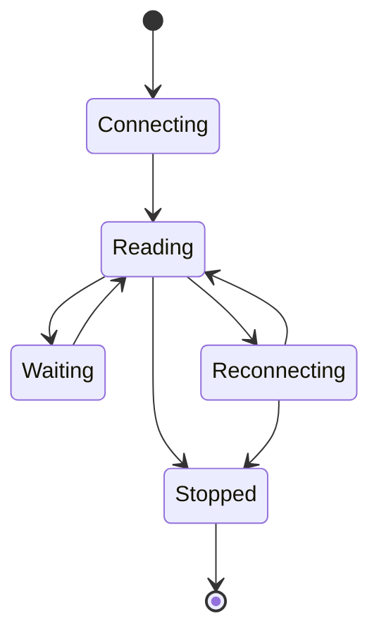
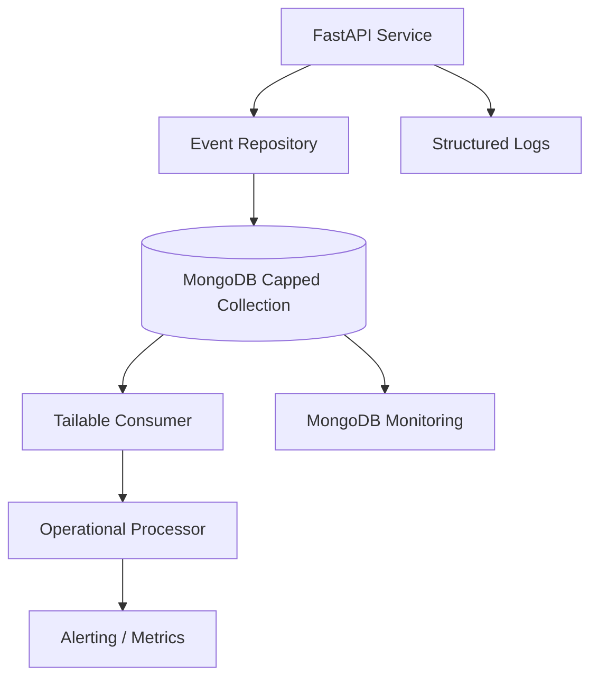

# 23- Capped Collections

## Overview

MongoDB Capped Collections are fixed-size collections that maintain insertion order and automatically overwrite the oldest documents when the configured storage limit is reached.

They are designed for workloads where:

- Data is written continuously.
- The newest data is more valuable than older data.
- Collection size must remain bounded.
- Insertion order matters.
- Sequential reads are important.
- Automatic eviction is acceptable.

A capped collection can be visualized as a fixed-size circular buffer:

```text
+--------------------------------------------------+
| Document 4 | Document 5 | Document 6 | Document 7 |
+--------------------------------------------------+
       ^
       |
   oldest data

New document arrives
       |
       v

+--------------------------------------------------+
| Document 5 | Document 6 | Document 7 | Document 8 |
+--------------------------------------------------+
```

The oldest data is automatically removed when the collection reaches its configured limit.

Capped collections are specialized storage structures. They should not be treated as a general replacement for TTL indexes, time series collections, or ordinary MongoDB collections.

## Why Capped Collections Exist

A normal MongoDB collection can grow indefinitely unless application logic, TTL indexes, or other retention mechanisms remove data.

A capped collection provides bounded storage at the collection level.

For example:

```text
Application logs
      |
      v
Capped Collection
      |
      +---- Newest events retained
      |
      +---- Oldest events automatically overwritten
```

This is useful when the requirement is:

> Keep approximately the most recent N bytes of data.

rather than:

> Delete documents older than N hours.

That distinction is important.

## Core Characteristics

Capped collections have several defining properties:

| Property | Capped Collection |
|---|---|
| Maximum collection size | Yes |
| Automatic eviction | Yes |
| Eviction order | Oldest insertion order first |
| Natural insertion order | Preserved |
| Fixed maximum size | Yes |
| Maximum document count | Optional |
| Random document deletion | Restricted |
| Arbitrary document growth | Restricted |
| Typical use case | Recent/bounded event data |
| Time-based retention | Not the primary mechanism |

The collection is bounded by configured storage size and optionally by document count.

## Creating a Capped Collection

Using `mongosh`:

```javascript
db.createCollection("application_logs", {
  capped: true,
  size: 104857600,
  max: 100000
})
```

This creates a capped collection with:

- `capped: true` — enables capped behavior.
- `size: 104857600` — approximately 100 MiB maximum size.
- `max: 100000` — optional maximum number of documents.

The size limit is the fundamental storage boundary.

The document-count limit provides an additional constraint.

## Inspecting the Collection

Use:

```javascript
db.application_logs.isCapped()
```

Example result:

```text
true
```

Inspect collection metadata with:

```javascript
db.getCollectionInfos({
  name: "application_logs"
})
```

This is useful for operational verification.

## Size vs Maximum Document Count

Capped collections can enforce both:

```text
Maximum bytes
+
Maximum documents
```

For example:

```javascript
db.createCollection("events", {
  capped: true,
  size: 52428800,
  max: 50000
})
```

The effective retention boundary is whichever limit is reached first.

Conceptually:

```text
Insert
  |
  v
Size limit reached?
  |
  +---- Yes ----> Remove oldest data
  |
  +---- No
  |
  v
Document count limit reached?
  |
  +---- Yes ----> Remove oldest data
  |
  +---- No
  |
  v
Retain document
```

## Fixed-Size Storage

The defining property of a capped collection is its bounded storage.

Suppose:

```text
Maximum size = 100 MB
```

As new documents arrive:

```text
0 MB
 |
25 MB
 |
50 MB
 |
75 MB
 |
100 MB
 |
v
Oldest records begin being overwritten
```

The collection does not continue growing indefinitely.

This makes capped collections useful for bounded operational data.

## Automatic Eviction

When the collection reaches its configured capacity, MongoDB removes the oldest documents to make room for new documents.

For example:

```text
Initial:

[A][B][C][D][E]

Insert F:

[B][C][D][E][F]

Insert G:

[C][D][E][F][G]
```

The oldest records disappear automatically.

Applications should therefore treat capped data as disposable by design.

## Insertion Order

Capped collections preserve insertion order.

A query without an explicit sort can therefore be used for sequential access patterns.

For example:

```javascript
db.application_logs.find()
```

For reverse traversal:

```javascript
db.application_logs.find().sort({
  $natural: -1
})
```

`$natural` exposes the collection's natural storage order.

For application-critical ordering semantics, an explicit timestamp or sequence field can still be useful.

## `$natural`

The `$natural` sort order is particularly relevant to capped collections.

Example:

```javascript
db.application_logs.find().sort({
  $natural: -1
}).limit(100)
```

This can efficiently retrieve the newest records according to natural collection order.

However, `$natural` should not be treated as a replacement for a domain-level timestamp.

For example:

```json
{
  "sequence": 10024,
  "timestamp": "2026-09-21T10:15:00Z"
}
```

is more explicit when the application needs to reason about event time.

## Capped Collections and Tailable Cursors

One of the most important capabilities of capped collections is support for tailable cursors.

A tailable cursor behaves similarly to following a continuously growing log.

Conceptually:

```text
Existing documents
       |
       v
Consumer reads them
       |
       v
Cursor reaches end
       |
       v
Wait
       |
       v
New document arrives
       |
       v
Consumer receives it
```

This makes capped collections useful for simple streaming-style workloads.

## Tailable Cursor Example

Using PyMongo:

```python
from pymongo import CursorType, MongoClient

client = MongoClient(MONGODB_URI)

collection = client["app"]["events"]

cursor = collection.find(
    cursor_type=CursorType.TAILABLE_AWAIT,
)

while cursor.alive:
    try:
        document = cursor.next()
        process(document)
    except StopIteration:
        continue
```

`TAILABLE_AWAIT` allows the cursor to wait for additional data when it reaches the current end of the collection.

Production implementations need explicit handling for:

- Cursor termination.
- Network failures.
- MongoDB failover.
- Consumer shutdown.
- Backpressure.
- Reconnection.
- Duplicate processing.

## Capped Collections as a Lightweight Event Buffer

A simple architecture can look like:


This can work for small, controlled workloads.

However, a capped collection should not automatically be promoted to the role of a distributed event-streaming platform.

For complex event distribution, Kafka or another dedicated streaming system is usually more appropriate.

## Capped Collections vs Change Streams

Capped collections and Change Streams are fundamentally different.

| Feature | Capped Collection | Change Stream |
|---|---|---|
| Primary purpose | Bounded storage | Observe database changes |
| Storage | Yes | No independent event store |
| Automatic eviction | Yes | Not the purpose |
| Tailable cursor | Yes | No |
| Event notifications | Indirectly | Directly |
| Resume token | No | Yes |
| Existing historical data | Queryable | Stream position dependent |
| Event-driven integration | Limited | Strong |
| Kafka integration | Possible | Common |
| Retention model | Size/count | Based on underlying history/availability |

Use a capped collection when the data itself needs bounded storage.

Use Change Streams when the requirement is to observe MongoDB mutations.

## Capped Collections vs Time Series Collections

These are also different tools.

| Concern | Capped Collection | Time Series Collection |
|---|---|---|
| Fixed-size storage | Yes | Not the defining feature |
| Automatic oldest-data eviction | Yes | Can use expiration |
| Measurement-oriented schema | No | Yes |
| Time-range analytics | Possible | Strong fit |
| Telemetry | Possible | Strong fit |
| Natural insertion order | Yes | Not the main feature |
| Tailable cursors | Yes | Not the primary mechanism |
| Time-based retention | Indirect | Stronger fit |
| Specialized time-series storage | No | Yes |

For telemetry such as:

```text
temperature
humidity
pressure
timestamp
device_id
```

a Time Series Collection is generally the more natural MongoDB model.

## Capped Collections vs TTL Indexes

TTL indexes remove documents based on document timestamps.

For example:

```javascript
db.events.createIndex(
  { created_at: 1 },
  { expireAfterSeconds: 86400 }
)
```

This means:

```text
created_at + 24 hours
        |
        v
Eligible for deletion
```

A capped collection instead behaves like:

```text
Collection reaches capacity
        |
        v
Oldest records are removed
```

| Requirement | Better fit |
|---|---|
| Keep exactly bounded storage | Capped collection |
| Delete data after a time period | TTL |
| Keep recent events regardless of exact age | Capped collection |
| Compliance-based time retention | TTL or dedicated retention architecture |
| Time-series measurements | Time Series Collection |

## Capped Collection Restrictions

Capped collections have behavioral restrictions that distinguish them from ordinary collections.

They are designed around append-oriented workloads.

Applications should not expect unrestricted arbitrary document updates and deletions.

For example:

```text
Append
  |
  v
Strong fit

Random update
  |
  v
Potentially unsuitable

Random delete
  |
  v
Restricted / unsuitable
```

The exact operation semantics should be validated against the MongoDB version used by the production system.

The architectural rule remains:

> Design capped collections primarily for append-heavy, bounded data.

## Document Growth

Document growth is an important consideration.

If documents grow after insertion, the collection's fixed-size behavior can become difficult to reason about.

Prefer immutable or effectively immutable documents:

```json
{
  "sequence": 10001,
  "timestamp": "2026-09-21T10:00:00Z",
  "message": "worker started"
}
```

rather than documents that continuously grow:

```json
{
  "worker": "worker-1",
  "events": [
    "...",
    "...",
    "..."
  ]
}
```

For continuously changing state, an ordinary collection is usually a better fit.

## Immutability Pattern

A strong capped-collection model is:

```text
Create event
    |
    v
Insert once
    |
    v
Never modify
    |
    v
Eventually evicted
```

This resembles an append-only log.

Examples:

- Recent diagnostic events.
- Temporary operational traces.
- Bounded application history.
- Lightweight event buffers.

## Common Use Cases

### Recent Application Logs

```text
Application
    |
    v
Recent logs
    |
    v
Capped Collection
```

Useful when only the most recent operational history is needed.

However, capped collections should not replace centralized logging systems when long-term retention, search, alerting, or compliance is required.

### Lightweight Event Buffer

A service can write short-lived events:

```json
{
  "event_type": "worker_started",
  "worker_id": "worker-17",
  "timestamp": "2026-09-21T10:00:00Z"
}
```

A consumer can process them using a tailable cursor.

This can be useful for simple internal workloads.

### Diagnostic Data

A service may retain the latest N diagnostic records:

```text
Latest 50,000 diagnostic events
```

Older diagnostics are automatically removed.

This can simplify local troubleshooting.

## Poor Use Cases

Capped collections are generally a poor choice for:

- Financial transaction history.
- Long-term audit records.
- Regulatory data.
- Durable event streaming.
- Searchable application logs.
- Large analytical datasets.
- User-facing transactional records.
- Data requiring arbitrary deletion.
- Data requiring exact time-based retention.

The core reason is that capped collections deliberately sacrifice indefinite retention and arbitrary lifecycle control for bounded storage and insertion-order behavior.

## Creating a Production-Oriented Collection

Example:

```javascript
db.createCollection("worker_events", {
  capped: true,
  size: 52428800,
  max: 100000
})
```

This provides:

```text
Maximum storage: ~50 MiB
Maximum documents: 100,000
```

The actual retention period depends on event size and ingestion rate.

This is important.

A capped collection does **not** guarantee:

```text
"Keep 7 days"
```

unless the workload characteristics make that happen approximately.

## Retention Behavior

Suppose:

```text
Collection size = 100 MB
```

and:

```text
100 MB/day
```

of events are inserted.

The collection may contain approximately one day of recent data.

But if traffic doubles:

```text
200 MB/day
```

the same collection may contain only approximately half a day's worth of data.

Therefore:

```text
Capped size
≠
Time retention guarantee
```

This is one of the most important production considerations.

## Estimating Retention

A rough estimate is:

```text
Retention duration
≈
Maximum collection size
/
Average ingestion rate
```

For example:

```text
100 MB
/
10 MB/hour
=
~10 hours
```

This is only an estimate because document sizes and ingestion rates vary.

For compliance or strict business retention requirements, use a time-based retention mechanism instead.

## Monitoring Capped Collections

Monitor:

- Collection size.
- Document count.
- Ingestion rate.
- Approximate retention window.
- Consumer lag.
- Cursor failures.
- Disk usage.
- Replication lag.
- Query latency.

A particularly useful operational metric is:

```text
Approximate retention window
=
Current time
-
Timestamp of oldest retained document
```

If the expected window is:

```text
24 hours
```

and suddenly becomes:

```text
2 hours
```

the ingestion rate may have increased significantly.

## Operational Monitoring Example

A basic inspection query:

```javascript
db.worker_events.stats()
```

Inspect the oldest and newest records:

```javascript
db.worker_events.find().sort({
  $natural: 1
}).limit(1)
```

```javascript
db.worker_events.find().sort({
  $natural: -1
}).limit(1)
```

If records contain timestamps, compare those values to estimate the effective retention window.

## Performance Characteristics

Capped collections can provide efficient append-heavy behavior because their storage model is bounded and optimized around sequential insertion.

Typical strengths include:

- Predictable maximum size.
- Efficient sequential writes.
- Natural insertion ordering.
- Efficient sequential reads.
- Tailable cursor support.
- Automatic eviction.

However, performance depends on:

- Document size.
- Ingestion rate.
- Query shape.
- Indexes.
- Hardware.
- Replication.
- Consumer behavior.

Capped collections are not automatically faster for every workload.

## Indexing Capped Collections

Capped collections can have indexes, but indexes consume additional storage and write resources.

Before adding an index, identify the actual query pattern.

For example:

```javascript
db.worker_events.createIndex({
  worker_id: 1,
  timestamp: -1
})
```

This can help a query such as:

```javascript
db.worker_events.find({
  worker_id: "worker-17"
}).sort({
  timestamp: -1
}).limit(100)
```

But if the primary workload is sequential consumption through a tailable cursor, additional indexes may not provide meaningful value.

Avoid indexing every field simply because the collection supports indexes.

## `$natural` vs Indexed Queries

These serve different access patterns.

| Access pattern | Preferred mechanism |
|---|---|
| Sequential newest/oldest records | `$natural` |
| Filter by worker ID | Appropriate index |
| Time-range query | Appropriate index |
| Tailable stream | Natural collection order |
| Arbitrary search | Indexed query |

Use the mechanism matching the workload.

## Tailable Cursor Lifecycle

A tailable consumer can be modeled as:



A production consumer should explicitly handle these states.

Do not assume that:

```python
while cursor.alive:
```

alone provides robust production lifecycle management.

## Tailable Cursor and Failover

A tailable cursor is tied to the underlying MongoDB connection and collection behavior.

A network failure or replica-set transition can invalidate the current cursor.

The consumer should be able to:

```text
Detect failure
    |
    v
Close cursor
    |
    v
Reconnect
    |
    v
Re-establish cursor
    |
    v
Continue processing
```

The application must also decide how to handle events between the last successfully processed document and the new cursor position.

## Duplicate Processing

Tailable consumers can encounter processing ambiguity around failures.

Example:

```text
Read Event A
   |
   v
Process Event A
   |
   X
Consumer crashes
```

After restart, the application may not know whether the side effect completed.

This can produce:

```text
Event A processed twice
```

Therefore, production consumers should use idempotent processing.

Possible strategies include:

- Unique event IDs.
- Sequence numbers.
- Deduplication records.
- Upserts.
- Idempotency keys.

## Capped Collections and Kafka

A simple architecture:

```text
MongoDB Capped Collection
          |
          v
Tailable Consumer
          |
          v
Kafka
          |
    +-----+-----+
    |     |     |
    v     v     v
Worker  Search  Analytics
```

This can be useful when MongoDB acts as a short-lived ingestion buffer.

However, if Kafka is already the primary event-streaming infrastructure, introducing a capped collection solely as another queue layer may add unnecessary complexity.

Prefer:

```text
Producer
   |
   v
Kafka
   |
   v
MongoDB
```

when Kafka is the intended event-ingestion backbone and MongoDB is the persistence/analytics store.

## Capped Collections and Redis

Redis Lists or Streams may be more appropriate when the requirement is primarily:

- Queueing.
- Short-lived messaging.
- Consumer groups.
- Fast ephemeral processing.

MongoDB capped collections are better suited when the data itself needs to live in MongoDB and MongoDB query capabilities are useful.

Do not choose a capped collection simply because it can behave somewhat like a queue.

## Capped Collections and Change Streams

A capped collection can itself be watched by a Change Stream in a supported MongoDB deployment.

This produces an architecture such as:

```text
Producer
   |
   v
Capped Collection
   |
   +---- Tailable consumer
   |
   +---- Change Stream
```

However, this does not make the capped collection a durable event bus.

Automatic eviction still applies.

## Replication and High Availability

Capped collections participate in MongoDB replication like other collections.

A typical production topology is:

```text
                Application
                     |
                     v
                 Primary
                /       \
               v         v
          Secondary   Secondary
```

Writes to the capped collection are replicated according to the configured write concern.

High availability therefore depends on the underlying replica-set architecture.

Capped behavior does not eliminate the need for:

- Replica-set monitoring.
- Backups where data matters.
- Failover testing.
- Write-concern decisions.
- Capacity planning.

## Write Concern

For example:

```javascript
db.worker_events.insertOne(
  {
    worker_id: "worker-17",
    event: "started",
    timestamp: new Date()
  },
  {
    writeConcern: {
      w: "majority"
    }
  }
)
```

The correct write concern depends on how important the events are.

If the data is purely diagnostic and can be lost during a failure, a different durability trade-off may be acceptable.

If events drive important downstream state, stronger durability may be required.

## Backup and Recovery

The bounded nature of a capped collection does not mean backups are unnecessary.

Ask:

```text
Is this data reconstructable?
```

If yes, backup requirements may be lower.

If no, the data may still require:

- Regular backups.
- Point-in-time recovery.
- Restore testing.
- Disaster recovery procedures.

However, if the purpose of the collection is explicitly ephemeral recent data, retaining historical backups may contradict the intended lifecycle.

Backup policy should follow business requirements rather than collection type alone.

## Security

Capped collections inherit MongoDB's normal security model.

Production controls should include:

- Authentication.
- Authorization.
- TLS.
- Network restrictions.
- Least-privilege roles.
- Secret management.
- Audit logging where required.

For example, a diagnostic writer may only need permission to insert documents.

A monitoring reader may only need read access.

Avoid granting:

```text
dbAdmin
root
```

when:

```text
read
```

or:

```text
readWrite
```

is sufficient.

## Python Integration

PyMongo can create and inspect capped collections.

```python
from pymongo import MongoClient

client = MongoClient(MONGODB_URI)

db = client["application"]

db.create_collection(
    "worker_events",
    capped=True,
    size=50 * 1024 * 1024,
    max=100_000,
)
```

Applications should generally create infrastructure during deployment or migration rather than attempting to recreate the collection during every application startup.

## FastAPI Integration

A FastAPI service might write diagnostic events:

```python
from datetime import datetime, timezone

from fastapi import FastAPI

app = FastAPI()


@app.post("/internal/events")
def create_event(event_type: str, worker_id: str):
    collection.insert_one({
        "event_type": event_type,
        "worker_id": worker_id,
        "timestamp": datetime.now(timezone.utc),
    })

    return {"status": "accepted"}
```

Production systems should add:

- Authentication.
- Authorization.
- Input validation.
- Rate limiting.
- Timeouts.
- Structured logging.
- Backpressure handling.

Do not expose an unrestricted event-writing endpoint to the public internet.

## Django Integration

Django can use PyMongo through a repository/service layer.

Example architecture:

```text
Django View
    |
    v
Service Layer
    |
    v
Event Repository
    |
    v
PyMongo
    |
    v
Capped Collection
```

This avoids pretending that the capped collection behaves like a normal Django relational model.

For example:

```python
class WorkerEventRepository:
    def __init__(self, collection):
        self.collection = collection

    def append(self, event: dict) -> None:
        self.collection.insert_one(event)
```

The repository makes the MongoDB-specific storage decision explicit.

## Deployment

### Local Development

A local MongoDB instance is sufficient for basic capped-collection development.

Example:

```javascript
db.createCollection("dev_events", {
  capped: true,
  size: 10485760
})
```

### Docker

A MongoDB container can be used for local development:

```yaml
services:
  mongodb:
    image: mongo:latest
    ports:
      - "27017:27017"
```

For production, pin a tested MongoDB version rather than using a floating `latest` tag.

### MongoDB Atlas

MongoDB Atlas can host MongoDB deployments containing capped collections.

The application should still define:

- Collection configuration.
- Retention expectations.
- Indexes.
- Security.
- Monitoring.
- Backup requirements.

Managed hosting does not remove application-level lifecycle decisions.

## Schema Design

A useful capped event document might be:

```json
{
  "event_id": "evt-01J...",
  "timestamp": "2026-09-21T10:15:00Z",
  "service": "worker",
  "worker_id": "worker-17",
  "event_type": "job_started",
  "severity": "info",
  "message": "Started processing batch"
}
```

Useful fields include:

- Event identifier.
- Timestamp.
- Source.
- Event type.
- Severity.
- Relevant correlation ID.
- Minimal diagnostic context.

Avoid embedding large payloads in every event.

## Correlation IDs

For distributed systems, event records should support tracing.

Example:

```json
{
  "event_id": "evt-123",
  "trace_id": "trace-456",
  "request_id": "req-789",
  "service": "orders",
  "event_type": "order_processed"
}
```

This makes it easier to connect:

```text
Nginx
  |
FastAPI
  |
Celery
  |
MongoDB
```

during incident investigation.

## Production Architecture Example

A bounded operational event store might look like:



This is appropriate for bounded operational workflows.

For long-term event processing, replace the capped collection with an architecture designed for durable event streaming.

## Capped Collections vs Dedicated Logging

Capped collections can retain recent application events, but they should not automatically replace:

- OpenSearch.
- Elasticsearch.
- CloudWatch Logs.
- Loki.
- Splunk.
- Other centralized logging platforms.

Dedicated logging platforms provide capabilities such as:

- Full-text search.
- Long-term retention.
- Alerting.
- Log aggregation.
- Cross-service correlation.
- Access controls.
- Analytics.

A capped collection is better viewed as a bounded MongoDB-native data structure.

## Common Mistakes

### Assuming Capped Collections Provide Time-Based Retention

A 100 MB capped collection might retain:

```text
3 days
```

today and:

```text
3 hours
```

tomorrow if ingestion volume increases.

Use TTL when the business requirement is age-based retention.

### Using Capped Collections for Durable Queues

Capped collections do not provide the full semantics of a dedicated queue or event-streaming system.

If events must never be silently evicted, a capped collection is usually the wrong abstraction.

### Storing Large Documents

Large documents consume the fixed storage capacity quickly.

If the collection is intended to retain 100 MB:

```text
1 KB/event -> many events
1 MB/event -> very few events
```

Keep event documents compact.

### Updating Documents Frequently

Capped collections are optimized for append-oriented workloads.

Frequently changing documents are usually a better fit for ordinary collections.

### Ignoring Ingestion Rate

Retention depends on workload volume.

Monitor the effective retention window.

### Treating Natural Order as Business Time

Insertion order and event time can differ:

```text
Event occurred: 10:00
Inserted:       10:05
```

Use explicit timestamps when event-time semantics matter.

### Running Multiple Consumers Without a Strategy

Multiple tailable consumers may independently process the same records.

If work must be distributed, use a deliberate consumer coordination or messaging architecture.

### Using Capped Collections Instead of Kafka

A capped collection may work for simple bounded internal streams, but Kafka provides substantially stronger distributed event-streaming capabilities.

## Production Pitfalls

| Pitfall | Impact | Prevention |
|---|---|---|
| Size chosen without workload analysis | Retention window too short | Capacity testing |
| Treating size as time retention | Unpredictable historical coverage | Use TTL for age-based retention |
| No monitoring | Silent data loss through eviction | Monitor oldest retained timestamp |
| Large documents | Rapid eviction | Keep events compact |
| Frequent updates | Poor workload fit | Prefer append-only design |
| No idempotency | Duplicate side effects | Use event IDs and deduplication |
| Capped collection as durable queue | Silent data loss | Use Kafka/queue where durability is required |
| Excessive indexes | Increased write/storage overhead | Index based on real queries |
| No security controls | Unauthorized access | Least privilege + TLS |
| No failure handling | Consumer interruption | Reconnect and recovery logic |

## Troubleshooting Methodology

### Data Disappears Too Quickly

```text
Symptom
↓
Older documents disappear sooner than expected
↓
Possible causes
- Collection size too small
- Maximum document count too small
- Ingestion rate increased
- Average document size increased
↓
Isolation strategy
- Inspect collection configuration
- Measure documents/hour
- Measure average document size
- Compare oldest retained timestamp
↓
Diagnostic commands
```

```javascript
db.getCollectionInfos({
  name: "worker_events"
})
```

```javascript
db.worker_events.stats()
```

```javascript
db.worker_events.find().sort({
  $natural: 1
}).limit(1)
```

```text
Root cause
↓
Effective retention window is smaller than expected
↓
Corrective action
- Increase collection size
- Reduce document size
- Reduce ingestion volume
- Reassess retention requirements
↓
Prevention
- Capacity modeling
- Retention-window monitoring
- Storage-growth alerts
```

### Tailable Consumer Stops

```text
Symptom
↓
Consumer stops receiving new events
↓
Possible causes
- Cursor closed
- Network interruption
- Replica-set transition
- Consumer process failure
- Application exception
↓
Isolation strategy
- Check consumer health
- Check MongoDB connectivity
- Generate a controlled test event
- Inspect consumer logs
↓
Diagnostic commands
```

```javascript
rs.status()
```

```javascript
db.serverStatus()
```

```text
Root cause
↓
Identify whether the failure is MongoDB topology, cursor lifecycle, or consumer code
↓
Corrective action
- Reconnect
- Recreate cursor
- Restart consumer
- Fix exception handling
↓
Prevention
- Health checks
- Reconnect logic
- Failure injection tests
- Consumer metrics
```

### Consumer Processes Events More Than Once

```text
Symptom
↓
Same event causes multiple downstream effects
↓
Possible causes
- Consumer restart
- Failure after side effect
- Multiple consumers
- Missing deduplication
↓
Isolation strategy
- Inspect event IDs
- Inspect consumer deployment
- Inspect processing state
↓
Diagnostic commands
```

```text
Consumer logs
Processing-state store
Deployment replica count
Downstream request logs
```

```text
Root cause
↓
At-least-once processing behavior or duplicate consumer ownership
↓
Corrective action
- Add idempotency
- Define consumer ownership
- Persist processing state
↓
Prevention
- Duplicate-processing tests
- Unique event IDs
- Explicit consumer architecture
```

### Capped Collection Cannot Be Created as Expected

```text
Symptom
↓
Collection creation fails or configuration is unexpected
↓
Possible causes
- Invalid collection options
- Existing collection with conflicting configuration
- Unsupported deployment/version behavior
- Invalid size/count configuration
↓
Isolation strategy
- Inspect existing collection
- Verify server version
- Validate createCollection options
↓
Diagnostic commands
```

```javascript
db.getCollectionInfos({
  name: "worker_events"
})
```

```javascript
db.serverStatus()
```

```text
Root cause
↓
Collection configuration or deployment mismatch
↓
Corrective action
- Correct configuration
- Recreate collection when appropriate
- Validate against the deployed MongoDB version
↓
Prevention
- Infrastructure-as-code
- Deployment validation
- Version compatibility testing
```

## Operational Checklist

- [ ] Confirm that the workload is append-oriented.
- [ ] Confirm that automatic eviction is acceptable.
- [ ] Define the maximum collection size.
- [ ] Define a maximum document count when useful.
- [ ] Estimate retention from realistic ingestion rates.
- [ ] Keep documents compact.
- [ ] Prefer immutable event documents.
- [ ] Store explicit timestamps when event time matters.
- [ ] Monitor the oldest retained event.
- [ ] Monitor ingestion rate.
- [ ] Monitor collection size.
- [ ] Add only workload-driven indexes.
- [ ] Design tailable consumers for reconnects.
- [ ] Make downstream processing idempotent.
- [ ] Define consumer ownership.
- [ ] Do not treat capped storage as durable long-term history.
- [ ] Use TTL for strict age-based retention.
- [ ] Use Time Series Collections for measurement-oriented workloads.
- [ ] Use Kafka or a dedicated queue for durable event streaming where required.
- [ ] Apply authentication and least-privilege authorization.
- [ ] Use TLS in production.
- [ ] Test replica-set failover.
- [ ] Document recovery behavior.
- [ ] Validate the design under realistic ingestion volume.

## Architecture Decision Guide

| Requirement | Recommended approach |
|---|---|
| Keep a bounded amount of recent MongoDB data | Capped collection |
| Keep newest N bytes of events | Capped collection |
| Sequentially consume newly appended MongoDB records | Capped collection + tailable cursor |
| Delete records after a specific age | TTL index |
| Store IoT/time-series measurements | Time Series Collection |
| Observe arbitrary MongoDB mutations | Change Stream |
| Durable distributed event streaming | Kafka |
| Fast ephemeral queueing | Redis or dedicated queue |
| Long-term searchable logs | Centralized logging platform |
| Regulatory audit history | Durable audit architecture |
| Frequently updated business entities | Normal collection |

## Interview Traps

### What is a capped collection?

A capped collection is a fixed-size MongoDB collection that preserves insertion order and automatically removes the oldest data as new data is inserted.

### What happens when a capped collection reaches its size limit?

MongoDB reuses space by removing the oldest records as new records arrive.

### Does a capped collection provide time-based retention?

No. Retention depends on storage size, document count, document size, and ingestion rate.

### What is the difference between `size` and `max`?

`size` specifies the maximum collection size in bytes, while `max` specifies an optional maximum number of documents.

### Why are capped collections useful for log-like workloads?

They provide bounded storage, preserve insertion order, and support tailable cursors for sequential consumption.

### What is a tailable cursor?

A tailable cursor can continue waiting for new documents after reaching the current end of a capped collection, allowing a consumer to follow newly appended data.

### Can capped collections be used as Kafka replacements?

No. They can support simple bounded event-consumption patterns but do not provide Kafka's distributed partitioning, consumer groups, durable retention, replay model, and broader streaming capabilities.

### Capped collection vs TTL index?

A capped collection evicts data based primarily on collection capacity. A TTL index removes documents based on expiration time.

### Capped collection vs Time Series Collection?

A capped collection is designed around bounded storage and insertion order. A Time Series Collection is optimized for measurements associated with time and metadata.

### Why should capped-collection documents usually be immutable?

The workload is fundamentally append-oriented. Frequent updates and document growth undermine the intended access and storage pattern.

### Does a capped collection guarantee a specific number of days of data?

No. The retention window changes as ingestion rate and document size change.

### Can capped collections be replicated?

Yes. They participate in MongoDB replica-set replication like other collections.

### Should every capped collection have indexes?

No. Indexes should be driven by actual query requirements because they add storage and write overhead.

### What is a common production mistake with capped collections?

Treating the configured size as if it represented a fixed time period. A sudden increase in ingestion volume can cause historical records to disappear much faster than expected.

## Key Takeaways

- Capped collections provide **bounded, insertion-ordered storage with automatic eviction of older documents**, making them suitable for recent operational data and lightweight append-only workloads.
- The `size` and optional `max` settings control capacity, but **they do not provide guaranteed time-based retention**; effective retention changes with ingestion rate and document size.
- **Tailable cursors** make capped collections useful for simple sequential consumers, but production consumers still need reconnect handling, idempotency, monitoring, and explicit failure recovery.
- Choose the right MongoDB mechanism for the requirement: **capped collections for bounded storage, TTL indexes for age-based expiration, Time Series Collections for measurements, and Change Streams for observing database changes**.
- Capped collections are not a substitute for **Kafka, durable queues, centralized logging, or long-term audit storage** when those systems' retention, replay, search, or distributed-consumption guarantees are required.