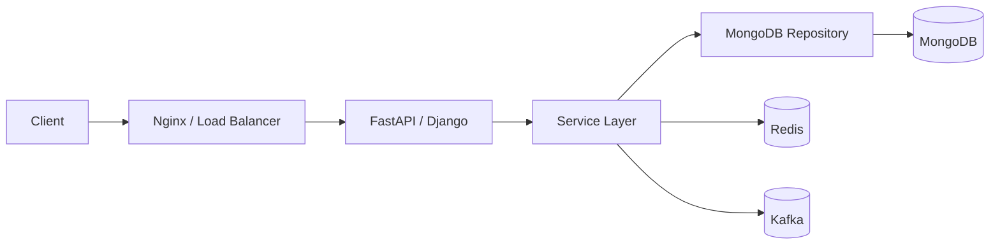
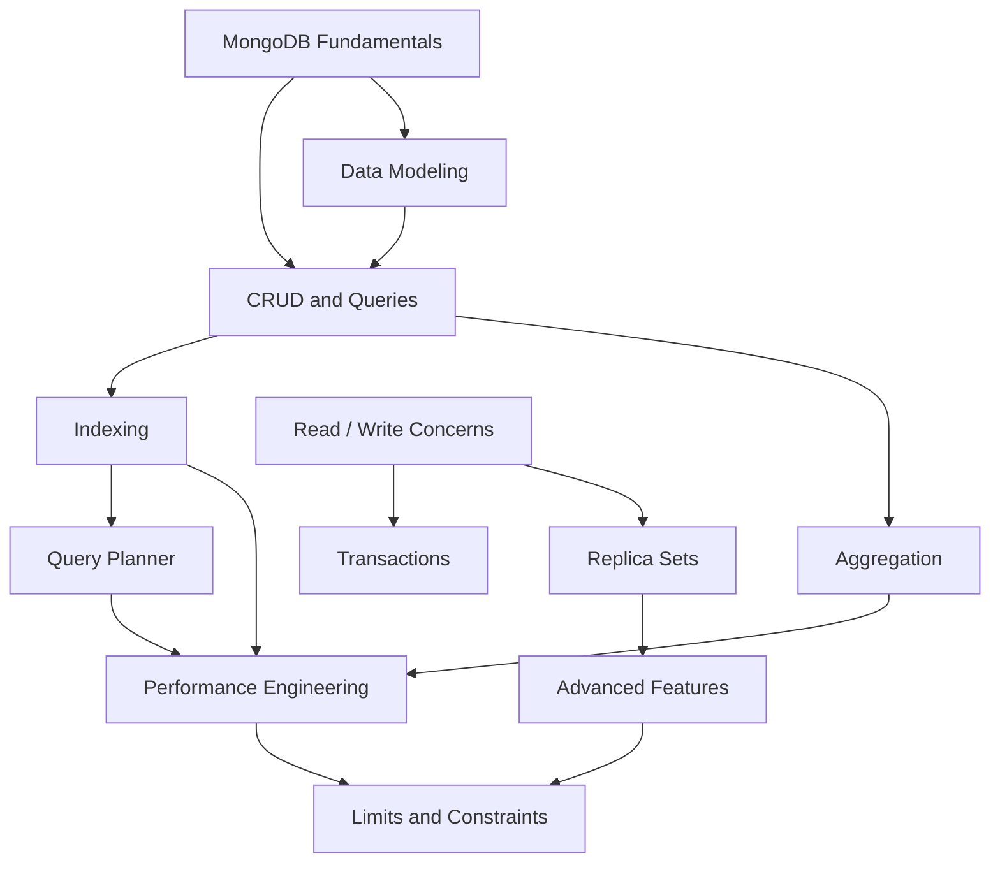

# README

## Overview

This folder contains the core MongoDB concepts required for backend engineering, progressing from the document model and CRUD operations through data modeling, querying, aggregation, indexing, transactions, replication, sharding, change streams, and operational constraints.

The documentation is organized to build progressively:

```text
MongoDB Fundamentals
        |
        v
CRUD and Query Design
        |
        v
Data Modeling
        |
        v
Aggregation
        |
        v
Indexing and Query Planning
        |
        v
Consistency and Transactions
        |
        v
Replication and High Availability
        |
        v
Advanced Features
        |
        v
Production Constraints
```

The material is intended as a long-term reference for backend development with Python, FastAPI, Django, microservices, and production MongoDB deployments.

## Navigation

| # | File | Description |
|---|---|---|
| 01 | [01- MongoDB Fundamentals](./01-%20MongoDB%20Fundamentals.md) | Core MongoDB concepts, document model, terminology, and architecture overview |
| 02 | [02- Databases Collections and Documents](./02-%20Databases%20Collections%20and%20Documents.md) | Databases, collections, documents, schema flexibility, and collection design |
| 03 | [03- BSON Data Types](./03-%20BSON%20Data%20Types.md) | BSON representation, supported types, ObjectId, dates, arrays, and binary data |
| 04 | [04- Embedded Documents](./04-%20Embedded%20Documents.md) | Embedding strategy, bounded relationships, read patterns, and document growth |
| 05 | [05- Arrays](./05-%20Arrays.md) | Array modeling, querying, updating, multikey behavior, and array-related pitfalls |
| 06 | [06- Data Modeling Relationships](./06-%20Data%20Modeling%20Relationships.md) | Embedding vs referencing, relationship modeling, cardinality, and access-pattern-driven design |
| 07 | [07- Schema Validation](./07-%20Schema%20Validation.md) | JSON Schema validation, required fields, BSON types, validation levels, and schema evolution |
| 08 | [08- CRUD Operations](./08-%20CRUD%20Operations.md) | Insert, find, update, replace, delete, upsert, bulk writes, atomicity, and write results |
| 09 | [09- Query Operators](./09-%20Query%20Operators.md) | Comparison, logical, array, element, evaluation, regex, existence, and type operators |
| 10 | [10- Projection and Cursors](./10-%20Projection%20and%20Cursors.md) | Projection, cursors, sorting, limits, pagination, cursor behavior, and result-set management |
| 11 | [11- Update Operators](./11-%20Update%20Operators.md) | Field, array, arithmetic, bitwise, and update-pipeline operators with production patterns |
| 12 | [12- Aggregation Framework](./12-%20Aggregation%20Framework.md) | Aggregation architecture, pipeline execution, stages, expressions, accumulators, and use cases |
| 13 | [13- Aggregation Pipeline](./13-%20Aggregation%20Pipeline.md) | Pipeline construction, stage ordering, filtering, transformations, joins, facets, and materialization |
| 14 | [14- Aggregation Operators](./14-%20Aggregation%20Operators.md) | Core aggregation expressions, accumulators, conditional, array, date, and string operators |
| 15 | [15- Indexes](./15-%20Indexes.md) | Index types, compound indexes, multikey indexes, ESR, selectivity, covered queries, and index lifecycle |
| 16 | [16- Query Planner and Explain](./16-%20Query%20Planner%20and%20Explain.md) | Query planning, winning plans, rejected plans, explain output, and slow-query analysis |
| 17 | [17- Transactions](./17-%20Transactions.md) | Sessions, multi-document transactions, commit/abort, retries, consistency, and transaction design |
| 18 | [18- Write Concerns and Read Concerns](./18-%20Write%20Concerns%20and%20Read%20Concerns.md) | Acknowledgment, majority, durability, consistency, availability, and replica-set interaction |
| 19 | [19- Read Preference](./19-%20Read%20Preference.md) | Primary/secondary reads, consistency trade-offs, latency, availability, and read strategies |
| 20 | [20- Replica Sets](./20-%20Replica%20Sets.md) | Primary/secondary architecture, elections, replication, oplog, failover, rollback, lag, and HA |
| 21 | [21- Change Streams](./21-%20Change%20Streams.md) | Change events, resume tokens, consumers, full-document lookup, failure handling, and event-driven architecture |
| 22 | [22- Time Series Collections](./22-%20Time%20Series%20Collections.md) | Time-series modeling, bucketing, ingestion, retention, indexing, aggregation, and operational considerations |
| 23 | [23- Capped Collections](./23-%20Capped%20Collections.md) | Fixed-size collections, insertion-order retention, tailable cursors, use cases, and limitations |
| 24 | [24- MongoDB Limits and Constraints](./24-%20MongoDB%20Limits%20and%20Constraints.md) | BSON limits, document growth, index limits, aggregation constraints, and capacity planning |

## Learning Path

### MongoDB Fundamentals

Start with:

```text
01 → 02 → 03
```

Focus on:

- MongoDB architecture
- Document-oriented data model
- BSON
- ObjectId
- Databases and collections
- Documents and fields
- Nested documents
- Arrays
- Schema flexibility

The objective is to understand how MongoDB represents and stores application data before moving into query and modeling decisions.

### CRUD and Query Design

Continue with:

```text
08 → 09 → 10 → 11
```

Focus on:

- CRUD operations
- Query filters
- Operators
- Projection
- Sorting
- Cursors
- Pagination
- Update operators
- Upserts
- Bulk operations
- Single-document atomicity

These concepts form the foundation for implementing MongoDB repositories and service layers.

### Data Modeling

Study:

```text
04 → 05 → 06 → 07
```

Focus on:

- Embedding
- Referencing
- Relationships
- Cardinality
- Arrays
- Document growth
- Denormalization
- Controlled duplication
- Schema validation
- Schema evolution

Data modeling should be driven primarily by application access patterns rather than by reproducing relational database schemas inside MongoDB.

### Aggregation

Study:

```text
12 → 13 → 14
```

Focus on:

- Pipeline execution
- `$match`
- `$project`
- `$set`
- `$group`
- `$sort`
- `$unwind`
- `$lookup`
- `$facet`
- `$bucket`
- `$merge`
- `$out`
- Aggregation expressions
- Pipeline optimization
- Memory behavior

Aggregation knowledge becomes particularly important for reporting, analytics, API responses, and materialized views.

### Performance and Indexing

Study:

```text
15 → 16
```

Focus on:

- Index selection
- Compound indexes
- Multikey indexes
- ESR guideline
- Selectivity
- Covered queries
- Query planner behavior
- `COLLSCAN`
- `IXSCAN`
- `FETCH`
- `SORT`
- `explain("executionStats")`
- Query optimization

A production MongoDB engineer should be able to move from:

```text
Slow API
   ↓
Slow database query
   ↓
Explain plan
   ↓
Root cause
   ↓
Index/schema/query change
   ↓
Measured improvement
```

rather than adding indexes based only on intuition.

### Consistency and High Availability

Study:

```text
17 → 18 → 19 → 20
```

Focus on:

- Transactions
- Sessions
- Read concern
- Write concern
- Read preference
- Replica sets
- Elections
- Failover
- Oplog
- Replication lag
- Rollback
- Majority semantics

These topics are essential for designing reliable MongoDB-backed services.

### Advanced MongoDB Features

Study:

```text
21 → 22 → 23
```

Focus on:

- Change streams
- Event-driven architecture
- Time-series workloads
- Capped collections
- Specialized retention patterns
- Streaming consumers
- Resume tokens
- Operational trade-offs

These features should be introduced when the workload requires them rather than used simply because MongoDB provides them.

### Production Constraints

Finish with:

```text
24
```

Focus on:

- BSON document limits
- Nesting limits
- Index limits
- Compound-index constraints
- Aggregation memory
- Pipeline limits
- Replica-set limits
- Connection capacity
- Oplog capacity
- Collection and namespace constraints
- Multikey index constraints
- Capacity planning

Understanding limits prevents architectural designs from depending on MongoDB boundaries as if they were normal operating targets.

## MongoDB Engineering Decision Areas

The concepts in this folder support several recurring backend engineering decisions.

| Decision | Primary concepts |
|---|---|
| How should data be modeled? | Documents, arrays, embedding, referencing, relationships |
| Should data be duplicated? | Denormalization, access patterns, consistency |
| How should a query be optimized? | Indexes, query planner, `explain()` |
| Should an index be created? | Query patterns, selectivity, ESR, write overhead |
| Should a transaction be used? | Atomicity, sessions, read/write concerns |
| Where should reads go? | Read preference, replica sets, consistency |
| How should HA be implemented? | Replica sets, elections, majority writes |
| How should events be consumed? | Change streams, resume tokens, idempotency |
| How should time-series data be modeled? | Time-series collections, bucketing, retention |
| How should bounded logs be stored? | Capped collections |
| Can the design scale safely? | Limits, indexing, sharding, capacity planning |
| How should MongoDB integrate with Python? | PyMongo, repositories, connection pooling |
| How should MongoDB integrate with APIs? | FastAPI/Django, validation, pagination, serialization |

## Production Architecture

A typical backend architecture can be represented as:



MongoDB should normally remain behind application-level boundaries rather than being exposed directly to clients.

A production service should typically separate:

```text
API Layer
    ↓
Validation
    ↓
Service Layer
    ↓
Repository / Data Access Layer
    ↓
MongoDB
```

This makes database-specific behavior easier to test, optimize, and evolve.

## Core Production Concerns

MongoDB design should always consider:

### Data Modeling

Design around:

- Access patterns
- Cardinality
- Document growth
- Read/write ratio
- Update frequency
- Consistency requirements
- Query shape

### Performance

Measure:

- Query latency
- Index usage
- `totalKeysExamined`
- `totalDocsExamined`
- Working-set behavior
- Connection utilization
- Aggregation execution
- Disk I/O

### Reliability

Consider:

- Replica sets
- Majority write concern
- Read consistency
- Retry behavior
- Replication lag
- Oplog window
- Backup and restore

### Security

Apply:

- Authentication
- Least-privilege authorization
- TLS
- Network restrictions
- Secret management
- Encryption
- Auditing where required

### Scalability

Plan for:

- Data growth
- Index growth
- Connection growth
- Application replica growth
- Aggregation workload
- Sharding when required

### Operations

Monitor:

- Database health
- Replica-set state
- Replication lag
- Connections
- Storage
- Indexes
- Slow queries
- Oplog
- Aggregation resource usage

## Backend Integration

### Python

The recommended application structure is generally:

```text
FastAPI / Django
       |
       v
Service Layer
       |
       v
Repository Layer
       |
       v
PyMongo
       |
       v
MongoDB
```

Keep MongoDB connection lifecycle separate from individual request handling.

### FastAPI

Typical responsibilities:

| Layer | Responsibility |
|---|---|
| Router | HTTP/API contract |
| Pydantic | Input/output validation |
| Service | Business rules |
| Repository | MongoDB operations |
| MongoClient | Connection pooling |
| MongoDB | Persistence |

### Django

MongoDB should not automatically be treated as a drop-in replacement for Django's relational database backend.

When using PyMongo or MongoEngine, explicitly define:

- Data access boundaries
- Serialization
- Validation
- Transactions
- Connection management
- Testing strategy
- Query behavior

Do not assume Django ORM behavior maps directly to MongoDB semantics.

## Operational Workflow

A useful production workflow is:

```text
Requirement
    ↓
Access Patterns
    ↓
Data Model
    ↓
Query Design
    ↓
Index Design
    ↓
Explain / Benchmark
    ↓
Application Integration
    ↓
Load Testing
    ↓
Production Monitoring
    ↓
Capacity Planning
```

This is preferable to:

```text
Create Collection
    ↓
Write Queries
    ↓
Add Indexes When Slow
```

## Troubleshooting Workflow

Use a consistent diagnostic process:

```text
Symptom
   ↓
Possible causes
   ↓
Isolation strategy
   ↓
Diagnostic commands
   ↓
Root cause
   ↓
Corrective action
   ↓
Prevention
```

Typical MongoDB troubleshooting categories include:

| Symptom | Primary areas to inspect |
|---|---|
| Slow query | Query shape, indexes, `explain()` |
| High CPU | Queries, aggregation, indexing, concurrency |
| High memory | Working set, indexes, aggregation |
| High disk usage | Data, indexes, oplog, temporary files |
| Connection failures | Pooling, connection limits, topology |
| Replication lag | Oplog, storage, CPU, network |
| Failed writes | Validation, constraints, document size |
| Large documents | Schema design, arrays, embedded data |
| Slow aggregation | Pipeline order, indexes, cardinality |
| Uneven shard load | Shard key, cardinality, frequency |
| Frequent timeouts | Query performance, resource pressure, network |

## Documentation Map

The folder should be treated as a connected knowledge base rather than a collection of isolated command references.



## Interview Preparation

The most important senior-level areas to be able to explain without relying on documentation are:

- Why MongoDB data modeling is access-pattern driven.
- Embedding vs referencing.
- How multikey indexes work.
- Compound-index field ordering and ESR.
- How `explain()` identifies inefficient queries.
- Why `COLLSCAN` can be problematic.
- Single-document atomicity vs multi-document transactions.
- Read concern, write concern, and read preference.
- Replica-set elections and majority writes.
- Oplog and replication lag.
- Change streams and resume tokens.
- Shard-key selection.
- Scatter-gather queries.
- Connection pooling.
- MongoDB document and index limits.
- How MongoDB differs from PostgreSQL for common backend workloads.

A strong interview answer should connect the MongoDB feature to an engineering trade-off:

```text
Feature
   ↓
Why it exists
   ↓
Workload it solves
   ↓
Trade-offs
   ↓
Production implications
```

## Reference Principles

Keep these principles in mind throughout the MongoDB playbook:

- **Model for access patterns, not tables.**
- **Keep unbounded data from creating unbounded documents.**
- **Create indexes from measured query patterns.**
- **Use `explain()` before assuming an index is effective.**
- **Prefer single-document atomicity when it satisfies the invariant.**
- **Use transactions for genuine multi-document consistency requirements.**
- **Understand consistency before selecting read and write concerns.**
- **Treat replica sets as an availability mechanism, not merely a read-scaling mechanism.**
- **Treat shard-key selection as an architectural decision.**
- **Reuse MongoClient instances and budget connections across all application replicas.**
- **Treat MongoDB limits as safety boundaries, not production targets.**
- **Measure performance and capacity continuously as data and traffic grow.**

## Key Takeaways

- This folder progresses from **MongoDB fundamentals and CRUD through data modeling, aggregation, indexing, consistency, replication, and advanced production features**.
- MongoDB engineering should be **access-pattern and workload driven**, with schema, query, and index decisions made together.
- Production reliability depends on understanding **transactions, read/write concerns, replica sets, replication lag, oplog behavior, connection pooling, and operational limits**.
- Performance work should follow a measurable workflow: **query shape → index strategy → `explain()` → benchmark → production monitoring**.
- The goal is not merely to know MongoDB commands, but to make **safe, scalable, observable, and maintainable backend architecture decisions** using MongoDB.