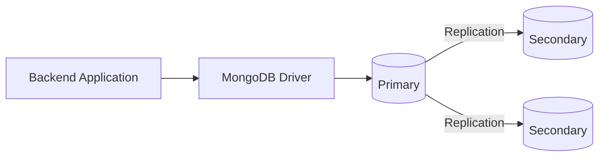
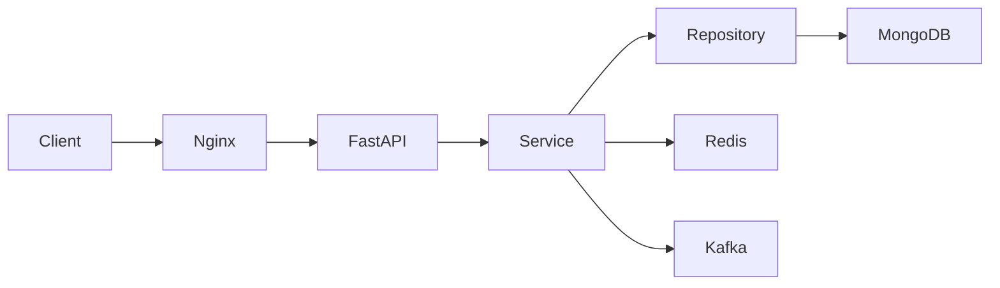

# 01- MongoDB Architecture

## Overview

MongoDB architecture is built around a document-oriented storage model, client-server communication, replica-set-based high availability, and optional horizontal scaling through sharding.

For backend engineers, understanding MongoDB architecture means understanding more than databases and collections. Production behavior depends on how application requests reach MongoDB, how the server executes reads and writes, how data is replicated, how indexes participate in query execution, and how the topology changes when the workload grows.

A useful mental model is:

```text
Application
    |
    | MongoDB Driver
    v
MongoDB Topology
    |
    +-------------------+
    |                   |
    v                   v
Replica Set          Sharded Cluster
    |                   |
    v                   v
Primary /            mongos
Secondaries             |
                        +---- Shard
                        +---- Shard
                        +---- Shard
```

MongoDB architecture decisions directly affect:

- Data consistency
- Query latency
- Write throughput
- High availability
- Failure recovery
- Horizontal scalability
- Connection management
- Security
- Operational complexity
- Cost

## MongoDB Architectural Model

At a high level, MongoDB can be understood through several layers:

```text
Application Layer
        |
        v
MongoDB Driver
        |
        v
Topology Discovery / Connection Pool
        |
        v
MongoDB Server
        |
        +---- Query Processing
        |       |
        |       +---- Query Parser
        |       +---- Query Planner
        |       +---- Execution
        |
        +---- Storage Engine
        |
        +---- Replication
        |
        +---- Journaling / Persistence
        |
        v
Storage
```

When sharding is introduced:

```text
Application
     |
     v
MongoDB Driver
     |
     v
mongos
     |
     +----------------+----------------+
     |                |                |
     v                v                v
  Shard A          Shard B          Shard C
```

The architecture is therefore not one fixed topology. MongoDB can operate as:

- A standalone server
- A replica set
- A sharded cluster
- A managed deployment such as MongoDB Atlas

Production systems normally use replica sets, and large horizontally scaled deployments use sharded clusters.

## Core MongoDB Components

| Component | Responsibility |
|---|---|
| `mongod` | MongoDB database server process |
| `mongosh` | MongoDB shell client |
| MongoDB Driver | Application-to-database communication |
| Database | Logical namespace containing collections |
| Collection | Logical grouping of documents |
| Document | BSON-based application data unit |
| Index | Data structure used to accelerate queries |
| Replica Set | High-availability and replication topology |
| Primary | Replica-set member that accepts writes |
| Secondary | Replica-set member that replicates data |
| Oplog | Replication operation log |
| `mongos` | Query router in a sharded cluster |
| Config Server | Stores sharded-cluster metadata |
| Shard | Data-bearing component of a sharded cluster |
| Storage Engine | Persists and manages MongoDB data |

## Client-Server Architecture

MongoDB uses a client-server architecture.

A backend application does not directly manipulate MongoDB's storage files. It communicates with a MongoDB server through a MongoDB driver.

For Python:

```text
FastAPI / Django
       |
       v
PyMongo
       |
       v
MongoDB Server
```

For example:

```python
from pymongo import MongoClient

client = MongoClient(
    "mongodb://localhost:27017",
    serverSelectionTimeoutMS=5000,
)

db = client["orders"]
orders = db["orders"]
```

The driver handles important responsibilities such as:

- Connection establishment
- Connection pooling
- Server discovery
- Topology monitoring
- Serialization
- BSON encoding/decoding
- Retry behavior
- Server selection
- Load balancing where supported

The application should normally treat `MongoClient` as a long-lived resource rather than creating one for every request.

## `mongod`

`mongod` is the MongoDB server process.

It is responsible for:

- Accepting client connections
- Authenticating clients
- Authorizing operations
- Executing database commands
- Reading and writing data
- Managing indexes
- Managing replication
- Running transactions
- Exposing operational statistics
- Managing storage through the configured storage engine

A typical self-managed deployment might look like:

```text
EC2 / VM / Container
        |
        +---- mongod
                |
                +---- Database
                +---- Collections
                +---- Indexes
                +---- Replication
                +---- Storage Engine
```

In MongoDB Atlas, these server processes are managed by the service rather than manually operated by the application team.

## `mongosh`

`mongosh` is the MongoDB shell used for interactive administration and diagnostics.

Example:

```bash
mongosh "mongodb://localhost:27017/orders"
```

Typical operations include:

```javascript
show dbs

use orders

show collections

db.orders.find().limit(10)

db.orders.getIndexes()

db.orders.find({
  status: "paid"
}).explain("executionStats")
```

`mongosh` is primarily an operational and diagnostic interface.

Application code should use an appropriate MongoDB driver.

## MongoDB Driver Architecture

The driver is more than a thin TCP client.

A production driver manages topology information and chooses an appropriate server for each operation.

Conceptually:

```text
Application
    |
    v
MongoDB Driver
    |
    +---- Connection Pool
    |
    +---- Server Discovery
    |
    +---- Server Monitoring
    |
    +---- Server Selection
    |
    +---- Retry Logic
    |
    v
MongoDB Server
```

For a replica set, the driver can discover:

```text
Primary
Secondary
Secondary
```

and maintain enough topology information to route operations appropriately.

This is why applications should generally use a replica-set-aware connection string rather than hard-coding one database node.

## Connection Pooling

A `MongoClient` maintains a connection pool.

Conceptually:

```text
FastAPI Process
      |
      v
MongoClient
      |
      +---- Connection 1
      +---- Connection 2
      +---- Connection 3
      +---- ...
      +---- Connection N
```

Requests borrow connections from the pool rather than establishing a new network connection for every operation.

Poor pattern:

```python
def handler():
    client = MongoClient(MONGODB_URI)
    return client.orders.orders.find_one(...)
```

Better:

```python
client = MongoClient(
    MONGODB_URI,
    maxPoolSize=100,
    minPoolSize=10,
)
```

and reuse the client for the lifetime of the process.

### Kubernetes Connection Multiplication

Connection limits become important when applications scale horizontally.

For example:

```text
20 pods
×
maxPoolSize=50
=
up to ~1,000 pooled connections
```

If Kubernetes scales the deployment to 100 pods:

```text
100 pods
×
50 connections
=
~5,000 potential connections
```

The database must be sized for the aggregate workload rather than the connection pool of one application instance.

## Database and Collection Hierarchy

MongoDB organizes data approximately as:

```text
MongoDB Deployment
    |
    +---- Database
            |
            +---- Collection
                    |
                    +---- Document
                            |
                            +---- Field
```

For example:

```text
production
    |
    +---- users
    +---- orders
    +---- payments
```

A document might be:

```json
{
  "_id": "order-123",
  "customer_id": "customer-456",
  "status": "paid",
  "total": 149.99
}
```

Unlike relational databases, MongoDB does not require every document in a collection to have exactly the same structure.

## Document-Oriented Architecture

MongoDB stores documents using BSON.

Conceptually:

```text
Collection
    |
    +---- Document
    |       +---- Field
    |       +---- Field
    |       +---- Embedded Document
    |       +---- Array
    |
    +---- Document
    |
    +---- Document
```

This enables documents to represent application-level aggregates naturally.

For example:

```json
{
  "_id": "order-1001",
  "customer": {
    "id": "customer-10",
    "name": "Alice"
  },
  "items": [
    {
      "product_id": "p100",
      "quantity": 2,
      "price": 49.99
    }
  ],
  "status": "paid"
}
```

This can represent a complete order read model without requiring multiple joins for common access patterns.

## MongoDB vs Relational Architecture

The difference is primarily architectural rather than simply syntactic.

| Concern | MongoDB | PostgreSQL |
|---|---|---|
| Primary data model | Documents | Relations |
| Schema | Flexible | Explicit relational schema |
| Relationships | Embedding/references | Foreign keys/joins |
| Atomicity | Single-document operations and transactions | Transactions |
| Horizontal scaling | Native sharding | Usually external/distributed solutions |
| Query model | Document-oriented | Relational/SQL |
| Denormalization | Common | More controlled |
| Joins | `$lookup` and related mechanisms | Native joins |
| Primary design driver | Access patterns | Relational model + queries |
| Typical aggregate | Document | Row set |

Neither architecture is universally superior.

The correct choice depends on:

- Access patterns
- Consistency requirements
- Relationship complexity
- Query patterns
- Scale
- Operational requirements
- Existing platform capabilities

## Storage Engine

MongoDB uses a storage engine to persist data.

WiredTiger is the standard storage engine for modern MongoDB deployments.

At a high level:

```text
MongoDB Command
      |
      v
Query / Write Execution
      |
      v
Storage Engine
      |
      +---- Data Files
      +---- Indexes
      +---- Cache
      +---- Journal / Recovery Structures
      |
      v
Filesystem / Storage Device
```

The storage engine is responsible for low-level persistence and concurrency behavior.

Backend engineers do not normally interact directly with storage-engine internals, but storage-engine behavior affects:

- Memory usage
- Disk I/O
- Write latency
- Read latency
- Index performance
- Recovery behavior
- Working-set performance

## Working Set

MongoDB performance depends heavily on whether frequently accessed data and indexes fit effectively within available memory.

Conceptually:

```text
Application Working Set
        |
        v
Frequently accessed documents + indexes
        |
        v
RAM
        |
        +---- fast access
        |
        v
Storage
```

If the working set fits comfortably in memory, many operations can avoid expensive storage reads.

If the workload substantially exceeds available memory:

```text
Working Set
     |
     v
RAM pressure
     |
     v
More storage I/O
     |
     v
Higher latency
```

This is why simply adding CPU may not solve a MongoDB performance problem.

## Query Execution Architecture

A query generally moves through several logical stages:

```text
Query
  |
  v
Parsing / Validation
  |
  v
Query Planning
  |
  v
Plan Selection
  |
  v
Execution
  |
  +---- Collection Scan
  |
  +---- Index Scan
  |
  +---- Fetch
  |
  +---- Sort
  |
  v
Result
```

For example:

```javascript
db.orders.find({
  tenant_id: "tenant-1",
  status: "paid"
})
```

MongoDB may evaluate available indexes and select an execution strategy.

An appropriate compound index might be:

```javascript
db.orders.createIndex({
  tenant_id: 1,
  status: 1
})
```

The actual effectiveness should be verified with:

```javascript
db.orders.find({
  tenant_id: "tenant-1",
  status: "paid"
}).explain("executionStats")
```

## Query Planner

The query planner evaluates possible execution strategies.

A simplified model is:

```text
Query
  |
  v
Candidate Plans
  |
  +---- COLLSCAN
  +---- IXSCAN using index A
  +---- IXSCAN using index B
  |
  v
Plan Evaluation
  |
  v
Winning Plan
  |
  v
Execution
```

Important explain-plan concepts include:

- `COLLSCAN`
- `IXSCAN`
- `FETCH`
- `SORT`
- `LIMIT`
- `nReturned`
- `totalKeysExamined`
- `totalDocsExamined`
- Execution time

A senior engineer should care about the relationship between:

```text
nReturned
```

and:

```text
totalKeysExamined
totalDocsExamined
```

A query returning 10 documents after examining millions of documents deserves investigation.

## Write Architecture

A write follows a different path.

For a replica set:

```text
Application
    |
    v
MongoDB Driver
    |
    v
Primary
    |
    +---- Apply write
    |
    +---- Write replication operation
    |
    v
Oplog
    |
    +----------------+
    |                |
    v                v
Secondary 1      Secondary 2
```

The primary accepts writes.

Secondaries replicate operations from the primary's oplog.

The exact client acknowledgment behavior depends on the configured write concern.

## Replica Set Architecture

A replica set provides high availability through multiple MongoDB nodes.

Typical topology:



The primary normally handles writes.

Secondaries replicate data from the primary and can serve reads when the configured read preference allows it.

## Primary and Secondary Roles

| Role | Main responsibility |
|---|---|
| Primary | Accepts writes and participates in replication |
| Secondary | Replicates data from the primary |
| Hidden secondary | Replication member hidden from ordinary application reads |
| Delayed member | Maintains intentionally delayed replication for recovery use cases |
| Arbiter | Participates in elections without storing data |

Production topology should be selected based on:

- Failure domains
- Availability requirements
- Read workload
- Recovery strategy
- Operational complexity

## Oplog

The oplog is a replication log maintained by replica-set members.

Conceptually:

```text
Primary
   |
   v
Oplog
   |
   +---- Secondary 1
   |
   +---- Secondary 2
```

The oplog allows secondaries to reproduce operations performed on the primary.

It is also important for:

- Replication
- Initial synchronization workflows
- Change streams
- Recovery behavior

Oplog capacity should be evaluated using its effective time window rather than only its byte size.

## Replication Flow

A simplified replication lifecycle is:

```text
Client
  |
  | write
  v
Primary
  |
  | persist operation
  v
Oplog
  |
  +----------+
  |          |
  v          v
Secondary A Secondary B
  |
  v
Apply operation
```

If a secondary falls significantly behind, it may no longer be able to catch up from the available oplog history and may require an initial sync.

## Elections and Failover

If the primary becomes unavailable, eligible replica-set members can participate in an election.

Conceptually:

```text
Primary Failure
      |
      v
Replica-set members detect failure
      |
      v
Election
      |
      v
New Primary
      |
      v
Driver discovers topology change
      |
      v
Application resumes writes
```

The application should not hard-code assumptions that a particular server is permanently primary.

MongoDB drivers are designed to discover topology changes and select suitable servers.

## Failover and Application Design

A robust application should expect transient failures during topology changes.

Typical behavior:

```text
API Request
   |
   v
MongoDB operation
   |
   X
Primary unavailable
   |
   v
Driver topology update
   |
   v
New primary discovered
```

Applications should configure:

- Appropriate server selection timeout
- Connection timeout
- Socket timeout
- Retry behavior
- Appropriate write concern

Retries must also account for operation idempotency.

## Read Architecture

Reads can target different members depending on read preference.

```text
Application
    |
    v
MongoDB Driver
    |
    +---- Primary
    |
    +---- Secondary
    |
    +---- Secondary
```

Common read preferences include:

- `primary`
- `primaryPreferred`
- `secondary`
- `secondaryPreferred`
- `nearest`

The choice affects:

- Consistency
- Latency
- Availability
- Read distribution

Using secondary reads is not automatically a performance improvement. Replication lag can make secondary data stale relative to the primary.

## Write Concern

Write concern controls how MongoDB acknowledges writes.

Conceptually:

```text
Application
    |
    v
Primary
    |
    +---- acknowledge after primary
    |
    +---- acknowledge after majority
```

For reliability-sensitive workloads, majority write concern is often important because it ties acknowledgment to replication durability semantics.

The correct configuration depends on business requirements.

## Read Concern

Read concern controls consistency characteristics for reads.

It becomes particularly important when applications require guarantees involving:

- Committed data
- Majority-committed data
- Transactions
- Replica sets
- Failover

Read concern and write concern should be considered together rather than configured independently without understanding the resulting consistency model.

## Transaction Architecture

MongoDB supports transactions across multiple documents and collections.

Conceptually:

```text
Application
    |
    v
Session
    |
    v
Transaction
    |
    +---- Write A
    +---- Write B
    +---- Write C
    |
    v
Commit
```

Transactions are useful when an invariant cannot be represented safely within a single document.

Example:

```text
Create payment
+
Update order status
+
Record accounting event
```

If these operations must succeed or fail together, a transaction may be appropriate.

However, transaction usage introduces overhead and should not replace good document modeling.

## Single-Document Atomicity

MongoDB provides atomicity for individual document writes.

This is an important architectural capability.

Instead of:

```text
Transaction
    |
    +---- Update order
    +---- Update order items
```

a model may sometimes embed related state:

```json
{
  "_id": "order-123",
  "status": "paid",
  "items": [
    {
      "product_id": "p1",
      "quantity": 2
    }
  ]
}
```

Then the entire document can be updated atomically.

This is one reason MongoDB schema design should be driven by access patterns and atomicity requirements.

## Sharded Cluster Architecture

Sharding provides horizontal scaling by distributing data across multiple shards.

A production sharded cluster typically contains:

```text
                    Application
                         |
                         v
                      mongos
                         |
          +--------------+--------------+
          |              |              |
          v              v              v
       Shard A        Shard B        Shard C
          |              |              |
       Replica Set    Replica Set    Replica Set
```

The cluster also contains config servers that maintain cluster metadata.

## `mongos`

`mongos` is the query router for a sharded cluster.

The request flow is:

```text
Application
    |
    v
MongoDB Driver
    |
    v
mongos
    |
    +---- Query targeting
    |
    +---- Shard A
    +---- Shard B
    +---- Shard C
    |
    v
Result Merge
    |
    v
Application
```

Applications normally connect to `mongos` rather than directly to individual shards.

## Config Servers

Config servers store metadata required to manage the sharded cluster.

Conceptually:

```text
              mongos
                |
        +-------+-------+
        |               |
        v               v
 Config Servers       Shards
```

The config-server replica set maintains metadata such as:

- Sharding configuration
- Cluster metadata
- Chunk/range ownership information
- Other topology information required by the cluster

Applications should not directly query config servers for normal application operations.

## Shards

A shard stores a subset of the application's data.

Each shard is normally itself a replica set in production:

```text
Shard A
  |
  +---- Primary
  +---- Secondary
  +---- Secondary
```

This combines:

```text
Horizontal scaling
+
High availability
```

A sharded cluster therefore solves a different problem from a replica set.

## Replica Set vs Sharding

| Requirement | Replica Set | Sharded Cluster |
|---|---|---|
| High availability | Yes | Yes |
| Replication | Yes | Yes, within shards |
| Horizontal data distribution | No | Yes |
| Scale beyond one data-bearing replica set | No | Yes |
| Operational complexity | Lower | Higher |
| Query routing | Driver | `mongos` |
| Shard-key design | Not applicable | Critical |

A common misconception is:

```text
Replica set = scale-out
```

A replica set primarily provides redundancy and high availability.

Sharding provides horizontal data distribution.

## Shard Key

A shard key determines how MongoDB distributes documents across shards.

Example:

```javascript
{
  tenant_id: 1,
  created_at: 1
}
```

Shard-key design should consider:

- Cardinality
- Frequency
- Monotonicity
- Query targeting
- Write distribution
- Data distribution
- Tenant isolation requirements

Poor shard-key selection can create hot shards and scatter-gather queries.

## Hashed vs Ranged Sharding

| Strategy | Strength | Risk |
|---|---|---|
| Ranged | Efficient range targeting | Can create hotspots with monotonic values |
| Hashed | Good distribution | Poorer range locality |
| Compound | Balances multiple access requirements | More complex design |

Do not select a shard key solely because it distributes data evenly.

Query patterns matter equally.

## Query Targeting

A targeted query can route to a smaller subset of shards:

```text
mongos
  |
  +---- Shard A
```

A scatter-gather query may contact many shards:

```text
mongos
  |
  +---- Shard A
  +---- Shard B
  +---- Shard C
  +---- Shard D
```

For high-volume APIs, repeated scatter-gather operations can become expensive.

## Change Streams Architecture

Change streams expose database changes to applications.

Conceptually:

```text
MongoDB
   |
   v
Change Stream
   |
   v
Consumer
   |
   +---- Kafka
   +---- Celery
   +---- Event Handler
   +---- Cache Invalidation
```

Example backend use cases:

- Publish domain events
- Synchronize search indexes
- Update caches
- Trigger workflows
- Build asynchronous processing pipelines

Change streams depend on replica-set or sharded-cluster deployment capabilities rather than a basic standalone topology.

## Change Stream Failure Handling

A robust consumer should account for:

```text
Consumer
   |
   v
Change Event
   |
   v
Processing
   |
   X
Failure
   |
   v
Resume from token
```

Resume tokens allow consumers to resume from an appropriate point.

Consumers should also be idempotent:

```text
Event
   |
   v
Process
   |
   v
Record idempotency state
```

Otherwise retries can create duplicate side effects.

## MongoDB and Kafka

MongoDB and Kafka solve different architectural problems.

```text
MongoDB
    |
    | Persistent application state
    v
Database

Kafka
    |
    | Durable event/log distribution
    v
Event Stream
```

A common architecture is:

```text
MongoDB
   |
Change Stream
   |
Event Processor
   |
Kafka
   |
+--+---------+----------+
|            |          |
v            v          v
Service A  Service B  Analytics
```

Do not automatically replace Kafka with change streams or vice versa.

## MongoDB and Redis

MongoDB is generally the durable system of record.

Redis is commonly used for:

- Caching
- Rate limiting
- Short-lived state
- Distributed coordination

Typical architecture:

```text
FastAPI
   |
   +---- Redis ----> Cache
   |
   +---- MongoDB --> Durable state
```

Avoid treating Redis and MongoDB as interchangeable storage layers.

## MongoDB in Microservices

A service-oriented architecture may use:

```text
Order Service
    |
    +---- MongoDB orders

Customer Service
    |
    +---- MongoDB customers

Payment Service
    |
    +---- PostgreSQL

Notification Service
    |
    +---- Kafka
```

A microservice should normally own its persistence boundary.

Avoid creating one giant shared MongoDB schema where unrelated services directly modify each other's documents.

## MongoDB and API Architecture

A production FastAPI architecture might look like:



Each layer has a specific responsibility:

| Layer | Responsibility |
|---|---|
| Nginx | Routing, TLS termination, request controls |
| FastAPI | HTTP contract |
| Pydantic | Input/output validation |
| Service | Business logic |
| Repository | MongoDB access |
| MongoDB | Durable persistence |
| Redis | Cache / ephemeral state |
| Kafka | Event distribution |

This separation prevents MongoDB-specific concerns from leaking throughout the application.

## MongoDB and Django

Django is primarily designed around relational database backends.

When MongoDB is used with Django through PyMongo or a MongoDB-oriented abstraction, the architecture should explicitly define:

```text
Django
   |
   +---- Views / APIs
   |
   +---- Services
   |
   +---- Repository
   |
   +---- PyMongo
   |
   +---- MongoDB
```

Do not assume that Django's relational ORM semantics automatically apply to MongoDB.

MongoDB-specific behavior such as:

- Embedded documents
- Atomic document updates
- Aggregation pipelines
- Replica-set transactions
- MongoDB-specific indexes

should remain visible at the appropriate data-access boundary.

## Security Architecture

MongoDB security should be implemented across multiple layers.

```text
Application
    |
    v
TLS
    |
    v
Network Controls
    |
    v
Authentication
    |
    v
Authorization
    |
    v
MongoDB
    |
    +---- Encryption at Rest
    +---- Auditing
    +---- Monitoring
```

Security should include:

- Strong authentication
- Least-privilege roles
- TLS
- Private network access
- Secret management
- Encryption at rest
- Encryption in transit
- Security auditing where required
- Credential rotation
- Restricted administrative access

## Authentication and Authorization

Authentication answers:

```text
Who are you?
```

Authorization answers:

```text
What are you allowed to do?
```

A production application should generally use a dedicated database user with only the permissions required by that service.

Avoid:

```text
application_user = root/admin
```

Prefer:

```text
orders_service
    |
    +---- read/write orders
    +---- read required customer data
```

The exact role structure should reflect the application's data-access boundary.

## Network Architecture

A production MongoDB deployment should normally not be directly exposed to the public internet.

Typical AWS architecture:

```text
Internet
    |
    v
ALB / API Gateway
    |
    v
Private Application Subnets
    |
    v
MongoDB
Private Network
```

For MongoDB Atlas, use appropriate network controls such as:

- Private endpoints where supported
- IP access restrictions
- VPC/VNet integration patterns
- TLS
- Authentication

Do not rely on authentication alone as the only security boundary.

## Deployment Architectures

### Local Development

```text
Developer Machine
    |
    +---- FastAPI
    |
    +---- MongoDB
```

Useful for:

- Development
- Testing
- Query experimentation
- Schema prototyping

### Docker Development

```text
Docker Compose
    |
    +---- API
    |
    +---- MongoDB
    |
    +---- Redis
```

A simplified development configuration may be:

```yaml
services:
  mongodb:
    image: mongo:8
    ports:
      - "27017:27017"
    volumes:
      - mongodb_data:/data/db

volumes:
  mongodb_data:
```

The exact MongoDB image version should be pinned deliberately for reproducible environments.

### Production Self-Managed

```text
AWS / Cloud Infrastructure
        |
        +---- MongoDB Replica Set
        |       |
        |       +---- Primary
        |       +---- Secondary
        |       +---- Secondary
        |
        +---- Monitoring
        +---- Backup
        +---- Network Security
```

Self-managed deployments require responsibility for:

- Upgrades
- Storage
- Backups
- Monitoring
- Failover testing
- Security
- Capacity planning
- Recovery

### MongoDB Atlas

Atlas delegates much of the infrastructure management to the managed service.

The application architecture remains conceptually:

```text
Application
    |
    v
Private / Secure Network
    |
    v
MongoDB Atlas
    |
    +---- Replica Set / Cluster
    +---- Monitoring
    +---- Backups
    +---- Scaling
```

Managed infrastructure reduces operational burden but does not eliminate application-level responsibilities such as:

- Schema design
- Index design
- Query optimization
- Connection management
- Security configuration
- Cost control

## High Availability Architecture

A production replica set should normally span appropriate failure domains.

For cloud deployments:

```text
Region
 |
 +---- Availability Zone A
 |       |
 |       +---- MongoDB member
 |
 +---- Availability Zone B
 |       |
 |       +---- MongoDB member
 |
 +---- Availability Zone C
         |
         +---- MongoDB member
```

The objective is to avoid placing every voting member in the same failure domain.

## Disaster Recovery Architecture

High availability and disaster recovery are different.

```text
High Availability
    |
    +---- Replica set
    +---- Automatic failover
    |
    v
Handles node failures

Disaster Recovery
    |
    +---- Backups
    +---- Point-in-time recovery
    +---- Restore procedures
    +---- Regional recovery
    |
    v
Handles larger failures
```

A replica set does not replace backups.

## Backup Architecture

A production MongoDB environment should have a recovery strategy covering:

- Logical backups
- Managed backups where applicable
- Point-in-time recovery where required
- Restore validation
- Recovery testing
- RPO
- RTO

A backup that has never been restored is not a sufficiently validated recovery strategy.

## Monitoring Architecture

A production monitoring system should observe:

```text
MongoDB
 |
 +---- CPU
 +---- Memory
 +---- Disk
 +---- IOPS
 +---- Connections
 +---- Query latency
 +---- Index usage
 +---- Replication lag
 +---- Oplog window
 +---- Storage growth
 +---- Cache behavior
```

Application-level monitoring should correlate:

```text
HTTP latency
    |
    v
Service latency
    |
    v
MongoDB query latency
    |
    v
Database resource utilization
```

This makes database performance issues easier to distinguish from API, network, or application problems.

## Observability

Logs should provide enough context to correlate requests with database operations.

For example:

```text
request_id
tenant_id
operation
collection
query category
duration_ms
result_count
error
```

Avoid logging sensitive query parameters or credentials.

Production observability should balance diagnostic value with privacy and security requirements.

## Architecture Decision: Standalone vs Replica Set vs Sharding

| Architecture | Use Case | Main Benefit | Main Cost |
|---|---|---|---|
| Standalone | Local development, temporary workloads | Simplicity | No HA |
| Replica set | Most production deployments | HA and replication | Operational complexity |
| Sharded cluster | Very large distributed workloads | Horizontal scaling | Significant complexity |

A common production progression is:

```text
Local
  ↓
Replica Set
  ↓
Replica Set + optimized indexes
  ↓
Replica Set + application scaling
  ↓
Sharded Cluster when justified
```

Sharding should not be the first response to a slow query.

Poor indexing or schema design can remain poor after sharding.

## Performance Architecture

Performance should be analyzed across the complete request path:

```text
Client
  |
  v
Nginx / Load Balancer
  |
  v
FastAPI / Django
  |
  v
Service Layer
  |
  v
Repository
  |
  v
MongoDB Driver
  |
  v
MongoDB Query Planner
  |
  v
Index / Collection
  |
  v
Storage
```

A slow API does not necessarily mean MongoDB is slow.

Measure each layer.

## Query Optimization Workflow

A senior-level workflow is:

```text
Identify slow endpoint
        ↓
Identify database operation
        ↓
Capture query shape
        ↓
Run explain("executionStats")
        ↓
Inspect indexes and cardinality
        ↓
Evaluate schema
        ↓
Change query/index/model
        ↓
Benchmark
        ↓
Deploy safely
        ↓
Monitor regression
```

Avoid optimizing based solely on intuition.

## Common Architecture Mistakes

### Treating MongoDB Like PostgreSQL

A relational schema copied directly into MongoDB often produces unnecessary joins and fragmented access patterns.

Model around application reads and writes.

### Using One MongoClient Per Request

This creates connection churn.

Use a long-lived client per application process.

### Scaling Pods Without Connection Planning

More pods can mean more MongoDB connections.

Calculate:

```text
replicas × pool size
```

before increasing application replicas.

### Adding Indexes Without Measuring

Every index has a cost.

Inspect actual query patterns and verify index effectiveness using `explain()`.

### Using Transactions for Everything

Transactions are useful, but good MongoDB models often allow atomic single-document operations.

Use transactions when the business invariant requires them.

### Assuming Replica Sets Solve Every Scaling Problem

Replica sets provide replication and high availability.

They do not distribute one collection's data horizontally.

### Introducing Sharding Too Early

Sharding increases architectural and operational complexity.

First address:

- Query design
- Indexing
- Data modeling
- Hardware sizing
- Connection management
- Workload patterns

### Exposing MongoDB Publicly

A publicly reachable database dramatically increases attack surface.

Prefer private networking and strict access controls.

### Ignoring Failure Domains

Putting all replica members in one availability zone defeats much of the value of replication.

Distribute members across appropriate failure domains.

## Architecture Anti-Patterns

| Anti-pattern | Problem | Better approach |
|---|---|---|
| One client per request | Connection churn | Reuse MongoClient |
| Public MongoDB | Security exposure | Private networking |
| Root DB user in application | Excessive privileges | Least-privilege service user |
| Collection-per-tenant at massive scale | Metadata/index overhead | Shared collection where appropriate |
| Unbounded embedded arrays | Document growth | Bounded arrays or references |
| Sharding without workload analysis | Scatter-gather/hot shards | Query-driven shard-key design |
| Read from secondaries everywhere | Stale reads | Choose read preference deliberately |
| No backup testing | Unknown recoverability | Regular restore tests |
| Index for every query | Write/storage overhead | Query-driven index strategy |
| Shared database ownership across services | Tight coupling | Service-level ownership boundaries |

## Architecture Checklist

Before approving a MongoDB production architecture, verify:

### Data

- Access patterns are documented.
- Document growth is bounded.
- Large arrays are justified.
- Embedding vs referencing is intentional.
- Schema evolution is considered.

### Queries

- Important query shapes are identified.
- Indexes match real access patterns.
- Explain plans are understood.
- Pagination is bounded.
- Large aggregations are tested.

### Availability

- Production uses an appropriate replica-set topology.
- Failure domains are considered.
- Read and write concerns are intentional.
- Failover behavior is tested.

### Scaling

- Connection pools are sized globally.
- Working-set requirements are estimated.
- Storage growth is modeled.
- Sharding is introduced only when justified.
- Shard-key design is workload-driven.

### Security

- Authentication is enabled.
- Least privilege is applied.
- TLS is used.
- Network exposure is restricted.
- Secrets are managed securely.
- Administrative access is controlled.

### Operations

- Metrics are collected.
- Slow queries are observable.
- Replication lag is monitored.
- Oplog capacity is monitored.
- Storage growth is monitored.
- Backups are automated.
- Restore procedures are tested.

## Interview Traps

### Is MongoDB a distributed database by default?

Not every MongoDB deployment is distributed in the same way.

A standalone server is not a distributed topology. Replica sets provide replication and high availability. Sharded clusters provide horizontal data distribution.

### Is a replica set the same as sharding?

No.

```text
Replica Set → replication / HA
Sharding    → horizontal data distribution
```

A sharded deployment commonly uses replica sets underneath each shard.

### Does MongoDB always route reads to the primary?

Not necessarily.

Read preference controls where reads can be served.

### Why is a MongoDB driver preferable to manually connecting to a server?

The driver provides connection pooling, topology discovery, server selection, BSON encoding/decoding, retry behavior, and other protocol-level functionality.

### Why should MongoClient be reused?

Because it manages a connection pool and topology state. Recreating it per request causes unnecessary connection establishment and resource consumption.

### What happens when a MongoDB primary fails?

Eligible replica-set members can elect a new primary. Drivers detect the topology change and can route subsequent eligible operations to the new primary.

### Does replication eliminate the need for backups?

No.

Replication primarily provides availability and operational redundancy. Backups provide recovery from corruption, accidental deletion, logical errors, and larger failures.

### What is the role of `mongos`?

`mongos` routes application operations to the appropriate shards in a sharded cluster and coordinates result merging when necessary.

### What makes shard-key design difficult?

A good shard key must balance:

```text
Cardinality
+
Distribution
+
Write pattern
+
Query targeting
+
Growth behavior
```

Optimizing only one dimension can produce a poor production design.

## Key Takeaways

- MongoDB architecture consists of **clients/drivers, `mongod` servers, storage, replication, and optionally `mongos` plus sharding infrastructure**; each layer affects application behavior.
- **Replica sets provide high availability and replication, while sharding provides horizontal data distribution**; they solve different architectural problems and are commonly combined at scale.
- Production applications should use **long-lived MongoClient instances, deliberate read/write concerns, appropriate replica-set topology, private networking, least-privilege credentials, and tested backups**.
- MongoDB performance depends on the complete path from **API → driver → query planner → indexes → storage**, so optimization should be based on measurements and explain plans rather than intuition.
- Senior MongoDB architecture is fundamentally about **access patterns, consistency, failure domains, workload growth, operational limits, and measurable trade-offs**, not simply choosing database features.