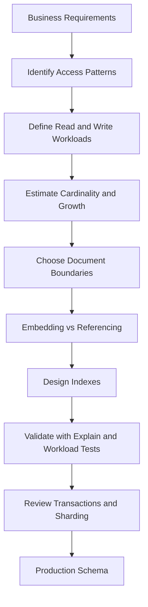
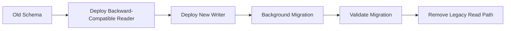
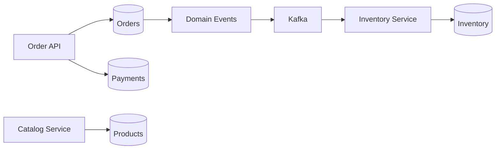

# 02- Data Modeling Patterns

## Overview

MongoDB data modeling is fundamentally **access-pattern driven**. Unlike a relational database, where normalization and relationships are often the starting point, MongoDB encourages designing documents around the queries and update patterns the application must execute.

A production MongoDB model should answer several questions before collections and fields are finalized:

- Which data is always read together?
- Which data changes independently?
- What is the expected cardinality?
- How large can embedded arrays or documents become?
- Which queries must remain efficient at scale?
- Which data must be strongly consistent?
- Where is duplication acceptable?
- Which documents or fields are likely to become write hotspots?
- How will the schema evolve?
- How will indexes support the chosen access patterns?
- Will the model remain practical if the collection grows by several orders of magnitude?

The most important principle is:

> **Model around access patterns, not around entities alone.**

A good MongoDB schema makes common reads cheap, keeps writes bounded, avoids unbounded document growth, and provides a clear path for indexing, transactions, sharding, and schema evolution.

---

## MongoDB's Document Model

MongoDB stores records as BSON documents inside collections.

A simplified document might look like:

```json
{
  "_id": "65f2c4...",
  "customer_id": "cust_1024",
  "status": "confirmed",
  "shipping_address": {
    "city": "Kolkata",
    "country": "IN"
  },
  "items": [
    {
      "product_id": "prod_101",
      "name": "Mechanical Keyboard",
      "quantity": 1,
      "unit_price": 7499
    }
  ],
  "created_at": "2026-09-21T10:30:00Z"
}
```

The document can contain:

- scalar fields
- nested documents
- arrays
- arrays of documents
- references to other documents

This gives MongoDB substantial flexibility in representing application data without requiring every relationship to be represented as a join.

### Document Boundaries

A document boundary should generally represent data that has one or more of these properties:

- It is frequently retrieved together.
- It has the same lifecycle as the parent.
- It has bounded size.
- It requires atomic updates together with the parent.
- Its duplication cost is acceptable.

For example, an order's shipping address is often a good embedded field because the address used for the order represents a historical snapshot:

```json
{
  "_id": "order_1001",
  "customer_id": "cust_101",
  "shipping_address": {
    "line1": "10 Park Street",
    "city": "Kolkata",
    "postal_code": "700016"
  }
}
```

Changing the customer's current profile address should not normally modify historical orders.

---

## Access-Pattern-Driven Modeling

Before designing collections, identify application operations.

For an e-commerce service, the access-pattern inventory might be:

| Access Pattern | Frequency | Typical Query |
|---|---:|---|
| Get order by ID | Very high | `_id` |
| Get customer orders | High | `customer_id + created_at` |
| Get pending orders | Medium | `status + created_at` |
| Get order details | Very high | `_id` |
| Update order status | High | `_id` |
| Search products | Very high | category/search attributes |
| Generate sales report | Low/medium | aggregation |

The schema should then be designed to make these operations efficient.

A useful workflow is:



### Model the Query, Not Just the Entity

A relational mindset might begin with:

```text
Customer
Order
OrderItem
Product
Address
```

MongoDB modeling should instead begin with:

```text
GET /customers/{id}/orders
GET /orders/{id}
POST /orders
PATCH /orders/{id}/status
GET /products?category=...
```

The resulting schema may intentionally duplicate some information because the application benefits from avoiding joins.

---

## Embedding vs Referencing

The central MongoDB modeling decision is whether related data should be embedded inside the parent document or stored separately.

| Strategy | Best When | Main Advantage | Main Risk |
|---|---|---|---|
| Embedding | Data is read together and bounded | Single-document reads and atomicity | Document growth |
| Referencing | Data is large, shared, or independently managed | Independent lifecycle | Additional queries or `$lookup` |
| Controlled duplication | Stable data is frequently read | Fewer reads | Synchronization complexity |
| Hybrid | Different access patterns coexist | Flexible optimization | More complex application logic |

### Embedding

```json
{
  "_id": "order_1001",
  "customer_id": "cust_101",
  "shipping_address": {
    "city": "Kolkata",
    "postal_code": "700016"
  },
  "items": [
    {
      "product_id": "prod_101",
      "name": "Keyboard",
      "quantity": 1
    }
  ]
}
```

Embedding is generally appropriate when:

- the child is bounded
- the child is owned by the parent
- the child is normally retrieved with the parent
- the child does not have an independent lifecycle
- the combined document remains reasonably sized

### Referencing

```json
{
  "_id": "order_1001",
  "customer_id": "cust_101",
  "item_ids": [
    "item_5001",
    "item_5002"
  ]
}
```

References are preferable when:

- child data can grow without a practical bound
- child records are independently queried
- child data is shared by many parents
- child records have their own lifecycle
- the child document is large
- different services own the related data

---

## One-to-One Relationships

One-to-one relationships are usually good candidates for embedding when the two records have the same lifecycle.

### Embedded

```json
{
  "_id": "user_1001",
  "email": "user@example.com",
  "profile": {
    "display_name": "Aranya",
    "timezone": "Asia/Kolkata"
  }
}
```

This works well if the profile is always retrieved with the user.

### Referenced

A separate profile collection is more appropriate when the profile:

- is independently accessed
- is large
- has a different ownership boundary
- is updated frequently while user records are frequently read

```json
{
  "_id": "user_1001",
  "profile_id": "profile_1001"
}
```

The decision is not based on relationship type alone. Access patterns and lifecycle matter more.

---

## One-to-Many Relationships

One-to-many relationships require cardinality analysis.

### Bounded One-to-Many

For a user with a small, bounded set of preferences:

```json
{
  "_id": "user_1001",
  "preferences": [
    {
      "name": "email_notifications",
      "enabled": true
    },
    {
      "name": "marketing_notifications",
      "enabled": false
    }
  ]
}
```

Embedding is appropriate because the array is bounded.

### Unbounded One-to-Many

Avoid embedding an unbounded event history:

```json
{
  "_id": "user_1001",
  "events": [
    "... potentially millions of events ..."
  ]
}
```

The document grows continuously and eventually becomes operationally problematic.

Prefer a separate collection:

```json
{
  "_id": "event_9001",
  "user_id": "user_1001",
  "type": "login",
  "created_at": "2026-09-21T10:30:00Z"
}
```

Index:

```javascript
db.events.createIndex({
  user_id: 1,
  created_at: -1
})
```

This supports:

```javascript
db.events.find({
  user_id: "user_1001"
}).sort({
  created_at: -1
}).limit(50)
```

---

## Many-to-Many Relationships

Many-to-many relationships generally require more careful modeling.

Suppose users can belong to multiple teams and teams contain many users.

### Embedded Memberships

```json
{
  "_id": "team_1001",
  "name": "Platform",
  "members": [
    {
      "user_id": "user_1",
      "role": "admin"
    },
    {
      "user_id": "user_2",
      "role": "developer"
    }
  ]
}
```

This is reasonable when:

- teams remain small
- memberships are normally read with the team
- membership count is bounded

### Separate Membership Collection

For large organizations:

```json
{
  "_id": "membership_5001",
  "team_id": "team_1001",
  "user_id": "user_1",
  "role": "admin",
  "created_at": "2026-09-21T10:30:00Z"
}
```

Indexes:

```javascript
db.memberships.createIndex({
  team_id: 1,
  user_id: 1
})

db.memberships.createIndex({
  user_id: 1,
  team_id: 1
})
```

This supports both directions efficiently.

---

## Parent-Child Modeling

Parent-child relationships often map naturally to references.

For example:

```text
Organization
├── Department
│   ├── Employee
│   └── Employee
└── Department
```

If departments and employees are independently queried, use separate collections.

```json
{
  "_id": "employee_1001",
  "organization_id": "org_1",
  "department_id": "dept_10",
  "name": "Employee A"
}
```

This also allows efficient queries such as:

```javascript
db.employees.find({
  organization_id: "org_1",
  department_id: "dept_10"
})
```

A compound index should follow the actual access pattern:

```javascript
db.employees.createIndex({
  organization_id: 1,
  department_id: 1
})
```

---

## Cardinality

Cardinality describes how many related records can exist.

Typical categories:

| Cardinality | Example | Typical Modeling Direction |
|---|---|---|
| 1:1 | User → Profile | Embed when tightly coupled |
| 1:few | User → Preferences | Embed |
| 1:many | Customer → Orders | Reference |
| 1:many bounded | Order → Items | Embed |
| 1:huge | User → Events | Separate collection |
| many:many | Users ↔ Teams | Reference/junction collection |

The critical distinction is:

> **One-to-many does not automatically mean referencing, and one-to-few does not automatically mean embedding.**

Expected cardinality and growth behavior matter more than the relationship label.

---

## Document Growth

Document growth is one of the most important MongoDB modeling concerns.

Consider:

```json
{
  "_id": "customer_1001",
  "orders": [
    "... thousands of orders ..."
  ]
}
```

Every new order modifies the same document.

This creates multiple problems:

- increasing document size
- larger updates
- increased write contention
- larger working-set requirements
- inefficient replication traffic
- difficult sharding behavior
- eventual document-size constraints

A bounded embedded collection is usually safe.

An unbounded array is a common MongoDB anti-pattern.

---

## Large Documents

MongoDB documents have a maximum BSON document size. Application design should therefore avoid schemas that can approach the document-size limit during normal operation.

Large documents can also be problematic before reaching the hard limit because they:

- consume more memory
- increase network transfer size
- increase serialization/deserialization cost
- make updates more expensive
- increase replication traffic
- reduce cache efficiency

Large binary objects should generally use an appropriate object-storage strategy rather than embedding arbitrary files directly into business documents.

---

## Hot Documents

A hot document is repeatedly updated by many concurrent operations.

Example:

```json
{
  "_id": "inventory_1001",
  "stock": 1000
}
```

If thousands of requests continuously update the same inventory document, the document can become a write hotspot.

Possible strategies include:

- partitioning counters
- distributing writes across documents
- batching updates
- maintaining derived counters asynchronously
- redesigning the access pattern
- using atomic operators where appropriate

For example:

```javascript
db.inventory.updateOne(
  { _id: "inventory_1001", stock: { $gt: 0 } },
  { $inc: { stock: -1 } }
)
```

This is preferable to reading the document into the application and then writing a calculated value because the update is atomic at the document level.

---

## Read-Heavy vs Write-Heavy Models

### Read-Heavy Workloads

For read-heavy systems, controlled denormalization can reduce expensive reads.

For example, an order can store a product-name snapshot:

```json
{
  "product_id": "prod_101",
  "product_name": "Mechanical Keyboard",
  "unit_price": 7499
}
```

The current product may have a different name later, but historical orders should retain the original value.

### Write-Heavy Workloads

Write-heavy systems should minimize:

- unnecessary indexes
- large documents
- repeated updates to the same document
- excessive duplication requiring synchronized writes

An analytics event collection is often better modeled as append-oriented documents:

```json
{
  "event_type": "checkout_completed",
  "customer_id": "cust_1001",
  "timestamp": "2026-09-21T10:30:00Z",
  "metadata": {
    "cart_size": 4
  }
}
```

---

## Controlled Denormalization

Denormalization is often intentional in MongoDB.

Suppose a product is:

```json
{
  "_id": "prod_101",
  "name": "Mechanical Keyboard",
  "category": "keyboards"
}
```

An order can store:

```json
{
  "product_id": "prod_101",
  "product_name": "Mechanical Keyboard",
  "category": "keyboards",
  "unit_price": 7499
}
```

This duplicates data, but it can be correct because the order requires a historical snapshot.

### Safe Duplication

Duplication is easier to manage when the duplicated value is:

- immutable
- versioned
- historical
- inexpensive to regenerate
- not authoritative

### Dangerous Duplication

Avoid duplicating frequently changing authoritative data across many documents unless the synchronization strategy is explicit.

Otherwise:

```text
Source of truth
      ↓
Multiple copies
      ↓
Partial updates
      ↓
Inconsistent state
```

---

## Modeling the Same Business Domain in Different Ways

Consider a blog post with comments.

### Model A: Embedded Comments

```json
{
  "_id": "post_1001",
  "title": "MongoDB Modeling",
  "comments": [
    {
      "author_id": "user_1",
      "body": "Useful article",
      "created_at": "2026-09-21T10:30:00Z"
    }
  ]
}
```

Best when comments are:

- few
- always displayed with the post
- bounded
- relatively small

### Model B: Referenced Comments

Posts:

```json
{
  "_id": "post_1001",
  "title": "MongoDB Modeling"
}
```

Comments:

```json
{
  "_id": "comment_5001",
  "post_id": "post_1001",
  "author_id": "user_1",
  "body": "Useful article",
  "created_at": "2026-09-21T10:30:00Z"
}
```

Index:

```javascript
db.comments.createIndex({
  post_id: 1,
  created_at: -1
})
```

This is preferable when comments can grow significantly or require independent pagination.

### Model C: Hybrid

Keep recent comments embedded:

```json
{
  "_id": "post_1001",
  "title": "MongoDB Modeling",
  "recent_comments": [
    {
      "author_id": "user_1",
      "body": "Useful article"
    }
  ],
  "comment_count": 18452
}
```

Store the authoritative comment history separately.

This can optimize the common "show post with recent comments" path while avoiding an unbounded array.

The application must clearly define which field is authoritative.

---

## Snapshot Modeling

Historical data often benefits from snapshots.

For example:

```json
{
  "_id": "order_1001",
  "customer_id": "cust_1001",
  "customer_snapshot": {
    "name": "Customer A",
    "email": "customer@example.com"
  },
  "items": [
    {
      "product_id": "prod_101",
      "name": "Keyboard",
      "price": 7499
    }
  ]
}
```

This protects historical records from future changes to:

- product names
- prices
- customer display information
- shipping addresses
- tax configuration

The important design question is whether the duplicated data represents **current state** or a **historical snapshot**.

---

## Query-Driven Schema Design

A practical modeling process is:

### Identify Queries

```text
GET /orders/{id}
GET /customers/{id}/orders
GET /orders?status=pending
GET /orders?customer_id=...
```

### Identify Writes

```text
Create order
Update order status
Add payment information
Cancel order
```

### Identify Cardinality

```text
Customer → Orders = unbounded
Order → Items = bounded
Order → Payment attempts = potentially many
```

### Choose Boundaries

```text
orders
payments
```

### Choose Embedding

```text
order.shipping_address
order.items
```

### Choose References

```text
order.customer_id
order.payment_id
```

### Design Indexes

```javascript
db.orders.createIndex({
  customer_id: 1,
  created_at: -1
})

db.orders.createIndex({
  status: 1,
  created_at: -1
})
```

### Validate Against Production Workloads

Use realistic data volume and query distributions rather than validating only against a local collection containing a few hundred documents.

---

## Schema Evolution

MongoDB's flexible schema does not mean schema evolution can be ignored.

A production application should have an explicit migration strategy.

Common approaches include:

| Strategy | Description | Best Use |
|---|---|---|
| Lazy migration | Upgrade documents when read | Large collections |
| Background migration | Gradually transform existing documents | Controlled rollouts |
| Bulk migration | Transform all documents | Smaller datasets |
| Versioned documents | Store schema version | Complex long-lived data |
| Dual-read/dual-write | Support old and new representations temporarily | Zero-downtime migrations |

### Schema Versioning

```json
{
  "_id": "order_1001",
  "schema_version": 2,
  "shipping_address": {
    "city": "Kolkata",
    "postal_code": "700016"
  }
}
```

Application logic can handle versions explicitly:

```python
def normalize_order(document: dict) -> dict:
    version = document.get("schema_version", 1)

    if version == 1:
        document = migrate_v1_to_v2(document)

    return document
```

Schema versioning is particularly useful when:

- old documents remain in the collection for long periods
- multiple application versions coexist during deployment
- migrations must be backward compatible

---

## Zero-Downtime Schema Changes

For a production deployment, avoid assuming every document changes instantly.

A safer rollout is:



The application should tolerate the transition period.

For example:

```python
email = document.get("email_address") or document.get("email")
```

Once migration is complete and verified, the legacy field can be removed.

---

## Schema Validation

Flexible schemas should still have boundaries.

MongoDB supports collection-level validation using JSON Schema.

Example:

```javascript
db.createCollection("users", {
  validator: {
    $jsonSchema: {
      bsonType: "object",
      required: ["email", "status", "created_at"],
      properties: {
        email: {
          bsonType: "string"
        },
        status: {
          enum: ["active", "disabled", "pending"]
        },
        created_at: {
          bsonType: "date"
        }
      }
    }
  },
  validationLevel: "strict",
  validationAction: "error"
})
```

Validation is useful for enforcing:

- required fields
- BSON types
- allowed values
- nested structures
- array element structure

### Nested Validation

```javascript
validator: {
  $jsonSchema: {
    bsonType: "object",
    required: ["address"],
    properties: {
      address: {
        bsonType: "object",
        required: ["city", "postal_code"],
        properties: {
          city: { bsonType: "string" },
          postal_code: { bsonType: "string" }
        }
      }
    }
  }
}
```

### Array Validation

```javascript
validator: {
  $jsonSchema: {
    bsonType: "object",
    required: ["items"],
    properties: {
      items: {
        bsonType: "array",
        items: {
          bsonType: "object",
          required: ["product_id", "quantity"],
          properties: {
            product_id: { bsonType: "string" },
            quantity: { bsonType: "int", minimum: 1 }
          }
        }
      }
    }
  }
}
```

### Validation Levels

`validationLevel` controls which documents are validated.

Common values include:

- `strict`
- `moderate`
- `off`

`strict` is generally appropriate for established production schemas.

### Validation Actions

`validationAction` controls what happens when validation fails:

- `error`
- `warn`

Use `warn` cautiously during migrations or controlled adoption.

### Application Validation vs Database Validation

Use both where appropriate.

| Layer | Responsibility |
|---|---|
| Pydantic/Django/application validation | API semantics and user-facing validation |
| MongoDB validation | Persistence-level invariants |
| Indexes | Uniqueness and query performance |
| Transactions | Cross-document consistency |

Application validation should not be treated as the only protection when invalid data can enter MongoDB through multiple services, scripts, or administrative tools.

---

## Arrays and Nested Documents

Arrays are powerful but require careful cardinality analysis.

Good:

```json
{
  "_id": "user_1001",
  "roles": ["admin", "developer"]
}
```

Potentially dangerous:

```json
{
  "_id": "user_1001",
  "audit_events": [
    "... unbounded ..."
  ]
}
```

Nested documents are especially useful for cohesive substructures:

```json
{
  "payment": {
    "provider": "stripe",
    "method": "card",
    "last4": "4242"
  }
}
```

Embedding keeps related data close to the parent and can provide atomic updates.

---

## Atomicity and Modeling

MongoDB guarantees atomicity at the single-document level.

This is one of the strongest arguments for good document modeling.

Suppose an order contains:

```json
{
  "_id": "order_1001",
  "status": "confirmed",
  "payment": {
    "status": "paid"
  }
}
```

Changing both fields in one update can be atomic:

```javascript
db.orders.updateOne(
  { _id: "order_1001" },
  {
    $set: {
      status: "confirmed",
      "payment.status": "paid"
    }
  }
)
```

If related state must frequently change atomically, embedding that state can eliminate the need for multi-document transactions.

This is a major modeling consideration.

---

## Avoiding Unnecessary Transactions Through Modeling

Poor modeling often creates unnecessary transactional requirements.

Example:

```text
Order
Payment
OrderStatus
Inventory
```

If every business operation requires modifying all four documents atomically, the application becomes heavily dependent on transactions.

Sometimes the better approach is to identify which state actually needs atomicity and redesign boundaries accordingly.

For example:

```text
Order
├── status
└── payment_status
```

may be appropriate if those values form one aggregate.

Other independently owned state can remain separate and be coordinated through events or workflows.

Transactions remain useful when true cross-document invariants exist; they should not compensate for every modeling problem.

---

## Denormalization and Consistency

Denormalization introduces a consistency decision.

Suppose:

```text
products
orders
```

An order stores:

```json
{
  "product_id": "prod_101",
  "product_name": "Keyboard",
  "unit_price": 7499
}
```

The product's current price may later become:

```json
{
  "_id": "prod_101",
  "price": 7999
}
```

The order remains at `7499`.

That is correct if the order stores a historical purchase price.

However, if the duplicated value represents current state, synchronization becomes necessary.

Possible synchronization mechanisms include:

- synchronous application updates
- transactions
- change streams
- Kafka events
- background jobs
- periodic reconciliation

The more copies of mutable authoritative data you create, the more operational complexity you introduce.

---

## Aggregates and Ownership Boundaries

A useful senior-level modeling concept is the **aggregate boundary**.

An aggregate contains data that should normally be changed together.

For example:

```text
Order
├── shipping_address
├── billing_address
├── items
├── totals
└── payment_summary
```

may represent one application-level aggregate.

But:

```text
Order
Customer
Product Catalog
Warehouse Inventory
```

may have separate lifecycles and ownership boundaries.

This helps determine:

- document boundaries
- transaction boundaries
- service boundaries
- authorization boundaries
- consistency requirements

---

## Microservices and MongoDB Modeling

MongoDB collections should not automatically mirror every service domain.

A service should own the data required for its responsibilities.

For example:



An order service may store a product snapshot without directly depending on the catalog database for every order read.

Avoid cross-service database coupling such as:

```text
Service A
   ↓
Service B's MongoDB collection
```

Prefer:

```text
Service A
   ↓
Service A's data
   ↓
Events / APIs
   ↓
Service B
```

This allows independent deployments and ownership.

---

## Multi-Tenant Modeling

For SaaS systems, tenant identity is often a first-class access-pattern component.

A common model is:

```json
{
  "_id": "order_1001",
  "tenant_id": "tenant_42",
  "customer_id": "cust_1001",
  "status": "confirmed"
}
```

Indexes should commonly include the tenant boundary:

```javascript
db.orders.createIndex({
  tenant_id: 1,
  customer_id: 1,
  created_at: -1
})
```

Benefits include:

- efficient tenant-scoped queries
- reduced accidental cross-tenant access
- easier operational analysis
- potential support for tenant-aware sharding

The application must still enforce authorization. An index does not provide security isolation.

---

## Soft Delete Modeling

Soft deletion may be represented as:

```json
{
  "_id": "user_1001",
  "email": "user@example.com",
  "deleted_at": null
}
```

or:

```json
{
  "_id": "user_1001",
  "email": "user@example.com",
  "is_deleted": false
}
```

Queries should consistently account for the deletion state:

```javascript
db.users.find({
  tenant_id: "tenant_42",
  deleted_at: null
})
```

A partial index can be useful:

```javascript
db.users.createIndex(
  {
    tenant_id: 1,
    email: 1
  },
  {
    unique: true,
    partialFilterExpression: {
      deleted_at: null
    }
  }
)
```

This can support uniqueness among active records while allowing historical soft-deleted documents.

---

## Time-Based Data Modeling

Time-oriented data frequently benefits from append-oriented documents.

Example:

```json
{
  "service": "payments",
  "event_type": "payment_completed",
  "timestamp": "2026-09-21T10:30:00Z",
  "request_id": "req_12345",
  "latency_ms": 84
}
```

Useful modeling considerations include:

- timestamp field
- bounded document size
- retention policy
- time-based indexes
- archival strategy
- TTL where appropriate
- aggregation workload
- storage growth

Do not use TTL indexes as a general-purpose archival mechanism when regulatory retention or durable archival requirements exist.

---

## Audit Data Modeling

Audit records should generally be immutable and append-oriented.

```json
{
  "_id": "audit_1001",
  "tenant_id": "tenant_42",
  "actor_id": "user_1001",
  "action": "USER_ROLE_CHANGED",
  "resource_type": "user",
  "resource_id": "user_2001",
  "before": {
    "role": "viewer"
  },
  "after": {
    "role": "admin"
  },
  "created_at": "2026-09-21T10:30:00Z"
}
```

Avoid embedding unbounded audit histories inside operational documents.

Audit data often has different:

- retention
- access control
- indexing
- archival
- compliance
- performance requirements

Therefore, it commonly deserves its own collection or even a separate storage system.

---

## Pagination-Aware Modeling

Pagination requirements should influence schema design.

Offset pagination:

```javascript
db.orders.find({
  customer_id: "cust_1001"
})
.sort({
  created_at: -1
})
.skip(10000)
.limit(50)
```

becomes increasingly expensive as the offset grows.

For large datasets, cursor-based pagination is generally preferable.

Example:

```javascript
db.orders.find({
  customer_id: "cust_1001",
  created_at: {
    $lt: ISODate("2026-09-21T10:00:00Z")
  }
})
.sort({
  created_at: -1
})
.limit(50)
```

The index should match the access pattern:

```javascript
db.orders.createIndex({
  customer_id: 1,
  created_at: -1,
  _id: -1
})
```

Including `_id` can provide a deterministic tie-breaker when timestamps are not unique.

---

## Index Design Follows the Model

A data model without corresponding indexes is incomplete.

Suppose the access pattern is:

```javascript
db.orders.find({
  tenant_id: "tenant_42",
  status: "pending"
})
.sort({
  created_at: -1
})
.limit(50)
```

A candidate compound index is:

```javascript
db.orders.createIndex({
  tenant_id: 1,
  status: 1,
  created_at: -1
})
```

The index is designed around the actual query rather than the abstract entity.

When designing indexes, consider:

- equality predicates
- sort requirements
- range predicates
- cardinality
- selectivity
- query frequency
- write frequency
- index size

---

## Data Model and Compound Indexes

Consider:

```javascript
db.orders.find({
  tenant_id: "tenant_42",
  customer_id: "cust_1001",
  status: "confirmed"
})
.sort({
  created_at: -1
})
```

Potential index:

```javascript
db.orders.createIndex({
  tenant_id: 1,
  customer_id: 1,
  status: 1,
  created_at: -1
})
```

The exact index should be validated using real workloads and `explain()`.

Do not mechanically create an index for every field.

---

## Schema Design and Sharding

Sharding should influence modeling before the system reaches production scale.

A good shard key should consider:

- cardinality
- frequency
- distribution
- query targeting
- write distribution
- growth characteristics

A schema that concentrates most writes around one logical key can create hot shards.

For example, a monotonically increasing identifier may create poor write distribution with certain ranged-sharding strategies.

A tenant-based model may work well for some SaaS workloads, but a tenant with extremely high traffic can itself become a hotspot.

Therefore, shard-key selection must consider both:

```text
Data model
+
Access patterns
+
Distribution
+
Growth
+
Operational workload
```

---

## Modeling for Change Streams

Change streams are easier to use when documents contain enough information for downstream consumers to process events safely.

For example:

```json
{
  "_id": "order_1001",
  "tenant_id": "tenant_42",
  "status": "confirmed",
  "updated_at": "2026-09-21T10:30:00Z"
}
```

A downstream service can consume the change event and use:

- document ID
- tenant ID
- operation type
- version or timestamp
- resume token

Idempotency remains essential.

A consumer should be safe if the same logical event is processed more than once.

---

## Versioned Documents

For systems with frequent state changes, an explicit version can help coordinate updates and event consumers.

```json
{
  "_id": "order_1001",
  "version": 17,
  "status": "confirmed"
}
```

Application logic can use optimistic concurrency:

```javascript
db.orders.updateOne(
  {
    _id: "order_1001",
    version: 16
  },
  {
    $set: {
      status: "confirmed"
    },
    $inc: {
      version: 1
    }
  }
)
```

If no document matches, another writer may have modified the record.

This pattern can be useful when multiple workers update the same logical entity and lost updates must be prevented.

---

## Security Implications of Data Modeling

Data modeling affects security.

Sensitive fields should not be unnecessarily duplicated across documents.

For example, copying a user's:

```text
password hash
authentication secrets
payment credentials
private tokens
```

into operational documents increases the number of places where sensitive information exists.

Prefer storing references or carefully selected non-sensitive snapshots.

Model tenant ownership explicitly:

```json
{
  "tenant_id": "tenant_42",
  "resource_id": "resource_1001"
}
```

and enforce authorization at the service layer.

Data duplication should not accidentally expand the security boundary.

---

## Python Repository Pattern

A repository should hide MongoDB-specific persistence details from business logic.

```python
from pymongo.collection import Collection
from bson import ObjectId


class OrderRepository:
    def __init__(self, collection: Collection) -> None:
        self.collection = collection

    def get_by_id(self, order_id: str) -> dict | None:
        return self.collection.find_one(
            {"_id": ObjectId(order_id)},
            {
                "_id": 1,
                "customer_id": 1,
                "status": 1,
                "items": 1,
                "created_at": 1,
            },
        )

    def list_by_customer(
        self,
        customer_id: str,
        limit: int = 50,
    ) -> list[dict]:
        cursor = (
            self.collection
            .find(
                {"customer_id": customer_id},
                {
                    "_id": 1,
                    "status": 1,
                    "created_at": 1,
                    "total": 1,
                },
            )
            .sort("created_at", -1)
            .limit(limit)
        )

        return list(cursor)
```

The service layer can then contain business rules without exposing MongoDB query construction everywhere.

---

## FastAPI Modeling Considerations

Pydantic models should represent API contracts rather than blindly mirror MongoDB documents.

```python
from datetime import datetime
from pydantic import BaseModel, Field


class OrderItem(BaseModel):
    product_id: str
    quantity: int = Field(gt=0)
    unit_price: int = Field(ge=0)


class CreateOrderRequest(BaseModel):
    customer_id: str
    items: list[OrderItem]
```

The persistence model may contain additional fields:

```text
schema_version
created_at
updated_at
tenant_id
internal_status
version
```

Separating API schemas from persistence schemas makes schema evolution easier.

---

## Django Modeling Considerations

Django's native ORM is designed primarily around relational databases.

When MongoDB is used with Django, avoid assuming that relational ORM semantics automatically apply.

Possible architectures include:

```text
Django
  ↓
Service Layer
  ↓
Repository
  ↓
PyMongo
  ↓
MongoDB
```

MongoEngine or other ODM approaches can also be appropriate depending on project requirements.

A repository abstraction is often useful when:

- MongoDB is not the application's only datastore
- persistence logic is complex
- testability matters
- database ownership must remain explicit

Do not model MongoDB simply as "PostgreSQL without joins."

---

## Production Modeling Checklist

Before approving a MongoDB schema, verify:

### Access Patterns

- Are the highest-frequency queries documented?
- Are query filters known?
- Are sort requirements known?
- Is pagination defined?

### Cardinality

- Which arrays are bounded?
- Which relationships can grow indefinitely?
- Could a document become unexpectedly large?

### Consistency

- Which fields must change atomically?
- Which values are authoritative?
- Which values are snapshots?
- Where is eventual consistency acceptable?

### Performance

- Do indexes match production queries?
- Are large scans expected?
- Are documents unnecessarily large?
- Are hot documents possible?

### Scalability

- How will the collection grow?
- Will the model support sharding if necessary?
- Could one tenant or key become a hotspot?

### Operations

- How will schema changes be deployed?
- How will old documents be migrated?
- How will invalid documents be detected?
- What metrics indicate degradation?

### Security

- Is sensitive data duplicated unnecessarily?
- Is tenant ownership explicit?
- Can unauthorized queries cross tenant boundaries?

---

## Common Modeling Mistakes

| Mistake | Why It Happens | Better Approach |
|---|---|---|
| Embedding unbounded arrays | Embedding initially looks convenient | Reference high-cardinality data |
| Modeling tables directly as collections | Relational habits | Start from access patterns |
| Referencing everything | Fear of duplication | Embed data that is read and changed together |
| Duplicating mutable authoritative data | Avoiding joins | Duplicate only when consistency strategy is explicit |
| Ignoring document growth | Local tests use small data | Test with realistic cardinality |
| One huge document per customer | Convenient aggregate model | Split independently growing data |
| Too many indexes | Optimizing individual queries | Optimize workload as a whole |
| Ignoring pagination | Small development datasets | Design cursor pagination early |
| Using transactions everywhere | Treating MongoDB like a relational DB | Model atomic boundaries first |
| Sharing collections across services | Convenience | Establish ownership boundaries |
| No schema versioning | Flexible schema feels migration-free | Version or explicitly migrate documents |
| Ignoring tenant keys | Authorization handled elsewhere | Include tenant boundaries in model and queries |

---

## Production Anti-Patterns

### Unbounded Arrays

```json
{
  "_id": "user_1001",
  "notifications": [
    "... forever ..."
  ]
}
```

Use a separate collection when the data can grow indefinitely.

### Giant Aggregate Documents

```json
{
  "_id": "organization_1",
  "users": [],
  "orders": [],
  "events": [],
  "audit_logs": []
}
```

This creates an oversized, highly contended document.

### Excessive `$lookup`

A model that constantly reconstructs relational joins using `$lookup` may indicate that the data boundaries were not designed around application access patterns.

`$lookup` is useful, but it should not automatically become the default solution for every relationship.

### Duplicate Mutable State Without Ownership

```text
products.price
orders.product.price
carts.product.price
recommendations.product.price
```

If all values are intended to represent current price, synchronization becomes difficult.

Instead, define which fields are:

- authoritative
- cached
- historical snapshots
- derived

---

## Performance Review of a Data Model

A senior engineer should validate a model with realistic data.

For example:

```text
10,000 documents
        ↓
1 million documents
        ↓
100 million documents
```

Measure:

- query latency
- documents examined
- index keys examined
- memory behavior
- write throughput
- document size
- index size
- replication lag
- connection utilization

A query that works perfectly on 10,000 documents can become unacceptable at 100 million documents.

---

## Modeling and `explain()`

Suppose the intended query is:

```javascript
db.orders.find({
  customer_id: "cust_1001",
  status: "confirmed"
})
.sort({
  created_at: -1
})
.limit(50)
```

Inspect it:

```javascript
db.orders.find({
  customer_id: "cust_1001",
  status: "confirmed"
})
.sort({
  created_at: -1
})
.limit(50)
.explain("executionStats")
```

Important indicators include:

| Metric | What It Indicates |
|---|---|
| `nReturned` | Number of documents returned |
| `totalKeysExamined` | Index entries examined |
| `totalDocsExamined` | Documents examined |
| `executionTimeMillis` | Observed execution time |
| `IXSCAN` | Index scan |
| `COLLSCAN` | Collection scan |
| `SORT` | Explicit sort stage |

A well-designed model and index strategy should generally avoid examining vastly more data than the query needs.

---

## Troubleshooting Data Modeling Problems

Use a structured workflow:

```text
Symptom
↓
Possible causes
↓
Isolation strategy
↓
Diagnostic commands
↓
Root cause
↓
Corrective action
↓
Prevention
```

### Example: Query Becomes Slow

```text
Symptom
↓
Customer order query latency increased
↓
Possible causes
- Missing/ineffective index
- Collection growth
- Low-selectivity index
- Large documents
- Poor pagination
- Working-set pressure
↓
Isolation
- Run explain("executionStats")
- Inspect index definitions
- Compare historical latency
- Check document sizes
- Check collection/index statistics
↓
Root cause
↓
Corrective action
- Adjust model/index
- Replace offset pagination
- Reduce document size
↓
Prevention
- Query performance tests
- Production monitoring
- Index review
- Load testing
```

### Example: Document Growth

```text
Symptom
↓
Updates become slower and documents become large
↓
Possible causes
- Unbounded array
- Repeated embedded history
- Excessive denormalization
↓
Isolation
- Inspect representative documents
- Measure document size
- Determine array cardinality
↓
Root cause
↓
Corrective action
- Move growing data to a collection
- Keep bounded recent data embedded
↓
Prevention
- Cardinality limits
- Schema review
- Growth monitoring
```

---

## Data Modeling Decision Matrix

| Requirement | Preferred Direction |
|---|---|
| Read together | Embed |
| Change together | Embed |
| Small bounded child set | Embed |
| Unbounded child set | Reference |
| Independent lifecycle | Reference |
| Shared entity | Reference |
| Historical snapshot | Controlled duplication |
| Frequently changing authoritative data | Minimize duplication |
| High-volume event stream | Separate collection |
| Large binary object | External/object storage |
| Multi-tenant SaaS | Include tenant boundary |
| High-frequency same-document updates | Review for hot-document risk |
| Cross-document invariant | Consider transaction |
| High-scale distributed workload | Evaluate shard-key implications |

---

## Senior-Level Modeling Heuristics

### Prefer Locality

If a request almost always needs two pieces of data together, embedding can reduce:

- network round trips
- application joins
- serialization overhead
- query complexity

### Bound Everything That Can Grow

For every embedded array, ask:

> "What is the maximum realistic number of elements?"

If the answer is "there is no practical maximum," referencing is usually safer.

### Treat Duplication as a Design Choice

Duplication is not inherently bad.

The important question is:

> "Which copy is authoritative, and how is the other copy maintained?"

### Design for the Worst Reasonable Cardinality

Do not model based on development data.

If production can contain:

```text
10 million customers
500 million orders
billions of events
```

the schema should be evaluated against those growth characteristics.

### Model Atomic Boundaries Explicitly

If two values must always change together, keeping them inside one document can be more valuable than avoiding duplication.

### Make Ownership Explicit

For each field, know:

```text
Who owns it?
Who writes it?
Who reads it?
Is it authoritative?
Can it be stale?
Can it be deleted independently?
```

This becomes particularly important in microservice architectures.

---

## Interview Traps

### "Should MongoDB always embed related data?"

No.

Embedding is appropriate when related data is bounded, commonly accessed together, and has a compatible lifecycle.

### "Is MongoDB schema-less?"

Not in the sense of having no schema.

MongoDB allows documents in a collection to have different structures, but production systems still have application schemas, validation rules, indexes, and operational contracts.

### "Should every relationship use references?"

No.

Over-referencing can recreate relational join-heavy workloads and increase application round trips.

### "Are transactions unnecessary in MongoDB?"

No.

Single-document atomicity reduces the need for transactions, but multi-document transactions remain appropriate when a true cross-document invariant requires atomicity.

### "Is denormalization bad?"

No.

Controlled denormalization is a core MongoDB modeling technique. The critical issue is managing consistency and ownership.

### "Can I embed an unlimited number of child records?"

No.

Unbounded embedded arrays create document growth, memory, write-contention, replication, and scalability problems.

### "Can MongoDB replace relational modeling directly?"

Not always.

The modeling strategy should reflect MongoDB's document model and the application's access patterns rather than mechanically translating relational tables into collections.

---

## Practical Review Example

Suppose a team proposes:

```json
{
  "_id": "customer_1001",
  "orders": [
    {
      "id": "order_1",
      "items": [],
      "payments": [],
      "events": []
    }
  ]
}
```

A senior review should immediately ask:

- How many orders can a customer have?
- How many items per order?
- How many payments per order?
- How many events per order?
- Are orders queried independently?
- Are payments owned by another service?
- Are events retained for years?
- What is the largest expected document?
- How frequently is the customer document updated?
- Will multiple workers update it concurrently?
- What indexes are required?
- How will customer orders be paginated?
- How will this model behave under sharding?
- Which fields are authoritative?
- How will schema migrations work?

A more scalable model might be:

```text
customers
    │
    └── customer_id
          │
          ▼
        orders
          │
          ├── embedded bounded items
          └── customer_id
          │
          ├──────────► payments
          │
          └──────────► order_events
```

This separates independently growing workloads while retaining bounded data that belongs naturally inside the order.

---

## Key Takeaways

- **Design MongoDB schemas around access patterns, cardinality, lifecycle, and atomicity rather than simply translating relational entities into collections.**
- **Embed bounded data that is read or changed together; reference independently growing, shared, or independently managed data.**
- **Treat document growth, hot documents, pagination, indexes, and shard-key implications as first-class modeling concerns before production deployment.**
- **Use controlled denormalization and historical snapshots deliberately, with explicit ownership and consistency rules for duplicated data.**
- **A production MongoDB model is incomplete until its query patterns, indexes, schema-evolution strategy, consistency requirements, and operational growth characteristics have been validated.**