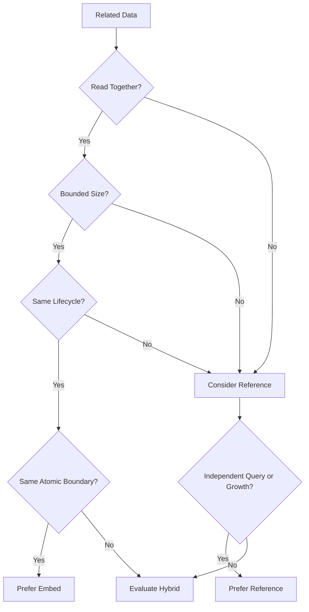

# 03- Embedded vs Referenced Documents

## Overview

Choosing between **embedded documents** and **referenced documents** is one of the most important MongoDB data-modeling decisions.

The choice affects:

- Query latency
- Number of database round trips
- Atomicity
- Document growth
- Write contention
- Index design
- Replication overhead
- Transaction requirements
- Service ownership
- Scalability
- Sharding strategy
- Schema evolution

The decision should not be based on whether two objects are logically related. Most application objects are related. The relevant questions are:

- Are they normally read together?
- Are they updated together?
- Does the child have an independent lifecycle?
- Is the child shared by multiple parents?
- Is the relationship bounded?
- Can the child collection grow indefinitely?
- How frequently does the child change?
- Is duplication acceptable?
- Does the relationship require independent pagination?
- Could the parent become a hot document?
- Will the model need to scale across shards?

A useful starting rule is:

> **Embed data that belongs to the same aggregate and is commonly accessed or updated together. Reference data that has an independent lifecycle, high or unbounded cardinality, or independent access patterns.**

Neither approach is universally better. Production MongoDB schemas frequently use a combination of both.

---

## Embedded Documents

An embedded document stores related data directly inside its parent document.

Example:

```json
{
  "_id": "order_1001",
  "customer_id": "customer_42",
  "status": "confirmed",
  "shipping_address": {
    "line1": "10 Park Street",
    "city": "Kolkata",
    "postal_code": "700016",
    "country": "IN"
  }
}
```

The `shipping_address` is part of the order document rather than a separate collection.

### Why Embed?

Embedding provides data locality.

A single query can retrieve the complete aggregate:

```javascript
db.orders.findOne({
  _id: "order_1001"
})
```

No additional lookup is required.

Embedding is particularly valuable when:

- data is always accessed together
- the embedded data has a bounded size
- the embedded data belongs to the parent
- the embedded data has the same lifecycle
- atomic updates across the fields are useful

---

## Referenced Documents

A referenced model stores related data in separate documents and connects them using an identifier.

For example:

```json
{
  "_id": "order_1001",
  "customer_id": "customer_42",
  "shipping_address_id": "address_9001"
}
```

The address is stored separately:

```json
{
  "_id": "address_9001",
  "customer_id": "customer_42",
  "line1": "10 Park Street",
  "city": "Kolkata",
  "postal_code": "700016",
  "country": "IN"
}
```

References are useful when the related data:

- has an independent lifecycle
- is shared
- is large
- grows without a practical bound
- requires independent querying
- is owned by another domain or service
- changes independently from the parent

---

## Embedded vs Referenced Documents

| Dimension | Embedded | Referenced |
|---|---|---|
| Storage location | Same document | Separate document |
| Read locality | Excellent | Requires additional query or lookup |
| Atomicity | Single-document atomicity | May require transaction |
| Data duplication | Often possible | Usually lower |
| Document growth | Main concern | Less concern |
| Independent lifecycle | Poor fit | Good fit |
| Unbounded relationships | Poor fit | Good fit |
| Shared entities | Poor fit | Good fit |
| Pagination of child records | Limited | Excellent |
| Write contention | Can become high | Usually easier to distribute |
| Query complexity | Often simpler | Can require multiple queries |
| Sharding implications | Parent document remains unit | Related data can scale independently |
| Best use | Aggregate-local data | Independently managed data |

---

## The Primary Decision Framework

Use these questions in order:



This is a decision framework, not a rigid rule.

A technically correct model may intentionally combine embedding, referencing, and controlled duplication.

---

## Modeling by Access Pattern

Consider an e-commerce order.

Common requests might be:

```text
GET /orders/{order_id}
GET /customers/{customer_id}/orders
GET /orders/{order_id}/payments
GET /orders/{order_id}/events
```

The data has different access characteristics:

| Data | Typical Access | Cardinality | Lifecycle |
|---|---|---:|---|
| Shipping address | With order | 1 | Order-owned |
| Order items | With order | Bounded | Order-owned |
| Payments | Independently | Potentially many | Independent |
| Events | Independently | Unbounded | Append-only |
| Customer | Independently | 1 | Customer-owned |

A reasonable model might therefore be:

```text
orders
├── shipping_address       embedded
├── billing_address        embedded
├── items                  embedded
└── customer_id            reference

payments
└── order_id               reference

order_events
└── order_id               reference

customers
└── independent document
```

The schema follows access patterns rather than simply reproducing business entities.

---

## When Embedding Is a Strong Choice

Embedding is generally a strong choice when most of the following are true:

- Parent and child are read together.
- Child data is bounded.
- Child data is not shared.
- Child data has the same lifecycle.
- Child data does not require independent pagination.
- Atomic updates are useful.
- Duplication is acceptable.
- The parent will not become a large or hot document.

Example:

```json
{
  "_id": "order_1001",
  "items": [
    {
      "product_id": "prod_101",
      "name": "Mechanical Keyboard",
      "quantity": 1,
      "unit_price": 7499
    },
    {
      "product_id": "prod_102",
      "name": "Mouse",
      "quantity": 2,
      "unit_price": 1999
    }
  ]
}
```

An order normally needs its items to calculate:

- total
- tax
- shipping
- fulfillment information

Embedding keeps this aggregate together.

---

## When Referencing Is a Strong Choice

Referencing is generally preferable when:

- the relationship is unbounded
- the child has an independent lifecycle
- the child is shared
- child records are independently queried
- child records require pagination
- child data is large
- child data changes frequently
- different services own the data
- the parent would otherwise become a hot document

Example:

```json
{
  "_id": "customer_1001",
  "name": "Customer A"
}
```

Orders remain separate:

```json
{
  "_id": "order_1001",
  "customer_id": "customer_1001",
  "created_at": "2026-09-21T10:30:00Z"
}
```

This allows:

```javascript
db.orders.find({
  customer_id: "customer_1001"
})
.sort({
  created_at: -1
})
.limit(50)
```

without loading the entire customer history.

---

## One-to-One Relationships

One-to-one relationships can be embedded or referenced.

### Embed

```json
{
  "_id": "user_1001",
  "email": "user@example.com",
  "profile": {
    "display_name": "User A",
    "timezone": "Asia/Kolkata"
  }
}
```

Use this when:

- profile data is small
- profile is always loaded with the user
- profile lifecycle matches the user

### Reference

```json
{
  "_id": "user_1001",
  "email": "user@example.com",
  "profile_id": "profile_1001"
}
```

Use a reference when the profile:

- is large
- has independent access patterns
- is independently owned
- changes much more frequently than the user record

---

## One-to-Few Relationships

One-to-few relationships are usually strong embedding candidates.

For example:

```json
{
  "_id": "user_1001",
  "notification_preferences": [
    {
      "channel": "email",
      "enabled": true
    },
    {
      "channel": "sms",
      "enabled": false
    },
    {
      "channel": "push",
      "enabled": true
    }
  ]
}
```

The cardinality is naturally bounded.

Embedding avoids an additional query and keeps preferences atomic with the user.

---

## One-to-Many Relationships

One-to-many requires cardinality analysis.

A customer may have:

```text
Customer → Orders
```

The relationship is one-to-many, but the number of orders may be unbounded.

Embedding all orders is therefore dangerous:

```json
{
  "_id": "customer_1001",
  "orders": [
    "... thousands or millions ..."
  ]
}
```

Instead:

```json
{
  "_id": "order_1001",
  "customer_id": "customer_1001"
}
```

This supports:

- independent order queries
- pagination
- independent indexing
- distributed writes
- lifecycle management

---

## Bounded One-to-Many

An order's line items are also one-to-many:

```text
Order → Items
```

But order size is normally bounded by business rules.

Therefore:

```json
{
  "_id": "order_1001",
  "items": [
    {
      "product_id": "prod_101",
      "quantity": 2
    },
    {
      "product_id": "prod_102",
      "quantity": 1
    }
  ]
}
```

is usually preferable.

The distinction is:

> **One-to-many does not determine the model. Expected cardinality and access patterns do.**

---

## Unbounded Relationships

Unbounded relationships are one of the strongest reasons to reference.

Bad:

```json
{
  "_id": "user_1001",
  "audit_logs": [
    "... forever ..."
  ]
}
```

Better:

```json
{
  "_id": "audit_9001",
  "user_id": "user_1001",
  "action": "LOGIN",
  "created_at": "2026-09-21T10:30:00Z"
}
```

Index:

```javascript
db.audit_logs.createIndex({
  user_id: 1,
  created_at: -1
})
```

Now the application can retrieve recent events efficiently:

```javascript
db.audit_logs.find({
  user_id: "user_1001"
})
.sort({
  created_at: -1
})
.limit(100)
```

---

## Many-to-Many Relationships

Many-to-many relationships generally favor references.

Example:

```text
Users ↔ Teams
```

A membership document can represent the relationship:

```json
{
  "_id": "membership_1001",
  "user_id": "user_1",
  "team_id": "team_10",
  "role": "developer",
  "created_at": "2026-09-21T10:30:00Z"
}
```

Indexes should support both directions:

```javascript
db.memberships.createIndex({
  user_id: 1,
  team_id: 1
})

db.memberships.createIndex({
  team_id: 1,
  user_id: 1
})
```

This allows efficient queries such as:

```javascript
db.memberships.find({
  user_id: "user_1"
})
```

and:

```javascript
db.memberships.find({
  team_id: "team_10"
})
```

Embedding may still be appropriate when the relationship is tightly bounded, such as a small team membership list.

---

## Parent-Child Relationships

Parent-child data can be represented using a reference:

```json
{
  "_id": "employee_1001",
  "name": "Employee A",
  "manager_id": "employee_500"
}
```

This is useful when:

- employees are independently queried
- the hierarchy can grow
- nodes change independently
- recursive traversal is required

Embedding a complete organizational tree is usually problematic because the structure can grow and individual nodes may need independent updates.

---

## Shared Data

Shared entities generally favor references.

Suppose many orders refer to one product:

```json
{
  "_id": "prod_101",
  "name": "Mechanical Keyboard",
  "current_price": 7999
}
```

Orders can reference:

```json
{
  "_id": "order_1001",
  "items": [
    {
      "product_id": "prod_101",
      "quantity": 1
    }
  ]
}
```

However, historical order information may still be embedded:

```json
{
  "product_id": "prod_101",
  "name": "Mechanical Keyboard",
  "unit_price": 7499
}
```

This is controlled duplication rather than accidental duplication.

---

## Controlled Duplication

MongoDB frequently benefits from duplicating stable or historical data.

Consider:

```text
products.price = current price
orders.items[].unit_price = purchase-time price
```

These values have different semantics.

The order price is a historical fact and should not change when the product price changes.

Therefore:

```json
{
  "product_id": "prod_101",
  "unit_price": 7499
}
```

is intentional duplication.

### Good Candidates for Duplication

- historical prices
- product names on invoices
- shipping addresses
- display names
- immutable metadata
- small reference attributes

### Poor Candidates

- frequently changing balances
- mutable permissions
- authoritative account state
- credentials
- security-sensitive values

The critical question is:

> **Which copy is authoritative?**

---

## Document Growth

Embedding makes the parent document responsible for the child's growth.

Suppose:

```json
{
  "_id": "post_1001",
  "comments": []
}
```

starts with 10 comments.

If it eventually reaches 500,000 comments, the original modeling decision becomes a scalability problem.

Consequences can include:

- large network payloads
- higher memory consumption
- expensive updates
- increased replication traffic
- larger working-set requirements
- more contention
- difficult pagination
- document-size constraints

The correct design may be:

```json
{
  "_id": "post_1001",
  "title": "MongoDB Modeling",
  "comment_count": 500000
}
```

with comments stored separately:

```json
{
  "_id": "comment_9001",
  "post_id": "post_1001",
  "author_id": "user_1001",
  "body": "Useful article",
  "created_at": "2026-09-21T10:30:00Z"
}
```

---

## Hot Documents

Embedding can create write contention when many workers update the same parent document.

Example:

```json
{
  "_id": "video_1001",
  "view_count": 5000000
}
```

If every request updates:

```javascript
db.videos.updateOne(
  { _id: "video_1001" },
  {
    $inc: {
      view_count: 1
    }
  }
)
```

the document becomes a highly active write target.

Possible alternatives include:

- bucketed counters
- sharded counters
- asynchronous aggregation
- Redis counters with durable reconciliation
- event-based aggregation through Kafka
- periodic materialization

The correct strategy depends on consistency requirements.

---

## Atomicity as a Modeling Signal

MongoDB provides atomicity for operations on a single document.

This makes embedding particularly valuable when related state must change together.

Example:

```json
{
  "_id": "order_1001",
  "status": "confirmed",
  "payment": {
    "status": "paid"
  }
}
```

A single update can change both:

```javascript
db.orders.updateOne(
  { _id: "order_1001" },
  {
    $set: {
      status: "confirmed",
      "payment.status": "paid"
    }
  }
)
```

The operation is atomic at the document level.

If the same invariant were distributed across multiple collections, a transaction might be required.

Therefore:

> **If two pieces of data must frequently change atomically, consider whether they belong in the same document.**

---

## Avoiding Unnecessary Transactions

Suppose an application stores:

```text
orders
order_status
order_payment
```

and every order update requires changing all three documents atomically.

Before introducing transactions everywhere, reconsider the model.

A better aggregate might be:

```json
{
  "_id": "order_1001",
  "status": "confirmed",
  "payment": {
    "status": "paid"
  }
}
```

This reduces the consistency boundary to a single document.

Transactions should enforce genuine cross-document invariants, not compensate for poor document boundaries.

---

## Independent Lifecycle

Two entities may be related but still deserve separate documents.

Example:

```text
Customer
Subscription
```

A subscription can have:

- its own status
- billing cycle
- renewal date
- payment history
- cancellation state

The customer may remain unchanged while the subscription changes frequently.

A reference is therefore usually more appropriate:

```json
{
  "_id": "subscription_1001",
  "customer_id": "customer_42",
  "status": "active",
  "renewal_date": "2026-10-21"
}
```

---

## Independent Query Requirements

If child data requires its own API endpoints, pagination, filtering, sorting, or reporting, referencing is often more appropriate.

For example:

```text
GET /customers/{id}
GET /customers/{id}/orders
GET /orders/{id}
GET /orders/{id}/events
```

If orders need independent pagination:

```javascript
db.orders.find({
  customer_id: "customer_42"
})
.sort({
  created_at: -1
})
.limit(50)
```

then storing every order inside the customer document would work against the access pattern.

---

## Pagination and References

References work particularly well with cursor-based pagination.

Example:

```javascript
db.comments.find({
  post_id: "post_1001",
  created_at: {
    $lt: ISODate("2026-09-21T10:00:00Z")
  }
})
.sort({
  created_at: -1,
  _id: -1
})
.limit(50)
```

Index:

```javascript
db.comments.createIndex({
  post_id: 1,
  created_at: -1,
  _id: -1
})
```

Embedding is less suitable when the child collection needs independent pagination because the parent document contains the complete child set.

---

## Read Performance

### Embedded

```text
Application
    ↓
MongoDB
    ↓
Single document
```

This minimizes database round trips.

### Referenced

```text
Application
    ↓
MongoDB → Parent
    ↓
MongoDB → Children
```

or:

```text
Application
    ↓
MongoDB
    ↓
$lookup
```

The referenced model may require additional work.

However, fewer round trips do not automatically mean better performance. A giant embedded document can be much more expensive than two small targeted queries.

The correct metric is the complete workload:

```text
Network cost
+
Query cost
+
Serialization cost
+
Memory cost
+
Write cost
```

---

## Write Performance

Embedding can make writes cheaper when related data is updated together.

```javascript
db.orders.updateOne(
  { _id: "order_1001" },
  {
    $set: {
      status: "shipped",
      "shipping.tracking_number": "TRK123"
    }
  }
)
```

But embedding can become expensive when a large document is repeatedly modified.

References distribute updates across separate documents.

This is especially useful for high-write workloads.

---

## Replication Implications

MongoDB replication propagates changes through the oplog.

Large, frequently modified documents can create more replication work than small independent documents.

For example, repeatedly modifying a large embedded aggregate may have greater operational cost than updating a small child document.

This matters for:

- replication throughput
- secondary lag
- recovery
- network bandwidth
- backup volume

Therefore, embedding should be evaluated against write frequency, not just read convenience.

---

## Working Set and Memory

MongoDB performance depends heavily on keeping frequently accessed data and indexes within available memory.

Large embedded documents increase the amount of data transferred and processed.

Consider:

```text
Parent document = 5 MB
Child document = 5 KB
```

If a request needs one child record, referencing may avoid transferring megabytes of unrelated data.

Conversely, if every request needs the complete aggregate, embedding may be much more efficient.

Data locality is valuable only when the localized data is actually needed.

---

## Indexing Embedded Documents

Embedded fields can be indexed directly.

Example:

```json
{
  "_id": "order_1001",
  "shipping_address": {
    "country": "IN",
    "postal_code": "700016"
  }
}
```

Index:

```javascript
db.orders.createIndex({
  "shipping_address.postal_code": 1
})
```

Queries can use:

```javascript
db.orders.find({
  "shipping_address.postal_code": "700016"
})
```

Arrays of embedded documents can produce multikey indexes:

```javascript
db.orders.createIndex({
  "items.product_id": 1
})
```

This makes embedded structures powerful for queryable nested data.

---

## Referenced Documents and `$lookup`

MongoDB can join collections with `$lookup`.

Example:

```javascript
db.orders.aggregate([
  {
    $lookup: {
      from: "customers",
      localField: "customer_id",
      foreignField: "_id",
      as: "customer"
    }
  }
])
```

`$lookup` is useful when the relationship genuinely requires a database-side join.

However, repeatedly reconstructing relational joins can indicate that the model should be reconsidered.

Use `$lookup` deliberately when:

- the relationship is genuinely separate
- the query is analytical or reporting-oriented
- the access pattern cannot justify duplication
- the joined dataset is appropriately indexed

Do not use `$lookup` simply because MongoDB supports it.

---

## Hybrid Modeling

Production systems frequently combine embedding and referencing.

Consider an order:

```json
{
  "_id": "order_1001",
  "customer_id": "customer_42",
  "shipping_address": {
    "city": "Kolkata",
    "postal_code": "700016"
  },
  "items": [
    {
      "product_id": "prod_101",
      "name": "Keyboard",
      "unit_price": 7499,
      "quantity": 1
    }
  ],
  "payment_id": "payment_9001"
}
```

Here:

- shipping address is embedded
- order items are embedded
- customer is referenced
- payment is referenced

This is often a strong design because each relationship follows its own lifecycle and access pattern.

---

## Recent-Items Hybrid Pattern

A common pattern is to embed a bounded recent subset while storing the complete history separately.

Example:

```json
{
  "_id": "post_1001",
  "title": "MongoDB Modeling",
  "comment_count": 18452,
  "recent_comments": [
    {
      "author_id": "user_1",
      "body": "Useful article",
      "created_at": "2026-09-21T10:30:00Z"
    }
  ]
}
```

The complete comments remain in:

```text
comments
```

This optimizes a common read path without creating an unbounded array.

The important requirement is that:

```text
recent_comments
```

is treated as a cache or bounded projection rather than the authoritative comment history.

---

## Snapshot Pattern

A referenced entity can still have selected fields embedded as a historical snapshot.

Example:

```json
{
  "_id": "invoice_1001",
  "customer_id": "customer_42",
  "customer_snapshot": {
    "name": "Customer A",
    "billing_address": {
      "city": "Kolkata"
    }
  }
}
```

This is useful for invoices, orders, and audit records.

The reference points to current customer state.

The embedded snapshot represents historical state.

These are deliberately different semantics.

---

## Embedding Across Service Boundaries

Embedding data owned by another microservice can create hidden coupling.

For example:

```text
Order Service
    ↓
embeds complete Customer record
```

If the Customer Service owns customer data, blindly embedding its mutable state creates synchronization problems.

A safer pattern may be:

```json
{
  "customer_id": "customer_42",
  "customer_display_name": "Customer A"
}
```

where `customer_display_name` is explicitly a snapshot or denormalized projection.

The ownership model must be documented.

---

## Security Considerations

Embedding sensitive data increases the number of documents and queries that expose that information.

For example, embedding:

```text
password hashes
access tokens
payment secrets
private credentials
```

into broadly accessible documents is dangerous.

Prefer:

- minimal duplication
- explicit field projections
- least-privilege database users
- service-level authorization
- separate security-sensitive collections where appropriate

References can also help isolate sensitive data behind a different access path.

However, a reference itself is not a security boundary.

The application must still enforce authorization.

---

## Schema Evolution

Embedded and referenced models have different migration characteristics.

### Embedded Migration

Changing:

```json
{
  "address": {
    "city": "Kolkata"
  }
}
```

to:

```json
{
  "shipping_address": {
    "city": "Kolkata"
  }
}
```

requires migrating every affected parent document.

### Referenced Migration

If addresses are separate:

```text
orders
addresses
```

the address schema can evolve independently.

This is an advantage when the related data has a complex lifecycle.

However, independent schemas also create additional coordination complexity.

---

## Referential Integrity

MongoDB references do not automatically provide relational foreign-key enforcement.

Suppose:

```json
{
  "_id": "order_1001",
  "customer_id": "customer_42"
}
```

MongoDB does not automatically prevent:

```text
customer_42
```

from being deleted while orders still reference it.

The application must decide how to handle this.

Possible strategies include:

- application-level validation
- transactions
- soft deletion
- lifecycle constraints
- background reconciliation
- event-driven cleanup

For example:

```text
Customer deleted
      ↓
Customer Service publishes event
      ↓
Order Service processes event
      ↓
Orders are retained or transitioned
```

The correct approach depends on business requirements.

---

## Transaction Requirements

References increase the possibility of multi-document operations.

Suppose creating an order requires:

```text
orders
payments
inventory
```

If all three must be atomically updated, a transaction may be required.

Before using one, ask:

```text
Can the invariant be represented within one document?
```

If yes, embedding may simplify the system.

If no, a transaction or distributed workflow may be necessary.

In microservices, cross-service transactions are usually not the right abstraction. Prefer explicit workflows, events, and compensating actions where appropriate.

---

## Sharding Implications

Embedding and referencing also affect horizontal scaling.

### Embedded

The entire parent document remains together.

For example:

```text
customer
└── all embedded orders
```

can make the customer document a scalability boundary and potentially a hotspot.

### Referenced

Orders can be distributed independently:

```text
orders
└── customer_id
```

This may provide more flexibility for sharding.

However, a poor shard key can still create hotspots.

For example, if all requests for one high-volume tenant target the same shard, referencing alone does not solve the distribution problem.

---

## Data Ownership Matrix

A useful design review artifact is an ownership matrix.

| Data | Owner | Lifecycle | Access Pattern | Modeling |
|---|---|---|---|---|
| Order status | Order Service | Order | With order | Embed |
| Order items | Order Service | Order | With order | Embed |
| Customer ID | Customer Service | Independent | Filtering/reference | Reference |
| Payment state | Payment Service | Independent | Payment operations | Reference |
| Purchase price | Order Service | Historical | With order | Embed |
| Audit events | Audit subsystem | Append-only | Independent | Reference |
| Product current price | Catalog Service | Independent | Product queries | Reference |

This prevents data-modeling decisions from being made solely at the field level.

---

## Python Example

A repository can expose a domain-oriented interface regardless of whether data is embedded or referenced.

```python
from bson import ObjectId
from pymongo.collection import Collection


class OrderRepository:
    def __init__(self, orders: Collection) -> None:
        self.orders = orders

    def get_order(self, order_id: str) -> dict | None:
        return self.orders.find_one({
            "_id": ObjectId(order_id)
        })

    def update_status(
        self,
        order_id: str,
        status: str,
    ) -> bool:
        result = self.orders.update_one(
            {"_id": ObjectId(order_id)},
            {
                "$set": {
                    "status": status
                }
            },
        )
        return result.modified_count == 1
```

If `shipping_address` and `items` are embedded, the repository can retrieve the complete order in one query.

If payments are referenced, a separate repository can manage payment persistence:

```python
class PaymentRepository:
    def __init__(self, payments: Collection) -> None:
        self.payments = payments

    def get_by_order_id(self, order_id: str) -> dict | None:
        return self.payments.find_one({
            "order_id": order_id
        })
```

This keeps persistence boundaries explicit.

---

## FastAPI Integration

FastAPI response models should not necessarily mirror MongoDB's embedded structure exactly.

For example:

```python
from pydantic import BaseModel


class AddressResponse(BaseModel):
    city: str
    postal_code: str


class OrderItemResponse(BaseModel):
    product_id: str
    quantity: int
    unit_price: int


class OrderResponse(BaseModel):
    id: str
    status: str
    shipping_address: AddressResponse
    items: list[OrderItemResponse]
```

The API can expose an aggregate-oriented response even when some data comes from referenced collections.

The service layer decides how to compose the response:

```text
HTTP request
    ↓
FastAPI endpoint
    ↓
Service layer
    ├── Order repository
    └── Payment repository
    ↓
Response model
```

This prevents database structure from becoming the public API contract.

---

## Django Integration

When using MongoDB with Django, keep the distinction between:

```text
API model
Domain model
Persistence model
```

For example:

```text
Django View
    ↓
Service
    ↓
Order Repository
    ↓
PyMongo
```

A referenced document should not be assumed to behave like a Django foreign key.

MongoDB does not automatically provide the same relational foreign-key semantics as PostgreSQL.

If using an ODM such as MongoEngine, understand exactly which relationship behavior is implemented by the ODM versus MongoDB itself.

---

## Testing Embedded and Referenced Models

Tests should validate behavior rather than only document structure.

### Embedded Model Tests

Verify:

- atomic updates
- nested validation
- array behavior
- document size assumptions
- projection
- update semantics

### Referenced Model Tests

Verify:

- missing references
- pagination
- independent updates
- consistency rules
- transaction behavior where required
- authorization across related records

### Production-Scale Tests

Use representative data volumes.

A model that works with:

```text
100 orders
```

may fail operationally with:

```text
10 million orders
```

The test dataset should reflect realistic:

- cardinality
- document sizes
- index sizes
- concurrency
- query distribution

---

## Monitoring Implications

The modeling strategy determines what should be monitored.

### Embedded Models

Monitor:

- document size
- update frequency
- hot-document behavior
- large response payloads
- replication impact

### Referenced Models

Monitor:

- query count
- `$lookup` performance
- additional database round trips
- orphaned references
- transaction frequency
- consistency failures

A useful application metric is:

```text
database_queries_per_request
```

A referenced model can unintentionally turn one API request into many database calls.

---

## Common Mistakes

| Mistake | Problem | Better Approach |
|---|---|---|
| Embed everything | Unbounded documents | Analyze cardinality |
| Reference everything | Excessive round trips | Embed tightly coupled bounded data |
| Use relationship type alone | Ignores workload | Model access patterns |
| Embed mutable shared data | Synchronization problems | Reference or snapshot deliberately |
| Ignore document growth | Production failures | Estimate maximum realistic size |
| Embed high-frequency writes | Hot documents | Distribute write workload |
| Use `$lookup` everywhere | Recreates join-heavy architecture | Revisit boundaries |
| Assume references enforce integrity | MongoDB has no relational FK semantics | Enforce at application/workflow level |
| Ignore service ownership | Cross-service coupling | Define authoritative owner |
| Paginate embedded arrays directly | Large parent documents | Reference independently pageable data |
| Duplicate sensitive data | Larger security exposure | Minimize sensitive duplication |
| Ignore sharding implications | Hot shards | Evaluate distribution early |

---

## Production Decision Matrix

| Question | Embed | Reference |
|---|---|---|
| Always read together? | Strong signal | Weak signal |
| Always updated together? | Strong signal | Weak signal |
| Small and bounded? | Strong signal | Weak signal |
| Unbounded growth? | Poor fit | Strong fit |
| Independently queried? | Poor fit | Strong fit |
| Independently paginated? | Poor fit | Strong fit |
| Shared by many parents? | Poor fit | Strong fit |
| Historical snapshot? | Strong fit | Optional |
| High write frequency? | Depends | Often safer |
| Requires single-document atomicity? | Strong fit | May require transaction |
| Independent service ownership? | Usually poor fit | Strong fit |
| Large payload? | Risky | Usually safer |
| Simple read path? | Strong fit | More complex |
| Potential shard distribution? | Depends on parent key | Often more flexible |

---

## Troubleshooting Modeling Problems

Use a consistent diagnostic workflow:

```text
Symptom
↓
Possible causes
↓
Isolation strategy
↓
Diagnostic commands
↓
Root cause
↓
Corrective action
↓
Prevention
```

### Slow Reads

```text
Symptom
↓
API endpoint has increased latency
↓
Possible causes
- Large embedded document
- Excessive $lookup
- Missing index
- Multiple application queries
↓
Isolation
- Inspect explain("executionStats")
- Measure database calls per request
- Inspect document size
- Inspect indexes
↓
Root cause
↓
Corrective action
- Reduce embedded payload
- Add appropriate index
- Introduce controlled denormalization
- Redesign relationship
↓
Prevention
- Query-performance tests
- Production latency monitoring
- Schema review
```

### Slow Writes

```text
Symptom
↓
Write latency or replication lag increases
↓
Possible causes
- Hot document
- Large embedded document
- Excessive indexes
- High write contention
↓
Isolation
- Measure update frequency
- Inspect document size
- Review index count
- Inspect replica lag
↓
Root cause
↓
Corrective action
- Split high-write data
- Reduce document size
- Reduce unnecessary indexes
- Distribute writes
↓
Prevention
- Load testing
- Write-latency monitoring
- Capacity planning
```

### Inconsistent Referenced Data

```text
Symptom
↓
Parent references missing or stale child data
↓
Possible causes
- Independent deletion
- Failed synchronization
- Event-processing failure
- Missing transaction
↓
Isolation
- Check reference existence
- Inspect service logs
- Inspect event processing
- Review ownership rules
↓
Root cause
↓
Corrective action
- Repair data
- Introduce lifecycle workflow
- Add reconciliation
- Use transaction where appropriate
↓
Prevention
- Ownership rules
- Idempotent consumers
- Reconciliation jobs
- Data-integrity monitoring
```

---

## Interview Traps

### "Embedding is always faster than referencing."

Not necessarily.

Embedding reduces round trips but can create:

- large documents
- unnecessary data transfer
- hot documents
- expensive updates

The correct answer depends on workload and document size.

### "References are equivalent to foreign keys."

No.

A MongoDB reference is normally just an identifier stored in a document. Referential integrity must be handled by the application or an appropriate workflow.

### "One-to-many means reference."

Not automatically.

A bounded one-to-many relationship such as order items is often better embedded.

### "Many-to-many always requires a join collection."

Not necessarily.

Small, bounded relationships can sometimes be embedded. Large or independently queried relationships generally benefit from a separate membership collection.

### "Embedding eliminates transactions."

No.

Embedding reduces the need for transactions when related state fits naturally within one document, but multi-document invariants may still require transactions.

### "Duplication is bad database design."

Not in MongoDB.

Controlled denormalization is often intentional and useful. The key issue is whether the duplicated data has clear ownership and consistency semantics.

### "If two objects are related, they should be stored together."

Relationship alone is insufficient.

Consider:

```text
Lifecycle
Cardinality
Access pattern
Update frequency
Ownership
Atomicity
Growth
Sharding
```

before deciding.

---

## Practical Review Checklist

Before choosing embedding or referencing, answer:

### Access

- Are the records normally read together?
- Are they independently queried?
- Do they require separate pagination?
- Are they needed by different APIs?

### Cardinality

- Is the relationship bounded?
- What is the expected maximum?
- What is the worst realistic case?
- Can the child grow indefinitely?

### Lifecycle

- Do parent and child have the same lifecycle?
- Can the child exist independently?
- Can the child be deleted independently?

### Consistency

- Which fields are authoritative?
- Which fields can be stale?
- Is duplication a snapshot or current state?
- Is atomicity required?

### Performance

- How large will the parent document become?
- How frequently is it updated?
- Could it become a hot document?
- How many database queries will an API request require?

### Scalability

- How will the model behave at high cardinality?
- Does it support efficient pagination?
- Does it create a shard hotspot?
- Can high-write workloads be distributed?

### Security

- Does embedding expose sensitive data more broadly?
- Are authorization boundaries explicit?
- Is tenant ownership represented where necessary?

### Operations

- How will schema changes be deployed?
- How will orphaned references be detected?
- How will document growth be monitored?
- How will backups and restores behave at scale?

---

## Recommended Engineering Heuristics

Use embedding when:

```text
Read together
+ bounded
+ same lifecycle
+ same atomic boundary
+ not independently queried
```

Use referencing when:

```text
Independent lifecycle
+ high/unbounded cardinality
+ independent queries
+ independent pagination
+ shared ownership
```

Use controlled duplication when:

```text
Read performance matters
+ duplicated data is small
+ consistency semantics are explicit
+ authoritative source is known
```

Use a hybrid model when:

```text
Some fields belong to the aggregate
+
Other data grows independently
+
Common reads benefit from locality
```

The strongest MongoDB schemas often look like:

```text
Aggregate-local data
        ↓
     Embedded

Independent / growing data
        ↓
     Referenced

Historical / stable values
        ↓
   Controlled copy
```

The objective is not to minimize duplication or maximize embedding. The objective is to create a data model that makes the application's important operations predictable, efficient, and operationally safe.

## Key Takeaways

- **Embed bounded data that is commonly accessed or updated with the parent; reference data with independent lifecycle, high cardinality, or independent access patterns.**
- **Cardinality, growth, write frequency, atomicity, and ownership are more important than relationship type when choosing between embedding and referencing.**
- **Controlled duplication is a valid MongoDB strategy when the authoritative source and consistency semantics are explicit, especially for historical snapshots.**
- **Large embedded documents and hot documents can create serious production problems; referenced data often provides better pagination, write distribution, and independent scaling.**
- **Treat embedding vs referencing as an architecture decision involving query patterns, indexes, transactions, service boundaries, security, and future scalability—not merely a document-structure choice.**