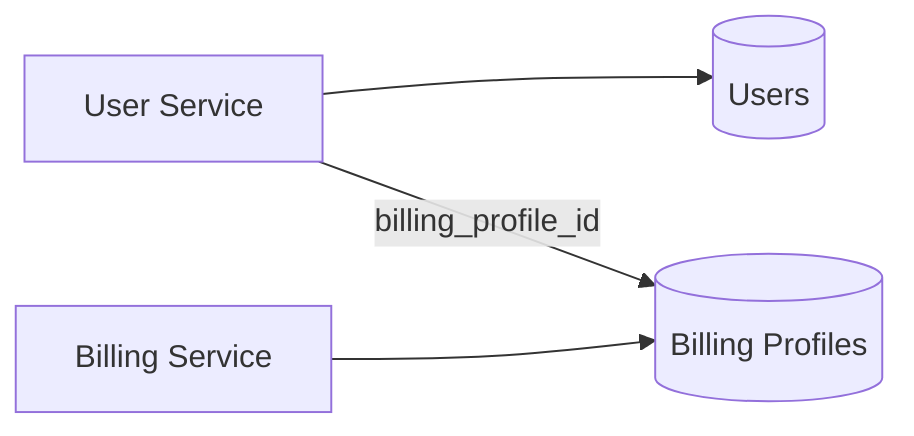
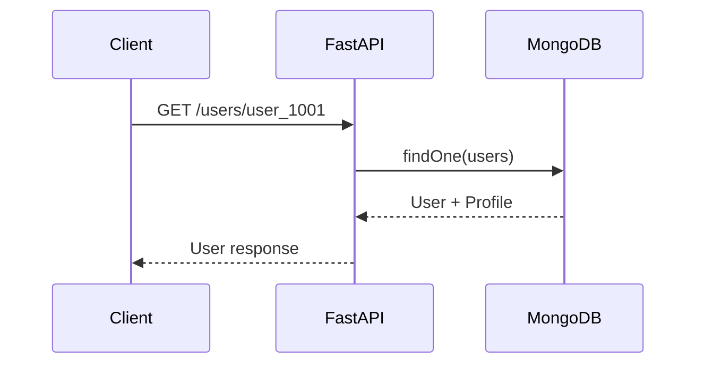
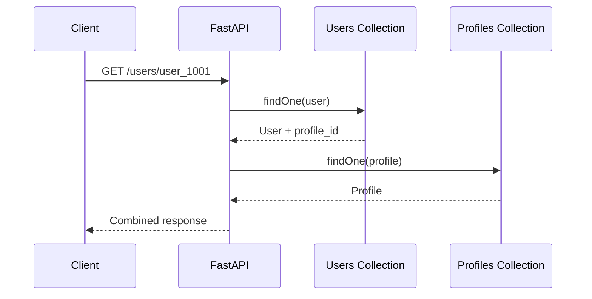
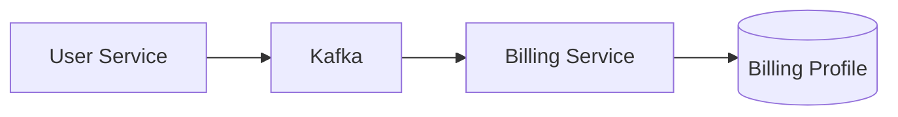

# 04- One-to-One Relationships

## Overview

A one-to-one relationship exists when one document is associated with at most one related document.

Examples include:

- User → Profile
- Employee → Identity Record
- Account → Billing Configuration
- Device → Device Configuration
- Order → Shipping Address
- Organization → Primary Billing Account

In MongoDB, a one-to-one relationship can be modeled primarily in two ways:

- **Embedding** the related document
- **Referencing** the related document

The correct choice depends on:

- Access patterns
- Document size
- Lifecycle
- Update frequency
- Atomicity requirements
- Ownership
- Security boundaries
- Schema evolution
- Query frequency
- Service boundaries

A one-to-one relationship is therefore not automatically an embedding problem.

The central decision is:

> **Should the related data be part of the same aggregate, or should it have an independent persistence boundary?**

---

## One-to-One Relationship Models

Consider:

```text
User ─────── Profile
```

There are two common representations.

### Embedded Model

```json
{
  "_id": "user_1001",
  "email": "user@example.com",
  "profile": {
    "display_name": "User A",
    "timezone": "Asia/Kolkata"
  }
}
```

### Referenced Model

User:

```json
{
  "_id": "user_1001",
  "email": "user@example.com",
  "profile_id": "profile_1001"
}
```

Profile:

```json
{
  "_id": "profile_1001",
  "user_id": "user_1001",
  "display_name": "User A",
  "timezone": "Asia/Kolkata"
}
```

Both are valid MongoDB models.

The decision depends on how the application actually uses the data.

---

## Embedded One-to-One Relationships

Embedding places the related object directly inside the parent document.

```json
{
  "_id": "user_1001",
  "email": "user@example.com",
  "profile": {
    "display_name": "User A",
    "timezone": "Asia/Kolkata",
    "language": "en"
  }
}
```

The parent document becomes the persistence boundary for both objects.

### When to Embed

Embedding is usually appropriate when:

- the related document is small
- the parent always needs it
- both objects have the same lifecycle
- both objects belong to the same aggregate
- atomic updates are useful
- the related data is not independently queried
- the related data is not independently owned

For a typical user profile, this can be a very natural model.

---

## Advantages of Embedding

### Single Read

The application can retrieve both objects with one query:

```javascript
db.users.findOne({
  _id: "user_1001"
})
```

No additional query is necessary.

### Single-Document Atomicity

Related fields can be changed atomically:

```javascript
db.users.updateOne(
  { _id: "user_1001" },
  {
    $set: {
      "profile.display_name": "User B",
      "profile.timezone": "Asia/Kolkata"
    }
  }
)
```

### Lower Application Complexity

The application does not need to:

1. Load the parent.
2. Resolve a reference.
3. Load the child.
4. Handle missing related documents.

### Better Data Locality

Frequently accessed data remains physically associated with the parent document from the application's perspective.

This can reduce:

- network round trips
- query orchestration
- serialization overhead
- application-level joins

---

## Limitations of Embedding

Embedding becomes less attractive when the related data:

- becomes large
- changes independently
- is queried independently
- is owned by another service
- contains sensitive data with a different access boundary
- has substantially different retention requirements
- requires independent indexing and operational management

For example, embedding a complete identity document containing large verification metadata inside every user record can make the user document unnecessarily large.

---

## Referenced One-to-One Relationships

A referenced relationship stores the two objects separately.

```json
{
  "_id": "user_1001",
  "email": "user@example.com",
  "profile_id": "profile_1001"
}
```

The profile is stored independently:

```json
{
  "_id": "profile_1001",
  "user_id": "user_1001",
  "display_name": "User A",
  "timezone": "Asia/Kolkata"
}
```

The relationship is represented by an identifier.

MongoDB does not automatically enforce the relationship like a relational foreign key.

The application must define how the relationship is maintained.

---

## When to Reference

Referencing is generally preferable when:

- the child has an independent lifecycle
- the child is independently queried
- the child is relatively large
- the child changes frequently
- the child has separate authorization requirements
- the child is managed by another subsystem
- the parent should remain small
- schema evolution should occur independently

For example:

```text
User
  │
  └── Identity Verification
```

may be better represented separately if identity verification contains:

- verification status
- provider metadata
- document references
- review history
- timestamps
- compliance information

The identity subsystem can then manage its own lifecycle.

---

## Embedded vs Referenced One-to-One

| Consideration | Embed | Reference |
|---|---|---|
| Small related data | Strong fit | Possible |
| Always read together | Strong fit | Weaker |
| Same lifecycle | Strong fit | Weaker |
| Atomic updates | Strong fit | May require transaction |
| Independent queries | Weaker | Strong fit |
| Independent updates | Weaker | Strong fit |
| Large child document | Weaker | Strong fit |
| Different security boundary | Weaker | Strong fit |
| Different service ownership | Usually weaker | Strong fit |
| Independent schema evolution | Weaker | Strong fit |
| Simple application reads | Strong fit | More application work |
| Parent document size | Increases | Remains smaller |
| Data locality | High | Lower |
| Referential integrity | Not applicable | Application-managed |

---

## Lifecycle Is a Primary Modeling Signal

Consider:

```text
User
Profile
```

If a profile always exists with a user and is deleted with the user, embedding is attractive.

Now consider:

```text
User
Identity Verification
```

The verification record may have a different lifecycle:

```text
User created
    ↓
Verification requested
    ↓
Verification pending
    ↓
Verification approved
    ↓
Verification periodically reviewed
```

The user can exist independently of the verification record.

That lifecycle difference is a strong argument for referencing.

---

## Ownership

Ownership is another important signal.

Suppose:

```text
Account Service
    owns Account

Billing Service
    owns Billing Profile
```

Even if the application frequently displays both together, embedding the complete billing profile inside the account document creates cross-service ownership problems.

A better model may be:

```json
{
  "_id": "account_1001",
  "billing_profile_id": "billing_9001"
}
```

with the billing service owning:

```json
{
  "_id": "billing_9001",
  "account_id": "account_1001",
  "billing_email": "billing@example.com",
  "tax_region": "IN-WB"
}
```

The reference represents a relationship without transferring ownership.

---

## Access Patterns

Suppose an API exposes:

```text
GET /users/{id}
GET /users/{id}/profile
PATCH /users/{id}/profile
```

The independent profile endpoint is a signal that the profile may have an independent access pattern.

However, separate endpoints do not automatically require separate collections.

An embedded profile can still be updated through:

```javascript
db.users.updateOne(
  { _id: "user_1001" },
  {
    $set: {
      "profile.display_name": "User B"
    }
  }
)
```

The important question is not the REST URL structure.

It is the persistence and lifecycle behavior behind the API.

---

## Atomicity

One of the strongest arguments for embedding is MongoDB's single-document atomicity.

Consider:

```json
{
  "_id": "account_1001",
  "status": "active",
  "billing": {
    "status": "enabled"
  }
}
```

Suppose both fields represent one business invariant.

A single operation can update both:

```javascript
db.accounts.updateOne(
  { _id: "account_1001" },
  {
    $set: {
      status: "active",
      "billing.status": "enabled"
    }
  }
)
```

The update is atomic at the document level.

With separate collections, the same operation potentially becomes:

```text
Update account
      +
Update billing profile
```

which may require a transaction if both changes must commit atomically.

---

## Referenced One-to-One and Transactions

Suppose:

```text
accounts
billing_profiles
```

must always transition together.

A multi-document transaction can coordinate the change.

Conceptually:

```text
Start transaction
      ↓
Update account
      ↓
Update billing profile
      ↓
Commit
```

But transactions should not automatically be used to compensate for poor document boundaries.

Ask first:

> Could these fields reasonably belong in the same aggregate?

If yes, embedding may provide simpler atomicity.

If the two records have independent ownership and lifecycle, separate documents may still be the correct architecture even if occasional transactions are required.

---

## Enforcing One-to-One Cardinality

MongoDB references do not inherently enforce one-to-one cardinality.

Consider:

```json
{
  "_id": "profile_1001",
  "user_id": "user_1001"
}
```

Without an appropriate uniqueness constraint, the database could contain:

```text
profile_1001 → user_1001
profile_1002 → user_1001
```

That violates the intended one-to-one relationship.

A unique index can enforce the relationship:

```javascript
db.profiles.createIndex(
  {
    user_id: 1
  },
  {
    unique: true
  }
)
```

Now only one profile can reference a given user.

This is one of the most important differences between a logical relationship and an enforced database invariant.

---

## Optional One-to-One Relationships

Sometimes the child is optional.

Example:

```text
User → Two-Factor Authentication Configuration
```

Not every user has MFA configured.

### Embedded

```json
{
  "_id": "user_1001",
  "email": "user@example.com",
  "mfa": {
    "enabled": true,
    "method": "totp"
  }
}
```

For users without MFA:

```json
{
  "_id": "user_1002",
  "email": "another@example.com"
}
```

This is simple and avoids a separate document for absent optional state.

### Referenced

```json
{
  "_id": "user_1001",
  "email": "user@example.com",
  "mfa_config_id": "mfa_1001"
}
```

A separate collection is useful when MFA configuration has its own lifecycle or security boundary.

---

## Optional References

When using a reference, explicitly define what happens when the child does not exist.

Possible states include:

```text
Parent exists
Child does not exist
```

or:

```text
Parent exists
Reference exists
Child was deleted
```

The second condition is an orphaned reference.

Application code should distinguish:

```python
profile = profiles.find_one({
    "user_id": user_id
})

if profile is None:
    # No profile configured.
    ...
```

from silently assuming that a missing child is a database failure.

---

## Orphaned References

Because MongoDB does not automatically enforce foreign-key constraints, referenced one-to-one relationships can become inconsistent.

Example:

```text
users
    user_1001
       │
       ▼
profile_1001
```

If the profile is deleted:

```text
users
    user_1001
       │
       ▼
missing profile
```

Possible prevention strategies include:

- transactional deletion
- soft deletion
- application-level lifecycle management
- cascading workflows
- reconciliation jobs
- event-driven cleanup

For critical relationships, orphan detection should be observable rather than assumed.

---

## Soft Delete and One-to-One Uniqueness

Soft deletion creates an important uniqueness problem.

Suppose:

```json
{
  "_id": "profile_1001",
  "user_id": "user_1001",
  "deleted_at": null
}
```

A normal unique index:

```javascript
db.profiles.createIndex(
  {
    user_id: 1
  },
  {
    unique: true
  }
)
```

prevents creating another profile for the user even after the existing profile is logically deleted.

A partial unique index can model active records:

```javascript
db.profiles.createIndex(
  {
    user_id: 1
  },
  {
    unique: true,
    partialFilterExpression: {
      deleted_at: null
    }
  }
)
```

This allows historical deleted records while enforcing one active profile per user.

---

## Embedding and Schema Validation

Embedded one-to-one data can be validated together with the parent.

Example:

```javascript
db.createCollection("users", {
  validator: {
    $jsonSchema: {
      bsonType: "object",
      required: ["email"],
      properties: {
        email: {
          bsonType: "string"
        },
        profile: {
          bsonType: "object",
          required: ["display_name"],
          properties: {
            display_name: {
              bsonType: "string"
            },
            timezone: {
              bsonType: "string"
            }
          }
        }
      }
    }
  }
})
```

This creates a persistence-level contract without requiring a separate profile collection.

Application-level validation should still handle business rules that are more complex than database schema validation.

---

## Referenced Documents and Schema Evolution

Separate collections can simplify independent schema evolution.

Suppose a profile starts as:

```json
{
  "_id": "profile_1001",
  "display_name": "User A"
}
```

and later becomes:

```json
{
  "_id": "profile_1001",
  "display_name": "User A",
  "locale": "en-IN",
  "preferences": {
    "theme": "dark"
  },
  "schema_version": 2
}
```

The profile schema can evolve without rewriting the parent user document.

With embedding, the same migration affects every user document containing the embedded profile.

Neither approach is automatically better. The migration frequency and collection size should influence the decision.

---

## Data Size and Working Set

Consider two designs.

### Embedded

```text
users
└── profile
    ├── preferences
    ├── metadata
    └── history
```

If the profile becomes large, every user read can potentially retrieve unnecessary data.

### Referenced

```text
users
profiles
```

A user query can retrieve only:

```javascript
db.users.findOne(
  { _id: "user_1001" },
  {
    _id: 1,
    email: 1,
    status: 1
  }
)
```

The profile is loaded only when needed.

This can improve network and memory efficiency for APIs where the profile is not part of every request.

---

## Hot Documents

Embedding a frequently modified one-to-one child can increase parent-document write frequency.

For example:

```json
{
  "_id": "device_1001",
  "configuration": {
    "last_seen_at": "...",
    "battery_level": 84,
    "signal_strength": -61
  }
}
```

If thousands of device updates target the same parent, the embedded configuration can become part of a high-frequency write path.

If the configuration has an independent update workload, separating it may provide a cleaner write boundary:

```json
{
  "_id": "device_1001",
  "configuration_id": "device_config_1001"
}
```

and:

```json
{
  "_id": "device_config_1001",
  "device_id": "device_1001",
  "battery_level": 84,
  "signal_strength": -61,
  "updated_at": "2026-09-21T10:30:00Z"
}
```

---

## Historical Snapshots

One-to-one relationships frequently involve historical snapshots.

For example, an invoice may reference a customer while also embedding the billing information used at invoice creation.

```json
{
  "_id": "invoice_1001",
  "customer_id": "customer_42",
  "billing_snapshot": {
    "name": "Customer A",
    "address": {
      "city": "Kolkata",
      "postal_code": "700016"
    }
  }
}
```

The reference points to current customer state.

The embedded snapshot represents historical state.

This avoids changing an old invoice when the customer later updates their address.

---

## Security Boundaries

Security-sensitive one-to-one relationships often favor separate collections.

Examples:

```text
User → Authentication Credentials
User → Identity Verification
Account → Payment Configuration
```

A user-facing API may need access to:

```text
email
display_name
timezone
```

but should not necessarily have access to:

```text
authentication secrets
provider credentials
verification documents
payment metadata
```

Separating sensitive data can simplify:

- database permissions
- service-level authorization
- auditing
- field projection
- secret management

Embedding can still be appropriate when the sensitive fields share exactly the same security boundary, but that decision should be deliberate.

---

## Microservice Ownership

A one-to-one relationship can cross service boundaries.

Example:



The User Service should not directly modify the Billing Service's document.

Instead:

```text
User Service
    ↓
API / Event
    ↓
Billing Service
    ↓
Billing MongoDB
```

A reference identifier does not imply shared database ownership.

This distinction becomes critical in microservice architectures.

---

## API Request Flow

Consider:

```text
GET /users/user_1001
```

### Embedded Model



### Referenced Model



The referenced model introduces another persistence operation.

That does not automatically make it worse. If most endpoints do not need the profile, the application may avoid loading it entirely.

---

## `$lookup` for Referenced One-to-One Data

MongoDB can combine referenced data using `$lookup`.

```javascript
db.users.aggregate([
  {
    $match: {
      _id: "user_1001"
    }
  },
  {
    $lookup: {
      from: "profiles",
      localField: "profile_id",
      foreignField: "_id",
      as: "profile"
    }
  }
])
```

The result contains the profile as an array:

```json
{
  "_id": "user_1001",
  "email": "user@example.com",
  "profile_id": "profile_1001",
  "profile": [
    {
      "_id": "profile_1001",
      "display_name": "User A"
    }
  ]
}
```

For a logical one-to-one relationship, application logic may normalize the result into a single object.

Use `$lookup` when the database-side composition is appropriate. Do not introduce it simply to imitate relational joins for every request.

---

## Indexing Referenced One-to-One Relationships

For:

```json
{
  "_id": "profile_1001",
  "user_id": "user_1001"
}
```

create:

```javascript
db.profiles.createIndex(
  {
    user_id: 1
  },
  {
    unique: true
  }
)
```

This provides two benefits:

1. Enforces one profile per user.
2. Makes lookup by user efficient.

For a referenced one-to-one relationship, a unique index is often part of the data model rather than merely a performance optimization.

---

## Querying Embedded One-to-One Data

Embedded fields can be queried directly.

```javascript
db.users.findOne({
  _id: "user_1001",
  "profile.timezone": "Asia/Kolkata"
})
```

Nested projection:

```javascript
db.users.findOne(
  {
    _id: "user_1001"
  },
  {
    _id: 1,
    email: 1,
    "profile.display_name": 1
  }
)
```

Indexing:

```javascript
db.users.createIndex({
  "profile.timezone": 1
})
```

Do not create nested indexes merely because fields exist. Index fields based on actual query patterns.

---

## Python with Embedded One-to-One Data

A repository can retrieve the aggregate directly.

```python
from bson import ObjectId
from pymongo.collection import Collection


class UserRepository:
    def __init__(self, users: Collection) -> None:
        self.users = users

    def get_user(self, user_id: str) -> dict | None:
        return self.users.find_one(
            {"_id": ObjectId(user_id)},
            {
                "_id": 1,
                "email": 1,
                "profile": 1,
            },
        )
```

Updating the profile remains a single-document operation:

```python
def update_profile(
    users: Collection,
    user_id: str,
    display_name: str,
    timezone: str,
) -> bool:
    result = users.update_one(
        {"_id": ObjectId(user_id)},
        {
            "$set": {
                "profile.display_name": display_name,
                "profile.timezone": timezone,
            }
        },
    )

    return result.modified_count == 1
```

---

## Python with Referenced One-to-One Data

A repository can keep the two persistence boundaries separate:

```python
class ProfileRepository:
    def __init__(self, profiles: Collection) -> None:
        self.profiles = profiles

    def get_by_user_id(self, user_id: str) -> dict | None:
        return self.profiles.find_one({
            "user_id": user_id
        })
```

The service layer can compose the response:

```python
class UserService:
    def __init__(
        self,
        users: UserRepository,
        profiles: ProfileRepository,
    ) -> None:
        self.users = users
        self.profiles = profiles

    def get_user_with_profile(self, user_id: str) -> dict | None:
        user = self.users.get_user(user_id)

        if user is None:
            return None

        profile = self.profiles.get_by_user_id(user_id)

        return {
            **user,
            "profile": profile,
        }
```

This design is useful when the profile has an independent persistence lifecycle.

---

## FastAPI Considerations

The API contract should not expose the database relationship strategy.

Both designs can produce:

```json
{
  "id": "user_1001",
  "email": "user@example.com",
  "profile": {
    "display_name": "User A",
    "timezone": "Asia/Kolkata"
  }
}
```

The difference exists internally:

```text
API Contract
     ↓
Service Layer
     ↓
Persistence Strategy
     ├── Embedded
     └── Referenced
```

This separation makes it possible to change persistence structure without unnecessarily changing clients.

For referenced data, avoid accidental N+1 queries:

```text
GET 100 users
    ↓
1 query for users
    ↓
100 profile queries
```

Instead, use:

- `$lookup`
- batched queries
- bulk retrieval
- appropriate repository methods

when the endpoint genuinely requires profiles for many users.

---

## Django Considerations

With Django and MongoDB, do not assume a referenced document behaves like a PostgreSQL foreign key.

A relational Django model might define:

```python
profile = models.OneToOneField(...)
```

MongoDB itself does not provide equivalent foreign-key enforcement.

When using PyMongo or an ODM, explicitly define:

- relationship ownership
- uniqueness
- lifecycle behavior
- deletion behavior
- transaction requirements

A repository/service architecture can make these semantics explicit.

---

## One-to-One with Redis

Redis can be used as a cache regardless of whether the MongoDB relationship is embedded or referenced.

For example:

```text
FastAPI
   ↓
Redis
   ↓ cache miss
MongoDB
```

An embedded user/profile document can be cached as one object.

A referenced model may cache:

```text
user:{id}
profile:{id}
```

or a composed representation:

```text
user-with-profile:{id}
```

The cache key should represent the API access pattern rather than blindly mirroring database collections.

When referenced data changes, cache invalidation must be considered.

---

## One-to-One with Kafka

Referenced one-to-one entities can be synchronized through events when they belong to separate services.

Example:



The User Service may publish:

```json
{
  "event_type": "UserCreated",
  "user_id": "user_1001"
}
```

The Billing Service creates its own document.

This creates eventual consistency rather than database-level atomicity.

The consumer should be:

- idempotent
- retryable
- observable
- safe to process more than once

---

## Performance Considerations

### Embedded Model

Typical read path:

```text
1 API request
1 MongoDB query
1 document
```

This is efficient when the complete document is needed.

Potential problems:

- large document reads
- large network payloads
- parent-document contention
- unnecessary data transfer

### Referenced Model

Typical read path:

```text
1 API request
1+ MongoDB queries
smaller documents
```

Potential problems:

- additional round trips
- more complex application logic
- possible N+1 queries
- consistency management

Performance should therefore be evaluated against actual endpoint behavior.

---

## Choosing Based on Read Frequency

Suppose:

```text
GET /users/{id}
```

always requires:

```text
email
display_name
timezone
```

Embedding is attractive.

Suppose:

```text
GET /users/{id}
```

is extremely frequent but:

```text
GET /users/{id}/identity
```

is rare.

If identity data is large, keeping it separate can reduce the cost of the common user query.

This is a classic access-pattern decision.

---

## Choosing Based on Write Frequency

Consider:

```text
User
Profile
```

If the user record changes frequently but profile data rarely changes, embedding may still be fine.

However, if the profile is updated at very high frequency while the user document is also large, referencing may reduce the amount of data involved in each write.

Always consider:

```text
Read frequency
+
Write frequency
+
Document size
+
Concurrency
```

rather than looking only at relationship cardinality.

---

## Choosing Based on Schema Evolution

Embedding:

```text
users
└── profile
```

means profile migrations touch user documents.

Referencing:

```text
users
profiles
```

allows the profile schema to evolve independently.

Reference the data when independent evolution is important.

Embed when the two structures are so tightly coupled that independent evolution provides little value.

---

## Choosing Based on Security

Embed when:

```text
Same authorization boundary
+
Same lifecycle
+
No sensitive-data isolation requirement
```

Reference when:

```text
Different authorization boundary
+
Different ownership
+
Sensitive data
+
Independent auditing
```

For example:

```text
User
  └── display preferences
```

is usually harmless to embed.

But:

```text
User
  └── authentication credentials
```

may deserve a separate security boundary.

---

## Production Decision Matrix

| Requirement | Recommended Model |
|---|---|
| Small profile | Embed |
| Always returned with parent | Embed |
| Same lifecycle | Embed |
| Same transaction boundary | Embed |
| Independent lifecycle | Reference |
| Large related document | Reference |
| Separate security boundary | Usually reference |
| Separate service ownership | Reference |
| Independently queried | Reference |
| Frequently updated independently | Reference |
| Historical snapshot | Embed |
| Strict one-to-one enforcement | Reference + unique index |
| Optional small configuration | Usually embed |
| Sensitive independent data | Usually reference |
| Rarely accessed large data | Reference |

---

## Common Mistakes

### Treating One-to-One as Automatically Embedded

The relationship cardinality alone is not enough.

A large, independently managed identity document may still belong in another collection.

### Treating References as Foreign Keys

This leads to false assumptions about referential integrity.

Always explicitly define:

- uniqueness
- deletion behavior
- orphan handling
- consistency requirements

### Forgetting the Unique Index

This:

```json
{
  "user_id": "user_1001"
}
```

does not enforce one-to-one semantics by itself.

Use:

```javascript
db.profiles.createIndex(
  { user_id: 1 },
  { unique: true }
)
```

when one profile per user is required.

### Creating N+1 Queries

A referenced model can cause:

```text
1 query → users
100 queries → profiles
```

for a 100-user response.

Use batching or `$lookup` when the complete relationship is required.

### Embedding Large Rarely Used Data

Embedding can make every parent read more expensive even if most requests never use the embedded fields.

### Ignoring Ownership

Two documents can be logically related but owned by different microservices.

Do not use a shared MongoDB collection as an implicit integration mechanism.

### Using Transactions to Hide Bad Modeling

If every operation requires a transaction across tightly coupled one-to-one data, reconsider whether the data belongs in one document.

---

## Production Troubleshooting

Use the standard diagnostic workflow:

```text
Symptom
↓
Possible causes
↓
Isolation strategy
↓
Diagnostic commands
↓
Root cause
↓
Corrective action
↓
Prevention
```

### Missing Referenced Document

```text
Symptom
↓
User exists but profile lookup returns nothing
↓
Possible causes
- Profile was deleted
- Profile creation failed
- Event processing failed
- Incorrect user_id
↓
Isolation
- Query profile by user_id
- Check unique index
- Inspect service logs
- Inspect event processing
↓
Root cause
↓
Corrective action
- Restore/recreate profile
- Repair reference
- Fix lifecycle workflow
↓
Prevention
- Idempotent creation
- Reconciliation
- Monitoring
```

### Duplicate Referenced Documents

```text
Symptom
↓
Multiple profiles exist for one user
↓
Possible causes
- No unique index
- Race condition during creation
- Migration error
↓
Isolation
- Aggregate by user_id
- Inspect index definitions
- Review creation workflow
↓
Root cause
↓
Corrective action
- Deduplicate
- Create unique index
- Fix concurrent creation
↓
Prevention
- Unique constraint
- Idempotent create
- Integration tests
```

A useful diagnostic aggregation is:

```javascript
db.profiles.aggregate([
  {
    $group: {
      _id: "$user_id",
      count: {
        $sum: 1
      }
    }
  },
  {
    $match: {
      count: {
        $gt: 1
      }
    }
  }
])
```

---

## Interview Traps

### "One-to-one relationships should always be embedded."

No.

Embedding is usually attractive for small, tightly coupled data, but independent lifecycle, ownership, security, size, and access patterns can justify referencing.

### "MongoDB automatically guarantees one-to-one references."

No.

A reference is an identifier. Use a unique index when the relationship must be one-to-one.

### "A referenced document always requires `$lookup`."

No.

The application can perform a separate query, batch multiple lookups, or use `$lookup` when database-side composition is appropriate.

### "Embedding is always faster."

No.

Embedding reduces round trips but may increase document size, payload size, and write contention.

### "Separate collections always improve scalability."

No.

They can reduce document growth and isolate write workloads, but they also introduce additional queries and consistency management.

### "Transactions mean embedding is unnecessary."

No.

Embedding can eliminate transaction requirements by keeping an atomic business invariant inside one document.

---

## Design Review Checklist

Before choosing a one-to-one model, verify:

### Access

- Is the related data needed on most parent reads?
- Is it queried independently?
- Is it independently paginated?
- Can APIs request the two resources separately?

### Lifecycle

- Are parent and child created together?
- Are they deleted together?
- Do they change independently?
- Can the child exist without the parent?

### Atomicity

- Must both objects change atomically?
- Can the invariant fit inside one document?
- Would a referenced design require frequent transactions?

### Size

- How large can the child become?
- Is its size bounded?
- Is it frequently returned?
- Does it contain large nested structures?

### Ownership

- Does the same service own both objects?
- Does another service own the child?
- Is the relationship cross-service?

### Security

- Do both objects have the same authorization boundary?
- Does the child contain sensitive information?
- Does it require separate auditing?

### Integrity

- Is the relationship truly one-to-one?
- Is uniqueness enforced?
- What happens if the child disappears?
- How are orphaned references detected?

### Operations

- How will schema migrations work?
- How will the relationship be monitored?
- How will backups restore both objects consistently?
- How will failures be repaired?

---

## Practical Heuristic

Use this decision tree during design reviews:

```text
Is the related data small and bounded?
        │
        ├── No ──→ Reference
        │
        └── Yes
             │
             ▼
Is it normally read with the parent?
             │
             ├── No ──→ Reference
             │
             └── Yes
                  │
                  ▼
Does it have the same lifecycle and owner?
                  │
                  ├── No ──→ Reference
                  │
                  └── Yes
                       │
                       ▼
Must it change atomically with the parent?
                       │
                       ├── Yes ──→ Strong case for Embed
                       │
                       └── No ──→ Compare query, size,
                                  security, and evolution costs
```

The result should be validated against real access patterns rather than treated as a universal rule.

## Key Takeaways

- **One-to-one relationships can be embedded or referenced; cardinality alone does not determine the correct MongoDB model.**
- **Embed small, tightly coupled data with the same lifecycle and atomic boundary; reference data that is independently queried, owned, secured, evolved, or updated.**
- **For referenced one-to-one relationships, enforce uniqueness explicitly with a unique index and define orphan, deletion, and lifecycle behavior.**
- **Evaluate document size, read/write frequency, N+1 query risk, transaction requirements, service ownership, and security boundaries before choosing the model.**
- **A strong production design makes the relationship's ownership, consistency, cardinality, and operational behavior explicit rather than relying on application assumptions.**