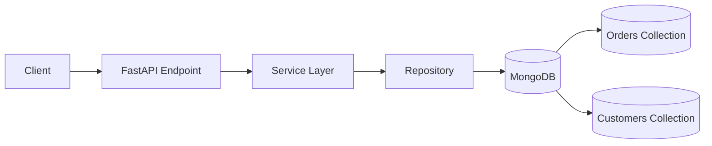
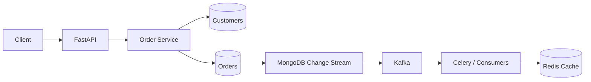

# 05- One-to-Many Relationships

## Overview

A one-to-many relationship exists when one parent entity is associated with multiple child entities.

Common examples include:

- Customer → Orders
- User → Addresses
- Organization → Projects
- Account → Transactions
- Blog Post → Comments
- Device → Telemetry Records

In MongoDB, one-to-many relationships are modeled primarily through:

- Embedded arrays of documents
- References from child documents to the parent
- Parent references
- Child references
- Hybrid models
- Controlled denormalization

The correct design depends primarily on **cardinality, access patterns, document growth, update frequency, ownership, and lifecycle**.

The most important modeling question is not:

> "How do I represent a foreign key?"

It is:

> "What data should be retrieved, updated, and owned together?"

MongoDB's document model makes embedding attractive for bounded one-to-many relationships, while references are generally more appropriate for large or unbounded relationships.

---

## One-to-Many Relationship Models

Consider:

```text
Customer
   │
   ├── Order
   ├── Order
   └── Order
```

There are several possible MongoDB designs.

### Embedded Children

```json
{
  "_id": "customer_1001",
  "name": "Customer A",
  "orders": [
    {
      "order_id": "order_001",
      "total": 1250,
      "status": "paid"
    },
    {
      "order_id": "order_002",
      "total": 850,
      "status": "pending"
    }
  ]
}
```

### Referenced Children

Customer:

```json
{
  "_id": "customer_1001",
  "name": "Customer A"
}
```

Orders:

```json
{
  "_id": "order_001",
  "customer_id": "customer_1001",
  "total": 1250,
  "status": "paid"
}
```

```json
{
  "_id": "order_002",
  "customer_id": "customer_1001",
  "total": 850,
  "status": "pending"
}
```

The second model is usually better for large or continuously growing collections such as orders.

---

## The Core Decision: Bounded vs Unbounded

The most important one-to-many modeling distinction is whether the number of children is bounded.

| Relationship | Typical Cardinality | Modeling Direction |
|---|---:|---|
| User → Preferences | Small, bounded | Embed |
| User → Addresses | Usually bounded | Embed or reference |
| Organization → Departments | Usually bounded | Embed or reference |
| Customer → Orders | Potentially unbounded | Reference |
| Post → Comments | Potentially unbounded | Reference |
| Device → Telemetry | Very large | Reference |
| Account → Transactions | Potentially unbounded | Reference |
| Order → Line Items | Usually bounded | Embed |

An array that grows indefinitely is usually a warning sign.

---

## Embedded One-to-Many Relationships

Embedding stores the children inside the parent document.

Example:

```json
{
  "_id": "order_1001",
  "customer": {
    "id": "customer_42",
    "name": "Customer A"
  },
  "items": [
    {
      "product_id": "product_101",
      "name": "Keyboard",
      "quantity": 1,
      "unit_price": 2500
    },
    {
      "product_id": "product_102",
      "name": "Mouse",
      "quantity": 2,
      "unit_price": 1200
    }
  ]
}
```

This is an excellent example of a bounded one-to-many relationship.

An order's line items are:

- owned by the order
- normally retrieved with the order
- normally created with the order
- rarely queried independently
- naturally part of the same transaction boundary

---

## When to Embed

Embedding is generally appropriate when:

- the child count is bounded
- the child is tightly owned by the parent
- children are normally read with the parent
- children are rarely queried independently
- child data has the same lifecycle
- atomic updates are useful
- the resulting document remains comfortably below MongoDB's document size limit

Typical examples:

```text
Order → Line Items
User → Preferences
Product → Small Set of Variants
Configuration → Configuration Sections
```

---

## Advantages of Embedding

### Single Read

The parent and children are returned in one query:

```javascript
db.orders.findOne({
  _id: "order_1001"
})
```

### Atomicity

A single document can be updated atomically.

For example:

```javascript
db.orders.updateOne(
  { _id: "order_1001" },
  {
    $push: {
      items: {
        product_id: "product_103",
        name: "USB Cable",
        quantity: 1,
        unit_price: 500
      }
    }
  }
)
```

### Data Locality

Related data is represented within one document, reducing application-side orchestration.

### Lower Query Complexity

The application does not need to resolve multiple child documents for ordinary parent reads.

---

## Limitations of Embedding

Embedding becomes problematic when:

- the child array can grow without a practical bound
- individual children are frequently updated
- children are independently queried
- children require independent indexes
- children have an independent lifecycle
- the parent document becomes large
- many concurrent writes target the same parent document

For example, this is risky:

```json
{
  "_id": "post_1001",
  "comments": [
    "... potentially millions of comments ..."
  ]
}
```

A blog post may logically own its comments, but ownership does not imply that all comments belong inside the same MongoDB document.

---

## Referenced One-to-Many Relationships

A referenced model stores each child as a separate document.

Parent:

```json
{
  "_id": "customer_1001",
  "name": "Customer A"
}
```

Children:

```json
{
  "_id": "order_1001",
  "customer_id": "customer_1001",
  "total": 1250,
  "status": "paid",
  "created_at": "2026-09-21T10:00:00Z"
}
```

```json
{
  "_id": "order_1002",
  "customer_id": "customer_1001",
  "total": 850,
  "status": "pending",
  "created_at": "2026-09-21T11:00:00Z"
}
```

The child points to the parent.

This is often the preferred design for high-cardinality relationships.

---

## When to Reference

Use references when:

- child cardinality is large or unbounded
- children are independently queried
- children have independent lifecycles
- children are frequently updated
- children need independent indexes
- child records are large
- children are independently paginated
- children are owned by another service
- the parent should remain small

Typical examples:

```text
Customer → Orders
Post → Comments
Account → Transactions
Device → Telemetry
Organization → Audit Events
```

---

## Child References vs Parent Arrays

There are two common reference patterns.

### Child References

Each child stores the parent ID:

```json
{
  "_id": "order_1001",
  "customer_id": "customer_1001"
}
```

### Parent Array of Child IDs

The parent stores child IDs:

```json
{
  "_id": "customer_1001",
  "order_ids": [
    "order_1001",
    "order_1002",
    "order_1003"
  ]
}
```

For large one-to-many relationships, child references are generally safer.

The parent array grows with every child and can eventually become:

- large
- expensive to update
- difficult to paginate
- a hot document
- a scalability bottleneck

---

## Why Child References Scale Better

Consider:

```text
Customer
  └── 10,000,000 Orders
```

A parent array would require:

```json
{
  "_id": "customer_1001",
  "order_ids": [
    "... millions of IDs ..."
  ]
}
```

The parent becomes a continuously growing document.

With child references:

```text
customers
    customer_1001

orders
    order_001 → customer_1001
    order_002 → customer_1001
    ...
```

The orders collection can grow independently.

Queries can use:

```javascript
db.orders.find({
  customer_id: "customer_1001"
})
```

with an index:

```javascript
db.orders.createIndex({
  customer_id: 1
})
```

---

## Parent-Referenced Pattern

The parent stores a reference to a child set indirectly through the child collection.

```text
customers
┌──────────────────────┐
│ _id: customer_1001   │
└──────────────────────┘

orders
┌────────────────────────────┐
│ _id: order_001             │
│ customer_id: customer_1001 │
└────────────────────────────┘
```

The child collection becomes the authoritative representation of the relationship.

This is usually the preferred pattern for large one-to-many relationships.

---

## Embedded vs Referenced One-to-Many

| Consideration | Embedded | Referenced |
|---|---|---|
| Bounded child count | Strong fit | Possible |
| Unbounded child count | Poor fit | Strong fit |
| Always read together | Strong fit | Weaker |
| Child pagination | Weaker | Strong fit |
| Independent child queries | Weaker | Strong fit |
| Independent child updates | Weaker | Strong fit |
| Atomic parent + children updates | Strong fit | May require transaction |
| Large child data | Weaker | Strong fit |
| Independent lifecycle | Weaker | Strong fit |
| Parent document growth | Risk | Minimal |
| N+1 risk | Low | Requires design |
| Independent indexing | Limited by parent document | Strong |
| High write concurrency | Can become hot | Usually better |
| Service ownership separation | Poor fit | Strong fit |

---

## Bounded One-to-Many Example: Order and Line Items

An order usually has a bounded number of line items.

```json
{
  "_id": "order_1001",
  "customer_id": "customer_1001",
  "status": "confirmed",
  "items": [
    {
      "product_id": "product_101",
      "name": "Keyboard",
      "quantity": 1,
      "unit_price": 2500
    },
    {
      "product_id": "product_102",
      "name": "Mouse",
      "quantity": 2,
      "unit_price": 1200
    }
  ],
  "total": 4900
}
```

This model provides an important architectural property:

> The order and its line items form one aggregate.

The order can be read and updated atomically.

---

## Unbounded One-to-Many Example: Customer and Orders

Embedding orders directly into the customer document is usually problematic.

Avoid:

```json
{
  "_id": "customer_1001",
  "orders": [
    "... potentially unbounded ..."
  ]
}
```

Prefer:

```json
{
  "_id": "order_1001",
  "customer_id": "customer_1001",
  "total": 4900,
  "status": "paid"
}
```

Then query:

```javascript
db.orders.find({
  customer_id: "customer_1001"
})
.sort({
  created_at: -1
})
.limit(50)
```

This supports pagination and independent indexing.

---

## Cardinality

Cardinality describes how many children can be associated with a parent.

Useful categories include:

| Cardinality | Example | Typical Model |
|---|---|---|
| Very small | User → Preferences | Embed |
| Small | User → Addresses | Embed/reference |
| Moderate and bounded | Order → Items | Embed |
| Large | Customer → Orders | Reference |
| Very large | Device → Events | Reference |
| Effectively unbounded | Account → Transactions | Reference |

Do not rely only on today's cardinality.

Ask:

> What is the maximum realistic cardinality over the lifetime of the system?

A relationship containing 20 records today may contain 200,000 records after several years.

---

## Document Growth

MongoDB documents have a maximum BSON document size.

More importantly, even well below that hard limit, large growing documents can create operational problems.

An ever-growing array can cause:

- larger reads
- larger writes
- increased network traffic
- memory pressure
- document relocation or storage amplification
- difficult pagination
- contention around frequently updated parent documents

Therefore:

> **Document size limits are a safety boundary, not a modeling target.**

---

## Hot Documents

A hot document is a document that receives a disproportionate amount of concurrent reads or writes.

Consider:

```json
{
  "_id": "account_1001",
  "transactions": [
    "... growing array ..."
  ]
}
```

If every transaction appends to this array, the account becomes a write hotspot.

Instead:

```json
{
  "_id": "transaction_9001",
  "account_id": "account_1001",
  "amount": 500,
  "created_at": "2026-09-21T10:00:00Z"
}
```

Each transaction is independently stored.

This distributes writes across multiple documents.

---

## Read-Heavy One-to-Many Models

Embedding is attractive when the application almost always reads the parent and its children together.

Example:

```text
Product
  └── variants
```

If every product page requires all variants and the variant count is small and bounded, embedding can eliminate additional queries.

The access pattern is:

```text
GET product
    ↓
Product + variants
```

rather than:

```text
GET product
    ↓
GET variants
```

---

## Write-Heavy One-to-Many Models

High-frequency child writes generally favor separate child documents.

Example:

```text
Device
  └── telemetry
```

Telemetry can arrive every few seconds or milliseconds.

Do not append every measurement to one device document.

Instead:

```json
{
  "_id": "event_9001",
  "device_id": "device_1001",
  "temperature": 72.5,
  "timestamp": "2026-09-21T10:00:00Z"
}
```

This allows the write workload to scale with the telemetry collection rather than repeatedly modifying one parent document.

---

## Pagination

Referenced one-to-many relationships naturally support pagination.

Avoid:

```javascript
db.customers.findOne({
  _id: "customer_1001"
})
```

when the customer contains thousands of embedded orders.

For referenced orders:

```javascript
db.orders.find({
  customer_id: "customer_1001"
})
.sort({
  created_at: -1,
  _id: -1
})
.limit(50)
```

For large datasets, prefer cursor-based or range pagination over large `skip()` values.

Example:

```javascript
db.orders.find({
  customer_id: "customer_1001",
  $or: [
    {
      created_at: {
        $lt: ISODate("2026-09-21T10:00:00Z")
      }
    },
    {
      created_at: ISODate("2026-09-21T10:00:00Z"),
      _id: {
        $lt: ObjectId("650000000000000000000001")
      }
    }
  ]
})
.sort({
  created_at: -1,
  _id: -1
})
.limit(50)
```

The exact pagination strategy should match the index and ordering requirements.

---

## Indexing One-to-Many Relationships

For child references:

```javascript
db.orders.createIndex({
  customer_id: 1,
  created_at: -1
})
```

This supports:

```javascript
db.orders.find({
  customer_id: "customer_1001"
})
.sort({
  created_at: -1
})
.limit(50)
```

This is an example of designing the index from the actual access pattern rather than indexing every field independently.

For a common query:

```text
customer_id equality
created_at sorting
```

the compound index can efficiently support both operations.

---

## Querying Referenced Children

Basic query:

```javascript
db.orders.find({
  customer_id: "customer_1001"
})
```

With projection:

```javascript
db.orders.find(
  {
    customer_id: "customer_1001"
  },
  {
    _id: 1,
    total: 1,
    status: 1,
    created_at: 1
  }
)
```

With sorting and pagination:

```javascript
db.orders.find({
  customer_id: "customer_1001"
})
.sort({
  created_at: -1
})
.limit(50)
```

The query should normally be backed by an appropriate compound index.

---

## Aggregation with Referenced Children

MongoDB can join parent and child collections using `$lookup`.

Example:

```javascript
db.customers.aggregate([
  {
    $match: {
      _id: "customer_1001"
    }
  },
  {
    $lookup: {
      from: "orders",
      localField: "_id",
      foreignField: "customer_id",
      as: "orders"
    }
  }
])
```

This is useful when a bounded result set is required.

However, joining a customer to millions of orders into one response is not a good API or data-modeling strategy.

Use `$lookup` deliberately and control:

- filtering
- projection
- sorting
- limiting
- memory consumption

---

## Filter Before `$lookup`

A better pattern is to restrict the child records inside the lookup.

```javascript
db.customers.aggregate([
  {
    $match: {
      _id: "customer_1001"
    }
  },
  {
    $lookup: {
      from: "orders",
      let: {
        customerId: "$_id"
      },
      pipeline: [
        {
          $match: {
            $expr: {
              $eq: ["$customer_id", "$$customerId"]
            }
          }
        },
        {
          $sort: {
            created_at: -1
          }
        },
        {
          $limit: 50
        },
        {
          $project: {
            _id: 1,
            total: 1,
            status: 1,
            created_at: 1
          }
        }
      ],
      as: "recent_orders"
    }
  }
])
```

This is significantly more appropriate than materializing the entire child collection.

---

## One-to-Many with Python

A repository for referenced children can expose explicit access patterns.

```python
from pymongo.collection import Collection


class OrderRepository:
    def __init__(self, orders: Collection) -> None:
        self.orders = orders

    def list_for_customer(
        self,
        customer_id: str,
        limit: int = 50,
    ) -> list[dict]:
        cursor = (
            self.orders
            .find(
                {"customer_id": customer_id},
                {
                    "_id": 1,
                    "total": 1,
                    "status": 1,
                    "created_at": 1,
                },
            )
            .sort(
                [
                    ("created_at", -1),
                    ("_id", -1),
                ]
            )
            .limit(limit)
        )

        return list(cursor)
```

The repository hides MongoDB-specific persistence details from the service layer.

---

## Avoiding N+1 Queries in Python

Suppose an API returns 100 customers and each customer needs order statistics.

Avoid:

```text
1 query → customers
100 queries → orders
```

Instead, aggregate the data:

```javascript
db.orders.aggregate([
  {
    $match: {
      customer_id: {
        $in: [
          "customer_1001",
          "customer_1002",
          "customer_1003"
        ]
      }
    }
  },
  {
    $group: {
      _id: "$customer_id",
      order_count: {
        $sum: 1
      },
      total_value: {
        $sum: "$total"
      }
    }
  }
])
```

The application can then merge the aggregated results with the customer response.

---

## FastAPI Architecture

A typical FastAPI architecture can separate API, service, and persistence concerns:



Example endpoint:

```python
from fastapi import APIRouter, Depends

router = APIRouter()


@router.get("/customers/{customer_id}/orders")
def list_orders(
    customer_id: str,
    repository: OrderRepository = Depends(get_order_repository),
):
    return repository.list_for_customer(customer_id)
```

The endpoint does not need to know whether orders are embedded or referenced.

---

## Django Integration

With Django and MongoDB, avoid assuming that a MongoDB one-to-many relationship behaves like:

```python
ForeignKey(...)
```

in a relational Django model.

When using PyMongo or an ODM, explicitly model:

- parent-child ownership
- cardinality
- indexing
- lifecycle
- deletion behavior
- pagination
- consistency

For high-volume child collections, a repository/service layer is usually clearer than trying to force relational ORM semantics onto MongoDB.

---

## Denormalization and Controlled Duplication

One-to-many relationships often benefit from controlled duplication.

Suppose an order references:

```json
{
  "product_id": "product_101"
}
```

The application may also store:

```json
{
  "product_id": "product_101",
  "product_name": "Mechanical Keyboard",
  "unit_price": 2500
}
```

This is useful when historical correctness matters.

If the product is renamed later, the order still contains the original product name.

The duplicated data is a deliberate snapshot rather than accidental denormalization.

---

## Parent Summary Fields

A referenced one-to-many relationship can still store aggregate information in the parent.

Example:

```json
{
  "_id": "customer_1001",
  "name": "Customer A",
  "order_count": 1250,
  "lifetime_value": 485000
}
```

Orders remain separate:

```text
orders
```

This allows common dashboards to read summary information without counting all orders on every request.

The trade-off is consistency.

The application must ensure summary fields are updated correctly.

Possible mechanisms include:

- synchronous updates
- transactions
- background jobs
- Kafka events
- change streams
- periodic reconciliation

---

## Bucketed One-to-Many Data

Very large event streams may benefit from bucket-style modeling.

Instead of:

```text
device → millions of individual events
```

a system can group a bounded time window:

```json
{
  "_id": "device_1001_2026_09_21_10",
  "device_id": "device_1001",
  "start_time": "2026-09-21T10:00:00Z",
  "events": [
    {
      "timestamp": "2026-09-21T10:00:01Z",
      "temperature": 72.1
    },
    {
      "timestamp": "2026-09-21T10:00:02Z",
      "temperature": 72.3
    }
  ]
}
```

The bucket must remain bounded.

This pattern can reduce document count while avoiding an unbounded parent array.

For time-series workloads, evaluate MongoDB's native time-series collections before designing a custom bucket model.

---

## One-to-Many and Transactions

Embedding provides single-document atomicity.

Referenced children may require transactions when multiple documents must change atomically.

Example:

```text
Customer
   +
Account Balance
   +
Transaction
```

If creating a transaction must atomically modify account state and transaction state, a multi-document transaction may be appropriate.

However, for high-throughput transaction systems, blindly performing a transaction for every child write can introduce unnecessary overhead.

Consider whether the model can instead use:

- immutable transaction documents
- derived balances
- event-driven updates
- idempotent processing
- periodic reconciliation

The correct design depends on the business invariant.

---

## Deletion Strategies

One-to-many relationships require explicit deletion semantics.

### Cascade Delete

Deleting a parent deletes all children.

```text
Delete Customer
    ↓
Delete Orders
```

This can be dangerous for large child collections.

### Soft Delete

Mark the parent as deleted:

```json
{
  "_id": "customer_1001",
  "deleted_at": "2026-09-21T12:00:00Z"
}
```

Child queries can exclude deleted parents.

### Retain Children

Sometimes children are historical records and must remain after parent deletion.

Examples:

- financial transactions
- audit events
- invoices
- compliance records

Do not automatically cascade-delete historical data.

---

## Orphaned Children

Referenced one-to-many relationships can create orphaned children.

Example:

```text
orders
└── customer_id = customer_1001

customers
└── customer_1001 deleted
```

The order still exists.

This may be intentional or incorrect depending on the domain.

Define the policy explicitly:

| Child Type | Parent Deletion |
|---|---|
| Temporary configuration | Delete |
| User preferences | Delete |
| Financial transaction | Usually retain |
| Audit event | Usually retain |
| Invoice | Usually retain |
| Operational telemetry | Domain-dependent |

For large collections, reconciliation jobs can detect invalid references.

---

## Schema Validation

Embedded children can be validated as part of the parent document.

Example:

```javascript
db.createCollection("orders", {
  validator: {
    $jsonSchema: {
      bsonType: "object",
      required: ["customer_id", "items"],
      properties: {
        customer_id: {
          bsonType: "string"
        },
        items: {
          bsonType: "array",
          items: {
            bsonType: "object",
            required: [
              "product_id",
              "quantity",
              "unit_price"
            ],
            properties: {
              product_id: {
                bsonType: "string"
              },
              quantity: {
                bsonType: "int",
                minimum: 1
              },
              unit_price: {
                bsonType: "number",
                minimum: 0
              }
            }
          }
        }
      }
    }
  }
})
```

Referenced child collections can have their own independent validation rules.

This is another advantage of separate collections when the child has an independently evolving schema.

---

## Security Considerations

One-to-many relationships can expose more data than intended.

For example:

```text
GET /customers/{id}
```

should not automatically return thousands of orders.

Prefer:

```text
GET /customers/{id}
GET /customers/{id}/orders?limit=50
```

This gives the API an explicit boundary.

For sensitive child records:

- apply authorization at the child level
- avoid exposing internal identifiers unnecessarily
- use projections
- enforce tenant isolation
- avoid unrestricted `$lookup`
- validate parent ownership before querying children

For multi-tenant systems, a child query should generally include the tenant boundary:

```javascript
db.orders.find({
  tenant_id: "tenant_42",
  customer_id: "customer_1001"
})
```

The tenant condition should not rely solely on an API-layer assumption.

---

## Multi-Tenant Indexing

A multi-tenant child collection commonly uses:

```json
{
  "tenant_id": "tenant_42",
  "customer_id": "customer_1001"
}
```

An index can reflect the actual query:

```javascript
db.orders.createIndex({
  tenant_id: 1,
  customer_id: 1,
  created_at: -1
})
```

This can support:

```javascript
db.orders.find({
  tenant_id: "tenant_42",
  customer_id: "customer_1001"
})
.sort({
  created_at: -1
})
.limit(50)
```

Tenant isolation should be part of the data-access design, not added as an afterthought.

---

## Performance Considerations

### Embedded Model

Advantages:

- fewer queries
- strong locality
- atomic updates
- simpler read paths

Risks:

- document growth
- large payloads
- hot documents
- difficult pagination
- parent write contention

### Referenced Model

Advantages:

- independent scaling
- independent pagination
- independent indexing
- smaller parent documents
- better support for high cardinality

Risks:

- additional queries
- N+1 query risk
- application-side consistency
- more complex deletion
- possible transaction requirements

---

## Query Performance Diagnosis

For a referenced child query:

```javascript
db.orders
  .find({
    customer_id: "customer_1001"
  })
  .sort({
    created_at: -1
  })
  .limit(50)
  .explain("executionStats")
```

Look at:

```text
nReturned
totalKeysExamined
totalDocsExamined
executionTimeMillis
```

A healthy query should generally avoid scanning a large fraction of the collection to return a small result set.

For the query above, a likely index is:

```javascript
db.orders.createIndex({
  customer_id: 1,
  created_at: -1
})
```

The actual effectiveness should be validated using `explain()` rather than assumed.

---

## Performance Before and After

### Before

```javascript
db.orders.find({
  customer_id: "customer_1001"
})
.sort({
  created_at: -1
})
.limit(50)
.explain("executionStats")
```

Potential symptoms:

```text
COLLSCAN
totalDocsExamined: 5000000
nReturned: 50
```

### After

```javascript
db.orders.createIndex({
  customer_id: 1,
  created_at: -1
})
```

The same query can use an index:

```text
IXSCAN
FETCH
LIMIT
```

with substantially fewer documents examined.

The exact performance improvement depends on data distribution, selectivity, working set, hardware, and query shape.

---

## Change Streams and One-to-Many Relationships

Change streams can be useful when parent and child collections have independent workflows.

Example:

```text
orders
   ↓
Change Stream
   ↓
Kafka / Worker
   ↓
Analytics / Search / Notifications
```

A child event might contain:

```json
{
  "order_id": "order_1001",
  "customer_id": "customer_1001",
  "event_type": "OrderCreated"
}
```

Consumers should use the parent identifier as part of their event-processing logic and ensure operations are idempotent.

---

## Sharding Considerations

Large one-to-many collections are common candidates for sharding.

For:

```text
customers
orders
```

the order collection may use a shard key involving:

```text
customer_id
```

when customer-scoped queries dominate.

However, shard-key selection must consider:

- cardinality
- frequency
- write distribution
- query targeting
- tenant distribution
- monotonically increasing values
- hotspot risk

A shard key that perfectly targets customer queries but concentrates a huge tenant or customer workload on one shard can still create a hotspot.

---

## Production Architecture Example

A scalable order architecture might look like:



The core relationship remains:

```text
Customer
   │
   └── Order collection
          ├── order_001
          ├── order_002
          └── order_003
```

while asynchronous systems handle:

- notifications
- analytics
- search indexing
- cache invalidation
- downstream integrations

---

## Operational Considerations

Monitor one-to-many collections for:

- collection growth
- document size
- index size
- index usage
- query latency
- replication lag
- connection utilization
- storage growth
- slow queries
- hot documents
- failed background jobs

Useful MongoDB inspection commands include:

```javascript
db.orders.stats()
```

```javascript
db.orders.getIndexes()
```

```javascript
db.orders.aggregate([
  {
    $indexStats: {}
  }
])
```

For referenced relationships, operational monitoring should also detect:

- orphaned children
- missing parents
- unexpected cardinality
- duplicate relationships
- abnormal child growth per parent

---

## Backup and Recovery Implications

Embedded data is restored as part of its parent document.

Referenced data exists separately.

Therefore, a restore must preserve the consistency of:

```text
customers
+
orders
```

For production systems, backup strategy should be validated against the relationship's recovery requirements.

Test scenarios such as:

- accidental parent deletion
- accidental child deletion
- partial application failure
- corrupted migration
- incorrect bulk update
- cross-collection inconsistency

A backup that exists but has never been restored is not a sufficiently validated recovery strategy.

---

## Common Mistakes

### Embedding an Unbounded Array

Bad:

```json
{
  "_id": "customer_1001",
  "orders": ["... millions of records ..."]
}
```

Why it fails:

- document growth
- expensive reads
- difficult pagination
- write contention
- scalability limitations

Use child references instead.

### Storing Child IDs in a Growing Parent Array

This:

```json
{
  "_id": "customer_1001",
  "order_ids": [
    "order_1",
    "order_2",
    "order_3"
  ]
}
```

looks simple but becomes problematic when the array grows continuously.

### Ignoring Child Cardinality Growth

Designing around today's 20 children without considering future growth is a common modeling error.

### Using `$lookup` as a Default Join Strategy

`$lookup` is useful, but it should not be used to recreate relational joins indiscriminately.

Design documents around common access patterns first.

### Creating N+1 Queries

Referenced children can easily produce:

```text
1 parent query
+
N child queries
```

Use batching, aggregation, or purpose-built repository methods.

### Forgetting Child Indexes

A query such as:

```javascript
db.orders.find({
  customer_id: "customer_1001"
})
```

needs an appropriate index when the collection becomes large.

### Cascading Deletes Without Analysis

Deleting a parent with millions of children can become an expensive operational event.

### Mixing Ownership Boundaries

A child collection owned by another service should not be directly modified by the parent service merely because the documents are related.

---

## Interview Traps

### "One-to-many means embed the children."

Not necessarily.

Bounded one-to-many relationships are often good embedding candidates. Large or unbounded relationships generally favor references.

### "Always store child IDs in the parent."

This creates an unbounded parent document for large relationships.

### "MongoDB does not support relationships."

MongoDB supports relationship modeling through embedding, references, aggregation, and application-level coordination.

It simply does not require relational foreign keys as the primary modeling mechanism.

### "A `$lookup` makes MongoDB relational."

No.

`$lookup` provides database-side data composition, but MongoDB's document model remains fundamentally different from a relational schema.

### "Separate child documents always require transactions."

No.

Many referenced one-to-many relationships are eventually consistent or independently managed and do not require transactions.

### "Embedding is always faster."

No.

Embedding can reduce round trips but can create large documents, hot documents, and inefficient payloads.

---

## Design Checklist

Before implementing a one-to-many relationship, answer:

### Cardinality

- How many children can a parent have today?
- What is the realistic maximum?
- Is growth bounded?

### Access Pattern

- Are children normally read with the parent?
- Are children independently queried?
- Are children paginated?
- Are children sorted or filtered?

### Lifecycle

- Are children created with the parent?
- Are they deleted with the parent?
- Can children outlive the parent?

### Update Pattern

- Are children frequently updated?
- Are multiple clients updating children concurrently?
- Can updates create a hot parent document?

### Size

- How large is each child?
- How large can the complete embedded document become?
- Are children frequently returned over the network?

### Consistency

- Must parent and child changes be atomic?
- Is eventual consistency acceptable?
- Are transactions actually required?

### Ownership

- Does one service own both entities?
- Are the children managed by another service?

### Indexing

- How are children queried?
- What fields are used for filtering?
- What fields are used for sorting?
- Does the index support pagination?

### Operations

- How are orphaned children detected?
- How are parent deletions handled?
- How are large migrations performed?
- How will backup and restore preserve consistency?

---

## Practical Decision Tree

```text
Can the number of children grow without a practical bound?
        │
        ├── Yes ──→ Reference children
        │
        └── No
             │
             ▼
Are children normally read with the parent?
             │
             ├── No ──→ Reference children
             │
             └── Yes
                  │
                  ▼
Are children independently updated or queried?
                  │
                  ├── Yes ──→ Consider references
                  │
                  └── No
                       │
                       ▼
Is the combined document comfortably bounded?
                       │
                       ├── Yes ──→ Embed
                       │
                       └── No ──→ Reference
```

The final decision should be validated against production access patterns rather than applied as a rigid rule.

## Key Takeaways

- **Bounded, tightly coupled one-to-many data is often best embedded; large or unbounded relationships should generally use child references.**
- **Avoid unbounded arrays and growing parent documents because they create document-size, pagination, write-contention, and scalability problems.**
- **For referenced children, design indexes around real access patterns such as parent filtering, sorting, and cursor-based pagination.**
- **Treat cardinality, lifecycle, ownership, update frequency, and API access patterns as first-class modeling decisions rather than relying only on relationship type.**
- **Production one-to-many designs must explicitly address N+1 queries, orphaned children, deletion semantics, consistency, security, monitoring, and recovery.**