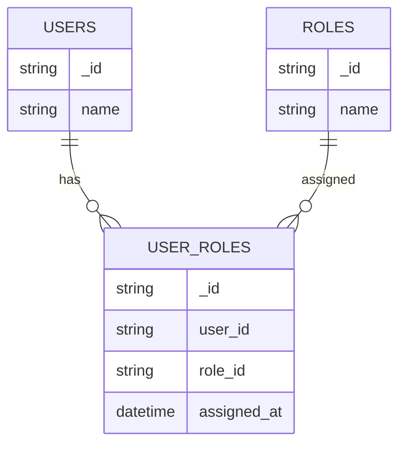
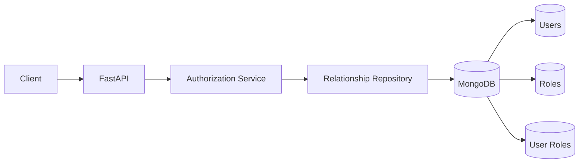
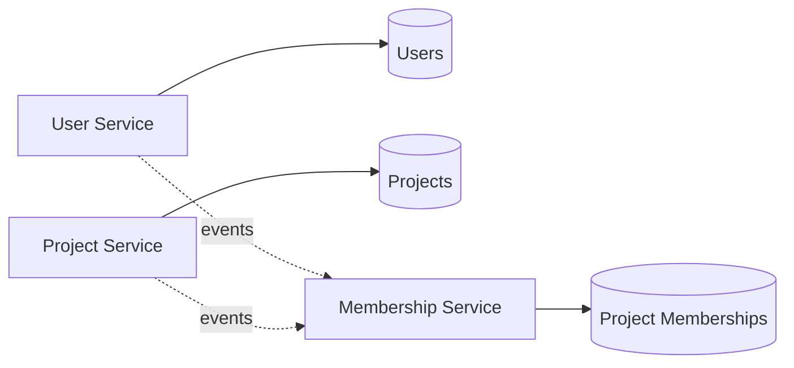
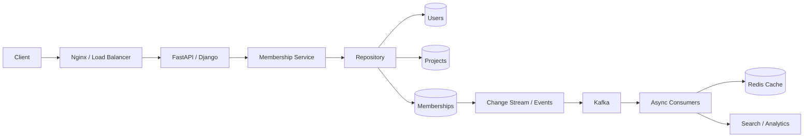

# 06- Many-to-Many Relationships

## Overview

A many-to-many relationship exists when multiple documents from one entity can be associated with multiple documents from another entity.

Typical examples include:

- Users ↔ Roles
- Users ↔ Groups
- Products ↔ Categories
- Students ↔ Courses
- Posts ↔ Tags
- Orders ↔ Products
- Employees ↔ Projects

Relational databases commonly model many-to-many relationships with a junction or association table. MongoDB does not require a fixed relational join-table model. Instead, many-to-many relationships can be represented through:

- Arrays of embedded documents
- Arrays of referenced IDs
- References stored on one side
- Dedicated association collections
- Hybrid models
- Controlled denormalization

The correct design depends on cardinality, query direction, update frequency, ownership, lifecycle, consistency requirements, and expected growth.

The key design question is:

> What access patterns must the database support efficiently, and where should the relationship itself be owned?

For small, bounded relationships, arrays can be appropriate. For large, independently queried relationships, a dedicated association collection is usually more scalable.

---

## What Makes a Relationship Many-to-Many

Consider:

```text
User A ─────┬──── Role Admin
            └──── Role Developer

User B ─────┬──── Role Developer
            └──── Role Reviewer

User C ─────┬──── Role Admin
            └──── Role Reviewer
```

Each user can have multiple roles, and each role can belong to multiple users.

The relationship is therefore:

```text
Users ↔ Roles
```

The same pattern appears in:

```text
Products ↔ Categories
Students ↔ Courses
Posts ↔ Tags
Employees ↔ Projects
Orders ↔ Products
```

MongoDB provides several ways to represent this relationship.

---

## Modeling Strategies

The main strategies are:

| Strategy | Best Fit | Main Risk |
|---|---|---|
| Embed related data | Small, bounded relationships | Document growth and duplication |
| Array of IDs | Small/moderate bounded relationships | Large arrays and update contention |
| Reference from one side | Asymmetric access patterns | Reverse lookups can become expensive |
| Association collection | Large/high-cardinality relationships | Additional query/application complexity |
| Hybrid model | Read-heavy production systems | Denormalization consistency |
| Controlled duplication | Stable frequently-read attributes | Synchronization complexity |

There is no universal many-to-many schema.

The model should be derived from the queries the application must execute.

---

## Embedded Many-to-Many Relationships

Embedding can work when both sides of the relationship are small and bounded.

For example:

```json
{
  "_id": "user_1001",
  "name": "Alice",
  "roles": [
    {
      "id": "role_admin",
      "name": "Admin"
    },
    {
      "id": "role_developer",
      "name": "Developer"
    }
  ]
}
```

This is useful when:

- users have only a small number of roles
- roles are rarely changed
- role information is small
- user reads normally require role information
- reverse role → users queries are uncommon

However, embedding the full user list inside every role would create duplication and potentially large documents.

---

## Array of References

A common MongoDB model stores related IDs in an array.

```json
{
  "_id": "user_1001",
  "name": "Alice",
  "role_ids": [
    "role_admin",
    "role_developer"
  ]
}
```

Roles remain separate:

```json
{
  "_id": "role_admin",
  "name": "Admin"
}
```

```json
{
  "_id": "role_developer",
  "name": "Developer"
}
```

This avoids duplicating the complete role document.

The application can resolve roles when required.

---

## Querying Array References

Find a user with a particular role:

```javascript
db.users.find({
  role_ids: "role_developer"
})
```

MongoDB can match an array element without requiring `$elemMatch` for a simple scalar array.

Find users having any of several roles:

```javascript
db.users.find({
  role_ids: {
    $in: [
      "role_admin",
      "role_developer"
    ]
  }
})
```

Find users having all specified roles:

```javascript
db.users.find({
  role_ids: {
    $all: [
      "role_admin",
      "role_developer"
    ]
  }
})
```

An index can support these queries:

```javascript
db.users.createIndex({
  role_ids: 1
})
```

This becomes a multikey index because `role_ids` is an array.

---

## The Reverse Lookup Problem

Suppose the primary model is:

```json
{
  "_id": "user_1001",
  "role_ids": [
    "role_admin",
    "role_developer"
  ]
}
```

Finding roles for a user is straightforward:

```javascript
db.users.findOne({
  _id: "user_1001"
})
```

Finding users for a role requires querying the array:

```javascript
db.users.find({
  role_ids: "role_developer"
})
```

That can still be efficient with an index.

However, if the relationship becomes very large, arrays on one side can become difficult to manage.

---

## Dedicated Association Collection

For large many-to-many relationships, a dedicated collection is often the most flexible design.

Consider:

```text
users
roles
user_roles
```

Example user:

```json
{
  "_id": "user_1001",
  "name": "Alice"
}
```

Example role:

```json
{
  "_id": "role_developer",
  "name": "Developer"
}
```

Association document:

```json
{
  "_id": "user_1001_role_developer",
  "user_id": "user_1001",
  "role_id": "role_developer",
  "assigned_at": "2026-09-21T10:00:00Z"
}
```

This is conceptually similar to a relational junction table, but the association is represented as a MongoDB document.

---

## Why Use an Association Collection

A dedicated association collection is particularly useful when:

- both sides have high cardinality
- relationships are independently queried in both directions
- relationships have attributes
- relationships have their own lifecycle
- relationships are frequently added or removed
- relationship history matters
- relationship records need independent indexing
- the relationship itself is an important business entity

For example:

```text
Employee ↔ Project
```

may have relationship attributes:

```json
{
  "employee_id": "employee_1001",
  "project_id": "project_5001",
  "role": "Tech Lead",
  "allocation_percent": 75,
  "assigned_at": "2026-09-01T00:00:00Z"
}
```

This information does not naturally belong entirely to either the employee or project.

---

## Association Collection as a First-Class Entity

Once the relationship contains meaningful attributes, treat it as its own entity.



This model provides a clear ownership boundary:

```text
User
  │
  └── UserRole ── Role
```

The association document can then have its own:

- indexes
- validation
- timestamps
- status
- metadata
- audit information
- lifecycle

---

## Relationship Attributes

A relationship collection becomes particularly valuable when the relationship itself contains data.

Examples:

### Employee ↔ Project

```json
{
  "employee_id": "employee_1001",
  "project_id": "project_5001",
  "role": "Backend Lead",
  "allocation_percent": 80,
  "assigned_at": "2026-09-01T00:00:00Z"
}
```

### Student ↔ Course

```json
{
  "student_id": "student_1001",
  "course_id": "course_2001",
  "enrolled_at": "2026-09-01T00:00:00Z",
  "grade": "A"
}
```

### User ↔ Organization

```json
{
  "user_id": "user_1001",
  "organization_id": "org_1001",
  "membership_role": "admin",
  "status": "active"
}
```

In these cases, the relationship is more than an ID connection.

---

## Enforcing Uniqueness

A relationship should often be unique.

For example, a user should not have the same role assigned twice.

Create a compound unique index:

```javascript
db.user_roles.createIndex(
  {
    user_id: 1,
    role_id: 1
  },
  {
    unique: true
  }
)
```

This enforces:

```text
(user_1001, role_developer)
```

as a unique relationship.

The database should enforce invariants that must hold regardless of application behavior.

---

## Supporting Both Query Directions

A many-to-many association collection usually requires queries in both directions.

### Find Roles for a User

```javascript
db.user_roles.find({
  user_id: "user_1001"
})
```

Index:

```javascript
db.user_roles.createIndex({
  user_id: 1,
  role_id: 1
})
```

### Find Users for a Role

```javascript
db.user_roles.find({
  role_id: "role_developer"
})
```

Index:

```javascript
db.user_roles.createIndex({
  role_id: 1,
  user_id: 1
})
```

The second index is not automatically unnecessary just because the first compound index exists.

Compound index prefixes matter.

---

## Bidirectional Index Design

For an association collection:

```text
user_roles
```

a common indexing strategy is:

```javascript
db.user_roles.createIndex({
  user_id: 1,
  role_id: 1
})

db.user_roles.createIndex({
  role_id: 1,
  user_id: 1
})
```

The first supports:

```text
user → roles
```

The second supports:

```text
role → users
```

The correct indexes depend on actual query patterns and result ordering.

Each additional index also introduces:

- storage overhead
- write overhead
- maintenance cost
- memory pressure

Do not create indexes without measuring their value.

---

## Many-to-Many Access Patterns

Before selecting a schema, document the actual operations.

Example:

| Access Pattern | Frequency | Important |
|---|---:|---|
| Get user's roles | Very high | Yes |
| Check whether user has role | Very high | Yes |
| Get users in role | High | Yes |
| Assign role | Medium | Yes |
| Remove role | Medium | Yes |
| List relationship history | Low | Maybe |
| Search users by role + tenant | High | Yes |

The schema and indexes should be designed around these operations.

---

## Checking Relationship Membership

One of the most common operations is:

```text
Does user X have role Y?
```

With an association collection:

```javascript
db.user_roles.findOne({
  user_id: "user_1001",
  role_id: "role_developer"
})
```

The compound unique index:

```javascript
{
  user_id: 1,
  role_id: 1
}
```

makes this an efficient point lookup.

For authorization checks, this pattern is often preferable to loading the entire user document and scanning a large role array.

---

## Authorization Example

Consider:

```text
GET /projects/5001
```

The service may need to determine:

```text
Does user_1001 have access to project_5001?
```

An association collection can model:

```json
{
  "user_id": "user_1001",
  "project_id": "project_5001",
  "role": "editor"
}
```

Then:

```javascript
db.project_memberships.findOne({
  user_id: "user_1001",
  project_id: "project_5001",
  status: "active"
})
```

A partial index can be useful when inactive relationships are retained:

```javascript
db.project_memberships.createIndex(
  {
    user_id: 1,
    project_id: 1
  },
  {
    partialFilterExpression: {
      status: "active"
    }
  }
)
```

This is useful when historical membership records must remain available but authorization checks only care about active relationships.

---

## Tenant-Aware Many-to-Many Relationships

Multi-tenant systems should include tenant boundaries explicitly.

Example:

```json
{
  "tenant_id": "tenant_42",
  "user_id": "user_1001",
  "role_id": "role_developer"
}
```

A common index is:

```javascript
db.user_roles.createIndex(
  {
    tenant_id: 1,
    user_id: 1,
    role_id: 1
  },
  {
    unique: true
  }
)
```

This prevents cross-tenant ambiguity and makes tenant-scoped queries efficient.

The exact index should match the application's query patterns.

---

## Many-to-Many with Large Cardinality

Consider:

```text
Users:      10 million
Products:   1 million
Relationships: billions
```

Neither of these designs is appropriate:

```json
{
  "user_id": "user_1",
  "product_ids": [
    "... enormous array ..."
  ]
}
```

or:

```json
{
  "product_id": "product_1",
  "user_ids": [
    "... enormous array ..."
  ]
}
```

Instead:

```text
user_product_relationships
```

contains individual documents:

```json
{
  "user_id": "user_1",
  "product_id": "product_1"
}
```

This allows the relationship collection to scale independently.

---

## Large Relationship Collections

For very large association collections, consider:

- shard-key design
- compound indexes
- write distribution
- cardinality
- tenant distribution
- relationship lifecycle
- archival strategy
- storage growth
- query targeting

The relationship collection may become one of the largest collections in the system.

Do not treat it as a small metadata collection merely because each individual document is small.

---

## Many-to-Many with Sharding

Suppose:

```text
user_product_relationships
```

is extremely large and the dominant query is:

```text
Get products for user
```

A shard-key candidate may involve:

```text
user_id
```

However, shard-key selection must consider both:

```text
Get products for user
```

and:

```text
Get users for product
```

A shard key that optimizes one direction can make the reverse direction scatter across shards.

Potential approaches include:

- choosing a compound shard key
- accepting scatter-gather for infrequent queries
- maintaining a second materialized representation
- changing the API access pattern
- using denormalized read models

Sharding should be driven by actual workload distribution rather than theoretical symmetry.

---

## Controlled Denormalization

Many-to-many relationships often benefit from duplicating stable, frequently accessed data.

Example association:

```json
{
  "user_id": "user_1001",
  "role_id": "role_developer",
  "role_name": "Developer"
}
```

This avoids an additional role lookup when rendering the relationship.

However, `role_name` is now duplicated.

If the role changes from:

```text
Developer
```

to:

```text
Senior Developer
```

the duplicated value must be updated.

Use duplication when the read benefit justifies the consistency cost.

---

## Snapshot Data

Duplication can also intentionally represent historical state.

For example:

```json
{
  "student_id": "student_1001",
  "course_id": "course_2001",
  "course_name_snapshot": "Distributed Systems",
  "enrolled_at": "2026-09-01T00:00:00Z"
}
```

If the course is renamed later, historical enrollment records can retain the original name.

This is not accidental duplication.

It is a deliberate snapshot.

---

## Aggregation with `$lookup`

Suppose the application needs:

```text
User
  +
Roles
```

An aggregation can join the association collection to the roles collection.

```javascript
db.user_roles.aggregate([
  {
    $match: {
      user_id: "user_1001"
    }
  },
  {
    $lookup: {
      from: "roles",
      localField: "role_id",
      foreignField: "_id",
      as: "role"
    }
  },
  {
    $unwind: "$role"
  },
  {
    $project: {
      _id: 0,
      role_id: 1,
      role_name: "$role.name"
    }
  }
])
```

The association collection is filtered first so that the join processes only relevant relationships.

---

## Avoiding Unbounded `$lookup`

This is dangerous:

```javascript
db.users.aggregate([
  {
    $lookup: {
      from: "user_roles",
      localField: "_id",
      foreignField: "user_id",
      as: "roles"
    }
  }
])
```

when the query returns thousands or millions of users.

It can produce very large intermediate results.

Prefer:

- filtering the parent set
- filtering association records
- projecting only required fields
- applying limits where appropriate
- designing APIs around explicit pagination

---

## Pagination

Many-to-many relationships frequently require pagination.

For:

```text
User → Products
```

avoid loading all relationships:

```javascript
db.user_products.find({
  user_id: "user_1001"
})
```

without a limit.

Prefer:

```javascript
db.user_products.find({
  user_id: "user_1001"
})
.sort({
  created_at: -1,
  _id: -1
})
.limit(50)
```

For large datasets, cursor or range pagination is generally preferable to large `skip()` values.

An index can support the access pattern:

```javascript
db.user_products.createIndex({
  user_id: 1,
  created_at: -1,
  _id: -1
})
```

---

## Relationship Lifecycle

A relationship may have its own lifecycle.

Example:

```text
pending
   ↓
active
   ↓
suspended
   ↓
removed
```

Representing the relationship as a document allows explicit state:

```json
{
  "_id": "membership_1001",
  "user_id": "user_1001",
  "organization_id": "org_1001",
  "status": "active",
  "assigned_at": "2026-09-01T00:00:00Z",
  "updated_at": "2026-09-21T10:00:00Z"
}
```

This is difficult to represent cleanly using only an array of IDs.

---

## Soft Deletion

Instead of removing an association:

```javascript
db.user_roles.deleteOne({
  user_id: "user_1001",
  role_id: "role_developer"
})
```

a system may retain historical data:

```json
{
  "user_id": "user_1001",
  "role_id": "role_developer",
  "status": "revoked",
  "revoked_at": "2026-09-21T12:00:00Z"
}
```

Active queries can filter:

```javascript
db.user_roles.find({
  user_id: "user_1001",
  status: "active"
})
```

A partial index can optimize this pattern.

---

## Preventing Duplicate Relationships

Application checks alone are insufficient:

```python
if not relationship_exists():
    create_relationship()
```

Two concurrent requests can both observe that the relationship does not exist.

Use a unique database constraint:

```javascript
db.user_roles.createIndex(
  {
    user_id: 1,
    role_id: 1
  },
  {
    unique: true
  }
)
```

The application should then handle duplicate-key errors correctly.

This is an important concurrency principle:

> Enforce invariants at the database boundary whenever possible.

---

## Upsert for Idempotent Relationship Creation

For idempotent assignment:

```javascript
db.user_roles.updateOne(
  {
    user_id: "user_1001",
    role_id: "role_developer"
  },
  {
    $setOnInsert: {
      assigned_at: new Date()
    },
    $set: {
      status: "active"
    }
  },
  {
    upsert: true
  }
)
```

This can simplify repeated requests such as:

```text
POST /users/1001/roles/developer
```

The API can safely retry the operation without creating duplicate relationship documents, assuming the schema and indexes enforce the intended invariant.

---

## Transactions

A many-to-many relationship does not automatically require a transaction.

For example, adding:

```text
User → Role
```

may only require creating one association document.

A transaction becomes more relevant when multiple invariants must change atomically.

Example:

```text
Create membership
+
Update organization member count
+
Create audit record
```

If all three operations must be atomic, a transaction may be justified.

However, consider whether the derived count can be updated asynchronously instead.

---

## Relationship Counters

A parent may store a count:

```json
{
  "_id": "project_5001",
  "name": "Payments Platform",
  "member_count": 42
}
```

The actual relationships remain in:

```text
project_memberships
```

This can make common reads fast.

But counters introduce consistency concerns.

A production system should define how counters are maintained:

- transactionally
- synchronously
- asynchronously
- periodically reconciled

Never assume a derived counter is automatically correct.

---

## Python Repository Pattern

A repository can encapsulate relationship operations.

```python
from pymongo.collection import Collection
from pymongo.errors import DuplicateKeyError


class UserRoleRepository:
    def __init__(self, collection: Collection) -> None:
        self.collection = collection

    def assign_role(
        self,
        user_id: str,
        role_id: str,
    ) -> bool:
        try:
            self.collection.insert_one(
                {
                    "user_id": user_id,
                    "role_id": role_id,
                }
            )
            return True
        except DuplicateKeyError:
            return False

    def has_role(
        self,
        user_id: str,
        role_id: str,
    ) -> bool:
        return (
            self.collection.find_one(
                {
                    "user_id": user_id,
                    "role_id": role_id,
                },
                {
                    "_id": 1,
                },
            )
            is not None
        )
```

The repository should not expose raw database behavior throughout the application.

---

## FastAPI Integration

A typical API structure is:



Example endpoint:

```python
from fastapi import APIRouter, Depends, HTTPException, status

router = APIRouter()


@router.put(
    "/users/{user_id}/roles/{role_id}",
    status_code=status.HTTP_204_NO_CONTENT,
)
def assign_role(
    user_id: str,
    role_id: str,
    service: UserRoleService = Depends(get_user_role_service),
) -> None:
    created = service.assign_role(user_id, role_id)

    if not created:
        raise HTTPException(
            status_code=status.HTTP_409_CONFLICT,
            detail="Role already assigned",
        )
```

The service layer should own business rules such as:

- whether the user exists
- whether the role exists
- whether the caller is authorized
- whether the relationship is allowed
- whether the operation is idempotent

---

## Authorization and Security

Many-to-many relationships frequently represent security boundaries.

Examples:

```text
User ↔ Role
User ↔ Organization
User ↔ Project
Service Account ↔ Permission Set
```

Treat these relationships as security-sensitive data.

Important controls include:

- tenant isolation
- authorization before relationship mutation
- least privilege
- immutable audit records where required
- validation of referenced IDs
- protection against cross-tenant references
- rate limiting on relationship mutation endpoints
- audit logging
- secret and credential protection

Never trust a client-provided relationship merely because the referenced IDs are syntactically valid.

---

## Cross-Tenant Relationship Protection

A dangerous query is:

```javascript
db.memberships.findOne({
  user_id: "user_1001",
  organization_id: "org_9001"
})
```

if the application does not verify tenant ownership.

Prefer an explicit tenant boundary:

```javascript
db.memberships.findOne({
  tenant_id: "tenant_42",
  user_id: "user_1001",
  organization_id: "org_9001",
  status: "active"
})
```

This makes tenant isolation part of the persistence query.

---

## Django Integration

When integrating MongoDB with Django, avoid assuming that many-to-many behavior is equivalent to Django's relational:

```python
ManyToManyField
```

A MongoDB implementation may use:

- PyMongo
- MongoEngine
- a repository layer
- service-layer abstractions

A dedicated relationship collection is often conceptually closer to a relational through-table:

```text
users
roles
user_roles
```

but the application should still account for MongoDB-specific behavior such as:

- document-level atomicity
- indexing
- aggregation
- transaction boundaries
- eventual consistency
- document growth

---

## Microservices and Ownership

Many-to-many relationships become more complicated when the related entities belong to different services.

Consider:

```text
User Service
    owns users

Project Service
    owns projects
```

Avoid allowing both services to directly mutate each other's collections.

Instead, define ownership:



The exact architecture depends on the domain.

The important principle is:

> A database relationship does not automatically imply shared service ownership.

---

## Event-Driven Relationship Updates

Kafka or MongoDB change streams can be used when relationship changes need to propagate to other systems.

Example:

```text
Membership Created
        ↓
MongoDB
        ↓
Change Stream / Application Event
        ↓
Kafka
        ↓
Consumers
   ├── Search Index
   ├── Analytics
   ├── Notification
   └── Cache Invalidation
```

Consumers should be idempotent because event delivery and retries can result in repeated processing.

---

## Redis Considerations

Redis can be useful for high-frequency relationship checks.

For example:

```text
user_1001 → {role_admin, role_developer}
```

A Redis Set can provide fast membership checks.

However:

```text
MongoDB = source of truth
Redis   = derived cache
```

should generally remain the architectural model.

Do not make Redis the authoritative relationship store unless the system is explicitly designed around Redis durability and recovery characteristics.

Cache invalidation must be tied to relationship changes.

---

## PostgreSQL Comparison

A relational implementation might use:

```text
users
roles
user_roles
```

MongoDB can use exactly the same logical decomposition:

```text
users
roles
user_roles
```

but MongoDB also permits alternatives such as:

```json
{
  "_id": "user_1001",
  "role_ids": [
    "role_admin",
    "role_developer"
  ]
}
```

The choice is not:

```text
SQL = normalized
MongoDB = denormalized
```

The real distinction is that MongoDB gives the engineer more flexibility to optimize the physical document model around access patterns.

---

## Schema Validation

Association collections should still have explicit validation.

Example:

```javascript
db.createCollection("user_roles", {
  validator: {
    $jsonSchema: {
      bsonType: "object",
      required: [
        "user_id",
        "role_id",
        "assigned_at"
      ],
      properties: {
        user_id: {
          bsonType: "string"
        },
        role_id: {
          bsonType: "string"
        },
        assigned_at: {
          bsonType: "date"
        }
      }
    }
  }
})
```

Flexible schema does not mean uncontrolled schema.

Database validation should complement application-level validation.

---

## Performance Considerations

### Array-Based Model

Advantages:

- simple reads
- fewer collections
- low query overhead for small relationships
- straightforward membership checks

Risks:

- large arrays
- document growth
- update contention
- difficult relationship metadata
- potential hot documents

### Association Collection

Advantages:

- independent scaling
- flexible relationship metadata
- efficient pagination
- independent lifecycle
- strong support for both query directions
- straightforward uniqueness enforcement

Risks:

- additional collection
- additional queries
- more indexes
- possible `$lookup`
- more application coordination

---

## Query Planner and Explain

For:

```javascript
db.user_roles.find({
  user_id: "user_1001",
  role_id: "role_developer"
}).explain("executionStats")
```

inspect:

```text
nReturned
totalKeysExamined
totalDocsExamined
executionTimeMillis
```

For a properly indexed point lookup, the number of examined keys and documents should generally remain small relative to collection size.

An appropriate compound index:

```javascript
db.user_roles.createIndex({
  user_id: 1,
  role_id: 1
})
```

should be validated with the actual workload.

---

## Write Performance

Every relationship insertion updates all indexes applicable to that document.

For:

```text
100 million relationship documents
```

and multiple indexes, write amplification can become significant.

Avoid creating indexes merely because a field exists.

Evaluate:

- query frequency
- selectivity
- sort requirements
- index size
- write rate
- working-set requirements

A relationship collection with extremely high write throughput may need fewer indexes than a read-heavy authorization collection.

---

## Index Lifecycle

Monitor relationship indexes over time.

Useful commands include:

```javascript
db.user_roles.getIndexes()
```

and:

```javascript
db.user_roles.aggregate([
  {
    $indexStats: {}
  }
])
```

An index that no longer supports production queries consumes storage and adds write overhead.

Index lifecycle should therefore be part of normal database operations.

---

## Bulk Relationship Updates

Bulk operations are useful for importing or synchronizing large relationship sets.

Example:

```python
from pymongo import UpdateOne


operations = [
    UpdateOne(
        {
            "user_id": user_id,
            "role_id": role_id,
        },
        {
            "$set": {
                "status": "active",
            },
            "$setOnInsert": {
                "assigned_at": assigned_at,
            },
        },
        upsert=True,
    )
    for user_id, role_id, assigned_at in relationships
]

collection.bulk_write(
    operations,
    ordered=False,
)
```

`ordered=False` can improve throughput when operations are independent.

The application must still handle:

- duplicate conflicts
- validation errors
- transient failures
- partial batch failures
- retries

---

## Backup and Recovery

Many-to-many data often spans multiple collections:

```text
users
roles
user_roles
```

Recovery must preserve the logical relationship between these collections.

Important recovery scenarios include:

- relationship collection restored without users
- parent entities restored without relationships
- partial bulk migration
- accidental relationship deletion
- incorrect authorization assignment
- corrupted relationship metadata

Recovery procedures should include validation checks such as:

```text
relationship.user_id exists
relationship.role_id exists
relationship.tenant_id is valid
```

For critical authorization systems, recovery testing should verify not only that MongoDB starts successfully but that authorization decisions remain correct.

---

## Monitoring

Monitor relationship collections for:

- document count
- storage growth
- index size
- query latency
- query execution statistics
- write throughput
- replication lag
- connection usage
- slow queries
- unusually high relationship counts
- failed relationship mutations

Domain-level metrics can be particularly valuable:

```text
relationships_created_total
relationships_removed_total
relationship_lookup_latency
authorization_check_latency
duplicate_relationship_attempts
```

These metrics help connect MongoDB behavior to application behavior.

---

## Troubleshooting Methodology

### Relationship Lookup Is Slow

```text
Symptom
↓
Possible causes
    ├── Missing index
    ├── Wrong compound index order
    ├── Low selectivity
    ├── Large result set
    └── Working-set pressure
↓
Isolation strategy
    └── Run explain("executionStats")
↓
Diagnostic commands
    ├── getIndexes()
    └── $indexStats
↓
Root cause
↓
Corrective action
    ├── Add or modify index
    ├── Reduce projection
    └── Paginate results
↓
Prevention
    └── Monitor query latency and execution statistics
```

### Duplicate Relationships

```text
Symptom
↓
Possible causes
    ├── Missing unique index
    ├── Race condition
    └── Non-idempotent API
↓
Isolation strategy
    └── Inspect indexes and duplicate records
↓
Diagnostic commands
    └── getIndexes()
↓
Root cause
↓
Corrective action
    ├── Create compound unique index
    └── Make API operation idempotent
↓
Prevention
    └── Enforce database-level uniqueness
```

### Unexpected Authorization Result

```text
Symptom
↓
Possible causes
    ├── Stale cache
    ├── Incorrect tenant filter
    ├── Inactive relationship included
    ├── Missing relationship
    └── Replication/read consistency issue
↓
Isolation strategy
    ├── Query MongoDB directly
    ├── Check Redis
    └── Check application logs
↓
Diagnostic commands
    ├── find()
    ├── explain()
    └── replica-set health inspection
↓
Root cause
↓
Corrective action
↓
Prevention
    ├── Explicit tenant filtering
    ├── Cache invalidation
    └── Authorization tests
```

---

## Common Mistakes

### Embedding Huge Arrays

Bad:

```json
{
  "_id": "product_1001",
  "user_ids": [
    "... millions of users ..."
  ]
}
```

This creates an unbounded document.

Use an association collection instead.

### Storing Full Documents on Both Sides

Duplicating:

```text
users inside roles
roles inside users
```

creates synchronization problems.

Prefer IDs or a dedicated relationship collection unless controlled duplication has a clear purpose.

### Missing a Reverse Lookup Index

Having:

```javascript
{
  user_id: 1,
  role_id: 1
}
```

does not automatically make:

```text
role → users
```

equally efficient.

Create and validate an appropriate reverse index if the query is important.

### Relying on Application-Level Uniqueness

This is unsafe under concurrency:

```text
check
↓
insert
```

Use a unique index.

### Loading All Relationships

Never assume a many-to-many relationship is small enough to return completely.

Paginate large relationship sets.

### Using `$lookup` Everywhere

A database-side join is not a substitute for access-pattern-driven modeling.

### Ignoring Relationship Attributes

If the relationship has:

```text
status
role
assigned_at
allocation
permissions
```

it should usually be modeled as an explicit document.

### Making Redis the Source of Truth

Cached relationships can become stale.

MongoDB should generally remain authoritative unless the architecture intentionally chooses another source of truth.

---

## Interview Traps

### "MongoDB cannot model many-to-many relationships."

Incorrect.

MongoDB supports arrays, references, aggregation, and dedicated association collections.

### "Always store IDs in arrays."

Only when the relationship is appropriately bounded.

Large arrays can become a scalability problem.

### "A junction collection means MongoDB is being used like PostgreSQL."

Not necessarily.

A dedicated association collection is a valid MongoDB document model when the relationship itself requires independent querying, lifecycle, or metadata.

### "One compound index supports every direction."

No.

An index beginning with:

```text
user_id
```

is optimized for queries whose leading predicate can use that prefix.

A reverse query beginning with:

```text
role_id
```

may require a separate index.

### "Transactions are required for every relationship update."

No.

Many relationship mutations are naturally atomic as individual document operations.

Transactions should be introduced when multiple documents must satisfy an atomic business invariant.

### "Denormalization is always bad."

No.

Controlled duplication can significantly improve read performance and preserve historical snapshots.

The important question is whether the consistency cost is intentional and manageable.

---

## Choosing a Model

| Requirement | Recommended Model |
|---|---|
| Few relationships per document | Array of IDs |
| Small relationship + frequently read attributes | Embedded/denormalized |
| Large relationship | Association collection |
| Relationship has metadata | Association collection |
| Both directions queried heavily | Association collection + indexes |
| Relationship history required | Association collection |
| High write concurrency | Association collection |
| Relationship is bounded and aggregate-owned | Embedded |
| Extremely large cardinality | Association collection |
| Authorization membership checks | Association collection or bounded ID array |
| Multi-tenant membership | Association collection with tenant-aware indexes |
| Independent service ownership | Explicit service-owned relationship model |

---

## Production Design Example

Consider an enterprise project-management system:

```text
Users
Projects
Project Memberships
```

Users:

```json
{
  "_id": "user_1001",
  "name": "Alice"
}
```

Projects:

```json
{
  "_id": "project_5001",
  "name": "Payments Platform"
}
```

Membership:

```json
{
  "_id": "membership_9001",
  "tenant_id": "tenant_42",
  "user_id": "user_1001",
  "project_id": "project_5001",
  "role": "tech_lead",
  "status": "active",
  "assigned_at": "2026-09-01T00:00:00Z"
}
```

Indexes:

```javascript
db.project_memberships.createIndex(
  {
    tenant_id: 1,
    user_id: 1,
    project_id: 1
  },
  {
    unique: true
  }
)

db.project_memberships.createIndex({
  tenant_id: 1,
  project_id: 1,
  user_id: 1
})
```

This supports:

```text
Tenant + User → Projects
Tenant + Project → Users
```

while preventing duplicate memberships within a tenant.

---

## Production Architecture

A typical production architecture could be:



The database remains responsible for authoritative relationship state while asynchronous infrastructure propagates derived state.

---

## Design Checklist

Before implementing a many-to-many relationship, determine:

### Cardinality

- How many relationships can each entity have?
- Is either side unbounded?
- What is the expected maximum?

### Access Patterns

- Is user → related entities common?
- Is related entity → users common?
- Is membership existence checked frequently?
- Are results paginated?

### Relationship Data

- Does the relationship have metadata?
- Does it have its own lifecycle?
- Does it require auditing?
- Does historical state matter?

### Consistency

- Must both sides be updated atomically?
- Can derived data be eventually consistent?
- Is a transaction required?

### Indexing

- What fields are filtered?
- What fields are sorted?
- Are both query directions important?
- Is uniqueness required?

### Security

- Is the relationship an authorization boundary?
- Is tenant isolation required?
- Can clients directly mutate relationships?
- Are changes audited?

### Scalability

- Can the relationship collection become extremely large?
- Could one entity become a hotspot?
- Is sharding likely?
- Is the shard key compatible with dominant queries?

### Operations

- How are orphaned relationships detected?
- How are revoked relationships retained?
- How are bulk imports handled?
- How is recovery validated?

---

## Key Takeaways

- **Use bounded arrays or embedded data for small, tightly coupled many-to-many relationships; use a dedicated association collection when cardinality, lifecycle, or relationship metadata becomes significant.**
- **Design indexes for every important query direction and enforce relationship uniqueness at the database level rather than relying on application checks.**
- **Treat the relationship itself as a first-class entity when it contains status, timestamps, roles, permissions, allocation, or historical information.**
- **For large many-to-many datasets, prioritize bounded documents, explicit pagination, tenant-aware queries, controlled denormalization, and shard-key-aware access patterns.**
- **Production designs must account for authorization, concurrency, consistency, caching, event propagation, monitoring, backup/recovery, and the independent scalability of the relationship collection.**