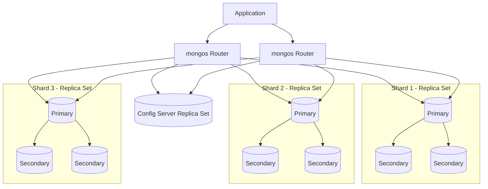
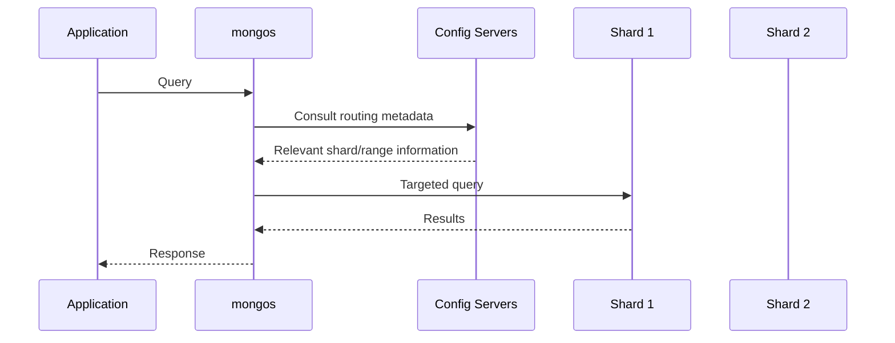
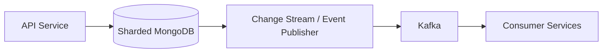

# 09- Sharding Architecture

## Overview

MongoDB sharding provides horizontal scaling by distributing data and workload across multiple database servers called shards.

A replica set primarily addresses **availability and redundancy**:

```text
Replica Set
    ↓
High availability
Replication
Failover
```

Sharding addresses a different problem:

```text
Sharded Cluster
    ↓
Horizontal scale
More data capacity
More distributed read/write capacity
```

A production sharded deployment combines both:

```text
MongoDB Sharded Cluster
│
├── Shard 1
│   └── Replica Set
│
├── Shard 2
│   └── Replica Set
│
├── Shard 3
│   └── Replica Set
│
├── Config Server Replica Set
│
└── mongos Routers
```

Sharding should not be introduced merely because a collection is large. It becomes useful when a workload has reached a point where vertical scaling, indexing, schema optimization, and replica-set scaling are insufficient.

The most important sharding decision is usually the **shard key**. A poor shard key can produce hot shards, scatter-gather queries, uneven storage distribution, and difficult operational behavior even when the underlying MongoDB infrastructure is correctly configured.

---

## Why Sharding Exists

A single MongoDB replica set has one primary for normal writes.

Adding secondary members can improve:

- read distribution
- availability
- redundancy
- disaster-recovery options

But it does not distribute normal writes across multiple primaries.

Consider:

```text
Replica Set

             Primary
                │
        ┌───────┴───────┐
        ▼               ▼
   Secondary        Secondary
```

The primary remains the write authority.

If the workload exceeds the capacity of one primary, adding more secondaries does not horizontally scale writes.

Sharding changes the architecture:

```text
                  mongos
                    │
       ┌────────────┼────────────┐
       ▼            ▼            ▼
    Shard 1      Shard 2      Shard 3
    Primary      Primary      Primary
```

Each shard owns a subset of the data and has its own primary.

This allows the workload to be distributed across multiple database servers.

---

## When to Consider Sharding

Sharding should normally be considered after exhausting simpler scaling and optimization strategies.

A reasonable progression is:

```text
Schema Optimization
        ↓
Query Optimization
        ↓
Index Optimization
        ↓
Hardware / Storage Scaling
        ↓
Replica Set Scaling
        ↓
Application Read Optimization
        ↓
Sharding
```

Potential indicators include:

- dataset no longer fits comfortably within available infrastructure
- working set exceeds available memory and causes unacceptable performance
- write throughput exceeds a single primary's sustainable capacity
- storage capacity exceeds practical limits of one deployment
- workload requires horizontal scaling
- tenant or workload isolation benefits from distribution
- a carefully designed shard key can distribute traffic predictably

Do not shard simply because:

```text
Collection has many documents
```

Large collections can perform well without sharding when access patterns and indexes are appropriate.

---

## Sharded Cluster Architecture

A MongoDB sharded cluster contains three major logical components:

| Component | Responsibility |
|---|---|
| Shard | Stores application data |
| Config server | Stores cluster metadata |
| `mongos` | Routes client operations |

A production architecture commonly looks like:



Each shard is normally implemented as a replica set in production.

---

## Shards

A shard is a logical partition of the MongoDB dataset.

For example:

```text
orders collection

Shard 1
customer_id: A-M

Shard 2
customer_id: N-Z
```

The actual distribution is controlled by the shard key and MongoDB's chunk/range management rather than application-side manual routing.

Each shard can contain:

- primary
- secondary members
- indexes
- part of the overall dataset

A shard therefore provides both storage and processing capacity.

---

## Config Servers

Config servers store metadata describing the sharded cluster.

The metadata includes information required to understand where chunks or ranges of sharded data reside.

Conceptually:

```text
Config Server
│
├── Sharded collections
├── Shard key metadata
├── Chunk/range metadata
└── Cluster configuration
```

Production deployments use a config server replica set for availability.

Application traffic should not connect directly to config servers.

---

## `mongos`

`mongos` is the query router for a sharded cluster.

Applications normally connect to `mongos` rather than directly to shards.

Example:

```text
Application
     │
     ▼
  mongos
     │
     ├── Shard 1
     ├── Shard 2
     └── Shard 3
```

`mongos` uses cluster metadata to determine which shard or shards should process an operation.

Multiple `mongos` instances should be deployed for application-level availability.

---

## Request Routing

A simplified request flow is:



In practice, `mongos` caches routing metadata and does not need to query the config servers for every operation.

The important architectural concept is:

```text
Client
  ↓
mongos
  ↓
Shard targeting
  ↓
One or more shards
```

---

## Shard Key

The shard key determines how documents are distributed across shards.

For example:

```javascript
{
  tenant_id: 123,
  created_at: ISODate(...)
}
```

could be used as a shard key depending on the application's access patterns and distribution requirements.

The shard key should be chosen based on:

- query patterns
- cardinality
- frequency
- write distribution
- data distribution
- sort requirements
- tenant isolation
- scalability requirements

Shard-key selection is one of the highest-impact MongoDB architecture decisions.

---

## Shard-Key Requirements

A good shard key should generally provide desirable properties across several dimensions.

### Cardinality

Cardinality refers to the number of distinct values.

Example:

```text
country
```

may have relatively low cardinality.

```text
user_id
```

usually has much higher cardinality.

Low-cardinality keys can limit distribution opportunities.

---

### Frequency

Frequency describes how often individual shard-key values occur.

Consider:

```text
status
```

with:

```text
pending
completed
failed
```

Millions of documents may share the same value.

This makes `status` a poor candidate for many workloads because the distribution opportunities are limited.

---

### Monotonicity

A monotonically increasing key can create concentration toward the newest range.

Example:

```text
_id / timestamp / sequential order number
```

Depending on the sharding strategy, new writes may concentrate on a single shard or range.

This can create a hot shard.

---

## Shard-Key Design Criteria

| Property | Desired Behavior |
|---|---|
| Cardinality | High enough to distribute data |
| Frequency | Avoid extreme concentration |
| Distribution | Balanced across shards |
| Query targeting | Frequently queried values available |
| Write distribution | Avoid one shard receiving most writes |
| Growth | Remain effective as dataset grows |
| Stability | Avoid frequent shard-key changes |
| Operational fit | Work with expected balancing behavior |

No single property determines whether a shard key is good.

The workload must be considered as a whole.

---

## Hashed Shard Keys

A hashed shard key applies a hash function to the selected field for distribution.

Example:

```javascript
sh.shardCollection(
  "app.users",
  {
    user_id: "hashed"
  }
)
```

Conceptually:

```text
user_id
   ↓
Hash function
   ↓
Hash value
   ↓
Distribution across ranges/shards
```

Hashed sharding can distribute monotonically increasing values more evenly.

---

## Advantages of Hashed Sharding

Hashed keys can be useful when:

- the source values are sequential
- write distribution is more important than range locality
- point lookups use the hashed field
- even distribution is required

For example:

```text
user_id = 1000001
user_id = 1000002
user_id = 1000003
...
```

can be distributed more evenly than a simple ranged strategy.

---

## Limitations of Hashed Sharding

Hashed sharding is not ideal for every query.

Range queries become less naturally targetable.

For example:

```javascript
{
  user_id: {
    $gte: 1000000,
    $lt: 2000000
  }
}
```

does not benefit from the same natural locality that a ranged shard key provides.

Hashed sharding therefore favors distribution over range locality.

---

## Ranged Shard Keys

Ranged sharding distributes values according to ordered ranges.

Example:

```text
Range A → customer_id 1-1,000,000
Range B → customer_id 1,000,001-2,000,000
Range C → customer_id 2,000,001-3,000,000
```

This can be useful when range queries are important.

Example:

```javascript
{
  customer_id: {
    $gte: 100000,
    $lt: 200000
  }
}
```

can potentially be targeted based on shard-key ranges.

---

## Hashed vs Ranged

| Characteristic | Hashed | Ranged |
|---|---|---|
| Distribution | Generally more uniform | Depends on values/workload |
| Range queries | Less locality | Strong locality |
| Sequential values | Often safer for distribution | Can create hot ranges |
| Point lookups | Good | Good |
| Ordered data locality | Poor | Good |
| Analytics by range | Less suitable | Often better |

Neither strategy is universally better.

The access pattern should determine the design.

---

## Compound Shard Keys

A shard key can contain multiple fields.

Example:

```javascript
{
  tenant_id: 1,
  created_at: 1
}
```

This can combine:

- tenant-aware routing
- temporal locality
- query targeting

But compound keys require careful analysis.

For example:

```text
tenant_id
```

may have many distinct values, while:

```text
created_at
```

provides temporal ordering.

The actual effectiveness depends on query shape and workload distribution.

---

## Prefix and Query Targeting

For a compound shard key:

```javascript
{
  tenant_id: 1,
  created_at: 1
}
```

a query containing:

```javascript
{
  tenant_id: "tenant-123"
}
```

provides useful shard-key information.

A query only on:

```javascript
{
  created_at: {
    $gte: ISODate(...)
  }
}
```

may provide much less precise routing because it does not constrain the leading shard-key field.

This is why query patterns must be analyzed before selecting a compound shard key.

---

## Tenant-Based Sharding

Multi-tenant SaaS systems are common candidates for tenant-aware shard keys.

Example:

```text
tenant_id
```

or:

```text
tenant_id + entity_id
```

Architecture:

```text
Tenant A ──┐
Tenant B ──┼── Sharding Layer
Tenant C ──┘
```

Advantages can include:

- tenant-aware routing
- operational isolation
- easier capacity reasoning
- targeted queries

However, a very large tenant can become a hot tenant.

For example:

```text
Tenant A → 70% of all traffic
Tenant B → 10%
Tenant C → 5%
Others → 15%
```

A high-cardinality tenant field does not automatically guarantee balanced workload.

---

## Jumbo Tenants and Hot Shards

Consider:

```text
tenant_id = enterprise_customer
```

with extremely high traffic.

If the shard-key design concentrates this tenant's data or workload, adding more shards may not solve the problem.

The architecture should consider:

- tenant frequency
- tenant size
- request distribution
- write rate
- query patterns

Large tenants may require a more sophisticated compound shard key or workload-isolation strategy.

---

## Shard Key and Query Targeting

A query can be:

### Targeted

```text
Query
  ↓
mongos
  ↓
Shard 2
```

Only one relevant shard is contacted.

### Multi-shard

```text
Query
  ↓
mongos
  ├── Shard 1
  ├── Shard 2
  └── Shard 3
```

Multiple shards participate.

### Scatter-Gather

```text
Query
  ↓
mongos
  ├── Shard 1 ──┐
  ├── Shard 2 ──┼── Results merged
  └── Shard 3 ──┘
```

Scatter-gather queries can become expensive as the cluster grows.

---

## Why Query Targeting Matters

Suppose there are ten shards.

A targeted query:

```text
Application
    ↓
mongos
    ↓
Shard 4
```

requires work primarily from one shard.

A scatter-gather query:

```text
Application
    ↓
mongos
    ├── Shard 1
    ├── Shard 2
    ├── Shard 3
    ├── ...
    └── Shard 10
```

may involve all ten shards.

Adding more shards can therefore increase the cost of poorly targeted queries.

This is one of the central senior-level sharding trade-offs.

---

## Scatter-Gather Anti-Pattern

Suppose an orders collection is sharded by:

```javascript
{
  tenant_id: 1
}
```

but the application frequently runs:

```javascript
{
  status: "pending"
}
```

If `status` is not part of the routing strategy, MongoDB may need to inspect multiple shards.

If the API performs this query at high frequency:

```text
GET /orders?status=pending
```

the sharded architecture may amplify the workload rather than reduce it.

The correct solution might involve:

- changing query patterns
- redesigning the shard key
- maintaining a separate read model
- introducing controlled denormalization
- using an appropriate indexing strategy on each shard

---

## Chunk and Range Concepts

MongoDB logically divides sharded data into manageable ranges of shard-key space.

Historically these are commonly described as chunks; modern MongoDB versions also expose range-oriented terminology in relevant administrative operations.

Conceptually:

```text
Shard Key Space

|---- Range A ----|
|---- Range B ----|
|---- Range C ----|
|---- Range D ----|
```

These ranges can be distributed across shards.

This allows MongoDB to rebalance data as the cluster changes.

---

## Balancing

The cluster balancer works to distribute sharded data across available shards.

Conceptually:

```text
Before

Shard 1: █████████████
Shard 2: █████
Shard 3: ██


After balancing

Shard 1: ███████
Shard 2: ███████
Shard 3: ███████
```

Balanced storage does not necessarily mean balanced workload.

For example:

```text
Shard 1 → 1 TB, low traffic
Shard 2 → 800 GB, high traffic
Shard 3 → 900 GB, low traffic
```

Storage distribution may look reasonable while request distribution is not.

---

## Balancing and Operational Load

Balancing can involve data movement.

Data movement can consume:

- network bandwidth
- disk I/O
- CPU
- storage capacity
- operational headroom

Do not evaluate a sharded cluster only by steady-state query latency.

Consider what happens during:

- shard addition
- rebalancing
- resharding
- shard removal
- workload changes

---

## Adding a Shard

A simplified operational sequence is:

```text
Provision new shard
       ↓
Validate replica-set health
       ↓
Add shard to cluster
       ↓
Balancer redistributes data
       ↓
Monitor migration
       ↓
Validate distribution
```

The new shard does not instantly contain an equal portion of all data.

Redistribution is an operational process.

---

## Removing a Shard

Removing a shard requires controlled data migration.

Conceptually:

```text
Shard 3
   │
   ├── Range A → Shard 1
   ├── Range B → Shard 2
   └── Range C → Shard 1
```

The shard should not simply be terminated while it still owns data.

A production removal should include:

- migration monitoring
- capacity validation
- application impact monitoring
- verification after migration
- rollback planning where applicable

---

## Resharding

Resharding changes the shard-key strategy for an existing collection.

It can be required when the original shard key no longer provides acceptable distribution or query targeting.

Examples:

```text
Original:
tenant_id

New:
tenant_id + user_id
```

or:

```text
Original:
created_at

New:
hashed user_id
```

Resharding is an architectural operation, not an ordinary index change.

It should be planned around:

- dataset size
- write volume
- query patterns
- cluster capacity
- migration duration
- operational risk
- rollback/recovery procedures

---

## Choosing a Production Shard Key

A useful design process is:

```text
Identify workload
      ↓
List critical queries
      ↓
Identify write patterns
      ↓
Measure cardinality
      ↓
Measure frequency
      ↓
Check monotonicity
      ↓
Evaluate targeting
      ↓
Evaluate distribution
      ↓
Model growth
      ↓
Test under realistic load
      ↓
Select shard key
```

Do not begin with:

```text
"What field has the most unique values?"
```

Begin with:

```text
"How does this application access and mutate its data?"
```

---

## Shard-Key Design Example

Consider an order service.

Queries:

```text
Get order by order_id
List customer orders
List customer orders by date
Get tenant's pending orders
Create order
Update order status
```

Potential candidate:

```javascript
{
  customer_id: 1,
  created_at: 1
}
```

Potential concerns:

- large customers may dominate a shard
- order lookup by `order_id` may be scatter-gather
- tenant-level APIs may not be targeted

Another design might use:

```javascript
{
  tenant_id: 1,
  order_id: 1
}
```

This improves tenant-aware targeting but still requires analysis of tenant frequency and workload distribution.

The correct choice depends on actual traffic characteristics.

---

## Shard Key vs Application Query Model

A shard key should be evaluated together with the application's API.

Example:

```text
GET /tenants/{tenant_id}/orders
```

strongly suggests that `tenant_id` is an important access dimension.

Whereas:

```text
GET /orders/{order_id}
```

suggests that globally unique order lookup is also important.

If the application frequently performs both patterns, the shard-key and indexing strategy should support both rather than optimizing one query while making the other prohibitively expensive.

---

## Indexes in a Sharded Cluster

Indexes remain important on every shard.

For example:

```javascript
db.orders.createIndex({
  tenant_id: 1,
  created_at: -1
})
```

helps queries executed against the relevant shard.

But indexing does not solve poor shard targeting.

These are separate concerns:

```text
Shard Key
    ↓
Which shard(s)?

Index
    ↓
How efficiently does each shard query its local data?
```

A query can be:

```text
Well indexed
+
Poorly targeted
```

and still be expensive.

---

## Shard Key and Index Prefixes

The shard key influences indexing requirements and query planning.

For compound access patterns, consider:

```text
Shard targeting
+
Local index efficiency
+
Sort requirements
```

For example:

```javascript
{
  tenant_id: 1,
  created_at: -1
}
```

can support a tenant-oriented query and ordering pattern when it matches the workload.

Index design should therefore be evaluated at the cluster and shard levels.

---

## Query Explain in Sharded Deployments

Use `explain()` to investigate both query efficiency and targeting.

Example:

```javascript
db.orders.explain("executionStats").find({
  tenant_id: "tenant-123",
  status: "pending"
})
```

Investigate:

- whether the query is targeted
- how many shards participate
- whether indexes are used
- `nReturned`
- `totalKeysExamined`
- `totalDocsExamined`
- execution time
- sort stages
- shard-level work

A good sharding diagnosis asks two questions:

```text
Did mongos contact the right shard(s)?
        +
Did each shard execute the query efficiently?
```

---

## Performance Model

A useful mental model is:

```text
Total Query Cost
=
Routing Cost
+
Number of Shards Contacted
+
Per-Shard Query Cost
+
Result Merge Cost
+
Network Cost
```

A query that touches ten shards may be expensive even if each shard individually executes the query efficiently.

This is why query targeting is often more important than simply adding indexes.

---

## Aggregation in a Sharded Cluster

Aggregation pipelines may execute across multiple shards.

Conceptually:

```text
Application
    ↓
mongos
    ↓
┌───────────────┐
│ Shard 1       │
│ $match        │
│ $group        │
└───────┬───────┘
        │
┌───────▼───────┐
│ mongos / merge│
└───────┬───────┘
        ▼
     Results
```

Good aggregation design should:

- filter early
- use appropriate indexes
- reduce data before merging
- avoid unnecessarily broad fan-out
- control memory usage

For large distributed workloads, aggregation architecture should be tested under production-scale data.

---

## `$lookup` in Sharded Architectures

Distributed joins can be significantly more expensive than local indexed operations.

For example:

```javascript
{
  $lookup: {
    from: "customers",
    localField: "customer_id",
    foreignField: "_id",
    as: "customer"
  }
}
```

Before introducing such a pipeline into a high-throughput endpoint, consider:

- collection sizes
- shard keys
- query targeting
- indexes
- join cardinality
- network traffic
- result size

Sometimes controlled denormalization is more appropriate for frequently accessed read paths.

---

## Sharding and Transactions

Transactions in a sharded cluster require more coordination than single-shard operations.

A transaction that touches multiple shards can involve distributed coordination.

Conceptually:

```text
Transaction
    │
    ├── Shard 1
    ├── Shard 2
    └── Shard 3
```

compared with:

```text
Transaction
    │
    └── Shard 2
```

Single-shard transaction designs are generally simpler and can reduce distributed coordination.

For high-throughput systems, model related data so that the most important atomic operations remain local to one shard where practical.

---

## Sharding and Data Modeling

Sharding should influence schema design from the beginning for large-scale systems.

Consider:

```text
Tenant
 ├── Users
 ├── Orders
 ├── Payments
 └── Events
```

If all critical operations are tenant-scoped, tenant-aware data models can simplify routing.

However, blindly embedding everything under a tenant or selecting `tenant_id` as the shard key can create hot tenants.

The design must balance:

- locality
- distribution
- query targeting
- write scaling
- document size
- transaction scope

---

## Sharding and Microservices

A service-oriented architecture should normally own its database model.

Example:

```text
Order Service
    ↓
orders collection

Customer Service
    ↓
customers collection

Event Service
    ↓
events collection
```

If a service's MongoDB deployment is sharded, its shard key should primarily reflect that service's access patterns.

Avoid designing a global shard key merely because another service uses the same field.

---

## Sharding and Kafka

A sharded MongoDB workload can feed Kafka through application events or change streams.

Example:



Important considerations include:

- event ordering
- idempotency
- partitioning
- retry behavior
- duplicate delivery
- shard distribution
- consumer scaling

MongoDB sharding and Kafka partitioning are separate distribution mechanisms.

Do not assume that matching their keys automatically produces correct end-to-end distribution.

---

## Hot Shards

A hot shard receives disproportionate workload.

Example:

```text
Shard 1: ████████████████████
Shard 2: ████
Shard 3: ███
```

Potential causes:

- low-cardinality shard key
- monotonically increasing key
- dominant tenant
- uneven query distribution
- workload concentrated on recent data
- poor query targeting

Symptoms can include:

- higher latency
- CPU saturation
- storage pressure
- replication lag
- uneven resource utilization

---

## Detecting Hot Shards

Monitor per-shard:

- CPU
- memory
- disk I/O
- operation rate
- query latency
- network traffic
- storage growth
- replication lag
- active connections

Compare:

```text
Data distribution
```

against:

```text
Request distribution
```

These are not necessarily the same.

A perfectly balanced dataset can still have an overloaded shard.

---

## Sharding Anti-Patterns

### Sharding Too Early

Sharding introduces operational complexity.

Optimize the single replica-set architecture first unless scale requirements justify sharding.

### Choosing a Low-Cardinality Key

Example:

```text
status
```

with only a few values.

This limits distribution.

### Choosing a Monotonic Key Without Analysis

Sequential keys can concentrate new writes.

### Choosing a Key Solely for Uniqueness

A unique field is not automatically a good shard key.

The key must support distribution and workload routing.

### Ignoring Query Patterns

A shard key that distributes data perfectly but makes every query scatter-gather can still produce poor performance.

### Assuming More Shards Always Improve Performance

Poorly targeted queries may become more expensive as the number of shards increases.

### Treating Balancing as Free

Data migration consumes infrastructure resources.

### Ignoring Dominant Tenants

A large customer can overload one shard even with a high-cardinality tenant key.

### Using Application-Side Manual Routing

Application code should not normally reinvent MongoDB's cluster routing model.

### Connecting Applications Directly to Shards

Applications should normally use `mongos` for a sharded deployment.

---

## High Availability in a Sharded Cluster

Each shard should normally be independently highly available.

Example:

```text
Shard 1
├── Primary
├── Secondary
└── Secondary

Shard 2
├── Primary
├── Secondary
└── Secondary

Shard 3
├── Primary
├── Secondary
└── Secondary
```

The cluster also needs resilient:

```text
Config Server Replica Set
```

and multiple:

```text
mongos
```

Therefore:

```text
HA Sharded Cluster
=
HA Shards
+
HA Config Servers
+
Multiple mongos
+
Resilient Application Layer
```

---

## `mongos` High Availability

Applications should have access to multiple `mongos` routers.

For example:

```text
Load Balancer
      │
 ┌────┴────┐
 ▼         ▼
mongos-1  mongos-2
```

If one router fails, applications can continue through another router.

The `mongos` layer should not become a single point of failure.

---

## Security

A sharded deployment expands the internal communication surface.

Secure:

- application-to-`mongos`
- `mongos`-to-shard communication
- replica-set communication
- config-server communication
- administrative interfaces

Use:

- authentication
- TLS
- network restrictions
- least-privilege roles
- secret management
- encrypted storage where required
- centralized auditing and monitoring

Do not expose shard members directly to the public internet.

---

## Network Architecture

A production AWS deployment might look like:

```text
VPC
│
├── Private Subnet AZ-A
│   ├── mongos
│   ├── Shard 1
│   └── Config Server
│
├── Private Subnet AZ-B
│   ├── mongos
│   ├── Shard 2
│   └── Config Server
│
└── Private Subnet AZ-C
    ├── mongos
    ├── Shard 3
    └── Config Server
```

Applications can reach `mongos` through controlled private networking.

Security groups or equivalent network controls should allow only required communication paths.

---

## Backup and Recovery

A sharded cluster requires a backup strategy that understands distributed state.

The backup strategy should preserve:

- shard data
- cluster metadata
- configuration
- security configuration where applicable
- consistent recovery point

Managed backup solutions can simplify this substantially.

Logical backup tooling such as:

```bash
mongodump
mongorestore
```

can be useful for appropriate workloads, but large production sharded datasets may require more sophisticated backup and point-in-time recovery mechanisms.

Always test restoration.

---

## Monitoring Architecture

A production monitoring system should observe:

```text
Cluster
│
├── mongos
│   ├── Requests
│   ├── Errors
│   └── Latency
│
├── Config Servers
│   ├── Health
│   └── Replication
│
└── Shards
    ├── Primary health
    ├── Secondary health
    ├── Replication lag
    ├── CPU
    ├── Memory
    ├── Disk
    ├── Connections
    └── Query performance
```

Monitoring only the individual replica sets is insufficient.

The routing layer and cluster-wide behavior must also be visible.

---

## Operational Metrics

Important metrics include:

| Area | Metrics |
|---|---|
| Routing | `mongos` request rate, latency, errors |
| Distribution | Data/range distribution |
| Shards | CPU, memory, disk, I/O |
| Replication | Lag, member health |
| Queries | Latency, examined documents/keys |
| Storage | Growth, capacity, utilization |
| Balancing | Migration activity |
| Connections | Active/open connections |
| Cluster | Metadata and routing health |

---

## Capacity Planning

Capacity planning should consider more than total storage.

Estimate:

```text
Data Volume
+
Indexes
+
Replication
+
Working Set
+
Traffic
+
Peak Load
+
Failover Headroom
+
Balancing Overhead
```

For example:

```text
Current data:       4 TB
Indexes:            1 TB
Replication:        3 copies
Expected growth:    30% / year
Peak traffic:       3× average
```

The cluster should be sized for the actual operating envelope rather than today's dataset alone.

---

## Adding Capacity

A common scaling strategy is:

```text
Current Cluster
    ↓
Add Shard
    ↓
Redistribute Data
    ↓
Validate Distribution
    ↓
Measure Workload
```

Do not assume that adding a shard immediately produces proportional throughput improvements.

If queries are scatter-gather:

```text
More shards
    ↓
More participants
    ↓
Potentially more coordination
```

The workload must be benchmarked.

---

## Performance Optimization Workflow

A senior engineer should use a measurement-driven workflow:

```text
Identify slow operation
        ↓
Capture actual query
        ↓
Measure latency
        ↓
Run explain
        ↓
Check shard targeting
        ↓
Check local index usage
        ↓
Measure per-shard work
        ↓
Check data distribution
        ↓
Check resource utilization
        ↓
Change one variable
        ↓
Benchmark again
```

Avoid changing shard keys, indexes, and application queries simultaneously.

Otherwise, it becomes difficult to determine which change produced the improvement.

---

## Before and After Example

### Before

Query:

```javascript
db.orders.find({
  status: "pending"
})
```

Shard key:

```javascript
{
  tenant_id: 1
}
```

Potential behavior:

```text
mongos
 ├── Shard 1
 ├── Shard 2
 ├── Shard 3
 └── Shard 4
```

Every shard may need to inspect its local data.

### Improved Query

If the API can make the tenant explicit:

```javascript
db.orders.find({
  tenant_id: "tenant-123",
  status: "pending"
})
```

the router has information that can help target the relevant shard.

This illustrates an important design principle:

> Application query shape and shard-key design should be considered together.

---

## Pagination in a Sharded Cluster

Offset pagination can become increasingly expensive:

```javascript
{
  $skip: 1000000
}
```

Especially when multiple shards participate.

Prefer cursor/range-based pagination for large workloads.

Example:

```javascript
{
  tenant_id: "tenant-123",
  created_at: {
    $lt: ISODate("2026-09-20T12:00:00Z")
  }
}
```

with an appropriate index.

Cursor pagination can reduce the need to repeatedly scan and discard large numbers of documents.

---

## Sharding and Redis

Redis can reduce repeated MongoDB reads, but it should not hide a fundamentally poor shard-key design.

Example:

```text
API
 │
 ├── Redis
 │    └── Cache hit
 │
 └── MongoDB
      └── Targeted query
```

A cache can reduce database traffic, but:

- cache invalidation remains necessary
- cache misses still hit MongoDB
- hot keys can move the bottleneck into Redis
- stale cache values can create consistency issues

Caching and sharding solve different problems.

---

## Sharding and Celery

Background workloads can interact with shard distribution.

For example:

```text
Celery Workers
      │
      ▼
MongoDB
      │
 ┌────┼────┐
 ▼    ▼    ▼
S1   S2   S3
```

A background task that repeatedly queries without shard-key predicates can generate cluster-wide load.

Prefer task payloads that contain routing information when appropriate:

```python
{
    "tenant_id": "tenant-123",
    "order_id": "order-1001",
}
```

This allows workers to construct targeted database operations.

---

## Python Integration

Applications generally connect to the `mongos` layer.

Example:

```python
from pymongo import MongoClient

client = MongoClient(
    "mongodb://mongos-1:27017,mongos-2:27017/app",
    serverSelectionTimeoutMS=5000,
    connectTimeoutMS=5000,
    socketTimeoutMS=10000,
)

db = client["app"]
orders = db["orders"]
```

The application should not need to know which shard owns a document.

The routing layer handles shard selection.

---

## FastAPI Integration

A typical architecture is:

```text
FastAPI
   │
   ▼
MongoClient
   │
   ▼
mongos
   │
   ├── Shard 1
   ├── Shard 2
   └── Shard 3
```

The application should:

- create a long-lived client
- reuse the connection pool
- use timeouts
- handle transient failures
- construct queries that support shard targeting
- avoid unnecessary scatter-gather operations

Synchronous PyMongo should not be used directly in latency-sensitive async request paths without considering event-loop blocking. For asynchronous applications, use an async MongoDB driver strategy appropriate to the MongoDB/Python driver ecosystem being used.

---

## Django Integration

Django applications can use MongoDB through:

- PyMongo
- MongoEngine
- dedicated repository/service abstractions

For a sharded deployment, application code should generally target `mongos`.

Example architecture:

```text
Django View
    ↓
Service Layer
    ↓
Repository
    ↓
MongoClient
    ↓
mongos
    ↓
Sharded Cluster
```

Do not assume Django's native relational ORM behavior automatically maps to MongoDB sharding semantics.

Shard-aware query design remains a database architecture responsibility.

---

## Production Deployment

A production deployment should separate:

```text
Application Network
        │
        ▼
mongos Layer
        │
        ▼
Sharded Database Network
```

Recommended characteristics include:

- private networking
- multiple `mongos`
- replica-set-backed shards
- replica-set-backed config servers
- independent storage
- TLS
- authentication
- monitoring
- automated backups
- infrastructure-as-code
- tested deployment procedures

---

## Deployment and CI/CD

Database topology changes should not be treated like ordinary application deployments.

Examples:

- adding a shard
- changing shard configuration
- resharding
- modifying balancer behavior
- changing indexes
- upgrading MongoDB

Use controlled deployment processes.

A CI/CD workflow may validate:

```text
Configuration
    ↓
Infrastructure Plan
    ↓
Pre-production Test
    ↓
Change Approval
    ↓
Production Change
    ↓
Health Verification
    ↓
Performance Verification
```

Avoid automatically applying high-risk database topology changes simply because an application pipeline succeeded.

---

## Configuration Management

Do not hard-code production topology into application code.

Use environment configuration:

```python
import os

mongo_uri = os.environ["MONGODB_URI"]
```

Example environment value:

```text
MONGODB_URI=mongodb://mongos-1:27017,mongos-2:27017/app
```

Manage secrets separately from ordinary configuration.

For AWS deployments, secret values can be stored in services such as AWS Secrets Manager and injected into the application environment.

---

## Cost Considerations

Sharding increases:

- compute cost
- storage cost
- replication cost
- network traffic
- monitoring cost
- operational complexity

Each shard normally requires its own replica-set infrastructure.

For example:

```text
3 shards
×
3 database members
=
9 database members
```

plus:

```text
Config Server Replica Set
+
mongos instances
+
Monitoring
+
Backup infrastructure
```

Therefore, sharding can significantly increase infrastructure requirements.

---

## Production Troubleshooting

### Queries Are Slow After Adding Shards

```text
Symptom
↓
Possible causes
    ├── Scatter-gather queries
    ├── Missing indexes
    ├── Poor shard-key targeting
    ├── Uneven distribution
    └── Resource saturation
↓
Isolation strategy
    ├── Inspect query shape
    ├── Run explain()
    ├── Check participating shards
    └── Compare per-shard latency
↓
Diagnostic commands
    ├── explain("executionStats")
    ├── Sharding metadata inspection
    └── Server statistics
↓
Root cause
↓
Corrective action
    ├── Improve query targeting
    ├── Add local indexes
    ├── Redesign access pattern
    └── Re-evaluate shard key
↓
Prevention
    ├── Query-shape review
    ├── Performance testing
    └── Production monitoring
```

### One Shard Is Overloaded

```text
Symptom
↓
Possible causes
    ├── Hot shard
    ├── Poor shard key
    ├── Dominant tenant
    ├── Monotonic key
    └── Uneven query routing
↓
Isolation strategy
    ├── Compare shard traffic
    ├── Compare data distribution
    └── Identify hot key values
↓
Diagnostic commands
    ├── Shard statistics
    ├── Query metrics
    └── Cluster metadata inspection
↓
Root cause
↓
Corrective action
    ├── Change access pattern
    ├── Improve distribution
    ├── Reshard
    └── Isolate workload where appropriate
↓
Prevention
    ├── Load testing
    ├── Key-distribution analysis
    └── Capacity monitoring
```

### Balancing Causes Performance Degradation

```text
Symptom
↓
Possible causes
    ├── Data migration
    ├── Storage contention
    ├── Network saturation
    └── Insufficient capacity
↓
Isolation strategy
    ├── Check migration activity
    ├── Inspect disk I/O
    └── Inspect network utilization
↓
Diagnostic commands
    ├── Cluster status
    ├── Shard metrics
    └── Storage metrics
↓
Root cause
↓
Corrective action
    ├── Adjust operational scheduling
    ├── Add capacity
    └── Reduce competing workload
↓
Prevention
    ├── Capacity headroom
    ├── Migration monitoring
    └── Change planning
```

### `mongos` Becomes Unavailable

```text
Symptom
↓
Possible causes
    ├── Process failure
    ├── Host failure
    ├── Network failure
    └── Resource exhaustion
↓
Isolation strategy
    ├── Check router health
    ├── Check load balancer
    └── Test another mongos
↓
Diagnostic commands
    ├── mongos logs
    └── Infrastructure health checks
↓
Root cause
↓
Corrective action
    ├── Restore router
    └── Route traffic to healthy mongos
↓
Prevention
    ├── Multiple mongos instances
    ├── Load balancing
    └── Health checks
```

---

## Senior-Level Design Checklist

Before approving a sharded MongoDB architecture, answer:

### Workload

- What is the current dataset size?
- What is the growth rate?
- What is the peak write rate?
- What is the peak read rate?
- Which queries dominate traffic?
- Which tenants or entities dominate traffic?

### Shard Key

- Is cardinality sufficient?
- Is frequency reasonably distributed?
- Is the key monotonic?
- Does it support critical query targeting?
- Can it create hot shards?
- Will its properties remain suitable as the dataset grows?

### Query Performance

- Which queries are targeted?
- Which queries scatter-gather?
- Are local indexes appropriate?
- Are aggregations distributed efficiently?
- What happens when the shard count increases?

### Availability

- Is every shard backed by a replica set?
- Are members distributed across failure domains?
- Are config servers highly available?
- Are multiple `mongos` instances deployed?
- Can the expected failures preserve service availability?

### Operations

- How is balancing monitored?
- How is shard addition performed?
- How is shard removal performed?
- How is resharding performed?
- What is the rollback/recovery strategy?

### Disaster Recovery

- What is the RPO?
- What is the RTO?
- Are backups consistent?
- Has restoration been tested?
- Can the application reconnect after recovery?

---

## Sharding Decision Framework

A practical decision framework is:

```text
Is the workload exceeding one primary?
        │
        ├── No → Optimize existing architecture
        │
        └── Yes
             ↓
     Can vertical scaling solve it?
             │
        ┌────┴────┐
        │         │
       Yes        No
        │         │
        ▼         ▼
    Scale up   Analyze workload
                  ↓
          Can read scaling help?
                  │
             ┌────┴────┐
             │         │
            Yes        No
             │         │
             ▼         ▼
       Add replicas   Evaluate sharding
                         ↓
                 Design shard key
                         ↓
                 Load-test topology
                         ↓
                 Validate operations
                         ↓
                 Deploy incrementally
```

Sharding should be the result of a measured scalability requirement, not a default architecture choice.

---

## Key Takeaways

- **MongoDB sharding provides horizontal scaling by distributing data across shards, while each shard normally uses a replica set to provide high availability.**
- **The shard key is the central architectural decision: evaluate cardinality, frequency, monotonicity, workload distribution, and critical query targeting together rather than choosing a field solely for uniqueness.**
- **Targeted queries scale more predictably than scatter-gather queries; application access patterns, indexes, and shard-key design must therefore be considered together.**
- **A production sharded cluster requires resilient shards, config servers, and multiple `mongos` routers, plus monitoring, backup, security, and capacity headroom across the entire topology.**
- **Sharding adds substantial operational complexity and should normally follow query/index optimization, capacity analysis, and replica-set scaling rather than being introduced prematurely.**