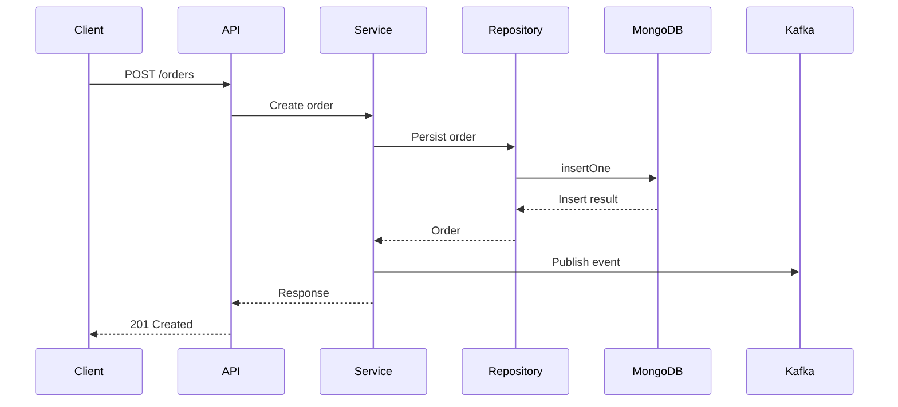

# 11- Python Application Architecture with MongoDB

## Overview

A production Python application using MongoDB should treat the database as an infrastructure dependency rather than allowing MongoDB queries to spread throughout the application.

A maintainable architecture separates:

```text
HTTP / gRPC
    │
    ▼
API / Controller
    │
    ▼
Service Layer
    │
    ▼
Repository Layer
    │
    ▼
MongoDB Driver
    │
    ▼
MongoDB
```

This separation is particularly important for senior backend systems because MongoDB-specific concerns include:

- connection pooling
- query construction
- indexes
- transactions
- read/write concerns
- retry behavior
- ObjectId handling
- aggregation
- pagination
- error handling
- observability
- consistency requirements

The application architecture should make these concerns explicit without leaking them into every business component.

---

## Architectural Goals

A production MongoDB application should aim for:

| Goal | Architectural Approach |
|---|---|
| Maintainability | Repository and service boundaries |
| Testability | Dependency injection and repository abstractions |
| Performance | Long-lived connection pools and optimized queries |
| Reliability | Timeouts, retries, idempotency |
| Scalability | Stateless application instances |
| Consistency | Explicit transaction/read/write behavior |
| Security | Secret management and least-privilege database users |
| Observability | Query timing, errors, metrics, correlation IDs |
| Flexibility | Database-specific logic isolated in repositories |
| Deployment | Environment-based configuration |

The architecture should also prevent an application from accidentally depending on MongoDB implementation details everywhere.

---

## Recommended Application Structure

A practical FastAPI-style project can use:

```text
app/
    api/
        routes/
            orders.py
            users.py

    core/
        config.py
        logging.py

    db/
        mongodb.py
        indexes.py

    models/
        order.py
        user.py

    repositories/
        order_repository.py
        user_repository.py

    services/
        order_service.py
        user_service.py

    schemas/
        order.py
        user.py

    exceptions/
        database.py
        domain.py

    main.py

tests/
    unit/
    integration/
```

The exact directory names are less important than maintaining clear responsibilities.

---

## Layer Responsibilities

### API Layer

Responsible for:

- HTTP or gRPC protocol handling
- authentication context
- request validation
- response serialization
- status codes
- dependency injection

It should not contain complex MongoDB queries.

Avoid:

```python
@router.get("/orders/{order_id}")
def get_order(order_id: str):
    return db.orders.find_one({"order_id": order_id})
```

Prefer:

```text
Route
  ↓
Service
  ↓
Repository
```

---

## Service Layer

The service layer owns business behavior.

For example:

```python
class OrderService:
    def __init__(self, repository):
        self.repository = repository

    def get_order(self, order_id: str):
        return self.repository.get_by_id(order_id)
```

More complex operations belong here:

```text
Validate business rule
        ↓
Read required state
        ↓
Perform transaction
        ↓
Persist state
        ↓
Publish event
```

The service should not need to know how MongoDB indexes or cursors are implemented.

---

## Repository Layer

The repository owns persistence details.

Example:

```python
class OrderRepository:
    def __init__(self, collection):
        self.collection = collection

    def get_by_id(self, order_id: str):
        return self.collection.find_one(
            {"order_id": order_id},
            {
                "_id": 0,
                "order_id": 1,
                "customer_id": 1,
                "status": 1,
                "created_at": 1,
            },
        )
```

The repository is the appropriate location for:

- MongoDB filters
- projections
- sorting
- aggregation pipelines
- bulk writes
- pagination
- index-aware query design
- MongoDB-specific exception handling

---

## MongoDB Driver Layer

The driver layer should centralize connection configuration.

```text
Application
    │
    ├── Service
    │
    └── Repository
             │
             ▼
        MongoClient
             │
             ▼
        Connection Pool
             │
             ▼
       MongoDB Cluster
```

Do not create independent `MongoClient` instances throughout the application.

---

## MongoClient Lifecycle

A `MongoClient` should normally have application-process lifetime.

Example:

```python
from pymongo import MongoClient

client = MongoClient(
    MONGODB_URI,
    serverSelectionTimeoutMS=5000,
    connectTimeoutMS=5000,
    socketTimeoutMS=10000,
)
```

The client maintains connection pools internally.

Creating a client for every request is an anti-pattern:

```python
def get_order(order_id: str):
    client = MongoClient(MONGODB_URI)
    ...
```

This can cause unnecessary connection creation and resource consumption.

---

## Connection Pooling

The driver manages connections approximately like:

```text
Python Process
      │
      ▼
 MongoClient
      │
      ▼
 Connection Pool
 ┌────┼────┬────┐
 ▼    ▼    ▼    ▼
 C1   C2   C3   C4
```

Each application process can maintain a pool of connections.

If the deployment has:

```text
8 API instances
×
4 worker processes
×
100 max connections
```

the theoretical aggregate connection demand can become significant.

Pool sizing must therefore be considered across the entire deployment, not only inside one Python process.

---

## Connection Configuration

A production configuration should include appropriate timeouts.

Example:

```python
from pymongo import MongoClient

client = MongoClient(
    MONGODB_URI,
    serverSelectionTimeoutMS=5_000,
    connectTimeoutMS=5_000,
    socketTimeoutMS=10_000,
    retryWrites=True,
)
```

Values should be based on the application's latency budget rather than copied blindly.

---

## Configuration Management

Keep configuration outside application code.

```python
import os

MONGODB_URI = os.environ["MONGODB_URI"]
MONGODB_DATABASE = os.environ["MONGODB_DATABASE"]
```

A more structured configuration can use Pydantic Settings:

```python
from pydantic_settings import BaseSettings


class Settings(BaseSettings):
    mongodb_uri: str
    mongodb_database: str

    class Config:
        env_file = ".env"


settings = Settings()
```

Production secrets should come from an appropriate secret-management system rather than committed `.env` files.

---

## Environment Separation

Use independent database configurations:

```text
Development
    ↓
mongodb://localhost/...

Testing
    ↓
Dedicated test MongoDB

Staging
    ↓
Staging replica set / managed deployment

Production
    ↓
Production MongoDB cluster
```

Never allow test automation to accidentally use production credentials.

---

## Connection Validation

Applications should validate MongoDB connectivity during startup or health checks according to the deployment model.

Example:

```python
client.admin.command("ping")
```

A startup failure can be appropriate when MongoDB is a mandatory dependency.

However, Kubernetes liveness and readiness probes should be designed carefully.

A transient database failure should not necessarily cause Kubernetes to repeatedly restart every application instance.

---

## FastAPI Application Lifecycle

A modern FastAPI application can manage MongoDB using the application lifespan.

```python
from contextlib import asynccontextmanager

from fastapi import FastAPI
from pymongo import MongoClient

client: MongoClient | None = None


@asynccontextmanager
async def lifespan(app: FastAPI):
    global client

    client = MongoClient(
        MONGODB_URI,
        serverSelectionTimeoutMS=5000,
        connectTimeoutMS=5000,
        socketTimeoutMS=10000,
    )

    client.admin.command("ping")

    yield

    client.close()


app = FastAPI(lifespan=lifespan)
```

This provides a clear lifecycle:

```text
Process starts
    ↓
Create MongoClient
    ↓
Validate connection
    ↓
Serve requests
    ↓
Shutdown signal
    ↓
Close MongoClient
```

---

## Synchronous PyMongo and FastAPI

PyMongo operations are synchronous.

For example:

```python
document = collection.find_one(
    {"order_id": order_id}
)
```

If the application uses FastAPI's asynchronous execution model, blocking database operations must be handled deliberately.

Options include:

- running synchronous database work in an appropriate threadpool
- using an asynchronous MongoDB driver strategy supported by the current driver stack
- designing endpoints around synchronous execution when appropriate

Do not assume that declaring an endpoint `async def` automatically makes synchronous database operations non-blocking.

---

## Async Architecture

Conceptually:

```text
async FastAPI endpoint
        │
        ├── Async DB driver
        │       ↓
        │   MongoDB
        │
        └── Async external services
```

or:

```text
FastAPI
   │
   ▼
Sync repository
   │
   ▼
Thread execution
   │
   ▼
PyMongo
```

The correct approach depends on workload, driver support, application concurrency, and operational requirements.

---

## Dependency Injection

FastAPI dependencies can provide repositories or services.

Example:

```python
from fastapi import Depends


def get_order_repository():
    return OrderRepository(
        database.orders
    )


def get_order_service(
    repository=Depends(get_order_repository),
):
    return OrderService(repository)
```

The route then focuses on API behavior:

```python
@router.get("/orders/{order_id}")
def get_order(
    order_id: str,
    service=Depends(get_order_service),
):
    return service.get_order(order_id)
```

This makes testing easier because repositories can be replaced with fakes or mocks.

---

## Pydantic and MongoDB Documents

MongoDB uses BSON while API contracts commonly use JSON.

The application therefore needs a serialization boundary.

For example:

```python
from pydantic import BaseModel


class OrderResponse(BaseModel):
    order_id: str
    customer_id: str
    status: str
```

The API should not blindly expose raw BSON documents.

---

## ObjectId Handling

MongoDB commonly uses `ObjectId` for `_id`.

A database document may contain:

```python
{
    "_id": ObjectId("...")
}
```

while JSON APIs generally expose a string representation.

A serialization boundary can convert:

```text
ObjectId
   ↓
str
   ↓
JSON
```

Do not leak driver-specific BSON objects throughout your API contract unless there is a deliberate reason to do so.

---

## Domain IDs vs MongoDB `_id`

For many production APIs, it is useful to distinguish:

```text
MongoDB _id
    ↓
Persistence identifier

order_id
    ↓
Business/API identifier
```

For example:

```json
{
  "_id": "MongoDB ObjectId",
  "order_id": "ORD-1001"
}
```

This can prevent business logic from becoming tightly coupled to MongoDB's internal identifier representation.

---

## Repository Query Design

Repositories should return only the fields required by the caller when practical.

Instead of:

```python
collection.find_one({
    "order_id": order_id
})
```

consider:

```python
collection.find_one(
    {"order_id": order_id},
    {
        "_id": 0,
        "order_id": 1,
        "status": 1,
        "customer_id": 1,
    },
)
```

Projection can reduce:

- network traffic
- BSON decoding
- Python object creation
- application memory usage

---

## Query Filters

Do not construct queries from raw user input without validation.

Bad:

```python
collection.find_one(request.query_params)
```

This gives callers too much control over database behavior.

Prefer explicit query construction:

```python
filters = {
    "tenant_id": tenant_id,
    "status": status,
}
```

The application controls which MongoDB operators are allowed.

---

## Pagination

Avoid large `skip()` values:

```python
collection.find(query).skip(500_000).limit(50)
```

For large collections, prefer cursor-based pagination.

Example:

```python
query = {
    "tenant_id": tenant_id,
    "created_at": {"$lt": last_seen},
}

cursor = (
    collection.find(query)
    .sort("created_at", -1)
    .limit(page_size)
)
```

For stable pagination, use a deterministic compound ordering when timestamps can collide.

For example:

```text
created_at DESC
_id DESC
```

with a matching index.

---

## Pagination Architecture

```text
Client
  │
  │ cursor=encoded_position
  ▼
API
  │
  ▼
Service
  │
  ▼
Repository
  │
  ▼
Indexed MongoDB query
```

A cursor should encode enough information to resume from a stable position without exposing internal database details unnecessarily.

---

## Repository Interface

A repository interface can define application-level operations:

```python
from typing import Protocol


class OrderRepositoryProtocol(Protocol):
    def get_by_id(self, order_id: str):
        ...

    def create(self, order: dict):
        ...

    def update_status(
        self,
        order_id: str,
        status: str,
    ):
        ...
```

The implementation can use MongoDB:

```python
class MongoOrderRepository:
    def __init__(self, collection):
        self.collection = collection

    def get_by_id(self, order_id: str):
        return self.collection.find_one(
            {"order_id": order_id}
        )
```

The service depends on behavior rather than MongoDB implementation details.

---

## Service Layer and Business Rules

Suppose an order can only be cancelled while it is pending.

The service should enforce this:

```python
class OrderService:
    def __init__(self, repository):
        self.repository = repository

    def cancel_order(self, order_id: str):
        order = self.repository.get_by_id(order_id)

        if order is None:
            raise OrderNotFound(order_id)

        if order["status"] != "pending":
            raise InvalidOrderState(order_id)

        return self.repository.update_status(
            order_id,
            "cancelled",
        )
```

The repository should persist the operation; the service owns the business rule.

---

## Atomic State Transitions

For concurrent applications, checking and updating state separately can create race conditions.

Instead of:

```text
Read status
    ↓
Check status == pending
    ↓
Update status
```

prefer an atomic database operation when possible:

```python
result = collection.update_one(
    {
        "order_id": order_id,
        "status": "pending",
    },
    {
        "$set": {
            "status": "cancelled",
        }
    },
)
```

The database then enforces the transition atomically.

---

## Optimistic Concurrency

For workflows where concurrent updates matter, versioning can be useful.

Document:

```json
{
  "order_id": "ORD-1001",
  "status": "pending",
  "version": 7
}
```

Update:

```python
result = collection.update_one(
    {
        "order_id": order_id,
        "version": expected_version,
    },
    {
        "$set": {
            "status": "confirmed",
        },
        "$inc": {
            "version": 1,
        },
    },
)
```

If:

```python
result.modified_count == 0
```

the application can treat the update as a concurrency conflict.

---

## Transactions in the Service Layer

Transactions should generally be coordinated by the service layer rather than hidden inside low-level repository methods.

Example:

```text
OrderService
    │
    ▼
Start session
    │
    ├── OrderRepository
    │
    ├── InventoryRepository
    │
    └── PaymentRepository
    │
    ▼
Commit
```

This makes transaction boundaries explicit.

---

## Transaction Example

```python
from pymongo import MongoClient


def confirm_order(client: MongoClient, db, order_id: str):
    with client.start_session() as session:
        with session.start_transaction():
            order = db.orders.find_one(
                {
                    "order_id": order_id,
                    "status": "pending",
                },
                session=session,
            )

            if order is None:
                raise ValueError("Order is not pending")

            inventory = db.inventory.update_one(
                {
                    "product_id": order["product_id"],
                    "available": {"$gte": order["quantity"]},
                },
                {
                    "$inc": {
                        "available": -order["quantity"],
                    }
                },
                session=session,
            )

            if inventory.modified_count != 1:
                raise ValueError("Insufficient inventory")

            db.orders.update_one(
                {"order_id": order_id},
                {"$set": {"status": "confirmed"}},
                session=session,
            )
```

Production implementations should also account for transient transaction errors and retry semantics.

---

## Transaction Boundaries

Avoid putting external network calls inside MongoDB transactions:

```text
Transaction
   ↓
MongoDB write
   ↓
HTTP request to payment provider
   ↓
Kafka publish
   ↓
MongoDB commit
```

This increases transaction duration and introduces external failure modes.

Prefer patterns such as:

```text
MongoDB Transaction
    ↓
Persist state + event/outbox
    ↓
Commit
    ↓
Worker
    ↓
External service
```

---

## Retry Architecture

Retries are necessary for some transient failures, but retries are dangerous when operations are not idempotent.

Bad:

```text
POST /orders
    ↓
MongoDB insert
    ↓
Network timeout
    ↓
Retry insert
    ↓
Duplicate order
```

Use idempotency keys where appropriate:

```text
Idempotency-Key: abc123
```

and enforce uniqueness in MongoDB:

```javascript
db.orders.createIndex(
  { idempotency_key: 1 },
  { unique: true }
)
```

---

## Retryable Database Operations

A retry strategy should distinguish:

| Error | Typical Handling |
|---|---|
| Connection failure | Retry when operation is safe |
| Server selection timeout | Retry according to request budget |
| Transient transaction error | Retry transaction |
| Duplicate key | Usually business/data conflict |
| Validation failure | Do not blindly retry |
| Unauthorized | Do not retry |
| Query timeout | Investigate query before repeated retries |

Never implement:

```python
while True:
    try:
        ...
    except Exception:
        retry()
```

Retries need:

- bounded attempts
- backoff
- jitter
- timeout budget
- error classification

---

## Bulk Writes

Bulk operations can reduce round trips.

Example:

```python
from pymongo import UpdateOne

operations = [
    UpdateOne(
        {"order_id": order_id},
        {"$set": {"status": "processed"}},
    )
    for order_id in order_ids
]

result = collection.bulk_write(
    operations,
    ordered=False,
)
```

`ordered=False` can allow independent operations to proceed without requiring strict sequence.

Use it only when ordering does not represent a business requirement.

---

## Aggregation Repositories

Complex aggregation pipelines should remain close to persistence code.

Example:

```python
pipeline = [
    {
        "$match": {
            "tenant_id": tenant_id,
            "status": "completed",
        }
    },
    {
        "$group": {
            "_id": "$customer_id",
            "total": {"$sum": "$amount"},
        }
    },
    {
        "$sort": {
            "total": -1,
        }
    },
]

return collection.aggregate(pipeline)
```

The service should receive the business-level result rather than constructing raw MongoDB pipeline stages.

---

## Query Result Streaming

For large result sets, avoid loading everything into memory:

```python
documents = list(collection.find(query))
```

Prefer cursor iteration:

```python
cursor = collection.find(query)

for document in cursor:
    process(document)
```

This is particularly important for:

- exports
- ETL jobs
- background workers
- large migrations
- batch processing

---

## Background Workers

Celery workers can process MongoDB workloads independently from API processes.

Example:

```text
API
 │
 ▼
MongoDB
 │
 ▼
Kafka / Queue
 │
 ▼
Celery Worker
 │
 ▼
MongoDB
```

Workers should still use controlled MongoDB connection pools and concurrency.

Do not allow hundreds of workers to independently create large connection pools without capacity planning.

---

## MongoDB and Redis

A service may use Redis as a cache:

```text
Request
   │
   ▼
Redis
   │
   ├── HIT ──► Response
   │
   └── MISS
        │
        ▼
     MongoDB
        │
        ▼
      Redis
```

Caching should not change the source-of-truth semantics.

For mutable data, define:

- TTL
- invalidation
- stale-data tolerance
- cache-key versioning
- failure behavior

---

## MongoDB and Kafka

For event-driven systems:

```text
Application
    │
    ▼
MongoDB
    │
    ▼
Change Stream / Outbox
    │
    ▼
Kafka
    │
    ├── Search Service
    ├── Notification Service
    └── Analytics Service
```

Consumers must be idempotent.

A Kafka message should not cause an irreversible duplicate side effect merely because the consumer restarted.

---

## Multi-Tenant Architecture

For SaaS applications, tenant isolation should be reflected in repository queries.

Example:

```python
query = {
    "tenant_id": tenant_id,
    "order_id": order_id,
}
```

Avoid repositories that accept an order ID but forget tenant scope.

A common pattern is:

```text
Request
   ↓
Authenticated tenant
   ↓
Service
   ↓
Repository
   ↓
tenant_id + business identifier
```

Compound indexes should support this access pattern.

---

## Repository Security Boundary

A repository can enforce tenant scoping centrally:

```python
class OrderRepository:
    def __init__(self, collection, tenant_id):
        self.collection = collection
        self.tenant_id = tenant_id

    def get_by_id(self, order_id):
        return self.collection.find_one({
            "tenant_id": self.tenant_id,
            "order_id": order_id,
        })
```

This reduces the risk of accidentally querying across tenants.

The security boundary should still be reinforced through authentication, authorization, and application-level testing.

---

## Django Architecture

MongoDB does not behave like Django's native relational database backend.

Do not assume that standard Django ORM patterns automatically translate to MongoDB.

A common architecture is:

```text
Django View
    │
    ▼
Service
    │
    ▼
Repository
    │
    ▼
PyMongo / MongoEngine
    │
    ▼
MongoDB
```

This keeps MongoDB-specific behavior explicit.

---

## Django Repository Example

```python
class UserRepository:
    def __init__(self, collection):
        self.collection = collection

    def get_by_email(self, email: str):
        return self.collection.find_one(
            {"email": email},
            {
                "_id": 1,
                "email": 1,
                "name": 1,
            },
        )
```

A Django service can consume this repository without coupling the business logic directly to PyMongo.

---

## MongoEngine

MongoEngine can provide a document-oriented abstraction for Django applications.

It can be useful when the project benefits from:

- document models
- validation
- query abstractions
- Django-oriented integration

However, teams should evaluate:

- feature coverage
- driver behavior
- transaction requirements
- query performance
- long-term maintenance
- operational requirements

For systems where precise control over MongoDB behavior matters, direct PyMongo through a repository layer may be preferable.

---

## Django Transactions

Do not assume Django's relational transaction abstractions map directly to MongoDB semantics.

MongoDB transaction handling should be designed according to the MongoDB driver and deployment topology.

The service layer should make the transaction boundary explicit.

---

## Testing Architecture

A production Python MongoDB application should have multiple testing layers.

```text
Unit Tests
    ↓
Repository Tests
    ↓
Integration Tests
    ↓
API Tests
    ↓
Performance Tests
    ↓
Failure Tests
```

---

## Unit Testing Services

Service tests should not require a real MongoDB server when testing pure business rules.

Example:

```python
def test_cancel_pending_order():
    repository = FakeOrderRepository(
        {
            "order_id": "ORD-1001",
            "status": "pending",
        }
    )

    service = OrderService(repository)

    result = service.cancel_order("ORD-1001")

    assert result["status"] == "cancelled"
```

This keeps unit tests fast.

---

## Repository Integration Tests

Repository tests should execute against an actual MongoDB-compatible environment.

Test:

- filters
- indexes
- projections
- sorting
- pagination
- aggregation
- unique constraints
- transactions
- error handling

Mocks cannot reliably validate MongoDB query behavior.

---

## Index Testing

Critical queries should be tested against realistic data distributions.

For example:

```javascript
db.orders
  .explain("executionStats")
  .find({
    tenant_id: "tenant-123",
    status: "pending"
  })
  .sort({
    created_at: -1
  })
```

Do not assume that an index is effective merely because it exists.

---

## Test Data Distribution

Performance tests should approximate production characteristics.

A test database containing:

```text
100 documents
```

cannot meaningfully validate the behavior of:

```text
100 million documents
```

Consider:

- cardinality
- document size
- index size
- tenant distribution
- hot keys
- read/write ratios
- concurrency

---

## Error Handling

MongoDB exceptions should be translated at appropriate boundaries.

For example:

```python
from pymongo.errors import DuplicateKeyError


def create_user(collection, user):
    try:
        collection.insert_one(user)
    except DuplicateKeyError as exc:
        raise UserAlreadyExists() from exc
```

The API layer should not expose raw database exceptions.

---

## Error Classification

A useful architecture is:

```text
MongoDB Exception
       ↓
Repository
       ↓
Application Exception
       ↓
Service
       ↓
API Error Response
```

Example:

```text
DuplicateKeyError
        ↓
UserAlreadyExists
        ↓
HTTP 409 Conflict
```

This prevents database implementation details from leaking through the API.

---

## Logging Database Errors

Log enough information to diagnose failures without exposing sensitive data.

Useful fields:

```text
request_id
service
operation
collection
duration_ms
error_type
retry_count
```

Avoid logging:

```text
password
connection string
authentication token
sensitive document contents
```

---

## Query Observability

Repositories can record query timing.

Conceptually:

```python
start = monotonic()

result = collection.find_one(query)

duration = monotonic() - start
```

The application can emit:

```text
mongodb.operation_duration_ms
mongodb.operation_errors
mongodb.operation_timeout
mongodb.operation_retries
```

Metrics should be aggregated rather than creating unbounded metric labels from arbitrary query values.

---

## Request Lifecycle

A production request might follow:



In a transaction/outbox architecture, event publication should be designed so that MongoDB state and event state cannot silently diverge.

---

## Outbox Pattern

When an application must atomically persist state and an event, an outbox collection can be used.

```text
MongoDB Transaction
    │
    ├── orders
    │
    └── outbox_events
             │
             ▼
       Commit transaction
             │
             ▼
       Outbox Worker
             │
             ▼
           Kafka
```

This avoids trying to make MongoDB and Kafka one distributed transaction.

---

## Idempotency

Idempotency is essential when:

- HTTP requests can be retried
- workers can restart
- Kafka consumers can redeliver
- database operations can experience transient failures

A unique MongoDB index can enforce an application invariant:

```javascript
db.orders.createIndex(
  { idempotency_key: 1 },
  { unique: true }
)
```

The application can then safely recognize duplicate requests.

---

## Performance Architecture

Database performance should be evaluated across:

```text
API latency
    ↓
Service processing
    ↓
Repository
    ↓
Driver
    ↓
Network
    ↓
MongoDB query
    ↓
Storage / memory
```

A slow API does not necessarily mean MongoDB is slow.

The application may have:

- inefficient serialization
- excessive retries
- connection pool starvation
- network latency
- large response payloads
- CPU contention

---

## Connection Pool Saturation

If MongoDB operations are fast but application requests remain slow, inspect pool behavior.

Possible pattern:

```text
High request concurrency
       ↓
Limited MongoDB pool
       ↓
Requests wait for connections
       ↓
API latency increases
```

Increasing the pool size blindly is not always correct.

The database must have capacity for the resulting concurrent workload.

---

## Query Shape Stability

Repositories should avoid generating arbitrary query structures from user input.

Predictable query shapes make it easier to:

- design indexes
- monitor performance
- detect regressions
- understand workload behavior

Prefer explicit application query methods such as:

```python
get_pending_orders_for_tenant(...)
```

over a generic repository that accepts arbitrary MongoDB operators.

---

## Large Result Sets

Do not return thousands of MongoDB documents directly from an API unless the endpoint is explicitly designed for that workload.

Prefer:

```text
API
 ↓
Pagination
 ↓
Bounded result set
```

For large exports:

```text
API
 ↓
Create export job
 ↓
Background worker
 ↓
Stream MongoDB cursor
 ↓
Object storage
 ↓
Download URL
```

This protects API latency and memory usage.

---

## Background Batch Processing

Batch jobs should use bounded batches.

Example:

```python
cursor = collection.find(
    {"status": "pending"},
    {"_id": 1, "order_id": 1},
    batch_size=500,
)

for document in cursor:
    process(document)
```

Avoid converting a huge cursor into a Python list.

---

## Bulk Processing

For updates involving many documents:

```python
from pymongo import UpdateOne

operations = []

for item in items:
    operations.append(
        UpdateOne(
            {"order_id": item["order_id"]},
            {"$set": {"status": item["status"]}},
        )
    )

if operations:
    collection.bulk_write(
        operations,
        ordered=False,
    )
```

Batch sizes should be controlled to balance:

- memory
- network traffic
- MongoDB operation size
- transaction duration

---

## Security Architecture

A Python application should use separate credentials for separate environments.

```text
Development User
Staging User
Production Application User
Migration User
Monitoring User
Backup User
```

The application user should receive only required permissions.

Production connection strings should never appear in:

- source code
- Git history
- Dockerfiles
- logs
- exception traces
- client responses

---

## Secret Management

For AWS-based deployments, a typical architecture is:

```text
AWS Secrets Manager
       │
       ▼
Application Startup
       │
       ▼
MongoClient
       │
       ▼
MongoDB
```

Kubernetes deployments can use an appropriate secret-management approach rather than embedding credentials in manifests.

---

## Health Checks

Separate:

### Liveness

Answers:

```text
Is the process alive?
```

### Readiness

Answers:

```text
Can this instance safely receive traffic?
```

A MongoDB dependency check may be appropriate for readiness, but liveness should not necessarily fail just because MongoDB is temporarily unavailable.

Otherwise:

```text
MongoDB outage
   ↓
All pods fail liveness
   ↓
Pods restart
   ↓
New pods also cannot connect
   ↓
Recovery becomes harder
```

---

## Graceful Shutdown

During shutdown:

```text
Stop accepting traffic
        ↓
Finish active requests
        ↓
Stop background work
        ↓
Close MongoClient
        ↓
Exit process
```

This is especially important during:

- Kubernetes rolling deployments
- autoscaling
- VM termination
- CI/CD deployments

---

## Deployment Architecture

A typical containerized Python deployment:

```text
                    Load Balancer
                          │
              ┌───────────┼───────────┐
              ▼           ▼           ▼
           API Pod     API Pod     API Pod
              │           │           │
              └───────────┼───────────┘
                          │
                    MongoClient
                          │
                          ▼
                  MongoDB Replica Set
```

The API instances should remain stateless.

Application state should not depend on local container memory.

---

## Kubernetes Considerations

When running Python applications with MongoDB:

- configure graceful termination
- configure readiness carefully
- use resource requests and limits
- avoid excessive worker counts
- control MongoDB pool sizes
- store credentials securely
- use topology-aware networking
- monitor connection usage

A common failure mode is multiplying MongoDB connections by:

```text
Pods
×
Processes
×
Pool size
```

Capacity planning must consider the aggregate.

---

## AWS Considerations

A common AWS architecture is:

```text
Route 53
   ↓
ALB
   ↓
ECS / EKS / EC2
   ↓
Private Network
   ↓
MongoDB Atlas / Managed MongoDB
```

The database should normally remain inaccessible from the public internet.

Network access should be restricted to the application workloads that require it.

---

## MongoDB Atlas

Managed MongoDB can reduce operational work around:

- provisioning
- backups
- monitoring
- upgrades
- replica topology
- scaling

The application architecture remains responsible for:

- query design
- data modeling
- connection management
- security configuration
- application retries
- idempotency
- API behavior

Managed infrastructure does not eliminate application-level database engineering.

---

## Production Configuration Checklist

A production Python MongoDB client should normally consider:

| Concern | Requirement |
|---|---|
| URI | Secret-managed |
| Database | Explicitly configured |
| Pooling | Sized for aggregate workload |
| Server selection timeout | Configured |
| Connection timeout | Configured |
| Socket timeout | Configured |
| Retry writes | Deliberately configured |
| TLS | Enabled where required |
| Authentication | Enabled |
| Logging | Structured |
| Metrics | Query latency/errors |
| Shutdown | Graceful |
| Health checks | Correctly separated |

---

## Common Architectural Mistakes

### MongoDB Calls in API Routes

Problem:

```text
Route
 ├── Query
 ├── Business logic
 ├── Transaction
 └── Response
```

This becomes difficult to test and maintain.

Prefer:

```text
Route
 ↓
Service
 ↓
Repository
```

### One Repository Method for Arbitrary MongoDB Queries

Generic repositories can become abstraction leaks:

```python
repository.find(filters)
```

with arbitrary MongoDB operators.

This makes query ownership and security harder to reason about.

Prefer business-oriented repository methods for important operations.

### Creating MongoClient Per Request

This creates unnecessary connection overhead.

Use a process-lifetime client.

### Returning Raw MongoDB Documents

This couples API contracts to persistence structure.

Use explicit schemas.

### Catching Every Exception

Bad:

```python
try:
    ...
except Exception:
    return None
```

This hides production failures.

Classify exceptions explicitly.

### Infinite Retries

Retries without a bounded budget can amplify outages.

### Large `skip()` Pagination

This becomes inefficient for deep pages.

### Large `list(cursor)`

This can consume significant application memory.

### Business Logic in Repositories

Repositories should persist data; services should enforce business rules.

### Database Logic in Pydantic Models

Persistence behavior should not be hidden inside API serialization models.

---

## Troubleshooting Methodology

### Database Connection Failures

```text
Symptom
↓
Timeout / server selection error
↓
Possible causes:
- incorrect URI
- DNS failure
- network restriction
- TLS mismatch
- authentication failure
- MongoDB unavailable
↓
Isolation strategy
↓
Test DNS and network
↓
Test MongoDB connection independently
↓
Run ping/authentication test
↓
Root cause
↓
Correct configuration or infrastructure
↓
Prevention
↓
Monitoring + startup validation + runbook
```

---

## Slow API Requests

```text
Symptom
↓
API latency increased
↓
Possible causes
- MongoDB query
- connection pool saturation
- network latency
- serialization
- application CPU
- retries
↓
Isolation strategy
↓
Compare API latency with MongoDB operation latency
↓
Inspect pool and query metrics
↓
Run explain() for slow queries
↓
Root cause
↓
Optimize query / pool / application
↓
Prevention
↓
Latency monitoring + regression testing
```

---

## Duplicate Key Errors

```text
Symptom
↓
DuplicateKeyError
↓
Possible causes
- duplicate request
- retry
- race condition
- incorrect uniqueness rule
↓
Isolation strategy
↓
Inspect unique index
↓
Inspect request/idempotency behavior
↓
Inspect concurrent writes
↓
Root cause
↓
Correct business logic or index
↓
Prevention
↓
Idempotency + explicit uniqueness tests
```

---

## Transaction Failures

```text
Symptom
↓
Transaction abort / transient error
↓
Possible causes
- primary election
- write conflict
- timeout
- transaction too large
- unsupported operation
↓
Isolation strategy
↓
Inspect MongoDB error labels
↓
Inspect transaction duration
↓
Inspect replica health
↓
Root cause
↓
Retry safely or redesign transaction
↓
Prevention
↓
Short transactions + retry policy + monitoring
```

---

## Replication Problems

```text
Symptom
↓
Secondary lag / topology instability
↓
Possible causes
- CPU pressure
- storage latency
- network problems
- heavy writes
- long-running operations
↓
Isolation strategy
↓
Inspect replica status
↓
Measure replication lag
↓
Inspect resource utilization
↓
Root cause
↓
Correct infrastructure or workload
↓
Prevention
↓
Capacity monitoring + alerts
```

---

## Performance Optimization Workflow

A senior engineer should follow a measured process:

```text
Observe
  ↓
Reproduce
  ↓
Measure
  ↓
Inspect explain()
  ↓
Inspect indexes
  ↓
Inspect data distribution
  ↓
Change one variable
  ↓
Benchmark
  ↓
Deploy
  ↓
Monitor
```

Avoid optimization based solely on intuition.

---

## Before and After Query Optimization

Suppose an API executes:

```javascript
db.orders.find({
  tenant_id: "tenant-123",
  status: "pending"
})
.sort({
  created_at: -1
})
.limit(50)
```

Without an appropriate index, MongoDB may need to inspect many documents.

Candidate index:

```javascript
db.orders.createIndex({
  tenant_id: 1,
  status: 1,
  created_at: -1
})
```

Then validate with:

```javascript
db.orders
  .explain("executionStats")
  .find({
    tenant_id: "tenant-123",
    status: "pending"
  })
  .sort({
    created_at: -1
  })
  .limit(50)
```

Compare:

```text
Before
COLLSCAN
Large documents examined
Possible in-memory sort

After
IXSCAN
Bounded document examination
Index-supported ordering
```

The actual improvement must be measured using production-like data.

---

## Performance Regression Prevention

Performance can degrade after:

- schema changes
- index removal
- new query filters
- increased tenant size
- data growth
- application version changes
- MongoDB upgrades

Critical queries should therefore be included in performance regression tests.

Track:

```text
p50
p95
p99
execution time
documents examined
keys examined
error rate
```

---

## Operational Metrics

Useful MongoDB-related application metrics include:

```text
mongodb_operation_duration_seconds
mongodb_operation_errors_total
mongodb_operation_timeouts_total
mongodb_operation_retries_total
mongodb_connection_pool_waits_total
mongodb_transactions_total
mongodb_transaction_failures_total
```

Useful labels should remain bounded.

Avoid labels such as:

```text
order_id
user_id
request_id
```

because they can create unbounded metric cardinality.

---

## Distributed Tracing

For distributed applications:

```text
HTTP Request
    │
    ▼
FastAPI
    │
    ▼
OrderService
    │
    ▼
MongoRepository
    │
    ▼
MongoDB
```

Trace spans can help determine whether latency comes from:

- application code
- MongoDB
- network
- downstream services

Do not record sensitive query values in traces.

---

## Backup and Recovery Integration

The application architecture should assume that database recovery can occur.

After restore:

```text
MongoDB Restore
      ↓
Schema / Index Validation
      ↓
Application Connectivity
      ↓
Critical Query Validation
      ↓
Background Worker Validation
      ↓
Traffic Restoration
```

Application-level smoke tests should be part of the recovery runbook.

---

## Migration Strategy

MongoDB schema changes should normally be backward compatible where possible.

Prefer:

```text
Deploy code that understands old + new schema
        ↓
Backfill data
        ↓
Validate
        ↓
Switch writes
        ↓
Remove old behavior later
```

Avoid:

```text
Deploy new code
   ↓
Immediately require new field
   ↓
Existing documents fail
```

For large collections, backfills should be:

- resumable
- rate-limited
- observable
- idempotent

---

## Data Backfills

A production backfill should avoid loading the entire collection into memory.

Prefer:

```python
cursor = collection.find(
    {"new_field": {"$exists": False}},
    {"_id": 1, "old_field": 1},
    batch_size=500,
)

for document in cursor:
    collection.update_one(
        {"_id": document["_id"]},
        {
            "$set": {
                "new_field": transform(
                    document["old_field"]
                )
            }
        },
    )
```

For very large datasets, use controlled bulk operations and monitor database impact.

---

## Schema Versioning

When schema changes are substantial, explicit versioning can be useful:

```json
{
  "schema_version": 2,
  "order_id": "ORD-1001"
}
```

The application can then support controlled migrations rather than relying on implicit assumptions.

---

## Architecture for Microservices

A service-oriented architecture should generally avoid multiple services freely modifying the same collection.

Prefer ownership:

```text
Order Service
    ↓
orders collection

Inventory Service
    ↓
inventory collection

Customer Service
    ↓
customers collection
```

Cross-service communication should use:

- APIs
- gRPC
- events
- Kafka

rather than uncontrolled direct database access.

---

## Database Ownership

A useful rule is:

> The service that owns a dataset owns its schema and persistence behavior.

Other services should not bypass that ownership merely because they can technically connect to MongoDB.

This reduces:

- coupling
- accidental schema dependencies
- deployment coordination
- unauthorized data modification

---

## Architecture Review Checklist

Before approving a Python + MongoDB application architecture, verify:

### Application

- [ ] API and business logic are separated
- [ ] Business logic and persistence are separated
- [ ] Repository boundaries are clear
- [ ] MongoClient lifecycle is controlled
- [ ] Connection pools are sized
- [ ] Timeouts are configured
- [ ] Retry behavior is bounded
- [ ] Operations are idempotent where required

### Data

- [ ] Access patterns are documented
- [ ] Documents have bounded growth
- [ ] Indexes support critical queries
- [ ] Pagination is appropriate
- [ ] Schema evolution is planned
- [ ] Transactions are used only where necessary

### Reliability

- [ ] Replica-set failover is understood
- [ ] Application reconnect behavior is tested
- [ ] Primary-election behavior is tested
- [ ] Connection failures are handled
- [ ] Graceful shutdown is implemented

### Security

- [ ] Credentials are secret-managed
- [ ] Least-privilege access is configured
- [ ] TLS is configured where required
- [ ] MongoDB is network-restricted
- [ ] Sensitive data is excluded from logs

### Observability

- [ ] Database latency is measured
- [ ] Errors are classified
- [ ] Pool behavior is observable
- [ ] Slow queries are monitored
- [ ] Distributed tracing is available where appropriate

### Operations

- [ ] Backup strategy exists
- [ ] Restore is tested
- [ ] RPO is defined
- [ ] RTO is defined
- [ ] Migration strategy is documented
- [ ] Production runbooks exist

---

## Senior-Level Design Principles

A strong Python + MongoDB architecture generally follows these rules:

```text
Keep API contracts separate from persistence models.
Keep business rules in services.
Keep MongoDB-specific operations in repositories.
Keep MongoClient lifecycle centralized.
Design indexes from actual queries.
Use transactions for business invariants, not convenience.
Treat retries and idempotency as one design problem.
Use bounded pagination and streaming for large datasets.
Treat MongoDB failures as expected operational events.
Measure before optimizing.
Design recovery before production incidents occur.
```

The most important architectural boundary is not the directory structure. It is the separation of responsibilities.

A well-designed application can change its persistence implementation without rewriting its entire business layer, while still exposing MongoDB-specific capabilities where they provide real value.

---

## Key Takeaways

- **Use a layered architecture—API, service, repository, and MongoDB driver—to keep business logic independent from persistence details while allowing repositories to exploit MongoDB-specific capabilities.**
- **Create a long-lived `MongoClient`, size connection pools across the entire deployment, configure explicit timeouts, and design retries together with idempotency.**
- **Treat MongoDB operations as concurrency-sensitive: use atomic updates, appropriate indexes, cursor-based pagination, bounded batch processing, and transactions only where business invariants require them.**
- **Keep API schemas, domain models, and MongoDB documents as deliberate boundaries; do not expose raw BSON or MongoDB-specific exceptions through application APIs.**
- **Production readiness requires more than working CRUD code: observability, security, graceful shutdown, schema evolution, testing, backups, recovery procedures, and failure handling must be part of the application architecture.**