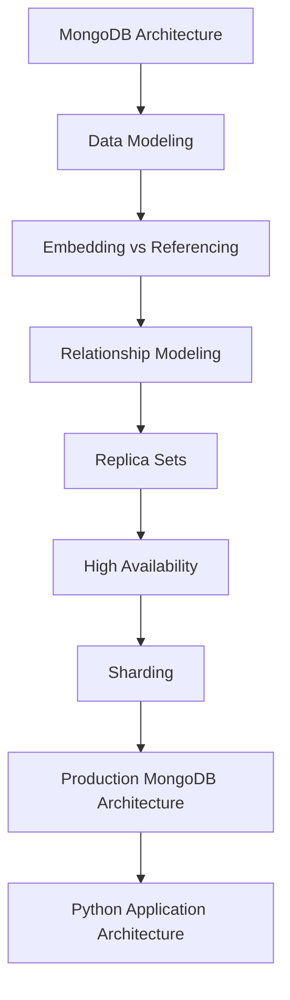

# README

## Overview

This section contains MongoDB architecture documentation focused on designing reliable, scalable, maintainable systems around MongoDB.

The architecture material progresses from core MongoDB architecture concepts through replication, high availability, sharding, production architecture, and Python application integration.

The primary focus is not simply how MongoDB works, but how backend engineers should make architectural decisions around:

- Data distribution
- Replication and high availability
- Scalability
- Application-to-database boundaries
- Python integration
- Failure handling
- Performance
- Security
- Production operations

## Navigation

| # | File | Description |
|---|---|---|
| 01 | [01- MongoDB Architecture](./01-%20MongoDB%20Architecture.md) | MongoDB architecture fundamentals, server components, document model, and core architectural concepts |
| 02 | [02- Data Modeling Patterns](./02-%20Data%20Modeling%20Patterns.md) | Query-driven schema design, embedding, referencing, denormalization, cardinality, and access patterns |
| 03 | [03- Embedded vs Referenced Documents](./03-%20Embedded%20vs%20Referenced%20Documents.md) | Architectural trade-offs between embedding and referencing documents |
| 04 | [04- One-to-One Relationships](./04-%20One-to-One%20Relationships.md) | Modeling one-to-one relationships with embedding and references |
| 05 | [05- One-to-Many Relationships](./05-%20One-to-Many%20Relationships.md) | Modeling bounded and unbounded one-to-many relationships, indexing, and document growth |
| 06 | [06- Many-to-Many Relationships](./06-%20Many-to-Many%20Relationships.md) | Modeling many-to-many relationships, association collections, indexing, and scalability |
| 07 | [07- Replica Set Architecture](./07-%20Replica%20Set%20Architecture.md) | Replica sets, primary/secondary topology, elections, replication, oplog, and failover |
| 08 | [08- High Availability Architecture](./08-%20High%20Availability%20Architecture.md) | MongoDB high availability, failure domains, elections, multi-region considerations, and disaster recovery |
| 09 | [09- Sharding Architecture](./09-%20Sharding%20Architecture.md) | Horizontal scaling, shard keys, query targeting, balancing, resharding, and production shard-key design |
| 10 | [10- Production MongoDB Architecture](./10-%20Production%20MongoDB%20Architecture.md) | End-to-end production architecture covering security, networking, performance, observability, and operations |
| 11 | [11- Python Application Architecture with MongoDB](./11-%20Python%20Application%20Architecture%20with%20MongoDB.md) | Production Python application architecture, PyMongo, FastAPI, Django, repositories, and observability |

## Architecture Progression

The documents are organized to build architectural understanding progressively:



## Architecture Areas

### Data Modeling

The first part focuses on designing MongoDB schemas around application access patterns.

Key topics include:

- Embedding vs referencing
- Relationship modeling
- Cardinality
- Document growth
- Denormalization
- Read-heavy workloads
- Write-heavy workloads
- Query-driven schema design
- Schema evolution

Start with [02- Data Modeling Patterns](02-%20Data%20Modeling%20Patterns.md) when designing a new MongoDB data model.

### High Availability

The replication and availability documents cover how MongoDB behaves under node failures and infrastructure problems.

Key topics include:

- Replica sets
- Primary and secondary nodes
- Elections
- Oplog replication
- Failover
- Replication lag
- Read preferences
- Write concerns
- Failure domains
- Multi-region architecture
- Recovery considerations

Start with [07- Replica Set Architecture](07-%20Replica%20Set%20Architecture.md) before studying [08- High Availability Architecture](08-%20High%20Availability%20Architecture.md).

### Horizontal Scalability

The sharding material focuses on scaling MongoDB beyond the capacity of a single replica set.

Key topics include:

- Sharded clusters
- Shard keys
- Hashed and ranged sharding
- Query targeting
- Scatter-gather queries
- Balancing
- Hot shards
- Resharding
- Capacity planning

Start with [09- Sharding Architecture](09-%20Sharding%20Architecture.md) after understanding replica-set architecture.

### Production Architecture

The production architecture material combines the individual MongoDB concepts into a complete backend architecture.

It covers:

- Security
- Networking
- Performance
- Observability
- Capacity planning
- Backups
- Disaster recovery
- Deployment
- Kubernetes
- AWS
- MongoDB Atlas
- Operational runbooks
- Failure handling

See [10- Production MongoDB Architecture](10-%20Production%20MongoDB%20Architecture.md).

### Python Application Architecture

The final architecture document connects MongoDB infrastructure concepts to production Python backend systems.

It covers:

- PyMongo
- `MongoClient` lifecycle
- Connection pooling
- Repository pattern
- Service layer
- FastAPI
- Django
- Pydantic
- Transactions
- Retry and idempotency
- Pagination
- Aggregation
- Redis
- Kafka
- Celery
- Testing
- Observability
- Kubernetes deployment

See [11- Python Application Architecture with MongoDB](11-%20Python%20Application%20Architecture%20with%20MongoDB.md).

## Recommended Reading Order

For a structured architecture study path:

```text
MongoDB Architecture
        ↓
Data Modeling Patterns
        ↓
Embedded vs Referenced Documents
        ↓
One-to-One Relationships
        ↓
One-to-Many Relationships
        ↓
Many-to-Many Relationships
        ↓
Replica Set Architecture
        ↓
High Availability Architecture
        ↓
Sharding Architecture
        ↓
Production MongoDB Architecture
        ↓
Python Application Architecture with MongoDB
```

For practical backend application development, the relationship modeling documents can be studied selectively based on the application's data model.

## Architecture Decision Areas

When designing a MongoDB-backed system, the following sequence is useful:

| Decision | Primary Question |
|---|---|
| Data model | How will the application access the data? |
| Embedding vs referencing | Should related data live together or separately? |
| Indexes | Which queries must be efficient? |
| Consistency | What level of read/write consistency is required? |
| Transactions | Which business operations require atomicity across documents? |
| Replica set | How will the system handle node failure? |
| Sharding | When does horizontal scaling become necessary? |
| Application architecture | Where should MongoDB-specific behavior live? |
| Caching | Which reads can tolerate cached data? |
| Events | Which changes need asynchronous processing? |
| Security | Which applications and users can access which data? |
| Recovery | How will the system recover from data or infrastructure failure? |

## Production Architecture Principle

MongoDB architecture should be designed from application requirements rather than from database features alone.

A useful decision flow is:

```text
Business Requirements
        ↓
Access Patterns
        ↓
Data Model
        ↓
Query Patterns
        ↓
Indexes
        ↓
Consistency Requirements
        ↓
Replication / HA
        ↓
Scaling Strategy
        ↓
Application Architecture
        ↓
Observability + Operations
        ↓
Backup + Disaster Recovery
```

## Key Takeaways

- **MongoDB architecture should start with application access patterns and data modeling rather than infrastructure features.**
- **Replica sets provide the foundation for MongoDB high availability; sharding addresses horizontal scaling and introduces additional architectural complexity.**
- **Production architecture requires deliberate decisions around indexes, consistency, transactions, security, observability, backups, and failure recovery.**
- **Python applications should isolate MongoDB persistence through repositories and services while maintaining explicit control over connection lifecycle, retries, transactions, and performance.**
- **The architecture documents should be treated as a progression from data modeling fundamentals to distributed MongoDB systems and production application integration.**