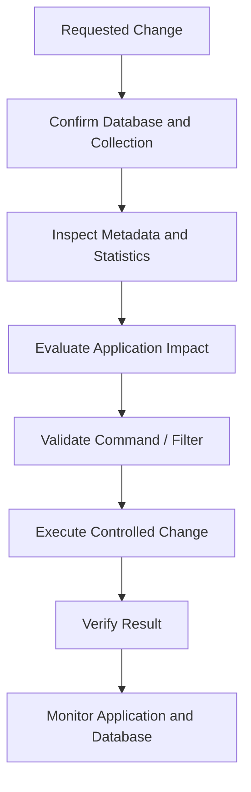

# 02- Database and Collection Commands

## Overview

MongoDB organizes data primarily through databases, collections, and documents.

For backend engineers, database and collection commands are useful for:

- Inspecting deployment state
- Creating and removing collections
- Inspecting collection configuration
- Reviewing collection statistics
- Managing indexes
- Applying schema validation
- Inspecting namespaces
- Investigating storage growth
- Performing controlled operational changes

The important distinction is between **database context** and **database lifecycle**.

Selecting a database with:

```javascript
use commerce
```

does not necessarily create it. MongoDB persists a database when data or metadata is actually created.

The basic hierarchy is:

```text
MongoDB Deployment
       │
       ├── Database
       │      ├── Collection
       │      │      ├── Document
       │      │      └── Document
       │      └── Collection
       │
       └── Database
```

## Database Context

Display the current database:

```javascript
db
```

More explicitly:

```javascript
db.getName()
```

Switch databases:

```javascript
use commerce
```

Verify the context before executing administrative commands:

```javascript
print(`Current database: ${db.getName()}`)
```

This is particularly important in production environments where the same command can be valid against development, staging, or production.

## List Databases

List databases visible to the current user:

```javascript
show dbs
```

Equivalent programmatic operation:

```javascript
db.getMongo().getDBNames()
```

The result depends on the authenticated user's privileges.

A database may not appear as expected if it has no persisted data or if the current user does not have sufficient permissions to view it.

## Database Creation

MongoDB does not normally require an explicit `CREATE DATABASE` command.

Selecting a database:

```javascript
use commerce
```

followed by inserting data:

```javascript
db.orders.insertOne({
  order_id: "order-1001",
  status: "pending"
})
```

causes MongoDB to persist the database and collection.

Conceptually:

```text
use commerce
      ↓
Database context selected
      ↓
insert document
      ↓
Collection exists
      ↓
Database persists
```

This differs from relational systems where database creation is normally an explicit DDL operation.

## Database Existence

There is no need to create an empty database merely to select it.

For operational verification:

```javascript
show dbs
```

or:

```javascript
db.getMongo().getDBNames()
```

Do not treat `use database_name` as proof that a database physically exists.

## Database Statistics

Inspect database statistics:

```javascript
db.stats()
```

A scaled version:

```javascript
db.stats({
  scale: 1024 * 1024
})
```

Common fields include:

| Field | Meaning |
|---|---|
| `collections` | Number of collections |
| `objects` | Approximate document count |
| `dataSize` | Logical data size |
| `storageSize` | Storage allocated |
| `indexes` | Number of indexes |
| `indexSize` | Index storage size |
| `avgObjSize` | Average document size |

The exact output depends on the MongoDB version and storage engine.

## Logical Size vs Storage Size

Database statistics expose multiple size concepts.

```text
Logical document data
        ↓
MongoDB storage engine
        ↓
Allocated storage
```

`dataSize` and `storageSize` should not be interpreted as identical measurements.

Storage-engine behavior, compression, indexes, and allocation strategy affect physical storage.

For capacity planning, use database statistics together with:

- Filesystem or managed-service metrics
- Storage growth trends
- Index size
- Backup size
- Replication requirements

## Database Namespaces

MongoDB identifies collections through namespaces conceptually represented as:

```text
database.collection
```

Example:

```text
commerce.orders
commerce.customers
```

A namespace is useful when reasoning about:

- Collection identity
- Administrative commands
- Index management
- Monitoring
- Backup and restore
- Sharded deployments

## Collection Listing

List collections:

```javascript
show collections
```

Programmatically:

```javascript
db.getCollectionNames()
```

Example:

```javascript
db.getCollectionNames().sort()
```

This is useful for quick inventory checks.

## Collection Creation

Explicitly create a collection:

```javascript
db.createCollection("orders")
```

MongoDB can also create collections implicitly:

```javascript
db.orders.insertOne({
  order_id: "order-1001"
})
```

Explicit creation becomes useful when collection configuration must be specified.

Examples include:

- Schema validation
- Capped collections
- Time-series collections
- Collection-level configuration

## Create a Collection with Validation

A collection can enforce a JSON Schema:

```javascript
db.createCollection("customers", {
  validator: {
    $jsonSchema: {
      bsonType: "object",
      required: [
        "email",
        "name"
      ],
      properties: {
        email: {
          bsonType: "string"
        },
        name: {
          bsonType: "string"
        }
      }
    }
  }
})
```

This provides database-level protection against malformed documents.

Application-level validation should still be used for API contracts and business rules.

## Validation Actions

MongoDB supports validation behavior such as:

```javascript
validationAction: "error"
```

or:

```javascript
validationAction: "warn"
```

`error` rejects documents that fail validation.

`warn` allows the operation while recording a validation warning according to MongoDB's validation behavior.

For production data integrity, strict validation is generally preferable when the schema is sufficiently stable.

## Validation Levels

MongoDB validation can be configured with levels such as:

```javascript
validationLevel: "strict"
```

or:

```javascript
validationLevel: "moderate"
```

The appropriate level depends on the migration and compatibility strategy.

During schema evolution, validation should be introduced carefully so existing legacy documents and rolling deployments are not unintentionally broken.

## Inspect Collection Configuration

Use:

```javascript
db.getCollectionInfos()
```

For a specific collection:

```javascript
db.getCollectionInfos({
  name: "orders"
})
```

This can expose collection metadata such as:

- Collection name
- Options
- Validator
- Validation level
- Validation action
- Collection type

## Collection Statistics

Inspect collection statistics:

```javascript
db.orders.stats()
```

Useful values include:

```text
count
size
storageSize
totalIndexSize
avgObjSize
nindexes
```

For capacity investigations:

```javascript
db.orders.stats({
  scale: 1024 * 1024
})
```

Use these values as operational indicators rather than assuming each field directly represents filesystem consumption.

## Collection Size Investigation

A practical investigation may look like:

```javascript
db.orders.stats({
  scale: 1024 * 1024
})
```

Then compare:

```text
Document count
Logical data size
Storage size
Index size
Average document size
```

A collection with modest document count can still consume significant storage if documents are large or heavily indexed.

## Count Documents

Preferred exact count for a filtered set:

```javascript
db.orders.countDocuments({
  status: "pending"
})
```

For the total number of documents:

```javascript
db.orders.countDocuments({})
```

Use an appropriate count operation for the question being asked.

Avoid using document counts as a substitute for full capacity analysis.

## Estimate Document Count

For operational estimation:

```javascript
db.orders.estimatedDocumentCount()
```

This is useful when an approximate total is sufficient and can avoid the cost of an exact filtered count.

Use:

```text
countDocuments()
```

when the exact filtered result matters.

Use:

```text
estimatedDocumentCount()
```

when an approximate collection-wide count is sufficient.

## Collection Options

Inspect collection metadata:

```javascript
db.getCollectionInfos({
  name: "orders"
})
```

Collection options may include configuration related to:

- Validation
- Capped collections
- Time-series collections
- Other collection-specific behavior

Do not change collection options casually in production.

## Capped Collections

A capped collection has a fixed storage size and maintains insertion order characteristics.

Example:

```javascript
db.createCollection("audit_buffer", {
  capped: true,
  size: 10485760
})
```

Capped collections can be appropriate for bounded, append-oriented workloads.

They are not a general replacement for normal application collections.

Consider:

- Fixed capacity
- Update restrictions
- Retention semantics
- Consumer behavior
- Recovery requirements

before using them.

## Time-Series Collections

MongoDB supports time-series collections for time-oriented measurements.

Example:

```javascript
db.createCollection("metrics", {
  timeseries: {
    timeField: "timestamp",
    metaField: "service",
    granularity: "minutes"
  }
})
```

Typical data:

```javascript
db.metrics.insertOne({
  timestamp: new Date(),
  service: "orders-api",
  latency_ms: 42
})
```

Time-series collections should be used when the workload matches MongoDB's time-series model rather than simply because documents contain timestamps.

## Rename a Collection

Rename:

```javascript
db.orders.renameCollection("orders_archive")
```

This changes the collection name within the database.

Before executing a rename, verify:

```javascript
db.getCollectionNames()
```

and inspect application dependencies.

A collection rename can break:

- Application queries
- Background workers
- Monitoring
- ETL jobs
- Change-stream consumers
- Backup procedures

Treat renames as schema changes.

## Drop a Collection

Drop:

```javascript
db.orders.drop()
```

The operation is destructive.

Before dropping:

```javascript
db.orders.countDocuments({})
```

Inspect sample documents:

```javascript
db.orders.find({}).limit(5)
```

Verify the database:

```javascript
db.getName()
```

Then execute the drop only after confirming the target.

## Drop a Database

To drop the current database:

```javascript
db.dropDatabase()
```

This is highly destructive.

Before executing:

```javascript
print(`Database: ${db.getName()}`)
show collections
```

Database deletion should normally require explicit operational approval in production environments.

## Collection-Level Index Inspection

List indexes:

```javascript
db.orders.getIndexes()
```

A collection normally has an `_id` index.

Create an index:

```javascript
db.orders.createIndex({
  customer_id: 1
})
```

Create a compound index:

```javascript
db.orders.createIndex({
  customer_id: 1,
  created_at: -1
})
```

## Unique Index

Create a uniqueness constraint:

```javascript
db.customers.createIndex(
  {
    email: 1
  },
  {
    unique: true
  }
)
```

Before creating a unique index on existing data, check for duplicates.

For example:

```javascript
db.customers.aggregate([
  {
    $group: {
      _id: "$email",
      count: {
        $sum: 1
      }
    }
  },
  {
    $match: {
      count: {
        $gt: 1
      }
    }
  }
])
```

Creating the unique index without resolving existing duplicates can fail.

## Partial Index

A partial index applies to documents satisfying a filter.

```javascript
db.orders.createIndex(
  {
    customer_id: 1,
    created_at: -1
  },
  {
    partialFilterExpression: {
      status: "active"
    }
  }
)
```

Partial indexes can reduce index size and write overhead when only a subset of documents participates in important queries.

The query pattern must still be compatible with the partial filter for the index to be useful.

## Sparse Index

A sparse index contains entries only for documents where the indexed field exists.

```javascript
db.customers.createIndex(
  {
    secondary_email: 1
  },
  {
    sparse: true
  }
)
```

Do not treat sparse and partial indexes as interchangeable.

Partial indexes generally provide more expressive control.

## TTL Index

A TTL index can automatically expire documents based on a date field.

```javascript
db.sessions.createIndex(
  {
    expires_at: 1
  },
  {
    expireAfterSeconds: 0
  }
)
```

TTL indexes are useful for:

- Temporary sessions
- Short-lived tokens
- Ephemeral data
- Retention-controlled records

TTL deletion is asynchronous rather than an exact scheduled deletion mechanism.

Do not use TTL indexes when the business requires an exact deletion timestamp.

## Drop an Index

Inspect first:

```javascript
db.orders.getIndexes()
```

Drop by name:

```javascript
db.orders.dropIndex(
  "customer_id_1"
)
```

Do not drop an index simply because it appears unused during a short observation window.

Consider:

- Production query patterns
- Scheduled jobs
- Rare administrative operations
- Unique constraints
- TTL requirements
- Historical workload patterns

## Index Usage Statistics

Inspect index usage:

```javascript
db.orders.aggregate([
  {
    $indexStats: {}
  }
])
```

Index statistics should be interpreted over an appropriate observation period.

A low-use index may still be important for an infrequent but critical operation.

## Database-Level Collection Inventory

A practical inventory script:

```javascript
const database = db.getName()

print(`Database: ${database}`)

for (const collectionName of db.getCollectionNames().sort()) {
  print(`- ${collectionName}`)
}
```

For production automation, prefer structured output rather than relying on human-readable shell output when another system will consume the result.

## Collection Inventory with Statistics

A diagnostic script can inspect selected statistics:

```javascript
for (const name of db.getCollectionNames().sort()) {
  const stats = db.getCollection(name).stats()

  printjson({
    collection: name,
    count: stats.count,
    size: stats.size,
    storageSize: stats.storageSize,
    totalIndexSize: stats.totalIndexSize
  })
}
```

This is useful for quick capacity investigations.

For large deployments, avoid repeatedly collecting expensive diagnostics without a clear purpose.

## Get a Collection by Name

Instead of:

```javascript
db.orders
```

you can dynamically access a collection:

```javascript
const collectionName = "orders"

db.getCollection(collectionName)
```

This is useful in scripts where the collection name is stored in a variable.

## Database Handle

Get a database object:

```javascript
const commerce = db.getSiblingDB("commerce")
```

This is useful when a script needs to work with multiple databases without changing the global shell context.

Example:

```javascript
const commerce = db.getSiblingDB("commerce")
const audit = db.getSiblingDB("audit")

commerce.orders.find({
  status: "pending"
}).limit(10)

audit.events.find({
  type: "order.created"
}).limit(10)
```

This is safer for multi-database scripts than repeatedly changing the global `db` context.

## Cross-Database Inspection

A controlled inspection can use:

```javascript
const commerce = db.getSiblingDB("commerce")
const reporting = db.getSiblingDB("reporting")

printjson({
  commerceCollections: commerce.getCollectionNames(),
  reportingCollections: reporting.getCollectionNames()
})
```

Access is still controlled by MongoDB authorization.

The shell does not bypass permissions.

## Collection Names and Special Characters

For conventional collection names:

```javascript
db.orders.find()
```

For dynamically generated or unusual names:

```javascript
db.getCollection("orders-2026").find()
```

Prefer `getCollection()` when a collection name is dynamic.

Avoid designing application collection names that require unusual quoting or shell-specific handling unless there is a clear reason.

## Collection Validation Inspection

Inspect validation configuration:

```javascript
db.getCollectionInfos({
  name: "orders"
})
```

A useful operational check is:

```text
Collection
   ↓
Validator
   ↓
Validation level
   ↓
Validation action
```

Validation should complement application-level validation rather than replace all domain validation.

## Schema Validation Example

A more complete validator:

```javascript
db.createCollection("products", {
  validator: {
    $jsonSchema: {
      bsonType: "object",
      required: [
        "sku",
        "name",
        "price"
      ],
      properties: {
        sku: {
          bsonType: "string"
        },
        name: {
          bsonType: "string"
        },
        price: {
          bsonType: "decimal"
        },
        tags: {
          bsonType: "array",
          items: {
            bsonType: "string"
          }
        }
      }
    }
  },
  validationLevel: "strict",
  validationAction: "error"
})
```

The validator establishes structural expectations while the application remains responsible for domain rules such as:

```text
price > 0
sku format
business-specific state transitions
authorization
```

## Modifying Validation

Collection validation can be modified with `collMod`.

Example:

```javascript
db.runCommand({
  collMod: "products",
  validator: {
    $jsonSchema: {
      bsonType: "object",
      required: [
        "sku",
        "name",
        "price"
      ]
    }
  },
  validationLevel: "strict",
  validationAction: "error"
})
```

Treat validator changes as schema migrations.

Before applying a stricter validator, determine whether existing application versions can still write valid documents.

## Schema Migration Workflow

A safer migration sequence is:

```text
Current schema
     ↓
Analyze existing documents
     ↓
Deploy backward-compatible application
     ↓
Backfill data
     ↓
Validate data
     ↓
Apply stricter validator
     ↓
Deploy final application
```

Avoid introducing a strict validator before older application versions can satisfy it during a rolling deployment.

## Collection-Level Operational Workflow

A safe operational workflow is:



This pattern is appropriate for:

- Collection creation
- Collection rename
- Validator changes
- Index creation
- Index removal
- Data migrations
- Collection deletion

## Production Collection Changes

Collection changes can affect application behavior even when they are syntactically simple.

Examples:

```text
Rename collection
     ↓
Application queries fail
```

```text
Add unique index
     ↓
Existing duplicate data
     ↓
Index creation fails
```

```text
Add validator
     ↓
Older application version writes legacy document
     ↓
Write fails
```

```text
Drop index
     ↓
Query loses efficient access path
     ↓
Latency increases
```

Treat collection commands as production changes, not merely shell operations.

## Performance Considerations

Database and collection commands can have operational cost.

Be particularly careful with:

- Large collection scans
- Large aggregation pipelines
- Index creation
- Index removal
- Large updates
- Large deletes
- Collection statistics during heavy workloads
- Database-wide diagnostic commands

For query-related investigation, use:

```javascript
explain("executionStats")
```

For collection sizing:

```javascript
db.collection.stats()
```

For index inventory:

```javascript
db.collection.getIndexes()
```

Use the least expensive diagnostic command that answers the operational question.

## Index Creation Considerations

Indexes improve reads but consume:

- Memory
- Disk
- Write bandwidth
- Maintenance resources

A new index should be justified by a query pattern.

Example:

```text
Query:
customer_id + status + created_at sort
            ↓
Candidate compound index
            ↓
explain()
            ↓
Measure
            ↓
Deploy
            ↓
Monitor
```

Do not create indexes solely because fields are frequently queried independently.

## Collection Growth

Monitor growth over time rather than relying on a single snapshot.

Track:

```text
Document count
Logical data size
Storage size
Index size
Average document size
Growth rate
```

A useful capacity model is:

```text
Current storage
+
Expected data growth
+
Index growth
+
Replication overhead
+
Backup requirements
+
Operational headroom
```

## Large Collections

For large collections:

- Avoid unbounded scans.
- Use selective filters.
- Use appropriate indexes.
- Use projections.
- Prefer cursor-based processing.
- Batch large updates.
- Monitor query latency.
- Measure index size.
- Plan storage growth.

An operational command that works against 10,000 documents may become unsafe at 500 million documents.

## Database and Collection Security

Administrative commands are subject to MongoDB authorization.

Do not assume that access to a database automatically grants unrestricted administrative access.

Production roles should follow least privilege.

Example separation:

```text
Application User
    ↓
Application database access

Reporting User
    ↓
Read-only reporting access

Operations User
    ↓
Administrative access

Migration User
    ↓
Temporary elevated permissions
```

Use separate credentials and roles where practical.

## Backup Before Destructive Operations

For important production changes, establish the recovery path before execution.

Potential safeguards include:

- Tested backups
- Snapshots
- Managed backup policies
- Point-in-time recovery
- Document-level export for narrowly scoped changes

Do not assume `mongodump` alone satisfies production disaster-recovery requirements.

Recovery requirements should be driven by:

- RPO
- RTO
- Dataset size
- Operational constraints
- Managed-service capabilities

## Troubleshooting Database and Collection Commands

### Collection Does Not Appear

```text
Symptom
↓
Expected collection is missing
↓
Possible causes
    - Wrong database context
    - Collection does not exist
    - Insufficient permissions
    - Collection name mismatch
↓
Isolation strategy
↓
Check db.getName()
↓
Run db.getCollectionNames()
↓
Check db.getCollectionInfos()
↓
Verify authorization
↓
Root cause
↓
Corrective action
↓
Prevention
    - Explicit environment checks
    - Consistent naming
```

### Index Creation Fails

```text
Symptom
↓
createIndex() fails
↓
Possible causes
    - Duplicate values for unique index
    - Invalid index definition
    - Existing conflicting index
    - Resource constraints
↓
Isolation strategy
↓
Inspect getIndexes()
↓
Check duplicate values
↓
Review index specification
↓
Root cause
↓
Corrective action
↓
Prevention
    - Data validation
    - Migration testing
    - Index lifecycle management
```

### Write Rejected by Validator

```text
Symptom
↓
insertOne() or updateOne() fails validation
↓
Possible causes
    - Missing required field
    - Wrong BSON type
    - Invalid nested structure
    - Application/schema mismatch
↓
Isolation strategy
↓
Inspect getCollectionInfos()
↓
Review validator
↓
Inspect rejected document
↓
Root cause
↓
Corrective action
↓
Prevention
    - Application validation
    - Contract tests
    - Backward-compatible migrations
```

### Unexpected Storage Growth

```text
Symptom
↓
Database storage increases rapidly
↓
Possible causes
    - Document growth
    - High write volume
    - Index growth
    - Retention problem
    - Large embedded arrays
↓
Isolation strategy
↓
Run db.stats()
↓
Inspect collection stats
↓
Inspect index sizes
↓
Review document growth
↓
Root cause
↓
Corrective action
↓
Prevention
    - Capacity monitoring
    - Retention policies
    - Index review
    - Data modeling review
```

## Common Mistakes

| Mistake | Problem | Better approach |
|---|---|---|
| Assuming `use db` creates a database | Database context is confused with persistence | Verify with `show dbs` and actual data |
| Dropping a collection casually | Permanent data loss | Verify target and recovery strategy |
| Dropping a database from the wrong context | Potential catastrophic deletion | Print and verify `db.getName()` |
| Creating unique indexes without duplicate checks | Index creation can fail | Analyze duplicates first |
| Adding strict validation during rolling deployment | Older application versions may fail | Use backward-compatible schema migration |
| Removing indexes based on short observations | Rare workloads may regress | Measure over representative periods |
| Treating `countDocuments()` as capacity analysis | Count does not describe storage | Inspect collection and database statistics |
| Assuming TTL is exact-time deletion | Expiration is asynchronous | Use application workflow when exact timing matters |
| Running broad `updateMany()` | Large unintended mutation | Validate filter and sample first |
| Ignoring index storage | Read optimization increases storage/write cost | Review total index footprint |
| Using unusual collection names | Shell and tooling become harder to operate | Prefer conventional names |
| Using database commands without least privilege | Excessive operational access | Separate application and administrative roles |

## Quick Command Reference

| Task | Command |
|---|---|
| Current database | `db.getName()` |
| Switch database | `use commerce` |
| List databases | `show dbs` |
| Database statistics | `db.stats()` |
| List collections | `show collections` |
| Collection names | `db.getCollectionNames()` |
| Create collection | `db.createCollection("orders")` |
| Collection metadata | `db.getCollectionInfos()` |
| Collection statistics | `db.orders.stats()` |
| Count documents | `db.orders.countDocuments({})` |
| Estimated count | `db.orders.estimatedDocumentCount()` |
| Rename collection | `db.orders.renameCollection("orders_archive")` |
| Drop collection | `db.orders.drop()` |
| Drop database | `db.dropDatabase()` |
| List indexes | `db.orders.getIndexes()` |
| Create index | `db.orders.createIndex({ customer_id: 1 })` |
| Drop index | `db.orders.dropIndex("customer_id_1")` |
| Index usage | `db.orders.aggregate([{ $indexStats: {} }])` |
| Collection handle | `db.getCollection("orders")` |
| Database handle | `db.getSiblingDB("commerce")` |
| Server statistics | `db.serverStatus()` |
| Current operations | `db.currentOp()` |
| Replica-set status | `rs.status()` |
| Replica-set configuration | `rs.conf()` |
| Connection information | `db.hello()` |

## Interview Considerations

### Does `use database` create a database?

No. It changes the current database context. MongoDB persists the database when data or relevant metadata is created.

### How do you safely create a collection?

Use `createCollection()` when explicit configuration is required:

```javascript
db.createCollection("orders", {
  validator: {
    $jsonSchema: {
      bsonType: "object"
    }
  }
})
```

Otherwise, MongoDB can create collections implicitly when data is inserted.

### When should you explicitly create a collection?

When you need collection-specific configuration such as:

- Validation
- Capped behavior
- Time-series configuration
- Other collection options

### How do you inspect a collection before changing it?

Use:

```javascript
db.getCollectionInfos({
  name: "orders"
})
```

and:

```javascript
db.orders.stats()
```

Then inspect indexes:

```javascript
db.orders.getIndexes()
```

### What is the difference between `countDocuments()` and `estimatedDocumentCount()`?

`countDocuments()` performs an exact count for a specified filter.

`estimatedDocumentCount()` provides an estimated collection-wide count and is useful when exact filtering is unnecessary.

### How do you safely drop a collection?

Confirm:

```javascript
db.getName()
```

Then:

```javascript
db.getCollectionNames()
```

Then inspect:

```javascript
db.orders.countDocuments({})
```

and verify the recovery requirements before:

```javascript
db.orders.drop()
```

### How do indexes affect collection operations?

Indexes accelerate supported reads and sorts, but increase:

- Storage consumption
- Write overhead
- Memory pressure
- Index maintenance work

Therefore, index lifecycle is part of collection lifecycle management.

### How should schema validation be introduced into an existing production collection?

Use a staged migration:

```text
Analyze current data
    ↓
Make application backward compatible
    ↓
Backfill invalid/legacy data
    ↓
Validate
    ↓
Introduce validator
    ↓
Enforce strict validation
```

This avoids breaking rolling deployments.

## Key Takeaways

- **Database context, database persistence, collection creation, and collection configuration are separate concepts; `use` only changes the active context.**
- **Collection commands affect application behavior, indexes, validation, storage, and availability, so production changes should follow a controlled inspection → validation → execution → verification workflow.**
- **Indexes, validators, collection options, and schema changes should be treated as lifecycle-managed production infrastructure rather than ad-hoc shell configuration.**
- **Use collection and database statistics, index inspection, and targeted diagnostics to understand storage, performance, and operational behavior before making changes.**
- **Destructive commands such as `drop()`, `dropDatabase()`, broad updates, and index removal require explicit environment verification, appropriate privileges, and a tested recovery strategy.**