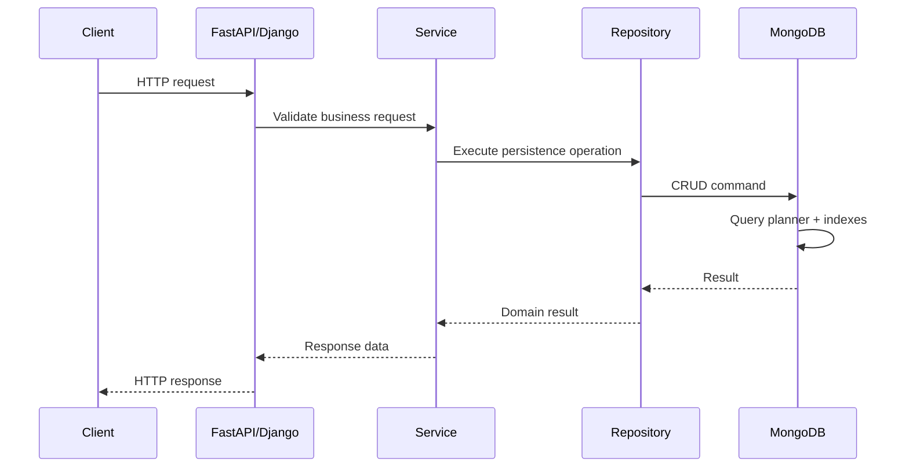
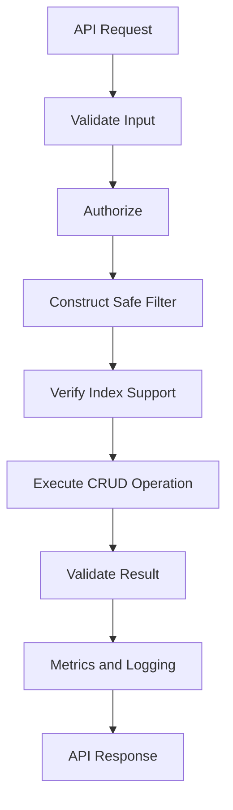

# 03- CRUD Commands

## Overview

MongoDB CRUD operations are the primary interface through which backend applications create, retrieve, modify, and remove documents.

CRUD stands for:

| Operation | MongoDB operations | Typical backend use |
|---|---|---|
| Create | `insertOne()`, `insertMany()` | Create resources |
| Read | `find()`, `findOne()` | Retrieve resources |
| Update | `updateOne()`, `updateMany()`, `replaceOne()` | Modify resources |
| Delete | `deleteOne()`, `deleteMany()` | Remove resources |

CRUD commands are simple syntactically but have significant implications for:

- Atomicity
- Index usage
- Query performance
- Concurrency
- Data consistency
- Idempotency
- Transactions
- API behavior
- Production reliability

A senior engineer should not only know the commands, but also understand **which operation matches the access pattern, how MongoDB executes it, what indexes it requires, and what failure modes it introduces**.

## CRUD Request Flow

A typical REST request passes through several layers before MongoDB executes the operation:



The repository layer should generally own MongoDB-specific persistence logic rather than spreading database commands throughout API handlers.

## Document Creation

### `insertOne()`

`insertOne()` inserts a single document.

```javascript
db.orders.insertOne({
  order_id: "ORD-10001",
  customer_id: "CUS-20001",
  status: "pending",
  total_amount: 1499.00,
  created_at: new Date()
})
```

MongoDB returns an acknowledgment and the generated or supplied `_id`.

Example result:

```javascript
{
  acknowledged: true,
  insertedId: ObjectId("...")
}
```

### When to Use

Use `insertOne()` when:

- Creating one resource
- Processing one event
- Persisting one request
- The application needs the inserted identifier

### Production Considerations

The operation is atomic at the individual-document level.

If the document contains embedded data:

```javascript
{
  order_id: "ORD-10001",
  customer: {
    id: "CUS-20001",
    name: "Customer A"
  },
  items: [
    {
      sku: "SKU-001",
      quantity: 2
    }
  ]
}
```

the entire document is written as one atomic document operation.

This is one reason MongoDB data modeling often favors embedding related data that is naturally accessed together.

## `insertMany()`

Insert multiple documents:

```javascript
db.orders.insertMany([
  {
    order_id: "ORD-10002",
    status: "pending",
    total_amount: 500
  },
  {
    order_id: "ORD-10003",
    status: "confirmed",
    total_amount: 1200
  }
])
```

Example result:

```javascript
{
  acknowledged: true,
  insertedIds: {
    "0": ObjectId("..."),
    "1": ObjectId("...")
  }
}
```

## Ordered vs Unordered Inserts

By default, bulk inserts are ordered.

```javascript
db.orders.insertMany(
  [
    { order_id: "ORD-1" },
    { order_id: "ORD-2" },
    { order_id: "ORD-3" }
  ],
  {
    ordered: true
  }
)
```

With:

```javascript
{
  ordered: false
}
```

MongoDB can continue processing remaining operations when an individual operation fails.

```javascript
db.orders.insertMany(
  [
    { order_id: "ORD-1" },
    { order_id: "ORD-2" },
    { order_id: "ORD-3" }
  ],
  {
    ordered: false
  }
)
```

### Choosing Ordered vs Unordered

| Mode | Behavior | Typical use |
|---|---|---|
| Ordered | Stops according to ordered bulk execution behavior after an error | Operations where sequence matters |
| Unordered | Attempts remaining operations | Independent bulk ingestion |

Unordered writes can improve throughput for independent records, but the application must correctly handle partial success.

## Insert Validation

Before inserting application data, validate:

- Required fields
- BSON types
- Business constraints
- Field formats
- Maximum sizes
- Authorization requirements

Database schema validation can provide an additional integrity boundary.

Example:

```javascript
db.orders.insertOne({
  order_id: "ORD-10004",
  total_amount: 1000,
  status: "pending"
})
```

If collection validation requires another field or BSON type, the operation can be rejected.

## Read Operations

MongoDB read operations are primarily based on a filter, optional projection, and optional cursor modifiers.

Conceptually:

```text
Filter
  ↓
Query planner
  ↓
Index selection
  ↓
Document access
  ↓
Projection
  ↓
Sort / limit / cursor
  ↓
Application
```

## `findOne()`

Retrieve one matching document:

```javascript
db.orders.findOne({
  order_id: "ORD-10001"
})
```

This is appropriate when:

- At most one document is expected
- The application needs a single resource
- A unique field identifies the document

Example:

```javascript
db.users.findOne({
  email: "user@example.com"
})
```

If multiple documents match, `findOne()` returns one matching document rather than enforcing uniqueness.

If uniqueness is required, enforce it with a unique index.

```javascript
db.users.createIndex(
  { email: 1 },
  { unique: true }
)
```

## `find()`

Retrieve multiple documents:

```javascript
db.orders.find({
  status: "pending"
})
```

The result is a cursor.

Do not think of `find()` as immediately loading the entire collection into application memory.

The cursor can be consumed incrementally.

```javascript
db.orders.find({
  status: "pending"
}).limit(100)
```

## Projection

Projection controls which fields are returned.

Include fields:

```javascript
db.orders.find(
  {
    status: "pending"
  },
  {
    order_id: 1,
    total_amount: 1,
    status: 1
  }
)
```

Exclude fields:

```javascript
db.users.find(
  {},
  {
    password_hash: 0,
    internal_metadata: 0
  }
)
```

Projection reduces unnecessary data transfer and can reduce application-side processing.

Be careful with sensitive fields. Projection should not be the only security boundary; authorization must determine what data the caller is allowed to access.

## `_id` and Projection

The `_id` field is included by default when using inclusion projection.

```javascript
db.orders.find(
  {},
  {
    order_id: 1,
    status: 1
  }
)
```

To exclude it:

```javascript
db.orders.find(
  {},
  {
    _id: 0,
    order_id: 1,
    status: 1
  }
)
```

MongoDB does not generally allow arbitrary mixing of inclusion and exclusion projection, except for `_id`.

## Comparison Operators

MongoDB supports comparison operators such as:

| Operator | Meaning |
|---|---|
| `$eq` | Equal |
| `$ne` | Not equal |
| `$gt` | Greater than |
| `$gte` | Greater than or equal |
| `$lt` | Less than |
| `$lte` | Less than or equal |
| `$in` | Matches one of supplied values |
| `$nin` | Does not match supplied values |

Example:

```javascript
db.orders.find({
  total_amount: {
    $gte: 1000,
    $lt: 5000
  }
})
```

Multiple conditions on the same field are combined according to MongoDB query semantics.

## `$in`

Find orders belonging to selected statuses:

```javascript
db.orders.find({
  status: {
    $in: ["pending", "processing", "confirmed"]
  }
})
```

`$in` is often preferable to constructing many `$or` branches for simple equality alternatives.

Large `$in` arrays can still create expensive queries.

## `$nin`

```javascript
db.orders.find({
  status: {
    $nin: ["cancelled", "deleted"]
  }
})
```

Negative predicates can be less selective and may be harder to optimize efficiently.

Always inspect the actual query plan for important production queries.

## Logical Operators

MongoDB provides logical operators including:

- `$and`
- `$or`
- `$nor`
- `$not`

### `$and`

Explicit form:

```javascript
db.orders.find({
  $and: [
    { status: "pending" },
    { total_amount: { $gte: 1000 } }
  ]
})
```

For straightforward predicates, implicit AND is usually clearer:

```javascript
db.orders.find({
  status: "pending",
  total_amount: { $gte: 1000 }
})
```

### `$or`

```javascript
db.orders.find({
  $or: [
    { status: "pending" },
    { status: "processing" }
  ]
})
```

For frequently executed `$or` queries, evaluate whether appropriate indexes exist for the individual branches.

## Element Operators

### `$exists`

Find documents containing a field:

```javascript
db.users.find({
  phone_number: {
    $exists: true
  }
})
```

This does not mean the field contains a useful value.

A document can contain:

```javascript
{
  phone_number: null
}
```

and still satisfy `$exists: true`.

### `$type`

Filter by BSON type:

```javascript
db.products.find({
  price: {
    $type: "decimal"
  }
})
```

This is useful when diagnosing inconsistent schemas.

## Array Queries

### Match an Array Element

```javascript
db.products.find({
  tags: "backend"
})
```

This can match an array containing `"backend"`.

### `$all`

Require multiple values:

```javascript
db.products.find({
  tags: {
    $all: ["backend", "python"]
  }
})
```

### `$size`

Match arrays with a specific length:

```javascript
db.products.find({
  tags: {
    $size: 3
  }
})
```

`$size` queries have indexing limitations and should not automatically be assumed to be efficient.

## `$elemMatch`

For arrays of embedded documents, `$elemMatch` is important.

Example document:

```javascript
{
  order_id: "ORD-10005",
  items: [
    {
      sku: "SKU-001",
      quantity: 3,
      price: 500
    },
    {
      sku: "SKU-002",
      quantity: 1,
      price: 200
    }
  ]
}
```

Query for an item satisfying both conditions:

```javascript
db.orders.find({
  items: {
    $elemMatch: {
      quantity: {
        $gte: 3
      },
      price: {
        $gte: 500
      }
    }
  }
})
```

`$elemMatch` ensures the conditions apply to the same array element.

## Embedded Document Queries

Exact embedded document matching:

```javascript
db.users.find({
  address: {
    city: "Kolkata",
    country: "India"
  }
})
```

This can be sensitive to the exact structure and field order of the embedded document.

For field-level matching, dot notation is usually more explicit:

```javascript
db.users.find({
  "address.city": "Kolkata",
  "address.country": "India"
})
```

## Dot Notation

Query nested fields:

```javascript
db.orders.find({
  "customer.email": "user@example.com"
})
```

Nested array fields can also be queried:

```javascript
db.orders.find({
  "items.sku": "SKU-001"
})
```

Nested query patterns should be designed together with appropriate indexes.

## Regular Expressions

Example:

```javascript
db.users.find({
  username: {
    $regex: "^admin"
  }
})
```

Regular expressions can become expensive, especially when they cannot use an efficient index path.

Potentially expensive:

```javascript
{
  username: {
    $regex: "admin"
  }
}
```

A prefix-oriented pattern can be more index-friendly in appropriate cases:

```javascript
{
  username: {
    $regex: "^admin"
  }
}
```

Do not expose arbitrary user-provided regular expressions directly to MongoDB without considering performance and abuse risks.

## Update Operations

MongoDB provides multiple update styles:

| Operation | Purpose |
|---|---|
| `updateOne()` | Modify one matching document |
| `updateMany()` | Modify all matching documents |
| `replaceOne()` | Replace the complete document |
| `findOneAndUpdate()` | Update and return a document |
| Upsert | Update existing or insert new |

Prefer targeted update operators when modifying selected fields.

## `updateOne()`

Example:

```javascript
db.orders.updateOne(
  {
    order_id: "ORD-10001"
  },
  {
    $set: {
      status: "confirmed",
      updated_at: new Date()
    }
  }
)
```

Example result:

```javascript
{
  acknowledged: true,
  matchedCount: 1,
  modifiedCount: 1
}
```

`matchedCount` and `modifiedCount` are different.

A document can match the filter while no actual value changes.

## `$set`

Update selected fields:

```javascript
db.users.updateOne(
  {
    _id: ObjectId("...")
  },
  {
    $set: {
      "profile.display_name": "Aranya"
    }
  }
)
```

Prefer `$set` over replacing a document when only a subset of fields needs modification.

## `$unset`

Remove a field:

```javascript
db.users.updateOne(
  {
    _id: ObjectId("...")
  },
  {
    $unset: {
      temporary_token: ""
    }
  }
)
```

This is useful during schema migrations.

## `$inc`

Increment a numeric value atomically:

```javascript
db.inventory.updateOne(
  {
    sku: "SKU-001"
  },
  {
    $inc: {
      quantity: -1
    }
  }
)
```

Atomic document updates are preferable to:

```text
read quantity
↓
calculate quantity - 1
↓
write quantity
```

because the latter creates a race window.

## `$min` and `$max`

Set a value only when the new value crosses a boundary:

```javascript
db.metrics.updateOne(
  {
    service: "orders-api"
  },
  {
    $min: {
      minimum_latency_ms: 25
    }
  }
)
```

Similarly:

```javascript
db.metrics.updateOne(
  {
    service: "orders-api"
  },
  {
    $max: {
      maximum_latency_ms: 250
    }
  }
)
```

## `$push`

Append to an array:

```javascript
db.orders.updateOne(
  {
    order_id: "ORD-10001"
  },
  {
    $push: {
      events: {
        type: "confirmed",
        created_at: new Date()
      }
    }
  }
)
```

Unbounded arrays can cause document growth problems.

Avoid turning a document into an ever-growing event store.

## `$addToSet`

Add an array value only if it does not already exist:

```javascript
db.users.updateOne(
  {
    user_id: "USR-1001"
  },
  {
    $addToSet: {
      roles: "admin"
    }
  }
)
```

This is useful for set-like arrays.

## `$pull`

Remove matching array elements:

```javascript
db.users.updateOne(
  {
    user_id: "USR-1001"
  },
  {
    $pull: {
      roles: "legacy-user"
    }
  }
)
```

## `$pop`

Remove the first or last array element:

```javascript
db.queue.updateOne(
  {
    queue_id: "payments"
  },
  {
    $pop: {
      items: -1
    }
  }
)
```

Use carefully because array-based queue implementations can have significant concurrency and scalability implications.

## Updating Nested Arrays

Use filtered positional updates when only matching array elements should change.

Example:

```javascript
db.orders.updateOne(
  {
    order_id: "ORD-10001"
  },
  {
    $set: {
      "items.$[item].status": "fulfilled"
    }
  },
  {
    arrayFilters: [
      {
        "item.sku": "SKU-001"
      }
    ]
  }
)
```

This avoids reading the document into the application merely to modify one embedded element.

## Positional Operator

For a matching array element:

```javascript
db.orders.updateOne(
  {
    order_id: "ORD-10001",
    "items.sku": "SKU-001"
  },
  {
    $set: {
      "items.$.status": "fulfilled"
    }
  }
)
```

Use filtered positional operators when multiple array elements may need independent matching rules.

## `updateMany()`

Update multiple matching documents:

```javascript
db.orders.updateMany(
  {
    status: "pending",
    created_at: {
      $lt: ISODate("2026-01-01")
    }
  },
  {
    $set: {
      status: "expired",
      updated_at: new Date()
    }
  }
)
```

### Production Warning

Always validate the filter before running `updateMany()`.

A missing filter:

```javascript
db.orders.updateMany(
  {},
  {
    $set: {
      status: "expired"
    }
  }
)
```

can modify every document.

For production migrations:

```text
Build filter
    ↓
Run find(filter).limit(...)
    ↓
Estimate affected count
    ↓
Test in staging
    ↓
Execute in controlled batches if required
    ↓
Verify modified count
```

## `replaceOne()`

`replaceOne()` replaces the complete document except for MongoDB's handling of the immutable `_id`.

Example:

```javascript
db.orders.replaceOne(
  {
    order_id: "ORD-10001"
  },
  {
    order_id: "ORD-10001",
    status: "confirmed",
    total_amount: 1499,
    updated_at: new Date()
  }
)
```

Fields not present in the replacement document are removed.

Use replacement when the application owns the complete document representation.

Do not use `replaceOne()` when only one or two fields should change.

## Update Operators vs Replacement

| Requirement | Recommended operation |
|---|---|
| Change one field | `$set` |
| Increment counter | `$inc` |
| Remove field | `$unset` |
| Add array element | `$push` |
| Add unique array value | `$addToSet` |
| Remove array elements | `$pull` |
| Replace complete document | `replaceOne()` |

## Upsert

An upsert updates a matching document or inserts one if no document matches.

```javascript
db.inventory.updateOne(
  {
    sku: "SKU-001"
  },
  {
    $set: {
      quantity: 100,
      updated_at: new Date()
    }
  },
  {
    upsert: true
  }
)
```

Conceptually:

```text
Find matching document
        │
        ├── Match → update
        │
        └── No match → insert
```

## Upsert and Uniqueness

If the application expects exactly one document per logical key, enforce that key with a unique index.

```javascript
db.inventory.createIndex(
  {
    sku: 1
  },
  {
    unique: true
  }
)
```

Application-side:

```text
check existence
↓
if missing → insert
```

is vulnerable to race conditions.

An atomic upsert combined with an appropriate unique index is safer.

## `findOneAndUpdate()`

Update a document and return the affected document:

```javascript
db.orders.findOneAndUpdate(
  {
    order_id: "ORD-10001"
  },
  {
    $set: {
      status: "processing",
      updated_at: new Date()
    }
  },
  {
    returnDocument: "after"
  }
)
```

This is useful when the application needs the updated document immediately.

Common use cases include:

- State transitions
- Atomic claim operations
- Counters
- Job acquisition
- Returning updated API resources

## Atomic Job Claim Example

A worker can atomically claim one available job:

```javascript
db.jobs.findOneAndUpdate(
  {
    status: "pending"
  },
  {
    $set: {
      status: "processing",
      worker_id: "worker-01",
      claimed_at: new Date()
    }
  },
  {
    sort: {
      created_at: 1
    },
    returnDocument: "after"
  }
)
```

This pattern is useful for simple work queues, but high-throughput distributed queues may be better served by dedicated systems such as Kafka or Redis depending on requirements.

## Delete Operations

### `deleteOne()`

Delete one matching document:

```javascript
db.orders.deleteOne({
  order_id: "ORD-10001"
})
```

Example result:

```javascript
{
  acknowledged: true,
  deletedCount: 1
}
```

Use `deleteOne()` when the target is expected to be unique.

### `deleteMany()`

Delete multiple matching documents:

```javascript
db.orders.deleteMany({
  status: "cancelled",
  created_at: {
    $lt: ISODate("2025-01-01")
  }
})
```

As with `updateMany()`, validate the filter carefully.

## Soft Delete

For many business systems, physical deletion is not appropriate.

Instead:

```javascript
db.users.updateOne(
  {
    user_id: "USR-1001"
  },
  {
    $set: {
      deleted_at: new Date()
    }
  }
)
```

Then application queries exclude deleted records:

```javascript
db.users.find({
  deleted_at: null
})
```

A production implementation should define whether missing and `null` values have the same semantic meaning and should use appropriate indexing.

## Pagination

### `skip()` and `limit()`

Basic pagination:

```javascript
db.orders.find({
  status: "confirmed"
})
.sort({
  created_at: -1
})
.skip(100)
.limit(20)
```

This is easy to implement but becomes increasingly expensive at deep offsets because the database still has to advance through skipped results.

### Cursor-Based Pagination

For large collections, prefer a stable cursor such as:

```text
created_at + _id
```

Example:

```javascript
db.orders.find({
  status: "confirmed",
  $or: [
    {
      created_at: {
        $lt: ISODate("2026-09-20T12:00:00Z")
      }
    },
    {
      created_at: ISODate("2026-09-20T12:00:00Z"),
      _id: {
        $lt: ObjectId("...")
      }
    }
  ]
})
.sort({
  created_at: -1,
  _id: -1
})
.limit(20)
```

This requires an index aligned with the access pattern.

```javascript
db.orders.createIndex({
  status: 1,
  created_at: -1,
  _id: -1
})
```

Cursor pagination is generally more predictable for large datasets.

## Sorting

Sort ascending:

```javascript
db.orders.find({
  status: "pending"
}).sort({
  created_at: 1
})
```

Sort descending:

```javascript
db.orders.find({
  status: "pending"
}).sort({
  created_at: -1
})
```

Large sorts can become expensive when an appropriate index cannot support the filter and sort pattern.

## Cursor Behavior

`find()` returns a cursor:

```javascript
const cursor = db.orders.find({
  status: "pending"
})

cursor.limit(100)
```

Consume documents incrementally:

```javascript
while (cursor.hasNext()) {
  printjson(cursor.next())
}
```

For application code, drivers expose language-specific cursor APIs.

Avoid materializing millions of documents into memory.

## Bulk Writes

MongoDB supports multiple operations in one bulk request.

```javascript
db.orders.bulkWrite([
  {
    insertOne: {
      document: {
        order_id: "ORD-10010",
        status: "pending"
      }
    }
  },
  {
    updateOne: {
      filter: {
        order_id: "ORD-10001"
      },
      update: {
        $set: {
          status: "confirmed"
        }
      }
    }
  },
  {
    deleteOne: {
      filter: {
        order_id: "ORD-OLD"
      }
    }
  }
])
```

Supported operation types include:

- `insertOne`
- `updateOne`
- `updateMany`
- `replaceOne`
- `deleteOne`
- `deleteMany`

## Ordered Bulk Writes

```javascript
db.orders.bulkWrite(
  [
    {
      updateOne: {
        filter: { order_id: "ORD-1" },
        update: { $set: { status: "confirmed" } }
      }
    },
    {
      updateOne: {
        filter: { order_id: "ORD-2" },
        update: { $set: { status: "confirmed" } }
    }
  ],
  {
    ordered: true
  }
)
```

Ordered execution can be appropriate when operation order matters.

## Unordered Bulk Writes

```javascript
db.orders.bulkWrite(
  [
    {
      updateOne: {
        filter: { order_id: "ORD-1" },
        update: { $set: { status: "confirmed" } }
      }
    },
    {
      updateOne: {
        filter: { order_id: "ORD-2" },
        update: { $set: { status: "confirmed" } }
      }
    }
  ],
  {
    ordered: false
  }
)
```

Unordered execution can improve throughput when operations are independent.

## Write Results

Typical result fields include:

| Field | Meaning |
|---|---|
| `acknowledged` | Whether MongoDB acknowledged the operation |
| `insertedId` | Identifier generated for an inserted document |
| `insertedCount` | Number inserted |
| `matchedCount` | Number matching update filters |
| `modifiedCount` | Number actually modified |
| `deletedCount` | Number deleted |
| `upsertedId` | Identifier created by an upsert |
| `upsertedCount` | Number of upserted documents |

Do not equate `matchedCount` with `modifiedCount`.

Example:

```javascript
db.orders.updateOne(
  {
    order_id: "ORD-10001",
    status: "confirmed"
  },
  {
    $set: {
      status: "confirmed"
    }
  }
)
```

The document can match while `modifiedCount` is zero.

## Write Concern

CRUD operations interact with MongoDB write concern.

Example:

```javascript
db.orders.withWriteConcern({
  w: "majority"
}).insertOne({
  order_id: "ORD-10020",
  status: "pending"
})
```

The appropriate write concern depends on the application's durability and availability requirements.

For important production writes, understand:

```text
Application
    ↓
MongoDB primary
    ↓
Replication
    ↓
Write acknowledgment
```

Do not choose write concern solely for maximum throughput.

## Read Preference

Read behavior can also depend on read preference.

Conceptually:

| Read preference | Typical behavior |
|---|---|
| `primary` | Read from primary |
| `primaryPreferred` | Prefer primary |
| `secondary` | Read from secondary |
| `secondaryPreferred` | Prefer secondary |
| `nearest` | Choose suitable low-latency member |

Reading from secondaries can introduce replication lag.

For user-facing workflows requiring read-after-write consistency, be careful about sending the subsequent read to a secondary.

## Atomicity

Single-document writes are atomic.

Example:

```javascript
db.accounts.updateOne(
  {
    account_id: "ACC-1001"
  },
  {
    $inc: {
      balance: -100
    }
  }
)
```

The update is atomic for that document.

However, multiple independent operations are not automatically one atomic unit:

```javascript
db.accounts.updateOne(...)
db.transactions.insertOne(...)
```

If both operations must succeed or fail together, consider a transaction or redesign the data model.

## Transactions

Transactions are useful when a business invariant spans multiple documents or collections.

Example:

```javascript
const session = db.getMongo().startSession()

try {
  session.startTransaction()

  session.getDatabase("banking")
    .accounts
    .updateOne(
      { account_id: "ACC-1001" },
      { $inc: { balance: -100 } }
    )

  session.getDatabase("banking")
    .transactions
    .insertOne({
      account_id: "ACC-1001",
      amount: -100,
      created_at: new Date()
    })

  session.commitTransaction()
} catch (error) {
  session.abortTransaction()
  throw error
} finally {
  session.endSession()
}
```

Transactions provide stronger consistency but introduce coordination and performance overhead.

Prefer single-document atomic updates when the business invariant can be modeled within one document.

## Query Explain

CRUD queries should be evaluated against production-like data and indexes.

Example:

```javascript
db.orders.find({
  customer_id: "CUS-1001",
  status: "confirmed"
}).explain("executionStats")
```

Important fields include:

```text
nReturned
totalKeysExamined
totalDocsExamined
executionTimeMillis
```

A useful optimization target is often:

```text
totalDocsExamined ≈ nReturned
```

This is not a universal requirement, but a large gap can indicate inefficient filtering.

## Example: Poor Query

```javascript
db.orders.find({
  customer_id: "CUS-1001"
}).sort({
  created_at: -1
})
```

Suppose the collection lacks a suitable index.

The planner may need to:

```text
COLLSCAN
   ↓
Filter documents
   ↓
SORT
   ↓
Return results
```

## Example: Indexed Query

Create:

```javascript
db.orders.createIndex({
  customer_id: 1,
  created_at: -1
})
```

The planner can potentially use:

```text
IXSCAN
   ↓
Ordered matching keys
   ↓
FETCH
   ↓
Return documents
```

The actual winning plan should always be verified with `explain()`.

## Covered Queries

A query may be covered when the required filter and returned fields can be satisfied from the index without fetching the full documents.

Example index:

```javascript
db.orders.createIndex({
  customer_id: 1,
  status: 1,
  order_id: 1
})
```

Query:

```javascript
db.orders.find(
  {
    customer_id: "CUS-1001",
    status: "confirmed"
  },
  {
    _id: 0,
    order_id: 1
  }
)
```

Whether the query is actually covered should be verified using `explain()`.

## Python CRUD Example

Using PyMongo:

```python
from datetime import datetime, timezone

from pymongo import MongoClient


client = MongoClient(
    "mongodb://localhost:27017",
    serverSelectionTimeoutMS=5000,
)

db = client["commerce"]
orders = db["orders"]

result = orders.insert_one(
    {
        "order_id": "ORD-20001",
        "customer_id": "CUS-1001",
        "status": "pending",
        "created_at": datetime.now(timezone.utc),
    }
)

print(result.inserted_id)
```

In production, create a long-lived `MongoClient` rather than creating a client for every request.

## Python Query

```python
order = orders.find_one(
    {
        "order_id": "ORD-20001",
    },
    {
        "_id": 1,
        "order_id": 1,
        "status": 1,
        "total_amount": 1,
    },
)
```

## Python Update

```python
result = orders.update_one(
    {
        "order_id": "ORD-20001",
    },
    {
        "$set": {
            "status": "confirmed",
            "updated_at": datetime.now(timezone.utc),
        }
    },
)

print(result.matched_count)
print(result.modified_count)
```

## Python Bulk Write

```python
from pymongo import UpdateOne

operations = [
    UpdateOne(
        {"order_id": "ORD-20001"},
        {"$set": {"status": "confirmed"}},
    ),
    UpdateOne(
        {"order_id": "ORD-20002"},
        {"$set": {"status": "confirmed"}},
    ),
]

result = orders.bulk_write(
    operations,
    ordered=False,
)

print(result.modified_count)
```

## REST API Mapping

A typical REST API can map operations as follows:

| HTTP operation | MongoDB operation |
|---|---|
| `POST /orders` | `insertOne()` |
| `GET /orders/{id}` | `findOne()` |
| `GET /orders` | `find()` |
| `PATCH /orders/{id}` | `updateOne()` |
| `PUT /orders/{id}` | `replaceOne()` |
| `DELETE /orders/{id}` | `deleteOne()` |

This mapping is conceptual rather than mandatory.

Business rules should remain in the service layer.

## Idempotency

CRUD operations must be designed around retry behavior.

A network failure can create ambiguity:

```text
Application
    ↓
insertOne()
    ↓
MongoDB commits write
    ↓
Network failure
    ↓
Application sees timeout
```

The application may not know whether the write succeeded.

For externally retried operations, use an idempotency strategy such as:

```javascript
db.requests.createIndex(
  {
    idempotency_key: 1
  },
  {
    unique: true
  }
)
```

Then use an atomic insert/upsert pattern to prevent duplicate processing.

## Optimistic Concurrency

MongoDB can implement optimistic concurrency using a version field.

Example document:

```javascript
{
  order_id: "ORD-10001",
  status: "pending",
  version: 4
}
```

Update:

```javascript
db.orders.updateOne(
  {
    order_id: "ORD-10001",
    version: 4
  },
  {
    $set: {
      status: "confirmed"
    },
    $inc: {
      version: 1
    }
  }
)
```

If:

```text
matchedCount = 0
```

another writer may have modified the document first.

This is useful for APIs and workflows where lost updates must be detected.

## Common CRUD Mistakes

| Mistake | Why it is dangerous | Better approach |
|---|---|---|
| Calling `find()` without limits | Large result sets can consume resources | Use pagination or controlled cursors |
| Using deep `skip()` pagination | Work increases with offset | Prefer cursor pagination |
| Running `updateMany({})` accidentally | Can modify entire collection | Validate filters before execution |
| Using `replaceOne()` for partial updates | Unspecified fields are removed | Use update operators |
| Relying on application uniqueness checks | Race conditions can create duplicates | Use unique indexes |
| Using unbounded `$push` arrays | Documents can grow excessively | Bound arrays or use separate collections |
| Using regex on arbitrary input | Can cause expensive queries | Validate patterns and design searchable fields |
| Ignoring `modifiedCount` | Match does not imply change | Inspect both counts |
| Reading from secondary immediately after a write | Replication lag can return stale data | Use appropriate read preference/consistency strategy |
| Creating MongoClient per request | Connection churn and resource waste | Reuse a client per process |
| Returning complete documents unnecessarily | More network and serialization cost | Use projection |
| Treating CRUD as inherently transactional | Multiple operations are not one atomic unit | Use a transaction or redesign the model |

## Production CRUD Workflow

For an important CRUD operation:



The database operation should be only one part of the request lifecycle.

## Security Considerations

CRUD operations should never bypass authorization.

For example, this query:

```javascript
db.orders.findOne({
  order_id: "ORD-10001"
})
```

only identifies a document.

The application must also establish whether the authenticated principal is allowed to access that order.

A safer service-layer pattern is conceptually:

```text
Authenticated user
      ↓
Determine tenant / ownership
      ↓
Construct authorization-aware filter
      ↓
MongoDB query
```

For a multi-tenant application:

```javascript
db.orders.findOne({
  tenant_id: "TENANT-001",
  order_id: "ORD-10001"
})
```

The tenant constraint should not be accidentally omitted.

## Multi-Tenant CRUD

A common pattern is to include the tenant identifier in queries and indexes.

```javascript
db.orders.createIndex({
  tenant_id: 1,
  order_id: 1
})
```

Query:

```javascript
db.orders.findOne({
  tenant_id: "TENANT-001",
  order_id: "ORD-10001"
})
```

This improves both isolation correctness and query targeting.

For stronger guarantees, centralize tenant scoping in the repository/service layer rather than relying on individual developers to remember the filter.

## Performance Checklist

For important CRUD operations:

- Identify the expected cardinality.
- Verify the query filter.
- Check appropriate indexes.
- Use projection when appropriate.
- Avoid unbounded result sets.
- Prefer cursor-based pagination for deep/large datasets.
- Measure with `explain("executionStats")`.
- Monitor latency and error rates.
- Consider document size.
- Consider write amplification from indexes.
- Re-evaluate query behavior as collection size grows.

## Troubleshooting CRUD Operations

### Insert Fails

```text
Symptom
↓
insertOne() or insertMany() fails
↓
Possible causes
    - Schema validation
    - Duplicate unique key
    - Invalid BSON value
    - Authorization failure
    - Connection/server issue
↓
Isolation strategy
↓
Inspect error type
↓
Inspect collection validator
↓
Check relevant indexes
↓
Verify connection and credentials
↓
Root cause
↓
Corrective action
↓
Prevention
    - Validation
    - Unique constraints
    - Integration tests
    - Monitoring
```

### Update Matches but Does Not Modify

```text
Symptom
↓
matchedCount > 0
modifiedCount = 0
↓
Possible causes
    - New value equals existing value
    - Update expression has no effective change
↓
Isolation strategy
↓
Read current document
↓
Compare target values
↓
Inspect update operators
↓
Root cause
↓
Corrective action
↓
Prevention
    - Interpret result fields correctly
    - Add application-level state checks where needed
```

### Query Is Slow

```text
Symptom
↓
High CRUD latency
↓
Possible causes
    - Missing index
    - Poor compound index
    - Low selectivity
    - Large documents
    - Blocking sort
    - Large result set
    - Resource contention
↓
Isolation strategy
↓
Run explain("executionStats")
↓
Inspect:
    nReturned
    totalKeysExamined
    totalDocsExamined
    executionTimeMillis
↓
Inspect indexes
↓
Root cause
↓
Corrective action
↓
Prevention
    - Query/index review
    - Performance regression testing
    - Monitoring
```

### Duplicate Documents Appear After Retries

```text
Symptom
↓
Same logical request created multiple documents
↓
Possible causes
    - Non-idempotent insert
    - Network timeout after successful write
    - Missing unique constraint
↓
Isolation strategy
↓
Identify logical business key
↓
Check duplicate records
↓
Review retry behavior
↓
Root cause
↓
Corrective action
↓
Prevention
    - Unique indexes
    - Idempotency keys
    - Atomic upserts
```

## Interview Considerations

### What is the difference between `updateOne()` and `replaceOne()`?

`updateOne()` applies update operators such as `$set`, `$inc`, and `$unset`.

`replaceOne()` replaces the complete document representation.

### Are MongoDB CRUD operations atomic?

Individual document operations are atomic.

Multiple documents or collections require a transaction when they must be treated as one atomic unit.

### Why is `matchedCount` different from `modifiedCount`?

A document can match the filter without changing because the update sets a value that is already present.

### Why are unique indexes important?

They enforce uniqueness at the database level and eliminate race conditions that application-only existence checks cannot reliably prevent.

### Why can `skip()` pagination become expensive?

The database may need to advance through increasingly large numbers of records before reaching the requested offset.

Cursor-based pagination uses a stable indexed boundary instead.

### When should you use `bulkWrite()`?

Use it when multiple independent CRUD operations can be submitted together, particularly for batch processing, migrations, and ingestion workflows.

### Why should `$inc` be preferred over read-modify-write for counters?

`$inc` performs the modification atomically on the document, avoiding a race between reading the old value and writing the new value.

### What should you check when a MongoDB CRUD operation is slow?

Start with:

```text
Query shape
↓
Index availability
↓
explain("executionStats")
↓
totalKeysExamined
totalDocsExamined
nReturned
executionTimeMillis
↓
Document size / result size
↓
Resource contention
```

## Key Takeaways

- **Choose CRUD operations according to the data mutation required: use update operators for partial changes, `replaceOne()` for complete replacement, and atomic operators such as `$inc` for concurrent updates.**
- **Query design and index design are inseparable; validate important CRUD operations with `explain("executionStats")` and monitor execution behavior as data volume grows.**
- **Use unique indexes, atomic upserts, and idempotency keys to make CRUD operations safe under retries and concurrent requests.**
- **Avoid unbounded reads, deep `skip()` pagination, uncontrolled array growth, and broad `updateMany()` or `deleteMany()` operations in production.**
- **Single-document CRUD operations are atomic, but multi-document business invariants require deliberate transaction design or a data model that keeps the invariant within one document.**