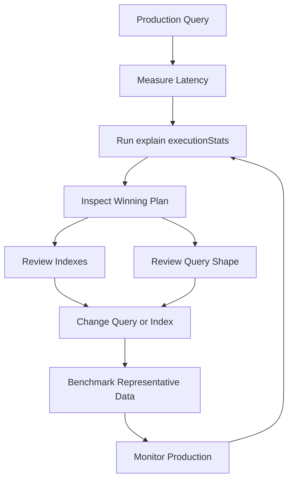

# 04- Query and Projection Commands

## Overview

MongoDB queries determine which documents are selected, while projections determine which fields from those documents are returned.

For backend systems, query design is more than knowing MongoDB operators. Query shape directly affects:

- Index selection
- CPU consumption
- Memory usage
- Network traffic
- Application serialization cost
- API latency
- Pagination behavior
- Scalability
- Security boundaries

A production query should therefore be designed together with its access pattern and indexes.

The basic execution model is:

```text
Query filter
    ↓
Query parser
    ↓
Query planner
    ↓
Candidate plans
    ↓
Winning plan
    ↓
Index scan / collection scan
    ↓
Document fetch
    ↓
Projection
    ↓
Sort / limit / cursor processing
    ↓
Application
```

## Query Structure

A typical MongoDB query has four conceptual components:

```javascript
db.orders.find(
  {
    status: "confirmed",
    customer_id: "CUS-1001"
  },
  {
    _id: 0,
    order_id: 1,
    total_amount: 1
  }
)
.sort({
  created_at: -1
})
.limit(20)
```

The components are:

| Component | Purpose |
|---|---|
| Filter | Determines matching documents |
| Projection | Determines returned fields |
| Sort | Determines result ordering |
| Limit | Restricts result count |

These operations should be considered together when designing indexes.

## Query Selectors

A query selector is the filter expression used to match documents.

Exact equality:

```javascript
db.orders.find({
  status: "confirmed"
})
```

Multiple fields:

```javascript
db.orders.find({
  status: "confirmed",
  customer_id: "CUS-1001"
})
```

MongoDB treats these field predicates as an implicit logical AND.

Equivalent explicit form:

```javascript
db.orders.find({
  $and: [
    { status: "confirmed" },
    { customer_id: "CUS-1001" }
  ]
})
```

The implicit form is generally simpler for ordinary equality predicates.

## Equality Queries

Equality is one of the most index-friendly query patterns.

```javascript
db.users.find({
  email: "user@example.com"
})
```

If the field is logically unique, enforce that requirement with a unique index:

```javascript
db.users.createIndex(
  {
    email: 1
  },
  {
    unique: true
  }
)
```

Do not rely on:

```text
find(email)
    ↓
if not found
    ↓
insert
```

as a uniqueness mechanism. Concurrent requests can both observe that the document does not exist.

## Comparison Operators

MongoDB provides comparison operators for range and inequality queries.

| Operator | Meaning |
|---|---|
| `$eq` | Equal |
| `$ne` | Not equal |
| `$gt` | Greater than |
| `$gte` | Greater than or equal |
| `$lt` | Less than |
| `$lte` | Less than or equal |
| `$in` | Matches any supplied value |
| `$nin` | Matches none of the supplied values |

### Range Query

```javascript
db.orders.find({
  total_amount: {
    $gte: 1000,
    $lt: 5000
  }
})
```

Range queries are particularly important for compound index design.

## `$in`

Use `$in` when a field should match one of several values:

```javascript
db.orders.find({
  status: {
    $in: [
      "pending",
      "processing",
      "confirmed"
    ]
  }
})
```

An appropriate index can make this efficient.

Very large `$in` arrays can still become expensive because MongoDB has to process many candidate values.

## `$nin`

```javascript
db.orders.find({
  status: {
    $nin: [
      "cancelled",
      "deleted"
    ]
  }
})
```

Negative predicates are often less selective than equality predicates.

Do not assume an index automatically makes a `$nin` query efficient. Verify with `explain()`.

## Logical Operators

MongoDB supports:

- `$and`
- `$or`
- `$nor`
- `$not`

### `$and`

```javascript
db.orders.find({
  $and: [
    {
      status: "confirmed"
    },
    {
      total_amount: {
        $gte: 1000
      }
    }
  ]
})
```

For simple conditions, implicit AND is usually preferable:

```javascript
db.orders.find({
  status: "confirmed",
  total_amount: {
    $gte: 1000
  }
})
```

### `$or`

```javascript
db.orders.find({
  $or: [
    {
      status: "pending"
    },
    {
      status: "processing"
    }
  ]
})
```

For important `$or` queries, inspect the execution plan and ensure the individual branches can be served efficiently.

## `$not`

`$not` applies a logical NOT to another operator expression.

```javascript
db.products.find({
  price: {
    $not: {
      $gt: 1000
    }
  }
})
```

Use negative predicates carefully because they can be difficult to optimize compared with positive, selective predicates.

## `$nor`

```javascript
db.orders.find({
  $nor: [
    {
      status: "cancelled"
    },
    {
      status: "deleted"
    }
  ]
})
```

This is useful when multiple conditions must all be false, but negative filtering should still be evaluated for selectivity and index behavior.

## Element Operators

### `$exists`

Find documents where a field exists:

```javascript
db.users.find({
  phone_number: {
    $exists: true
  }
})
```

`$exists: true` means the field is present. It does not mean the value is non-null or valid.

For example:

```javascript
{
  phone_number: null
}
```

still contains the field.

### `$type`

Filter based on BSON type:

```javascript
db.products.find({
  price: {
    $type: "decimal"
  }
})
```

This is useful for diagnosing schema inconsistencies in flexible-schema collections.

## Array Queries

MongoDB provides operators specifically for arrays.

### Match an Array Element

Given:

```javascript
{
  product_id: "PROD-001",
  tags: [
    "python",
    "backend",
    "mongodb"
  ]
}
```

Query:

```javascript
db.products.find({
  tags: "mongodb"
})
```

This matches documents whose `tags` array contains `"mongodb"`.

## `$all`

Require multiple array values:

```javascript
db.products.find({
  tags: {
    $all: [
      "python",
      "mongodb"
    ]
  }
})
```

This is useful when all specified values must exist in the array.

## `$size`

Match an exact array length:

```javascript
db.products.find({
  tags: {
    $size: 3
  }
})
```

Array length queries have indexing limitations. Do not assume a normal multikey index makes `$size` efficient.

## `$elemMatch`

`$elemMatch` is important when querying arrays of embedded documents.

Example:

```javascript
{
  order_id: "ORD-10001",
  items: [
    {
      sku: "SKU-001",
      quantity: 3,
      price: 500
    },
    {
      sku: "SKU-002",
      quantity: 1,
      price: 200
    }
  ]
}
```

Query:

```javascript
db.orders.find({
  items: {
    $elemMatch: {
      quantity: {
        $gte: 3
      },
      price: {
        $gte: 500
      }
    }
  }
})
```

The conditions apply to the same array element.

This distinction matters.

Without `$elemMatch`, separate conditions on fields inside an array can potentially match different elements.

## Embedded Document Queries

MongoDB supports nested field queries using dot notation.

```javascript
db.users.find({
  "profile.address.city": "Kolkata"
})
```

Another example:

```javascript
db.orders.find({
  "customer.email": "user@example.com"
})
```

Dot notation is generally preferable when only selected nested fields are relevant to the query.

## Exact Embedded Document Matching

An exact embedded document query can be written as:

```javascript
db.users.find({
  address: {
    city: "Kolkata",
    country: "India"
  }
})
```

This is more restrictive than querying individual nested fields and can depend on the exact embedded document structure.

For most application queries, prefer explicit nested fields:

```javascript
db.users.find({
  "address.city": "Kolkata",
  "address.country": "India"
})
```

## Querying `null`

MongoDB has important semantics around `null`.

Consider:

```javascript
db.users.find({
  phone_number: null
})
```

This can match documents where the field is `null` and documents where the field is absent.

If you specifically need the field to exist and contain `null`:

```javascript
db.users.find({
  phone_number: {
    $type: 10
  }
})
```

where BSON type `10` represents `null`.

This distinction matters in systems where missing and explicitly null fields have different business meanings.

## Regular Expressions

MongoDB supports regular expression queries.

```javascript
db.users.find({
  username: {
    $regex: "^admin"
  }
})
```

A prefix-oriented expression can potentially benefit from an appropriate index.

A contains-style expression:

```javascript
db.users.find({
  username: {
    $regex: "admin"
  }
})
```

can be much more expensive because the database may need to inspect a large portion of the index or collection.

### Production Considerations

Avoid directly passing arbitrary user-supplied regex patterns into database queries.

Risks include:

- High CPU consumption
- Poor latency
- Large scans
- Regular-expression abuse
- Resource exhaustion

For search-heavy requirements, consider dedicated search capabilities rather than turning MongoDB regex into a general-purpose search engine.

## Expression Queries

`$expr` allows aggregation expressions to be evaluated inside a query predicate.

Example:

```javascript
db.orders.find({
  $expr: {
    $gt: [
      "$total_amount",
      "$discount_limit"
    ]
  }
})
```

This is useful when comparison depends on multiple fields from the same document.

However, expression-based predicates can be less straightforward to optimize than simple field-to-constant predicates.

Use them when the business condition genuinely requires document-level expressions.

## Geospatial Queries

MongoDB supports geospatial queries for location-aware applications.

A common representation is GeoJSON:

```javascript
{
  location: {
    type: "Point",
    coordinates: [
      88.3639,
      22.5726
    ]
  }
}
```

Create a geospatial index:

```javascript
db.stores.createIndex({
  location: "2dsphere"
})
```

Query nearby stores:

```javascript
db.stores.find({
  location: {
    $near: {
      $geometry: {
        type: "Point",
        coordinates: [
          88.3639,
          22.5726
        ]
      },
      $maxDistance: 5000
    }
  }
})
```

The `2dsphere` index is appropriate for Earth-like geographic coordinates.

## Query Composition

Production queries are often composed from multiple dimensions.

Example:

```javascript
db.orders.find({
  tenant_id: "TENANT-001",
  status: {
    $in: [
      "pending",
      "processing"
    ]
  },
  total_amount: {
    $gte: 1000
  },
  "customer.region": "east"
})
```

Do not select indexes based only on the number of fields in the query.

The index should be designed around:

- Equality predicates
- Sort requirements
- Range predicates
- Cardinality
- Query frequency
- Write cost
- Result size

## Projection

Projection controls which fields MongoDB returns.

Example:

```javascript
db.orders.find(
  {
    status: "confirmed"
  },
  {
    order_id: 1,
    customer_id: 1,
    total_amount: 1,
    _id: 0
  }
)
```

Projection is particularly valuable for large documents.

Reducing the returned document size can decrease:

- Network traffic
- BSON decoding cost
- Python object creation
- JSON serialization cost
- API response size
- Application memory usage

Projection is therefore both a database optimization and an API design tool.

## Inclusion Projection

Include selected fields:

```javascript
db.users.find(
  {
    status: "active"
  },
  {
    user_id: 1,
    name: 1,
    email: 1
  }
)
```

The `_id` field remains included unless explicitly excluded.

```javascript
db.users.find(
  {},
  {
    user_id: 1,
    name: 1,
    _id: 0
  }
)
```

## Exclusion Projection

Exclude fields:

```javascript
db.users.find(
  {},
  {
    password_hash: 0,
    internal_metadata: 0
  }
)
```

This is useful when documents contain a small number of sensitive or very large fields that should not be returned.

## Inclusion vs Exclusion

MongoDB generally does not allow arbitrary mixing of inclusion and exclusion projections.

Valid:

```javascript
{
  name: 1,
  email: 1,
  _id: 0
}
```

Valid:

```javascript
{
  password_hash: 0,
  internal_metadata: 0
}
```

The `_id` field is the important exception.

## Projection Is Not Authorization

Projection should not replace authorization.

This is insufficient as an authorization strategy:

```javascript
db.users.findOne(
  {
    user_id: requested_id
  },
  {
    password_hash: 0
  }
)
```

The application must first determine whether the requester can access the user.

The correct conceptual flow is:

```text
Authentication
      ↓
Authorization
      ↓
Tenant / ownership constraints
      ↓
Database filter
      ↓
Projection
      ↓
Response serialization
```

## Sorting

Ascending sort:

```javascript
db.orders.find({
  status: "confirmed"
}).sort({
  created_at: 1
})
```

Descending sort:

```javascript
db.orders.find({
  status: "confirmed"
}).sort({
  created_at: -1
})
```

Sorting is frequently part of pagination queries.

## Stable Sorting

Sorting only by a timestamp can produce ambiguous ordering when multiple documents have the same timestamp.

Instead of:

```javascript
.sort({
  created_at: -1
})
```

use a deterministic secondary key where appropriate:

```javascript
.sort({
  created_at: -1,
  _id: -1
})
```

This is particularly useful for cursor-based pagination.

## Limit

Limit the number of returned documents:

```javascript
db.orders.find({
  status: "pending"
})
.limit(50)
```

API endpoints should normally impose a server-side maximum page size.

For example:

```text
requested limit = 10,000
server maximum = 100
effective limit = 100
```

Never trust client-provided pagination limits blindly.

## Skip

Basic offset pagination:

```javascript
db.orders.find({
  status: "confirmed"
})
.sort({
  created_at: -1
})
.skip(100)
.limit(20)
```

This is simple and useful for small datasets.

However, deep offsets can become expensive because MongoDB still has to advance through the skipped results.

Avoid:

```javascript
.skip(1000000)
```

for high-volume APIs unless the workload and query plan have been explicitly validated.

## Cursor-Based Pagination

For large datasets, use a stable cursor.

Suppose the API returns:

```json
{
  "items": [
    {
      "order_id": "ORD-10001",
      "created_at": "2026-09-20T10:00:00Z"
    }
  ],
  "next_cursor": "..."
}
```

The next request can use the last observed sort boundary.

For descending ordering:

```javascript
db.orders.find({
  status: "confirmed",
  $or: [
    {
      created_at: {
        $lt: ISODate("2026-09-20T10:00:00Z")
      }
    },
    {
      created_at: ISODate("2026-09-20T10:00:00Z"),
      _id: {
        $lt: ObjectId("...")
      }
    }
  ]
})
.sort({
  created_at: -1,
  _id: -1
})
.limit(20)
```

The corresponding index might be:

```javascript
db.orders.createIndex({
  status: 1,
  created_at: -1,
  _id: -1
})
```

The exact index should be validated with `explain()`.

## Cursor Behavior

`find()` returns a cursor rather than conceptually returning every matching document at once.

Example:

```javascript
const cursor = db.orders.find({
  status: "pending"
})

cursor.limit(100)
```

Applications should consume large result sets incrementally.

A dangerous application pattern is:

```python
orders = list(collection.find({}))
```

against a large production collection.

This can materialize a very large result set in application memory.

Prefer bounded queries or controlled cursor iteration.

## Query and Index Interaction

MongoDB's query planner evaluates candidate execution strategies.

For example:

```text
Query
  ↓
Available indexes
  ↓
Candidate plans
  ↓
Plan evaluation
  ↓
Winning plan
  ↓
Execution
```

A query can use:

- Collection scan (`COLLSCAN`)
- Index scan (`IXSCAN`)
- Index plus document fetch (`FETCH`)
- Index-supported sorting
- Other query execution stages

The goal is not simply "use an index".

The goal is to use an index that efficiently supports the actual query shape.

## Example: Filter and Sort

Query:

```javascript
db.orders.find({
  customer_id: "CUS-1001",
  status: "confirmed"
})
.sort({
  created_at: -1
})
.limit(20)
```

A candidate compound index:

```javascript
db.orders.createIndex({
  customer_id: 1,
  status: 1,
  created_at: -1
})
```

This index aligns the equality filters before the sort field.

Whether it is optimal depends on the complete workload.

## ESR Guideline

A useful MongoDB index design heuristic is ESR:

```text
Equality
Sort
Range
```

For example:

```javascript
db.orders.find({
  tenant_id: "TENANT-001",
  customer_id: "CUS-1001",
  total_amount: {
    $gte: 1000
  }
})
.sort({
  created_at: -1
})
```

A possible index is:

```javascript
db.orders.createIndex({
  tenant_id: 1,
  customer_id: 1,
  created_at: -1,
  total_amount: 1
})
```

However, ESR is a guideline rather than an automatic formula.

Real index selection depends on:

- Query selectivity
- Sort requirements
- Range behavior
- Data distribution
- Query frequency
- Index size
- Write workload

Always validate with actual plans and representative data.

## Covered Queries

A query can potentially be covered when the required filter and projected fields can be satisfied entirely from an index.

Example:

```javascript
db.orders.createIndex({
  customer_id: 1,
  status: 1,
  order_id: 1
})
```

Query:

```javascript
db.orders.find(
  {
    customer_id: "CUS-1001",
    status: "confirmed"
  },
  {
    _id: 0,
    order_id: 1
  }
)
```

If the execution plan does not require document fetching, this can reduce storage access.

Verify coverage with `explain()` rather than assuming it.

## Query Planner Diagnostics

Run:

```javascript
db.orders.find({
  customer_id: "CUS-1001",
  status: "confirmed"
}).explain("executionStats")
```

Important metrics include:

| Metric | Meaning |
|---|---|
| `nReturned` | Documents returned |
| `totalKeysExamined` | Index keys examined |
| `totalDocsExamined` | Documents examined |
| `executionTimeMillis` | Execution duration |
| `winningPlan` | Selected execution plan |
| `rejectedPlans` | Alternative candidate plans |

## `COLLSCAN`

`COLLSCAN` means MongoDB scanned the collection.

Example conceptual plan:

```text
COLLSCAN
   ↓
Read documents
   ↓
Apply filter
   ↓
Return matches
```

A collection scan is not automatically a problem.

It can be appropriate when:

- The collection is small
- A large percentage of documents must be returned
- An index would not provide meaningful selectivity

For large, selective production queries, however, an unexpected `COLLSCAN` deserves investigation.

## `IXSCAN`

`IXSCAN` indicates an index scan.

Conceptually:

```text
Index
  ↓
Matching keys
  ↓
Document references
  ↓
FETCH
  ↓
Returned documents
```

`IXSCAN` alone does not prove the query is efficient.

An index can still scan a large number of keys.

## `FETCH`

`FETCH` indicates that MongoDB needs to retrieve the underlying documents after using index entries.

A query that returns only a few fields may still require document fetches unless the index covers the query.

## `SORT`

A `SORT` stage can indicate MongoDB is performing an in-memory or otherwise explicit sort rather than obtaining results in the required order directly from an index.

For high-volume sorted queries, evaluate whether the index can support both filtering and ordering.

## Detecting Inefficient Queries

Consider:

```text
nReturned = 20
totalKeysExamined = 500,000
totalDocsExamined = 500,000
```

This is a strong signal that the query is doing substantially more work than the result size suggests.

By comparison:

```text
nReturned = 20
totalKeysExamined = 20
totalDocsExamined = 20
```

is generally much more efficient.

These are diagnostic indicators rather than universal pass/fail thresholds.

## Query Optimization Workflow



A senior-level workflow should avoid blindly adding indexes.

## Before and After Optimization

Suppose the query is:

```javascript
db.orders.find({
  tenant_id: "TENANT-001",
  status: "confirmed"
})
.sort({
  created_at: -1
})
.limit(20)
```

Initial behavior:

```text
nReturned: 20
totalDocsExamined: 850000
executionTimeMillis: 900
```

Potential index:

```javascript
db.orders.createIndex({
  tenant_id: 1,
  status: 1,
  created_at: -1
})
```

Afterward:

```text
nReturned: 20
totalDocsExamined: low
executionTimeMillis: significantly lower
```

The exact improvement must be measured rather than assumed.

## Projection and Performance

Consider a large document:

```javascript
{
  order_id: "ORD-10001",
  customer_id: "CUS-1001",
  items: [...],
  audit_history: [...],
  metadata: {...},
  internal_events: [...]
}
```

If an API only needs:

```javascript
{
  order_id: 1,
  status: 1,
  total_amount: 1,
  _id: 0
}
```

use projection:

```javascript
db.orders.find(
  {
    customer_id: "CUS-1001"
  },
  {
    order_id: 1,
    status: 1,
    total_amount: 1,
    _id: 0
  }
)
```

This reduces the amount of data that must cross the database/application boundary.

## Python Query Construction

Using PyMongo:

```python
from pymongo import MongoClient


client = MongoClient(
    "mongodb://localhost:27017",
    serverSelectionTimeoutMS=5000,
)

orders = client["commerce"]["orders"]

cursor = orders.find(
    {
        "tenant_id": "TENANT-001",
        "status": {
            "$in": ["pending", "processing"]
        },
        "total_amount": {
            "$gte": 1000
        },
    },
    {
        "_id": 1,
        "order_id": 1,
        "status": 1,
        "total_amount": 1,
    },
).sort(
    [
        ("created_at", -1),
        ("_id", -1),
    ]
).limit(20)

for order in cursor:
    print(order)
```

For long-lived backend services, reuse the `MongoClient` per process rather than constructing one per request.

## Safe Query Construction

Do not construct MongoDB queries by concatenating untrusted strings into JavaScript-like expressions.

Instead, build structured query objects.

Good:

```python
query = {
    "status": requested_status,
    "tenant_id": authenticated_tenant_id,
}
```

Then validate allowed values before sending the query.

For APIs, define an explicit mapping between supported request parameters and database fields.

## FastAPI Pagination Example

A production API should constrain client-controlled pagination.

```python
from fastapi import Query


async def list_orders(
    limit: int = Query(default=20, ge=1, le=100),
):
    ...
```

The database query should then enforce that maximum:

```python
cursor = orders.find(
    {
        "tenant_id": tenant_id,
        "status": "confirmed",
    },
    {
        "_id": 1,
        "order_id": 1,
        "status": 1,
        "created_at": 1,
    },
).sort(
    [
        ("created_at", -1),
        ("_id", -1),
    ]
).limit(limit)
```

The repository layer should own the database-specific query construction.

## Query Abstraction in a Repository

A repository method can expose a business-oriented interface:

```python
class OrderRepository:
    def __init__(self, collection):
        self.collection = collection

    def find_recent_confirmed(
        self,
        tenant_id: str,
        limit: int,
    ):
        return self.collection.find(
            {
                "tenant_id": tenant_id,
                "status": "confirmed",
            },
            {
                "_id": 1,
                "order_id": 1,
                "created_at": 1,
                "total_amount": 1,
            },
        ).sort(
            [
                ("created_at", -1),
                ("_id", -1),
            ]
        ).limit(limit)
```

This keeps MongoDB-specific query details out of controllers and service consumers.

## Query Design for Multi-Tenant Systems

Tenant isolation should be part of the query shape.

Avoid:

```javascript
db.orders.findOne({
  order_id: "ORD-10001"
})
```

when `order_id` is only unique within a tenant.

Prefer:

```javascript
db.orders.findOne({
  tenant_id: "TENANT-001",
  order_id: "ORD-10001"
})
```

Corresponding index:

```javascript
db.orders.createIndex({
  tenant_id: 1,
  order_id: 1
})
```

This improves both correctness and query performance.

## Query Operators Quick Reference

| Category | Operators |
|---|---|
| Comparison | `$eq`, `$ne`, `$gt`, `$gte`, `$lt`, `$lte`, `$in`, `$nin` |
| Logical | `$and`, `$or`, `$nor`, `$not` |
| Element | `$exists`, `$type` |
| Array | `$all`, `$elemMatch`, `$size` |
| Evaluation | `$expr`, `$regex` |
| Geospatial | `$near`, `$geoWithin`, `$geoIntersects` |
| Projection | Inclusion, exclusion, positional/array projection where applicable |

## Projection Quick Reference

| Requirement | Example |
|---|---|
| Include fields | `{name: 1, email: 1}` |
| Exclude fields | `{password_hash: 0}` |
| Exclude `_id` | `{_id: 0}` |
| Return API-specific fields | `{order_id: 1, status: 1, _id: 0}` |
| Reduce payload | Project only required fields |
| Sensitive data protection | Exclude sensitive fields, but enforce authorization separately |

## Common Mistakes

| Mistake | Problem | Better approach |
|---|---|---|
| Returning complete documents by default | Unnecessary I/O and serialization | Use projection |
| Using deep `skip()` | Increasing query work | Use cursor pagination |
| Assuming every indexed query is fast | Poor selectivity can still scan many keys | Inspect `explain()` |
| Ignoring sort requirements | Can introduce expensive sort stages | Design filter + sort indexes together |
| Using `$regex` for general search | Potentially expensive scans | Use appropriate search architecture |
| Treating `$exists` as non-null | Missing and null semantics differ | Explicitly model the requirement |
| Forgetting `_id` in inclusion projection | Unexpected identifier in response | Explicitly use `_id: 0` |
| Mixing inclusion and exclusion projection | Invalid or unintended projection | Follow MongoDB projection rules |
| Trusting client page size | Can create expensive queries | Enforce server-side limits |
| Omitting tenant filters | Possible cross-tenant data exposure | Centralize tenant-aware query construction |
| Querying arrays without understanding `$elemMatch` | Conditions can match different elements | Use `$elemMatch` when conditions belong to one array element |
| Building arbitrary query operators from user input | Query abuse and unexpected behavior | Whitelist supported filters and operators |

## Production Troubleshooting

### Slow Query

```text
Symptom
↓
API/database latency increases
↓
Possible causes
    - Missing index
    - Incorrect compound index
    - Low selectivity
    - Large result set
    - Expensive sort
    - Large documents
    - Resource contention
↓
Isolation strategy
↓
Capture exact query shape
↓
Run explain("executionStats")
↓
Inspect winningPlan
↓
Inspect nReturned
↓
Inspect totalKeysExamined
↓
Inspect totalDocsExamined
↓
Review indexes
↓
Root cause
↓
Corrective action
↓
Prevention
    - Query/index review
    - Performance tests
    - Slow-query monitoring
```

### Unexpected Full Collection Scan

```text
Symptom
↓
COLLSCAN appears in explain()
↓
Possible causes
    - Missing index
    - Query not selective
    - Index incompatible with query shape
    - Collection too small for index benefit
↓
Isolation strategy
↓
Inspect filter and sort
↓
List indexes
↓
Compare query shape with indexes
↓
Run explain("executionStats")
↓
Root cause
↓
Corrective action
↓
Prevention
    - Access-pattern-driven indexes
    - Query regression testing
```

### Incorrect Pagination Results

```text
Symptom
↓
Records duplicated or skipped between pages
↓
Possible causes
    - Non-deterministic sort
    - Mutable sort field
    - Concurrent writes
    - Incorrect cursor boundary
↓
Isolation strategy
↓
Inspect sort fields
↓
Add stable tie-breaker such as _id
↓
Inspect cursor encoding and decoding
↓
Root cause
↓
Corrective action
↓
Prevention
    - Stable compound sort
    - Cursor-based pagination
    - Immutable pagination boundary where practical
```

## Security Considerations

Query construction is part of the application's security boundary.

Important practices include:

- Enforce authentication before querying protected data.
- Apply authorization before constructing the final database filter.
- Always include tenant boundaries in multi-tenant applications.
- Whitelist supported query parameters.
- Avoid exposing arbitrary MongoDB operators through REST APIs.
- Avoid accepting arbitrary regular expressions.
- Use projection to minimize sensitive data exposure.
- Do not expose internal fields by default.
- Enforce server-side pagination limits.
- Use least-privilege MongoDB database roles.
- Monitor unusual query patterns.

A generic endpoint such as:

```text
GET /users?filter=<arbitrary MongoDB expression>
```

is usually a poor API design.

Prefer controlled application parameters:

```text
GET /users?status=active&role=admin
```

and translate those parameters into explicitly supported MongoDB filters.

## Scalability Considerations

Query scalability depends on the relationship between:

```text
Query volume
+
Data volume
+
Query selectivity
+
Index size
+
Document size
+
Result size
+
Available CPU / memory / storage
```

A query that performs well against 10,000 documents can behave very differently against 500 million documents.

For high-scale workloads:

- Design indexes from real access patterns.
- Monitor query latency continuously.
- Avoid unbounded queries.
- Use projections.
- Prefer cursor pagination.
- Keep documents reasonably sized.
- Avoid excessive index counts.
- Test queries against production-scale datasets.
- Reassess query plans after major data distribution changes.

## Interview Considerations

### What is the difference between a query and a projection?

A query determines which documents match.

A projection determines which fields from those documents are returned.

### Why can `skip()` pagination become slow?

MongoDB may need to advance through the skipped results before returning the requested page. The work can grow with the offset.

### What does `COLLSCAN` mean?

It indicates a collection scan.

It is not automatically bad, but for a large collection and selective query it is often a signal that the query or indexing strategy should be investigated.

### What does `IXSCAN` mean?

It indicates that MongoDB is scanning an index.

You still need to inspect the number of keys examined and documents fetched.

### What is `$elemMatch` used for?

It allows multiple conditions to be applied to the same element of an array, particularly arrays of embedded documents.

### Why is projection useful?

It reduces data returned from MongoDB and can reduce network transfer, decoding, application memory, and serialization overhead.

### Is an index always beneficial?

No.

Indexes consume storage and memory and add write/update overhead. An index should exist because it supports a meaningful access pattern.

### What should you inspect in `explain("executionStats")`?

At minimum:

```text
winningPlan
nReturned
totalKeysExamined
totalDocsExamined
executionTimeMillis
```

Then compare the observed work with the query's expected result size and access pattern.

## Key Takeaways

- **MongoDB query design must be evaluated together with indexing, sorting, projection, pagination, and expected data volume.**
- **Use `explain("executionStats")` to distinguish genuinely efficient queries from queries that merely happen to use an index.**
- **Projection reduces database-to-application payload and serialization cost, but it is not a substitute for authorization.**
- **Prefer stable cursor-based pagination for large datasets and use deterministic sort keys such as `created_at` plus `_id` where appropriate.**
- **Treat query construction as a production security boundary: enforce tenant isolation, whitelist filters, constrain pagination, and avoid exposing arbitrary MongoDB operators.**