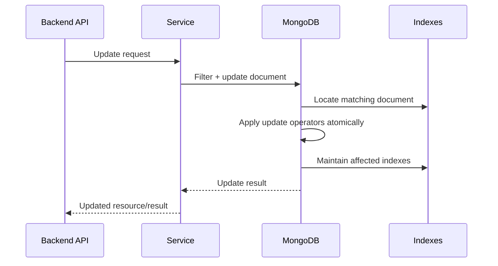
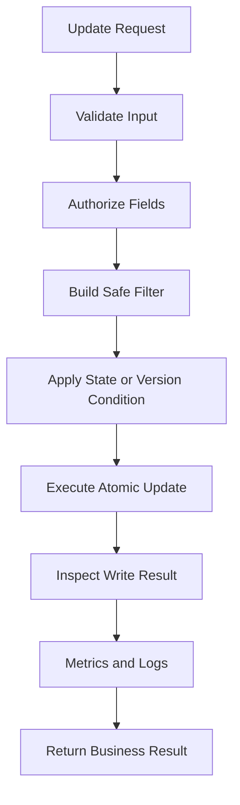

# 05- Update and Array Commands

## Overview

MongoDB update operations are designed around modifying documents in place rather than treating every change as a complete document replacement.

The update model is particularly powerful for backend systems because MongoDB provides atomic document-level operations such as:

- `$set`
- `$unset`
- `$inc`
- `$min`
- `$max`
- `$mul`
- `$rename`
- `$currentDate`
- `$push`
- `$addToSet`
- `$pop`
- `$pull`
- `$pullAll`

Array update operators are especially important because MongoDB commonly embeds related data directly inside documents.

A production engineer should understand not only the syntax of update operators, but also:

- Atomicity
- Concurrent updates
- Document growth
- Array cardinality
- Index implications
- Write amplification
- Schema evolution
- Idempotency
- Retry behavior
- Bulk updates
- Transaction boundaries

The central principle is:

```text
Prefer an atomic database-side update
over
read → modify in application → write
```

when the mutation can be expressed safely as a MongoDB update.

## Update Execution Model

A typical update follows this path:



The filter determines which document is modified.

The update document determines how it changes.

```javascript
db.orders.updateOne(
  {
    order_id: "ORD-10001"
  },
  {
    $set: {
      status: "confirmed"
    }
  }
)
```

Conceptually:

```text
Filter
  ↓
Find target document
  ↓
Apply update operators
  ↓
Maintain indexes
  ↓
Return write result
```

## Update Operation Types

| Operation | Purpose |
|---|---|
| `updateOne()` | Modify one matching document |
| `updateMany()` | Modify all matching documents |
| `replaceOne()` | Replace an entire document |
| `findOneAndUpdate()` | Update and return a document |
| `findOneAndReplace()` | Replace and return a document |
| Upsert | Update an existing document or insert a new one |
| `bulkWrite()` | Execute multiple write operations |

For partial changes, update operators are generally preferable to document replacement.

## `updateOne()`

Basic update:

```javascript
db.orders.updateOne(
  {
    order_id: "ORD-10001"
  },
  {
    $set: {
      status: "confirmed",
      updated_at: new Date()
    }
  }
)
```

Example result:

```javascript
{
  acknowledged: true,
  matchedCount: 1,
  modifiedCount: 1
}
```

`matchedCount` indicates how many documents matched the filter.

`modifiedCount` indicates how many documents actually changed.

These values can differ.

## Matching Without Modification

Consider:

```javascript
db.orders.updateOne(
  {
    order_id: "ORD-10001"
  },
  {
    $set: {
      status: "confirmed"
    }
  }
)
```

If the document already has:

```javascript
{
  status: "confirmed"
}
```

the operation can report:

```text
matchedCount = 1
modifiedCount = 0
```

This is not necessarily an error.

## `updateMany()`

Update multiple documents:

```javascript
db.orders.updateMany(
  {
    status: "pending",
    created_at: {
      $lt: ISODate("2026-01-01")
    }
  },
  {
    $set: {
      status: "expired",
      updated_at: new Date()
    }
  }
)
```

Use `updateMany()` when the same mutation intentionally applies to multiple documents.

### Production Safety

Always validate the filter before executing a broad update.

Safe workflow:

```text
Construct filter
      ↓
Run find(filter)
      ↓
Inspect sample documents
      ↓
Estimate affected count
      ↓
Test in staging
      ↓
Execute controlled update
      ↓
Verify result
```

A missing or incorrect filter can modify an entire collection.

## `$set`

`$set` changes a field or creates it if it does not exist.

```javascript
db.users.updateOne(
  {
    user_id: "USR-1001"
  },
  {
    $set: {
      "profile.display_name": "Aranya"
    }
  }
)
```

Nested fields can be updated using dot notation.

```javascript
db.users.updateOne(
  {
    user_id: "USR-1001"
  },
  {
    $set: {
      "preferences.notifications.email": true
    }
  }
)
```

### When to Use

Use `$set` when:

- Updating selected fields
- Adding optional fields
- Modifying nested values
- Evolving a document schema
- Updating resource state

## `$unset`

Remove a field:

```javascript
db.users.updateOne(
  {
    user_id: "USR-1001"
  },
  {
    $unset: {
      temporary_token: ""
    }
  }
)
```

The value assigned to `$unset` is ignored; the field is removed.

Useful cases include:

- Schema cleanup
- Removing deprecated fields
- Removing temporary metadata
- Data migrations

## `$inc`

`$inc` atomically increments a numeric field.

```javascript
db.inventory.updateOne(
  {
    sku: "SKU-001"
  },
  {
    $inc: {
      quantity: -1
    }
  }
)
```

Increment:

```javascript
{
  $inc: {
    view_count: 1
  }
}
```

Decrement:

```javascript
{
  $inc: {
    available_stock: -1
  }
}
```

This is safer under concurrency than:

```text
read value
↓
calculate value + 1
↓
write value
```

because the application-side approach can lose concurrent updates.

## Atomic Counter Pattern

Example:

```javascript
db.counters.updateOne(
  {
    name: "order_sequence"
  },
  {
    $inc: {
      value: 1
    }
  },
  {
    upsert: true
  }
)
```

This can implement simple atomic counters.

However, a single highly contended counter document can become a hot document under very high write concurrency.

## `$mul`

Multiply a numeric field:

```javascript
db.products.updateMany(
  {
    category: "electronics"
  },
  {
    $mul: {
      price: 1.10
    }
  }
)
```

This can be useful for controlled bulk adjustments.

For financial values, use an appropriate monetary representation and avoid floating-point calculations that can introduce precision problems.

## `$min`

Set a field only when the supplied value is lower than the current value.

```javascript
db.metrics.updateOne(
  {
    service: "orders-api"
  },
  {
    $min: {
      minimum_latency_ms: 25
    }
  }
)
```

Useful for tracking minimum observed values.

## `$max`

Set a field only when the supplied value is greater than the current value.

```javascript
db.metrics.updateOne(
  {
    service: "orders-api"
  },
  {
    $max: {
      maximum_latency_ms: 250
    }
  }
)
```

Useful for maximum values, thresholds, and high-water marks.

## `$rename`

Rename a field:

```javascript
db.users.updateMany(
  {},
  {
    $rename: {
      "profile.phone": "profile.phone_number"
    }
  }
)
```

Use `$rename` carefully in production because large migrations can generate substantial write load.

For large collections, consider:

- Batch processing
- Background migration strategies
- Compatibility windows
- Dual-read/dual-write migration patterns
- Monitoring

## `$currentDate`

Set a field to the current date:

```javascript
db.orders.updateOne(
  {
    order_id: "ORD-10001"
  },
  {
    $currentDate: {
      updated_at: true
    }
  }
)
```

This allows the database to generate the timestamp.

For distributed systems, define a consistent timestamp strategy across the application and database layers.

## Update Operator Reference

| Operator | Purpose |
|---|---|
| `$set` | Set or replace field value |
| `$unset` | Remove field |
| `$inc` | Increment/decrement numeric value |
| `$mul` | Multiply numeric value |
| `$min` | Set if new value is smaller |
| `$max` | Set if new value is larger |
| `$rename` | Rename field |
| `$currentDate` | Set current date/time |

## Array Updates

Arrays are one of MongoDB's most powerful modeling features.

Example:

```javascript
{
  order_id: "ORD-10001",
  items: [
    {
      sku: "SKU-001",
      quantity: 2,
      price: 500
    },
    {
      sku: "SKU-002",
      quantity: 1,
      price: 300
    }
  ]
}
```

Array updates allow individual elements or the array as a whole to be modified without replacing the entire document.

## `$push`

Append an element to an array.

```javascript
db.orders.updateOne(
  {
    order_id: "ORD-10001"
  },
  {
    $push: {
      events: {
        type: "confirmed",
        created_at: new Date()
      }
    }
  }
)
```

The operation is atomic for the document.

## `$push` with `$each`

Add multiple elements:

```javascript
db.orders.updateOne(
  {
    order_id: "ORD-10001"
  },
  {
    $push: {
      tags: {
        $each: [
          "priority",
          "enterprise"
        ]
      }
    }
  }
)
```

## `$push` with `$position`

Insert elements at a specific array position:

```javascript
db.orders.updateOne(
  {
    order_id: "ORD-10001"
  },
  {
    $push: {
      events: {
        $each: [
          {
            type: "created",
            created_at: new Date()
          }
        ],
        $position: 0
      }
    }
  }
)
```

This inserts the new elements at the beginning.

## `$push` with `$slice`

Limit array size:

```javascript
db.users.updateOne(
  {
    user_id: "USR-1001"
  },
  {
    $push: {
      recent_searches: {
        $each: [
          "mongodb"
        ],
        $slice: -20
      }
    }
  }
)
```

This keeps only the last 20 entries.

Bounded arrays are important when storing recent events, history, or activity snapshots.

## `$push` with `$sort`

Sort an array after adding elements:

```javascript
db.users.updateOne(
  {
    user_id: "USR-1001"
  },
  {
    $push: {
      recent_scores: {
        $each: [
          {
            score: 98,
            created_at: new Date()
          }
        ],
        $sort: {
          score: -1
        },
        $slice: 10
      }
    }
  }
)
```

This can maintain a bounded top-N structure.

## `$addToSet`

Add a value only if it is not already present.

```javascript
db.users.updateOne(
  {
    user_id: "USR-1001"
  },
  {
    $addToSet: {
      roles: "admin"
    }
  }
)
```

This is useful for set-like arrays.

## `$addToSet` with `$each`

Add multiple unique values:

```javascript
db.users.updateOne(
  {
    user_id: "USR-1001"
  },
  {
    $addToSet: {
      roles: {
        $each: [
          "admin",
          "auditor",
          "report-viewer"
        ]
      }
    }
  }
)
```

## `$pop`

Remove the first or last element.

Remove the last element:

```javascript
db.queue.updateOne(
  {
    queue_id: "payments"
  },
  {
    $pop: {
      items: 1
    }
  }
)
```

Remove the first element:

```javascript
db.queue.updateOne(
  {
    queue_id: "payments"
  },
  {
    $pop: {
      items: -1
    }
  }
)
```

This is useful for bounded arrays but should not automatically be treated as a replacement for a distributed queue.

## `$pull`

Remove array elements matching a condition.

```javascript
db.users.updateOne(
  {
    user_id: "USR-1001"
  },
  {
    $pull: {
      roles: "legacy-user"
    }
  }
)
```

For embedded documents:

```javascript
db.orders.updateOne(
  {
    order_id: "ORD-10001"
  },
  {
    $pull: {
      items: {
        quantity: {
          $lte: 0
        }
      }
    }
  }
)
```

## `$pullAll`

Remove multiple exact values:

```javascript
db.users.updateOne(
  {
    user_id: "USR-1001"
  },
  {
    $pullAll: {
      roles: [
        "legacy-user",
        "deprecated-role"
      ]
    }
  }
)
```

Use `$pull` when the removal condition is more expressive than an exact value list.

## Positional Array Operator

The positional `$` operator updates the first array element matching the query condition.

Example:

```javascript
db.orders.updateOne(
  {
    order_id: "ORD-10001",
    "items.sku": "SKU-001"
  },
  {
    $set: {
      "items.$.status": "fulfilled"
    }
  }
)
```

The filter identifies the relevant array element, and `$` refers to that matching element.

## Filtered Positional Operator

The filtered positional operator `$[identifier]` updates array elements matching `arrayFilters`.

Example:

```javascript
db.orders.updateOne(
  {
    order_id: "ORD-10001"
  },
  {
    $set: {
      "items.$[item].status": "fulfilled"
    }
  },
  {
    arrayFilters: [
      {
        "item.sku": {
          $in: [
            "SKU-001",
            "SKU-002"
          ]
        }
      }
    ]
  }
)
```

This is useful when multiple elements may satisfy the update condition.

## All-Elements Positional Operator

The `$[]` operator applies an update to every element in an array.

```javascript
db.orders.updateOne(
  {
    order_id: "ORD-10001"
  },
  {
    $inc: {
      "items.$[].quantity": 1
    }
  }
)
```

This modifies every array element.

Use carefully because a large array means a large number of values may be modified in a single document.

## Nested Array Updates

MongoDB supports filtered positional operators for nested array structures.

Example:

```javascript
{
  order_id: "ORD-10001",
  shipments: [
    {
      shipment_id: "SHP-001",
      items: [
        {
          sku: "SKU-001",
          status: "pending"
        }
      ]
    }
  ]
}
```

Update a nested item:

```javascript
db.orders.updateOne(
  {
    order_id: "ORD-10001"
  },
  {
    $set: {
      "shipments.$[shipment].items.$[item].status": "shipped"
    }
  },
  {
    arrayFilters: [
      {
        "shipment.shipment_id": "SHP-001"
      },
      {
        "item.sku": "SKU-001"
      }
    ]
  }
)
```

Complex nested array updates are a signal to reassess the document model if they become frequent.

## Array Operator Reference

| Operator | Purpose |
|---|---|
| `$push` | Append values |
| `$addToSet` | Append only if not already present |
| `$pop` | Remove first or last element |
| `$pull` | Remove elements matching a condition |
| `$pullAll` | Remove exact values |
| `$[]` | Update all array elements |
| `$` | Update first matching array element |
| `$[identifier]` | Update array elements matching `arrayFilters` |
| `$each` | Supply multiple values |
| `$slice` | Bound array size |
| `$sort` | Sort array elements after `$push` |
| `$position` | Control insertion position |

## Bounded Arrays

Unbounded arrays are a common MongoDB schema anti-pattern.

Problematic model:

```javascript
{
  user_id: "USR-1001",
  events: [
    // potentially millions of events
  ]
}
```

Every update increases the document size.

Potential problems include:

- Large document reads
- Expensive document rewrites
- Increased replication traffic
- Larger working-set requirements
- Document size limits
- Hot-document contention

A better design may be:

```text
users
  └── user document

user_events
  ├── event 1
  ├── event 2
  ├── event 3
  └── ...
```

Or maintain only a bounded recent-history array:

```javascript
{
  user_id: "USR-1001",
  recent_events: [
    // last 50 events
  ]
}
```

## Hot Documents

A hot document is repeatedly updated by many concurrent writers.

Example:

```javascript
{
  counter: 0
}
```

with thousands of concurrent:

```javascript
{
  $inc: {
    counter: 1
  }
}
```

Although `$inc` is atomic, the document can become a contention point.

Potential strategies include:

- Sharded counters
- Bucketed counters
- Time-based aggregation
- Event collection plus periodic aggregation
- Redis for ephemeral high-throughput counters
- Kafka for durable event ingestion

The correct design depends on durability and consistency requirements.

## Array Growth and Indexes

Multikey indexes allow indexing array fields.

Example:

```javascript
db.products.createIndex({
  tags: 1
})
```

If the array grows significantly, index maintenance also grows.

For arrays containing embedded documents:

```javascript
{
  items: [
    {
      sku: "SKU-001",
      quantity: 2
    }
  ]
}
```

an index such as:

```javascript
db.orders.createIndex({
  "items.sku": 1
})
```

becomes a multikey index.

Array-heavy schemas should therefore consider both document size and index amplification.

## Atomicity of Array Updates

A single update against one document is atomic.

Example:

```javascript
db.orders.updateOne(
  {
    order_id: "ORD-10001"
  },
  {
    $inc: {
      "items.$[item].quantity": -1
    }
  },
  {
    arrayFilters: [
      {
        "item.sku": "SKU-001"
      }
    ]
  }
)
```

The document update is atomic.

This is preferable to:

```text
Read document
↓
Modify array in application
↓
Write complete document
```

when the application does not need to replace the entire document.

## Optimistic Concurrency

A version field can protect against lost updates.

Example:

```javascript
{
  order_id: "ORD-10001",
  status: "pending",
  version: 7
}
```

Update:

```javascript
db.orders.updateOne(
  {
    order_id: "ORD-10001",
    version: 7
  },
  {
    $set: {
      status: "confirmed"
    },
    $inc: {
      version: 1
    }
  }
)
```

If:

```text
matchedCount = 0
```

the document may have been modified by another writer.

This pattern is useful for APIs where concurrent modifications must be detected rather than silently overwritten.

## State Transitions

Updates can enforce state-transition conditions directly in the filter.

Example:

```javascript
db.orders.updateOne(
  {
    order_id: "ORD-10001",
    status: "pending"
  },
  {
    $set: {
      status: "confirmed",
      updated_at: new Date()
    }
  }
)
```

The update succeeds only if the order is still pending.

This is stronger than:

```text
read status
↓
if pending:
    update
```

because the latter has a race window.

## Atomic Claim Pattern

This pattern is useful for worker systems.

```javascript
db.jobs.findOneAndUpdate(
  {
    status: "pending"
  },
  {
    $set: {
      status: "processing",
      worker_id: "worker-01",
      claimed_at: new Date()
    }
  },
  {
    sort: {
      created_at: 1
    },
    returnDocument: "after"
  }
)
```

The worker atomically changes the job state while retrieving the claimed document.

For high-throughput queues, evaluate whether Kafka, Redis, or a dedicated queueing system is more appropriate.

## Upsert with Updates

Upsert combines matching and insertion.

```javascript
db.inventory.updateOne(
  {
    sku: "SKU-001"
  },
  {
    $set: {
      quantity: 100,
      updated_at: new Date()
    }
  },
  {
    upsert: true
  }
)
```

If no matching document exists, MongoDB creates one using the relevant equality filter fields and update behavior.

For logical uniqueness, combine upserts with a unique index.

```javascript
db.inventory.createIndex(
  {
    sku: 1
  },
  {
    unique: true
  }
)
```

## `$setOnInsert`

`$setOnInsert` applies fields only when an upsert creates a new document.

```javascript
db.users.updateOne(
  {
    email: "user@example.com"
  },
  {
    $set: {
      last_login_at: new Date()
    },
    $setOnInsert: {
      created_at: new Date(),
      status: "active"
    }
  },
  {
    upsert: true
  }
)
```

This is useful when creation-time fields must not change on subsequent updates.

## Bulk Updates

Use `bulkWrite()` for multiple independent update operations.

```javascript
db.products.bulkWrite(
  [
    {
      updateOne: {
        filter: {
          sku: "SKU-001"
        },
        update: {
          $inc: {
            stock: 10
          }
        }
      }
    },
    {
      updateOne: {
        filter: {
          sku: "SKU-002"
        },
        update: {
          $inc: {
            stock: 20
          }
        }
      }
    }
  ],
  {
    ordered: false
  }
)
```

Unordered bulk execution can improve throughput when operations are independent.

## Update Pipelines

MongoDB also supports aggregation pipelines as the update specification.

Example:

```javascript
db.orders.updateMany(
  {
    status: "confirmed"
  },
  [
    {
      $set: {
        total_with_tax: {
          $multiply: [
            "$total_amount",
            1.18
          ]
        }
      }
    }
  ]
)
```

Pipeline-based updates are useful when the new value depends on existing document fields or requires more expressive transformation logic.

They should be used deliberately because they can be more complex than standard update operators.

## Update with `$expr`-Style Logic

For more complex updates, an update pipeline can calculate values from existing fields.

Example:

```javascript
db.products.updateMany(
  {
    category: "electronics"
  },
  [
    {
      $set: {
        discounted_price: {
          $multiply: [
            "$price",
            {
              $subtract: [
                1,
                "$discount_rate"
              ]
            }
          ]
        }
      }
    }
  ]
)
```

For financial systems, use an appropriate monetary representation such as `Decimal128` rather than binary floating-point values.

## Python Update Operations

Using PyMongo:

```python
from datetime import datetime, timezone

from pymongo import MongoClient


client = MongoClient(
    "mongodb://localhost:27017",
    serverSelectionTimeoutMS=5000,
)

orders = client["commerce"]["orders"]

result = orders.update_one(
    {
        "order_id": "ORD-10001",
        "status": "pending",
    },
    {
        "$set": {
            "status": "confirmed",
            "updated_at": datetime.now(timezone.utc),
        },
    },
)

if result.modified_count == 0:
    if result.matched_count == 0:
        print("Order was not in the expected state.")
    else:
        print("Order already had the target state.")
```

The filter contains the concurrency-sensitive state condition.

## Python Array Update

```python
result = orders.update_one(
    {
        "order_id": "ORD-10001",
    },
    {
        "$set": {
            "items.$[item].status": "fulfilled",
        },
    },
    array_filters=[
        {
            "item.sku": "SKU-001",
        }
    ],
)
```

This avoids retrieving and rewriting the complete document in Python.

## FastAPI Service Pattern

A FastAPI service can keep update logic in a repository:

```python
class OrderRepository:
    def __init__(self, collection):
        self.collection = collection

    def confirm_order(self, order_id: str):
        return self.collection.update_one(
            {
                "order_id": order_id,
                "status": "pending",
            },
            {
                "$set": {
                    "status": "confirmed",
                }
            },
        )
```

The service layer can then translate database results into business-level outcomes:

```text
matchedCount = 1
    ↓
state transition succeeded

matchedCount = 0
    ↓
not pending / not found / concurrent modification
```

This keeps persistence mechanics separate from API behavior.

## Update Validation

Application validation and MongoDB schema validation serve different purposes.

```text
API request
    ↓
Pydantic / Django validation
    ↓
Business rules
    ↓
MongoDB update
    ↓
MongoDB schema validation
```

Application validation provides better user-facing errors.

Database validation protects the persistence boundary.

Both can be useful in production.

## Schema Migration with Updates

Suppose old documents contain:

```javascript
{
  phone: "1234567890"
}
```

and the new schema requires:

```javascript
{
  phone_number: "1234567890"
}
```

A migration could use:

```javascript
db.users.updateMany(
  {
    phone: {
      $exists: true
    }
  },
  {
    $rename: {
      phone: "phone_number"
    }
  }
)
```

For large production collections, consider whether a live migration is safe before executing it.

Migration planning should account for:

- Collection size
- Write load
- Replication lag
- Index maintenance
- Lock/contention characteristics
- Rollback strategy
- Application compatibility
- Backup availability

## Avoid Read-Modify-Write

Avoid:

```python
document = collection.find_one({"order_id": order_id})

document["quantity"] += 1

collection.replace_one(
    {"_id": document["_id"]},
    document,
)
```

when the requirement is simply to increment a field.

Prefer:

```python
collection.update_one(
    {"order_id": order_id},
    {
        "$inc": {
            "quantity": 1,
        }
    },
)
```

The database can perform the mutation atomically.

## Update Performance

Updates have several costs:

```text
Filter matching
    ↓
Document access
    ↓
Document modification
    ↓
Index maintenance
    ↓
Replication
    ↓
Write acknowledgment
```

An update that modifies an indexed field can require additional index maintenance.

Therefore, excessive indexing can reduce write throughput.

## Large Document Updates

Updating a large document repeatedly can become expensive.

Example:

```javascript
{
  customer_id: "CUS-1001",
  profile: {...},
  history: [...],
  analytics: {...},
  events: [...]
}
```

If every request modifies a small field inside a very large document, the model may need reconsideration.

Potential alternatives:

- Split frequently changing data
- Move event history to a separate collection
- Keep only hot fields in the primary document
- Use bounded arrays
- Precompute read models

## Common Mistakes

| Mistake | Why it happens | Better approach |
|---|---|---|
| Read-modify-write for counters | Application developers treat MongoDB like an object store | Use `$inc` |
| `updateMany({})` without verification | Broad migration filter mistake | Validate filter and affected count |
| Using `replaceOne()` for small changes | Confusing replacement with update | Use update operators |
| Unbounded `$push` | Arrays are convenient for event storage | Bound arrays or use another collection |
| Updating large arrays frequently | Embedded model grows too large | Reconsider cardinality and access pattern |
| Ignoring `matchedCount` | Only `modifiedCount` is checked | Interpret both |
| Relying only on application validation | Database can receive writes from other clients | Add database validation where appropriate |
| No concurrency condition | Last writer silently wins | Use state/version predicates |
| Excessive indexes | Indexes are added reactively | Measure query patterns and write impact |
| Arbitrary user-controlled update operators | Flexible API implementation | Whitelist allowed update fields/operators |

## Security Considerations

Never expose raw MongoDB update operators directly through an untrusted API.

Avoid an API model such as:

```json
{
  "$set": {
    "role": "admin"
  }
}
```

where clients can submit arbitrary update documents.

Instead, expose controlled business operations:

```json
{
  "display_name": "New Name"
}
```

and map them internally:

```python
update = {
    "$set": {
        "profile.display_name": payload.display_name,
    }
}
```

This prevents clients from modifying fields they should not control.

Sensitive fields such as:

- Roles
- Tenant IDs
- Ownership fields
- Security flags
- Audit metadata
- Internal status fields

should be controlled by trusted service logic.

## Reliability and Retry Behavior

A network failure after an update creates an ambiguous outcome:

```text
Application
    ↓
updateOne()
    ↓
MongoDB applies update
    ↓
Network failure
    ↓
Application receives timeout
```

The application may not know whether the update succeeded.

For retryable operations:

- Prefer idempotent updates.
- Use deterministic state transitions.
- Use unique constraints where appropriate.
- Use version predicates for optimistic concurrency.
- Understand driver retry behavior.
- Avoid non-idempotent application-side logic around retried writes.

For example:

```javascript
{
  $set: {
    status: "confirmed"
  }
}
```

is naturally easier to retry safely than application logic that generates a different random value on every attempt.

## Monitoring Updates

Track:

- Update latency
- Update error rate
- Matched vs modified counts where meaningful
- Write throughput
- Replication lag
- Slow operations
- Connection pool saturation
- Document growth
- Index growth
- Storage growth

For high-volume bulk updates, monitor the database closely because a migration can compete with application traffic.

## Production Update Workflow



## Troubleshooting Updates

### Update Did Not Modify a Document

```text
Symptom
↓
modifiedCount = 0
↓
Possible causes
    - No document matched
    - Document already contained target value
    - Filter included an unexpected state condition
↓
Isolation strategy
↓
Inspect matchedCount
↓
Run find(filter)
↓
Inspect current document
↓
Review update expression
↓
Root cause
↓
Corrective action
↓
Prevention
    - Explicit result handling
    - State-transition tests
    - Concurrency tests
```

### Array Element Was Not Updated

```text
Symptom
↓
Expected array element did not change
↓
Possible causes
    - Incorrect array filter
    - Incorrect positional operator
    - Field path mismatch
    - Element does not exist
↓
Isolation strategy
↓
Read target document
↓
Inspect array structure
↓
Test filter independently
↓
Review arrayFilters
↓
Root cause
↓
Corrective action
↓
Prevention
    - Integration tests
    - Explicit array schemas
    - Representative test fixtures
```

### Document Growth Becomes Excessive

```text
Symptom
↓
Documents become large or updates slow down
↓
Possible causes
    - Unbounded arrays
    - Embedded event history
    - Excessive metadata
    - Repeated denormalized data
↓
Isolation strategy
↓
Inspect document size
↓
Inspect array cardinality
↓
Review update frequency
↓
Root cause
↓
Corrective action
    - Bound arrays
    - Split collections
    - Archive history
↓
Prevention
    - Document growth monitoring
    - Data modeling review
```

### Bulk Update Causes Production Impact

```text
Symptom
↓
Latency increases during migration
↓
Possible causes
    - Large updateMany()
    - Index maintenance
    - Replication pressure
    - Disk I/O saturation
    - Cache pressure
↓
Isolation strategy
↓
Inspect operation latency
↓
Check replication lag
↓
Check storage and CPU metrics
↓
Inspect affected document count
↓
Root cause
↓
Corrective action
    - Pause or throttle migration
    - Batch updates
    - Run during controlled windows
↓
Prevention
    - Staged migrations
    - Capacity testing
    - Operational runbooks
```

## Interview Considerations

### Why is `$inc` better than read-modify-write for counters?

`$inc` allows MongoDB to perform the numeric mutation atomically on the document, reducing race conditions between concurrent writers.

### What is the difference between `$push` and `$addToSet`?

`$push` adds a value regardless of whether it already exists.

`$addToSet` adds the value only when an equivalent value is not already present.

### When should you use `$elemMatch`?

Use it when multiple conditions must apply to the same element of an array, especially arrays containing embedded documents.

### What is the difference between `$`, `$[]`, and `$[identifier]`?

| Operator | Meaning |
|---|---|
| `$` | First array element matching the query |
| `$[]` | Every array element |
| `$[identifier]` | Array elements matching `arrayFilters` |

### Why are unbounded arrays dangerous?

They can cause documents to grow continuously, increasing storage, memory, replication, and update costs and potentially violating MongoDB's document size constraints.

### How can MongoDB prevent lost updates?

A common pattern is optimistic concurrency:

```javascript
{
  _id: "...",
  version: 7
}
```

Then:

```javascript
db.orders.updateOne(
  {
    _id: "...",
    version: 7
  },
  {
    $set: {
      status: "confirmed"
    },
    $inc: {
      version: 1
    }
  }
)
```

If no document matches, another writer may have changed the document.

### When should you use a transaction instead?

Use a transaction when the invariant genuinely spans multiple documents or collections and cannot be safely modeled as a single atomic document operation.

## Key Takeaways

- **Prefer atomic MongoDB update operators such as `$set`, `$inc`, `$unset`, and `$max` over application-side read-modify-write when the mutation can be expressed directly in the database.**
- **Use `$push`, `$addToSet`, `$pull`, `$[]`, and `$[identifier]` deliberately; unbounded or frequently modified arrays can become significant scalability and document-growth problems.**
- **Use state predicates, version fields, unique indexes, and idempotent update patterns to make concurrent and retried writes reliable.**
- **Treat `updateMany()`, schema migrations, and large array updates as operational workloads that require filter validation, monitoring, batching, and rollback planning.**
- **Keep update capabilities controlled at the service boundary; never allow untrusted clients to submit arbitrary MongoDB update operators or modify security-sensitive fields.**