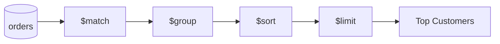
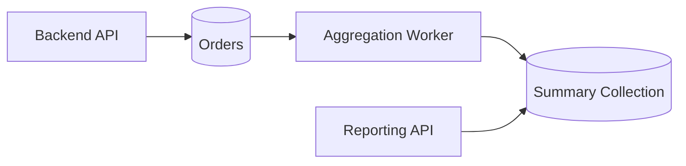
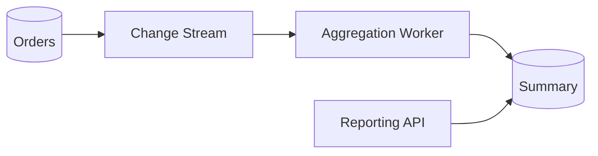

# 06- Aggregation Commands

## Overview

MongoDB aggregation is the primary mechanism for transforming, filtering, joining, grouping, and summarizing document data inside the database.

An aggregation pipeline processes documents through a sequence of stages:

```text
Collection
    ↓
$match
    ↓
$project / $set
    ↓
$unwind
    ↓
$group
    ↓
$sort
    ↓
$limit
    ↓
Application
```

Aggregation is particularly useful when the application needs derived data rather than raw documents, such as:

- Revenue reports
- Order summaries
- Time-series metrics
- API dashboards
- Grouped statistics
- Data transformations
- Analytics endpoints
- ETL workflows
- Cross-collection lookups

The major engineering advantage is that computation can happen close to the data rather than transferring large datasets to Python, Django, FastAPI, or another service.

However, aggregation is not automatically cheap. Poorly designed pipelines can consume substantial CPU, memory, disk I/O, and network resources.

A senior engineer should therefore treat aggregation as both a **query language and a workload design problem**.

## Aggregation Pipeline Model

An aggregation pipeline is an ordered list of stages.

Example:

```javascript
db.orders.aggregate([
  {
    $match: {
      status: "confirmed"
    }
  },
  {
    $group: {
      _id: "$customer_id",
      total_spend: {
        $sum: "$total_amount"
      }
    }
  },
  {
    $sort: {
      total_spend: -1
    }
  },
  {
    $limit: 10
  }
])
```

The data flow is:



Each stage receives the output of the previous stage.

This means pipeline ordering matters.

## Why Aggregation Matters

Without aggregation, an application might need to:

```text
Fetch thousands of documents
        ↓
Transfer over network
        ↓
Deserialize in Python
        ↓
Group in application
        ↓
Calculate totals
        ↓
Sort results
```

With aggregation:

```text
MongoDB
    ↓
Filter
    ↓
Group
    ↓
Calculate
    ↓
Sort
    ↓
Return small result set
```

The second approach can dramatically reduce application-side work and network traffic.

Aggregation should still be measured because complex pipelines can become database-intensive.

## Basic Aggregation Syntax

The general form is:

```javascript
db.collection.aggregate([
  {
    <stage>: {
      <expression>: <value>
    }
  },
  {
    <stage>: {
      <expression>: <value>
    }
  }
])
```

Example:

```javascript
db.orders.aggregate([
  {
    $match: {
      status: "confirmed"
    }
  }
])
```

Aggregation returns a cursor.

Large aggregation results should therefore be consumed incrementally rather than materialized blindly into application memory.

## `$match`

`$match` filters documents.

```javascript
db.orders.aggregate([
  {
    $match: {
      status: "confirmed",
      total_amount: {
        $gte: 1000
      }
    }
  }
])
```

It is conceptually similar to a SQL `WHERE` clause.

### Why `$match` Matters

Filtering early reduces the number of documents subsequent stages must process.

Prefer:

```javascript
[
  {
    $match: {
      status: "confirmed"
    }
  },
  {
    $group: {
      _id: "$customer_id",
      total: {
        $sum: "$total_amount"
      }
    }
  }
]
```

over processing the entire collection through expensive transformations before filtering.

### Index Interaction

An early `$match` can potentially use indexes when the pipeline structure allows MongoDB to use them.

For example:

```javascript
db.orders.createIndex({
  tenant_id: 1,
  status: 1
})
```

Pipeline:

```javascript
db.orders.aggregate([
  {
    $match: {
      tenant_id: "TENANT-001",
      status: "confirmed"
    }
  },
  {
    $group: {
      _id: "$customer_id",
      total: {
        $sum: "$total_amount"
      }
    }
  }
])
```

Verify actual index behavior with `explain()`.

## `$project`

`$project` controls the fields flowing through the pipeline.

```javascript
db.orders.aggregate([
  {
    $project: {
      order_id: 1,
      customer_id: 1,
      total_amount: 1,
      _id: 0
    }
  }
])
```

It can also calculate new fields:

```javascript
db.orders.aggregate([
  {
    $project: {
      order_id: 1,
      subtotal: "$total_amount",
      tax: {
        $multiply: [
          "$total_amount",
          0.18
        ]
      },
      _id: 0
    }
  }
])
```

Use `$project` when the pipeline needs a deliberate document shape.

## `$set`

`$set` adds or modifies fields.

```javascript
db.orders.aggregate([
  {
    $set: {
      total_with_tax: {
        $multiply: [
          "$total_amount",
          1.18
        ]
      }
    }
  }
])
```

`$set` is often easier to read than a `$project` stage when the pipeline should retain most existing fields.

## `$unset`

Remove fields from the pipeline:

```javascript
db.orders.aggregate([
  {
    $unset: [
      "internal_metadata",
      "debug_information"
    ]
  }
])
```

This is useful when preparing data for downstream stages or API responses.

## `$group`

`$group` combines documents by a grouping key.

Example:

```javascript
db.orders.aggregate([
  {
    $group: {
      _id: "$customer_id",
      order_count: {
        $sum: 1
      },
      total_spend: {
        $sum: "$total_amount"
      }
    }
  }
])
```

Example conceptual output:

```javascript
{
  _id: "CUS-1001",
  order_count: 15,
  total_spend: 24500
}
```

`$group` is conceptually similar to SQL `GROUP BY`.

## Grouping by Multiple Fields

Group by a compound logical key:

```javascript
db.orders.aggregate([
  {
    $group: {
      _id: {
        customer_id: "$customer_id",
        status: "$status"
      },
      order_count: {
        $sum: 1
      }
    }
  }
])
```

This is useful for multidimensional reporting.

## `$sum`

Count documents:

```javascript
{
  $sum: 1
}
```

Sum a field:

```javascript
{
  $sum: "$total_amount"
}
```

Example:

```javascript
db.orders.aggregate([
  {
    $group: {
      _id: "$status",
      total_revenue: {
        $sum: "$total_amount"
      }
    }
  }
])
```

## `$avg`

Calculate an average:

```javascript
db.orders.aggregate([
  {
    $group: {
      _id: "$customer_id",
      average_order_value: {
        $avg: "$total_amount"
      }
    }
  }
])
```

## `$min` and `$max`

```javascript
db.orders.aggregate([
  {
    $group: {
      _id: "$customer_id",
      minimum_order: {
        $min: "$total_amount"
      },
      maximum_order: {
        $max: "$total_amount"
      }
    }
  }
])
```

These are useful for ranges and operational statistics.

## `$first` and `$last`

These accumulators depend on pipeline ordering.

Example:

```javascript
db.orders.aggregate([
  {
    $sort: {
      customer_id: 1,
      created_at: 1
    }
  },
  {
    $group: {
      _id: "$customer_id",
      first_order: {
        $first: "$order_id"
      },
      last_order: {
        $last: "$order_id"
      }
    }
  }
])
```

Do not use `$first` or `$last` when the desired ordering has not been established.

## `$push`

Collect values into an array:

```javascript
db.orders.aggregate([
  {
    $group: {
      _id: "$customer_id",
      order_ids: {
        $push: "$order_id"
      }
    }
  }
])
```

This can become expensive if each group contains a large number of documents.

## `$addToSet`

Collect unique values:

```javascript
db.orders.aggregate([
  {
    $group: {
      _id: "$customer_id",
      products: {
        $addToSet: "$product_id"
      }
    }
  }
])
```

This is useful for distinct-value aggregation.

## `$sort`

Sort pipeline results:

```javascript
db.orders.aggregate([
  {
    $sort: {
      created_at: -1
    }
  }
])
```

Sorting large intermediate datasets can be expensive.

Whenever possible, reduce the number of documents before sorting:

```javascript
[
  {
    $match: {
      status: "confirmed"
    }
  },
  {
    $sort: {
      created_at: -1
    }
  }
]
```

## `$limit`

Limit results:

```javascript
db.orders.aggregate([
  {
    $sort: {
      total_amount: -1
    }
  },
  {
    $limit: 10
  }
])
```

`$limit` is particularly useful after sorting when implementing top-N queries.

## `$skip`

Skip pipeline results:

```javascript
db.orders.aggregate([
  {
    $sort: {
      created_at: -1
    }
  },
  {
    $skip: 100
  },
  {
    $limit: 20
  }
])
```

As with normal query pagination, deep offsets can become inefficient.

For large APIs, prefer cursor-based pagination where possible.

## `$unwind`

`$unwind` expands an array into separate pipeline documents.

Input:

```javascript
{
  order_id: "ORD-10001",
  items: [
    {
      sku: "SKU-001",
      quantity: 2
    },
    {
      sku: "SKU-002",
      quantity: 1
    }
  ]
}
```

Pipeline:

```javascript
db.orders.aggregate([
  {
    $unwind: "$items"
  }
])
```

Produces a logical stream similar to:

```text
ORD-10001 + SKU-001
ORD-10001 + SKU-002
```

This is useful for:

- Product-level reporting
- Array analysis
- Nested document processing
- Aggregating individual array elements

## `$unwind` with Options

```javascript
db.orders.aggregate([
  {
    $unwind: {
      path: "$items",
      preserveNullAndEmptyArrays: true
    }
  }
])
```

`preserveNullAndEmptyArrays` determines whether documents with missing or empty arrays remain in the pipeline.

## `$lookup`

`$lookup` performs a join-like operation between collections.

Example:

```javascript
db.orders.aggregate([
  {
    $lookup: {
      from: "customers",
      localField: "customer_id",
      foreignField: "customer_id",
      as: "customer"
    }
  }
])
```

The result contains a `customer` array.

To turn a one-to-one relationship into an object:

```javascript
db.orders.aggregate([
  {
    $lookup: {
      from: "customers",
      localField: "customer_id",
      foreignField: "customer_id",
      as: "customer"
    }
  },
  {
    $unwind: "$customer"
  }
])
```

## `$lookup` with a Pipeline

More complex joins can use a pipeline:

```javascript
db.orders.aggregate([
  {
    $lookup: {
      from: "customers",
      let: {
        customer_id: "$customer_id"
      },
      pipeline: [
        {
          $match: {
            $expr: {
              $eq: [
                "$customer_id",
                "$$customer_id"
              ]
            }
          }
        },
        {
          $project: {
            _id: 0,
            customer_id: 1,
            name: 1,
            tier: 1
          }
        }
      ],
      as: "customer"
    }
  }
])
```

This allows filtering and transformation inside the lookup pipeline.

### Production Considerations

Frequent `$lookup` operations can indicate that the data model does not align well with the primary access pattern.

Before using a join-heavy architecture, evaluate:

- Read frequency
- Collection sizes
- Indexes on foreign fields
- Cardinality
- Latency requirements
- Whether controlled duplication would be better

MongoDB supports joins, but it should not automatically be modeled like a relational database.

## `$facet`

`$facet` runs multiple pipelines against the same input set.

Example:

```javascript
db.products.aggregate([
  {
    $match: {
      active: true
    }
  },
  {
    $facet: {
      products: [
        {
          $sort: {
            created_at: -1
          }
        },
        {
          $limit: 20
        }
      ],
      categories: [
        {
          $group: {
            _id: "$category",
            count: {
              $sum: 1
            }
          }
        }
      ],
      price_stats: [
        {
          $group: {
            _id: null,
            minimum: {
              $min: "$price"
            },
            maximum: {
              $max: "$price"
            },
            average: {
              $avg: "$price"
            }
          }
        }
      ]
    }
  }
])
```

This is useful for search APIs where one request needs:

- Result documents
- Facet counts
- Statistics
- Categories

The common filtering work can be shared before the facet stage.

## `$count`

Count documents in the pipeline:

```javascript
db.orders.aggregate([
  {
    $match: {
      status: "confirmed"
    }
  },
  {
    $count: "confirmed_orders"
  }
])
```

Output:

```javascript
{
  confirmed_orders: 12500
}
```

## `$bucket`

`$bucket` groups documents into predefined ranges.

Example:

```javascript
db.orders.aggregate([
  {
    $bucket: {
      groupBy: "$total_amount",
      boundaries: [
        0,
        1000,
        5000,
        10000,
        50000
      ],
      default: "50K+",
      output: {
        count: {
          $sum: 1
        },
        revenue: {
          $sum: "$total_amount"
        }
      }
    }
  }
])
```

Useful for:

- Revenue ranges
- Latency distributions
- Age ranges
- Price bands

## `$bucketAuto`

`$bucketAuto` automatically creates approximately equal-population buckets.

```javascript
db.orders.aggregate([
  {
    $bucketAuto: {
      groupBy: "$total_amount",
      buckets: 5,
      output: {
        count: {
          $sum: 1
        }
      }
    }
  }
])
```

Use this for exploratory analysis and distribution-oriented reporting.

If the application requires fixed business ranges, `$bucket` is usually more explicit.

## `$replaceRoot`

Replace the current document root.

Example:

```javascript
db.orders.aggregate([
  {
    $replaceRoot: {
      newRoot: "$customer"
    }
  }
])
```

This is useful when a nested object should become the current pipeline document.

## `$replaceWith`

`$replaceWith` is an expression-oriented alternative for replacing the root.

```javascript
db.orders.aggregate([
  {
    $replaceWith: "$customer"
  }
])
```

It can also construct a new root document:

```javascript
db.orders.aggregate([
  {
    $replaceWith: {
      customer_id: "$customer_id",
      total_spend: "$total_amount"
    }
  }
])
```

## `$unionWith`

Combine results from another collection.

```javascript
db.orders.aggregate([
  {
    $project: {
      order_id: 1,
      source: {
        $literal: "orders"
      },
      _id: 0
    }
  },
  {
    $unionWith: {
      coll: "archived_orders",
      pipeline: [
        {
          $project: {
            order_id: 1,
            source: {
              $literal: "archive"
            },
            _id: 0
          }
        }
      ]
    }
  }
])
```

This can be useful when current and archived records have compatible schemas.

It should not become a substitute for a well-designed storage model when the same query must repeatedly merge large collections.

## `$merge`

`$merge` writes aggregation results into a target collection.

Example:

```javascript
db.orders.aggregate([
  {
    $group: {
      _id: "$customer_id",
      total_spend: {
        $sum: "$total_amount"
      },
      order_count: {
        $sum: 1
      }
    }
  },
  {
    $merge: {
      into: "customer_order_summary",
      on: "_id",
      whenMatched: "replace",
      whenNotMatched: "insert"
    }
  }
])
```

This is useful for:

- Materialized summaries
- Reporting collections
- Precomputed read models
- ETL workflows

`$merge` is particularly useful in systems where expensive calculations should not run for every API request.

## `$out`

`$out` writes the aggregation results to a collection.

Example:

```javascript
db.orders.aggregate([
  {
    $group: {
      _id: "$status",
      count: {
        $sum: 1
      }
    }
  },
  {
    $out: "order_status_report"
  }
])
```

Use `$out` carefully because it is a materialization operation rather than a normal read-only aggregation.

For many production reporting workflows, `$merge` provides more controlled incremental behavior.

## Aggregation Expressions

Aggregation stages can use expressions to calculate values.

Examples include:

- Arithmetic expressions
- Conditional expressions
- Array expressions
- String expressions
- Date expressions
- Comparison expressions
- Boolean expressions

## Arithmetic Expressions

Example:

```javascript
db.orders.aggregate([
  {
    $project: {
      order_id: 1,
      total_with_tax: {
        $multiply: [
          "$total_amount",
          1.18
        ]
      },
      _id: 0
    }
  }
])
```

Common arithmetic expressions include:

```text
$add
$subtract
$multiply
$divide
$mod
$abs
$ceil
$floor
$round
```

Use appropriate numeric BSON types for financial calculations.

## Conditional Expressions

`$cond`:

```javascript
db.orders.aggregate([
  {
    $project: {
      order_id: 1,
      priority: {
        $cond: [
          {
            $gte: [
              "$total_amount",
              10000
            ]
          },
          "high",
          "normal"
        ]
      }
    }
  }
])
```

`$ifNull`:

```javascript
db.users.aggregate([
  {
    $project: {
      name: 1,
      phone: {
        $ifNull: [
          "$phone_number",
          "not-provided"
        ]
      }
    }
  }
])
```

## `$switch`

For multiple business conditions:

```javascript
db.orders.aggregate([
  {
    $project: {
      order_id: 1,
      tier: {
        $switch: {
          branches: [
            {
              case: {
                $gte: [
                  "$total_amount",
                  50000
                ]
              },
              then: "enterprise"
            },
            {
              case: {
                $gte: [
                  "$total_amount",
                  10000
                ]
              },
              then: "premium"
            }
          ],
          default: "standard"
        }
      }
    }
  }
])
```

For complex business logic, keep maintainability in mind rather than turning an aggregation pipeline into an entire application service.

## Array Expressions

Aggregation provides expressions such as:

```text
$arrayElemAt
$concatArrays
$filter
$map
$reduce
$size
$in
```

Example with `$filter`:

```javascript
db.orders.aggregate([
  {
    $project: {
      order_id: 1,
      expensive_items: {
        $filter: {
          input: "$items",
          as: "item",
          cond: {
            $gte: [
              "$$item.price",
              1000
            ]
          }
        }
      }
    }
  }
])
```

## `$map`

Transform array elements:

```javascript
db.orders.aggregate([
  {
    $project: {
      order_id: 1,
      skus: {
        $map: {
          input: "$items",
          as: "item",
          in: "$$item.sku"
        }
      }
    }
  }
])
```

## `$reduce`

Reduce an array into one value:

```javascript
db.orders.aggregate([
  {
    $project: {
      order_id: 1,
      item_count: {
        $reduce: {
          input: "$items",
          initialValue: 0,
          in: {
            $add: [
              "$$value",
              "$$this.quantity"
            ]
          }
        }
      }
    }
  }
])
```

This can calculate derived values without first unwinding the array.

## Date Expressions

Common date expressions include:

```text
$year
$month
$dayOfMonth
$dayOfWeek
$hour
$dateTrunc
$dateDiff
$dateAdd
$dateSubtract
```

Example:

```javascript
db.orders.aggregate([
  {
    $group: {
      _id: {
        year: {
          $year: "$created_at"
        },
        month: {
          $month: "$created_at"
        }
      },
      revenue: {
        $sum: "$total_amount"
      }
    }
  }
])
```

For production reporting, explicitly account for time zones.

## `$dateTrunc`

Group timestamps into fixed time intervals:

```javascript
db.orders.aggregate([
  {
    $group: {
      _id: {
        $dateTrunc: {
          date: "$created_at",
          unit: "day",
          timezone: "Asia/Kolkata"
        }
      },
      revenue: {
        $sum: "$total_amount"
      }
    }
  }
])
```

This is useful for daily or hourly metrics.

## String Expressions

Common string expressions include:

```text
$concat
$toLower
$toUpper
$trim
$substrBytes
$split
```

Example:

```javascript
db.users.aggregate([
  {
    $project: {
      normalized_email: {
        $toLower: "$email"
      }
    }
  }
])
```

Normalization strategy should ideally be defined consistently at write time where appropriate, rather than repeatedly normalizing large datasets during reads.

## Aggregation Pipeline Ordering

Pipeline ordering has major performance implications.

Prefer:

```javascript
[
  {
    $match: {
      tenant_id: "TENANT-001",
      status: "confirmed"
    }
  },
  {
    $project: {
      customer_id: 1,
      total_amount: 1
    }
  },
  {
    $group: {
      _id: "$customer_id",
      total: {
        $sum: "$total_amount"
      }
    }
  }
]
```

over performing expensive transformations on documents that will later be discarded.

A common optimization principle is:

```text
Filter early
↓
Reduce unnecessary fields
↓
Reduce document cardinality
↓
Perform expensive transformations
↓
Sort / join / group
↓
Return small result
```

This is a guideline, not a universal rule. The optimizer can sometimes reorder or optimize eligible stages.

## `$match` Early Filtering

Suppose a collection contains 100 million documents but only 1 million belong to a tenant.

Bad conceptual pipeline:

```text
100M documents
    ↓
$unwind
    ↓
$set
    ↓
$group
    ↓
$match tenant
```

Better:

```text
100M documents
    ↓
$match tenant
    ↓
1M documents
    ↓
$unwind
    ↓
$set
    ↓
$group
```

Reducing the working set early can significantly lower CPU and memory requirements.

## Aggregation and Indexes

An aggregation pipeline can benefit from indexes, particularly when an early `$match` or `$sort` can use them.

Example:

```javascript
db.orders.createIndex({
  tenant_id: 1,
  status: 1,
  created_at: -1
})
```

Pipeline:

```javascript
db.orders.aggregate([
  {
    $match: {
      tenant_id: "TENANT-001",
      status: "confirmed"
    }
  },
  {
    $sort: {
      created_at: -1
    }
  },
  {
    $limit: 100
  }
])
```

Verify with:

```javascript
db.orders.explain("executionStats").aggregate([
  {
    $match: {
      tenant_id: "TENANT-001",
      status: "confirmed"
    }
  },
  {
    $sort: {
      created_at: -1
    }
  },
  {
    $limit: 100
  }
])
```

## Aggregation Explain

Use `explain()` when diagnosing pipeline performance.

```javascript
db.orders.explain("executionStats").aggregate([
  {
    $match: {
      status: "confirmed"
    }
  },
  {
    $group: {
      _id: "$customer_id",
      revenue: {
        $sum: "$total_amount"
      }
    }
  }
])
```

Inspect:

- Winning execution plan
- Index usage
- Documents examined
- Keys examined
- Execution time
- Stage-level behavior
- Sort behavior
- Data volume entering expensive stages

## Memory Considerations

Aggregation stages such as:

- `$group`
- `$sort`
- `$setWindowFields`
- Complex `$lookup` pipelines

can require significant memory.

Large intermediate result sets are dangerous even when the final output is small.

Example:

```text
100 million input documents
        ↓
$group
        ↓
10,000 output groups
```

The final result is small, but the aggregation still had to process the input.

Monitor the workload rather than judging cost from final result size alone.

## `allowDiskUse`

For eligible aggregation workloads, MongoDB can use temporary disk space for operations that exceed in-memory limits when disk use is permitted.

Example:

```javascript
db.orders.aggregate(
  [
    {
      $sort: {
        total_amount: -1
      }
    }
  ],
  {
    allowDiskUse: true
  }
)
```

Disk spilling prevents some memory failures but does not make an inefficient aggregation fast.

Disk-backed execution can introduce substantial I/O latency.

Treat `allowDiskUse` as a resource-management option, not an optimization strategy.

## Large Aggregation Workloads

For recurring heavy reports, avoid recalculating everything on every API request.

Consider:

```text
Raw orders
    ↓
Scheduled aggregation
    ↓
$merge
    ↓
Summary collection
    ↓
Fast API reads
```

For example:

```javascript
db.orders.aggregate([
  {
    $group: {
      _id: "$customer_id",
      order_count: {
        $sum: 1
      },
      total_spend: {
        $sum: "$total_amount"
      }
    }
  },
  {
    $merge: {
      into: "customer_summary",
      on: "_id",
      whenMatched: "replace",
      whenNotMatched: "insert"
    }
  }
])
```

This pattern can be triggered by:

- Celery
- Airflow
- Kubernetes CronJobs
- AWS scheduled workloads

depending on the architecture.

## Materialized Read Models

A reporting-heavy backend can separate transactional writes from analytical reads.



This is useful when:

- Reports are expensive
- Data changes frequently
- API latency must remain predictable
- Slightly stale reporting data is acceptable

The trade-off is additional complexity and eventual consistency.

## `$lookup` Performance

For a lookup:

```javascript
{
  $lookup: {
    from: "customers",
    localField: "customer_id",
    foreignField: "customer_id",
    as: "customer"
  }
}
```

the foreign collection should generally have an appropriate index on the join field.

For example:

```javascript
db.customers.createIndex({
  customer_id: 1
})
```

Without suitable indexing, joins can become expensive.

Always inspect real execution plans for large collections.

## Aggregation Anti-Patterns

### Aggregating Everything

Avoid:

```javascript
db.orders.aggregate([
  {
    $group: {
      _id: "$customer_id",
      total: {
        $sum: "$total_amount"
      }
    }
  }
])
```

on a huge collection for every API request if the same result can be materialized or incrementally maintained.

### Late Filtering

Avoid expensive transformations before filtering when the filter could have been applied earlier.

### Unbounded `$lookup`

Joining very large collections without controlling cardinality can create large intermediate datasets.

### Excessive `$unwind`

Unwinding arrays with thousands of elements can multiply the number of pipeline documents dramatically.

For example:

```text
1 document
×
10,000 array elements
=
10,000 pipeline documents
```

### Large `$group`

Grouping by high-cardinality keys can create a large number of groups and substantial memory pressure.

### Repeated `$sort`

Multiple large sort stages can be expensive.

Review whether:

- An index can provide ordering
- Sorting can happen after filtering
- Intermediate data can be reduced first

## Querying Aggregation Results from Python

Using PyMongo:

```python
pipeline = [
    {
        "$match": {
            "tenant_id": "TENANT-001",
            "status": "confirmed",
        }
    },
    {
        "$group": {
            "_id": "$customer_id",
            "order_count": {
                "$sum": 1,
            },
            "total_spend": {
                "$sum": "$total_amount",
            },
        }
    },
    {
        "$sort": {
            "total_spend": -1,
        }
    },
    {
        "$limit": 10,
    },
]

cursor = orders.aggregate(pipeline)

for row in cursor:
    print(row)
```

Do not automatically convert a large aggregation cursor into a list:

```python
rows = list(orders.aggregate(pipeline))
```

unless the result size is known to be safely bounded.

## FastAPI Aggregation Endpoint

A repository method can expose the aggregation:

```python
class OrderRepository:
    def __init__(self, collection):
        self.collection = collection

    def top_customers(
        self,
        tenant_id: str,
        limit: int = 10,
    ):
        pipeline = [
            {
                "$match": {
                    "tenant_id": tenant_id,
                    "status": "confirmed",
                }
            },
            {
                "$group": {
                    "_id": "$customer_id",
                    "total_spend": {
                        "$sum": "$total_amount",
                    },
                }
            },
            {
                "$sort": {
                    "total_spend": -1,
                }
            },
            {
                "$limit": limit,
            },
        ]

        return self.collection.aggregate(pipeline)
```

The API layer should enforce a maximum limit rather than allowing arbitrary client-controlled aggregation complexity.

## Dynamic Pipeline Construction

When building aggregation pipelines from API parameters, do not allow clients to submit arbitrary stages.

Avoid:

```json
{
  "pipeline": [
    {
      "$where": "..."
    }
  ]
}
```

Prefer controlled parameters:

```json
{
  "status": "confirmed",
  "limit": 20,
  "sort": "revenue"
}
```

The service constructs an approved pipeline.

This provides:

- Security
- Predictability
- Operational control
- Easier testing
- Easier performance analysis

## Aggregation and Multi-Tenancy

Tenant filtering should occur as early as possible.

```javascript
db.orders.aggregate([
  {
    $match: {
      tenant_id: "TENANT-001",
      status: "confirmed"
    }
  },
  {
    $group: {
      _id: "$customer_id",
      total: {
        $sum: "$total_amount"
      }
    }
  }
])
```

Do not perform a global aggregation and attempt to filter tenants afterward.

The tenant boundary is both a security requirement and a performance optimization.

## Aggregation with Transactions

Aggregation can participate in transaction workflows where supported and where the operation is executed through the appropriate session.

However, using a transaction simply to run an expensive report is generally inappropriate.

Transactions should protect business invariants, not be used as a generic consistency wrapper around analytics.

## Aggregation and Change Streams

Change streams can feed incremental aggregation architectures.



This can reduce the need to repeatedly scan an entire collection.

The worker must handle:

- Resume tokens
- Duplicate events
- Failures
- Reconciliation
- Idempotency
- Backpressure

## Aggregation and Kafka

For high-volume event-driven systems:

```text
MongoDB Change Stream
        ↓
Event Consumer
        ↓
Kafka
        ↓
Aggregation / Stream Processing
        ↓
Read Model
```

MongoDB aggregation remains useful for database-local transformations, while Kafka-based processing can be more appropriate when events must feed multiple downstream systems.

Do not introduce Kafka solely because an aggregation query is slow. First determine whether the workload can be fixed through query design, indexes, schema design, or materialization.

## Security Considerations

Aggregation pipelines can expose sensitive data if the pipeline is not carefully controlled.

Important practices:

- Apply tenant filters early.
- Project only required fields.
- Do not expose arbitrary pipeline stages through APIs.
- Do not expose internal security fields.
- Restrict database permissions.
- Validate client-controlled sort and filter fields.
- Limit result sizes.
- Rate-limit expensive reporting endpoints.
- Monitor expensive aggregation operations.

Example:

```javascript
{
  $project: {
    customer_id: 1,
    total_spend: 1,
    _id: 0
  }
}
```

is preferable to returning internal document metadata when it is not required.

## Cost Considerations

Aggregation cost is affected by:

```text
Input document count
+
Document size
+
Number of pipeline stages
+
Intermediate cardinality
+
Sort/group memory
+
Join volume
+
Disk spilling
+
Execution frequency
```

A pipeline that takes 500 ms once per hour may be harmless.

The same pipeline taking 500 ms for every request at 1,000 requests per second is an architectural problem.

Think in terms of:

```text
Cost per execution
×
Execution frequency
×
Data growth
```

## Production Aggregation Checklist

Before deploying an important aggregation:

- Identify expected input volume.
- Identify expected output volume.
- Apply selective `$match` stages early.
- Review indexes.
- Review `$lookup` foreign indexes.
- Check `$unwind` cardinality.
- Check `$group` cardinality.
- Review sort requirements.
- Run `explain("executionStats")`.
- Test with production-scale data.
- Test worst-case tenant/data distributions.
- Measure CPU and memory impact.
- Define API result limits.
- Decide whether materialization is preferable.
- Monitor latency and errors.

## Troubleshooting Aggregation

### Aggregation Is Slow

```text
Symptom
↓
High aggregation latency
↓
Possible causes
    - Large input set
    - Missing index
    - Late $match
    - Expensive $group
    - Large $sort
    - Large $lookup
    - Excessive $unwind
    - Disk spilling
↓
Isolation strategy
↓
Run explain("executionStats")
↓
Inspect stage behavior
↓
Check indexes
↓
Measure intermediate cardinality
↓
Check database resource utilization
↓
Root cause
↓
Corrective action
    - Filter earlier
    - Improve indexes
    - Reduce intermediate data
    - Materialize results
↓
Prevention
    - Query performance testing
    - Monitoring
    - Production-scale benchmarks
```

### Aggregation Uses Excessive Memory

```text
Symptom
↓
Memory pressure during aggregation
↓
Possible causes
    - Large $group
    - Large $sort
    - High-cardinality grouping
    - Large $lookup results
    - Huge arrays
↓
Isolation strategy
↓
Inspect pipeline stages
↓
Estimate intermediate cardinality
↓
Reduce input with $match
↓
Reduce fields with $project
↓
Review grouping strategy
↓
Root cause
↓
Corrective action
    - Reduce intermediate data
    - Partition workload
    - Materialize summaries
    - Use disk spill where appropriate
↓
Prevention
    - Capacity testing
    - Resource monitoring
```

### `$lookup` Is Slow

```text
Symptom
↓
Aggregation latency increases after adding $lookup
↓
Possible causes
    - Missing foreign index
    - Large join cardinality
    - Unfiltered lookup pipeline
    - Excessive result expansion
↓
Isolation strategy
↓
Inspect foreign collection indexes
↓
Measure matching cardinality
↓
Inspect lookup pipeline
↓
Root cause
↓
Corrective action
    - Add appropriate index
    - Filter lookup results
    - Reduce returned fields
    - Reconsider data model
↓
Prevention
    - Join-aware schema design
    - Explain-plan testing
```

## Interview Considerations

### What is a MongoDB aggregation pipeline?

It is an ordered sequence of stages that transforms documents into a derived result.

### Why should `$match` usually appear early?

Early filtering reduces the number of documents subsequent stages need to process and can allow appropriate indexes to reduce the initial workload.

### What is the difference between `$project` and `$set`?

`$project` explicitly shapes the document fields flowing through the pipeline.

`$set` adds or modifies fields while generally retaining the existing document fields.

### What does `$unwind` do?

It expands array elements into separate pipeline documents.

### What is `$lookup`?

It performs a join-like operation between collections and can optionally use a pipeline to filter or transform the joined documents.

### When should aggregation results be materialized?

Materialization is useful when expensive calculations are repeated frequently and slightly stale or asynchronously maintained results are acceptable.

`$merge` is commonly useful for maintaining derived collections.

### Why can `$group` be expensive?

Grouping requires MongoDB to process and maintain state for groups. High-cardinality grouping can consume significant CPU and memory.

### Why can `$unwind` cause performance problems?

A single document containing a large array can become thousands or millions of pipeline documents after unwinding.

### Does using an index guarantee a fast aggregation?

No.

The pipeline may still perform expensive grouping, sorting, joining, or array processing after the indexed portion.

### How should a senior engineer optimize an aggregation?

Use:

```text
Measure
↓
explain("executionStats")
↓
Identify expensive stages
↓
Reduce input cardinality
↓
Review indexes
↓
Reduce intermediate document size
↓
Reconsider data model/materialization
↓
Benchmark with production-scale data
```

## Key Takeaways

- **Aggregation is a database-side data-processing pipeline; design it around access patterns, input cardinality, intermediate result size, and expected execution frequency.**
- **Filter early, reduce unnecessary fields, control `$unwind` and `$lookup` cardinality, and use indexes where the pipeline can benefit from them.**
- **Use `explain("executionStats")` and production-scale benchmarks to diagnose aggregation performance rather than assuming that a syntactically correct pipeline is efficient.**
- **For frequently executed expensive reports, consider `$merge`-based materialized read models, scheduled aggregation, or event-driven incremental processing instead of recalculating large datasets per API request.**
- **Treat aggregation endpoints as controlled backend capabilities: enforce tenant isolation, restrict client-controlled pipeline behavior, bound result sizes, and monitor resource consumption.**