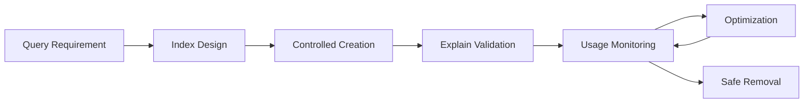

# 07- Index Management Commands

## Overview

MongoDB indexes are data structures that allow the query engine to locate matching documents and satisfy sort operations without scanning the entire collection.

Index management is one of the highest-impact areas of MongoDB performance engineering. A well-designed index can reduce a query from scanning millions of documents to examining a small, targeted subset. A poorly designed index can increase storage consumption, slow writes, increase memory pressure, and still fail to improve the actual workload.

Index design should therefore start from **application access patterns**, not from individual fields that happen to appear in documents.

The typical production workflow is:

```text
Application Query
      ↓
Identify Filter / Sort / Projection
      ↓
Design Candidate Index
      ↓
Create Index
      ↓
Run explain("executionStats")
      ↓
Measure Query Behavior
      ↓
Monitor Index Usage
      ↓
Keep / Modify / Remove Index
```

MongoDB automatically creates an index on `_id`. Application-specific indexes must be designed and managed explicitly.

## Why Indexes Exist

Without a suitable index, MongoDB may need to perform a collection scan:

```text
Query
  ↓
COLLSCAN
  ↓
Read many/all documents
  ↓
Evaluate predicate
  ↓
Return matches
```

With an appropriate index:

```text
Query
  ↓
IXSCAN
  ↓
Locate matching index entries
  ↓
Fetch required documents
  ↓
Return results
```

For a large collection, the difference can be substantial.

Example collection:

```text
orders
├── 100,000,000 documents
└── query: tenant_id + status + created_at
```

An index such as:

```javascript
{
  tenant_id: 1,
  status: 1,
  created_at: -1
}
```

can allow MongoDB to narrow the search space substantially when the query matches the index design.

Indexes do not guarantee fast queries. The query planner still has to determine whether an index is useful.

## Index Trade-offs

Indexes improve reads but have costs.

| Benefit | Cost |
|---|---|
| Faster selective queries | Additional storage |
| Efficient sorting | Additional write work |
| Support for uniqueness | Index maintenance |
| Efficient range queries | Memory/cache pressure |
| Potential covered queries | Build time |
| Faster aggregation entry stages | Operational complexity |

Every index should therefore have an identifiable workload justification.

## Inspecting Existing Indexes

List indexes on a collection:

```javascript
db.orders.getIndexes()
```

Example result:

```javascript
[
  {
    v: 2,
    key: {
      _id: 1
    },
    name: "_id_"
  },
  {
    v: 2,
    key: {
      tenant_id: 1,
      status: 1,
      created_at: -1
    },
    name: "tenant_status_created_at"
  }
]
```

The most important fields are generally:

- `key`
- `name`
- Index options such as `unique`
- Index options such as `partialFilterExpression`
- Index options such as `expireAfterSeconds`
- Other index-specific configuration

## Listing Index Names

A compact way to inspect index names:

```javascript
db.orders.getIndexes().forEach(index => {
  print(index.name)
})
```

This is useful during operational inspection.

## Default `_id` Index

MongoDB automatically creates an index on `_id`.

Inspect it:

```javascript
db.orders.getIndexes()
```

Typical entry:

```javascript
{
  key: {
    _id: 1
  },
  name: "_id_"
}
```

The `_id` index provides efficient lookup by document identifier and enforces uniqueness of `_id` values.

It should not normally be removed.

## Creating a Single-Field Index

Create an ascending index:

```javascript
db.users.createIndex({
  email: 1
})
```

Create a descending index:

```javascript
db.users.createIndex({
  created_at: -1
})
```

The direction becomes particularly relevant for compound indexes and sort patterns.

## Naming Indexes

MongoDB can generate index names, but explicit names are generally easier to operate.

```javascript
db.orders.createIndex(
  {
    tenant_id: 1,
    status: 1,
    created_at: -1
  },
  {
    name: "tenant_status_created_at"
  }
)
```

Useful index names make:

- Operational inspection easier
- Migration scripts clearer
- Drop operations safer
- Monitoring easier
- Incident debugging faster

A practical naming convention should describe the indexed fields and ordering.

## Creating a Compound Index

Compound indexes contain multiple fields:

```javascript
db.orders.createIndex({
  tenant_id: 1,
  status: 1,
  created_at: -1
})
```

This index can support access patterns such as:

```javascript
db.orders.find({
  tenant_id: "TENANT-001",
  status: "confirmed"
}).sort({
  created_at: -1
})
```

Compound indexes are often more useful than creating independent indexes for every field.

## Compound Index Field Ordering

Field order matters.

Consider:

```javascript
{
  tenant_id: 1,
  status: 1,
  created_at: -1
}
```

This is not equivalent to:

```javascript
{
  status: 1,
  tenant_id: 1,
  created_at: -1
}
```

The index structure and its usefulness for filtering and sorting depend on field order.

Do not treat compound indexes as unordered sets of fields.

## ESR Guideline

The ESR guideline is a useful starting point for compound index design:

```text
E = Equality
S = Sort
R = Range
```

Example query:

```javascript
db.orders.find({
  tenant_id: "TENANT-001",
  status: "confirmed",
  created_at: {
    $gte: ISODate("2026-01-01")
  }
}).sort({
  priority: -1
})
```

A candidate index might be:

```javascript
{
  tenant_id: 1,
  status: 1,
  priority: -1,
  created_at: 1
}
```

The exact optimal ordering depends on the complete workload and MongoDB's query behavior. ESR is a design heuristic, not a substitute for `explain()` and measurement.

## Index Prefixes

A compound index:

```javascript
{
  tenant_id: 1,
  status: 1,
  created_at: -1
}
```

has a prefix beginning with:

```javascript
{
  tenant_id: 1
}
```

and another prefix:

```javascript
{
  tenant_id: 1,
  status: 1
}
```

This means a compound index can support multiple related access patterns.

However, the existence of a prefix does not mean every query containing one of the fields can efficiently use the index.

For example:

```javascript
{
  status: "confirmed"
}
```

does not align with the leading field of the index.

## Creating Multiple Indexes

MongoDB supports multiple indexes on a collection.

```javascript
db.orders.createIndexes([
  {
    key: {
      tenant_id: 1,
      status: 1,
      created_at: -1
    },
    name: "tenant_status_created_at"
  },
  {
    key: {
      customer_id: 1,
      created_at: -1
    },
    name: "customer_created_at"
  }
])
```

Batch creation can be useful during controlled deployment or migration workflows.

## Checking Whether an Index Already Exists

Before creating an index in deployment automation, inspect the existing index definitions.

```javascript
db.orders.getIndexes()
```

Application migrations should be designed to be safely repeatable.

For example:

```javascript
const indexes = db.orders.getIndexes();

const exists = indexes.some(
  index =>
    JSON.stringify(index.key) ===
    JSON.stringify({
      tenant_id: 1,
      status: 1,
      created_at: -1
    })
);

if (!exists) {
  db.orders.createIndex(
    {
      tenant_id: 1,
      status: 1,
      created_at: -1
    },
    {
      name: "tenant_status_created_at"
    }
  );
}
```

For production migrations, prefer a migration framework or controlled deployment process instead of embedding ad hoc index creation in application startup.

## Unique Indexes

A unique index prevents duplicate indexed values.

Example:

```javascript
db.users.createIndex(
  {
    email: 1
  },
  {
    unique: true,
    name: "unique_email"
  }
)
```

This provides a database-level uniqueness guarantee.

It is stronger than:

```python
if not user_exists(email):
    create_user(email)
```

because concurrent requests can pass the application-level check simultaneously.

The database constraint is the final authority.

## Handling Duplicate Key Errors

A unique index can cause writes to fail with a duplicate-key error.

Python:

```python
from pymongo.errors import DuplicateKeyError

try:
    users.insert_one({
        "email": "user@example.com",
        "name": "Example User",
    })
except DuplicateKeyError:
    # Translate to a domain-level conflict response.
    raise ValueError("Email already exists")
```

A FastAPI application can translate this into an HTTP `409 Conflict`.

## Sparse Indexes

A sparse index contains entries only for documents where the indexed field exists.

Example:

```javascript
db.users.createIndex(
  {
    phone_number: 1
  },
  {
    sparse: true,
    name: "phone_sparse"
  }
)
```

This can be useful when a field is optional and documents without the field should not contribute index entries.

Sparse indexes have semantic implications, especially when combined with uniqueness.

Do not use `sparse` merely because a field is nullable. Understand how missing fields and query semantics interact with the index.

## Partial Indexes

Partial indexes are often more precise than sparse indexes because they define an explicit filter.

Example:

```javascript
db.orders.createIndex(
  {
    customer_id: 1,
    created_at: -1
  },
  {
    partialFilterExpression: {
      status: "active"
    },
    name: "active_orders_by_customer"
  }
)
```

Only documents satisfying the partial filter are indexed.

This can reduce:

- Index size
- Write overhead
- Memory usage

It can also make indexes more closely aligned with business access patterns.

## Partial Index Example

Suppose:

```text
orders = 100 million documents
active orders = 5 million
```

If most queries operate only on active orders, a partial index can be substantially smaller than indexing all documents.

Query:

```javascript
db.orders.find({
  customer_id: "CUS-1001",
  status: "active"
}).sort({
  created_at: -1
})
```

Candidate index:

```javascript
db.orders.createIndex(
  {
    customer_id: 1,
    created_at: -1
  },
  {
    partialFilterExpression: {
      status: "active"
    },
    name: "active_customer_orders"
  }
)
```

The query must be compatible with the partial filter for MongoDB to safely use that partial index.

## TTL Indexes

TTL indexes automatically remove documents after a configured amount of time.

Example:

```javascript
db.sessions.createIndex(
  {
    expires_at: 1
  },
  {
    expireAfterSeconds: 0,
    name: "session_expiration"
  }
)
```

If a document contains:

```javascript
{
  session_id: "SESSION-123",
  expires_at: ISODate("2026-09-22T18:00:00Z")
}
```

MongoDB can remove it after the expiration time.

TTL indexes are useful for:

- Temporary sessions
- Cache-like records
- Short-lived tokens
- Ephemeral application data
- Retention-controlled collections

TTL deletion is asynchronous. Do not design business logic that assumes a document disappears at the exact expiration timestamp.

## TTL Limitations

TTL indexes are not a general-purpose job scheduler.

Avoid:

```text
Document expiration
        ↓
Assume exact-time business event
```

Instead:

```text
Document expiration
        ↓
Data retention mechanism
```

If an exact-time action is required, use an appropriate scheduler or task system such as Celery, Kubernetes Jobs, or another dedicated mechanism.

## Text Indexes

MongoDB supports text indexes for text search workloads.

Example:

```javascript
db.products.createIndex(
  {
    name: "text",
    description: "text"
  },
  {
    name: "product_text_search"
  }
)
```

Query:

```javascript
db.products.find({
  $text: {
    $search: "wireless keyboard"
  }
})
```

Text indexes are useful for basic MongoDB-native text search requirements.

For sophisticated search workloads involving relevance tuning, analyzers, autocomplete, faceting, or advanced linguistic behavior, evaluate MongoDB Search or a dedicated search system rather than forcing all search behavior into a basic text index.

## Geospatial Indexes

For location-based queries, MongoDB supports geospatial indexes.

A common choice is `2dsphere`.

```javascript
db.locations.createIndex({
  location: "2dsphere"
})
```

Example document:

```javascript
{
  name: "Warehouse A",
  location: {
    type: "Point",
    coordinates: [
      88.3639,
      22.5726
    ]
  }
}
```

The GeoJSON coordinate order is:

```text
[longitude, latitude]
```

not:

```text
[latitude, longitude]
```

This is a common production mistake.

## Multikey Indexes

MongoDB creates multikey index behavior when indexing array fields.

Example:

```javascript
db.products.createIndex({
  tags: 1
})
```

Document:

```javascript
{
  name: "Laptop",
  tags: [
    "electronics",
    "computer",
    "portable"
  ]
}
```

The index can support queries such as:

```javascript
db.products.find({
  tags: "computer"
})
```

Multikey indexes are powerful, but array-heavy schemas can increase index size and write cost.

## Compound Multikey Index Considerations

Array fields require careful design when combined with other indexed fields.

For example:

```javascript
{
  tags: 1,
  category: 1
}
```

can be useful, but index behavior becomes more constrained when multiple indexed fields are arrays.

Avoid designing large compound indexes around unbounded arrays without testing the actual schema and workload.

## Covered Queries

A covered query can be satisfied entirely from an index without fetching the full document.

Example index:

```javascript
db.users.createIndex({
  tenant_id: 1,
  email: 1,
  status: 1
})
```

Query:

```javascript
db.users.find(
  {
    tenant_id: "TENANT-001",
    email: "user@example.com"
  },
  {
    _id: 0,
    email: 1,
    status: 1
  }
)
```

If the predicate and returned fields can be satisfied from the index, MongoDB may avoid document fetches.

Verify with `explain()` rather than assuming a query is covered.

## Checking Query Plans

Use:

```javascript
db.users.explain("executionStats").find({
  tenant_id: "TENANT-001",
  email: "user@example.com"
})
```

For aggregation:

```javascript
db.orders.explain("executionStats").aggregate([
  {
    $match: {
      tenant_id: "TENANT-001",
      status: "confirmed"
    }
  }
])
```

Key execution metrics include:

| Metric | Meaning |
|---|---|
| `nReturned` | Documents returned |
| `totalKeysExamined` | Index entries examined |
| `totalDocsExamined` | Documents examined |
| `executionTimeMillis` | Measured execution time |
| `IXSCAN` | Index scan |
| `COLLSCAN` | Collection scan |
| `FETCH` | Fetch documents after index lookup |
| `SORT` | Explicit sorting stage |

A useful high-level efficiency signal is:

```text
totalDocsExamined ≈ nReturned
```

for a highly selective query, although exact expectations depend on the workload.

## Detecting Collection Scans

Run:

```javascript
db.orders.explain("executionStats").find({
  tenant_id: "TENANT-001",
  status: "confirmed"
})
```

If the winning plan contains:

```text
COLLSCAN
```

MongoDB is scanning the collection rather than using an applicable index.

A collection scan is not automatically wrong.

For example, if a query intentionally returns most of a small collection, an index may provide little benefit.

The question is whether the plan is appropriate for the workload.

## Detecting Inefficient Index Usage

Suppose:

```text
nReturned = 10
totalDocsExamined = 2,000,000
```

That is a strong signal that the query is examining far more documents than it returns.

Potential causes include:

- Missing index
- Low-selectivity index
- Incorrect compound index ordering
- Query shape mismatch
- Poor data model
- Large result-processing workload

Use the actual execution plan before changing indexes.

## Index Selectivity

Selectivity describes how effectively an indexed field narrows the candidate set.

Consider:

```text
status = "active"
```

if:

```text
95% of documents are active
```

The field has poor selectivity for that workload.

By contrast:

```text
customer_id = "CUS-1001"
```

may match a tiny fraction of a large collection.

A highly selective field can often be valuable in query design, but selectivity must be evaluated alongside:

- Query frequency
- Sort requirements
- Compound index structure
- Data distribution
- Cardinality
- Tenant isolation
- Write workload

## Cardinality

Cardinality refers to the number of distinct values.

Example:

| Field | Typical Cardinality |
|---|---:|
| `country` | Low |
| `status` | Very low |
| `tenant_id` | Medium/high |
| `email` | Very high |
| `_id` | Very high |

High cardinality often improves selectivity, but compound index design must consider the complete query rather than selecting fields independently.

## Index Intersection

MongoDB can sometimes use multiple indexes for a query through index intersection.

For example:

```javascript
db.orders.find({
  customer_id: "CUS-1001",
  status: "confirmed"
})
```

could potentially use multiple indexes.

However, relying on index intersection as the primary indexing strategy is generally less predictable than designing an index for important, high-frequency query shapes.

For a critical workload, explicitly test the candidate compound index.

## Sort and Index Interaction

Suppose the query is:

```javascript
db.orders.find({
  tenant_id: "TENANT-001",
  status: "confirmed"
}).sort({
  created_at: -1
})
```

A candidate index:

```javascript
db.orders.createIndex({
  tenant_id: 1,
  status: 1,
  created_at: -1
})
```

can potentially support both filtering and ordering.

Without a suitable index, MongoDB may need an explicit sort stage:

```text
IXSCAN / COLLSCAN
        ↓
      SORT
        ↓
      LIMIT
```

Large in-memory sorts can be expensive.

## Index Management Commands

| Operation | Command |
|---|---|
| List indexes | `db.collection.getIndexes()` |
| Create one | `db.collection.createIndex({...})` |
| Create many | `db.collection.createIndexes([...])` |
| Drop named index | `db.collection.dropIndex("name")` |
| Drop by key | `db.collection.dropIndex({field: 1})` |
| Drop all non-`_id` indexes | `db.collection.dropIndexes()` |
| Inspect usage | `db.collection.aggregate([{$indexStats:{}}])` |
| Inspect query plan | `db.collection.explain("executionStats").find(...)` |

## Dropping an Index by Name

Prefer dropping by explicit name:

```javascript
db.orders.dropIndex("customer_created_at")
```

This is safer operationally than relying on a generated name.

## Dropping an Index by Key

You can also specify the key pattern:

```javascript
db.orders.dropIndex({
  customer_id: 1,
  created_at: -1
})
```

Explicit names are generally preferable in deployment and migration scripts.

## Dropping All Non-`_id` Indexes

```javascript
db.orders.dropIndexes()
```

This is a destructive operation.

It should not be used casually in production.

Potential consequences include:

- Query regressions
- Collection scans
- Increased database CPU
- Increased latency
- Production incidents

Use this primarily in controlled development, test, or recovery scenarios where the consequences are understood.

## Checking Index Usage

Use `$indexStats`:

```javascript
db.orders.aggregate([
  {
    $indexStats: {}
  }
])
```

Typical output contains information such as:

```javascript
{
  name: "tenant_status_created_at",
  key: {
    tenant_id: 1,
    status: 1,
    created_at: -1
  },
  host: "...",
  accesses: {
    ops: 125000,
    since: ISODate("2026-09-01T00:00:00Z")
  }
}
```

This helps identify whether indexes are being accessed.

## Index Usage Caveats

An index with low observed usage is not automatically safe to remove.

Consider:

- Observation window
- Seasonal workloads
- Batch jobs
- Disaster-recovery workflows
- Rare administrative queries
- Reporting workloads
- New application features
- Deployment history

A monthly report may use an index only once per month but still require it.

Index usage statistics should therefore be combined with application knowledge.

## Index Size

Inspect collection statistics:

```javascript
db.orders.stats()
```

Index-related information can be examined as part of collection statistics.

You can also inspect index statistics:

```javascript
db.orders.aggregate([
  {
    $indexStats: {}
  }
])
```

Large indexes can consume:

- Disk
- Memory
- I/O bandwidth
- Replication bandwidth
- Write resources

The working set should ideally fit appropriately within available memory for latency-sensitive workloads.

## Over-Indexing

A common mistake is creating an index for every field:

```javascript
db.orders.createIndex({ customer_id: 1 })
db.orders.createIndex({ status: 1 })
db.orders.createIndex({ created_at: 1 })
db.orders.createIndex({ total_amount: 1 })
db.orders.createIndex({ region: 1 })
db.orders.createIndex({ type: 1 })
```

This may look safe but can create substantial write overhead.

Every relevant write may need to maintain multiple index structures.

Instead, identify actual query patterns:

```text
Query A:
tenant_id + status + created_at

Query B:
customer_id + created_at

Query C:
external_reference
```

Then design indexes around those access patterns.

## Index Lifecycle

A production index should have a lifecycle:



Do not consider index creation the end of the process.

## Index Creation in Production

Large indexes can consume significant resources while being built.

Before creating an index on a large production collection, evaluate:

- Collection size
- Index size estimate
- Available disk
- CPU capacity
- Memory pressure
- Replication topology
- Expected build duration
- Application traffic
- Maintenance windows
- Managed-service behavior

Always verify current MongoDB version and deployment-specific index-build behavior before planning a production migration.

## Index Builds in Replica Sets

Index creation interacts with replica-set operations and deployment topology.

Production index creation should be planned as an operational change rather than treated like an ordinary application query.

For managed MongoDB deployments such as Atlas, follow the platform's current operational guidance.

For self-managed deployments, validate:

- Replica-set health
- Disk capacity
- Replication lag
- Current workload
- Rollback/recovery strategy

## Indexes and Replication

Index definitions are part of the database state and must be consistent across replica-set members.

A poorly planned index build can affect:

```text
Primary
  ↓
Replication
  ↓
Secondaries
  ↓
Replication lag / resource pressure
```

Monitor replica-set health while performing major index operations.

## Indexes and Sharding

In sharded deployments, index design must account for:

- Shard key
- Query targeting
- Routing through `mongos`
- Local indexes on shards
- Scatter-gather behavior
- Cardinality
- Sort requirements

An index can optimize work inside a shard but cannot compensate for poor shard-key design.

For example:

```text
Client
  ↓
mongos
  ↓
Shard targeting
  ↓
Shard-local query + indexes
```

A query that targets every shard can remain expensive even when each shard has a useful local index.

## Indexes and Multi-Tenancy

For a multi-tenant collection:

```javascript
{
  tenant_id: "TENANT-001",
  customer_id: "CUS-1001",
  status: "active",
  created_at: ISODate(...)
}
```

queries often benefit from incorporating `tenant_id` into the index.

Example:

```javascript
db.orders.createIndex({
  tenant_id: 1,
  customer_id: 1,
  created_at: -1
})
```

This can improve both performance and isolation of tenant-specific workloads.

The correct design depends on:

- Tenant size distribution
- Cross-tenant administrative queries
- Query frequency
- Shard strategy
- Data retention

## Indexes and Schema Design

Indexes cannot fully compensate for a poor data model.

Suppose an application frequently needs:

```text
Order
+
Customer
+
Current subscription
```

If every request requires several large joins, adding more indexes may eventually provide diminishing returns.

Consider whether the read model should instead contain controlled duplication:

```javascript
{
  order_id: "ORD-1001",
  customer_id: "CUS-1001",
  customer_name: "Example Corp",
  subscription_tier: "enterprise",
  total_amount: 5000
}
```

This introduces consistency and update costs, but can be appropriate for read-heavy workloads.

Index design and schema design should therefore be treated as related architectural decisions.

## Python Index Management

PyMongo can create indexes programmatically.

```python
from pymongo import ASCENDING, DESCENDING

orders.create_index(
    [
        ("tenant_id", ASCENDING),
        ("status", ASCENDING),
        ("created_at", DESCENDING),
    ],
    name="tenant_status_created_at",
)
```

Unique index:

```python
users.create_index(
    [
        ("email", ASCENDING),
    ],
    unique=True,
    name="unique_email",
)
```

Partial index:

```python
orders.create_index(
    [
        ("customer_id", ASCENDING),
        ("created_at", DESCENDING),
    ],
    partialFilterExpression={
        "status": "active",
    },
    name="active_customer_orders",
)
```

## Indexes in Application Startup

Avoid blindly creating indexes during every web-server startup:

```python
# Avoid using this as an uncontrolled startup mechanism.
client = MongoClient(uri)
db.orders.create_index(...)
```

In a Kubernetes deployment with many replicas:

```text
Pod 1 ─┐
Pod 2 ─┤
Pod 3 ─┼──> MongoDB
Pod 4 ─┤
Pod 5 ─┘
```

all instances may attempt index operations concurrently during deployment.

Prefer:

```text
Migration Job
    ↓
Create / modify indexes
    ↓
Validate
    ↓
Deploy application
```

This separates schema/index changes from application lifecycle.

## Index Migrations

A controlled migration might look conceptually like:

```python
def ensure_indexes(db):
    orders = db["orders"]

    existing = {
        index["name"]
        for index in orders.list_indexes()
    }

    if "tenant_status_created_at" not in existing:
        orders.create_index(
            [
                ("tenant_id", 1),
                ("status", 1),
                ("created_at", -1),
            ],
            name="tenant_status_created_at",
        )
```

For serious production environments, maintain index definitions as versioned migration artifacts.

## FastAPI Deployment Pattern

A suitable architecture is:

```text
CI/CD
  ↓
Migration / Index Job
  ↓
MongoDB
  ↓
Validation
  ↓
Application Deployment
  ↓
FastAPI Pods
```

This makes index changes observable and independently controllable.

## Django Considerations

When MongoDB is used with Django through a MongoDB-specific backend or an ODM such as MongoEngine, index management should still be treated as a database schema concern.

Do not assume Django's relational migration behavior maps directly to MongoDB.

For PyMongo-based repository patterns, explicit index migrations are often easier to reason about.

## Indexes and Transactions

Indexes participate in transaction workloads because transactional writes must maintain indexed state.

Additional indexes can therefore increase the amount of work associated with writes.

If a collection has:

```text
1 document write
+
10 maintained indexes
```

the database has substantially more index maintenance work than with:

```text
1 document write
+
2 maintained indexes
```

This matters for high-write systems.

## Indexes and Write Performance

Consider a high-volume event collection:

```text
50,000 writes/sec
```

Adding several indexes can significantly increase write amplification.

Before adding an index, ask:

```text
How often is this query executed?
How latency-sensitive is it?
How selective is it?
Can an existing compound index satisfy it?
What is the write volume?
What is the index storage cost?
```

This is a more useful decision framework than:

> "This field is queried, so it needs an index."

## Index Selection Workflow

A senior engineer can use the following workflow:

```text
1. Identify real query shape
        ↓
2. Measure current performance
        ↓
3. Inspect existing indexes
        ↓
4. Design candidate index
        ↓
5. Test with realistic data
        ↓
6. Run explain("executionStats")
        ↓
7. Compare docs/keys examined
        ↓
8. Measure application latency
        ↓
9. Deploy through controlled migration
        ↓
10. Monitor production behavior
```

## Before-and-After Example

Query:

```javascript
db.orders.find({
  tenant_id: "TENANT-001",
  status: "confirmed"
}).sort({
  created_at: -1
}).limit(50)
```

Without a suitable index, the plan may resemble:

```text
COLLSCAN
  ↓
SORT
  ↓
LIMIT
```

Candidate index:

```javascript
db.orders.createIndex({
  tenant_id: 1,
  status: 1,
  created_at: -1
})
```

Potential improved plan:

```text
IXSCAN
  ↓
FETCH
  ↓
LIMIT
```

The actual plan must be verified with:

```javascript
db.orders.explain("executionStats").find({
  tenant_id: "TENANT-001",
  status: "confirmed"
}).sort({
  created_at: -1
}).limit(50)
```

Do not claim an index improved performance based only on the presence of `IXSCAN`. Compare:

- Latency
- `nReturned`
- `totalKeysExamined`
- `totalDocsExamined`
- CPU
- Resource consumption

## Detecting Redundant Indexes

Suppose a collection has:

```javascript
{ tenant_id: 1 }
{ tenant_id: 1, status: 1 }
{ tenant_id: 1, status: 1, created_at: -1 }
```

Some workloads may make one or more of these indexes redundant.

However, do not automatically delete shorter prefixes.

The shorter index may still provide:

- Lower index size
- Better cache efficiency
- A different query plan
- Support for a different sort pattern
- Better write/read trade-offs

Evaluate actual workload usage before removing anything.

## Index Review Checklist

For every important index, document:

| Question | Example |
|---|---|
| Which query needs it? | Customer order history |
| What is the query shape? | `tenant_id + customer_id + sort` |
| Why this field order? | Equality + sort |
| How selective is it? | High |
| What is the write cost? | Moderate |
| What is the index size? | 4 GB |
| Is it unique? | No |
| Is it partial? | Yes |
| Is it actively used? | Yes |
| How is it monitored? | `$indexStats` |
| How is it deployed? | Versioned migration |
| What happens if removed? | Query latency regression |

This makes index decisions auditable.

## Common Mistakes

### Indexing Every Field

Problem:

```text
One index per field
```

Why it fails:

- Storage grows
- Writes become more expensive
- Cache pressure increases
- Index selection becomes more complex

Better:

```text
Index real query patterns.
```

### Ignoring Sort Requirements

Query:

```javascript
find({
  tenant_id: "TENANT-001"
}).sort({
  created_at: -1
})
```

Indexing only:

```javascript
{
  tenant_id: 1
}
```

may not fully satisfy the desired ordering.

Evaluate:

```javascript
{
  tenant_id: 1,
  created_at: -1
}
```

### Creating a Single-Field Index for Every Filter

Query:

```javascript
{
  tenant_id: "...",
  status: "...",
  created_at: ...
}
```

Creating:

```javascript
{ tenant_id: 1 }
{ status: 1 }
{ created_at: 1 }
```

may be less effective than a well-designed compound index for the actual query.

### Trusting `IXSCAN` Blindly

An index scan can still examine a huge number of keys.

For example:

```text
nReturned = 10
totalKeysExamined = 5,000,000
```

This is not an efficient query simply because it uses an index.

### Removing an Index Too Quickly

A low usage count does not necessarily mean the index is unnecessary.

Check the complete workload and observation window.

### Creating Indexes During Application Startup

This can cause:

- Startup delays
- Concurrent index operations
- Deployment coupling
- Operational uncertainty

Prefer controlled migrations.

## Security Considerations

Index management is a database administration capability.

Production applications should not generally have unrestricted permissions to:

```javascript
createIndex()
dropIndex()
dropIndexes()
```

Separate:

```text
Application runtime credentials
```

from:

```text
Database migration / operations credentials
```

Use least privilege and controlled CI/CD workflows for schema and index changes.

## Monitoring Considerations

Monitor:

- Query latency
- Slow queries
- CPU
- Memory
- Disk usage
- Index size
- Cache behavior
- Replication lag
- Write throughput
- Index usage
- Query-plan regressions

An index can solve one query while degrading overall write performance.

Performance monitoring should therefore evaluate the complete workload.

## Production Troubleshooting

### Query Is Still Slow After Adding an Index

```text
Symptom
↓
Query remains slow
↓
Possible causes
    - Wrong compound index order
    - Low selectivity
    - Too many documents examined
    - Sort not satisfied by index
    - Large FETCH stage
    - Poor data distribution
    - Query shape differs from expected
↓
Isolation strategy
↓
Run explain("executionStats")
↓
Inspect winning plan
↓
Compare nReturned / totalKeysExamined / totalDocsExamined
↓
Check actual query shape
↓
Root cause
↓
Corrective action
↓
Re-test with production-scale data
↓
Prevention
    - Query performance tests
    - Slow-query monitoring
    - Index review
```

### Writes Became Slower After Index Addition

```text
Symptom
↓
Write latency increased
↓
Possible causes
    - Too many indexes
    - Large index structures
    - High write volume
    - Index maintenance overhead
↓
Isolation strategy
↓
Compare write latency before/after
↓
Inspect index count and sizes
↓
Check workload-specific index usage
↓
Root cause
↓
Corrective action
    - Remove redundant indexes
    - Consolidate compound indexes
    - Re-evaluate low-value indexes
↓
Prevention
    - Index lifecycle management
    - Load testing
```

### Production Index Creation Causes Resource Pressure

```text
Symptom
↓
CPU / disk / latency / replication pressure increases
↓
Possible causes
    - Large index build
    - Insufficient disk
    - High production traffic
    - Resource contention
↓
Isolation strategy
↓
Check database metrics
↓
Check replica-set health
↓
Check storage and CPU
↓
Root cause
↓
Corrective action
    - Follow deployment-specific index-build procedures
    - Schedule controlled changes
    - Reduce concurrent workload where appropriate
↓
Prevention
    - Capacity planning
    - Production-scale testing
    - Change management
```

## Operational Best Practices

- Design indexes from real query patterns.
- Prefer explicit index names.
- Use compound indexes when they match recurring query shapes.
- Consider equality, sort, and range requirements.
- Validate indexes with `explain("executionStats")`.
- Monitor `totalKeysExamined` and `totalDocsExamined`.
- Monitor index usage over a meaningful period.
- Avoid unnecessary indexes on high-write collections.
- Treat index creation as a production change.
- Use versioned migrations.
- Test large index builds before production.
- Monitor replication and resource utilization during major changes.
- Reassess indexes as application query patterns evolve.

## Quick Reference

### Inspect

```javascript
db.orders.getIndexes()
db.orders.aggregate([{ $indexStats: {} }])
db.orders.stats()
```

### Create

```javascript
db.orders.createIndex(
  {
    tenant_id: 1,
    status: 1,
    created_at: -1
  },
  {
    name: "tenant_status_created_at"
  }
)
```

### Unique

```javascript
db.users.createIndex(
  {
    email: 1
  },
  {
    unique: true,
    name: "unique_email"
  }
)
```

### Partial

```javascript
db.orders.createIndex(
  {
    customer_id: 1,
    created_at: -1
  },
  {
    partialFilterExpression: {
      status: "active"
    },
    name: "active_customer_orders"
  }
)
```

### TTL

```javascript
db.sessions.createIndex(
  {
    expires_at: 1
  },
  {
    expireAfterSeconds: 0,
    name: "session_expiration"
  }
)
```

### Drop

```javascript
db.orders.dropIndex("tenant_status_created_at")
```

### Explain

```javascript
db.orders.explain("executionStats").find({
  tenant_id: "TENANT-001",
  status: "confirmed"
})
```

## Interview Considerations

### Why do indexes improve MongoDB query performance?

They provide an ordered data structure that allows the query engine to locate candidate records without scanning every document.

### What is the cost of an index?

Indexes consume storage and resources and add maintenance work to writes and updates.

### What is a compound index?

An index containing multiple fields in a defined order:

```javascript
{
  tenant_id: 1,
  status: 1,
  created_at: -1
}
```

Field ordering matters.

### What is the ESR guideline?

It is a practical compound-index design heuristic:

```text
Equality
Sort
Range
```

The exact index should still be validated against actual query plans and workload behavior.

### What is a multikey index?

An index that supports array-valued fields. MongoDB automatically treats an index as multikey when appropriate indexed fields contain arrays.

### What is a partial index?

An index containing only documents that satisfy a specified filter expression.

### What is a sparse index?

An index that contains entries only for documents where the indexed field exists.

### What is a TTL index?

An index that allows MongoDB to automatically remove documents after a configured expiration period.

### What does `COLLSCAN` mean?

The query plan is scanning collection documents rather than using an applicable index.

### What does `IXSCAN` mean?

The query plan is scanning an index to identify candidate records.

### Why is `totalDocsExamined` important?

It indicates how many documents MongoDB had to inspect. Comparing it with `nReturned` helps identify queries that examine substantially more documents than they return.

### Should every query have an index?

No.

Small collections, low-frequency queries, broad queries, and workloads where an index provides little selectivity may not benefit from additional indexes.

### How should an engineer decide whether to remove an index?

Evaluate:

```text
Index usage
+
Application query patterns
+
Seasonal / batch workloads
+
Index size
+
Write overhead
+
Performance impact
```

Then remove it through a controlled change and monitor the workload afterward.

## Key Takeaways

- **Indexes should be designed from real query and sort patterns, not added indiscriminately to individual fields.**
- **Compound index field ordering matters; use ESR as a starting heuristic and validate the design with actual execution plans.**
- **Use `explain("executionStats")`, `$indexStats`, and production metrics to determine whether indexes are actually improving workload performance.**
- **Every index has a write, storage, memory, and operational cost; over-indexing can degrade high-write workloads.**
- **Treat index creation, modification, and removal as versioned production changes with controlled deployment, monitoring, and rollback planning.**