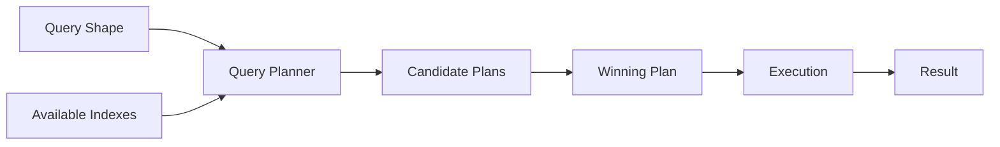
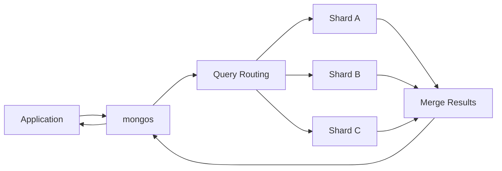

# 08- Query Analysis Commands

## Overview

MongoDB query analysis is the process of inspecting how MongoDB executes a query and determining whether the selected plan is appropriate for the workload.

The primary tool is `explain()`. It exposes execution-plan information such as:

- Winning plan
- Rejected plans
- `COLLSCAN`
- `IXSCAN`
- `FETCH`
- `SORT`
- `LIMIT`
- `nReturned`
- `totalKeysExamined`
- `totalDocsExamined`
- Execution time
- Query planner decisions

Query analysis should answer a practical question:

> Is MongoDB doing approximately the amount of work required to produce this result?

A query returning 20 documents after examining 10 million documents is usually a performance problem, even if it technically uses an index.

A production query-analysis workflow is:

```text
Slow / Expensive Query
        ↓
Capture Exact Query Shape
        ↓
Run explain("executionStats")
        ↓
Inspect Winning Plan
        ↓
Compare Keys / Documents Examined
        ↓
Check Indexes
        ↓
Inspect Sort / Fetch / Lookup / Group Stages
        ↓
Identify Root Cause
        ↓
Change Query / Index / Schema
        ↓
Re-run Explain
        ↓
Measure Application-Level Latency
        ↓
Monitor in Production
```

## Why Query Analysis Matters

Application-level latency alone does not explain why MongoDB is slow.

For example:

```text
FastAPI
  ↓
Repository
  ↓
MongoDB
  ↓
Query takes 800 ms
```

The 800 ms could be caused by:

- Collection scanning
- Poor index selection
- Excessive documents examined
- Large index scans
- Sorting
- Large document fetches
- Aggregation
- `$lookup`
- Network latency
- Connection acquisition
- Server resource pressure

`explain()` helps isolate database execution behavior from the rest of the application stack.

## Query Analysis Layers

A senior engineer should analyze performance at multiple levels:

| Layer | Question |
|---|---|
| Application | Is the endpoint slow? |
| Driver | Is connection acquisition or network time high? |
| Query | Is the query shape efficient? |
| Planner | Which plan did MongoDB select? |
| Index | Is the index appropriate? |
| Documents | How many documents are examined? |
| Server | Is CPU, memory, disk, or I/O constrained? |
| Architecture | Is MongoDB the right place for this workload? |

Do not attempt to solve every latency problem by adding an index.

## `explain()`

`explain()` returns information about how MongoDB plans and executes an operation.

Basic query analysis:

```javascript
db.orders.explain().find({
  tenant_id: "TENANT-001",
  status: "confirmed"
})
```

For more useful execution statistics:

```javascript
db.orders.explain("executionStats").find({
  tenant_id: "TENANT-001",
  status: "confirmed"
})
```

For aggregation:

```javascript
db.orders.explain("executionStats").aggregate([
  {
    $match: {
      tenant_id: "TENANT-001",
      status: "confirmed"
    }
  },
  {
    $group: {
      _id: "$customer_id",
      total_spend: {
        $sum: "$total_amount"
      }
    }
  }
])
```

## Explain Verbosity Modes

MongoDB supports different explain verbosity levels.

| Mode | Purpose |
|---|---|
| `queryPlanner` | Shows query planning information |
| `executionStats` | Shows the selected plan plus execution statistics |
| `allPlansExecution` | Includes information about candidate plans during plan selection |

Example:

```javascript
db.orders.explain("queryPlanner").find({
  status: "confirmed"
})
```

Execution statistics:

```javascript
db.orders.explain("executionStats").find({
  status: "confirmed"
})
```

Candidate-plan analysis:

```javascript
db.orders.explain("allPlansExecution").find({
  status: "confirmed"
})
```

### Practical Usage

Start with:

```javascript
"executionStats"
```

because it provides enough information for most performance investigations.

Use:

```javascript
"allPlansExecution"
```

when understanding competing candidate plans is important.

## Query Planner

The MongoDB query planner determines how an operation should execute.

Conceptually:



The planner considers available indexes and generates candidate execution plans.

The selected plan becomes the winning plan.

The query planner is not simply asking:

> "Does an index exist?"

It is deciding:

> "Which available execution strategy is expected to be most effective for this query?"

## Winning Plan

Inspect:

```javascript
db.orders.explain("queryPlanner").find({
  tenant_id: "TENANT-001"
})
```

The explain output contains a `winningPlan`.

A simplified example might look like:

```javascript
{
  winningPlan: {
    stage: "FETCH",
    inputStage: {
      stage: "IXSCAN",
      keyPattern: {
        tenant_id: 1
      }
    }
  }
}
```

The exact explain structure varies by MongoDB version and execution engine, so production analysis should focus on the actual stages returned by the server.

## Rejected Plans

When multiple candidate plans exist, MongoDB may show rejected alternatives.

Conceptually:

```text
Candidate A → Index A
Candidate B → Index B
Candidate C → Collection Scan

             ↓

        Winning Plan
```

Rejected plans can provide useful evidence about why MongoDB selected a particular index.

Do not assume the rejected plan is "bad" globally. It may simply be less appropriate for the specific query shape and data distribution.

## `COLLSCAN`

`COLLSCAN` means MongoDB is scanning the collection.

Example conceptual plan:

```text
COLLSCAN
   ↓
Document 1
Document 2
Document 3
...
Document N
```

A query:

```javascript
db.orders.explain("executionStats").find({
  status: "confirmed"
})
```

may produce:

```text
COLLSCAN
```

if there is no suitable index.

### Is `COLLSCAN` Always Bad?

No.

For a small collection:

```text
10 documents
```

a collection scan can be cheaper than maintaining and traversing an index.

For a large collection:

```text
100,000,000 documents
```

a broad collection scan can be extremely expensive.

Evaluate the workload rather than treating `COLLSCAN` as an automatic failure.

## `IXSCAN`

`IXSCAN` indicates that MongoDB is scanning an index.

Example:

```text
IXSCAN
  ↓
FETCH
```

A typical index-driven query may look like:

```text
IXSCAN
   ↓
FETCH
   ↓
Result
```

`IXSCAN` is generally evidence that an index is being considered or used, but it does not prove the query is efficient.

Example:

```text
nReturned = 10
totalKeysExamined = 4,000,000
```

The query uses an index but still performs substantial work.

## `FETCH`

`FETCH` means MongoDB needs to retrieve full documents after identifying candidate records through an index.

Conceptually:

```text
IXSCAN
  ↓
Index Entries
  ↓
FETCH
  ↓
Documents
```

For a normal query:

```javascript
db.users.find({
  email: "user@example.com"
})
```

MongoDB may use:

```text
IXSCAN
↓
FETCH
```

because the index identifies the document but the query needs fields that are not available entirely from the index.

## Covered Queries

A covered query can potentially be answered entirely from the index.

Index:

```javascript
db.users.createIndex({
  tenant_id: 1,
  email: 1,
  status: 1
})
```

Query:

```javascript
db.users.find(
  {
    tenant_id: "TENANT-001",
    email: "user@example.com"
  },
  {
    _id: 0,
    email: 1,
    status: 1
  }
)
```

If all required predicate and projection fields are available in the index, MongoDB may not need a document fetch.

Verify this using `explain()`.

Do not assume that an apparently covered query is actually covered.

## `SORT`

A `SORT` stage indicates that MongoDB performs an explicit sort rather than obtaining the required ordering directly from an index.

Example:

```javascript
db.orders.explain("executionStats").find({
  tenant_id: "TENANT-001"
}).sort({
  created_at: -1
})
```

Conceptual plan:

```text
IXSCAN / COLLSCAN
        ↓
      FETCH
        ↓
       SORT
        ↓
      LIMIT
```

For large datasets, explicit sorting can be expensive.

## Index-Supported Sorting

An index can sometimes satisfy both filtering and sorting.

Query:

```javascript
db.orders.find({
  tenant_id: "TENANT-001",
  status: "confirmed"
}).sort({
  created_at: -1
})
```

Candidate index:

```javascript
db.orders.createIndex({
  tenant_id: 1,
  status: 1,
  created_at: -1
})
```

Potential plan:

```text
IXSCAN
  ↓
FETCH
  ↓
LIMIT
```

instead of:

```text
COLLSCAN
  ↓
SORT
  ↓
LIMIT
```

The actual plan must be verified.

## `LIMIT`

A `LIMIT` stage restricts the number of documents returned.

Example:

```javascript
db.orders.find({
  tenant_id: "TENANT-001"
}).sort({
  created_at: -1
}).limit(50)
```

A good index can allow MongoDB to stop after finding enough matching documents.

This can be particularly valuable for:

- API list endpoints
- Recent activity
- Top-N queries
- Dashboard widgets
- Operational views

## Execution Statistics

`executionStats` provides measurements of actual execution.

Example:

```javascript
db.orders.explain("executionStats").find({
  tenant_id: "TENANT-001",
  status: "confirmed"
})
```

Important metrics include:

| Metric | Meaning |
|---|---|
| `nReturned` | Number of documents returned |
| `totalKeysExamined` | Number of index entries examined |
| `totalDocsExamined` | Number of documents examined |
| `executionTimeMillis` | Server-side execution time |
| `executionStages` | Detailed execution stages |

## `nReturned`

`nReturned` indicates how many documents the operation returned.

Example:

```text
nReturned: 50
```

This number alone does not tell you whether the query was efficient.

Compare it with the amount of work performed.

## `totalKeysExamined`

`totalKeysExamined` indicates how many index entries MongoDB examined.

Example:

```text
nReturned: 50
totalKeysExamined: 55
```

This is generally much healthier than:

```text
nReturned: 50
totalKeysExamined: 2,500,000
```

The second query may have a poor index design or low selectivity.

## `totalDocsExamined`

`totalDocsExamined` indicates how many documents MongoDB examined.

Example:

```text
nReturned: 20
totalDocsExamined: 20
```

is very different from:

```text
nReturned: 20
totalDocsExamined: 5,000,000
```

A large ratio is a strong signal that the query may need optimization.

## Examined-to-Returned Ratio

A useful diagnostic heuristic is:

```text
Documents Examined / Documents Returned
```

Example:

```text
10 / 10 = 1
```

is highly selective.

Whereas:

```text
1,000,000 / 10 = 100,000
```

indicates a large amount of work for a small result.

This is a diagnostic signal, not a universal performance threshold.

Some queries legitimately process many documents.

## Example: Inefficient Query

Suppose:

```text
nReturned = 10
totalKeysExamined = 1,200,000
totalDocsExamined = 1,200,000
```

The query may be using an index but still doing excessive work.

Potential causes:

- Low-selectivity index
- Incorrect compound-index ordering
- Query shape mismatch
- Large range scan
- Poor data distribution
- Missing equality predicate in the index

Do not simply add another single-field index. Analyze the actual query shape.

## Example: Efficient Query

Suppose:

```text
nReturned = 50
totalKeysExamined = 50
totalDocsExamined = 50
```

This indicates a highly targeted query.

For example:

```javascript
db.orders.find({
  tenant_id: "TENANT-001",
  customer_id: "CUS-1001"
}).sort({
  created_at: -1
}).limit(50)
```

with:

```javascript
{
  tenant_id: 1,
  customer_id: 1,
  created_at: -1
}
```

may produce highly selective execution.

The exact plan still needs to be verified.

## Query Planner Stage Tree

Execution plans are hierarchical.

Example:

```text
FETCH
└── IXSCAN
```

Another query might produce:

```text
LIMIT
└── SORT
    └── FETCH
        └── IXSCAN
```

Read the plan from the bottom upward:

```text
IXSCAN
    ↓
FETCH
    ↓
SORT
    ↓
LIMIT
```

Then ask:

- Where does MongoDB read data?
- How much data enters each stage?
- Is the index selective?
- Is a sort required?
- Is document fetching necessary?
- Is the result bounded early?

## Query Analysis for Aggregation

Aggregation can also be analyzed.

Example:

```javascript
db.orders.explain("executionStats").aggregate([
  {
    $match: {
      tenant_id: "TENANT-001",
      status: "confirmed"
    }
  },
  {
    $group: {
      _id: "$customer_id",
      revenue: {
        $sum: "$total_amount"
      }
    }
  },
  {
    $sort: {
      revenue: -1
    }
  },
  {
    $limit: 10
  }
])
```

Analyze:

- Input filtering
- Index usage
- Documents entering `$group`
- Number of groups
- Sort workload
- Final result size
- Memory/resource behavior

## Query Analysis and `$match`

A pipeline beginning with a selective `$match` can often reduce the workload.

Example:

```javascript
[
  {
    $match: {
      tenant_id: "TENANT-001",
      status: "confirmed"
    }
  },
  {
    $group: {
      _id: "$customer_id",
      total: {
        $sum: "$total_amount"
      }
    }
  }
]
```

Compare this with:

```javascript
[
  {
    $group: {
      _id: "$customer_id",
      total: {
        $sum: "$total_amount"
      }
    }
  },
  {
    $match: {
      ...
    }
  }
]
```

The second pattern can force MongoDB to process much more data before filtering.

## Query Analysis for `$lookup`

`$lookup` requires special attention.

Example:

```javascript
db.orders.explain("executionStats").aggregate([
  {
    $lookup: {
      from: "customers",
      localField: "customer_id",
      foreignField: "customer_id",
      as: "customer"
    }
  }
])
```

Investigate:

- Number of local documents
- Join cardinality
- Foreign-side indexes
- Documents examined
- Intermediate result size
- Filtering inside the lookup

A join can be logically correct and still operationally expensive.

## Query Analysis and Pagination

Offset pagination:

```javascript
db.orders.find({
  tenant_id: "TENANT-001"
})
.sort({
  created_at: -1
})
.skip(100000)
.limit(50)
```

can become expensive as the offset grows.

Cursor-based pagination can use the last seen value:

```javascript
db.orders.find({
  tenant_id: "TENANT-001",
  created_at: {
    $lt: ISODate("2026-09-20T10:00:00Z")
  }
})
.sort({
  created_at: -1
})
.limit(50)
```

with a suitable index:

```javascript
{
  tenant_id: 1,
  created_at: -1
}
```

Use `explain()` to compare the two approaches at realistic offsets.

## Query Analysis and Index Design

Query analysis should feed directly into index design.

Example access pattern:

```javascript
db.orders.find({
  tenant_id: "TENANT-001",
  status: "confirmed",
  customer_id: "CUS-1001"
}).sort({
  created_at: -1
}).limit(50)
```

Candidate index:

```javascript
db.orders.createIndex({
  tenant_id: 1,
  status: 1,
  customer_id: 1,
  created_at: -1
})
```

Validate:

```javascript
db.orders.explain("executionStats").find({
  tenant_id: "TENANT-001",
  status: "confirmed",
  customer_id: "CUS-1001"
}).sort({
  created_at: -1
}).limit(50)
```

Index design is complete only after measuring the resulting workload.

## Query Analysis and ESR

For compound indexes, ESR provides a useful starting point:

```text
Equality
Sort
Range
```

Example:

```javascript
db.events.find({
  tenant_id: "TENANT-001",
  event_type: "payment",
  created_at: {
    $gte: ISODate("2026-09-01T00:00:00Z")
  }
}).sort({
  priority: -1
})
```

A candidate index may be:

```javascript
{
  tenant_id: 1,
  event_type: 1,
  priority: -1,
  created_at: 1
}
```

But query analysis must determine whether this is actually better than alternatives.

## Query Planner and Data Distribution

A query plan that works well today may degrade as data distribution changes.

Example:

```text
Current:
status="active" → 5% of documents

Later:
status="active" → 80% of documents
```

The selectivity of the field has changed.

A plan that was effective at 5% selectivity may become less attractive at 80%.

This is why production query performance must be monitored over time.

## Query Shape

A query shape represents the structural form of a query independent of its specific values.

These queries have the same basic shape:

```javascript
db.orders.find({
  tenant_id: "TENANT-001",
  status: "confirmed"
})
```

and:

```javascript
db.orders.find({
  tenant_id: "TENANT-999",
  status: "pending"
})
```

but their actual selectivity can differ significantly.

Query analysis should therefore consider both:

- Query shape
- Runtime data distribution

## Query Analysis from `mongosh`

Typical workflow:

```javascript
use ecommerce
```

Inspect indexes:

```javascript
db.orders.getIndexes()
```

Run the query:

```javascript
db.orders.find({
  tenant_id: "TENANT-001",
  status: "confirmed"
}).sort({
  created_at: -1
}).limit(50)
```

Analyze:

```javascript
db.orders.explain("executionStats").find({
  tenant_id: "TENANT-001",
  status: "confirmed"
}).sort({
  created_at: -1
}).limit(50)
```

Inspect index usage:

```javascript
db.orders.aggregate([
  {
    $indexStats: {}
  }
])
```

This creates a repeatable operational workflow.

## Query Analysis from Python

PyMongo exposes explain functionality through the command interface.

For example:

```python
from pymongo import MongoClient

client = MongoClient(
    "mongodb://localhost:27017",
    serverSelectionTimeoutMS=5000,
)

db = client["ecommerce"]

explain = db.command(
    "explain",
    {
        "find": "orders",
        "filter": {
            "tenant_id": "TENANT-001",
            "status": "confirmed",
        },
        "sort": {
            "created_at": -1,
        },
        "limit": 50,
    },
    verbosity="executionStats",
)

print(explain)
```

Keep explain operations out of normal high-volume request paths.

Use them as diagnostic operations.

## FastAPI Query Diagnostics

A production FastAPI application should not expose arbitrary `explain()` functionality to clients.

Avoid:

```text
GET /debug/query?pipeline=<arbitrary MongoDB command>
```

Instead:

```text
Developer / Operator
        ↓
Authenticated operational tooling
        ↓
Controlled query shape
        ↓
MongoDB explain
```

Diagnostic endpoints, if required, should be:

- Internal
- Authenticated
- Authorization-controlled
- Rate-limited
- Disabled or restricted in normal production traffic

## Application Latency vs `executionTimeMillis`

Suppose:

```text
FastAPI latency = 850 ms
MongoDB executionTimeMillis = 300 ms
```

The remaining latency may come from:

- Connection acquisition
- Network
- Serialization
- Python processing
- Other database calls
- Application middleware

Conversely:

```text
FastAPI latency = 900 ms
MongoDB executionTimeMillis = 850 ms
```

strongly suggests MongoDB execution is a major contributor.

Do not treat `executionTimeMillis` as total end-to-end API latency.

## Query Analysis and Connection Pooling

A slow API call does not necessarily mean a slow query.

If the application waits for a connection from the pool:

```text
Request
  ↓
MongoClient pool
  ↓
Wait for connection
  ↓
Execute query
```

the query itself may be fast while the request remains slow.

Measure:

```text
Pool wait
+
Network
+
MongoDB execution
+
Serialization
+
Application processing
```

Use PyMongo monitoring and application metrics where necessary.

## Query Analysis and Server Resources

A query may be correctly indexed but still slow because the server is under resource pressure.

Investigate:

- CPU utilization
- Memory pressure
- Disk I/O
- Storage latency
- Working-set behavior
- Connections
- Lock/contention behavior where relevant
- Replication lag
- Concurrent workload

The query plan tells you how the operation executes; system metrics tell you whether the server has sufficient resources to execute it efficiently.

## Slow Query Investigation

A production investigation can follow:

```text
Alert / User Report
        ↓
Identify endpoint and exact query
        ↓
Capture query shape
        ↓
Reproduce with representative values
        ↓
Run explain("executionStats")
        ↓
Inspect indexes
        ↓
Inspect server metrics
        ↓
Compare expected vs actual work
        ↓
Apply controlled optimization
        ↓
Benchmark
        ↓
Deploy
        ↓
Monitor
```

Avoid changing multiple variables simultaneously when diagnosing a query.

If you simultaneously change:

- Indexes
- Query structure
- Schema
- Pagination
- Server size

you may not know which change solved the problem.

## Query Analysis Example: Missing Index

Query:

```javascript
db.orders.explain("executionStats").find({
  customer_id: "CUS-1001"
})
```

Potential result:

```text
COLLSCAN

nReturned: 150
totalDocsExamined: 50000000
```

Potential corrective action:

```javascript
db.orders.createIndex({
  customer_id: 1
})
```

Then re-run:

```javascript
db.orders.explain("executionStats").find({
  customer_id: "CUS-1001"
})
```

Potential improved result:

```text
IXSCAN
  ↓
FETCH

nReturned: 150
totalDocsExamined: 150
```

The numbers above are illustrative. Production decisions must use actual measurements.

## Query Analysis Example: Wrong Compound Index

Suppose:

```javascript
db.orders.createIndex({
  status: 1,
  created_at: -1
})
```

but the dominant query is:

```javascript
db.orders.find({
  tenant_id: "TENANT-001",
  status: "confirmed"
}).sort({
  created_at: -1
})
```

If the workload is tenant-isolated, a more appropriate index may be:

```javascript
db.orders.createIndex({
  tenant_id: 1,
  status: 1,
  created_at: -1
})
```

Then compare execution plans.

The important lesson is:

```text
Query pattern
      ↓
Index design
      ↓
Explain
      ↓
Measurement
```

rather than:

```text
Add random index
      ↓
Hope performance improves
```

## Query Analysis Example: Excessive Document Fetching

Suppose:

```text
nReturned = 20
totalDocsExamined = 500000
```

The index may identify many candidates but the query still needs to fetch a large number of documents.

Investigate:

- Index selectivity
- Query predicates
- Compound index order
- Data distribution
- Projection
- Whether a covered query is possible

Do not assume that adding more fields to an index is automatically correct.

## Query Analysis Example: Expensive Sort

Query:

```javascript
db.orders.find({
  tenant_id: "TENANT-001"
}).sort({
  created_at: -1
}).limit(100)
```

If the plan contains:

```text
SORT
```

investigate whether an index such as:

```javascript
{
  tenant_id: 1,
  created_at: -1
}
```

matches the access pattern.

Re-run:

```javascript
db.orders.explain("executionStats").find({
  tenant_id: "TENANT-001"
}).sort({
  created_at: -1
}).limit(100)
```

The objective is not merely to remove `SORT`; it is to reduce total work and latency.

## Query Analysis Example: Aggregation Bottleneck

Pipeline:

```javascript
db.orders.explain("executionStats").aggregate([
  {
    $match: {
      tenant_id: "TENANT-001"
    }
  },
  {
    $unwind: "$items"
  },
  {
    $group: {
      _id: "$items.sku",
      quantity: {
        $sum: "$items.quantity"
      }
    }
  }
])
```

Potential bottleneck:

```text
1 million orders
      ↓
$unwind
      ↓
50 million item documents
      ↓
$group
```

Even if the final result contains only 10,000 SKUs, the pipeline may need to process tens of millions of intermediate documents.

Potential optimizations include:

- More selective `$match`
- Better data modeling
- Precomputed summaries
- Incremental aggregation
- Materialized read models

## Query Analysis and Large Documents

A query can be slow because documents are large even when the number of documents examined is reasonable.

Example:

```text
nReturned = 100
totalDocsExamined = 100
```

but each document contains:

```text
5 MB payload
```

The query may still generate substantial:

- Disk reads
- Memory usage
- Network traffic
- Serialization cost

Projection can reduce returned data:

```javascript
db.orders.find(
  {
    tenant_id: "TENANT-001"
  },
  {
    order_id: 1,
    status: 1,
    total_amount: 1,
    _id: 0
  }
)
```

Query analysis should therefore consider document size, not only document count.

## Query Analysis and Projection

Compare:

```javascript
db.orders.find({
  tenant_id: "TENANT-001"
})
```

with:

```javascript
db.orders.find(
  {
    tenant_id: "TENANT-001"
  },
  {
    order_id: 1,
    status: 1,
    total_amount: 1,
    _id: 0
  }
)
```

Projection can reduce:

- Network transfer
- Deserialization work
- Application memory
- Serialization cost

It does not automatically make the underlying document lookup cheap.

## Query Analysis and Read Preference

In replica-set deployments, read preference can affect where queries execute.

Examples include:

```text
primary
primaryPreferred
secondary
secondaryPreferred
nearest
```

A query running on a secondary may reduce primary read load, but it can introduce stale-read considerations depending on the configuration and workload.

Query analysis should therefore include the actual deployment topology when investigating production latency.

## Query Analysis and Read Concern

Read concern influences consistency semantics and can affect query behavior and latency.

For example:

```text
local
majority
```

have different guarantees.

Do not change read concern merely to make a query appear faster without understanding the application's consistency requirements.

## Query Analysis and Transactions

Queries executed inside transactions can behave differently from standalone operations because of:

- Transaction semantics
- Read concern
- Write concern
- Snapshot behavior
- Transaction duration
- Resource usage

A slow query inside a transaction is particularly important because the transaction may remain open while the query executes.

Keep transactions short and avoid placing expensive analytical operations inside business transactions.

## Query Analysis and Sharding

In a sharded cluster:



Query analysis must distinguish:

```text
Targeted query
```

from:

```text
Scatter-gather query
```

A good index on each shard does not necessarily make a query efficient if `mongos` must send it to every shard.

Analyze:

- Shard-key predicates
- Targeted routing
- Number of shards involved
- Per-shard execution
- Merge behavior
- Sort/group work

## Query Analysis and Shard Keys

Suppose the primary query pattern is:

```javascript
{
  tenant_id: "TENANT-001",
  customer_id: "CUS-1001"
}
```

A shard key incorporating tenant identity may allow better query targeting in a multi-tenant architecture, depending on the complete workload.

Shard-key design is an architectural decision and should not be changed solely to optimize one query.

## Query Analysis in Production

Do not run arbitrary diagnostic queries against production collections without considering their impact.

A diagnostic operation can itself consume:

- CPU
- Memory
- Disk I/O
- Network bandwidth

Avoid repeatedly running expensive collection-wide queries during an incident.

Prefer:

- Targeted samples
- Representative filters
- Explain plans
- Existing observability data
- Controlled diagnostic windows

## Query Analysis Security

Query diagnostics can expose sensitive information.

Explain output may reveal:

- Collection names
- Field names
- Index definitions
- Query structure
- Data-dependent execution details

Restrict diagnostic access using:

- Least privilege
- Database roles
- Internal tooling
- Authentication
- Audit logging
- Network restrictions

Do not expose raw explain functionality to untrusted clients.

## Performance Regression Detection

Query performance can regress after:

- Data growth
- Index changes
- Schema changes
- Application releases
- MongoDB upgrades
- Tenant growth
- Query-shape changes

A useful production model is:

```text
Application Release
        ↓
Query Metrics
        ↓
Latency / Error Monitoring
        ↓
Regression Detection
        ↓
Explain Investigation
        ↓
Index / Query / Schema Change
```

Important metrics include:

- p50 latency
- p95 latency
- p99 latency
- Query execution time
- Documents examined
- Keys examined
- Query frequency
- Error rate

## Performance Testing

Do not validate query performance using a tiny development dataset.

A query that performs well against:

```text
10,000 documents
```

may behave very differently against:

```text
100 million documents
```

Test with representative:

- Document counts
- Field distributions
- Array sizes
- Tenant sizes
- Index sizes
- Concurrent request rates
- Read/write ratios

## Query Analysis with Production-Like Data

A useful test environment should approximate:

```text
Collection size
+
Document size
+
Cardinality
+
Index distribution
+
Tenant distribution
+
Read/write workload
```

Synthetic data should reproduce relevant distributions rather than simply generating random documents.

## Monitoring Slow Queries

Use your MongoDB deployment's supported observability mechanisms to identify slow operations.

The investigation process should be:

```text
Slow operation detected
        ↓
Identify exact query shape
        ↓
Capture representative parameters
        ↓
Run explain
        ↓
Inspect plan
        ↓
Compare expected and actual work
        ↓
Optimize
        ↓
Verify production impact
```

Avoid optimizing based only on an endpoint's aggregate latency.

## Query Analysis Checklist

Before declaring a query optimized, verify:

- Is the exact query shape known?
- Is the query using an appropriate index?
- Is `COLLSCAN` expected?
- Is `IXSCAN` selective?
- Is `SORT` required?
- Is `FETCH` examining too many documents?
- Is `totalKeysExamined` reasonable?
- Is `totalDocsExamined` reasonable?
- Is `nReturned` bounded?
- Is the projection appropriate?
- Is pagination scalable?
- Is the query part of a transaction?
- Is the query executed against primary or secondary?
- Is the collection sharded?
- Does the workload grow with data volume?
- Does application latency match database execution time?
- Has the change been tested with realistic data?

## Common Mistakes

### Assuming `IXSCAN` Means the Query Is Fast

This is incorrect.

A query can scan millions of index entries.

Compare:

```text
nReturned
totalKeysExamined
totalDocsExamined
```

rather than checking only for `IXSCAN`.

### Treating `COLLSCAN` as an Automatic Failure

A collection scan can be reasonable for:

- Tiny collections
- Broad queries
- Full-data processing
- Workloads where an index provides little benefit

Measure before changing the design.

### Looking Only at Execution Time

Execution time can vary with:

- Cache state
- Server load
- Data distribution
- Concurrent operations

Analyze execution stages and examined counts as well.

### Testing Only on Small Data

Indexes and query plans behave differently at scale.

Always test representative data volumes.

### Adding Indexes Without Removing Redundant Ones

Each new index adds maintenance overhead.

Index design must consider the complete workload.

### Optimizing the Wrong Query Shape

An index designed for:

```javascript
{
  tenant_id: 1,
  created_at: -1
}
```

may not solve:

```javascript
{
  customer_id: 1,
  status: 1,
  created_at: -1
}
```

Start from the actual query.

### Running Explain in High-Volume Application Paths

Do not make:

```python
collection.find(...).explain(...)
```

part of every production request.

Explain is a diagnostic operation, not normal application behavior.

## Production Troubleshooting

### Query Is Slow

```text
Symptom
↓
High API / database latency
↓
Possible causes
    - COLLSCAN
    - Poor index
    - Low selectivity
    - SORT
    - Large FETCH
    - Large documents
    - Resource pressure
↓
Isolation strategy
↓
Capture exact query
↓
Run explain("executionStats")
↓
Inspect winning plan
↓
Compare nReturned / keys / documents examined
↓
Check indexes and server metrics
↓
Root cause
↓
Corrective action
↓
Re-run explain
↓
Validate application latency
↓
Prevention
    - Query monitoring
    - Performance tests
    - Index lifecycle management
```

### Query Uses an Index but Is Still Slow

```text
Symptom
↓
IXSCAN exists but latency remains high
↓
Possible causes
    - Too many keys examined
    - Low-selectivity index
    - Poor compound ordering
    - Large FETCH
    - Expensive SORT
↓
Isolation strategy
↓
Inspect executionStats
↓
Compare keys examined with results returned
↓
Inspect plan tree
↓
Review query shape
↓
Root cause
↓
Corrective action
    - Redesign compound index
    - Improve predicate selectivity
    - Reduce projection
    - Change pagination
    - Reconsider schema
↓
Prevention
    - Explain-based regression testing
```

### Query Became Slow After Data Growth

```text
Symptom
↓
Previously fast query degrades over time
↓
Possible causes
    - Collection growth
    - Changed cardinality
    - Larger indexes
    - Working-set pressure
    - Tenant skew
    - Changed query planner economics
↓
Isolation strategy
↓
Compare historical metrics
↓
Run current explain
↓
Inspect data distribution
↓
Inspect server resources
↓
Root cause
↓
Corrective action
    - Index redesign
    - Data-model change
    - Materialized read model
    - Archival / retention
    - Capacity adjustment
↓
Prevention
    - Capacity planning
    - Query regression monitoring
```

### Aggregation Is Expensive

```text
Symptom
↓
High CPU / memory during aggregation
↓
Possible causes
    - Large input
    - Late $match
    - High-cardinality $group
    - Large $unwind
    - Expensive $lookup
    - Large sort
↓
Isolation strategy
↓
Run aggregation explain
↓
Inspect input and intermediate cardinality
↓
Check indexes
↓
Root cause
↓
Corrective action
    - Filter earlier
    - Reduce fields
    - Reduce cardinality
    - Materialize results
    - Use incremental processing
↓
Prevention
    - Production-scale benchmarks
    - Aggregation monitoring
```

## Senior Query Optimization Methodology

A mature optimization process should distinguish four separate questions:

### Is the Query Correct?

Verify:

- Filters
- Sort semantics
- Pagination
- Projection
- Tenant boundaries
- Consistency requirements

A faster query that returns incorrect data is not an optimization.

### Is the Query Efficient?

Inspect:

```text
nReturned
totalKeysExamined
totalDocsExamined
executionTimeMillis
```

and the execution-stage tree.

### Is the Index Appropriate?

Evaluate:

- Query shape
- Field ordering
- Selectivity
- Sort
- Range predicates
- Write cost
- Existing indexes

### Is MongoDB the Right Place for the Work?

If a workload repeatedly performs:

```text
Huge scan
+
Large aggregation
+
Complex transformation
+
High-frequency API request
```

the solution may be architectural rather than another index.

Potential alternatives include:

- Materialized read models
- Scheduled aggregation
- Change-stream processing
- Kafka-based pipelines
- Redis caching
- Dedicated analytical systems

Use these only when the workload justifies the additional complexity.

## Interview Considerations

### What does `explain()` do?

It provides information about how MongoDB plans and executes a database operation, including execution stages and statistics.

### What is the difference between `queryPlanner` and `executionStats`?

`queryPlanner` focuses on the selected and candidate plans.

`executionStats` also executes the operation and reports actual execution statistics.

### What is `COLLSCAN`?

A collection scan where MongoDB examines collection documents rather than using an applicable index.

### What is `IXSCAN`?

An index scan where MongoDB examines index entries.

### Does `IXSCAN` guarantee good performance?

No. An index scan may still examine a very large number of keys.

### What does `totalDocsExamined` tell you?

It tells you how many documents MongoDB examined during execution.

### What does `nReturned` tell you?

It tells you how many documents the operation returned.

### What does a large `totalDocsExamined / nReturned` ratio suggest?

It suggests that MongoDB is doing substantially more document work than the final result requires and that the query or index design deserves investigation.

### What does a `SORT` stage indicate?

MongoDB is performing an explicit sort rather than obtaining the required ordering directly from the selected index plan.

### How do you investigate a slow MongoDB query?

Use:

```text
Exact query
↓
explain("executionStats")
↓
Winning plan
↓
Keys examined
↓
Documents examined
↓
Sort / fetch / lookup stages
↓
Indexes
↓
Server metrics
↓
Application latency
```

### Why should queries be tested with production-scale data?

Query performance depends on:

- Data volume
- Cardinality
- Selectivity
- Index size
- Data distribution
- Document size
- Concurrency

A query that is fast on a small development database can become expensive at production scale.

## Quick Reference

### Query Planner

```javascript
db.orders.explain("queryPlanner").find({
  tenant_id: "TENANT-001"
})
```

### Execution Statistics

```javascript
db.orders.explain("executionStats").find({
  tenant_id: "TENANT-001",
  status: "confirmed"
})
```

### All Candidate Plan Execution

```javascript
db.orders.explain("allPlansExecution").find({
  tenant_id: "TENANT-001",
  status: "confirmed"
})
```

### Explain Aggregation

```javascript
db.orders.explain("executionStats").aggregate([
  {
    $match: {
      tenant_id: "TENANT-001"
    }
  },
  {
    $group: {
      _id: "$customer_id",
      total: {
        $sum: "$total_amount"
      }
    }
  }
])
```

### Inspect Indexes

```javascript
db.orders.getIndexes()
```

### Inspect Index Usage

```javascript
db.orders.aggregate([
  {
    $indexStats: {}
  }
])
```

### Inspect Collection Statistics

```javascript
db.orders.stats()
```

### Key Metrics

```text
nReturned
totalKeysExamined
totalDocsExamined
executionTimeMillis
```

### Core Execution Stages

```text
COLLSCAN
IXSCAN
FETCH
SORT
LIMIT
```

## Key Takeaways

- **Use `explain("executionStats")` to understand actual MongoDB work; `IXSCAN` alone does not prove that a query is efficient.**
- **Compare `nReturned`, `totalKeysExamined`, and `totalDocsExamined` to determine whether the query is doing substantially more work than necessary.**
- **Analyze the complete execution plan, including `COLLSCAN`, `IXSCAN`, `FETCH`, `SORT`, aggregation stages, and lookup behavior rather than optimizing from a single metric.**
- **Validate query and index changes with production-scale data, realistic cardinality, and application-level latency measurements.**
- **When repeated large queries remain expensive despite good indexing, consider schema changes, materialized read models, incremental processing, or a different workload architecture instead of continuously adding indexes.**