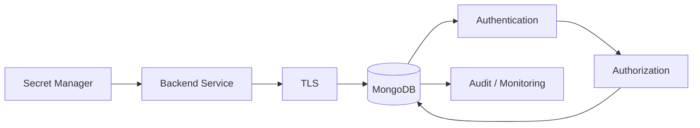
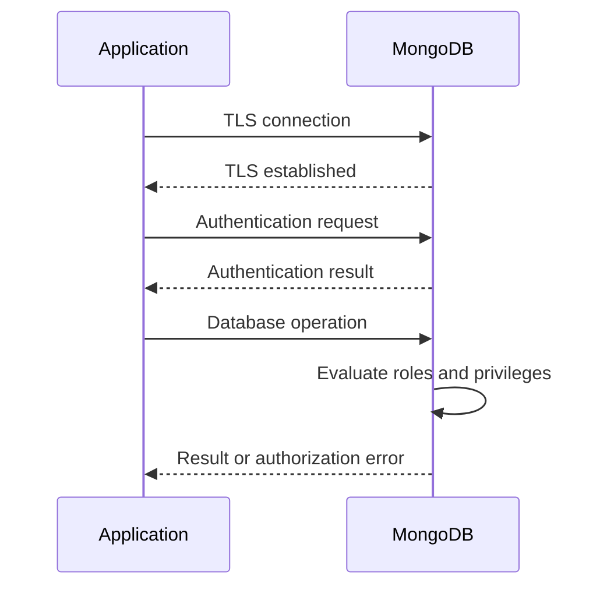
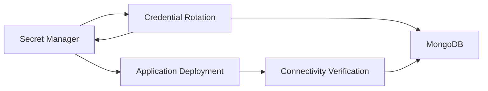

# 09- User and Authentication Commands

## Overview

MongoDB authentication controls **who can connect to a MongoDB deployment**, while authorization controls **what an authenticated identity is allowed to do**.

From an operational perspective:

```text
Client
  ↓
Network / TLS
  ↓
MongoDB Server
  ↓
Authentication
  ↓
Authorization
  ↓
Database / Collection Operation
```

MongoDB user and authentication commands are primarily used through `mongosh` for:

- Creating users
- Listing users
- Inspecting roles
- Assigning roles
- Modifying users
- Removing users
- Changing passwords
- Authenticating
- Creating custom roles
- Managing role membership
- Inspecting current authentication state
- Troubleshooting authorization failures

Authentication should be designed together with:

- Least privilege
- TLS
- Secret management
- Network restrictions
- Application identity
- Replica-set architecture
- Auditing
- Operational access controls

For production systems, avoid treating MongoDB credentials as application configuration alone. They are security-sensitive infrastructure credentials and should be managed through an appropriate secret-management process.

## Authentication vs Authorization

These concepts solve different problems.

| Concern | Question | MongoDB mechanism |
|---|---|---|
| Authentication | Who are you? | User credentials / authentication mechanism |
| Authorization | What can you do? | Roles and privileges |
| Encryption in transit | Can traffic be protected? | TLS |
| Network access | Can you reach MongoDB? | Firewall / security groups / network policy |
| Auditing | What happened? | Audit / operational logging |

A successful connection does not imply permission to perform every database operation.

```text
Username + Password
        ↓
Authentication succeeds
        ↓
Authenticated identity
        ↓
Roles evaluated
        ↓
Privileges determined
        ↓
Operation allowed / denied
```

## MongoDB Security Architecture

A production deployment should generally look like:



The application should retrieve credentials from a controlled secret-management system rather than storing passwords in source code.

Examples include:

- AWS Secrets Manager
- Kubernetes Secrets with appropriate protection
- HashiCorp Vault
- CI/CD secret stores

## Authentication Database

MongoDB users are associated with an authentication database.

For example:

```javascript
use admin
```

Create a user:

```javascript
db.createUser({
  user: "app_user",
  pwd: passwordPrompt(),
  roles: [
    {
      role: "readWrite",
      db: "ecommerce"
    }
  ]
})
```

The user is stored in the `admin` database, while the assigned role applies to the `ecommerce` database.

This distinction is important.

A connection string may therefore specify:

```text
mongodb://app_user:<password>@mongodb.example.com/ecommerce?authSource=admin
```

Here:

```text
Application database = ecommerce
Authentication database = admin
```

## `authSource`

`authSource` identifies the database where MongoDB should authenticate the user.

Example:

```text
mongodb://app_user:<password>@mongodb.example.com/ecommerce?authSource=admin
```

Meaning:

```text
User:
    app_user

Authentication database:
    admin

Application database:
    ecommerce
```

If `authSource` is incorrect, authentication can fail even when the username and password are correct.

## Creating a User

The primary command is:

```javascript
db.createUser()
```

Example:

```javascript
use ecommerce

db.createUser({
  user: "app_user",
  pwd: passwordPrompt(),
  roles: [
    {
      role: "readWrite",
      db: "ecommerce"
    }
  ]
})
```

`passwordPrompt()` avoids putting the password directly into shell history or the command itself.

## Production User Creation

For production, avoid:

```javascript
db.createUser({
  user: "app_user",
  pwd: "SuperSecretPassword123!"
})
```

Prefer:

```javascript
db.createUser({
  user: "app_user",
  pwd: passwordPrompt(),
  roles: [
    {
      role: "readWrite",
      db: "ecommerce"
    }
  ]
})
```

Then store the resulting credential in an approved secret-management system.

## User with Multiple Roles

A user can have multiple roles.

```javascript
db.createUser({
  user: "reporting_user",
  pwd: passwordPrompt(),
  roles: [
    {
      role: "read",
      db: "ecommerce"
    },
    {
      role: "read",
      db: "analytics"
    }
  ]
})
```

Use multiple roles when the application's actual privileges span multiple databases or security boundaries.

Avoid assigning broad administrative roles simply because they are convenient.

## Listing Users

List users for the current database:

```javascript
db.getUsers()
```

Example:

```javascript
use ecommerce

db.getUsers()
```

A more detailed representation can be requested:

```javascript
db.getUsers({
  showCredentials: false,
  showCustomData: true
})
```

Do not expose credentials through diagnostic output.

## Listing Users from `admin`

```javascript
use admin

db.getUsers()
```

This is useful when users are managed centrally in the `admin` authentication database.

## Finding a Specific User

```javascript
db.getUser("app_user")
```

Example:

```javascript
use admin

db.getUser("app_user")
```

This is useful for verifying:

- User existence
- Assigned roles
- Custom data
- Authentication configuration

## Changing a Password

Use:

```javascript
db.changeUserPassword()
```

Example:

```javascript
use admin

db.changeUserPassword(
  "app_user",
  passwordPrompt()
)
```

For production password rotation:

```text
Generate new credential
        ↓
Store in secret manager
        ↓
Update MongoDB credential
        ↓
Update application secret
        ↓
Restart / reload application if required
        ↓
Verify authentication
        ↓
Revoke old credential where applicable
```

Plan credential rotation carefully so that running application instances do not unexpectedly lose database access.

## Updating a User

Use:

```javascript
db.updateUser()
```

Example:

```javascript
use admin

db.updateUser(
  "app_user",
  {
    roles: [
      {
        role: "readWrite",
        db: "ecommerce"
      }
    ]
  }
)
```

`updateUser()` can modify user properties such as:

- Password
- Roles
- Custom data
- Authentication-related properties supported by the deployment

Be deliberate when changing roles because replacing role assignments can unintentionally remove existing permissions.

## Granting Roles

Use:

```javascript
db.grantRolesToUser()
```

Example:

```javascript
use ecommerce

db.grantRolesToUser(
  "app_user",
  [
    {
      role: "read",
      db: "analytics"
    }
  ]
)
```

This adds privileges without replacing existing role assignments.

## Revoking Roles

Use:

```javascript
db.revokeRolesFromUser()
```

Example:

```javascript
use ecommerce

db.revokeRolesFromUser(
  "app_user",
  [
    {
      role: "read",
      db: "analytics"
    }
  ]
)
```

Use this during privilege reduction or application decommissioning.

## Dropping a User

Use:

```javascript
db.dropUser()
```

Example:

```javascript
use admin

db.dropUser("old_application_user")
```

This is destructive.

Before dropping a production user, verify:

- Application dependencies
- Scheduled jobs
- Celery workers
- Airflow jobs
- Reporting services
- CI/CD automation
- Operational tooling
- Disaster-recovery procedures

## User Management Command Reference

| Operation | Command |
|---|---|
| Create user | `db.createUser()` |
| List users | `db.getUsers()` |
| Inspect user | `db.getUser()` |
| Update user | `db.updateUser()` |
| Change password | `db.changeUserPassword()` |
| Grant role | `db.grantRolesToUser()` |
| Revoke role | `db.revokeRolesFromUser()` |
| Drop user | `db.dropUser()` |
| Create role | `db.createRole()` |
| Inspect role | `db.getRole()` |
| List roles | `db.getRoles()` |
| Update role | `db.updateRole()` |
| Grant role to role | `db.grantRolesToRole()` |
| Revoke role from role | `db.revokeRolesFromRole()` |
| Drop role | `db.dropRole()` |

## Built-in Roles

MongoDB provides built-in roles for common privilege requirements.

Common examples include:

| Role | General purpose |
|---|---|
| `read` | Read data |
| `readWrite` | Read and write data |
| `dbAdmin` | Database administration tasks |
| `dbOwner` | Broad database ownership privileges |
| `userAdmin` | User and role administration |
| `clusterMonitor` | Monitoring privileges |
| `readAnyDatabase` | Read access across databases |
| `readWriteAnyDatabase` | Read/write across databases |
| `userAdminAnyDatabase` | User administration across databases |
| `dbAdminAnyDatabase` | Database administration across databases |
| `root` | Broad administrative privileges |

Exact privileges should be verified against the MongoDB version and deployment.

## Application Role Design

A typical backend service should not use:

```javascript
{
  role: "root",
  db: "admin"
}
```

Instead, use a narrowly scoped application identity:

```javascript
{
  role: "readWrite",
  db: "ecommerce"
}
```

For read-only services:

```javascript
{
  role: "read",
  db: "ecommerce"
}
```

For monitoring:

```javascript
{
  role: "clusterMonitor",
  db: "admin"
}
```

Different workloads should generally have different identities.

## Role Separation

A production architecture might use:

```text
ecommerce-api
    ↓
ecommerce_app_user
    ↓
readWrite on ecommerce

reporting-service
    ↓
reporting_user
    ↓
read on ecommerce

monitoring
    ↓
monitor_user
    ↓
clusterMonitor

database-admin
    ↓
admin_user
    ↓
Administrative privileges
```

This limits blast radius.

If the reporting service is compromised, it should not automatically gain write or administrative access.

## Inspecting Roles

List roles:

```javascript
db.getRoles()
```

Inspect a specific role:

```javascript
db.getRole(
  "readWrite",
  {
    showPrivileges: true,
    showBuiltinRole: true
  }
)
```

The exact output depends on the MongoDB version and permissions of the executing user.

## Role Privileges

A role contains privileges.

Conceptually:

```text
Role
 ├── Privilege
 │    ├── Resource
 │    └── Actions
 └── Inherited Roles
```

For example:

```text
readWrite
    ↓
collection/database resources
    ↓
find
insert
update
remove
...
```

Custom roles allow organizations to define narrower privilege sets.

## Creating a Custom Role

Use:

```javascript
db.createRole()
```

Example:

```javascript
use ecommerce

db.createRole({
  role: "orderReader",
  privileges: [
    {
      resource: {
        db: "ecommerce",
        collection: "orders"
      },
      actions: [
        "find"
      ]
    }
  ],
  roles: []
})
```

This creates a role restricted to reading the `orders` collection.

## Assigning a Custom Role

```javascript
db.grantRolesToUser(
  "reporting_user",
  [
    {
      role: "orderReader",
      db: "ecommerce"
    }
  ]
)
```

This is useful when built-in roles are broader than the application's requirements.

## Custom Role Design

Use custom roles when:

- Built-in roles are too broad
- Collection-level restrictions matter
- A service needs a very specific privilege set
- Regulatory controls require narrower permissions
- Different services need different capabilities

Do not create custom roles unnecessarily.

If:

```text
readWrite on one application database
```

is already sufficient, creating dozens of custom privileges may increase operational complexity without improving security meaningfully.

## Updating a Custom Role

Use:

```javascript
db.updateRole()
```

Example:

```javascript
use ecommerce

db.updateRole(
  "orderReader",
  {
    privileges: [
      {
        resource: {
          db: "ecommerce",
          collection: "orders"
        },
        actions: [
          "find"
        ]
      },
      {
        resource: {
          db: "ecommerce",
          collection: "customers"
        },
        actions: [
          "find"
        ]
      }
    ],
    roles: []
  }
)
```

Role changes should be reviewed like application authorization changes.

## Dropping a Custom Role

```javascript
use ecommerce

db.dropRole("orderReader")
```

Before dropping a role, identify users or other roles that depend on it.

## Role Inheritance

Roles can inherit other roles.

Conceptually:

```text
applicationRole
    ↓
readRole
    ↓
database privileges
```

This can simplify role management.

However, excessive inheritance can make authorization difficult to reason about.

Prefer a small and understandable role hierarchy.

## Role Management Commands

### Create Role

```javascript
db.createRole({
  role: "orderReader",
  privileges: [
    {
      resource: {
        db: "ecommerce",
        collection: "orders"
      },
      actions: ["find"]
    }
  ],
  roles: []
})
```

### Grant Role to User

```javascript
db.grantRolesToUser(
  "reporting_user",
  [
    {
      role: "orderReader",
      db: "ecommerce"
    }
  ]
)
```

### Revoke Role from User

```javascript
db.revokeRolesFromUser(
  "reporting_user",
  [
    {
      role: "orderReader",
      db: "ecommerce"
    }
  ]
)
```

### Drop Role

```javascript
db.dropRole("orderReader")
```

## Inspecting Current Authentication State

Use:

```javascript
db.runCommand({
  connectionStatus: 1
})
```

This can provide information about the current connection and authenticated users.

A useful pattern is:

```javascript
db.runCommand({
  connectionStatus: 1,
  showPrivileges: true
})
```

The level of detail depends on the executing user's privileges.

## Checking Current User

```javascript
db.runCommand({
  connectionStatus: 1
})
```

Inspect the authenticated identity in the returned connection information.

This is useful when troubleshooting:

```text
Authentication succeeded
but
authorization failed
```

## Authentication with `mongosh`

A common connection pattern is:

```bash
mongosh "mongodb://app_user:<password>@localhost:27017/ecommerce?authSource=admin"
```

Avoid exposing passwords in shell history or process listings.

A safer operational pattern is to use supported credential prompting or external secret injection rather than embedding credentials directly in command-line arguments.

## Interactive Authentication

You can connect and authenticate through `mongosh` using the appropriate connection options.

For example:

```bash
mongosh \
  --host mongodb.example.com \
  --port 27017 \
  --authenticationDatabase admin \
  --username app_user
```

The shell can then prompt for the password rather than requiring it in the command.

## Authentication Mechanisms

MongoDB supports authentication mechanisms including:

- SCRAM
- X.509
- LDAP
- Kerberos

For typical application deployments, SCRAM is common.

Enterprise environments may use centralized identity systems such as LDAP or Kerberos where appropriate.

X.509 can be useful for certificate-based authentication and service identity.

The mechanism should be selected based on:

- Organization identity architecture
- Compliance requirements
- Operational complexity
- Deployment environment
- MongoDB edition and supported features

## SCRAM Authentication

SCRAM is a challenge-response authentication mechanism commonly used by MongoDB applications.

Conceptually:

```text
Client
  ↓
Authentication request
  ↓
MongoDB challenge / verification
  ↓
Credential verification
  ↓
Authenticated session
```

Passwords should not be transmitted as plain text through an unencrypted production connection.

Use TLS for production traffic.

## TLS and Authentication

Authentication protects identity, while TLS protects communication.

A production connection should generally look like:

```text
Application
    ↓
TLS
    ↓
MongoDB
    ↓
Authentication
    ↓
Authorization
```

TLS protects against network interception while authentication establishes the client identity.

Do not treat authentication as a replacement for TLS.

## Authentication and Authorization Flow



## Connection Strings

Typical connection string:

```text
mongodb://app_user:<password>@mongodb.example.com:27017/ecommerce?authSource=admin
```

Production systems should avoid hardcoding:

```text
username
password
host
TLS secrets
```

inside source code.

Instead:

```text
Environment / Secret Manager
        ↓
Application configuration
        ↓
MongoClient
```

## Python Configuration

Example:

```python
import os

from pymongo import MongoClient

mongo_uri = os.environ["MONGODB_URI"]

client = MongoClient(
    mongo_uri,
    serverSelectionTimeoutMS=5000,
)
```

The URI can be injected through:

- Kubernetes Secret
- AWS Secrets Manager
- CI/CD secret store
- Container environment
- Secure configuration service

## Authentication with FastAPI

A FastAPI application should create a controlled database client and avoid embedding credentials in source code.

Example:

```python
import os

from fastapi import FastAPI
from pymongo import MongoClient

app = FastAPI()

client = MongoClient(
    os.environ["MONGODB_URI"],
    serverSelectionTimeoutMS=5000,
)

db = client["ecommerce"]
```

The application user should have only the privileges required by the service.

## Authentication with Background Workers

Celery or other workers should use their own database identity where practical.

For example:

```text
FastAPI
  ↓
api_user

Celery
  ↓
worker_user

Reporting
  ↓
reporting_user
```

This prevents one compromised workload from automatically inheriting every database capability.

## Database Roles vs Application Roles

MongoDB roles should not be confused with application-level roles.

MongoDB:

```text
readWrite
dbAdmin
clusterMonitor
```

Application:

```text
customer
operator
manager
admin
```

They solve different problems.

For example:

```text
HTTP user
   ↓
Application authorization
   ↓
Service operation
   ↓
MongoDB application identity
   ↓
MongoDB authorization
```

Do not give every HTTP administrator a MongoDB `root` credential.

The backend should enforce business authorization separately.

## Least Privilege

A production application should receive the minimum permissions needed.

Example:

```text
Order API
    ↓
readWrite
    ↓
ecommerce
```

rather than:

```text
Order API
    ↓
root
    ↓
Entire MongoDB deployment
```

Least privilege reduces:

- Blast radius
- Accidental damage
- Credential compromise impact
- Insider risk
- Operational mistakes

## Service-Specific Credentials

A microservices architecture may use:

```text
orders-service
    ↓
orders_db_user

payments-service
    ↓
payments_db_user

reporting-service
    ↓
reporting_db_user
```

This provides stronger isolation than one global database account.

Whether each service gets a separate database or collection-level access depends on the application's data ownership and deployment architecture.

## Read-Only Reporting User

Example:

```javascript
use admin

db.createUser({
  user: "reporting_user",
  pwd: passwordPrompt(),
  roles: [
    {
      role: "read",
      db: "ecommerce"
    }
  ]
})
```

The reporting service should not require write privileges simply because it needs to query data.

## Monitoring User

A monitoring identity may use an appropriate monitoring role:

```javascript
use admin

db.createUser({
  user: "monitoring_user",
  pwd: passwordPrompt(),
  roles: [
    {
      role: "clusterMonitor",
      db: "admin"
    }
  ]
})
```

The exact monitoring permissions should be aligned with the monitoring system's requirements.

## Administrative User

Administrative identities should be tightly controlled.

Do not use an administrative account for normal application traffic.

A safer model is:

```text
Application
    ↓
Restricted application user

Operations
    ↓
Privileged administrative user
```

Administrative credentials should be:

- Strongly protected
- Rarely used
- Audited
- Rotated
- Restricted by network and identity controls

## Authentication Database Mistakes

A common mistake is creating:

```javascript
use ecommerce

db.createUser({
  user: "app_user",
  pwd: passwordPrompt(),
  roles: [
    {
      role: "readWrite",
      db: "ecommerce"
    }
  ]
})
```

and then connecting with:

```text
?authSource=admin
```

If the user was actually created in `ecommerce`, the authentication source may be wrong.

The correct URI must reflect where the user is defined.

Always verify:

```javascript
db.getUser("app_user")
```

from the appropriate authentication database.

## Authorization Failure vs Authentication Failure

These errors mean different things.

### Authentication Failure

```text
Invalid credentials
```

Potential causes:

- Incorrect username
- Incorrect password
- Wrong `authSource`
- Unsupported authentication mechanism
- User does not exist
- Authentication configuration problem

### Authorization Failure

Authentication succeeds, but:

```text
not authorized on ecommerce to execute command
```

Potential causes:

- Missing role
- Wrong role
- Wrong database
- Collection-level privilege mismatch
- Application is using a different credential than expected

The troubleshooting paths are different.

## Troubleshooting Authentication

```text
Symptom
↓
Authentication failure
↓
Possible causes
    - Wrong username
    - Wrong password
    - Wrong authSource
    - Wrong authentication mechanism
    - User does not exist
    - TLS / connection configuration issue
↓
Isolation strategy
↓
Verify connection target
↓
Verify authentication database
↓
Inspect user with db.getUser()
↓
Test controlled mongosh connection
↓
Check server authentication configuration
↓
Root cause
↓
Corrective action
↓
Prevention
    - Secret management
    - Credential rotation
    - Configuration validation
```

## Troubleshooting Authorization

```text
Symptom
↓
Authentication succeeds but operation is denied
↓
Possible causes
    - Missing role
    - Wrong database role
    - Collection privilege missing
    - Wrong application credential
↓
Isolation strategy
↓
Run connectionStatus
↓
Inspect authenticated user
↓
Run db.getUser()
↓
Inspect assigned roles
↓
Compare operation with required privilege
↓
Root cause
↓
Corrective action
    - Grant required role
    - Create narrower custom role
    - Correct database assignment
↓
Prevention
    - Least privilege
    - Authorization tests
    - Role documentation
```

## Troubleshooting Wrong `authSource`

```text
Symptom
↓
Username/password appear correct
↓
Authentication still fails
↓
Possible causes
    - User exists in another authentication database
↓
Isolation strategy
↓
Identify user creation database
↓
Run db.getUser() there
↓
Compare with connection string authSource
↓
Root cause
↓
Corrective action
    - Set correct authSource
↓
Prevention
    - Standardize authentication database
    - Document connection configuration
```

## Troubleshooting Application Credential Mismatch

A common production problem is changing a secret but leaving some application instances with the old credential.

Example:

```text
Pod 1 → old credential
Pod 2 → new credential
Pod 3 → old credential
Pod 4 → new credential
```

This can produce intermittent authentication failures.

A safer rotation process is:

```text
Prepare new credential
        ↓
Update MongoDB / identity configuration
        ↓
Update secret
        ↓
Restart or reload all consumers
        ↓
Verify all instances
        ↓
Remove old credential if applicable
```

Coordinate rotation with Kubernetes, ECS, systemd, or whichever runtime manages the application.

## Credential Rotation

Credential rotation should be automated where practical.

A production workflow:



Rotation should include failure handling.

Do not revoke the old credential before verifying that all required consumers have migrated unless the operational design explicitly supports that sequence.

## Secret Management

Avoid:

```python
MONGODB_PASSWORD = "production-password"
```

Avoid:

```yaml
env:
  MONGODB_PASSWORD: production-password
```

when the configuration is committed to source control.

Prefer:

```text
AWS Secrets Manager
        ↓
Runtime secret injection
        ↓
Application
        ↓
MongoClient
```

or an equivalent enterprise secret-management architecture.

## Kubernetes Considerations

A Kubernetes deployment may inject MongoDB credentials through a Secret.

Conceptually:

```text
Kubernetes Secret
       ↓
Deployment / Pod
       ↓
Environment / Mounted Secret
       ↓
Application
       ↓
MongoDB
```

Ensure:

- Secret access is restricted
- RBAC is configured
- Secret values are not logged
- CI/CD does not print credentials
- Debug endpoints do not expose environment variables

## AWS Considerations

For AWS-hosted applications connecting to MongoDB Atlas or self-managed MongoDB, separate:

```text
Network authorization
```

from:

```text
MongoDB authentication
```

For example:

```text
VPC / Security Group / PrivateLink
        ↓
Network access
        ↓
TLS
        ↓
MongoDB authentication
        ↓
MongoDB authorization
```

Having a network path does not grant database permissions.

## Security Mistakes

### Using `root` for Application Traffic

Why it is dangerous:

```text
Application credential compromise
        ↓
Full database control
```

Use a restricted service identity instead.

### Sharing One Credential Across Services

Problem:

```text
10 services
   ↓
1 MongoDB user
```

A compromised service can potentially perform every operation that the shared identity permits.

Prefer workload-specific credentials where practical.

### Storing Passwords in Git

Never commit production credentials.

Use secret-management infrastructure.

### Logging Connection Strings

Avoid:

```python
logger.info("MongoDB URI: %s", mongo_uri)
```

Connection strings can contain credentials and sensitive infrastructure details.

### Giving Reporting Jobs Write Access

Reporting workloads normally do not need write privileges.

Use read-only access where possible.

## Auditing and Monitoring

Authentication and authorization activity should be monitored according to the security requirements of the deployment.

Monitor for:

- Failed authentication attempts
- Unexpected users
- Privilege changes
- Role changes
- Administrative operations
- Credential rotation failures
- Unexpected source addresses
- Unusual database activity

Use the observability and auditing capabilities available in your MongoDB deployment.

## Production User Inventory

Maintain an inventory such as:

| Identity | Purpose | Scope | Privilege |
|---|---|---|---|
| `orders_api` | Orders API | `ecommerce` | `readWrite` |
| `reporting_user` | Reporting | `ecommerce` | `read` |
| `monitoring_user` | Monitoring | `admin` | Monitoring role |
| `migration_user` | Database migrations | Controlled | Elevated |
| `admin_user` | Human administration | Deployment-wide | Restricted |

The exact roles should be based on actual requirements.

## Authentication and High Availability

Authentication configuration must work consistently across the deployment topology.

For a replica set:

```text
Application
    ↓
MongoDB connection string
    ↓
Replica Set
 ┌───────────┐
 │  Primary  │
 └─────┬─────┘
       │
 ┌─────┴─────┐
 │           │
Secondary  Secondary
```

Applications should use an appropriate replica-set connection string rather than assuming one fixed server endpoint where applicable.

Credentials and authorization configuration must remain operational across failover.

## Authentication and Connection Pooling

PyMongo normally maintains connection pools behind `MongoClient`.

The application should generally reuse the client rather than creating a new client for every request.

Avoid:

```python
def get_orders():
    client = MongoClient(os.environ["MONGODB_URI"])
    ...
```

for every request.

Prefer a long-lived client:

```python
client = MongoClient(
    os.environ["MONGODB_URI"],
    serverSelectionTimeoutMS=5000,
)
```

and reuse it throughout the process.

This is both a performance and reliability concern.

## Authentication with Background Processes

Long-running workers need the same credential-management discipline as API services.

Examples:

- Celery
- Airflow
- Kubernetes Jobs
- CronJobs
- ETL workers
- Data migration jobs

Do not copy production credentials manually into worker configuration.

Use the same centralized secret-management strategy.

## MongoDB User Management Runbook

A production user-management workflow should be:

```text
Requirement
    ↓
Identify workload
    ↓
Determine minimum privileges
    ↓
Choose built-in or custom role
    ↓
Create user
    ↓
Store credential securely
    ↓
Test authentication
    ↓
Test required authorization
    ↓
Deploy consumer
    ↓
Monitor
    ↓
Review periodically
```

## Operational Best Practices

- Use separate identities for separate workloads.
- Prefer least privilege.
- Keep administrative credentials separate from application credentials.
- Use `passwordPrompt()` rather than embedding passwords in shell commands.
- Use TLS for production connections.
- Store credentials in a secret-management system.
- Document `authSource`.
- Monitor authentication failures.
- Review role assignments periodically.
- Remove obsolete users.
- Rotate credentials according to security requirements.
- Avoid granting `root` to application services.
- Restrict administrative access by network and identity.
- Test credential rotation before performing it in production.
- Keep application authorization separate from MongoDB authorization.
- Use controlled migration workflows for role changes.

## Quick Reference

### Create User

```javascript
use admin

db.createUser({
  user: "app_user",
  pwd: passwordPrompt(),
  roles: [
    {
      role: "readWrite",
      db: "ecommerce"
    }
  ]
})
```

### List Users

```javascript
db.getUsers()
```

### Inspect User

```javascript
db.getUser("app_user")
```

### Change Password

```javascript
db.changeUserPassword(
  "app_user",
  passwordPrompt()
)
```

### Grant Role

```javascript
db.grantRolesToUser(
  "app_user",
  [
    {
      role: "read",
      db: "analytics"
    }
  ]
)
```

### Revoke Role

```javascript
db.revokeRolesFromUser(
  "app_user",
  [
    {
      role: "read",
      db: "analytics"
    }
  ]
)
```

### Update User

```javascript
db.updateUser(
  "app_user",
  {
    roles: [
      {
        role: "readWrite",
        db: "ecommerce"
      }
    ]
  }
)
```

### Drop User

```javascript
db.dropUser("app_user")
```

### List Roles

```javascript
db.getRoles()
```

### Inspect Role

```javascript
db.getRole(
  "readWrite",
  {
    showPrivileges: true
  }
)
```

### Create Custom Role

```javascript
db.createRole({
  role: "orderReader",
  privileges: [
    {
      resource: {
        db: "ecommerce",
        collection: "orders"
      },
      actions: [
        "find"
      ]
    }
  ],
  roles: []
})
```

### Connection Status

```javascript
db.runCommand({
  connectionStatus: 1
})
```

### Connection with Authentication Database

```bash
mongosh \
  --host mongodb.example.com \
  --port 27017 \
  --authenticationDatabase admin \
  --username app_user
```

## Interview Considerations

### What is the difference between authentication and authorization?

Authentication verifies identity.

Authorization determines which operations that identity is permitted to perform.

### What is `authSource`?

`authSource` identifies the database containing the user's authentication credentials.

### Why is `authSource` important?

A correct username and password can still fail authentication if MongoDB attempts to authenticate against the wrong database.

### Why should applications avoid `root`?

Because compromising an application credential would otherwise potentially provide broad control over the entire MongoDB deployment.

### What is least privilege?

Granting an identity only the permissions required to perform its intended workload.

### When should you create a custom role?

When built-in roles are broader than the required permission set and a narrower privilege model provides meaningful security or operational value.

### Should application authorization be implemented using MongoDB roles?

Not directly.

MongoDB roles protect database operations, while application roles protect business capabilities.

For example:

```text
Application user
    ↓
"manager"
    ↓
Business authorization
    ↓
Service operation
    ↓
MongoDB service identity
    ↓
MongoDB authorization
```

### Why use separate database users for services?

It limits blast radius and makes authorization, auditing, credential rotation, and incident investigation more manageable.

### How would you troubleshoot "Authentication failed"?

Check:

```text
Username
↓
Password
↓
Authentication database
↓
authSource
↓
Authentication mechanism
↓
TLS / connection configuration
↓
User existence
```

### How would you troubleshoot "not authorized"?

Check:

```text
Authenticated identity
↓
db.getUser()
↓
Assigned roles
↓
Target database
↓
Target collection
↓
Required action
```

### Should MongoDB passwords be stored in environment variables?

Environment variables can be used as a runtime injection mechanism, but production secret-management requirements should determine how credentials are stored and delivered. A centralized secret manager is generally preferable to hardcoding credentials or committing them to source control.

## Key Takeaways

- **Authentication establishes identity; authorization determines what that identity can do. Treat both as separate security controls.**
- **Use workload-specific MongoDB users with least-privilege roles instead of sharing administrative or `root` credentials across applications.**
- **Understand `authSource`, role scope, and the difference between authentication failures and authorization failures; these are common sources of production incidents.**
- **Protect credentials with TLS, centralized secret management, controlled rotation, restricted administrative access, and appropriate monitoring.**
- **Keep MongoDB authorization separate from application-level business authorization; the backend service identity should enforce database access independently of end-user roles.**