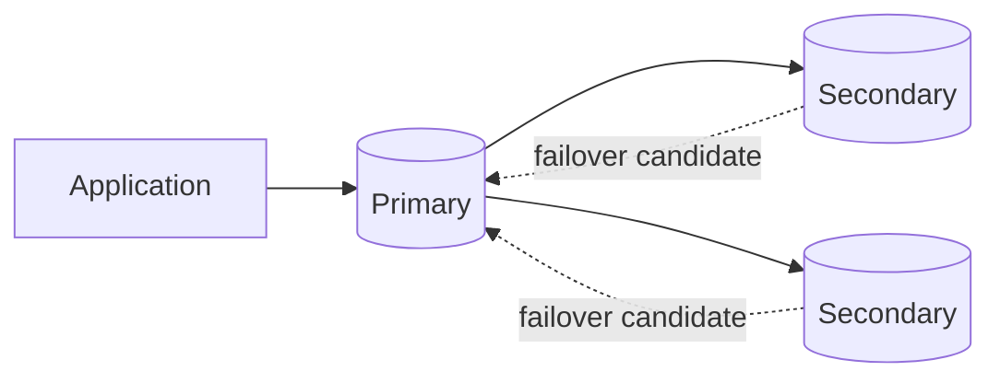

# 10- Database Inspection Commands

## Overview

MongoDB database inspection commands are used to understand the current state of a deployment without modifying application data.

For backend engineers, inspection is fundamental to:

- Verify database and collection existence
- Understand collection structure
- Inspect document counts and storage usage
- Investigate index configuration
- Check collection and database statistics
- Inspect replica-set health
- Diagnose capacity and performance problems
- Validate deployment configuration
- Support incident response
- Build operational runbooks

The primary inspection interface is `mongosh`, with additional tooling such as:

- `mongostat`
- `mongotop`
- `mongosh` administrative commands
- `mongodump` and `mongorestore` for backup workflows
- MongoDB Compass
- MongoDB Atlas monitoring

Inspection commands should generally be treated as read-only diagnostics. However, some commands can expose sensitive metadata or generate significant load, so production inspection must still be performed carefully.

## Inspection Workflow

A practical database inspection workflow is:

```text
Deployment
   ↓
Database
   ↓
Collections
   ↓
Collection statistics
   ↓
Indexes
   ↓
Query patterns
   ↓
Replica-set / cluster health
   ↓
Storage and capacity
   ↓
Performance diagnostics
```

A senior engineer should avoid immediately running expensive diagnostics against a production cluster.

Start with low-cost metadata inspection and progressively narrow the investigation.

## Connecting with `mongosh`

Connect to a local MongoDB deployment:

```bash
mongosh
```

Connect to a specific database:

```bash
mongosh "mongodb://localhost:27017/ecommerce"
```

Connect to an authenticated deployment:

```bash
mongosh \
  --host mongodb.example.com \
  --port 27017 \
  --authenticationDatabase admin \
  --username app_user
```

For production, avoid placing passwords directly in shell commands.

## Inspecting the Current Database

Check the current database:

```javascript
db
```

Example output:

```text
ecommerce
```

Switch databases:

```javascript
use ecommerce
```

The `use` command changes the current database context. It does not necessarily create the database.

A database generally becomes visible after data or another persistent database object is created.

## Listing Databases

Use:

```javascript
show dbs
```

or:

```javascript
show databases
```

For programmatic inspection:

```javascript
db.adminCommand({
  listDatabases: 1
})
```

Example:

```javascript
db.adminCommand({
  listDatabases: 1,
  nameOnly: true
})
```

Using `nameOnly` can reduce unnecessary metadata output when only database names are required.

## Database Inspection Commands

| Command | Purpose |
|---|---|
| `show dbs` | List accessible databases |
| `use <db>` | Switch database context |
| `db` | Show current database |
| `db.stats()` | Inspect database statistics |
| `db.getCollectionNames()` | List collections |
| `db.getCollectionInfos()` | Inspect collection metadata |
| `db.getName()` | Return current database name |
| `db.runCommand()` | Execute database inspection commands |
| `db.adminCommand()` | Execute administrative commands |

## Inspecting Database Statistics

Use:

```javascript
db.stats()
```

Example:

```javascript
use ecommerce

db.stats()
```

Database statistics can provide information about:

- Collection count
- Object count
- Data size
- Storage size
- Index count
- Index size
- Average object size
- File-related allocation information
- Scale-related statistics

The exact fields depend on MongoDB version and deployment configuration.

## Formatting Database Statistics

MongoDB shell output can be easier to inspect with:

```javascript
db.stats({
  scale: 1024 * 1024
})
```

This requests statistics scaled to approximately megabytes.

For example:

```javascript
db.stats({
  scale: 1024 * 1024
})
```

Scaling changes how values are represented; it does not change the underlying database.

## Database Statistics for Capacity Analysis

A useful inspection sequence is:

```javascript
const stats = db.stats()

stats
```

Important fields commonly include:

```text
collections
objects
dataSize
storageSize
indexes
indexSize
avgObjSize
```

These values help answer:

- How large is the logical dataset?
- How much storage is consumed?
- How many indexes exist?
- How large are indexes?
- Is average document size increasing?

Do not treat `dataSize` and `storageSize` as interchangeable.

## Logical Size vs Storage Size

Conceptually:

```text
Logical document data
        ↓
     dataSize

Physical storage allocation
        ↓
    storageSize

Indexes
        ↓
    indexSize
```

A database can have:

```text
dataSize    = 500 GB
storageSize = 700 GB
indexSize   = 250 GB
```

These values answer different operational questions.

For capacity planning, inspect all relevant metrics rather than looking at document count alone.

## Listing Collections

Use:

```javascript
show collections
```

or:

```javascript
db.getCollectionNames()
```

Example:

```javascript
use ecommerce

db.getCollectionNames()
```

This is useful for quick inventory.

## Collection Metadata

For richer metadata:

```javascript
db.getCollectionInfos()
```

Example:

```javascript
db.getCollectionInfos({
  name: "orders"
})
```

This can expose collection configuration such as:

- Collection name
- Type
- Options
- Validation configuration
- Capped collection configuration
- Time-series configuration
- Other metadata

## Inspecting a Collection

MongoDB collections can be accessed dynamically:

```javascript
db.orders
```

Inspect the collection's statistics:

```javascript
db.orders.stats()
```

Inspect indexes:

```javascript
db.orders.getIndexes()
```

Inspect sample documents:

```javascript
db.orders.find().limit(5)
```

A good initial inspection is:

```javascript
db.orders.stats()
db.orders.getIndexes()
db.orders.find().limit(5)
```

This combines storage, index, and data-shape information.

## Collection Statistics

Use:

```javascript
db.orders.stats()
```

Important fields may include:

```text
count
size
storageSize
totalIndexSize
nindexes
avgObjSize
wiredTiger
```

The exact fields vary by storage engine and MongoDB version.

## Collection Size

A useful conceptual model is:

```text
Collection size
    ↓
Logical document data

Storage size
    ↓
Allocated storage

Index size
    ↓
Index structures
```

For capacity analysis, inspect:

```javascript
db.orders.stats({
  scale: 1024 * 1024
})
```

## Document Count

Count documents using:

```javascript
db.orders.countDocuments()
```

For a filtered count:

```javascript
db.orders.countDocuments({
  status: "pending"
})
```

This is appropriate when you need an accurate count matching a filter.

Avoid assuming that every counting method has identical performance characteristics.

## Estimated Document Count

For a fast collection-level estimate:

```javascript
db.orders.estimatedDocumentCount()
```

Use this when exact filtering is unnecessary.

| Method | Use case |
|---|---|
| `countDocuments()` | Accurate count, including filters |
| `estimatedDocumentCount()` | Fast collection-level estimate |

For dashboards where an exact count is unnecessary, the estimated method can reduce unnecessary work.

## Sampling Documents

Inspect a small number of documents:

```javascript
db.orders.find().limit(5)
```

Inspect a specific shape:

```javascript
db.orders.find(
  {},
  {
    _id: 1,
    customerId: 1,
    status: 1,
    createdAt: 1
  }
).limit(10)
```

Projection is useful during operational inspection because it reduces unnecessary output.

## Random Sampling

For representative inspection of a large collection, avoid scanning the entire collection simply to understand data shape.

Aggregation can sample documents:

```javascript
db.orders.aggregate([
  { $sample: { size: 10 } }
])
```

This is useful when you want examples distributed across the collection rather than simply the first documents returned.

However, `$sample` can have different execution characteristics depending on the pipeline and collection size, so avoid repeatedly running expensive sampling operations against a heavily loaded production cluster.

## Inspecting Field Shapes

MongoDB is schema-flexible, so two documents in the same collection can have different structures.

Example:

```javascript
db.orders.find(
  {},
  {
    customerId: 1,
    status: 1,
    shippingAddress: 1
  }
).limit(10)
```

For more systematic schema analysis, MongoDB Compass can provide schema analysis capabilities.

Do not assume:

```text
Collection = fixed relational table schema
```

Instead:

```text
Collection
    ↓
Document shape conventions
    ↓
Application validation
    +
MongoDB schema validation where appropriate
```

## Inspecting Schema Validation

Inspect collection metadata:

```javascript
db.getCollectionInfos({
  name: "orders"
})
```

Look for validation-related configuration such as:

```text
validator
validationLevel
validationAction
```

Example collection configuration might contain a validator:

```javascript
{
  validator: {
    $jsonSchema: {
      bsonType: "object",
      required: [
        "customerId",
        "status"
      ]
    }
  }
}
```

Inspection is particularly important during migrations because validation rules can reject writes from older application versions.

## Inspecting Collection Options

Use:

```javascript
db.getCollectionInfos({
  name: "orders"
})
```

This is useful for identifying special collection configurations such as:

- Capped collections
- Time-series collections
- Validation rules
- Collection options

Do not infer collection behavior only from the collection name.

## Listing Indexes

Use:

```javascript
db.orders.getIndexes()
```

Example:

```javascript
use ecommerce

db.orders.getIndexes()
```

A typical result includes:

```javascript
[
  {
    v: 2,
    key: {
      _id: 1
    },
    name: "_id_"
  },
  {
    v: 2,
    key: {
      customerId: 1,
      createdAt: -1
    },
    name: "customerId_1_createdAt_-1"
  }
]
```

## Inspecting Index Size

Collection statistics can expose aggregate index size:

```javascript
db.orders.stats({
  scale: 1024 * 1024
})
```

Look for:

```text
totalIndexSize
```

Index statistics can also be inspected with:

```javascript
db.orders.aggregate([
  {
    $indexStats: {}
  }
])
```

This is useful for understanding index usage.

## Index Usage Inspection

Example:

```javascript
db.orders.aggregate([
  {
    $indexStats: {}
  }
])
```

This can help identify indexes that receive little or no usage.

However, absence of observed usage does not automatically prove that an index should be removed.

Consider:

- Observation period
- Traffic patterns
- Scheduled jobs
- Disaster-recovery workloads
- Reporting workloads
- Rare but critical queries
- Deployment changes

Index removal should be treated as a production change, not a cleanup exercise.

## Inspecting Query Plans

Use:

```javascript
db.orders.find({
  customerId: ObjectId("64f000000000000000000001")
}).explain("executionStats")
```

Important fields include:

```text
nReturned
totalKeysExamined
totalDocsExamined
executionTimeMillis
winningPlan
```

A basic diagnostic rule is:

```text
Returned documents
        ↓
Compare
        ↓
Keys examined
        ↓
Documents examined
```

If a query returns a small number of documents but examines a very large number of keys or documents, investigate the query and index design.

## Query Planner Inspection

Use:

```javascript
db.orders.find({
  status: "pending"
}).explain("queryPlanner")
```

This focuses on the selected query plan.

For execution statistics:

```javascript
db.orders.find({
  status: "pending"
}).explain("executionStats")
```

For deeper plan evaluation:

```javascript
db.orders.find({
  status: "pending"
}).explain("allPlansExecution")
```

## Common Query Plan Stages

| Stage | Meaning |
|---|---|
| `COLLSCAN` | Collection scan |
| `IXSCAN` | Index scan |
| `FETCH` | Fetch full documents after index traversal |
| `SORT` | Explicit sorting stage |
| `LIMIT` | Limit results |
| `PROJECTION` | Projection processing |

A `COLLSCAN` is not automatically a bug.

For a very small collection, a collection scan can be cheaper than using an index.

The important question is whether the plan is appropriate for the workload and data volume.

## Inspecting a Slow Query

A practical workflow:

```text
Slow endpoint
    ↓
Identify MongoDB query
    ↓
Run explain("executionStats")
    ↓
Inspect winning plan
    ↓
Check COLLSCAN / IXSCAN
    ↓
Compare nReturned
with
totalDocsExamined
and
totalKeysExamined
    ↓
Check sort stage
    ↓
Review index design
    ↓
Retest
```

Example:

```javascript
db.orders.find({
  customerId: ObjectId("64f000000000000000000001"),
  status: "completed"
})
.sort({
  createdAt: -1
})
.limit(20)
.explain("executionStats")
```

The result should be evaluated against the actual production access pattern.

## Inspecting Aggregation Plans

Use:

```javascript
db.orders.aggregate([
  {
    $match: {
      status: "completed"
    }
  },
  {
    $group: {
      _id: "$customerId",
      total: {
        $sum: "$amount"
      }
    }
  }
]).explain("executionStats")
```

This helps determine whether filtering, indexing, grouping, or sorting is contributing to the workload.

## Collection Validation

MongoDB provides a collection validation command for diagnostic purposes:

```javascript
db.runCommand({
  validate: "orders"
})
```

This is an administrative diagnostic operation and can be resource-intensive depending on the collection and validation mode.

Do not run expensive validation operations casually on a heavily loaded production database.

Use them under an operational plan.

## Database Command Inspection

MongoDB administrative inspection is commonly performed with:

```javascript
db.runCommand({
  <command>: 1
})
```

Examples:

```javascript
db.runCommand({
  connectionStatus: 1
})
```

```javascript
db.runCommand({
  dbStats: 1
})
```

```javascript
db.runCommand({
  collStats: "orders"
})
```

Command availability and privileges vary by MongoDB version and deployment.

## Database Statistics with `dbStats`

Explicitly invoke:

```javascript
db.runCommand({
  dbStats: 1
})
```

This is conceptually similar to:

```javascript
db.stats()
```

Use the shell helper when it provides the information you need; use `runCommand()` when you need more direct command-level control.

## Collection Statistics with `collStats`

Use:

```javascript
db.runCommand({
  collStats: "orders"
})
```

This is useful for operational inspection of a specific collection.

For scaled output:

```javascript
db.runCommand({
  collStats: "orders",
  scale: 1024 * 1024
})
```

Inspect fields relevant to:

- Logical size
- Storage
- Document count
- Indexes
- Index size
- Collection-specific statistics

## Database Inspection vs Application Queries

Operational inspection should not replace application-level observability.

For example:

```text
MongoDB statistics
        +
Query explain plans
        +
Application latency
        +
API metrics
        +
Distributed tracing
```

A MongoDB query may be fast in isolation but still contribute to high endpoint latency because of:

- Network latency
- Connection pool waits
- Serialization
- Application processing
- External service calls
- Lock/contention effects
- Multiple sequential database queries

Senior-level performance analysis considers the complete request path.

## Replica-Set Inspection

Check replica-set status:

```javascript
rs.status()
```

This is one of the most important operational commands for replica-set deployments.

Inspect:

- Members
- State
- Primary
- Secondary
- Health
- Optime information
- Replication lag indicators
- Election-related state

## Replica-Set Configuration

Inspect configuration:

```javascript
rs.conf()
```

This can reveal:

- Members
- Priority
- Votes
- Hidden members
- Delayed members
- Tags
- Replica-set configuration

Treat configuration output as sensitive infrastructure metadata.

## Replica-Set Topology

A typical replica set:



Inspection should verify that the actual deployment matches the intended architecture.

## Replication Lag

Replication lag is an important availability and consistency signal.

Conceptually:

```text
Primary operation timestamp
        -
Secondary applied timestamp
        =
Replication lag
```

Inspect replica-set state:

```javascript
rs.status()
```

For deeper analysis, inspect member optime information and compare members.

Large or increasing lag can indicate:

- Insufficient secondary resources
- Storage pressure
- Heavy write workload
- Long-running operations
- Network problems
- Initial sync
- Secondary hardware constraints

## Primary Inspection

Identify the primary through:

```javascript
db.hello()
```

The response provides topology information such as whether the connected server is primary and information about the replica set.

This is useful for:

- Connection diagnostics
- Driver troubleshooting
- Failover investigation
- Topology verification

## Server Information

Inspect server information with:

```javascript
db.serverStatus()
```

This provides extensive operational metrics.

Potential categories include:

- Connections
- Network
- Operations
- Memory
- WiredTiger
- Replication
- Locks
- Opcounters
- Storage engine statistics

`serverStatus()` can produce a large amount of output.

Use targeted inspection when possible.

## Inspecting Connections

A useful command is:

```javascript
db.serverStatus().connections
```

This can provide connection-related information such as:

```text
current
available
totalCreated
```

These metrics help identify connection pressure.

For application environments using PyMongo:

```text
Application instances
        ↓
MongoClient per process
        ↓
Connection pools
        ↓
MongoDB
```

Do not interpret MongoDB connection counts without considering the number of application processes, pods, workers, and clients.

## Inspecting Network Statistics

```javascript
db.serverStatus().network
```

This can provide network-related metrics useful for diagnosing:

- Connection churn
- Traffic volume
- Request patterns
- Network pressure

Combine these metrics with application-level network and latency monitoring.

## Inspecting Operation Counters

```javascript
db.serverStatus().opcounters
```

This can show operation categories such as:

- Queries
- Inserts
- Updates
- Deletes
- Commands
- GetMore

It provides workload-level context but is not a substitute for query-level observability.

## Inspecting WiredTiger

For deployments using WiredTiger:

```javascript
db.serverStatus().wiredTiger
```

The output is extensive.

Use targeted fields relevant to the investigation instead of dumping the entire structure into logs or incident channels.

## Server Status Considerations

`serverStatus()` is powerful but should be used carefully.

Potential problems include:

- Excessive output
- Difficult-to-parse results
- Sensitive infrastructure metadata
- Unnecessary repeated execution
- Operational noise

For automation, extract only the metrics required by the monitoring workflow.

## Storage Engine Inspection

Inspect storage-engine information through:

```javascript
db.serverStatus().storageEngine
```

This helps verify the active storage engine and related configuration details.

For most modern deployments, WiredTiger is the expected storage engine.

## MongoDB Server Version

Inspect the server version:

```javascript
db.version()
```

or:

```javascript
db.runCommand({
  buildInfo: 1
})
```

Version inspection is important before:

- Running administrative commands
- Diagnosing feature behavior
- Applying compatibility changes
- Planning upgrades
- Reviewing driver compatibility

## Build Information

Use:

```javascript
db.runCommand({
  buildInfo: 1
})
```

This can expose:

- Version
- Build information
- Modules
- Platform information
- Build environment details

Avoid unnecessarily exposing this information outside trusted operational environments.

## Host Information

Inspect host information:

```javascript
db.hostInfo()
```

This can provide system-level information relevant to operational diagnostics.

Use this only when the required privileges and deployment environment make it appropriate.

## Current Operations

MongoDB provides:

```javascript
db.currentOp()
```

for inspecting currently executing operations, subject to permissions and deployment capabilities.

Use it when investigating:

- Long-running operations
- Stuck requests
- Unexpected workload
- Operational incidents

Current-operation inspection should be used carefully in production because the output can be large and may expose operational details.

## Killing an Operation

Operation termination is an operational action rather than a pure inspection task.

If an operation must be terminated, identify it carefully first and follow the deployment's operational runbook.

Never kill arbitrary production operations based only on execution duration.

Consider:

- Application impact
- Transaction state
- Locking
- Replication
- Whether the operation is part of a critical workflow
- Whether termination will simply cause the application to retry it

## Collection Lock and Concurrency Investigation

Modern MongoDB uses concurrency mechanisms that should not be reduced to simplistic "table lock" terminology.

When diagnosing contention, inspect:

- Query latency
- Current operations
- Server metrics
- WiredTiger metrics
- CPU
- Storage latency
- Connection pressure
- Application concurrency

Do not assume that every slow query is caused by a database lock.

## Inspecting Current Database Name

Use:

```javascript
db.getName()
```

Example:

```javascript
use ecommerce

db.getName()
```

This is useful in scripts where the current database context must be determined programmatically.

## Inspecting Collection Names Programmatically

```javascript
db.getCollectionNames().forEach(
  name => print(name)
)
```

This is useful for operational scripts.

For richer metadata:

```javascript
db.getCollectionInfos().forEach(
  info => printjson(info)
)
```

Avoid printing large metadata structures into automated logs unless required.

## Inspecting All Collections

A simple inventory:

```javascript
db.getCollectionNames().forEach(name => {
  print(name)
})
```

A more useful inventory can include collection statistics:

```javascript
db.getCollectionNames().forEach(name => {
  const stats = db.getCollection(name).stats()

  printjson({
    collection: name,
    count: stats.count,
    size: stats.size,
    storageSize: stats.storageSize,
    totalIndexSize: stats.totalIndexSize
  })
})
```

This is useful for operational reporting, but running statistics across many large collections should be planned carefully.

## Database Inventory Script

A basic inspection script:

```javascript
const databases = db.adminCommand({
  listDatabases: 1,
  nameOnly: false
})

databases.databases.forEach(database => {
  printjson({
    name: database.name,
    sizeOnDisk: database.sizeOnDisk,
    empty: database.empty
  })
})
```

Use appropriate privileges and avoid exposing the output outside trusted operational channels.

## Collection Inventory Script

```javascript
db.getCollectionNames().forEach(name => {
  const collection = db.getCollection(name)
  const stats = collection.stats()

  printjson({
    name,
    count: stats.count,
    size: stats.size,
    storageSize: stats.storageSize,
    indexes: stats.nindexes,
    totalIndexSize: stats.totalIndexSize
  })
})
```

For a large production deployment, run this as an intentional diagnostic rather than continuously.

## Inspecting Index Definitions Across Collections

```javascript
db.getCollectionNames().forEach(name => {
  print(`\nCollection: ${name}`)

  db.getCollection(name)
    .getIndexes()
    .forEach(index => printjson(index))
})
```

This can quickly expose:

- Missing indexes
- Unexpected indexes
- Duplicate-looking indexes
- Large numbers of indexes
- Inconsistent indexing conventions

Index inspection should be combined with actual query patterns.

## Database Inspection for Incident Response

During an incident, avoid random command execution.

Use a controlled sequence:

```text
1. Identify affected service
2. Identify target database
3. Check server connectivity
4. Check replica-set state
5. Check connection pressure
6. Check operation rate
7. Check collection statistics
8. Check relevant indexes
9. Explain affected queries
10. Compare database metrics with application metrics
```

This reduces diagnostic noise and makes incident timelines easier to reconstruct.

## Production Inspection Checklist

| Area | Commands / tools |
|---|---|
| Current database | `db`, `db.getName()` |
| Databases | `show dbs`, `listDatabases` |
| Collections | `show collections`, `getCollectionNames()` |
| Collection metadata | `getCollectionInfos()` |
| Database statistics | `db.stats()` |
| Collection statistics | `collStats`, `collection.stats()` |
| Document count | `countDocuments()` |
| Estimated count | `estimatedDocumentCount()` |
| Indexes | `getIndexes()` |
| Index usage | `$indexStats` |
| Query plans | `explain()` |
| Server metrics | `serverStatus()` |
| Replica set | `rs.status()` |
| Replica configuration | `rs.conf()` |
| Topology | `db.hello()` |
| Current operations | `db.currentOp()` |
| Version | `db.version()` |
| Build information | `buildInfo` |

## Inspection and Security

Inspection commands can expose sensitive information.

Potentially sensitive data includes:

- Database names
- Collection names
- Index definitions
- Host information
- Network metadata
- User information
- Query information
- Application data
- Deployment topology
- Operational metrics

Do not automatically send raw diagnostic output to:

- Public issue trackers
- Untrusted chat channels
- Client-facing logs
- External monitoring systems without appropriate controls

Use least privilege for operational users.

## Inspection in Production

A production inspection strategy should follow:

```text
Low impact
    ↓
Metadata inspection
    ↓
Targeted statistics
    ↓
Targeted explain
    ↓
Server metrics
    ↓
Current-operation inspection
    ↓
High-cost diagnostics
```

The goal is to gather enough information to identify the problem without becoming part of the incident.

## Performance Considerations

Inspection itself can consume resources.

Potentially expensive activities include:

- Large aggregation pipelines
- `$sample` on large collections
- Collection validation
- Broad diagnostic queries
- Repeated statistics collection
- Extensive current-operation polling
- Running `explain()` against expensive queries
- Dumping very large diagnostic structures

Use targeted commands and limit output.

## MongoDB Compass Inspection

MongoDB Compass provides a graphical alternative for inspection.

Typical workflow:

```text
Connect
  ↓
Select database
  ↓
Select collection
  ↓
Inspect documents
  ↓
Inspect schema
  ↓
Inspect indexes
  ↓
Build aggregation
  ↓
Analyze queries
```

Compass is useful for interactive investigation, but production diagnosis should remain reproducible through documented commands and runbooks.

## Inspection in Docker

For a MongoDB container:

```bash
docker exec -it mongodb mongosh
```

Then:

```javascript
show dbs
```

Inspect a database:

```javascript
use ecommerce
db.stats()
```

Inspect a collection:

```javascript
db.orders.stats()
db.orders.getIndexes()
```

Avoid assuming the container name is always `mongodb`; inspect the actual deployment configuration.

## Inspection in Kubernetes

For a MongoDB pod:

```bash
kubectl exec -it <mongodb-pod> -- mongosh
```

For production Kubernetes environments, prefer the deployment's supported operational access pattern.

Do not expose MongoDB directly to the public internet simply to make administrative inspection easier.

## Inspection Through a Replica Set

When connecting to a replica set, use an appropriate replica-set-aware connection string.

Example:

```text
mongodb://node1,node2,node3/ecommerce?replicaSet=rs0&authSource=admin
```

The driver can then perform topology discovery and failover handling.

Inspection should verify:

```text
Expected replica set name
        ↓
Actual replica set name
        ↓
Members
        ↓
Primary
        ↓
Secondaries
        ↓
Health
```

## Inspection Through MongoDB Atlas

MongoDB Atlas provides operational dashboards for:

- Connections
- CPU
- Memory
- Storage
- Query performance
- Replication
- Network
- Alerts

The CLI and `mongosh` remain valuable for targeted investigation, while Atlas provides broader managed-service observability.

Use both when troubleshooting production workloads.

## Database Inspection Anti-Patterns

### Inspecting Everything First

Problem:

```text
serverStatus()
currentOp()
all collections
all indexes
large aggregations
```

all at once.

Why it is problematic:

- Produces excessive output
- Makes diagnosis harder
- Can add workload
- Obscures the actual problem

Start narrow and expand.

### Using `find()` Without a Limit

Avoid:

```javascript
db.orders.find()
```

during production inspection if the intent is only to inspect sample documents.

Prefer:

```javascript
db.orders.find().limit(10)
```

### Dumping Entire Documents

Avoid:

```javascript
db.users.find().limit(100)
```

when documents may contain sensitive or large fields.

Prefer targeted projection:

```javascript
db.users.find(
  {},
  {
    _id: 1,
    email: 1,
    status: 1
  }
).limit(20)
```

### Assuming `COLLSCAN` Always Means Failure

A collection scan may be entirely reasonable for a tiny collection.

Evaluate:

```text
Collection size
+
Query frequency
+
Latency requirement
+
Returned rows
+
Execution statistics
```

### Removing Unused Indexes Immediately

An index with low observed usage may still support:

- Rare administrative queries
- Monthly reports
- Disaster-recovery procedures
- New application traffic
- Failover scenarios

Review workload history before removing it.

## Troubleshooting Methodology

### Database Not Found

```text
Symptom
↓
Database does not appear
↓
Possible causes
    - No persistent objects created
    - Wrong MongoDB deployment
    - Wrong credentials
    - Wrong connection target
    - Insufficient privileges
↓
Isolation strategy
↓
Check db.getName()
↓
Check show dbs
↓
Check connection target
↓
Check authenticated identity
↓
Root cause
↓
Corrective action
↓
Prevention
    - Standardized connection configuration
    - Deployment verification
```

### Collection Missing

```text
Symptom
↓
Expected collection does not exist
↓
Possible causes
    - Wrong database
    - Collection not created
    - Migration not executed
    - Typographical mismatch
    - Different deployment environment
↓
Isolation strategy
↓
db.getName()
↓
db.getCollectionNames()
↓
Check deployment configuration
↓
Check migration history
↓
Root cause
↓
Corrective action
↓
Prevention
    - Migration automation
    - Environment validation
```

### Database Size Unexpectedly Large

```text
Symptom
↓
Storage usage increased unexpectedly
↓
Possible causes
    - Data growth
    - Index growth
    - Large documents
    - Collection growth
    - Retention failure
    - Temporary workload
↓
Isolation strategy
↓
db.stats()
↓
Collection-level stats
↓
Index statistics
↓
Identify largest collections
↓
Inspect document growth
↓
Root cause
↓
Corrective action
↓
Prevention
    - Retention policy
    - TTL indexes where appropriate
    - Capacity monitoring
    - Index review
```

### Query Suddenly Becomes Slow

```text
Symptom
↓
API/database latency increased
↓
Possible causes
    - Query plan change
    - Data growth
    - Missing index
    - Poor selectivity
    - Sort stage
    - Resource contention
    - Replication / topology issue
↓
Isolation strategy
↓
Capture actual query
↓
Run explain("executionStats")
↓
Compare keys/docs examined
↓
Inspect indexes
↓
Inspect server metrics
↓
Compare application latency
↓
Root cause
↓
Corrective action
↓
Prevention
    - Query regression testing
    - Index monitoring
    - Performance baselines
```

### Replica Set Appears Unhealthy

```text
Symptom
↓
Failover or replication problem
↓
Possible causes
    - Member unavailable
    - Network failure
    - Secondary lag
    - Storage pressure
    - Election instability
    - Resource exhaustion
↓
Isolation strategy
↓
rs.status()
↓
rs.conf()
↓
db.hello()
↓
Inspect server metrics
↓
Check replication lag
↓
Root cause
↓
Corrective action
↓
Prevention
    - Replica monitoring
    - Alerting
    - Capacity planning
    - Failure testing
```

## Operational Best Practices

- Start with low-cost inspection commands.
- Use projections when inspecting production documents.
- Limit result sets.
- Avoid exposing sensitive document data in diagnostic output.
- Record the MongoDB server version during incidents.
- Inspect replica-set health before diagnosing application-level failover issues.
- Compare logical data size with physical storage and index size.
- Review index definitions alongside actual query plans.
- Use `explain("executionStats")` for targeted performance diagnosis.
- Do not assume every `COLLSCAN` is problematic.
- Do not remove indexes solely because current usage appears low.
- Avoid repeated high-cost diagnostics on heavily loaded production systems.
- Combine MongoDB inspection with application metrics and distributed tracing.
- Document repeatable inspection commands in operational runbooks.
- Restrict operational database access using least privilege.
- Treat diagnostic output as potentially sensitive infrastructure information.

## Interview Considerations

### What is the difference between `db.stats()` and `db.<collection>.stats()`?

`db.stats()` provides database-level statistics, while collection statistics provide information about a specific collection.

### Why can `storageSize` be larger than `dataSize`?

Logical document data and physical storage allocation are different measurements. Storage-engine behavior, allocation, and internal storage characteristics can make physical storage larger than logical data size.

### What does `totalIndexSize` tell you?

It indicates the aggregate size of indexes associated with the collection or database context being inspected. It is useful for understanding index storage overhead.

### Is `COLLSCAN` always bad?

No.

A collection scan can be appropriate for small collections or queries where an index would not provide a meaningful benefit. Evaluate the execution statistics and workload requirements.

### What is the purpose of `explain("executionStats")`?

It executes or evaluates the query with execution statistics so engineers can inspect metrics such as:

```text
nReturned
totalKeysExamined
totalDocsExamined
executionTimeMillis
winningPlan
```

These metrics help identify inefficient query and index behavior.

### Why should `db.serverStatus()` not be used blindly?

It can return a large amount of operational information and may expose sensitive metadata or create unnecessary diagnostic overhead. Target the metrics relevant to the investigation.

### How would you investigate increasing MongoDB storage usage?

Start with:

```text
db.stats()
↓
Identify large collections
↓
collection.stats()
↓
Compare data size and storage size
↓
Inspect index size
↓
Review document growth
↓
Review retention
```

### How would you investigate a production API slowdown?

Do not begin by assuming MongoDB is the root cause.

Trace:

```text
API latency
↓
Database query latency
↓
MongoDB explain plan
↓
Index usage
↓
Connection pool behavior
↓
MongoDB server metrics
↓
Replication/topology
```

This separates database execution time from application and infrastructure latency.

## Key Takeaways

- **Use database, collection, index, and server inspection progressively; start with low-cost metadata before running expensive diagnostics.**
- **`db.stats()`, collection statistics, `getIndexes()`, `explain("executionStats")`, and replica-set inspection form the core toolkit for MongoDB operational diagnosis.**
- **Interpret `dataSize`, `storageSize`, `indexSize`, document counts, and query execution metrics separately; each measures a different aspect of system behavior.**
- **Production inspection must consider performance and security: limit results, use projections, avoid unnecessary scans, and protect diagnostic output.**
- **A senior troubleshooting workflow correlates MongoDB inspection with application latency, connection behavior, resource metrics, replication health, and actual workload patterns.**