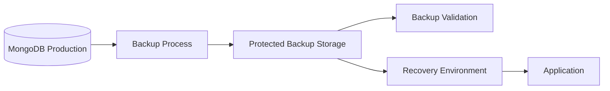
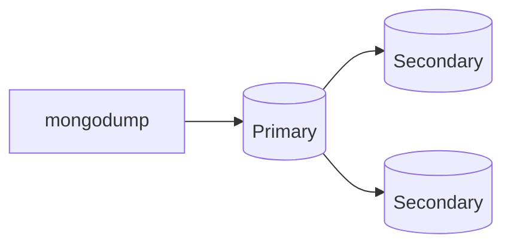
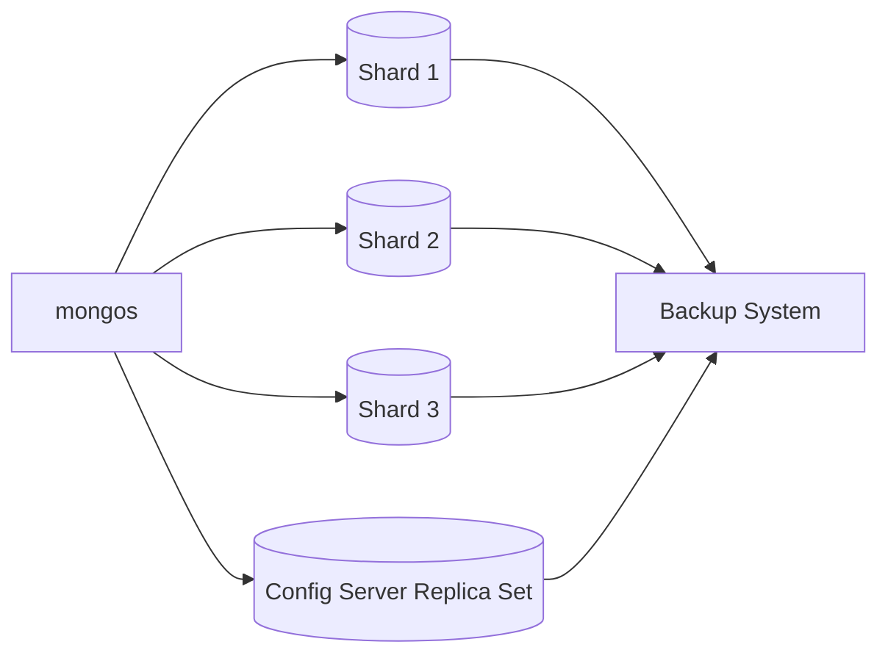
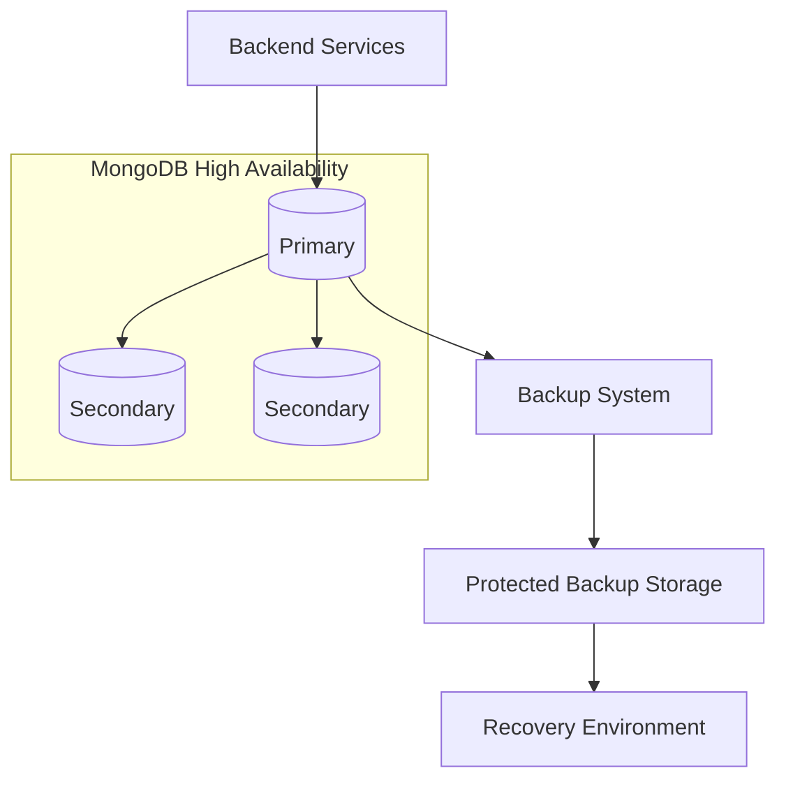

# 12- Backup and Restore Commands

## Overview

MongoDB backup and restore operations are responsible for preserving database state and recovering it after data loss, corruption, deployment failure, operator error, or infrastructure failure.

The core MongoDB logical backup tools are:

| Tool | Purpose | Primary format |
|---|---|---|
| `mongodump` | Create logical MongoDB backups | BSON |
| `mongorestore` | Restore logical MongoDB backups | BSON |
| `mongoexport` | Export data for interchange | JSON / CSV / TSV |
| `mongoimport` | Import interchange data | JSON / CSV / TSV |

The most important distinction is:

```text
Data interchange
    ├── mongoexport
    └── mongoimport

Logical backup / restore
    ├── mongodump
    └── mongorestore

Managed / production backup
    ├── Cloud backups
    ├── Filesystem / storage snapshots
    └── Point-in-time recovery mechanisms
```

A production backup strategy is not simply:

```bash
mongodump
```

A reliable strategy must also define:

- Recovery Point Objective (RPO)
- Recovery Time Objective (RTO)
- Backup frequency
- Backup retention
- Backup storage location
- Encryption
- Access control
- Backup integrity validation
- Restore procedures
- Restore testing
- Failure handling
- Disaster-recovery architecture

A backup that has never been restored should be treated as an unverified recovery mechanism.

## Backup Strategy

A production MongoDB backup architecture should look conceptually like:



The backup system should be separated from the primary database failure domain where practical.

For example:

```text
Production MongoDB
        ↓
Backup process
        ↓
Separate backup storage
        ↓
Separate recovery environment
```

Do not keep the only copy of a backup on the same disk or host as the database.

## RPO and RTO

### Recovery Point Objective

RPO answers:

> How much recent data can the organization afford to lose?

Example:

```text
RPO = 15 minutes
```

The backup and replication architecture must support recovery to a point no more than approximately 15 minutes behind the failure, subject to the actual backup and recovery mechanism.

### Recovery Time Objective

RTO answers:

> How long can the service remain unavailable?

Example:

```text
RTO = 1 hour
```

The recovery process must be capable of restoring service within the required time under the defined failure scenario.

### RPO vs RTO

| Requirement | Question |
|---|---|
| RPO | How much data loss is acceptable? |
| RTO | How much downtime is acceptable? |

Backup frequency primarily affects achievable RPO, while restore architecture and operational automation strongly affect achievable RTO.

## Backup Mechanisms

MongoDB environments commonly use several backup approaches.

| Mechanism | Characteristics | Typical use |
|---|---|---|
| `mongodump` | Logical BSON backup | Small/medium datasets, migrations, logical recovery |
| Managed backups | Provider-managed | Production Atlas deployments |
| Filesystem/storage snapshots | Physical/storage-level | Large self-managed deployments |
| Point-in-time recovery | Recovery to a specific time | Production DR |
| Replication | HA, not backup | Failover and availability |

Replication is not a substitute for backup.

If an application accidentally deletes every document:

```text
Primary
   ↓
Accidental delete
   ↓
Replication
   ↓
Secondaries
```

the deletion can propagate to every replica.

A separate backup or point-in-time recovery mechanism is required for recovery from logical corruption.

## `mongodump`

`mongodump` creates a logical backup containing MongoDB data in BSON format and associated metadata.

Basic database backup:

```bash
mongodump \
  --uri "mongodb://localhost:27017/ecommerce" \
  --out ./backup
```

This produces a directory containing database and collection dump files.

## Backing Up an Entire Deployment

A deployment-level dump can be created with:

```bash
mongodump \
  --uri "mongodb://localhost:27017" \
  --out ./backup
```

This can include databases accessible through the connection.

For production, explicitly define the intended backup scope rather than assuming the command's default scope matches the recovery requirement.

## Backing Up a Specific Database

```bash
mongodump \
  --uri "mongodb://localhost:27017" \
  --db ecommerce \
  --out ./backup
```

This is useful when:

- Only one application database requires recovery
- Database-level migration is required
- Backup storage should be limited
- A test restore targets one database

## Backing Up a Specific Collection

```bash
mongodump \
  --uri "mongodb://localhost:27017/ecommerce" \
  --collection orders \
  --out ./backup
```

This is useful for targeted migration or recovery.

It should not automatically be treated as a complete database backup because other collections and database-level requirements may be excluded.

## Archive Format

Instead of producing a directory tree, `mongodump` can create a single archive:

```bash
mongodump \
  --uri "mongodb://localhost:27017/ecommerce" \
  --archive=./ecommerce.archive
```

This is useful for:

- Simple file movement
- Object-storage uploads
- CI/CD workflows
- Single-artifact management

## Compressed Archives

Use gzip compression:

```bash
mongodump \
  --uri "mongodb://localhost:27017/ecommerce" \
  --archive=./ecommerce.archive.gz \
  --gzip
```

Compression reduces storage and transfer size at the cost of additional CPU work.

For large production datasets, evaluate:

```text
CPU cost
+
compression ratio
+
network bandwidth
+
storage cost
```

## Backup with Authentication

Example:

```bash
mongodump \
  --host mongodb.example.com \
  --port 27017 \
  --username backup_user \
  --authenticationDatabase admin \
  --db ecommerce \
  --out ./backup
```

Avoid embedding passwords directly into commands.

Use supported credential prompting or secure secret injection.

## Backup with TLS

A production MongoDB deployment may require TLS:

```bash
mongodump \
  --uri "mongodb://mongodb.example.com/ecommerce?authSource=admin" \
  --tls \
  --tlsCAFile /etc/mongodb/ca.pem \
  --username backup_user \
  --archive=./ecommerce.archive.gz \
  --gzip
```

Use the TLS configuration required by the deployment.

Never disable certificate validation merely to bypass a production connectivity problem.

## Backup User Permissions

Create a dedicated backup identity rather than using an application or administrative account.

Conceptually:

```text
Application
    ↓
app_user

Backup process
    ↓
backup_user

Human administration
    ↓
admin_user
```

The backup identity should have only the permissions required for its backup workflow.

## Backup from a Replica Set

A logical backup can be performed against a replica-set deployment.

Architecture:



Depending on the backup architecture and consistency requirements, backup workloads may be directed to an appropriate replica-set member.

However, a backup running against a secondary still consumes resources.

Monitor:

- CPU
- Disk I/O
- Network
- Replication lag
- Application latency

Do not assume that using a secondary makes a large backup operationally free.

## Backup Consistency

Backup consistency is more important than simply producing a file.

Consider:

```text
Multiple collections
        ↓
Related application state
        ↓
Concurrent writes
        ↓
Backup consistency requirements
```

For a production recovery system, determine whether the selected backup mechanism provides the required consistency guarantees.

For multi-database or multi-collection recovery requirements, use a backup mechanism appropriate to the required consistency model rather than assembling unrelated collection dumps manually.

## Backup of a Sharded Cluster

A sharded deployment introduces additional complexity:



A sharded cluster backup must account for:

- All shards
- Config server metadata
- Sharding configuration
- Backup consistency
- Cluster topology
- Recovery ordering

Do not design a sharded-cluster DR strategy by simply running independent collection dumps without understanding the cluster's consistency and metadata requirements.

## `mongorestore`

`mongorestore` restores BSON data produced by `mongodump`.

Restore a directory:

```bash
mongorestore \
  --uri "mongodb://localhost:27017" \
  ./backup
```

Restore a compressed archive:

```bash
mongorestore \
  --uri "mongodb://localhost:27017" \
  --gzip \
  --archive=./ecommerce.archive.gz
```

## Restoring a Specific Database

Example:

```bash
mongorestore \
  --uri "mongodb://localhost:27017" \
  --db ecommerce \
  ./backup/ecommerce
```

Use the database-scoping options appropriate for the MongoDB Database Tools version in use.

## Restoring a Specific Collection

A collection can be restored selectively:

```bash
mongorestore \
  --uri "mongodb://localhost:27017" \
  --db ecommerce \
  --collection orders \
  ./backup/ecommerce/orders.bson
```

This is useful for targeted recovery.

It is not equivalent to restoring the entire database.

## Restore into a Clean Environment

A strong restore test starts with an isolated target:

```text
Backup artifact
      ↓
Clean MongoDB environment
      ↓
mongorestore
      ↓
Validation
      ↓
Application smoke test
```

Do not test disaster recovery for the first time during an actual production incident.

## Restoring to a Different Database

Namespace remapping can be useful for recovery testing.

Conceptually:

```text
ecommerce
    ↓
backup
    ↓
restore
    ↓
ecommerce_restore
```

This allows validation without overwriting the production database.

For example, namespace mapping can be used with:

```bash
mongorestore \
  --uri "mongodb://localhost:27017" \
  --nsFrom="ecommerce.*" \
  --nsTo="ecommerce_restore.*" \
  ./backup
```

Always validate the namespace mapping before executing a production restore.

## Restoring to a Different Environment

A common DR test:

```text
Production
    ↓
Backup
    ↓
Development / DR MongoDB
    ↓
Restore
    ↓
Validation
    ↓
Application test
```

The target should have compatible:

- MongoDB version
- Authentication configuration
- Storage capacity
- Network configuration
- Application driver compatibility

## Restore into Existing Data

Restoring into an existing database can cause conflicts.

Potential problems include:

- Duplicate `_id`
- Existing unique indexes
- Conflicting data
- Existing collections
- Schema differences
- Unexpected merge behavior

For controlled recovery, prefer restoring into a clean target when possible.

If an existing target must be used, explicitly define whether the operation should:

- Merge
- Replace
- Drop
- Restore selectively

## Dropping Existing Collections During Restore

Some restore workflows use options that drop existing collections before restoration.

This is destructive.

Conceptually:

```text
Existing collection
        ↓
DROP
        ↓
Restore backup
```

Before using destructive restore options:

- Verify target environment
- Verify backup integrity
- Confirm recovery point
- Confirm rollback plan
- Confirm operator authorization

A typo in a production restore command can turn a recovery operation into a data-loss event.

## `--drop` Considerations

A restore command may use:

```bash
mongorestore \
  --drop \
  --uri "mongodb://localhost:27017" \
  ./backup
```

This can remove existing collections before restoring the corresponding collections from the backup.

Use it only when the desired recovery model explicitly requires replacement.

Do not use `--drop` as a generic fix for restore conflicts.

## Restore Ordering

When recovering a complex application, restore the database before switching application traffic.

A typical workflow is:

```text
Restore infrastructure
        ↓
Restore MongoDB
        ↓
Validate database
        ↓
Validate indexes
        ↓
Validate application queries
        ↓
Deploy / connect application
        ↓
Smoke test
        ↓
Redirect traffic
```

Do not point the application at an unvalidated recovery database.

## Restore Validation

At minimum, validate:

```text
Database exists
↓
Collections exist
↓
Document counts are plausible
↓
Indexes exist
↓
Representative documents are correct
↓
BSON types are correct
↓
Queries execute correctly
↓
Application can connect
```

Example:

```javascript
use ecommerce

db.orders.countDocuments()

db.orders.getIndexes()

db.orders.find().limit(5)
```

## Restore Validation with Application Queries

Database-level validation is not enough.

Test representative application operations:

```text
GET /orders/{id}
POST /orders
GET /orders?customer_id=...
```

For internal services, test representative repository methods.

A database can be technically restored while the application remains broken because of:

- Missing indexes
- Schema incompatibility
- Incorrect environment variables
- Changed database names
- Missing collections
- Driver incompatibility

## Restore Validation Checklist

| Area | Validation |
|---|---|
| Connectivity | Application can connect |
| Authentication | Credentials work |
| Databases | Expected databases exist |
| Collections | Expected collections exist |
| Counts | Counts are plausible |
| Documents | Sample data is valid |
| BSON types | Critical types preserved |
| Indexes | Required indexes exist |
| Queries | Representative queries work |
| Transactions | Critical transactional workflows work |
| Application | Smoke tests pass |
| Performance | Baseline queries remain acceptable |

## Backup Integrity

A backup should be validated at multiple levels.

### File-Level Validation

Verify:

- File exists
- File size is plausible
- Archive can be opened
- Checksums match if used

Example:

```bash
sha256sum ecommerce.archive.gz
```

### Database-Level Validation

Restore the archive into an isolated MongoDB environment.

### Application-Level Validation

Run representative application workflows.

The strongest validation is:

```text
Backup
↓
Restore
↓
Database validation
↓
Application validation
```

## Backup Checksums

A checksum can detect accidental file corruption.

Example:

```bash
sha256sum ecommerce.archive.gz > ecommerce.archive.gz.sha256
```

Validate later:

```bash
sha256sum -c ecommerce.archive.gz.sha256
```

A checksum does not prove that the backup represents a correct database state. It only helps verify file integrity.

## Backup Encryption

Backups can contain the entire production dataset.

Treat backup files as sensitive assets.

A secure architecture is:

```text
MongoDB
    ↓
Backup
    ↓
Encryption
    ↓
Protected object storage
    ↓
Restricted access
```

Use encryption appropriate to the environment.

For AWS, an object-storage workflow may use server-side encryption and tightly scoped IAM permissions.

## Backup Storage

Avoid:

```text
MongoDB host
    ├── database
    └── only backup copy
```

A host failure can destroy both.

Prefer:

```text
MongoDB
    ↓
Backup
    ↓
Separate storage failure domain
```

Examples include:

- Object storage
- Separate backup infrastructure
- Managed database backup services
- Cross-region backup storage

## Backup Retention

Retention should be based on business and operational requirements.

Example:

| Backup type | Example retention |
|---|---|
| Frequent backups | Short retention |
| Daily backups | Weeks |
| Weekly backups | Months |
| Monthly archives | Longer-term |

The exact policy should be determined by:

- Compliance
- RPO/RTO
- Cost
- Recovery requirements
- Business retention requirements

Do not retain everything forever without a cost and security assessment.

## Backup Cost Considerations

Backup cost includes more than storage.

Consider:

```text
Storage
+
Network transfer
+
Compression CPU
+
Backup compute
+
Restore infrastructure
+
Cross-region replication
+
Operational maintenance
```

A backup strategy should balance recovery requirements with operational cost.

## Point-in-Time Recovery

Point-in-time recovery allows recovery to a specific moment rather than only to the last scheduled backup.

Conceptually:

```text
Full backup
     +
Incremental / continuous recovery data
     ↓
Recovery point
     ↓
Restore to desired timestamp
```

This is valuable for scenarios such as:

```text
10:00  Normal operation
10:15  Application bug deployed
10:20  Data corruption begins
10:45  Incident detected
```

If the recovery system supports appropriate point-in-time recovery, the target can be selected near the desired pre-corruption state rather than restoring only the previous day's backup.

The exact mechanism depends on the MongoDB deployment and backup platform.

## Replication Is Not Backup

This is one of the most important MongoDB operational concepts.

```text
Primary
   ↓
Accidental delete
   ↓
Replication
   ↓
Secondary 1
Secondary 2
```

All replicas may contain the same bad state.

Replication provides:

- High availability
- Failover
- Redundancy

Backup provides:

- Historical recovery
- Protection from logical corruption
- Recovery from accidental deletion
- Recovery from certain operational mistakes

They solve different problems.

## Backup and High Availability

A production architecture should normally separate:

```text
High availability
        +
Backup / recovery
```

Example:



A replica set can keep the application available during a member failure, while backups provide historical recovery.

## Backup from Production Secondary

A backup workload can potentially be isolated from application traffic by using a suitable secondary.

However, this is not automatically the best design.

Consider:

- Secondary resource capacity
- Replication lag
- Backup duration
- I/O pressure
- Network bandwidth
- Failover behavior
- Operational complexity

The backup target should be chosen based on measured workload characteristics.

## Large Database Backups

For large datasets, logical dumps can become expensive.

Potential issues include:

- Long backup duration
- High network usage
- High disk usage
- CPU consumption
- Extended recovery time
- Increased operational complexity

For very large production databases, evaluate managed or storage-level backup mechanisms where supported.

Logical dumps remain valuable for:

- Selective recovery
- Migrations
- Smaller databases
- Portability
- Development environments
- Targeted data restoration

## Backup Performance

Backup throughput depends on:

```text
Database size
+
Document size
+
Compression
+
Disk throughput
+
Network bandwidth
+
MongoDB resource availability
```

Measure:

```text
Backup duration
Backup size
Compression ratio
CPU usage
I/O usage
Replication lag
```

Do not estimate recovery time solely from backup file size.

## Restore Performance

Restore time depends on:

- Backup size
- Disk throughput
- CPU
- Index creation
- Network transfer
- MongoDB version
- Storage configuration
- Number of collections
- Document size

A recovery test should measure actual:

```text
T_backup_transfer
+
T_restore
+
T_validation
+
T_application_cutover
```

This provides a realistic RTO estimate.

## Backup Monitoring

Monitor:

- Backup success/failure
- Backup duration
- Backup size
- Storage capacity
- Backup age
- Last successful backup timestamp
- Upload failures
- Encryption failures
- Restore-test status

A useful operational metric is:

```text
Age of last known-good backup
```

An automated alert can detect:

```text
No successful backup within required RPO window
```

## Backup Alerting

Example:

```text
Backup job
    ↓
Success / failure
    ↓
Metrics
    ↓
Monitoring
    ↓
Alert
```

Alert conditions can include:

- Backup job failed
- Backup did not complete within expected duration
- Backup storage unavailable
- Backup age exceeds RPO
- Backup size changes unexpectedly
- Restore validation failed

## Backup Automation

A production backup workflow should be automated.

Conceptually:


Avoid relying on a manually executed command on an engineer's laptop.

## Backup Runbook

A production backup runbook should document:

```text
Backup scope
↓
Backup command / service
↓
Authentication
↓
Storage destination
↓
Encryption
↓
Retention
↓
Verification
↓
Alerting
↓
Restore procedure
↓
Escalation
```

The runbook should be executable by an engineer who did not originally build the backup system.

## Restore Runbook

A recovery runbook should contain:

```text
Incident declaration
↓
Select recovery point
↓
Provision recovery infrastructure
↓
Retrieve backup
↓
Verify backup integrity
↓
Restore
↓
Validate MongoDB
↓
Validate application
↓
Redirect traffic
↓
Monitor
↓
Document recovery
```

Avoid keeping the recovery procedure only in tribal knowledge.

## Disaster Recovery Testing

A DR exercise should intentionally test failure.

Examples:

- Database host loss
- Region failure
- Accidental deletion
- Corrupt deployment
- Application migration error
- Credential loss
- Backup storage failure

The objective is to validate:

```text
Can we recover?
```

not simply:

```text
Did the backup command succeed?
```

## Recovery Environment

A recovery environment should be capable of running the required MongoDB workload.

Verify:

- MongoDB version
- Storage capacity
- Network
- Authentication
- TLS
- DNS
- Application configuration
- Secrets
- Monitoring

A backup alone is insufficient if the organization cannot provision a compatible recovery environment.

## Version Compatibility

Before restoring:

```bash
mongod --version
```

and:

```bash
mongorestore --version
```

Check compatibility between:

- Source MongoDB
- Backup database tools
- Target MongoDB
- Application driver

Do not assume every arbitrary version combination is interchangeable.

For production recovery, test the exact version combination in advance.

## Backup Security Model

A mature backup architecture should separate:

```text
Application credentials
        ≠
Backup credentials
        ≠
Administrative credentials
```

Backup storage access should also be restricted.

An attacker who compromises the application should not automatically gain access to the complete database backup repository.

## Backup Data Exposure

Backups can contain:

- User information
- Authentication-related data
- Business records
- Personal information
- Internal metadata
- Historical records

Therefore:

```text
Backup
=
Production-sensitive data
```

Apply:

- Encryption
- Access control
- Audit logging
- Retention policies
- Secure deletion
- Appropriate compliance controls

## Backup and AWS

For AWS-hosted MongoDB environments, backup architecture may use:

```text
MongoDB
    ↓
Backup process
    ↓
S3 / managed backup storage
    ↓
Encryption
    ↓
IAM-controlled access
    ↓
Cross-region replication where required
```

If MongoDB Atlas is used, evaluate Atlas-native backup capabilities before building a separate custom backup system.

For self-managed MongoDB on AWS, evaluate:

- EBS snapshots
- Object storage
- Cross-region storage
- IAM
- KMS
- Compute recovery
- Network recovery

The correct design depends on whether MongoDB is self-managed or managed.

## Docker Backup

For a local Docker environment:

```bash
docker exec mongodb \
  mongodump \
  --db ecommerce \
  --archive=/tmp/ecommerce.archive.gz \
  --gzip
```

Copy the archive from the container:

```bash
docker cp \
  mongodb:/tmp/ecommerce.archive.gz \
  ./ecommerce.archive.gz
```

For production, container-local storage should not be treated as the final backup repository.

## Kubernetes Backup

A Kubernetes environment should separate:

```text
MongoDB workload
        ↓
Backup workflow
        ↓
Persistent / object storage
```

Avoid storing the only backup inside the same Kubernetes cluster and storage failure domain as the MongoDB workload.

For production Kubernetes environments, use a tested database-aware backup architecture rather than assuming generic persistent-volume snapshots automatically provide application-consistent MongoDB recovery.

## Import/Export vs Backup/Restore

| Requirement | Tool |
|---|---|
| Export JSON | `mongoexport` |
| Export CSV | `mongoexport` |
| Import JSON | `mongoimport` |
| Import CSV | `mongoimport` |
| Logical BSON backup | `mongodump` |
| Logical BSON restore | `mongorestore` |
| Historical recovery | Backup / PITR mechanism |
| HA failover | Replica set |
| Disaster recovery | Backup + recovery infrastructure |

## Common Mistakes

### Treating Replication as Backup

Replication protects availability, not historical state.

An accidental deletion can replicate to every member.

### Keeping Backups on the Database Host

A host failure can destroy:

```text
Database
+
Backup
```

Store backups in a separate failure domain.

### Never Testing Restore

A successful backup job does not prove recoverability.

Perform scheduled restore tests.

### Using `--drop` Without Verifying the Target

`--drop` can destroy existing collections.

Always verify the target connection before executing destructive restore commands.

### Ignoring Indexes

Restored data without expected indexes can cause severe application performance regressions.

Verify:

```javascript
db.orders.getIndexes()
```

after recovery.

### Ignoring RTO

A 500 GB backup might technically be restorable but take too long to meet the application's recovery requirement.

Measure actual restore time.

### Using the Application User for Backup

The application account may have insufficient privileges or inappropriate broad privileges.

Create a dedicated backup identity.

## Production Pitfalls

| Pitfall | Result | Prevention |
|---|---|---|
| No restore testing | Unknown recovery capability | Scheduled DR drills |
| Backup stored locally | Host failure destroys backup | Separate storage |
| No encryption | Sensitive data exposure | Encrypt backups |
| No retention policy | Excessive cost / exposure | Define lifecycle |
| No monitoring | Silent backup failure | Backup alerts |
| No RPO monitoring | Recovery point too old | Track backup age |
| No RTO testing | Recovery too slow | Measure restore |
| Wrong MongoDB version | Restore incompatibility | Version testing |
| `--drop` used blindly | Data loss | Verify target |
| Missing indexes | Performance regression | Validate indexes |
| Replica treated as backup | Logical corruption propagates | Independent backups |

## Backup and Restore Troubleshooting

### Backup Job Fails

```text
Symptom
↓
mongodump or backup job fails
↓
Possible causes
    - Authentication failure
    - Network failure
    - Insufficient privileges
    - Disk full
    - TLS configuration
    - MongoDB unavailable
    - Backup destination unavailable
↓
Isolation strategy
↓
Check command exit code
↓
Check MongoDB connectivity
↓
Check credentials
↓
Check disk/storage
↓
Check TLS
↓
Check backup destination
↓
Root cause
↓
Corrective action
↓
Prevention
    - Automated monitoring
    - Preflight checks
    - Backup testing
```

### Backup File Is Too Large

```text
Symptom
↓
Backup consumes unexpected storage
↓
Possible causes
    - Data growth
    - Large documents
    - Index / metadata characteristics
    - Compression ineffective
    - Unexpected collection growth
↓
Isolation strategy
↓
Compare database statistics
↓
Inspect collection sizes
↓
Inspect document growth
↓
Compare compressed/uncompressed size
↓
Root cause
↓
Corrective action
↓
Prevention
    - Retention policy
    - Capacity monitoring
    - Data lifecycle management
```

### Restore Fails

```text
Symptom
↓
mongorestore fails
↓
Possible causes
    - Corrupt backup
    - Wrong target
    - Version incompatibility
    - Authentication failure
    - Duplicate data
    - Insufficient storage
    - TLS/network failure
↓
Isolation strategy
↓
Validate backup artifact
↓
Check MongoDB/tool versions
↓
Test restore in isolated environment
↓
Check target storage
↓
Check authentication
↓
Root cause
↓
Corrective action
↓
Prevention
    - Automated restore tests
    - Compatibility testing
    - Backup validation
```

### Recovery Is Too Slow

```text
Symptom
↓
Restore exceeds RTO
↓
Possible causes
    - Large backup
    - Slow storage
    - Network bottleneck
    - Slow index creation
    - Insufficient recovery infrastructure
    - Manual recovery steps
↓
Isolation strategy
↓
Measure transfer time
↓
Measure restore throughput
↓
Measure index creation
↓
Measure validation time
↓
Measure application cutover
↓
Root cause
↓
Corrective action
    - Faster storage
    - Parallelized recovery where appropriate
    - Pre-provisioned infrastructure
    - Automated runbooks
↓
Prevention
    - Regular recovery drills
    - RTO measurement
```

### Restored Application Is Slow

```text
Symptom
↓
Database restored but application latency is high
↓
Possible causes
    - Missing indexes
    - Different storage configuration
    - Cold working set
    - Different hardware
    - Connection configuration
    - Query-plan changes
↓
Isolation strategy
↓
Compare indexes
↓
Run explain()
↓
Check database metrics
↓
Check connection pool
↓
Compare application latency
↓
Root cause
↓
Corrective action
↓
Prevention
    - Restore validation checklist
    - Performance testing
    - Infrastructure parity
```

## Production Backup Checklist

Before considering a backup strategy production-ready, verify:

- [ ] Backup scope is documented.
- [ ] RPO is defined.
- [ ] RTO is defined.
- [ ] Backup frequency meets RPO.
- [ ] Backup storage is outside the primary failure domain.
- [ ] Backup data is encrypted.
- [ ] Access is least-privilege.
- [ ] Backup jobs are monitored.
- [ ] Backup failures generate alerts.
- [ ] Backup retention is documented.
- [ ] Backup integrity is validated.
- [ ] Restore procedures are documented.
- [ ] Restore tests are performed regularly.
- [ ] MongoDB version compatibility is tested.
- [ ] Indexes are validated after restore.
- [ ] Application smoke tests are part of recovery validation.
- [ ] Recovery time is measured against the RTO.

## Operational Best Practices

- Use `mongodump` and `mongorestore` for logical BSON backup workflows.
- Use MongoDB-managed or storage-level backup mechanisms when they better satisfy production scale and recovery requirements.
- Never treat replica sets as a replacement for backups.
- Store backups outside the primary MongoDB failure domain.
- Encrypt backup files and restrict access to backup storage.
- Use dedicated backup credentials.
- Monitor backup success, age, size, and duration.
- Test restores regularly.
- Measure actual RPO and RTO rather than documenting theoretical targets.
- Validate indexes and application behavior after restoration.
- Test recovery against the MongoDB and driver versions used in production.
- Automate backup and restore workflows where practical.
- Keep recovery runbooks executable by engineers other than the original author.
- Use point-in-time recovery when the application's data-loss requirements cannot be satisfied by periodic full backups alone.
- For large production databases, evaluate managed or storage-level backup systems instead of relying exclusively on logical dumps.
- Treat destructive restore options such as `--drop` as controlled operational actions.

## Interview Considerations

### Is a replica set a backup?

No.

A replica set provides redundancy and high availability. It does not provide historical recovery from logical data corruption.

### Why isn't `mongoexport` a complete backup mechanism?

`mongoexport` is primarily designed for data interchange and does not preserve the complete MongoDB state required by a robust backup and restore strategy.

### What does `mongodump` produce?

`mongodump` creates a logical backup using BSON data and associated metadata that can be restored with `mongorestore`.

### What is RPO?

Recovery Point Objective defines the maximum acceptable amount of data loss measured in time.

### What is RTO?

Recovery Time Objective defines the maximum acceptable time required to restore service.

### Why should backups be stored separately from MongoDB?

A host, volume, region, or infrastructure failure could otherwise destroy both the production database and its backup.

### Why isn't a successful `mongodump` enough?

Because backup creation does not prove that the artifact can be successfully restored within the required RTO.

### How would you test a MongoDB backup?

Use:

```text
Backup
↓
Restore into isolated environment
↓
Validate collections
↓
Validate document counts
↓
Validate indexes
↓
Run representative queries
↓
Run application smoke tests
↓
Measure recovery time
```

### What happens if an application accidentally deletes production data on a replica set?

The deletion can replicate to the secondary members.

Recovery requires an independent backup or recovery mechanism capable of returning the database to an earlier valid state.

### When would you prefer `mongodump` over a storage snapshot?

`mongodump` is useful when logical portability, selective restoration, migrations, or smaller datasets are important.

For large production deployments, storage-level or managed backup mechanisms may provide better backup and recovery characteristics.

### What is the difference between backup and high availability?

High availability minimizes service interruption during infrastructure or member failures.

Backup and recovery protect against historical data loss, logical corruption, accidental deletion, and other scenarios where the current replicated state is itself incorrect.

## Key Takeaways

- **A production MongoDB backup strategy must define RPO, RTO, retention, storage isolation, encryption, monitoring, and tested recovery procedures; `mongodump` alone is not a complete strategy.**
- **`mongodump` and `mongorestore` provide logical BSON backup and restore, while managed or storage-level backup mechanisms may be more appropriate for large production deployments.**
- **Replication provides high availability, not historical recovery; accidental or corrupted writes can propagate across every replica.**
- **A backup is not considered reliable until it has been restored and validated, including document integrity, indexes, representative queries, application behavior, and measured recovery time.**
- **Protect backup artifacts as production-sensitive data with separate credentials, encrypted storage, restricted access, retention controls, and monitoring.**