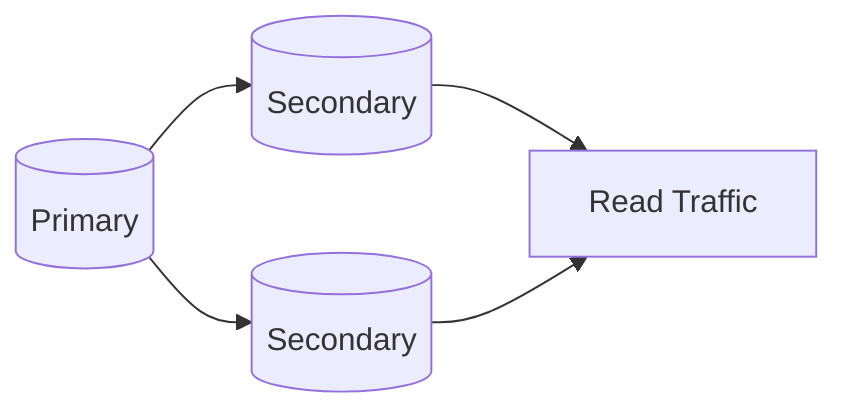
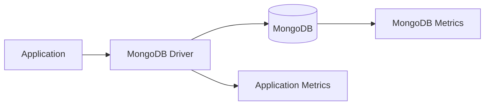
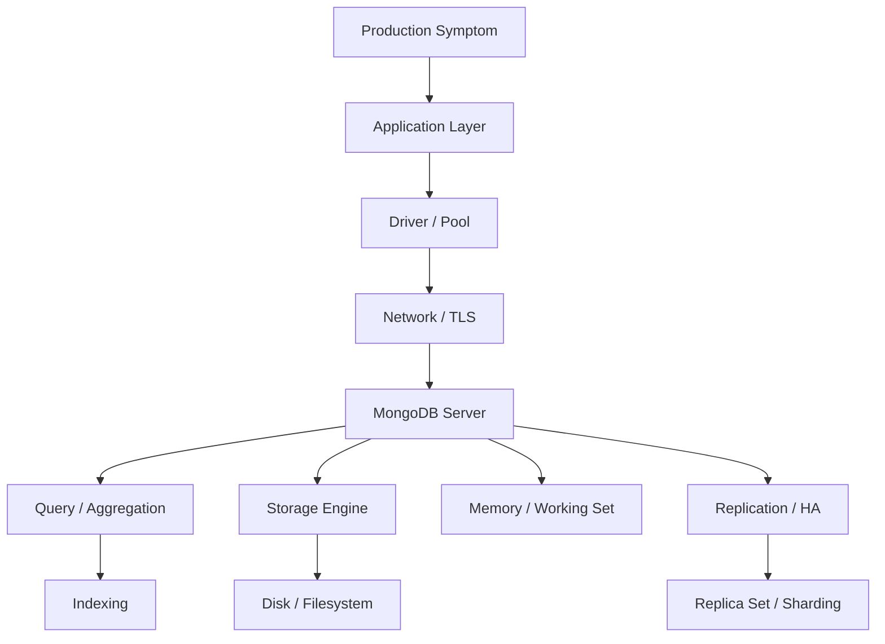

# 13- Operational Commands

## Overview

MongoDB operational commands are used to inspect database health, understand server state, diagnose replication and storage issues, monitor workloads, and perform controlled administrative actions.

Unlike CRUD commands, operational commands are primarily concerned with the state of the MongoDB deployment:

```text
Application workload
       ↓
MongoDB deployment
       ↓
Operational inspection
       ├── Server status
       ├── Database statistics
       ├── Collection statistics
       ├── Index statistics
       ├── Replica-set health
       ├── Replication lag
       ├── Current operations
       ├── Connection state
       └── Storage / capacity
```

The primary tools used in this area are:

| Tool | Purpose |
|---|---|
| `mongosh` | Interactive administration and inspection |
| `db.serverStatus()` | Server health and runtime metrics |
| `db.serverStatus().connections` | Connection monitoring |
| `db.serverStatus().opcounters` | Operation counters |
| `db.serverStatus().wiredTiger` | WiredTiger storage-engine metrics |
| `db.stats()` | Database-level statistics |
| `db.collection.stats()` | Collection-level statistics |
| `db.collection.aggregate()` | Operational data analysis |
| `db.currentOp()` | Inspect currently running operations |
| `db.adminCommand()` | Execute administrative commands |
| `rs.status()` | Replica-set health |
| `rs.printSecondaryReplicationInfo()` | Secondary replication information |
| `rs.printReplicationInfo()` | Oplog information |
| `sh.status()` | Sharded-cluster inspection |

Operational commands should generally be used for **observation first** and **mutation second**. Commands that can affect production state should be executed only after understanding their impact.

## Connecting for Operational Work

Connect with `mongosh`:

```bash
mongosh "mongodb://localhost:27017"
```

With authentication:

```bash
mongosh \
  "mongodb://mongodb.example.com:27017/admin" \
  --username ops_user
```

For TLS-enabled deployments:

```bash
mongosh \
  "mongodb://mongodb.example.com:27017/admin" \
  --tls \
  --tlsCAFile /etc/mongodb/ca.pem \
  --username ops_user
```

After connecting:

```javascript
db
```

shows the current database.

Use:

```javascript
show dbs
```

to inspect databases visible to the authenticated user.

## Operational Access Model

Production operational access should be separated from application access.

```text
Application
    ↓
Application role
    ↓
CRUD / application-specific permissions

Operations engineer
    ↓
Operational role
    ↓
Inspection / controlled administration
```

Do not use the application's MongoDB credentials for routine operational inspection.

Operational users should follow least privilege.

## Server Information

Basic server information:

```javascript
db.serverStatus()
```

This returns a large document containing runtime metrics.

For a more focused inspection:

```javascript
db.serverStatus().connections
```

or:

```javascript
db.serverStatus().opcounters
```

or:

```javascript
db.serverStatus().mem
```

The exact fields available depend on the MongoDB version and deployment.

## MongoDB Version

Check the server version:

```javascript
db.version()
```

A more detailed build description:

```javascript
db.adminCommand({ buildInfo: 1 })
```

Example output fields may include:

```text
version
gitVersion
modules
allocator
javascriptEngine
```

Version inspection is important during:

- Upgrades
- Downgrades
- Driver compatibility analysis
- Incident investigation
- Restore operations
- Feature troubleshooting

## Server Status

`serverStatus()` is one of the most important operational commands.

```javascript
db.serverStatus()
```

It exposes runtime information across areas such as:

- Connections
- Memory
- Network
- Operations
- Locks
- Storage engine
- Replication
- Transactions
- Metrics

A useful operational approach is to query only the subsystem you need.

```javascript
db.serverStatus().connections
```

```javascript
db.serverStatus().network
```

```javascript
db.serverStatus().opcounters
```

```javascript
db.serverStatus().metrics
```

This reduces unnecessary output and makes incident investigation easier.

## Server Status: Connections

Inspect connection state:

```javascript
db.serverStatus().connections
```

Important fields commonly include:

```text
current
available
totalCreated
```

Conceptually:

```text
current
    ↓
Connections currently in use

available
    ↓
Connections MongoDB can still accept

totalCreated
    ↓
Connections created since process startup
```

A high connection count is not automatically a problem.

Investigate:

- Application connection-pool configuration
- Number of application instances
- Connection churn
- Driver configuration
- Connection leaks
- Traffic patterns

## Connection Scaling

Suppose:

```text
20 Kubernetes pods
×
maxPoolSize 100
=
Potentially large connection footprint
```

The actual connection behavior depends on the topology and driver configuration, but the important engineering principle is that application scaling can multiply database connections.

Do not increase connection pool sizes blindly.

A better workflow is:

```text
Measure MongoDB connections
        ↓
Measure application instances
        ↓
Inspect driver pool configuration
        ↓
Measure request concurrency
        ↓
Tune pool size
```

## Server Status: Network

Inspect network metrics:

```javascript
db.serverStatus().network
```

This can help investigate:

- Incoming traffic
- Outgoing traffic
- Request volume
- Network saturation
- Connection churn

When diagnosing network-related latency, correlate MongoDB metrics with:

- Application latency
- Load balancer metrics
- Kubernetes networking
- AWS network metrics
- Client-side timeout metrics

MongoDB metrics alone do not explain the entire request path.

## Server Status: Operation Counters

Inspect operation counters:

```javascript
db.serverStatus().opcounters
```

Typical categories include:

```text
insert
query
update
delete
getmore
command
```

These counters provide workload-level information.

For example:

```text
query operations increasing rapidly
+
high application read traffic
```

may indicate a read-heavy workload.

Operation counters should be interpreted together with latency and resource metrics.

High operation volume does not automatically mean poor performance.

## Server Status: Memory

Inspect memory-related information:

```javascript
db.serverStatus().mem
```

MongoDB's memory behavior depends on:

- MongoDB version
- Storage engine
- Operating system
- Available RAM
- Working set
- Filesystem cache
- Concurrent workload

Avoid treating one memory field as a direct measure of application performance.

The more useful question is:

> Is the working set sufficiently resident to support the required workload with acceptable latency?

## Database Statistics

Inspect database statistics:

```javascript
db.stats()
```

This provides database-level information such as:

- Collection count
- Object count
- Data size
- Storage size
- Index count
- Index size
- Average object size

Example:

```javascript
db.stats()
```

For a specific database:

```javascript
use ecommerce
db.stats()
```

## Database Statistics with Scale

For easier-to-read sizes:

```javascript
db.stats({ scale: 1024 * 1024 })
```

This can make large byte values easier to interpret.

For example, a scale of:

```text
1024 × 1024
```

represents approximately megabytes.

Always document the unit when exporting operational metrics.

## Collection Statistics

Inspect a collection:

```javascript
db.orders.stats()
```

Collection statistics can help identify:

- Logical data size
- Storage size
- Document count
- Average document size
- Index sizes
- Index count
- Storage-engine-specific information

Example:

```javascript
db.orders.stats()
```

For a larger operational inspection:

```javascript
db.orders.stats({
  scale: 1024 * 1024
})
```

## Comparing Collections

A practical investigation might compare:

```javascript
db.orders.stats()
db.customers.stats()
db.products.stats()
```

This can reveal:

```text
orders
    ↓
Large document count
    ↓
Large storage footprint
    ↓
High index footprint
```

The result can guide capacity planning and index review.

## Collection Size vs Storage Size

These metrics should not be treated as identical.

Conceptually:

```text
Logical data
    ↓
Documents and BSON representation

Physical storage
    ↓
Storage-engine representation
    +
Indexes
    +
Allocation / compression effects
```

Therefore:

```text
dataSize != storageSize
```

This distinction matters when estimating disk capacity.

## Collection Validation

MongoDB provides collection validation commands that can be useful for diagnosing certain data or storage issues.

For example:

```javascript
db.runCommand({
  validate: "orders"
})
```

Validation can be expensive on large collections.

Do not run heavy validation commands indiscriminately during peak production traffic.

Use them as controlled diagnostic operations.

## Collection Metadata

List collections:

```javascript
show collections
```

Inspect collection metadata:

```javascript
db.getCollectionInfos()
```

This is useful for automation and operational scripts.

For example:

```javascript
db.getCollectionInfos({
  name: "orders"
})
```

## Collection Options

Inspect collection configuration:

```javascript
db.getCollectionInfos({
  name: "orders"
})
```

This can help identify configuration such as:

- Capped collection settings
- Validation configuration
- Collection type
- Other collection metadata

## Index Inspection

List indexes:

```javascript
db.orders.getIndexes()
```

Count indexes:

```javascript
db.orders.getIndexes().length
```

Index size can be inspected through:

```javascript
db.orders.stats().indexSizes
```

Example:

```javascript
db.orders.stats().indexSizes
```

This is useful when investigating:

- Excessive index storage
- Index growth
- Large collections
- Memory pressure
- Write overhead

## Index Usage Statistics

MongoDB can expose index usage information through `$indexStats`.

```javascript
db.orders.aggregate([
  { $indexStats: {} }
])
```

This can help identify indexes that have not been used during the observed measurement period.

Unused does not automatically mean unnecessary.

An index may be:

- Used only during rare operations
- Required for a critical query
- Used during scheduled jobs
- Required for uniqueness
- Needed for TTL behavior
- Important during failover or operational workflows

Never drop an index solely because it currently has zero observed usage.

## Current Operations

Inspect currently running operations:

```javascript
db.currentOp()
```

A more targeted query can be useful:

```javascript
db.currentOp({
  active: true
})
```

The exact visibility depends on authorization and MongoDB version.

Current operations can help identify:

- Long-running queries
- Blocking operations
- Large aggregations
- Index builds
- Active writes
- Operational commands

## Long-Running Operations

A common investigation pattern is:

```javascript
db.currentOp({
  active: true,
  secs_running: { $gte: 5 }
})
```

This can help identify operations that have been running for several seconds.

The threshold should depend on the application's normal latency profile.

For an API with a 50 ms database SLA, a 5-second query is severe.

For an analytics workload where queries normally run for minutes, the same threshold may be meaningless.

## Killing an Operation

Some operations can be terminated using their operation ID:

```javascript
db.killOp(<opid>)
```

This is a potentially disruptive command.

Before terminating an operation, determine:

- What query is running
- Which application initiated it
- Whether it is part of a critical workflow
- Whether it is holding resources
- Whether cancellation can leave application-level work incomplete

Never use `killOp()` as a first response to an unexplained performance problem.

## Operational Investigation Workflow

A safe investigation follows:

```text
Symptom
   ↓
Measure
   ↓
Identify affected subsystem
   ↓
Inspect current workload
   ↓
Inspect query plans / metrics
   ↓
Identify root cause
   ↓
Apply minimal corrective action
   ↓
Measure again
```

Avoid changing multiple production parameters simultaneously.

Otherwise, it becomes difficult to determine which change affected the system.

## Replica Set Status

For replica-set deployments:

```javascript
rs.status()
```

This is one of the most important HA inspection commands.

It provides information about:

- Members
- Member states
- Primary
- Secondaries
- Health
- Optime
- Replication state
- Election information

A simplified architecture:



## Replica Set Member States

Common states include:

| State | Meaning |
|---|---|
| PRIMARY | Accepts normal writes |
| SECONDARY | Replicates data from the primary |
| ARBITER | Participates in elections without storing data |
| STARTUP | Member is starting |
| STARTUP2 | Member is initializing |
| RECOVERING | Member is recovering |
| UNKNOWN | State cannot currently be determined |
| DOWN | Member is unavailable |
| ROLLBACK | Member is rolling back |
| REMOVED | Member is no longer part of the active replica set |

Use `rs.status()` rather than relying on assumptions about which host is primary.

## Identify the Primary

```javascript
db.hello()
```

This command provides topology information and can indicate whether the connected server is primary.

This is preferable to hard-coding:

```text
mongodb-primary.example.com
```

in operational scripts.

## Replica Set Configuration

Inspect configuration:

```javascript
rs.conf()
```

This can reveal:

- Replica-set members
- Priorities
- Votes
- Hidden members
- Tags
- Hostnames
- Configuration state

Replica-set configuration changes are sensitive administrative operations.

Inspect before modifying.

## Replica Set Name

Check replica-set information:

```javascript
rs.status().set
```

This is useful when troubleshooting connection strings and topology configuration.

## Replication Information

Inspect replication information:

```javascript
rs.printReplicationInfo()
```

This is particularly useful for understanding the oplog window.

Inspect secondary replication information:

```javascript
rs.printSecondaryReplicationInfo()
```

These helper methods are convenient for interactive troubleshooting.

For automation, prefer structured commands and fields where practical.

## Replication Lag

Replication lag is the delay between an operation being applied on the primary and being applied on a secondary.

Conceptually:

```text
Primary
   |
   | write
   ↓
Oplog
   |
   ↓
Secondary
   |
   ↓
Apply operation
```

High replication lag can affect:

- Read-after-write behavior
- Read preference
- Failover readiness
- Backup workflows
- Disaster recovery

Investigate:

```text
Disk I/O
CPU
Network
Large operations
Long-running queries
Storage latency
Initial sync
Write workload
```

Do not assume that replication lag is always a networking problem.

## Oplog Inspection

The oplog is the replication log used by replica-set members.

Inspect oplog information:

```javascript
rs.printReplicationInfo()
```

The critical operational concept is the **oplog window**:

```text
Oldest available oplog entry
            ↓
            ├──────── Oplog window ────────┤
                                            ↓
                                      Current time
```

If a secondary falls behind beyond the available oplog window, it may require an initial sync rather than continuing normal replication.

## Oplog Collection

On a replica-set member, the oplog is stored in the `local` database.

Inspect it:

```javascript
use local
show collections
```

The oplog collection is:

```javascript
db.oplog.rs
```

Inspect recent entries:

```javascript
db.oplog.rs.find().sort({ ts: -1 }).limit(5)
```

Avoid scanning or manipulating the oplog casually in production.

## Secondary Health

Inspect:

```javascript
rs.status()
```

Focus on:

- `health`
- `stateStr`
- `optime`
- `lastHeartbeat`
- `lastHeartbeatRecv`
- `syncSourceHost`

A healthy secondary should normally:

- Be reachable
- Remain in an expected state
- Continue replicating
- Maintain acceptable lag
- Have sufficient disk and memory resources

## Hidden Members

Hidden members can be useful for:

- Reporting
- Backup workloads
- Operational isolation

Inspect configuration:

```javascript
rs.conf()
```

Look for:

```javascript
hidden: true
```

A hidden member still consumes resources and must be monitored like any other replica-set member.

## Priority

Replica-set priority influences election behavior.

Inspect:

```javascript
rs.conf()
```

A production topology might intentionally configure different priorities.

Do not modify priority casually because it can influence which member becomes primary during an election.

## Arbiter Considerations

An arbiter participates in elections but does not store data.

Inspect replica-set configuration:

```javascript
rs.conf()
```

Arbiters can influence voting topology, but they do not provide another data-bearing copy.

For production architecture, prefer understanding the actual availability and failure-domain requirements rather than adding arbiters simply to increase the member count.

## Election Investigation

Inspect:

```javascript
rs.status()
```

Useful information includes:

- Current primary
- Member states
- Election-related timestamps
- Member health
- Topology changes

During an election, applications may experience transient write failures or increased latency.

Applications should use appropriate driver retry and timeout configuration.

## Sharded Cluster Status

For a sharded deployment:

```javascript
sh.status()
```

This provides a high-level view of:

- Shards
- Databases
- Collections
- Shard keys
- Balancing state
- Chunk distribution

Example:

```javascript
sh.status()
```

Use this as an initial diagnostic command rather than assuming that every performance issue is caused by a shard.

## Inspect Shards

Depending on deployment and permissions, inspect shard configuration:

```javascript
db.adminCommand({
  listShards: 1
})
```

This provides structured information about configured shards.

## Config Server Inspection

The config server replica set stores metadata required by the sharded cluster.

Operational troubleshooting should therefore distinguish:

```text
Application query problem
        ↓
mongos
        ↓
Shard routing
        ↓
Shard execution
```

from:

```text
Cluster metadata problem
        ↓
Config servers
```

A healthy shard does not guarantee a healthy sharded cluster.

## Database Command Interface

Administrative commands can be executed using:

```javascript
db.adminCommand({
  serverStatus: 1
})
```

Many administrative operations use this interface.

Examples include:

```javascript
db.adminCommand({
  connectionStatus: 1
})
```

and:

```javascript
db.adminCommand({
  buildInfo: 1
})
```

Prefer structured administrative commands when building automation.

## Connection Status

Inspect authenticated connection information:

```javascript
db.runCommand({
  connectionStatus: 1
})
```

This can help diagnose:

- Authentication
- Authenticated users
- Roles
- Authorization context

Do not expose command output containing sensitive operational information in application logs.

## Database Size Inspection

A practical inspection sequence:

```javascript
db.stats()
```

then:

```javascript
db.getCollectionNames()
```

then:

```javascript
db.orders.stats()
db.customers.stats()
db.products.stats()
```

This allows investigation from:

```text
Database
    ↓
Collection
    ↓
Storage
    ↓
Indexes
    ↓
Workload
```

## Storage Capacity

MongoDB storage problems should be investigated at both MongoDB and operating-system levels.

MongoDB:

```javascript
db.serverStatus().wiredTiger
```

Database:

```javascript
db.stats()
```

Collection:

```javascript
db.orders.stats()
```

Operating system:

```bash
df -h
```

and:

```bash
du -sh /var/lib/mongodb
```

The actual MongoDB data directory depends on deployment configuration.

## Disk Space Investigation

A practical flow:

```text
Disk usage increasing
        ↓
Check filesystem capacity
        ↓
Check MongoDB storage growth
        ↓
Identify largest databases
        ↓
Identify largest collections
        ↓
Inspect index growth
        ↓
Check logs / backup files
        ↓
Determine growth source
```

Do not delete MongoDB data files manually to free disk space.

## Storage Engine Information

MongoDB deployments commonly use WiredTiger.

Inspect storage-engine metrics:

```javascript
db.serverStatus().wiredTiger
```

This can expose detailed internal metrics.

The output is extensive, so use targeted fields when investigating a specific problem.

## Cache and Working Set

MongoDB performance is heavily influenced by whether frequently accessed data can remain efficiently cached.

Conceptually:

```text
Frequently accessed data
        ↓
Working set
        ↓
Memory / filesystem cache
        ↓
Lower storage I/O
```

If the working set is significantly larger than available effective memory, storage I/O can become an important latency factor.

Operational investigation should correlate:

- Query latency
- Cache behavior
- Disk I/O
- Memory
- Working-set characteristics

## Collection Growth

Track:

```javascript
db.orders.stats()
```

over time.

Important signals include:

- Document count
- Logical size
- Storage size
- Average document size
- Index size

Capacity planning should use trends rather than a single snapshot.

## Large Documents

MongoDB documents have a maximum BSON document size.

A production system should avoid designing documents that approach that limit unnecessarily.

Inspect average document size:

```javascript
db.orders.stats().avgObjSize
```

Large documents can increase:

- Network transfer
- Memory usage
- Query cost
- Update cost
- Replication volume

Large arrays are a common source of uncontrolled document growth.

## Collection Counts

Count documents:

```javascript
db.orders.countDocuments()
```

For operational inspection, this is generally preferable to relying on deprecated or approximate count patterns when an accurate count is required.

For large collections, understand the performance implications of counting.

Do not use exact counts repeatedly in high-frequency application paths merely for metrics.

## Fast Operational Counts

Where exactness is not required, metadata or estimated counting mechanisms may be more appropriate.

The choice depends on:

```text
Accuracy requirement
+
Collection size
+
Latency requirement
```

For dashboards, approximate counts can sometimes be preferable to expensive exact counts.

## Query Performance During Operations

Operational inspection should connect system state with actual queries.

For a suspected slow query:

```javascript
db.orders.find({
  customer_id: "customer-123",
  status: "pending"
}).explain("executionStats")
```

Review:

```text
nReturned
totalKeysExamined
totalDocsExamined
executionTimeMillis
winningPlan
```

Operational commands are most useful when combined with query analysis.

## Server Metrics and Application Metrics

MongoDB metrics should be correlated with application telemetry.



For example:

```text
API latency increased
        ↓
MongoDB query latency increased?
        ↓
MongoDB CPU increased?
        ↓
Disk latency increased?
        ↓
Connections increased?
        ↓
Replication lag increased?
```

This prevents treating every API latency problem as a database problem.

## Logging

MongoDB logs are useful for investigating:

- Startup failures
- Authentication issues
- Network failures
- Elections
- Replication problems
- Storage problems
- Slow operations
- Configuration problems

Do not rely exclusively on MongoDB logs.

Correlate:

```text
Application logs
+
MongoDB logs
+
Metrics
+
Distributed traces
```

## Slow Query Investigation

A practical senior-level workflow:

```text
Symptom
↓
API / service latency increased
↓
Identify affected MongoDB operation
↓
Run explain("executionStats")
↓
Inspect indexes
↓
Inspect totalDocsExamined
↓
Inspect totalKeysExamined
↓
Check server resources
↓
Check concurrent operations
↓
Check recent deployments
↓
Optimize query or index
↓
Measure again
```

Avoid adding indexes without understanding the query shape.

## Monitoring Current Operations

Use:

```javascript
db.currentOp({
  active: true
})
```

For a more focused investigation:

```javascript
db.currentOp({
  active: true,
  secs_running: { $gte: 10 }
})
```

Potential causes of long-running operations include:

- Missing indexes
- Large aggregation
- Large collection scan
- Blocking resource contention
- Storage latency
- High server load
- Unexpected query shape

## Operational Statistics Snapshot

A practical diagnostic snapshot can include:

```javascript
db.serverStatus().connections
db.serverStatus().opcounters
db.serverStatus().network
db.serverStatus().mem
db.stats()
```

For a replica set:

```javascript
rs.status()
rs.printReplicationInfo()
rs.printSecondaryReplicationInfo()
```

For the workload:

```javascript
db.currentOp({
  active: true
})
```

This gives a broad view of:

```text
Connections
+
Workload
+
Memory
+
Network
+
Database size
+
Replication
+
Active operations
```

## Automated Operational Inspection

Do not parse human-formatted shell output in production automation when structured commands are available.

Prefer:

```javascript
db.serverStatus()
```

or:

```javascript
db.adminCommand({
  listShards: 1
})
```

and process the resulting BSON/JSON programmatically.

A Python operational service can consume structured results through PyMongo.

## Python Operational Inspection

Example:

```python
from pymongo import MongoClient

client = MongoClient(
    "mongodb://localhost:27017",
    serverSelectionTimeoutMS=3000,
)

db = client["ecommerce"]

server_status = db.command("serverStatus")
database_stats = db.command("dbStats")

print("Connections:", server_status["connections"])
print("Objects:", database_stats.get("objects"))
print("Collections:", database_stats.get("collections"))
```

Use this pattern for internal diagnostics rather than building operational tooling around shell scraping.

## Health Checks

A backend health check should generally be lightweight.

Example:

```python
from pymongo import MongoClient

client = MongoClient(
    "mongodb://localhost:27017",
    serverSelectionTimeoutMS=1000,
)

def check_mongodb() -> bool:
    try:
        client.admin.command("ping")
        return True
    except Exception:
        return False
```

Do not run expensive operations such as:

```javascript
db.stats()
db.currentOp()
large aggregation
full collection validation
```

as a high-frequency application health check.

## Liveness vs Readiness

For Kubernetes deployments:

```text
Liveness
    ↓
Is the process alive?

Readiness
    ↓
Can this instance safely serve traffic?
```

A MongoDB dependency can be relevant to readiness without necessarily being appropriate for process liveness.

If every transient MongoDB outage causes the application container to fail its liveness probe, Kubernetes may unnecessarily restart healthy application processes.

## Operational Commands in Kubernetes

When MongoDB runs in Kubernetes, inspect the environment first:

```bash
kubectl get pods
```

Then inspect logs:

```bash
kubectl logs <mongodb-pod>
```

Inspect resource usage:

```bash
kubectl top pod <mongodb-pod>
```

MongoDB-specific operational commands should still be executed through `mongosh`.

Do not assume Kubernetes-level health means MongoDB-level health.

## Operational Commands in Docker

Inspect the container:

```bash
docker ps
```

View logs:

```bash
docker logs mongodb
```

Connect to MongoDB:

```bash
docker exec -it mongodb mongosh
```

Then:

```javascript
db.serverStatus()
```

Container health and MongoDB health are different layers.

## Production Inspection Sequence

When an application reports MongoDB errors:

```text
Application error
      ↓
Check connectivity
      ↓
db.hello()
      ↓
db.serverStatus().connections
      ↓
db.serverStatus().opcounters
      ↓
rs.status() if replica set
      ↓
db.currentOp()
      ↓
Explain affected query
      ↓
Inspect storage / OS metrics
```

This avoids immediately changing configuration without evidence.

## Operational Security

Operational commands can expose sensitive information.

Examples include:

- Hostnames
- Connection information
- User identities
- Database metadata
- Query text
- Operational state
- Cluster topology

Do not send raw `serverStatus()` or `currentOp()` output into public logs or tickets without reviewing it.

## Operational Access Auditing

Production operational access should be auditable.

Track:

- Who accessed the database
- When
- From where
- Which administrative operation was performed
- Why the operation was required
- Whether the operation changed state

For sensitive production systems, integrate MongoDB auditing and infrastructure-level audit trails where appropriate.

## Commands That Can Change Production State

Not all operational commands are read-only.

Examples of potentially disruptive actions include:

```javascript
db.killOp(<opid>)
```

and replica-set configuration changes.

Treat these differently from:

```javascript
db.serverStatus()
rs.status()
db.stats()
```

A useful operational classification is:

| Category | Examples | Risk |
|---|---|---|
| Read-only inspection | `serverStatus()`, `db.stats()` | Low |
| Diagnostic | `currentOp()`, `explain()` | Low to moderate |
| Potentially disruptive | `killOp()` | High |
| Topology/configuration | Replica-set configuration | High |
| Data-changing | CRUD commands | High |
| Recovery/destructive | Restore with destructive options | Very high |

## Production Safety Rules

Before executing a potentially disruptive command:

1. Verify the target cluster.
2. Verify the authenticated identity.
3. Understand the command's effect.
4. Check current workload.
5. Confirm the operational reason.
6. Ensure rollback or recovery exists where applicable.
7. Execute the minimum required change.
8. Monitor the system afterward.

A common production failure is executing a correct command against the wrong environment.

## Capacity Planning

Operational commands provide raw signals for capacity planning.

Track over time:

```text
Document count
Storage size
Index size
Connections
Operation rate
Query latency
CPU
Memory
Disk utilization
Replication lag
```

A useful capacity model is:

```text
Current usage
      +
Growth rate
      +
Expected traffic growth
      +
Replication overhead
      +
Index growth
      +
Operational headroom
```

Avoid scaling only when the database reaches 100% utilization.

## Storage Growth Analysis

A useful recurring inspection process is:

```javascript
db.stats()
```

followed by:

```javascript
db.getCollectionNames()
```

and then:

```javascript
db.orders.stats()
db.events.stats()
db.audit_logs.stats()
```

Compare these values over time.

If:

```text
audit_logs
    ↓
rapid growth
```

then the engineering response may involve:

- Retention
- TTL indexes where appropriate
- Archival
- Separate storage
- Data lifecycle policies

Do not immediately scale infrastructure if the root cause is uncontrolled data retention.

## TTL Collections and Operational Cleanup

For time-bound data, TTL indexes can automatically expire documents.

Example:

```javascript
db.sessions.createIndex(
  { expires_at: 1 },
  { expireAfterSeconds: 0 }
)
```

This means documents expire based on the `expires_at` field.

TTL expiration is asynchronous rather than an exact-time deletion mechanism.

Do not use TTL as a substitute for a precise transactional deletion workflow.

## Operational Cost Control

Operational efficiency includes:

- Removing unnecessary indexes
- Managing data retention
- Monitoring storage growth
- Avoiding excessive connection pools
- Controlling expensive aggregations
- Right-sizing infrastructure
- Using appropriate backup retention
- Avoiding unnecessary cross-region traffic

For example:

```text
Unused index
    ↓
Extra disk
    ↓
Extra write maintenance
    ↓
Potential memory pressure
```

Index lifecycle should therefore be part of operational management.

## Common Operational Mistakes

### Running Expensive Diagnostics During Peak Traffic

Commands such as large collection validation or broad diagnostic queries can consume production resources.

Use them deliberately.

### Treating `serverStatus()` as a Health Check

`serverStatus()` returns a large diagnostic document and is not a replacement for a lightweight health endpoint.

Use:

```javascript
db.runCommand({ ping: 1 })
```

for basic connectivity checks.

### Assuming a Secondary Is Always Safe for Heavy Workloads

Secondaries still consume CPU, memory, disk, and network resources.

A heavy backup or analytics workload can increase replication lag.

### Killing Queries Without Understanding Them

`killOp()` may terminate an operation that is important to the application.

Investigate first.

### Ignoring Replication Lag

A secondary that is several minutes behind may create serious HA and consistency problems.

Monitor replication lag continuously.

### Dropping an Apparently Unused Index

Zero observed usage does not prove that an index is unnecessary.

Check:

- Application query patterns
- Scheduled jobs
- Administrative workflows
- Uniqueness requirements
- TTL behavior
- Observation period

### Parsing Human Shell Output

Operational automation should use structured command output instead of parsing terminal formatting.

### Logging Sensitive Diagnostic Output

Raw operational output may contain sensitive topology or query information.

Sanitize before exporting.

## Production Pitfalls

| Pitfall | Why it happens | Better approach |
|---|---|---|
| Blind configuration changes | Incident pressure | Measure first |
| No replication monitoring | Focus only on primary | Monitor all members |
| Huge health checks | Diagnostic command reused as probe | Use lightweight `ping` |
| Excessive connection pools | Scaling pods without DB planning | Model total connections |
| Uncontrolled diagnostics | Commands consume resources | Use targeted inspection |
| No capacity trends | Only current values monitored | Store time-series metrics |
| Manual operational commands | Tribal knowledge | Document runbooks |
| Wrong environment | Similar hostnames / prompts | Verify target explicitly |
| No audit trail | Emergency access | Record administrative actions |

## Troubleshooting: Connection Problems

```text
Symptom
↓
Application cannot connect to MongoDB
↓
Possible causes
    - DNS failure
    - Network policy
    - Firewall
    - Authentication
    - TLS
    - Replica-set topology
    - Connection pool exhaustion
    - MongoDB unavailable
↓
Isolation strategy
↓
Test DNS / network
↓
Run mongosh from application network
↓
Run db.hello()
↓
Inspect serverStatus().connections
↓
Check authentication
↓
Check TLS configuration
↓
Root cause
↓
Corrective action
↓
Prevention
    - Connection monitoring
    - Proper timeouts
    - Network testing
    - Secret validation
```

## Troubleshooting: High Latency

```text
Symptom
↓
MongoDB requests are slow
↓
Possible causes
    - Missing index
    - Poor query shape
    - Large documents
    - Large aggregation
    - Storage latency
    - Memory pressure
    - Connection contention
    - CPU saturation
    - Replication pressure
↓
Isolation strategy
↓
Measure application DB latency
↓
Run explain("executionStats")
↓
Inspect currentOp()
↓
Inspect serverStatus()
↓
Inspect storage metrics
↓
Compare recent deployments
↓
Root cause
↓
Corrective action
↓
Prevention
    - Query monitoring
    - Index review
    - Performance regression tests
```

## Troubleshooting: Replication Lag

```text
Symptom
↓
Secondary is behind primary
↓
Possible causes
    - High write rate
    - Slow disk
    - CPU saturation
    - Network latency
    - Large operations
    - Secondary workload
    - Initial sync
↓
Isolation strategy
↓
Run rs.status()
↓
Run rs.printSecondaryReplicationInfo()
↓
Inspect serverStatus()
↓
Inspect disk / CPU / network
↓
Inspect secondary workload
↓
Root cause
↓
Corrective action
↓
Prevention
    - Resource headroom
    - Workload isolation
    - Replication monitoring
```

## Troubleshooting: Disk Usage Growth

```text
Symptom
↓
MongoDB disk usage is increasing rapidly
↓
Possible causes
    - Data growth
    - Index growth
    - Oplog growth
    - Logs
    - Backup files
    - Temporary files
    - Retention failure
↓
Isolation strategy
↓
df -h
↓
db.stats()
↓
Collection stats
↓
Index stats
↓
Inspect MongoDB / backup directories
↓
Root cause
↓
Corrective action
↓
Prevention
    - Capacity alerts
    - Retention policies
    - Backup lifecycle management
```

## Troubleshooting: Primary Election

```text
Symptom
↓
Application experiences transient database failures
↓
Possible causes
    - Primary failure
    - Network partition
    - Resource exhaustion
    - Host restart
    - Replica-set reconfiguration
↓
Isolation strategy
↓
Run rs.status()
↓
Inspect member health
↓
Inspect MongoDB logs
↓
Check infrastructure events
↓
Check application retry behavior
↓
Root cause
↓
Corrective action
↓
Prevention
    - Multiple failure domains
    - Appropriate write concern
    - Driver retry configuration
    - Election monitoring
```

## Operational Runbook Template

A MongoDB operational runbook should follow:

```text
Incident
↓
Impact
↓
Affected cluster
↓
Current primary
↓
Current replica health
↓
Connection state
↓
Current operations
↓
Resource state
↓
Recent changes
↓
Diagnosis
↓
Corrective action
↓
Validation
↓
Rollback / recovery
↓
Post-incident monitoring
```

The runbook should contain executable commands and expected observations.

## Quick Command Reference

| Task | Command |
|---|---|
| Server status | `db.serverStatus()` |
| MongoDB version | `db.version()` |
| Build information | `db.adminCommand({ buildInfo: 1 })` |
| Ping server | `db.runCommand({ ping: 1 })` |
| Connection status | `db.runCommand({ connectionStatus: 1 })` |
| Database statistics | `db.stats()` |
| Collection statistics | `db.collection.stats()` |
| List collections | `show collections` |
| Collection metadata | `db.getCollectionInfos()` |
| Collection indexes | `db.collection.getIndexes()` |
| Index usage | `db.collection.aggregate([{ $indexStats: {} }])` |
| Current operations | `db.currentOp()` |
| Active operations | `db.currentOp({ active: true })` |
| Replica status | `rs.status()` |
| Replica configuration | `rs.conf()` |
| Primary discovery | `db.hello()` |
| Oplog information | `rs.printReplicationInfo()` |
| Secondary lag information | `rs.printSecondaryReplicationInfo()` |
| Sharded cluster status | `sh.status()` |
| Shard list | `db.adminCommand({ listShards: 1 })` |
| Query analysis | `db.collection.find(...).explain("executionStats")` |
| Kill operation | `db.killOp(<opid>)` |

## Senior-Level Operational Workflow

A senior engineer should avoid approaching MongoDB incidents as a collection of isolated commands.

Use a layered model:



Investigate from the symptom toward the narrowest affected layer.

This prevents common mistakes such as:

```text
API latency
    ↓
Immediately add MongoDB indexes
```

when the actual problem may be:

```text
API latency
    ↓
Connection pool exhaustion
```

or:

```text
API latency
    ↓
Network / TLS latency
```

or:

```text
API latency
    ↓
Storage saturation
```

## Production Best Practices

- Use `mongosh` for interactive operational inspection.
- Prefer structured administrative commands for automation.
- Use `ping` for lightweight connectivity checks.
- Monitor connections, operation rates, latency, storage, memory, and replication health.
- Treat `serverStatus()` as a diagnostic source, not a complete application health check.
- Monitor replica-set health and replication lag continuously.
- Measure database growth over time rather than relying on snapshots.
- Correlate MongoDB metrics with application metrics and distributed traces.
- Investigate slow queries using `explain("executionStats")`.
- Do not terminate operations with `killOp()` without understanding their impact.
- Do not modify replica-set configuration during an incident without a clear recovery plan.
- Separate application credentials from operational credentials.
- Restrict operational access using least privilege.
- Protect diagnostic output because it may contain sensitive information.
- Automate recurring operational checks and alerting.
- Maintain executable incident runbooks.
- Test operational procedures before they are required during an outage.

## Interview Considerations

### What is `serverStatus()` used for?

`serverStatus()` provides runtime diagnostic and operational metrics for the MongoDB server, including connections, operations, memory, network, storage-engine metrics, and other subsystems.

### How do you check replica-set health?

Use:

```javascript
rs.status()
```

Then inspect member health, states, optimes, and replication behavior.

### How do you investigate replication lag?

Start with:

```javascript
rs.status()
rs.printSecondaryReplicationInfo()
```

Then correlate lag with CPU, disk, network, write workload, and secondary workload.

### How do you investigate a slow query?

Use:

```javascript
db.collection.find({...}).explain("executionStats")
```

Then inspect:

```text
nReturned
totalKeysExamined
totalDocsExamined
executionTimeMillis
winningPlan
```

The investigation should also consider current server resources and workload.

### Why shouldn't `serverStatus()` be used as a Kubernetes liveness probe?

It is a broad diagnostic operation rather than a lightweight process health check.

A simple:

```javascript
db.runCommand({ ping: 1 })
```

is more appropriate for basic connectivity checks.

### What is the difference between `db.stats()` and `db.collection.stats()`?

`db.stats()` provides database-level statistics, while `db.collection.stats()` provides statistics for a specific collection.

### Why is replication lag important?

Replication lag can affect read consistency, failover readiness, backup workflows, and disaster-recovery capabilities.

### Why shouldn't every unused index be dropped?

Observed index usage is dependent on the workload and observation period. An index may support rare but critical queries, uniqueness constraints, TTL behavior, scheduled jobs, or operational workflows.

### What is the safest way to diagnose a production MongoDB problem?

Measure first, isolate the affected layer, inspect targeted metrics and query plans, make the smallest justified change, and verify the result. Avoid speculative configuration changes during an incident.

## Key Takeaways

- **MongoDB operational commands should be used to measure server state, workload, storage, connections, replication, and topology before making production changes.**
- **`serverStatus()`, `db.stats()`, collection statistics, `currentOp()`, `rs.status()`, and query `explain()` provide complementary views of MongoDB health and performance.**
- **Replica-set health and replication lag must be monitored independently from application availability because a reachable primary does not guarantee a healthy HA topology.**
- **Production diagnosis should correlate MongoDB metrics with driver, network, application, infrastructure, and query-level telemetry rather than treating MongoDB as an isolated component.**
- **Operational commands that can change state or terminate work require explicit target verification, least-privilege access, controlled execution, and post-change validation.**