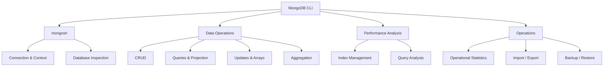
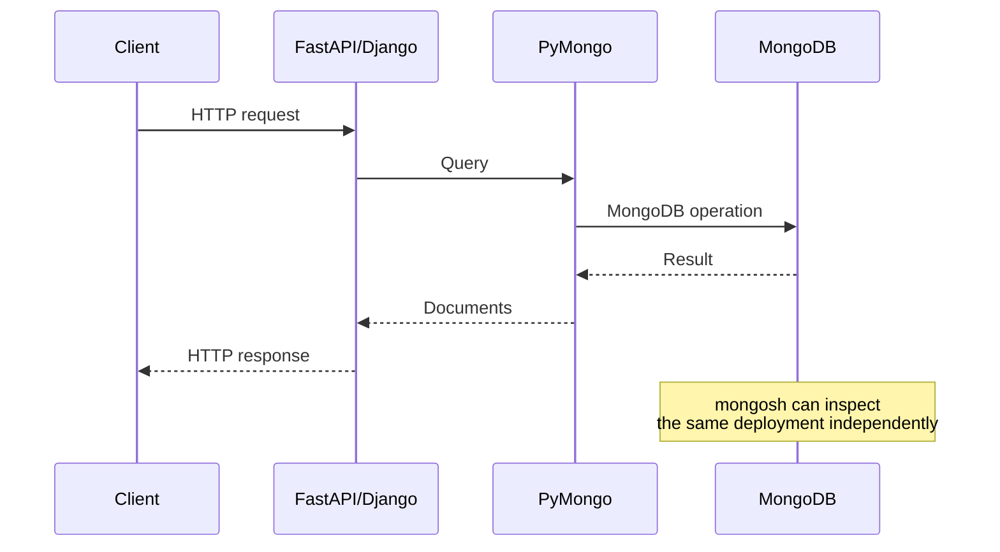

# README

## Overview

This directory contains the MongoDB command-line reference for backend engineers working with MongoDB from development through production operations.

The material is centered around `mongosh` and MongoDB-specific CLI tooling. It covers database inspection, CRUD, querying, aggregation, indexes, performance analysis, import/export, backup and restore, and operational diagnostics.

The CLI should be treated as an engineering tool rather than a list of commands to memorize. The important skill is understanding which command answers a specific operational question and how its output should influence an engineering decision.

## Scope

The CLI documentation covers four broad areas:



## Directory Structure

```text
03- CLI/
    01- MongoDB Shell Basics.md
    02- Database and Collection Commands.md
    03- CRUD Commands.md
    04- Query and Projection Commands.md
    05- Update and Array Commands.md
    06- Aggregation Commands.md
    07- Index Management Commands.md
    08- Query Analysis Commands.md
    09- User and Role Management Commands.md
    10- Database Inspection Commands.md
    11- Import and Export Commands.md
    12- Backup and Restore Commands.md
    13- Operational Commands.md
    README.md
```

## Navigation

| # | File | Description |
|---|---|---|
| 01 | [01- MongoDB Shell Basics](./01-%20MongoDB%20Shell%20Basics.md) | mongosh connections, shell fundamentals, contexts, and shell usage |
| 02 | [02- Database and Collection Commands](./02-%20Database%20and%20Collection%20Commands.md) | Databases, collections, metadata, and collection operations |
| 03 | [03- CRUD Commands](./03-%20CRUD%20Commands.md) | Insert, read, update, delete, and bulk operations |
| 04 | [04- Query and Projection Commands](./04-%20Query%20and%20Projection%20Commands.md) | Query operators, projection, sorting, and pagination |
| 05 | [05- Update and Array Commands](./05-%20Update%20and%20Array%20Commands.md) | Update operators and array manipulation |
| 06 | [06- Aggregation Commands](./06-%20Aggregation%20Commands.md) | Aggregation pipelines and expressions |
| 07 | [07- Index Management Commands](./07-%20Index%20Management%20Commands.md) | Index creation, inspection, and lifecycle |
| 08 | [08- Query Analysis Commands](./08-%20Query%20Analysis%20Commands.md) | explain(), query plans, and performance diagnosis |
| 09 | [09- User and Authentication Commands](./09-%20User%20and%20Authentication%20Commands.md) | Authentication, users, roles, and authorization |
| 10 | [10- Database Inspection Commands](./10-%20Database%20Inspection%20Commands.md) | Database and collection inspection |
| 11 | [11- Import and Export Commands](./11-%20Import%20and%20Export%20Commands.md) | mongoimport, mongoexport, and data movement |
| 12 | [12- Backup and Restore Commands](./12-%20Backup%20and%20Restore%20Commands.md) | mongodump, mongorestore, and recovery workflows |
| 13 | [13- Operational Commands](./13-%20Operational%20Commands.md) | Server status, replication, current operations, and health |


## Command Categories

### Shell and Connection

Primary commands and operations:

```javascript
db
show dbs
show collections
db.hello()
db.version()
db.adminCommand({ buildInfo: 1 })
```

These commands establish:

- Current database context
- Server identity
- MongoDB version
- Deployment topology
- Basic connectivity

### Database and Collection Management

Typical operations include:

```javascript
db.stats()
db.getCollectionNames()
db.getCollectionInfos()
db.createCollection("orders")
db.orders.stats()
```

Use these commands to understand database structure and storage characteristics.

### CRUD

Core operations include:

```javascript
db.orders.insertOne(...)
db.orders.insertMany(...)
db.orders.find(...)
db.orders.findOne(...)
db.orders.updateOne(...)
db.orders.updateMany(...)
db.orders.replaceOne(...)
db.orders.deleteOne(...)
db.orders.deleteMany(...)
```

CRUD commands should be understood together with:

- Atomicity
- Write concern
- Query filters
- Indexes
- Transactions
- Retry behavior
- Idempotency

### Querying

Common query operations include:

```javascript
db.orders.find({
  status: "pending",
  total: { $gte: 100 }
})
```

Important query topics include:

- Comparison operators
- Logical operators
- Array operators
- Embedded documents
- Regex
- Projection
- Sorting
- Pagination
- Cursors
- Index interaction

### Updates

Common update operators include:

```javascript
$set
$unset
$inc
$min
$max
$push
$addToSet
$pull
$pop
$rename
$currentDate
```

Update design should account for:

- Atomicity
- Document growth
- Hot documents
- Concurrent updates
- Optimistic concurrency
- Idempotency

### Aggregation

Aggregation pipelines provide server-side data processing:

```javascript
db.orders.aggregate([
  { $match: { status: "completed" } },
  {
    $group: {
      _id: "$customer_id",
      total: { $sum: "$amount" }
    }
  },
  { $sort: { total: -1 } }
])
```

Important concepts include:

- Pipeline ordering
- Early `$match`
- `$project`
- `$group`
- `$lookup`
- `$unwind`
- `$facet`
- `$merge`
- `$out`
- Aggregation expressions
- Memory consumption
- Index usage

### Indexes

Index management includes:

```javascript
db.orders.createIndex({ customer_id: 1 })
db.orders.getIndexes()
db.orders.dropIndex("customer_id_1")
```

The goal is not to maximize the number of indexes.

The goal is to support real query patterns while controlling:

- Query latency
- Write overhead
- Storage usage
- Memory pressure
- Index maintenance cost

### Query Analysis

Use:

```javascript
db.orders.find({
  customer_id: "customer-123"
}).explain("executionStats")
```

Important metrics include:

```text
nReturned
totalKeysExamined
totalDocsExamined
executionTimeMillis
winningPlan
```

The query-analysis documentation focuses on turning these metrics into concrete index and query-design decisions.

### User and Role Management

Authentication and authorization commands cover:

- Users
- Roles
- Password management
- Built-in roles
- Custom roles
- Database-level permissions
- Authentication context

Operational access should follow least privilege.

### Database Inspection

Inspection commands answer questions such as:

```text
How large is the database?
Which collections are largest?
How large are the indexes?
What is the current server state?
Which operations are running?
```

Typical commands include:

```javascript
db.stats()
db.collection.stats()
db.serverStatus()
db.currentOp()
```

### Import and Export

MongoDB CLI data-transfer tools include:

```bash
mongoimport
mongoexport
```

Typical use cases:

- Development data loading
- Controlled data migration
- JSON/CSV exchange
- Staging workflows
- Data analysis

These tools are not substitutes for production backup and recovery systems.

### Backup and Restore

Logical backup tooling includes:

```bash
mongodump
mongorestore
```

Backup workflows should be designed around:

- RPO
- RTO
- Backup retention
- Restore validation
- Disaster recovery
- Point-in-time recovery requirements

A successful backup command does not prove that the organization can recover from an outage.

### Operational Commands

Operational inspection includes:

```javascript
db.serverStatus()
db.currentOp()
rs.status()
rs.conf()
rs.printReplicationInfo()
rs.printSecondaryReplicationInfo()
sh.status()
```

These commands are primarily used for:

- Health investigation
- Replication troubleshooting
- Capacity analysis
- Connection monitoring
- Storage investigation
- Query investigation
- Production incidents

## MongoDB CLI Tooling

MongoDB CLI work is not limited to `mongosh`.

| Tool | Primary Purpose |
|---|---|
| `mongosh` | Interactive MongoDB shell |
| `mongoimport` | Import JSON/CSV/TSV data |
| `mongoexport` | Export collection data |
| `mongodump` | Logical backup |
| `mongorestore` | Logical restore |
| `mongostat` | Live server operation statistics |
| `mongotop` | Collection-level read/write activity |
| `mongofiles` | GridFS file operations where applicable |

Tool availability and behavior can depend on the installed MongoDB Database Tools version.

## Development vs Production Usage

The same command can have very different consequences depending on the environment.

| Operation | Development | Production |
|---|---|---|
| `db.stats()` | Routine | Safe diagnostic |
| `db.currentOp()` | Routine | Controlled diagnostic |
| `explain()` | Routine | Controlled on expensive workloads |
| `createIndex()` | Routine | Planned change |
| `dropIndex()` | Easy to test | Requires workload analysis |
| `deleteMany()` | Common | High-risk |
| `killOp()` | Useful for testing | Incident-level operation |
| `mongodump` | Common | Planned backup workflow |
| `mongorestore` | Common | Recovery operation |
| `rs.reconfig()` | Lab operation | High-risk topology change |

Production commands should always begin with target verification.

## Production Command Safety

Before running a potentially destructive command:

```text
Verify environment
      ↓
Verify cluster
      ↓
Verify current user
      ↓
Understand command
      ↓
Check active workload
      ↓
Execute minimal change
      ↓
Monitor result
      ↓
Validate system state
```

A correct MongoDB command executed against the wrong production cluster is still an incident.

## CLI and Backend Applications

MongoDB CLI knowledge is particularly useful when debugging backend services.

A typical request path is:



When an API becomes slow, CLI inspection helps separate:

```text
Application problem
        ↓
Driver / connection-pool problem
        ↓
Network problem
        ↓
MongoDB query problem
        ↓
Index problem
        ↓
Storage / resource problem
```

## Operational Troubleshooting

MongoDB troubleshooting should follow evidence rather than guesswork.

```text
Symptom
↓
Identify affected request or workload
↓
Check connectivity and topology
↓
Inspect active operations
↓
Inspect query plan
↓
Inspect indexes
↓
Inspect server resources
↓
Inspect replication / storage
↓
Identify root cause
↓
Apply targeted correction
↓
Measure again
```

Useful commands include:

```javascript
db.runCommand({ ping: 1 })
db.hello()
db.serverStatus()
db.currentOp({ active: true })
rs.status()
db.collection.find({...}).explain("executionStats")
```

## Monitoring Integration

CLI commands are useful for investigation, but production monitoring should normally use structured metrics and observability systems.

```text
MongoDB
   │
   ├── Metrics ──────→ Monitoring
   ├── Logs ─────────→ Log Platform
   ├── Traces ───────→ APM
   └── Events ───────→ Alerting
```

CLI commands are most useful for:

- Incident investigation
- Manual verification
- Runbooks
- Development
- One-off diagnostics
- Controlled administration

They should not become the only production monitoring mechanism.

## Security Considerations

MongoDB CLI access should follow the same security principles as application access.

- Use dedicated operational identities.
- Apply least privilege.
- Avoid shared administrator credentials.
- Prefer TLS for production connections.
- Do not place passwords directly in shell history or scripts.
- Protect connection strings.
- Avoid logging sensitive command output.
- Restrict network access.
- Audit privileged operations where required.
- Verify the target environment before destructive operations.

For automation, credentials should come from a secret-management system rather than being committed to Git.

## Automation and CI/CD

MongoDB CLI commands can be integrated into controlled automation, but destructive commands require additional safeguards.

Example:

```bash
mongosh "$MONGODB_URI" \
  --quiet \
  --file operational-check.js
```

A CI/CD workflow should separate:

```text
Validation
    ↓
Dry-run / inspection
    ↓
Approval
    ↓
Production operation
    ↓
Verification
```

Do not embed unrestricted administrative credentials into CI/CD pipelines.

## CLI Usage with Docker

For a MongoDB container:

```bash
docker exec -it mongodb mongosh
```

For a remote connection:

```bash
mongosh "$MONGODB_URI"
```

Container tooling is only the transport layer. MongoDB-specific diagnostics should still be performed using MongoDB's own tools.

## CLI Usage with Kubernetes

Typical workflow:

```bash
kubectl get pods
```

Then:

```bash
kubectl exec -it mongodb-0 -- mongosh
```

The exact pod and container names depend on the deployment.

For production environments, prefer controlled administrative access rather than granting broad shell access to every Kubernetes user.

## Interview Focus

For senior backend interviews, command memorization is less important than understanding the engineering purpose behind the commands.

Be able to explain:

- How `mongosh` differs from MongoDB Database Tools
- How to inspect replica-set health
- How to diagnose a slow query
- How `explain("executionStats")` helps performance analysis
- How to inspect index usage
- How to investigate replication lag
- How to inspect database and collection size
- How `mongodump` differs from `mongoexport`
- How to distinguish operational inspection from backup
- How to safely terminate a long-running operation
- How CLI diagnostics fit into application observability

## Navigation

| # | File | Description |
|---|---|---|
| 01 | [01- MongoDB Shell Basics](./01-%20MongoDB%20Shell%20Basics.md) | mongosh connections, shell fundamentals, contexts, and shell usage |
| 02 | [02- Database and Collection Commands](./02-%20Database%20and%20Collection%20Commands.md) | Databases, collections, metadata, and collection operations |
| 03 | [03- CRUD Commands](./03-%20CRUD%20Commands.md) | Insert, read, update, delete, and bulk operations |
| 04 | [04- Query and Projection Commands](./04-%20Query%20and%20Projection%20Commands.md) | Query operators, projection, sorting, and pagination |
| 05 | [05- Update and Array Commands](./05-%20Update%20and%20Array%20Commands.md) | Update operators and array manipulation |
| 06 | [06- Aggregation Commands](./06-%20Aggregation%20Commands.md) | Aggregation pipelines and expressions |
| 07 | [07- Index Management Commands](./07-%20Index%20Management%20Commands.md) | Index creation, inspection, and lifecycle |
| 08 | [08- Query Analysis Commands](./08-%20Query%20Analysis%20Commands.md) | explain(), query plans, and performance diagnosis |
| 09 | [09- User and Authentication Commands](./09-%20User%20and%20Authentication%20Commands.md) | Authentication, users, roles, and authorization |
| 10 | [10- Database Inspection Commands](./10-%20Database%20Inspection%20Commands.md) | Database and collection inspection |
| 11 | [11- Import and Export Commands](./11-%20Import%20and%20Export%20Commands.md) | mongoimport, mongoexport, and data movement |
| 12 | [12- Backup and Restore Commands](./12-%20Backup%20and%20Restore%20Commands.md) | mongodump, mongorestore, and recovery workflows |
| 13 | [13- Operational Commands](./13-%20Operational%20Commands.md) | Server status, replication, current operations, and health |

## Key Takeaways

- **Use MongoDB CLI tools to inspect, diagnose, and operate MongoDB based on evidence rather than memorizing isolated commands.**
- **`mongosh` handles interactive database operations, while Database Tools such as `mongoimport`, `mongodump`, and `mongorestore` address specialized data-management workflows.**
- **Production troubleshooting should correlate CLI observations with application metrics, query plans, indexes, replication health, resource utilization, and infrastructure telemetry.**
- **Destructive or topology-changing commands require explicit environment verification, least-privilege access, controlled execution, and post-operation validation.**
- **Senior-level MongoDB CLI proficiency means knowing which diagnostic question a command answers and how to turn its output into an engineering decision.**