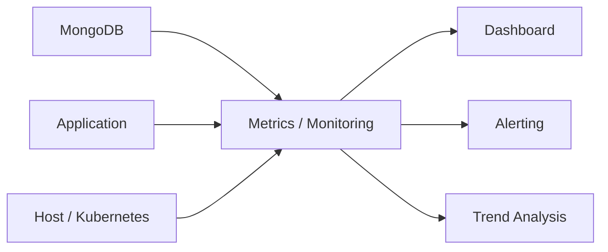

# 01- Database Inspection and Statistics

## Overview

MongoDB database inspection is the foundation of production operations, troubleshooting, capacity planning, and performance analysis.

Operational inspection answers questions such as:

- How much data is stored?
- How quickly is the database growing?
- How large are collections and indexes?
- Which collections consume the most storage?
- How many documents exist?
- What is the average document size?
- How many indexes exist?
- Is storage growth abnormal?
- Is a collection or index unexpectedly large?
- Are resource changes reflected in database behavior?

MongoDB provides several inspection mechanisms through `mongosh`, including:

- `db.stats()`
- `db.collection.stats()`
- `db.collection.getIndexes()`
- `db.serverStatus()`
- `$collStats`
- `$indexStats`
- Collection and database metadata commands

These commands expose different levels of information and should be used together rather than relying on a single statistic.

A practical operational model is:

```text
Database
   │
   ├── Database statistics
   │      ├── Data size
   │      ├── Storage size
   │      ├── Object count
   │      └── Index size
   │
   ├── Collection statistics
   │      ├── Document count
   │      ├── Average document size
   │      ├── Storage size
   │      └── Index sizes
   │
   ├── Index inspection
   │      ├── Index definitions
   │      ├── Index size
   │      └── Index usage
   │
   └── Server statistics
          ├── Memory
          ├── Connections
          ├── Operations
          ├── WiredTiger
          └── Replication
```

## Inspection Levels

MongoDB inspection can be divided into four operational levels.

| Level | Primary purpose | Common tools |
|---|---|---|
| Database | Overall database footprint | `db.stats()` |
| Collection | Data and index characteristics | `db.collection.stats()` |
| Index | Index definitions and usage | `getIndexes()`, `$indexStats` |
| Server | Runtime and infrastructure behavior | `db.serverStatus()` |

Use the narrowest level that answers the question, then correlate results across levels when diagnosing a production issue.

## Database Statistics

The basic database inspection command is:

```javascript
db.stats()
```

It provides database-level information such as:

- Collection count
- View count
- Object/document count
- Logical data size
- Storage size
- Index count
- Index size
- Average object size
- Extent-related statistics where applicable

The exact fields depend on MongoDB version and deployment configuration.

## Example Database Inspection

```javascript
use ecommerce

db.stats()
```

A result may contain information conceptually similar to:

```json
{
  "db": "ecommerce",
  "collections": 8,
  "views": 0,
  "objects": 25000000,
  "avgObjSize": 420,
  "dataSize": 10500000000,
  "storageSize": 12500000000,
  "indexes": 24,
  "indexSize": 3200000000
}
```

The values above are illustrative.

Do not interpret `dataSize` and `storageSize` as interchangeable.

## Logical Data Size vs Storage Size

MongoDB exposes several size concepts.

| Metric | Meaning |
|---|---|
| `dataSize` | Logical size of document data |
| `storageSize` | Physical storage allocated for collection data |
| `totalIndexSize` | Storage used by indexes |
| `totalSize` | Collection data plus index storage in applicable statistics |
| `avgObjSize` | Average logical document size |

Logical size and physical storage size can differ because of storage-engine behavior, compression, allocation, and other implementation details.

Therefore:

```text
Logical data size
≠
Physical storage consumption
```

This distinction matters for capacity planning.

## Database Size Inspection

For a concise overview:

```javascript
db.stats({
    scale: 1024 * 1024
})
```

This can make size-related values easier to read in MB.

For GB:

```javascript
db.stats({
    scale: 1024 * 1024 * 1024
})
```

Use the `scale` option for human-readable operational inspection rather than manually interpreting large byte values.

## Inspecting All Databases

MongoDB provides:

```javascript
db.adminCommand({
    listDatabases: 1
})
```

Example:

```javascript
db.adminCommand({
    listDatabases: 1,
    nameOnly: true
})
```

For administrative environments, this is useful for identifying database inventory.

Avoid exposing database inventory to application users.

## Listing Collections

Inspect collections in the current database:

```javascript
show collections
```

or:

```javascript
db.getCollectionNames()
```

The programmatic form is useful when building operational scripts.

Example:

```javascript
db.getCollectionNames()
```

might return:

```javascript
[
    "customers",
    "orders",
    "payments",
    "products"
]
```

## Collection Statistics

Collection-level statistics provide more detailed information than `db.stats()`.

Example:

```javascript
db.orders.stats()
```

Useful fields can include:

- `ns`
- `size`
- `count`
- `avgObjSize`
- `storageSize`
- `totalIndexSize`
- `totalSize`
- `nindexes`
- `indexSizes`

The exact output varies by MongoDB version and storage engine.

## Collection Document Count

For an exact count:

```javascript
db.orders.countDocuments({})
```

For a filtered count:

```javascript
db.orders.countDocuments({
    status: "pending"
})
```

Use `countDocuments()` when correctness matters.

Avoid relying on deprecated or inappropriate count patterns for production application logic.

## Estimated Document Count

For an approximate collection size:

```javascript
db.orders.estimatedDocumentCount()
```

This can be useful for operational inspection where an exact count is unnecessary.

| Operation | Use case |
|---|---|
| `countDocuments()` | Exact count matching a filter |
| `estimatedDocumentCount()` | Fast approximate collection count |

Do not use an estimated count when business logic requires exact semantics.

## Average Document Size

Inspect:

```javascript
db.orders.stats().avgObjSize
```

Average document size is useful for identifying collections that may contain unusually large documents.

For example:

```text
orders:
count       = 50 million
avgObjSize  = 8 KB
```

may indicate a significantly different memory and I/O profile from:

```text
orders:
count       = 50 million
avgObjSize  = 500 bytes
```

Average size alone is not sufficient because document-size distributions can be highly skewed.

## Document Size Distribution

Average document size can hide large outliers.

For example:

```text
95% of documents = 2 KB
4%                = 10 KB
1%                = 5 MB
```

The average may not reveal the operational impact of the large documents.

For performance investigations, inspect representative documents and application access patterns rather than relying exclusively on averages.

## Storage Size

Collection storage can be inspected with:

```javascript
db.orders.stats().storageSize
```

Compare:

```text
logical data size
vs
storage size
```

Large differences should be interpreted in the context of the storage engine and its allocation/compression behavior.

Do not assume that the difference automatically represents wasted space.

## Index Size

Index size is one of the most important operational statistics.

Inspect:

```javascript
db.orders.stats().totalIndexSize
```

and:

```javascript
db.orders.stats().indexSizes
```

Example:

```javascript
db.orders.stats().indexSizes
```

Conceptually:

```json
{
  "_id_": 500000000,
  "tenant_id_1_created_at_-1": 1800000000,
  "status_1": 700000000
}
```

Large indexes affect:

- Storage requirements
- Memory pressure
- Cache behavior
- Write performance
- Backup size
- Index build operations

## Inspecting Index Definitions

Use:

```javascript
db.orders.getIndexes()
```

Example:

```javascript
[
  {
    v: 2,
    key: {
      _id: 1
    },
    name: "_id_"
  },
  {
    v: 2,
    key: {
      tenant_id: 1,
      created_at: -1
    },
    name: "tenant_id_1_created_at_-1"
  }
]
```

Inspecting index definitions should be part of routine performance investigations.

## Index Size vs Index Usage

An index can be large without being heavily used.

Conversely, a relatively small index can be critical to application performance.

Therefore:

```text
Index size
+
Index usage
+
Query frequency
+
Write overhead
```

should be evaluated together.

## Index Usage Statistics

The `$indexStats` aggregation stage can provide index usage information.

Example:

```javascript
db.orders.aggregate([
    {
        $indexStats: {}
    }
])
```

This can help identify indexes that are actually being accessed.

Index usage statistics should not be interpreted as permanent historical truth. They reflect observed usage over the relevant server/runtime period and can change after restart or workload changes.

## Unused Index Investigation

An index with low or zero observed usage may be a candidate for review.

Do not immediately drop it.

Before removal, verify:

- Application query patterns
- Scheduled jobs
- Reporting workloads
- Administrative queries
- Rare but critical operations
- Deployment-specific workloads
- Historical traffic patterns

An index that is unused today may support an important workload that runs weekly or monthly.

## Collection Inventory

For an operational inventory:

```javascript
db.getCollectionNames().forEach(function (name) {
    const stats = db.getCollection(name).stats();

    printjson({
        collection: name,
        documents: stats.count,
        dataSize: stats.size,
        storageSize: stats.storageSize,
        indexSize: stats.totalIndexSize,
        indexes: stats.nindexes
    });
});
```

This is useful for identifying:

- Largest collections
- Highest index footprint
- Document growth
- Unexpected collection sizes

Run administrative inventory scripts carefully against large production deployments.

## Database Inventory Script

A more compact inspection pattern is:

```javascript
db.getCollectionNames().forEach(function (name) {
    const stats = db.getCollection(name).stats();

    print(
        `${name}: ` +
        `documents=${stats.count}, ` +
        `dataSize=${stats.size}, ` +
        `storageSize=${stats.storageSize}, ` +
        `indexSize=${stats.totalIndexSize}`
    );
});
```

For repeatable production reporting, prefer exporting metrics through your monitoring system instead of manually running shell scripts.

## `$collStats`

The `$collStats` aggregation stage provides collection-level statistics.

Example:

```javascript
db.orders.aggregate([
    {
        $collStats: {
            storageStats: {}
        }
    }
])
```

It can be useful when collection statistics need to participate in an aggregation or operational reporting workflow.

For example:

```javascript
db.orders.aggregate([
    {
        $collStats: {
            count: {}
        }
    }
])
```

The supported options and returned fields depend on the MongoDB version.

Use the current server documentation when building version-specific operational tooling.

## `$collStats` and Storage Inspection

Storage statistics can help investigate:

- Collection growth
- Storage allocation
- Compression behavior
- Data footprint
- Capacity trends

Do not use one snapshot to predict long-term capacity.

Collect measurements over time.

## Database Growth Monitoring

Capacity planning should focus on trends.

For example:

```text
Month       Data Size
Jan         120 GB
Feb         132 GB
Mar         145 GB
Apr         161 GB
May         179 GB
```

A single measurement tells you current state.

A time series tells you growth behavior.

Monitor:

```text
Data growth
+
Index growth
+
Document growth
+
Traffic growth
```

together.

## Storage Growth Analysis

A useful operational model is:

```text
Current storage
      +
Growth rate
      +
Index growth
      +
Replication requirements
      +
Backup requirements
      +
Operational headroom
```

Do not size storage based only on today's database size.

## Database Statistics for Capacity Planning

Example:

```javascript
db.stats({
    scale: 1024 * 1024 * 1024
})
```

Capture periodically:

- `dataSize`
- `storageSize`
- `indexSize`
- `objects`
- `collections`

Store the measurements externally.

This enables trend analysis such as:

```text
Database size
      │
      │          /
      │        /
      │      /
      │    /
      │  /
      └────────────────── Time
```

## Database Statistics for Troubleshooting

Suppose an API suddenly becomes slow.

Start with:

```javascript
db.stats()
```

Then inspect the affected collection:

```javascript
db.orders.stats()
```

Then inspect indexes:

```javascript
db.orders.getIndexes()
```

Then inspect index usage:

```javascript
db.orders.aggregate([
    {
        $indexStats: {}
    }
])
```

Finally inspect the actual query:

```javascript
db.orders.find({
    tenant_id: "tenant-42",
    status: "pending"
}).explain("executionStats")
```

This creates a progression from broad system state to specific query behavior.

## Server Statistics

Database and collection statistics describe stored data.

They do not fully describe runtime behavior.

For runtime information, use:

```javascript
db.serverStatus()
```

This can expose information about:

- Connections
- Operations
- Memory
- WiredTiger
- Network
- Locks
- Replication
- Metrics
- Storage behavior

The exact fields vary by MongoDB version.

## `serverStatus()` Use Cases

Use `serverStatus()` when investigating:

- High CPU
- Connection growth
- Memory pressure
- Operation volume
- Storage behavior
- WiredTiger activity
- Replication-related behavior

Example:

```javascript
db.serverStatus()
```

For targeted inspection:

```javascript
db.serverStatus().connections
```

or:

```javascript
db.serverStatus().wiredTiger
```

Only inspect fields relevant to the problem being investigated.

## Connection Statistics

Inspect:

```javascript
db.serverStatus().connections
```

Useful information can include:

- Current connections
- Available connections
- Total created connections

Connection metrics are particularly important for backend services using:

- FastAPI
- Django
- Celery
- Kafka consumers
- gRPC services
- Kubernetes deployments

## Connection Growth Investigation

A common production pattern is:

```text
Application traffic increases
        ↓
More application workers
        ↓
More MongoDB connections
        ↓
Connection pressure
        ↓
Latency increases
```

Inspect both:

```text
MongoDB connection count
```

and:

```text
Application connection-pool configuration
```

Increasing the MongoDB pool size without understanding concurrency can make the problem worse.

## Memory Statistics

For runtime memory information:

```javascript
db.serverStatus()
```

Depending on MongoDB version, relevant memory fields can provide insight into process and cache behavior.

For WiredTiger-specific analysis:

```javascript
db.serverStatus().wiredTiger.cache
```

Use these metrics together with host-level memory monitoring.

## WiredTiger Statistics

MongoDB deployments using WiredTiger expose extensive WiredTiger metrics.

Example:

```javascript
db.serverStatus().wiredTiger.cache
```

These metrics can help investigate:

- Cache usage
- Eviction
- Dirty data
- Pages read
- Pages written
- Cache pressure

Avoid interpreting an individual counter without considering workload and historical trends.

## Collection Statistics and Performance

Collection statistics can reveal structural reasons for performance issues.

For example:

```text
Collection:
orders

Documents:
200 million

Average document:
12 KB

Indexes:
14

Index size:
180 GB
```

This does not prove that the collection is slow.

But it establishes an important context for:

- Working-set analysis
- Query design
- Index analysis
- Storage planning
- Backup planning

## Database Statistics and Working Set

Database statistics show how much data exists.

Working-set analysis asks:

> How much of that data is actively accessed?

These are different questions.

Example:

```text
Database size       = 2 TB
Index size          = 400 GB
Frequently accessed = 120 GB
```

The workload may not require 2.4 TB of RAM.

However, memory behavior must be validated against actual access patterns, indexes, and storage performance.

## Collection Growth

For a time-series or event collection:

```javascript
db.events.stats()
```

Capture:

```text
count
size
storageSize
totalIndexSize
```

over time.

Rapid growth can indicate:

- Unexpected traffic
- Missing retention policy
- Duplicate ingestion
- Failed cleanup jobs
- Excessive document size
- Index growth

## Retention Investigation

Suppose:

```text
events:
Current size = 900 GB
Growth       = 30 GB/day
```

The operational question becomes:

> Does the application actually require indefinite retention?

If not, consider:

- TTL indexes
- Archival
- Data lifecycle policies
- Cold storage
- Separate historical collections

Performance and cost optimization often begin with lifecycle management.

## Inspecting Index Footprint

A useful operational report should distinguish:

```text
Collection data
Index data
Total storage
```

Example:

```text
orders
  data       = 300 GB
  indexes    = 210 GB
  total      = 510 GB
```

A large index-to-data ratio deserves investigation.

Possible causes:

- Many indexes
- Large indexed fields
- Large compound indexes
- Multikey indexes
- Historical indexes
- Redundant indexes

## Multikey Index Considerations

Indexes on array fields can become multikey indexes.

Large arrays can therefore affect index size.

For example:

```json
{
  "product_id": "P100",
  "tags": [
    "electronics",
    "mobile",
    "android",
    "5g"
  ]
}
```

An index involving `tags` can represent multiple index entries for one document.

For collections with large arrays, inspect index growth carefully.

## Large Documents

Collection statistics can expose unexpectedly large average documents.

For example:

```javascript
db.orders.stats().avgObjSize
```

A growing average may indicate:

- Embedded history
- Unbounded arrays
- Large payloads
- Excessive denormalization
- Application schema changes

Large documents increase:

- Storage consumption
- Network transfer
- Memory pressure
- Serialization cost
- Read amplification

## Database and Collection Naming

Operational tooling should clearly identify:

```text
Database
Collection
Environment
Replica set / cluster
Timestamp
```

Avoid ambiguous reports such as:

```text
orders = 500 GB
```

Prefer:

```text
production / ecommerce / orders
dataSize = 500 GB
```

This becomes particularly important across development, staging, and production environments.

## Production Inspection Workflow

A practical inspection sequence is:

```text
Identify deployment
        ↓
Inspect database inventory
        ↓
Inspect database statistics
        ↓
Identify large collections
        ↓
Inspect collection statistics
        ↓
Inspect indexes
        ↓
Inspect index usage
        ↓
Inspect server/runtime statistics
        ↓
Inspect specific query plans
        ↓
Correlate with application metrics
```

This avoids jumping directly into query optimization without understanding the surrounding system.

## Example Production Investigation

Suppose:

```text
API p99 latency increased from 250 ms to 900 ms.
```

Start with:

```javascript
db.stats({
    scale: 1024 * 1024 * 1024
})
```

Identify the affected collection:

```javascript
db.orders.stats({
    scale: 1024 * 1024 * 1024
})
```

Inspect indexes:

```javascript
db.orders.getIndexes()
```

Inspect index usage:

```javascript
db.orders.aggregate([
    {
        $indexStats: {}
    }
])
```

Inspect server state:

```javascript
db.serverStatus()
```

Inspect the affected query:

```javascript
db.orders.find({
    tenant_id: "tenant-42",
    status: "pending"
}).sort({
    created_at: -1
}).limit(50).explain("executionStats")
```

The investigation then moves from:

```text
System
  ↓
Database
  ↓
Collection
  ↓
Index
  ↓
Runtime
  ↓
Query
```

## Statistics and Monitoring Systems

Manual inspection is useful for troubleshooting but should not be the primary production monitoring strategy.

For continuous operations, collect metrics into an observability platform.

Typical architecture:



Monitor:

- Database size
- Collection growth
- Index growth
- Connections
- Query latency
- CPU
- Memory
- Storage latency
- Replication lag
- Errors

## Security Considerations

Database inspection exposes operational information that may be sensitive.

Restrict access to administrative statistics.

Operational users should receive only the privileges necessary for:

- Viewing metrics
- Inspecting collections
- Running diagnostics
- Managing indexes
- Performing administrative operations

Do not expose:

```javascript
db.serverStatus()
```

or equivalent administrative information through public application endpoints.

Avoid logging raw database statistics if they reveal sensitive infrastructure information.

## Production Safety

Read-only inspection is generally safer than administrative modification, but diagnostic commands can still have operational impact.

Before running heavy inspection workloads:

- Understand the command.
- Check the target collection size.
- Avoid unnecessary full collection scans.
- Avoid running expensive aggregations during peak traffic.
- Prefer monitoring data for routine reporting.
- Test operational scripts in staging.

Do not turn an inspection task into an additional production workload.

## Common Mistakes

### Confusing `dataSize` with Storage Consumption

**Problem:** Logical data size is treated as exact disk usage.

**Fix:** Compare logical data, storage size, and index size.

### Using Exact Counts Unnecessarily

**Problem:** Exact counting can be more expensive than necessary for operational dashboards.

**Fix:** Use `estimatedDocumentCount()` when approximate counts are sufficient.

### Dropping an Index Based Only on Low Usage

**Problem:** Rare but important workloads may not appear in a short observation period.

**Fix:** Review application and operational workloads before removal.

### Monitoring Only Database Size

**Problem:** Database size does not explain runtime behavior.

**Fix:** Combine storage metrics with CPU, memory, connections, query latency, and storage I/O.

### Taking One-Time Measurements

**Problem:** A single snapshot does not reveal growth.

**Fix:** Store measurements over time and analyze trends.

### Running Heavy Diagnostics During Peak Traffic

**Problem:** Diagnostic operations can compete with application workloads.

**Fix:** Prefer lightweight statistics and observability systems for continuous monitoring.

### Exposing Administrative Statistics

**Problem:** Operational metadata can reveal infrastructure details.

**Fix:** Restrict access and avoid exposing administrative commands through APIs.

## Operational Checklist

### Database

- [ ] Database inventory is known.
- [ ] `db.stats()` is periodically captured.
- [ ] Data-size trends are monitored.
- [ ] Storage-size trends are monitored.
- [ ] Index-size trends are monitored.

### Collections

- [ ] Largest collections are identified.
- [ ] Document counts are monitored.
- [ ] Average document size is monitored.
- [ ] Unexpected document growth is investigated.
- [ ] Retention policies are reviewed.

### Indexes

- [ ] Index definitions are reviewed.
- [ ] Index sizes are monitored.
- [ ] Index usage is periodically reviewed.
- [ ] Rarely used indexes are investigated before removal.
- [ ] Index growth is included in capacity planning.

### Runtime

- [ ] Connections are monitored.
- [ ] Memory is monitored.
- [ ] WiredTiger behavior is monitored where relevant.
- [ ] CPU is monitored.
- [ ] Storage latency and throughput are monitored.

### Performance

- [ ] Slow queries can be traced to query shapes.
- [ ] `explain("executionStats")` is available for investigation.
- [ ] Query latency is correlated with database statistics.
- [ ] Working-set behavior is understood.
- [ ] Performance trends are retained.

## Interview Considerations

### What is the difference between `db.stats()` and `db.collection.stats()`?

`db.stats()` provides database-level statistics, while `db.collection.stats()` provides detailed statistics for a specific collection.

### What is the difference between `dataSize` and `storageSize`?

`dataSize` represents logical document data, while `storageSize` represents storage allocated for collection data. They can differ due to storage-engine behavior and compression.

### How do you inspect index sizes?

Use:

```javascript
db.collection.stats().indexSizes
```

or:

```javascript
db.collection.stats().totalIndexSize
```

### How do you inspect index usage?

Use:

```javascript
db.collection.aggregate([
    {
        $indexStats: {}
    }
])
```

### How would you investigate unexpected database growth?

A senior-level investigation would compare:

```text
Document count
+
Average document size
+
Collection storage
+
Index storage
+
Growth rate
+
Application traffic
+
Retention behavior
```

rather than looking only at total database size.

## Troubleshooting Methodology

```text
Symptom
↓
Unexpected storage, latency, memory, or connection behavior
↓
Possible causes
↓
Data growth / index growth / large documents / query workload / memory pressure / runtime resource usage
↓
Isolation strategy
↓
Start with database-level statistics and narrow to affected collections
↓
Diagnostic commands
↓
db.stats()
db.collection.stats()
db.collection.getIndexes()
db.collection.aggregate([{ $indexStats: {} }])
db.serverStatus()
↓
Root cause
↓
Correlate database statistics with application and infrastructure metrics
↓
Corrective action
↓
Optimize schema, indexes, retention, workload, or infrastructure
↓
Prevention
↓
Continuous metrics, growth monitoring, capacity planning, and operational runbooks
```

## Key Takeaways

- **Use database, collection, index, and server statistics together; no single MongoDB statistic provides a complete picture of production health.**
- **Distinguish logical data size, physical storage size, and index size when investigating capacity, growth, and cost.**
- **Treat statistics as time-series operational data: growth trends are more useful for capacity planning than isolated snapshots.**
- **Use `db.stats()`, `db.collection.stats()`, `$indexStats`, and `db.serverStatus()` to progressively narrow production investigations from system state to specific bottlenecks.**
- **Keep inspection tooling safe and least-privileged, and prefer continuous observability for routine monitoring over repeatedly running expensive diagnostic commands in production.**