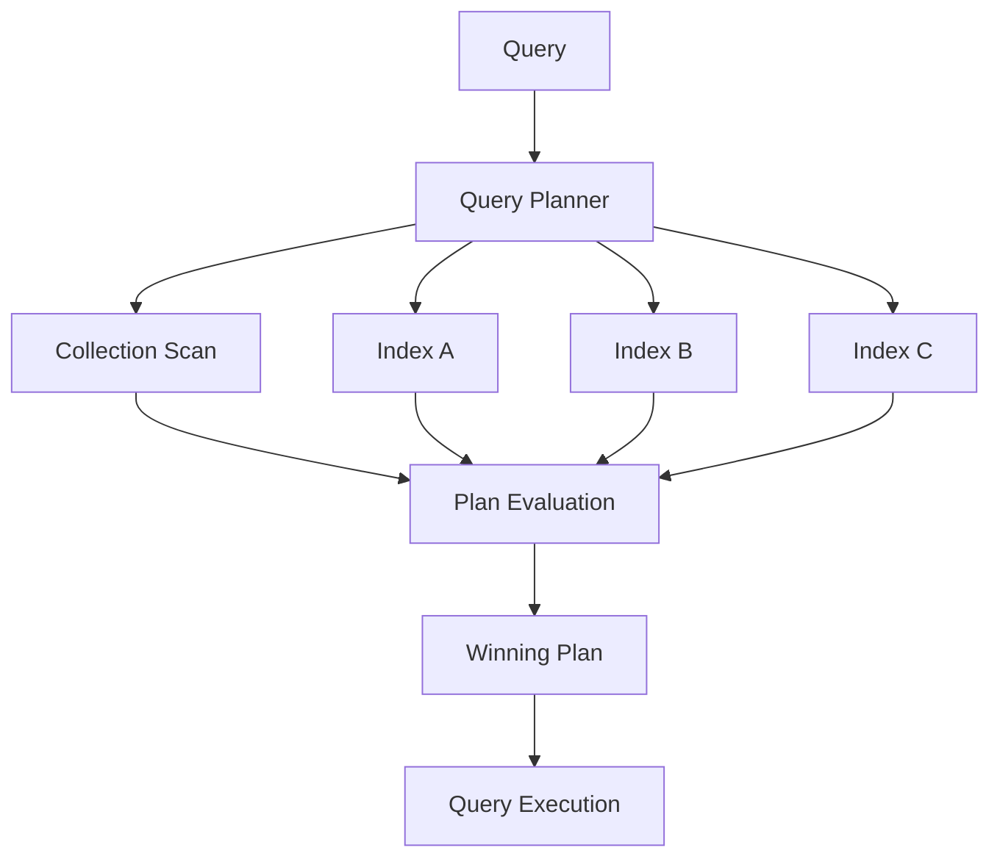
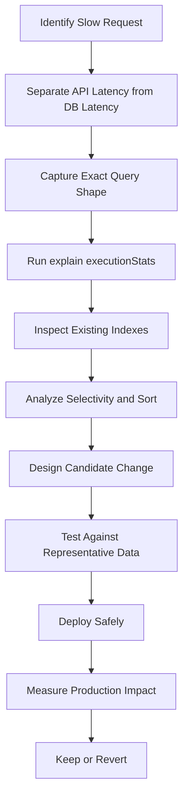
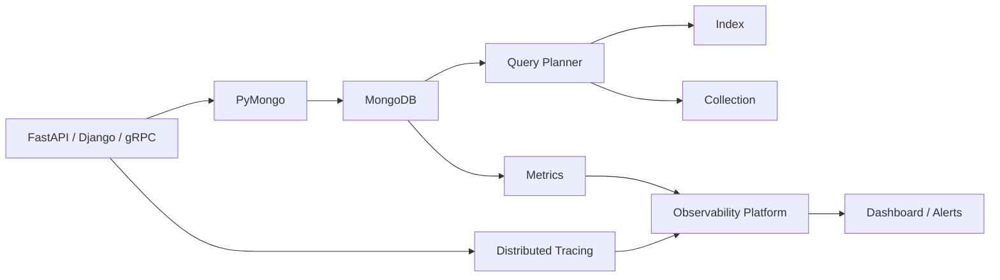

# 03- Query Performance Analysis

## Overview

MongoDB query performance analysis is the process of determining how efficiently a query accesses data, how much work MongoDB performs, and why that work is necessary.

A production query should be evaluated across:

```text
Query shape
    ↓
Available indexes
    ↓
Query planner
    ↓
Execution plan
    ↓
Keys examined
    ↓
Documents examined
    ↓
Documents returned
    ↓
Latency
    ↓
Application-level impact
```

The central diagnostic tool is `explain()`:

```javascript
db.orders.find({
    tenant_id: "tenant-42",
    status: "pending"
}).sort({
    created_at: -1
}).limit(50).explain("executionStats")
```

Query performance should not be reduced to a single rule such as "always add an index."

A query can be slow because of:

- Missing indexes
- Poor compound-index ordering
- Low selectivity
- Large result sets
- Expensive sorting
- Large documents
- Large arrays
- Inefficient pagination
- Poor aggregation design
- Excessive `$lookup`
- Memory pressure
- Working-set misses
- Connection-pool contention
- Replication or topology effects
- Application serialization
- Network latency

A senior engineer separates these causes before changing the database.

## Performance Analysis Model

A useful model for request latency is:

```text
API request
    │
    ▼
Application
    │
    ├── Query construction
    │
    ▼
MongoDB client
    │
    ├── Connection-pool wait
    │
    ▼
MongoDB server
    │
    ├── Query planning
    ├── Index traversal
    ├── Document reads
    ├── Sorting / aggregation
    └── Result serialization
    │
    ▼
Network
    │
    ▼
Application
    │
    ├── BSON decoding
    ├── Business logic
    └── JSON serialization
    │
    ▼
API response
```

This distinction matters because:

```text
API latency
≠
MongoDB execution time
```

A query may take 20 ms inside MongoDB while the endpoint takes 250 ms because of connection-pool waits, network latency, application processing, or serialization.

## Query Performance Goals

A production query should be evaluated against:

- Latency SLO
- Throughput
- Result-set size
- Read/write workload
- CPU consumption
- Memory pressure
- Storage I/O
- Connection usage
- Replication behavior
- Cost

Typical operational metrics include:

| Metric | Why it matters |
|---|---|
| Query latency | User-visible performance |
| `nReturned` | Result volume |
| `totalKeysExamined` | Index work |
| `totalDocsExamined` | Document work |
| `executionTimeMillis` | Server-side execution time |
| CPU | Computational pressure |
| Connections | Pool/topology pressure |
| Replication lag | HA impact |
| Storage latency | I/O bottleneck |
| Index size | Memory/storage pressure |

## Query Shape

A query shape describes the structural pattern of a query rather than the specific values.

These queries have essentially the same shape:

```javascript
db.orders.find({
    tenant_id: "tenant-1",
    status: "pending"
})
```

and:

```javascript
db.orders.find({
    tenant_id: "tenant-42",
    status: "paid"
})
```

The values differ, but the access pattern is the same.

Query-shape analysis is important because indexing should target recurring workload patterns rather than individual parameter values.

## Query Shape and Backend APIs

A REST endpoint might execute:

```text
GET /orders?status=pending&limit=50
```

A corresponding MongoDB query may be:

```javascript
db.orders.find({
    tenant_id: "tenant-42",
    status: "pending"
}).sort({
    created_at: -1
}).limit(50)
```

The index should be designed for the database query generated by the API.

Do not design indexes from endpoint names alone.

## Query Selectivity

Selectivity describes how effectively a predicate narrows the candidate dataset.

Consider:

```javascript
{
    status: "active"
}
```

If 95% of documents are active, the predicate is not very selective.

Compare:

```javascript
{
    user_id: "7f3..."
}
```

where only a small number of documents match.

High selectivity generally makes an index more useful, but selectivity must be considered alongside:

- Sort requirements
- Query frequency
- Compound predicates
- Result size
- Write cost

## Cardinality

Cardinality describes the number of distinct values in a field.

| Field | Typical cardinality |
|---|---|
| `country` | Low |
| `status` | Low |
| `tenant_id` | Medium to high |
| `email` | High |
| UUID | Very high |

A low-cardinality field is not automatically useless as an index field.

For example:

```javascript
{
    tenant_id: 1,
    status: 1,
    created_at: -1
}
```

may be highly effective even when `status` has only a few possible values because the complete compound query is selective.

## Query Planner

MongoDB's query planner evaluates available execution strategies and selects a winning plan.

Conceptually:



Candidate plans may include:

- Collection scans
- Different indexes
- Different index traversal strategies
- Different sort strategies

The planner's decision depends on query shape, available indexes, and runtime characteristics.

## Winning and Rejected Plans

`explain()` can expose:

```text
winningPlan
rejectedPlans
```

A winning plan is the plan MongoDB selected.

Rejected plans are alternative candidates considered by the planner.

Inspecting rejected plans can be useful when investigating:

- Competing indexes
- Unexpected index selection
- Query-plan instability
- Redundant indexes
- Data-distribution changes

Do not assume a rejected plan is universally bad. It was rejected for the evaluated query shape and planner conditions.

## `explain()` Modes

MongoDB supports different explain verbosity levels.

### `queryPlanner`

Use when you primarily want to inspect the selected execution plan.

```javascript
db.orders.find({
    tenant_id: "tenant-42",
    status: "pending"
}).explain("queryPlanner")
```

Useful for:

- Winning plan
- Rejected plans
- Index selection
- Query planning analysis

### `executionStats`

Use when measuring actual execution behavior.

```javascript
db.orders.find({
    tenant_id: "tenant-42",
    status: "pending"
}).explain("executionStats")
```

This is generally the most useful mode for diagnosing a slow query because it includes execution statistics.

### `allPlansExecution`

Use when deeper analysis of candidate plans is required.

```javascript
db.orders.find({
    tenant_id: "tenant-42",
    status: "pending"
}).explain("allPlansExecution")
```

It provides additional information about candidate-plan evaluation.

Use it selectively because detailed plan analysis is more expensive than simply inspecting metadata.

## Core Explain Metrics

The most important execution metrics include:

```text
nReturned
totalKeysExamined
totalDocsExamined
executionTimeMillis
```

Suppose:

```text
nReturned          = 50
totalKeysExamined = 65
totalDocsExamined = 50
```

This generally indicates that MongoDB performed relatively little work to return the requested documents.

Compare:

```text
nReturned          = 50
totalKeysExamined = 900000
totalDocsExamined = 900000
```

The second query performs substantially more work relative to the result set.

## `nReturned`

`nReturned` indicates how many documents were returned by the execution stage being inspected.

For:

```javascript
.limit(50)
```

a query may report:

```text
nReturned = 50
```

Do not interpret a small `nReturned` as proof of an efficient query.

A query can return 50 documents after examining millions of records.

## `totalKeysExamined`

`totalKeysExamined` measures index keys examined during execution.

A high value can indicate:

- Poor selectivity
- Poor index ordering
- Broad range scans
- Inefficient query predicates
- A query that matches many index entries

The metric should be interpreted relative to:

```text
nReturned
```

and:

```text
totalDocsExamined
```

## `totalDocsExamined`

`totalDocsExamined` measures documents examined during query execution.

For a highly selective query:

```text
nReturned          = 50
totalDocsExamined = 50
```

is generally desirable.

A result such as:

```text
nReturned          = 50
totalDocsExamined = 2,000,000
```

is a strong signal that the query is doing excessive document work.

## Execution Time

`executionTimeMillis` represents server-side execution time for the explain execution.

It is useful for comparing candidate plans, but should not be treated as an exact prediction of production endpoint latency.

Real API latency also includes:

```text
Connection acquisition
+
Network
+
Server execution
+
BSON decoding
+
Application processing
+
JSON serialization
```

## `COLLSCAN`

A `COLLSCAN` stage means MongoDB scans the collection.

Conceptually:

```text
COLLSCAN
   │
   ├── Document 1
   ├── Document 2
   ├── Document 3
   ├── ...
   └── Document N
```

A collection scan is not automatically a defect.

It can be appropriate when:

- The collection is small.
- Most documents are required.
- An index would provide little benefit.
- The operation is intentionally scanning the collection.

A high-frequency API query over a large collection performing `COLLSCAN` should generally be investigated.

## `IXSCAN`

`IXSCAN` indicates index scanning.

Conceptually:

```text
Query
  ↓
IXSCAN
  ↓
Matching index entries
  ↓
Document references
```

An `IXSCAN` is usually a positive signal for selective indexed queries, but it does not guarantee efficiency.

For example:

```text
nReturned          = 100
totalKeysExamined = 2,000,000
```

is still expensive.

## `FETCH`

A `FETCH` stage retrieves documents after index traversal identifies candidate records.

Conceptually:

```text
IXSCAN
  ↓
Record identifiers
  ↓
FETCH
  ↓
Documents
```

If the query is covered by the index, MongoDB may be able to avoid fetching full documents.

## `SORT`

A `SORT` stage indicates that MongoDB needs to perform an explicit sort during execution.

Example:

```javascript
db.orders.find({
    tenant_id: "tenant-42"
}).sort({
    created_at: -1
})
```

A suitable index can often avoid an expensive sort:

```javascript
db.orders.createIndex({
    tenant_id: 1,
    created_at: -1
})
```

An explicit `SORT` stage is not automatically a problem, but sorting a large result set can consume significant resources.

## `LIMIT`

`LIMIT` restricts the number of returned documents.

Example:

```javascript
db.orders.find({
    tenant_id: "tenant-42"
}).sort({
    created_at: -1
}).limit(50)
```

`limit()` is particularly important for API endpoints because returning unnecessary documents increases:

- Database work
- Network traffic
- BSON decoding
- Application memory
- JSON serialization
- Client latency

## Projection

Projection limits fields returned from documents.

Example:

```javascript
db.users.find(
    {
        tenant_id: "tenant-42"
    },
    {
        _id: 1,
        name: 1,
        email: 1
    }
)
```

Projection can reduce:

- Network transfer
- BSON decoding
- Application memory
- Serialization cost

Projection does not automatically make the database query cheap. The filter and index strategy still matter.

## Covered Queries

A query can be covered when MongoDB can satisfy the required filter and projection using index data without fetching documents.

Example index:

```javascript
db.users.createIndex({
    tenant_id: 1,
    email: 1
})
```

Query:

```javascript
db.users.find(
    {
        tenant_id: "tenant-42"
    },
    {
        _id: 0,
        email: 1
    }
)
```

This can reduce document-fetch overhead.

Validate the actual execution plan rather than assuming coverage.

## Index Selection

Consider this query:

```javascript
db.orders.find({
    tenant_id: "tenant-42",
    status: "pending"
}).sort({
    created_at: -1
}).limit(50)
```

Candidate index:

```javascript
db.orders.createIndex({
    tenant_id: 1,
    status: 1,
    created_at: -1
})
```

The index aligns with:

```text
Equality
Equality
Sort
```

The ESR guideline is a useful starting point, but production decisions should be validated with actual execution statistics.

## Poor Compound Index Example

Suppose the index is:

```javascript
{
    created_at: -1,
    status: 1,
    tenant_id: 1
}
```

while the workload is dominated by:

```javascript
{
    tenant_id: "...",
    status: "pending"
}
```

The index may not align as efficiently with the application's query shape.

Do not evaluate a compound index by its field membership alone.

Field ordering matters.

## Query Optimization Workflow

A production optimization workflow should be systematic.



The critical principle is:

```text
Measure
→
Change
→
Measure again
```

## Slow Query Investigation

Suppose an endpoint has:

```text
p95 = 180 ms
p99 = 950 ms
```

Do not immediately create an index.

First determine:

```text
Is MongoDB actually responsible?
```

Inspect application tracing:

```text
HTTP request
    ↓
Service method
    ↓
MongoDB connection wait
    ↓
MongoDB query
    ↓
Result decoding
    ↓
Serialization
```

A MongoDB query may only account for part of the latency.

## Application vs Database Latency

A useful diagnostic table is:

| Observation | Possible cause |
|---|---|
| High API + high DB latency | Database query/workload issue |
| High API + low DB latency | Application/network/pool issue |
| Low API + high DB CPU | Other database workload |
| High pool wait + normal query time | Connection-pool pressure |
| High DB latency + high storage latency | Storage/I/O bottleneck |
| High DB latency + high CPU | CPU-bound query/workload |

This prevents database tuning from becoming a default response to every latency problem.

## Query Profiling

For production query analysis, MongoDB provides profiling capabilities that can capture information about database operations.

Profiling should be enabled and configured deliberately because collecting detailed operation information can introduce overhead and produce sensitive operational data.

Use profiling and slow-query telemetry when:

- A workload is difficult to reproduce.
- Slow operations need to be captured continuously.
- Application traces do not identify the database query.
- Production behavior differs from staging.

For routine monitoring, prefer an observability system rather than repeatedly enabling aggressive diagnostic settings without a plan.

## Slow Query Thresholds

A slow query threshold should be based on the service's workload.

For example:

```text
Interactive API:
Target p95 < 100 ms

Background analytics:
Seconds may be acceptable

Administrative reporting:
Minutes may be acceptable
```

There is no universal MongoDB latency threshold.

The correct threshold depends on:

- User experience
- SLO
- Query frequency
- Cost
- Workload type

## Query Frequency Matters

Consider two queries:

```text
Query A:
500 ms
10 times/day

Query B:
20 ms
10,000,000 times/day
```

Query B may consume significantly more aggregate resources.

A useful performance model is:

```text
Total workload cost
≈
Query frequency
×
Cost per execution
```

Optimization should prioritize high-impact workloads rather than only the slowest individual query.

## Large Result Sets

A query returning thousands or millions of documents can be expensive even with an index.

Example:

```javascript
db.events.find({
    event_type: "click"
})
```

If millions of documents match, the database still has to process and return those documents.

For APIs:

- Use pagination.
- Apply appropriate filters.
- Use projection.
- Limit results.
- Stream or batch large workloads where appropriate.

Do not use an index to solve a problem caused by requesting excessive data.

## Skip-Based Pagination

Example:

```javascript
db.orders.find({
    tenant_id: "tenant-42"
})
.sort({
    created_at: -1
})
.skip(100000)
.limit(50)
```

Large offsets can become increasingly expensive because the database still needs to traverse past many records.

This becomes problematic for:

- Large datasets
- Deep pagination
- High-traffic APIs

## Cursor-Based Pagination

A more scalable approach is to use a stable sort key.

Example:

```javascript
db.orders.find({
    tenant_id: "tenant-42",
    created_at: {
        $lt: last_seen_created_at
    }
})
.sort({
    created_at: -1
})
.limit(50)
```

Index:

```javascript
db.orders.createIndex({
    tenant_id: 1,
    created_at: -1
})
```

For unique ordering, use a compound cursor such as:

```text
created_at + _id
```

to avoid ambiguity when multiple documents share the same timestamp.

## Regex Performance

Regex queries require careful analysis.

A query such as:

```javascript
db.users.find({
    email: {
        $regex: "example"
    }
})
```

may not be efficiently served by a standard index, depending on the pattern.

A prefix-anchored pattern such as:

```javascript
{
    email: {
        $regex: "^user@"
    }
}
```

has better potential for index-assisted execution.

Regex behavior depends on the exact expression, collation, and index.

Do not assume every regex query can efficiently use an index.

## Case-Insensitive Search

Case-insensitive search should be designed deliberately.

Potential approaches include:

- Normalized fields
- Appropriate collation/index configuration
- MongoDB search capabilities
- Application-side normalization

Avoid wrapping arbitrary fields in expensive transformations without considering index compatibility.

## Array Queries

Queries against arrays can use multikey indexes.

Example:

```javascript
db.products.find({
    tags: "mongodb"
})
```

Index:

```javascript
db.products.createIndex({
    tags: 1
})
```

However, large arrays can produce large multikey indexes.

Performance analysis should consider:

```text
Array cardinality
+
Index size
+
Query selectivity
+
Write frequency
```

## Embedded Documents

Consider:

```json
{
  "customer": {
    "country": "IN",
    "tier": "enterprise"
  }
}
```

Query:

```javascript
db.customers.find({
    "customer.country": "IN"
})
```

Index:

```javascript
db.customers.createIndex({
    "customer.country": 1
})
```

Nested fields can be indexed using dot notation.

## Aggregation Performance

Aggregation pipelines should be analyzed as execution plans rather than treated as ordinary queries.

Example:

```javascript
db.orders.aggregate([
    {
        $match: {
            tenant_id: "tenant-42",
            status: "paid"
        }
    },
    {
        $group: {
            _id: "$customer_id",
            total: {
                $sum: "$amount"
            }
        }
    },
    {
        $sort: {
            total: -1
        }
    },
    {
        $limit: 20
    }
]).explain("executionStats")
```

Performance depends on:

- Initial filtering
- Index usage
- Number of documents entering the pipeline
- `$unwind`
- `$lookup`
- `$group`
- `$sort`
- Memory
- Output size

## Filter Early

Prefer reducing the working set early.

Instead of:

```text
All documents
   ↓
Transform
   ↓
Filter
```

prefer:

```text
All documents
   ↓
$match
   ↓
Smaller working set
   ↓
Transform
```

Example:

```javascript
[
    {
        $match: {
            tenant_id: "tenant-42",
            status: "paid"
        }
    },
    {
        $group: {
            _id: "$customer_id",
            total: {
                $sum: "$amount"
            }
        }
    }
]
```

The exact optimizer behavior can vary, but explicitly designing pipelines to reduce unnecessary data early remains a sound engineering practice.

## `$lookup` Performance

`$lookup` can become expensive when joining large collections.

Consider:

```text
orders
   │
   └── $lookup
          ↓
      customers
```

Investigate:

- Foreign-field indexes
- Number of input documents
- Join cardinality
- Returned fields
- Pipeline-based filtering
- Whether the join belongs in the request path

A database join that is technically correct may still be operationally unsuitable for a high-throughput API.

## `$unwind` Performance

`$unwind` can multiply the number of pipeline documents.

Example:

```text
100,000 documents
+
average 20 array elements
≈
potentially millions of intermediate records
```

This can significantly increase:

- CPU
- Memory
- Sort cost
- Network output

Use `$unwind` deliberately and filter before expansion where possible.

## `$group` and Memory

`$group` may need to maintain intermediate state.

Large grouping operations can consume substantial resources.

Reduce input size before grouping:

```javascript
[
    {
        $match: {
            tenant_id: "tenant-42",
            created_at: {
                $gte: ISODate("2026-01-01T00:00:00Z")
            }
        }
    },
    {
        $group: {
            _id: "$customer_id",
            total: {
                $sum: "$amount"
            }
        }
    }
]
```

For very large analytics workloads, consider whether MongoDB is the correct execution engine for the workload.

## Sort Performance

Sorting can be expensive when MongoDB cannot use an appropriate index.

Example:

```javascript
db.orders.find({
    tenant_id: "tenant-42"
}).sort({
    created_at: -1
})
```

Candidate index:

```javascript
{
    tenant_id: 1,
    created_at: -1
}
```

For high-volume APIs, aligning filter and sort patterns is often more important than optimizing either independently.

## Large Documents

Large documents can make an otherwise indexed query expensive.

Suppose:

```text
Index lookup = 2 ms
Document fetch = 20 ms
BSON decoding = 10 ms
JSON serialization = 15 ms
```

The index itself is not the bottleneck.

Large documents increase:

- Storage reads
- Network transfer
- BSON decoding
- Application memory
- Serialization cost

Use projection and appropriate data modeling.

## Hot Documents

A hot document is accessed or modified disproportionately often.

Examples:

```text
Global counter
Popular product
Shared configuration
High-frequency account
Job queue metadata
```

A query can be indexed correctly while the underlying workload still experiences contention or high write pressure.

Performance analysis must therefore consider document-level access patterns, not just indexes.

## Working Set

The working set is the subset of data and indexes actively used by the workload.

Consider:

```text
Total database = 2 TB
Hot data       = 80 GB
Hot indexes    = 30 GB
```

The database does not necessarily need all 2 TB in memory.

Performance problems can arise when the working set exceeds available memory and causes increased storage reads.

Monitor:

- Memory
- Cache behavior
- Storage latency
- Query latency
- Access patterns

## Connection-Pool Effects

A slow API does not always mean slow queries.

Consider:

```text
Request
   ↓
Wait for MongoDB connection
   ↓
Execute 10 ms query
```

If the pool is exhausted:

```text
Pool wait = 150 ms
Query     = 10 ms
```

The application sees roughly:

```text
160 ms
```

of database-related time even though MongoDB execution is fast.

In Python services, inspect:

- `MongoClient` lifecycle
- Pool configuration
- Application worker count
- Kubernetes replica count
- Concurrent request volume
- Pool wait behavior

## Worker Multiplication

Suppose:

```text
Kubernetes replicas = 10
Application workers  = 4
Pool max size        = 100
```

A naive calculation could suggest:

```text
10 × 4 × 100 = 4,000
```

potential client-side pool capacity.

The actual topology and connection behavior require careful interpretation, but the key principle remains:

> Connection-pool configuration is multiplied across application processes and instances.

Do not increase pool size independently of deployment scale.

## Read Preference and Performance

Replica sets support different read preferences.

Examples include:

- `primary`
- `primaryPreferred`
- `secondary`
- `secondaryPreferred`
- `nearest`

Reading from secondaries can distribute read load, but introduces consistency and staleness considerations.

Do not move reads to secondaries solely because primary CPU is high.

Evaluate:

```text
Read freshness
+
Replication lag
+
Workload isolation
+
Failure behavior
```

## Write Workloads

Query performance analysis should include write-heavy workloads.

Write performance can be affected by:

- Number of indexes
- Document size
- Array size
- Write concern
- Transactions
- Storage latency
- Hot documents
- Replication

A query optimization that improves reads but adds several large indexes may degrade the overall system.

## Read Concern and Write Concern

Consistency settings affect performance and behavior.

For example:

```text
Majority write
    ↓
Replication acknowledgement
    ↓
Potentially higher write latency
```

Similarly, transaction and read-concern choices can affect latency and resource usage.

Do not optimize query execution while ignoring consistency requirements.

## Performance Regression Analysis

A query that was fast six months ago can become slow without any application-code change.

Possible causes:

- Collection growth
- Data distribution changes
- Index growth
- Working-set changes
- Query-shape changes
- Traffic growth
- New competing workloads
- Deployment topology changes

Therefore:

```text
Performance
=
Query
+
Data
+
Indexes
+
Workload
+
Infrastructure
```

not merely query code.

## Before-and-After Example

Initial query:

```javascript
db.orders.find({
    tenant_id: "tenant-42",
    status: "pending"
}).sort({
    created_at: -1
}).limit(50).explain("executionStats")
```

Suppose the baseline is:

```text
nReturned          = 50
totalKeysExamined  = 0
totalDocsExamined  = 7,500,000
executionTimeMillis = 820
```

Candidate index:

```javascript
db.orders.createIndex({
    tenant_id: 1,
    status: 1,
    created_at: -1
})
```

After deployment:

```text
nReturned          = 50
totalKeysExamined  = 55
totalDocsExamined  = 50
executionTimeMillis = 8
```

The improvement should then be validated at the API level:

```text
MongoDB query
↓
Repository
↓
Service
↓
HTTP endpoint
```

Do not stop at `executionTimeMillis`.

## Performance Testing

Production query optimization should be validated using realistic data.

A representative test dataset should approximate:

- Document count
- Document-size distribution
- Field cardinality
- Array sizes
- Index sizes
- Query frequency
- Tenant distribution
- Traffic concurrency

A query that performs well on:

```text
10,000 documents
```

may behave differently on:

```text
500,000,000 documents
```

## Benchmarking Strategy

A useful benchmark process is:

```text
Baseline
   ↓
Candidate change
   ↓
Warm workload
   ↓
Cold/cache-sensitive workload where relevant
   ↓
Concurrent workload
   ↓
Measure
   ↓
Compare
```

Measure:

- p50
- p95
- p99
- Throughput
- CPU
- Memory
- I/O
- Connections

Avoid optimizing based on a single execution.

## Production Query Monitoring

A mature MongoDB environment should monitor:

```text
Slow query rate
Query latency
Query shapes
Docs examined
Keys examined
CPU
Memory
Storage latency
Connections
Replication lag
```

Application observability should correlate these metrics with:

```text
HTTP endpoint
Service
Deployment
Pod
Tenant
Query shape
```

This allows engineers to answer:

> Which API workload is causing the database problem?

rather than merely:

> Is MongoDB slow?

## Performance Analysis Architecture



This architecture reflects an important operational principle:

> Database performance should be observable from the application boundary to the storage layer.

## Python Query Analysis

With PyMongo, query plans can be inspected from application-side code.

Example:

```python
from pymongo import MongoClient

client = MongoClient(
    "mongodb://localhost:27017",
    serverSelectionTimeoutMS=5_000,
)

collection = client["ecommerce"]["orders"]

plan = collection.find(
    {
        "tenant_id": "tenant-42",
        "status": "pending",
    }
).sort(
    "created_at",
    -1,
).limit(50).explain("executionStats")

execution = plan["executionStats"]

print({
    "nReturned": execution.get("nReturned"),
    "totalKeysExamined": execution.get("totalKeysExamined"),
    "totalDocsExamined": execution.get("totalDocsExamined"),
    "executionTimeMillis": execution.get("executionTimeMillis"),
})
```

Do not execute `explain()` for every production request.

Use it for controlled diagnostics, testing, or targeted investigation.

## Repository-Level Performance

A repository abstraction should keep query construction predictable.

Example:

```python
def list_pending_orders(
    collection,
    tenant_id: str,
    limit: int = 50,
):
    return list(
        collection.find(
            {
                "tenant_id": tenant_id,
                "status": "pending",
            },
            {
                "_id": 1,
                "status": 1,
                "created_at": 1,
                "total": 1,
            },
        )
        .sort("created_at", -1)
        .limit(limit)
    )
```

This makes it easier to:

- Identify query shapes
- Add appropriate indexes
- Test query behavior
- Instrument database calls
- Review performance changes

## FastAPI Performance

For FastAPI:

```text
HTTP request
    ↓
Dependency injection
    ↓
Repository
    ↓
PyMongo / AsyncMongoClient
    ↓
MongoDB
```

Measure each boundary where practical.

Do not assume that replacing synchronous PyMongo with an asynchronous driver automatically makes a slow query faster.

Async execution primarily changes how application concurrency handles I/O; it does not remove database work.

## Django Performance

When MongoDB is used from Django through a MongoDB-specific integration, do not assume that relational ORM optimization rules map one-to-one to MongoDB.

Inspect the generated MongoDB operations and actual execution plans where possible.

For direct PyMongo repository patterns, maintain explicit control over:

- Filters
- Projection
- Sort
- Pagination
- Index assumptions

## Redis and MongoDB

Redis can reduce repeated MongoDB reads:

```text
API
 │
 ▼
Redis
 │
 ├── Cache hit ──► Response
 │
 └── Cache miss
          │
          ▼
       MongoDB
          │
          ▼
        Redis
          │
          ▼
       Response
```

Caching is not a substitute for fixing an inefficient query.

A better sequence is:

```text
Fix query design
↓
Fix indexes
↓
Fix data access pattern
↓
Measure
↓
Add caching when justified
```

Otherwise, Redis can hide an underlying database problem until cache misses become expensive.

## Microservices Considerations

In microservice architectures, multiple services may access the same MongoDB cluster.

Performance analysis should identify:

```text
Service
   ↓
Database
   ↓
Collection
   ↓
Query shape
```

One service's index requirements can affect another service's write performance.

Shared databases therefore require coordinated index governance.

## Kafka and Background Consumers

Kafka consumers can create bursty MongoDB workloads.

Example:

```text
Kafka
  ↓
Consumer fleet
  ↓
Batch writes
  ↓
MongoDB
```

Performance issues may arise from:

- Excessive concurrent writes
- Large batches
- Many indexes
- Retry storms
- Hot documents
- Insufficient backpressure

When investigating MongoDB latency, correlate query statistics with consumer throughput.

## Kubernetes Considerations

MongoDB performance in Kubernetes or cloud environments should be evaluated together with:

- Pod CPU limits
- Memory limits
- Storage class
- Storage IOPS
- Network latency
- Replica count
- Application connection pools

Avoid diagnosing a query solely from MongoDB metrics if the database is running under restrictive infrastructure limits.

## Cost Considerations

Poor query performance can increase cloud costs through:

- Larger database instances
- Additional replicas
- More storage I/O
- Larger memory requirements
- Higher network transfer
- Increased application replicas
- Excessive cache infrastructure

Query optimization can therefore reduce both latency and infrastructure cost.

## Security Considerations

Performance analysis must not bypass authorization or expose sensitive data.

When logging diagnostic information:

- Avoid logging credentials.
- Avoid logging sensitive document contents unnecessarily.
- Redact personal or financial data.
- Restrict administrative commands.
- Protect query-monitoring dashboards.
- Use least-privilege MongoDB credentials.

Query shape telemetry is generally more useful operationally than storing complete sensitive query payloads.

## Common Mistakes

### Adding an Index Without Measuring

**Problem:** An index is added because a query is slow.

**Why it fails:** The actual bottleneck may be sorting, result size, connection contention, or application processing.

**Fix:**

```text
Measure
→
Explain
→
Change
→
Measure again
```

### Treating `COLLSCAN` as Automatically Bad

A collection scan can be appropriate for small collections or queries that intentionally read most documents.

Evaluate:

```text
Collection size
+
Query frequency
+
Result size
+
Latency requirement
```

### Assuming `IXSCAN` Means Efficient

An index scan can examine millions of keys.

Always inspect:

```text
totalKeysExamined
totalDocsExamined
nReturned
```

### Optimizing Only for p50

A query may have acceptable median latency while p99 latency is poor.

Monitor:

```text
p50
p95
p99
```

High-percentile latency is especially important for APIs and distributed systems.

### Ignoring Result Size

Returning 10,000 documents is expensive even if the query finds them efficiently.

Use:

- Projection
- Limit
- Pagination
- Aggregation
- Streaming where appropriate

### Using `skip()` for Deep Pagination

Large offsets can require substantial traversal.

Prefer cursor-based pagination for large datasets.

### Ignoring Query Frequency

A 500 ms query executed once per day may matter less than a 20 ms query executed millions of times.

Prioritize by aggregate workload impact.

### Benchmarking With Tiny Data

An index strategy validated on a few thousand documents may fail at production scale.

Use representative datasets.

### Ignoring Write Cost

An index that dramatically improves reads can increase write latency and storage requirements.

Evaluate the entire workload.

### Confusing MongoDB Latency With API Latency

Always separate:

```text
Connection wait
+
MongoDB execution
+
Network
+
BSON decoding
+
Application processing
+
Serialization
```

## Production Performance Checklist

### Query

- [ ] Exact query shape is known.
- [ ] Filters are selective enough for the workload.
- [ ] Projection is used where appropriate.
- [ ] Result size is bounded.
- [ ] Pagination is appropriate.
- [ ] Sort requirements are understood.

### Index

- [ ] Existing indexes have been inspected.
- [ ] Candidate index follows the access pattern.
- [ ] Compound field ordering is intentional.
- [ ] Index usage is monitored.
- [ ] Index size is acceptable.
- [ ] Write overhead has been evaluated.

### Explain

- [ ] `explain("executionStats")` has been inspected.
- [ ] `nReturned` is understood.
- [ ] `totalKeysExamined` is understood.
- [ ] `totalDocsExamined` is understood.
- [ ] Winning and rejected plans have been reviewed where relevant.
- [ ] Expensive stages such as `COLLSCAN` and `SORT` have been investigated.

### Application

- [ ] Database latency is separated from endpoint latency.
- [ ] Connection-pool behavior is understood.
- [ ] BSON decoding and serialization are considered.
- [ ] Query frequency is known.
- [ ] Application tracing correlates requests with database operations.

### Production

- [ ] p95 and p99 latency are monitored.
- [ ] Slow queries are observable.
- [ ] CPU and memory are monitored.
- [ ] Storage latency is monitored.
- [ ] Replication health is monitored.
- [ ] Performance regressions are detected after deployments.

## Interview Considerations

### How would you diagnose a slow MongoDB query?

A strong process is:

```text
Identify endpoint
↓
Separate application latency from MongoDB latency
↓
Capture exact query shape
↓
Run explain("executionStats")
↓
Inspect indexes
↓
Compare nReturned / keys examined / docs examined
↓
Analyze sorting and pagination
↓
Design candidate change
↓
Benchmark
↓
Deploy and monitor
```

### What does a high `totalDocsExamined / nReturned` ratio indicate?

It often indicates that MongoDB is examining many more documents than it ultimately returns.

Potential causes include:

- Missing index
- Poor index selectivity
- Poor compound-index ordering
- Broad query
- Inefficient data model

It is a diagnostic signal, not an absolute pass/fail threshold.

### Why can an indexed query still be slow?

Because:

- The index may have poor selectivity.
- Too many keys may be scanned.
- Too many documents may be fetched.
- Documents may be large.
- Sorting may still be expensive.
- The result set may be large.
- The working set may not fit efficiently in memory.
- Connection or infrastructure latency may dominate.

### What is the difference between `COLLSCAN` and `IXSCAN`?

`COLLSCAN` scans collection records, while `IXSCAN` traverses an index.

Neither stage alone determines whether the query is performant.

### How do you optimize a query returning only 50 documents but examining millions?

Start by examining:

```text
Filter
Index
Selectivity
Sort
Query shape
```

Then use `explain("executionStats")` to determine why so many documents or keys are being examined.

### Why is query performance a data-modeling problem?

Because performance depends on:

```text
Access patterns
+
Document structure
+
Cardinality
+
Index design
+
Result shape
```

A schema that requires inefficient access patterns cannot always be fixed by adding indexes.

## Troubleshooting Methodology

```text
Symptom
↓
High query latency / high API latency / high CPU / excessive I/O
↓
Possible causes
↓
Missing index / poor index ordering / low selectivity / large result set /
expensive sort / aggregation workload / large documents / connection pressure /
working-set pressure / infrastructure bottleneck
↓
Isolation strategy
↓
Separate application latency from MongoDB execution latency
↓
Diagnostic commands
↓
db.collection.find(...).explain("executionStats")
db.collection.aggregate([...]).explain("executionStats")
db.collection.getIndexes()
db.collection.stats()
db.collection.aggregate([{ $indexStats: {} }])
db.serverStatus()
↓
Root cause
↓
Correlate execution statistics with query shape, data distribution,
application traces, workload frequency, and infrastructure metrics
↓
Corrective action
↓
Change query, index, projection, pagination, schema, workload,
connection configuration, or infrastructure as appropriate
↓
Prevention
↓
Continuous query monitoring, performance baselines,
representative benchmarking, index governance, and regression detection
```

## Key Takeaways

- **Diagnose MongoDB performance from the complete request path; MongoDB execution time is only one component of API latency.**
- **Use `explain("executionStats")` to compare `nReturned`, `totalKeysExamined`, `totalDocsExamined`, execution stages, and execution time rather than guessing from query syntax.**
- **Indexes must be designed around real query shapes, selectivity, sorting, pagination, and workload frequency; `IXSCAN` alone does not prove efficiency.**
- **Optimize the workload, not just individual queries: consider result size, aggregation, connection pools, working set, write cost, replication, and infrastructure.**
- **Treat performance optimization as a measurable production workflow: establish a baseline, make one controlled change, validate with representative workloads, and monitor the resulting system behavior.**