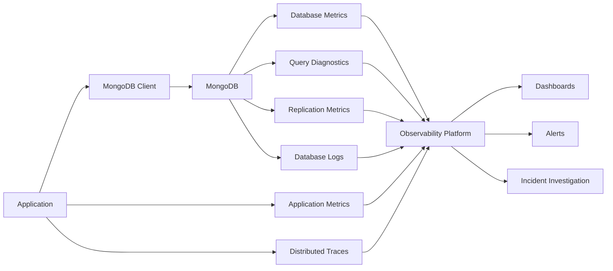
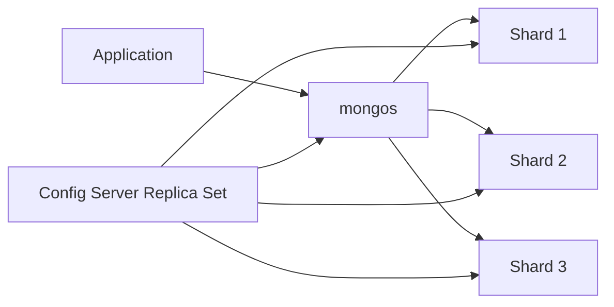
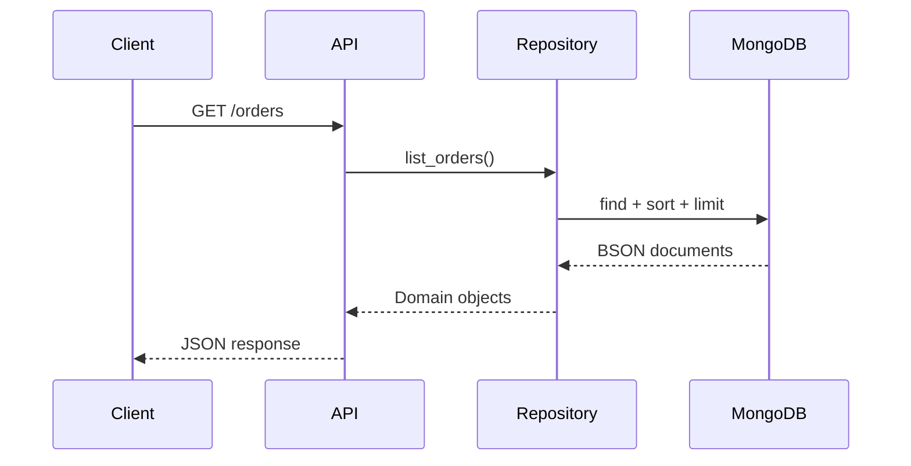

# 04- Monitoring and Observability

## Overview

MongoDB monitoring and observability provide the operational visibility required to keep production database workloads reliable, performant, and predictable.

Database monitoring answers questions such as:

- Is MongoDB healthy?
- Are queries becoming slower?
- Is storage growing unexpectedly?
- Are connections approaching capacity?
- Are indexes consuming excessive memory?
- Are replica sets healthy?
- Is replication lag increasing?
- Is the database CPU- or I/O-bound?
- Are application workloads generating abnormal traffic?
- Is a deployment causing a performance regression?

A production observability strategy should combine:

```text
Metrics
+
Logs
+
Traces
+
Query diagnostics
+
Database statistics
+
Infrastructure telemetry
```

No single source provides a complete picture.

A useful operational model is:



The objective is not to collect every available metric.

The objective is to collect enough high-quality telemetry to detect problems, explain their causes, and verify corrective actions.

## Monitoring vs Observability

Monitoring and observability overlap but serve different purposes.

| Concept | Primary purpose |
|---|---|
| Monitoring | Detect known failure or performance conditions |
| Observability | Understand why the system behaves the way it does |
| Metrics | Quantitative measurements over time |
| Logs | Detailed event information |
| Traces | Request-level causal relationships |
| Profiling | Database-operation-level diagnostics |

For example:

```text
Monitoring:
"MongoDB p99 latency exceeded 500 ms."

Observability:
"Order API p99 increased because the query shape for
tenant-scoped pending orders began examining millions of
documents after collection growth."
```

Monitoring detects the symptom.

Observability helps identify the cause.

## What to Monitor

A production MongoDB environment should generally monitor these areas:

| Area | Examples |
|---|---|
| Availability | Server health, replica-set state |
| Performance | Query latency, operations/sec |
| Queries | Slow queries, examined documents |
| Connections | Current and available connections |
| CPU | Process and host CPU |
| Memory | Process, cache, host memory |
| Storage | Disk usage, I/O latency |
| Indexes | Size, usage, growth |
| Replication | Lag, oplog behavior |
| Network | Throughput, errors |
| Capacity | Data growth, storage growth |
| Errors | Database and application failures |
| Security | Authentication and authorization events |

## Health Monitoring

The first question during an incident is:

> Is the database available and operating normally?

Basic shell inspection can begin with:

```javascript
db.adminCommand({
    ping: 1
})
```

A successful response indicates that the server accepted the command.

For deeper runtime inspection:

```javascript
db.serverStatus()
```

For replica-set deployments:

```javascript
rs.status()
```

These commands serve different purposes.

| Command | Primary purpose |
|---|---|
| `ping` | Basic connectivity |
| `serverStatus()` | Server runtime statistics |
| `rs.status()` | Replica-set health |

## Database-Level Statistics

Database statistics provide information about stored data and indexes.

```javascript
db.stats({
    scale: 1024 * 1024 * 1024
})
```

Useful measurements include:

- Logical data size
- Storage size
- Document count
- Collection count
- Index count
- Index size

Track these values over time rather than relying on individual snapshots.

## Collection Monitoring

Collection-level statistics can reveal growth and structural changes.

```javascript
db.orders.stats({
    scale: 1024 * 1024 * 1024
})
```

Important fields can include:

```text
count
size
avgObjSize
storageSize
totalIndexSize
nindexes
```

Use collection statistics to identify:

- Rapidly growing collections
- Large documents
- Excessive index footprint
- Unexpected data-model changes

## Storage Growth Monitoring

Storage growth should be treated as a time-series metric.

Example:

```text
Month       Data       Indexes
Jan         200 GB      45 GB
Feb         220 GB      49 GB
Mar         245 GB      55 GB
Apr         275 GB      63 GB
```

The important signal is not simply:

```text
Current size = 338 GB
```

but:

```text
Growth rate = increasing
```

Rapid growth can indicate:

- Traffic growth
- Missing retention policies
- Duplicate ingestion
- Unbounded arrays
- Larger documents
- New indexes
- Failed cleanup jobs

## Capacity Monitoring

Capacity planning should consider:

```text
Current storage
+
Growth rate
+
Index growth
+
Replication requirements
+
Backup requirements
+
Operational headroom
```

Do not run production infrastructure close to its storage or memory limits.

Capacity thresholds should trigger investigation before the system reaches exhaustion.

## Server Statistics

MongoDB exposes runtime metrics through:

```javascript
db.serverStatus()
```

The output is extensive and version-dependent.

Useful categories include:

- Connections
- Network
- Operations
- Memory
- WiredTiger
- Metrics
- Locks
- Replication
- Storage-engine activity

For targeted inspection:

```javascript
db.serverStatus().connections
```

or:

```javascript
db.serverStatus().wiredTiger
```

Avoid collecting or displaying the entire `serverStatus()` output in every monitoring cycle when only a subset of metrics is required.

## Connection Monitoring

Connection pressure is a common production problem for backend applications.

Inspect:

```javascript
db.serverStatus().connections
```

Relevant values may include:

- Current connections
- Available connections
- Total connections created

A typical failure pattern is:

```text
Traffic increases
      ↓
Application concurrency increases
      ↓
MongoDB connections increase
      ↓
Connection pool becomes saturated
      ↓
Requests wait
      ↓
API latency increases
```

## Connection Pool Monitoring

MongoDB connection metrics must be correlated with application configuration.

For Python services using PyMongo:

```text
Kubernetes replicas
×
Application processes
×
Connection-pool configuration
```

determine the potential connection footprint.

A common mistake is increasing `maxPoolSize` without considering the number of application workers and replicas.

More connections do not automatically increase throughput.

They can increase:

- Server resource consumption
- Context switching
- Memory usage
- Connection management overhead

## Query Performance Metrics

Query performance should be monitored at both database and application levels.

Important measurements include:

- Query latency
- Query frequency
- Documents examined
- Keys examined
- Documents returned
- Query shape
- Error rate
- Timeout rate

For targeted analysis:

```javascript
db.orders.find({
    tenant_id: "tenant-42",
    status: "pending"
}).sort({
    created_at: -1
}).limit(50).explain("executionStats")
```

Important values include:

```text
nReturned
totalKeysExamined
totalDocsExamined
executionTimeMillis
```

## Query Efficiency Ratios

A useful diagnostic comparison is:

```text
totalDocsExamined
-----------------
nReturned
```

For example:

```text
50 documents returned
50 documents examined
```

is generally efficient.

Compare:

```text
50 documents returned
5,000,000 documents examined
```

This is a strong signal that the query is doing excessive work.

These ratios are diagnostic indicators rather than universal performance thresholds.

## Slow Query Monitoring

Slow queries should be captured using appropriate MongoDB diagnostics and application observability.

Useful information includes:

```text
Timestamp
Database
Collection
Query shape
Duration
Keys examined
Documents examined
Documents returned
Application/service
```

Avoid storing sensitive query payloads unnecessarily.

Query-shape telemetry is often more useful operationally than complete document values.

## Query Profiling

MongoDB provides database profiling facilities for capturing operation information.

Profiling can be useful when:

- A problem is difficult to reproduce.
- Slow operations need to be captured from production.
- Application traces do not expose the database operation.
- Query performance needs deeper investigation.

Profiling should be enabled deliberately.

Consider:

- Additional overhead
- Log/diagnostic volume
- Sensitive query information
- Storage consumption
- Retention

Do not enable aggressive profiling permanently without an operational reason.

## Explain Plans

`explain()` is one of the most important diagnostic tools.

Example:

```javascript
db.orders.find({
    tenant_id: "tenant-42",
    status: "pending"
}).sort({
    created_at: -1
}).limit(50).explain("executionStats")
```

Inspect:

```text
winningPlan
rejectedPlans
nReturned
totalKeysExamined
totalDocsExamined
executionTimeMillis
```

Look for stages such as:

```text
COLLSCAN
IXSCAN
FETCH
SORT
LIMIT
```

The goal is not to eliminate every `COLLSCAN` or `SORT`.

The goal is to understand whether the selected plan is appropriate for the workload.

## Index Monitoring

Index monitoring should cover:

```text
Index definition
Index size
Index usage
Index growth
Write overhead
Query performance
```

Inspect definitions:

```javascript
db.orders.getIndexes()
```

Inspect index sizes:

```javascript
db.orders.stats().indexSizes
```

Inspect usage:

```javascript
db.orders.aggregate([
    {
        $indexStats: {}
    }
])
```

Index usage should be interpreted over a representative observation period.

An index that appears unused today may support a low-frequency operational workload.

## Index Growth

Monitor index growth separately from collection growth.

Example:

```text
Collection data:
+10 GB/month

Indexes:
+25 GB/month
```

This can indicate:

- New indexes
- Larger indexed values
- Multikey growth
- Data-distribution changes
- Increasing document counts

Large indexes can affect:

- Storage
- Memory
- Backup footprint
- Write performance

## Working-Set Monitoring

MongoDB performance depends heavily on memory and access locality.

A useful model is:

```text
Total dataset
      ↓
Frequently accessed dataset
      ↓
Working set
      ↓
Memory/cache behavior
```

If the active working set does not fit efficiently in available memory, storage reads may increase.

Monitor:

- Memory utilization
- WiredTiger cache behavior
- Eviction behavior
- Storage latency
- Query latency
- Working-set trends

## WiredTiger Monitoring

For deployments using WiredTiger, inspect relevant server statistics:

```javascript
db.serverStatus().wiredTiger.cache
```

Depending on MongoDB version, metrics can provide insight into:

- Cache usage
- Dirty data
- Eviction
- Pages read
- Pages written

Do not diagnose cache pressure from a single counter.

Correlate cache metrics with:

```text
Query latency
+
Storage latency
+
CPU
+
Memory
+
Workload volume
```

## CPU Monitoring

High MongoDB CPU can result from:

- Expensive queries
- Large aggregations
- Sorting
- High concurrency
- Index maintenance
- Compression
- Large result processing
- Replication workload

A useful investigation is:

```text
High CPU
   ↓
Which process?
   ↓
Which workload?
   ↓
Which query shapes?
   ↓
Which execution stages?
```

Do not respond to high CPU by immediately adding CPU capacity.

First determine whether an inefficient workload is consuming the CPU.

## Memory Monitoring

Monitor both:

```text
MongoDB process memory
```

and:

```text
Host/container memory
```

For Kubernetes, also consider:

- Pod memory limits
- Memory requests
- OOM events
- Node memory pressure
- Container restarts

A MongoDB memory problem can present as:

```text
Higher storage I/O
+
Higher query latency
+
CPU changes
```

rather than an obvious application error.

## Storage Monitoring

Storage metrics are critical for MongoDB performance.

Monitor:

- Disk utilization
- IOPS
- Throughput
- Read latency
- Write latency
- Queue depth where available
- Free space
- Storage growth

A query may have an efficient execution plan but still be slow because the required pages are not readily available in memory.

## Network Monitoring

MongoDB performance can also be affected by network behavior.

Monitor:

- Network throughput
- Packet errors
- Connection failures
- Latency
- Cross-zone or cross-region traffic

This is particularly important for:

- Kubernetes
- AWS
- Multi-region deployments
- Replica sets
- Sharded clusters
- Microservices

Do not assume that database latency is always CPU or storage related.

## Replica-Set Monitoring

For replica sets:

```javascript
rs.status()
```

is a primary operational diagnostic.

Monitor:

- Primary availability
- Secondary availability
- Member state
- Replication lag
- Election events
- Oplog behavior
- Initial sync
- Member health

A healthy replica set should not be evaluated only by whether a primary exists.

Secondaries must also remain healthy and sufficiently caught up for the deployment's consistency and failover requirements.

## Replication Lag

Replication lag measures how far a secondary falls behind the primary.

Conceptually:

```text
Primary
  │
  ├── Operation 1
  ├── Operation 2
  ├── Operation 3
  └── Operation 4
           │
           ▼
       Secondary
       ├── Operation 1
       └── Operation 2
```

Lag can affect:

- Read-after-write behavior
- Secondary reads
- Failover readiness
- Backup/recovery workflows
- Operational confidence

Track lag as a time series rather than checking it only during incidents.

## Replication Lag Causes

Potential causes include:

- High write throughput
- Slow secondary storage
- CPU saturation
- Network latency
- Resource contention
- Large operations
- Initial synchronization

The correct response depends on the root cause.

Do not simply add replicas when one secondary is lagging.

## Oplog Monitoring

The oplog is the replication log used by replica-set members.

Operational monitoring should consider:

```text
Oplog size
+
Oplog window
+
Replication lag
```

The oplog window is particularly important.

If a secondary falls behind beyond the available oplog history, it may require a more extensive synchronization process.

## Elections and Failover

Monitor:

- Election frequency
- Primary changes
- Member state changes
- Application reconnect behavior

Unexpected frequent elections can indicate:

- Network instability
- Resource pressure
- Node failures
- Configuration issues

A healthy HA system should not experience repeated unnecessary leadership changes.

## Sharded Cluster Monitoring

For sharded MongoDB deployments, monitor:

```text
mongos
+
Config servers
+
Shard health
+
Chunk distribution
+
Query targeting
+
Balancer behavior
```

A useful conceptual model is:



Monitoring should identify whether a workload is:

```text
Targeted to one shard
```

or:

```text
Scatter-gather across many shards
```

## Hot-Shard Monitoring

A shard receiving disproportionate traffic can become a bottleneck.

Potential causes include:

- Poor shard-key distribution
- Monotonically increasing keys
- Uneven tenant sizes
- Hot tenants
- Query patterns that target one shard

Monitor per-shard:

- CPU
- Storage
- Operations
- Query latency
- Connections
- Data distribution

Cluster-wide averages can hide a hot shard.

## Application Metrics

MongoDB observability should be correlated with application telemetry.

For a FastAPI service, monitor:

```text
HTTP request latency
HTTP error rate
MongoDB query latency
MongoDB connection wait
MongoDB errors
```

Example:

```text
GET /orders
    │
    ├── HTTP p99 = 850 ms
    │
    ├── MongoDB p99 = 700 ms
    │
    └── Pool wait = 100 ms
```

This immediately provides more diagnostic information than a single HTTP latency metric.

## Distributed Tracing

In microservices, distributed tracing can connect:

```text
API Gateway
   ↓
FastAPI service
   ↓
Repository
   ↓
MongoDB
```

For example:



Tracing helps determine whether latency originates in:

- Application logic
- Connection acquisition
- Database execution
- Network
- Serialization

## Python Observability

A repository method can expose timing information through application telemetry.

Example:

```python
import time
from pymongo.collection import Collection


def list_orders(
    collection: Collection,
    tenant_id: str,
    limit: int = 50,
) -> list[dict]:
    start = time.perf_counter()

    documents = list(
        collection.find(
            {
                "tenant_id": tenant_id,
            },
            {
                "_id": 1,
                "status": 1,
                "created_at": 1,
                "total": 1,
            },
        )
        .sort("created_at", -1)
        .limit(limit)
    )

    duration_ms = (time.perf_counter() - start) * 1000

    # Emit duration through the application's metrics system.
    record_database_latency(
        operation="list_orders",
        duration_ms=duration_ms,
    )

    return documents
```

The example intentionally records application-observed database latency rather than running `explain()` on every request.

## Query Labels

Useful database metrics should include low-cardinality dimensions such as:

```text
service
operation
collection
query_shape
environment
```

Avoid high-cardinality labels such as:

```text
user_id
request_id
full_query
email
tenant_id
```

unless the observability system and use case explicitly justify them.

High-cardinality metrics can become expensive and difficult to operate.

## Structured Logging

Database errors should be logged with enough context to diagnose the problem.

Example:

```python
logger.error(
    "MongoDB operation failed",
    extra={
        "operation": "create_order",
        "collection": "orders",
        "error_type": type(exc).__name__,
    },
    exc_info=True,
)
```

Avoid logging:

- Connection strings
- Passwords
- Authentication tokens
- Complete sensitive documents
- Sensitive query parameters

## Error Monitoring

Monitor MongoDB-related failures such as:

- Connection failures
- Server selection failures
- Network errors
- Duplicate-key errors
- Write conflicts
- Timeout errors
- Transaction failures
- Authentication failures

Group errors by meaningful operation rather than creating an alert for every individual exception.

## Timeouts as Observability Signals

Timeouts should be categorized.

Examples:

```text
Connection timeout
Server selection timeout
Socket timeout
Connection-pool wait timeout
Application request timeout
```

These indicate different failure modes.

For example:

```text
Application timeout
        ↓
Database query = 20 ms
Pool wait = 900 ms
```

is fundamentally different from:

```text
Application timeout
        ↓
Pool wait = 5 ms
MongoDB query = 900 ms
```

Observability should distinguish these cases.

## Alerts

Alerts should represent actionable conditions.

Useful alert categories include:

### Availability

```text
No healthy primary
```

### Replication

```text
Replication lag exceeds operational threshold
```

### Storage

```text
Disk capacity approaching limit
```

### Performance

```text
Database p99 latency exceeds SLO
```

### Connections

```text
Connection utilization remains near capacity
```

### Errors

```text
MongoDB error rate exceeds baseline
```

### Capacity

```text
Storage growth significantly exceeds expected trend
```

Avoid creating alerts for every individual metric anomaly.

## Alert Design

A good alert should answer:

```text
What is wrong?
Why does it matter?
How urgent is it?
What should the engineer investigate?
```

Example:

```text
Alert:
MongoDB replication lag elevated

Impact:
Secondary reads may return increasingly stale data
and failover readiness may be affected.

First checks:
- rs.status()
- Secondary resource utilization
- Network latency
- Oplog window
- Write throughput
```

This is more useful than:

```text
MongoDB metric X > 100
```

## Alert Fatigue

Poor alerting creates operational risk.

Avoid:

- Extremely low thresholds
- Alerts on temporary spikes
- Duplicate alerts
- Alerts without remediation paths
- Alerts for non-actionable metrics

Use:

```text
Threshold
+
Duration
+
Impact
+
Context
```

where appropriate.

## Baselines and Anomaly Detection

MongoDB workloads vary by:

- Hour
- Day
- Week
- Traffic event
- Batch workload
- Deployment

A fixed threshold may therefore be insufficient.

For example:

```text
CPU = 70%

Normal during daily batch:
Yes

Normal during low-traffic period:
No
```

Use historical baselines where possible.

## Deployment Correlation

Performance regressions should be correlated with deployments.

Example:

```text
12:00 ── Deployment
12:05 ── Query latency increases
12:07 ── CPU increases
12:10 ── p99 crosses SLO
```

This provides a strong investigation signal.

Relevant deployment metadata includes:

- Application version
- Container image
- Git commit
- Configuration version
- Database index changes
- Schema changes

## Index Deployment Observability

When deploying a new index, monitor:

```text
Index build
+
Database CPU
+
Storage I/O
+
Replication
+
Application latency
```

After the index is available, monitor:

```text
Query latency
+
Index usage
+
Write latency
+
Index size
```

An index change is successful only if it improves the intended workload without unacceptable system-wide cost.

## Security Monitoring

MongoDB observability should include security-related signals where supported by the deployment.

Monitor:

- Authentication failures
- Authorization failures
- Unexpected administrative operations
- Configuration changes
- User/role changes
- TLS-related failures
- Suspicious access patterns

Protect security logs and dashboards because they can contain sensitive infrastructure information.

## Least-Privilege Monitoring

Monitoring credentials should not automatically receive full administrative privileges.

Separate responsibilities where practical:

```text
Application identity
    ↓
Application data access

Monitoring identity
    ↓
Required telemetry access

Administrative identity
    ↓
Operational changes
```

This reduces the blast radius of compromised credentials.

## Managed MongoDB and Atlas

For managed MongoDB environments such as MongoDB Atlas, use the provider's built-in monitoring and alerting capabilities together with application observability.

Managed monitoring can expose metrics such as:

- Connections
- CPU
- Memory
- Disk
- Operations
- Query latency
- Replication
- Storage

Application-level tracing remains necessary because infrastructure monitoring alone cannot explain the complete API request path.

## AWS and Cloud Monitoring

When MongoDB is deployed on AWS infrastructure, correlate MongoDB telemetry with infrastructure-level metrics.

Depending on the architecture, this can include:

```text
MongoDB
+
EC2 / Kubernetes
+
EBS
+
Network
+
Application
```

For example:

```text
MongoDB query latency ↑
        │
        ├── CPU normal
        ├── Memory normal
        └── EBS latency ↑
```

This points toward an infrastructure/storage investigation rather than immediately changing the query.

## Dashboards

A practical MongoDB dashboard can be organized into sections.

### Overview

```text
Availability
CPU
Memory
Storage
Connections
Operations
```

### Query Performance

```text
p50 / p95 / p99
Slow queries
Query volume
Docs examined
Keys examined
```

### Replication

```text
Primary
Secondary states
Replication lag
Oplog window
Elections
```

### Capacity

```text
Data size
Index size
Storage growth
Connection growth
```

### Application

```text
Endpoint latency
Database latency
Pool wait
Database errors
```

## Production Dashboard Example

```text
MongoDB Production
──────────────────────────────────────────────

Availability       Primary: HEALTHY
Connections        420 / 2000
CPU                48%
Memory             71%
Storage            63%

Query p95          42 ms
Query p99          115 ms
Slow query rate    0.4%

Replication lag    0.8 s
Oplog window       19 h

Data growth        +18 GB/day
Index growth       +3 GB/day

API p99            180 ms
MongoDB p99        115 ms
Pool wait p99      12 ms
```

The value of the dashboard comes from correlating these measurements.

## Observability During Incidents

A useful incident workflow is:

```text
Alert
 ↓
Confirm impact
 ↓
Check availability
 ↓
Check recent deployments
 ↓
Check application latency
 ↓
Check MongoDB latency
 ↓
Check connections
 ↓
Check CPU / memory / storage
 ↓
Check replication
 ↓
Identify affected query/workload
 ↓
Apply mitigation
 ↓
Validate recovery
 ↓
Perform root-cause analysis
```

Do not immediately change database configuration during an incident without first establishing what is actually failing.

## Common Mistakes

### Monitoring Only CPU

**Problem:** CPU is healthy while users experience high latency.

**Cause:** The bottleneck may be storage, connection pools, network, locks, replication, or inefficient queries.

**Fix:** Monitor multiple resource and workload dimensions.

### Monitoring Only MongoDB

**Problem:** Database dashboards look healthy while API latency is high.

**Cause:** Application processing, connection acquisition, network, or serialization may dominate.

**Fix:** Correlate MongoDB metrics with application metrics and traces.

### Alerting on Every Metric

**Problem:** Engineers receive too many alerts.

**Impact:** Alert fatigue causes important incidents to be missed.

**Fix:** Alert on actionable conditions tied to service impact.

### Ignoring Percentiles

**Problem:** Average latency looks healthy while tail latency is poor.

**Fix:** Monitor p95 and p99 for latency-sensitive workloads.

### Treating One Snapshot as Health

**Problem:** A database appears healthy during a single inspection.

**Fix:** Use time-series metrics and historical baselines.

### Ignoring Replication Lag

**Problem:** Primary appears healthy while secondaries fall behind.

**Fix:** Monitor secondary health and replication lag continuously.

### Logging Sensitive Query Data

**Problem:** Debug logging captures credentials or sensitive document values.

**Fix:** Use structured, redacted telemetry and prefer query-shape information.

### Using High-Cardinality Metrics

**Problem:** Metrics contain user IDs, request IDs, or arbitrary tenant identifiers.

**Impact:** Monitoring storage and query costs increase significantly.

**Fix:** Keep metric dimensions low-cardinality and move detailed identifiers into traces or structured logs where appropriate.

### Running Heavy Diagnostics Continuously

**Problem:** Detailed diagnostics become part of the workload.

**Fix:** Use lightweight continuous metrics and targeted diagnostics during investigations.

## Production Observability Checklist

### Availability

- [ ] Basic database health is monitored.
- [ ] Replica-set health is monitored.
- [ ] Primary availability is monitored.
- [ ] Election events are observable.

### Performance

- [ ] Query latency is monitored.
- [ ] p95 and p99 are tracked.
- [ ] Slow queries are detectable.
- [ ] Query shapes can be identified.
- [ ] Application and database latency are correlated.

### Resources

- [ ] CPU is monitored.
- [ ] Memory is monitored.
- [ ] Storage capacity is monitored.
- [ ] Storage latency is monitored.
- [ ] Network behavior is monitored.

### Connections

- [ ] Current connections are monitored.
- [ ] Connection growth is tracked.
- [ ] Application pool configuration is understood.
- [ ] Pool wait latency is observable.

### Replication

- [ ] Secondary health is monitored.
- [ ] Replication lag is monitored.
- [ ] Oplog window is monitored.
- [ ] Election frequency is tracked.

### Indexes

- [ ] Index size is monitored.
- [ ] Index usage is periodically reviewed.
- [ ] Index growth is tracked.
- [ ] Index changes are correlated with performance.

### Security

- [ ] Authentication failures are monitored.
- [ ] Authorization failures are monitored.
- [ ] Administrative activity is controlled.
- [ ] Monitoring credentials follow least privilege.
- [ ] Sensitive telemetry is redacted.

## Interview Considerations

### What should you monitor in a production MongoDB deployment?

At minimum:

```text
Availability
CPU
Memory
Storage
Connections
Query latency
Query errors
Replication lag
Oplog health
Database growth
Index growth
```

For mature systems, add application tracing and query-level observability.

### How do you determine whether MongoDB is causing API latency?

Compare:

```text
API latency
+
Connection-pool wait
+
MongoDB execution time
+
Network time
+
Application processing
+
Serialization
```

Distributed tracing is particularly useful for separating these components.

### What is the difference between monitoring and observability?

Monitoring identifies known unhealthy conditions.

Observability provides enough telemetry to investigate unknown or unexpected system behavior.

### Why are p95 and p99 important?

Averages can hide tail latency.

For example:

```text
p50 = 20 ms
p95 = 100 ms
p99 = 900 ms
```

The average may appear acceptable while a significant tail of requests experiences poor latency.

### Why should replication lag be monitored even when the primary is healthy?

A healthy primary does not guarantee healthy secondaries.

Replication lag can affect:

- Secondary reads
- Read freshness
- Failover readiness
- Recovery operations

### Why should MongoDB metrics be correlated with application metrics?

Because database behavior is only one part of the request path.

An API can be slow because of:

```text
Connection pool
+
MongoDB
+
Network
+
Application logic
+
Serialization
```

Correlation identifies the actual bottleneck.

## Troubleshooting Methodology

```text
Symptom
↓
High latency / errors / resource saturation / replication lag /
connection exhaustion / unexpected storage growth
↓
Possible causes
↓
Query workload / indexes / connection pool / CPU / memory / storage /
network / replication / deployment / data growth
↓
Isolation strategy
↓
Determine whether the issue is application-level, database-level,
infrastructure-level, or a combination
↓
Diagnostic commands
↓
db.adminCommand({ ping: 1 })
db.serverStatus()
db.stats()
db.collection.stats()
db.collection.getIndexes()
db.collection.aggregate([{ $indexStats: {} }])
rs.status()
db.collection.find(...).explain("executionStats")
↓
Root cause
↓
Correlate metrics, logs, traces, query diagnostics,
deployment history, and workload changes
↓
Corrective action
↓
Optimize query/indexes, adjust workload, resolve resource constraints,
repair replication, scale infrastructure, or roll back a deployment
↓
Prevention
↓
Dashboards, actionable alerts, distributed tracing,
query monitoring, capacity planning, and documented runbooks
```

## Key Takeaways

- **MongoDB observability must combine database metrics with application metrics, logs, traces, query diagnostics, and infrastructure telemetry.**
- **Monitor the complete production health model: availability, queries, connections, CPU, memory, storage, replication, indexes, capacity, and errors.**
- **Correlate MongoDB latency with API latency and connection-pool behavior; a slow endpoint does not necessarily mean a slow MongoDB query.**
- **Use actionable alerts and historical baselines rather than alerting on isolated metrics or temporary spikes.**
- **Treat observability as an operational system: collect the right telemetry, protect sensitive data, investigate from symptoms to root cause, and validate recovery after corrective actions.**