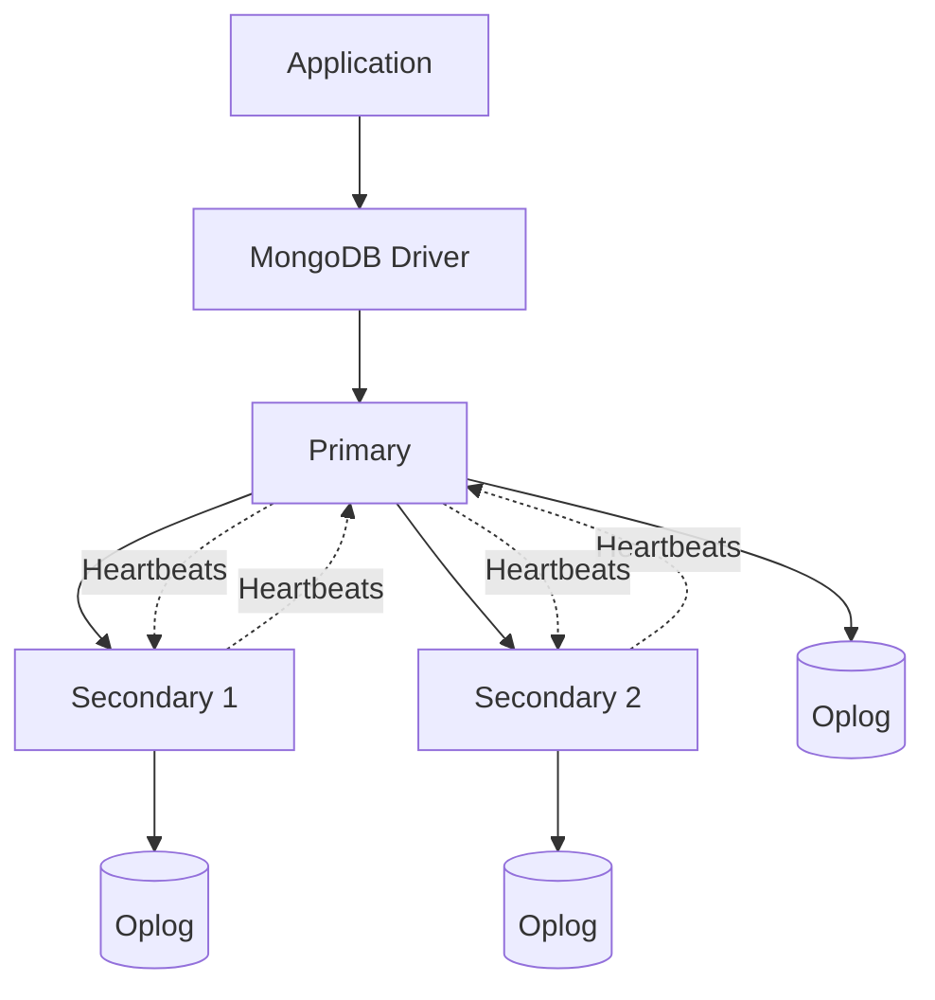
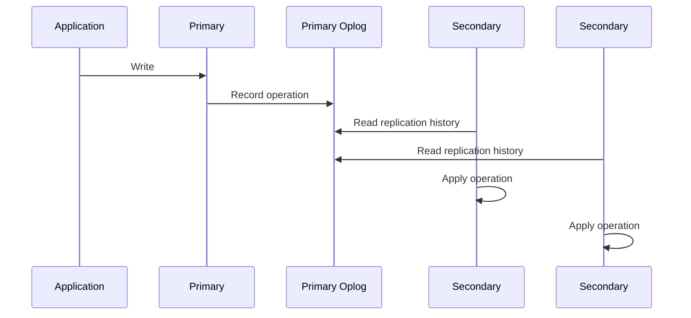
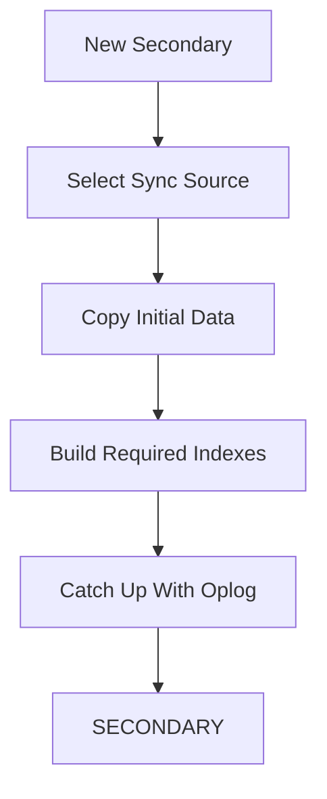

# 06- Replica Set Operations

## Overview

MongoDB replica sets provide redundancy, automatic failover, and replicated copies of data across multiple `mongod` instances. Operating a replica set correctly requires more than knowing how to inspect `rs.status()`; engineers must understand member states, elections, replication lag, oplog behavior, maintenance procedures, rollback risk, and recovery workflows.

A typical production replica set contains:



The primary accepts writes under normal operation. Secondary members replicate the primary's operations and can provide redundancy and, depending on read preference, read capacity.

Replica-set operations generally fall into these categories:

| Area | Operational responsibility |
|---|---|
| Health | Determine member and replica-set state |
| Replication | Monitor lag and synchronization |
| Elections | Understand and control failover behavior |
| Maintenance | Safely restart, upgrade, or replace members |
| Configuration | Manage priorities, votes, hidden members, and tags |
| Recovery | Handle rollback, resync, and failed members |
| Capacity | Monitor oplog, storage, CPU, memory, and network |
| Security | Protect replica-set communication and administration |
| Testing | Validate failover and recovery procedures |

The operational goal is not simply to keep every member `SECONDARY`. The goal is to maintain a healthy replication topology that can safely tolerate expected failures while meeting application availability, consistency, and recovery requirements.

## Replica Set Health Model

A healthy replica set normally has:

```text
One writable PRIMARY
        +
One or more healthy SECONDARY members
        +
Healthy replication
        +
Sufficient oplog history
        +
Stable network connectivity
        +
Acceptable replication lag
```

A replica set can still technically be operational while being unhealthy.

For example:

```text
PRIMARY
SECONDARY
SECONDARY

Replication lag = 20 minutes
```

The topology appears healthy, but the secondaries may be unable to support timely failover or read workloads.

## Inspect Replica Set Status

The first command during a replica-set investigation is usually:

```javascript
rs.status()
```

It provides information such as:

- Replica-set name
- Member states
- Primary
- Secondary members
- Health
- Replication state
- Election information
- Optime information
- Last heartbeat
- Heartbeat messages

A simplified healthy state looks like:

```text
PRIMARY
SECONDARY
SECONDARY
```

Member states commonly encountered during operations include:

| State | Meaning |
|---|---|
| PRIMARY | Current writable primary |
| SECONDARY | Replicating member |
| STARTUP | Initial startup |
| STARTUP2 | Initial replica-set startup phase |
| RECOVERING | Recovering data/state |
| ROLLBACK | Member performing rollback |
| ARBITER | Voting member without a data copy |
| UNKNOWN | State cannot currently be determined |
| DOWN | Member is unreachable or unhealthy |
| REMOVED | Member is no longer part of the active configuration |

The exact state transitions matter during troubleshooting.

## Inspect Replica Set Configuration

Use:

```javascript
rs.conf()
```

The configuration includes:

- Replica-set name
- Member hosts
- Member IDs
- Votes
- Priority
- Hidden status
- Delayed configuration
- Tags
- Settings

A useful operational distinction is:

```text
rs.status()
    → What is happening now?

rs.conf()
    → What topology is configured?
```

Do not modify the configuration merely because a member appears unhealthy. First determine whether the problem is temporary, network-related, process-related, storage-related, or configuration-related.

## Inspect the Current Primary

Use:

```javascript
db.hello()
```

The result can indicate:

- Whether the node is primary
- Whether it is writable
- Replica-set membership
- Primary address
- Secondary status

This is useful when an application is connected to an unexpected member.

## Replica Set State Investigation

A practical investigation starts with:

```text
rs.status()
     ↓
Identify PRIMARY
     ↓
Identify unhealthy members
     ↓
Check replication lag
     ↓
Check recent elections
     ↓
Check heartbeat failures
     ↓
Check host/process health
     ↓
Check oplog window
```

Avoid changing configuration before understanding the current state.

## Replication Monitoring

Replication copies operations from the primary to secondaries.

Conceptually:



The oplog is central to normal replication.

## Check Replication Lag

A commonly useful command is:

```javascript
rs.printSecondaryReplicationInfo()
```

Depending on the MongoDB version and shell environment, this reports secondary replication information including lag.

Another useful command is:

```javascript
rs.printReplicationInfo()
```

This provides information about the oplog and its time range.

For automated monitoring, use metrics rather than relying on human-readable shell output.

## Replication Lag

Replication lag is approximately:

```text
Primary operation time
-
Secondary applied operation time
```

Conceptually:

```text
Primary:
10:15:30

Secondary:
10:15:27

Lag:
3 seconds
```

Small temporary lag may be normal.

Persistent or increasing lag requires investigation.

## Causes of Replication Lag

Common causes include:

- High write volume
- Slow secondary storage
- CPU saturation
- Memory pressure
- Network latency
- Large operations
- Long-running secondary work
- Initial synchronization
- Index-building workload
- Resource contention
- Insufficient hardware

A useful diagnostic sequence is:

```text
Lag increasing
    ↓
Check write rate
    ↓
Check secondary CPU
    ↓
Check disk latency
    ↓
Check memory pressure
    ↓
Check network
    ↓
Check operation workload
    ↓
Check oplog window
```

## Oplog Operations

The oplog is a capped collection containing replication operations.

Inspect it with:

```javascript
use local
db.oplog.rs.stats()
```

You can inspect recent entries with:

```javascript
db.oplog.rs.find().sort({ $natural: -1 }).limit(5)
```

Do not treat the oplog as an application audit log.

Its primary purpose is replication.

## Oplog Window

The oplog window represents approximately how far back the oplog can provide replication history.

Conceptually:

```text
Oldest oplog operation
        |
        |<------ Oplog window ------>|
        |
Current time
```

If a secondary falls behind beyond the available oplog history, it may no longer be able to catch up through normal replication.

This can require an initial synchronization or another resync procedure.

## Why Oplog Capacity Matters

Consider:

```text
Oplog window = 6 hours
Secondary outage = 8 hours
```

The secondary may not have enough history to catch up normally.

For production systems, the oplog should provide sufficient recovery margin for expected:

- Maintenance
- Network interruptions
- Secondary restarts
- Temporary resource issues

Oplog sizing should be based on actual write workload and operational requirements rather than a fixed arbitrary size.

## Monitor Oplog Window

A production monitoring system should track:

```text
Oplog window duration
+
Replication lag
+
Write rate
```

The important relationship is:

```text
Replication lag < Oplog window
```

with sufficient operational margin.

A shrinking oplog window is an early warning signal even before replication fails.

## Heartbeats

Replica-set members communicate using heartbeat mechanisms to determine member availability.

Conceptually:

```text
Primary
  ├── heartbeat → Secondary 1
  └── heartbeat → Secondary 2
```

If a member stops responding, other members can change their view of the topology.

Heartbeat failures may result from:

- Process failure
- Host failure
- Network partition
- Firewall rules
- DNS issues
- Resource exhaustion

Do not assume a heartbeat failure automatically means the MongoDB process crashed.

## Election Operations

Elections determine which eligible member becomes primary.

An election can occur because of:

- Primary failure
- Network partition
- Primary stepping down
- Maintenance
- Configuration changes
- Resource or process failure

During an election:

```text
PRIMARY
   ↓
Unavailable / steps down
   ↓
Election
   ↓
New PRIMARY
   ↓
Drivers discover topology change
   ↓
Application resumes writes
```

Application behavior depends heavily on correct MongoDB driver configuration.

## Monitor Elections

Election frequency is an important operational signal.

A single election during planned maintenance is expected.

Repeated unexpected elections may indicate:

- Unstable infrastructure
- Network instability
- Resource exhaustion
- Process crashes
- Poor topology placement

Monitor:

- Election count
- Election timestamps
- Primary changes
- Member health
- Application error rate

## Step Down a Primary

A controlled maintenance procedure may require stepping down the primary.

Example:

```javascript
rs.stepDown(60)
```

This requests that the current primary step down and remain ineligible for the specified period.

Before using it in production:

- Confirm another eligible member is healthy.
- Confirm replication is sufficiently caught up.
- Understand application retry behavior.
- Verify maintenance timing.
- Monitor the election.

Do not use primary step-down casually during peak traffic.

## Planned Primary Maintenance

A safer workflow is:

```text
Check replica-set health
        ↓
Verify secondary readiness
        ↓
Check replication lag
        ↓
Step down primary
        ↓
Wait for election
        ↓
Verify new primary
        ↓
Perform maintenance
        ↓
Validate application traffic
```

Example:

```javascript
rs.status()
```

Then:

```javascript
rs.stepDown(60)
```

Then verify:

```javascript
rs.status()
```

The application should reconnect to the newly elected primary through a replica-set-aware connection string.

## Connection Strings for Replica Sets

Production clients should normally identify the replica set rather than treating MongoDB as a single static server.

Example:

```text
mongodb://db01:27017,db02:27017,db03:27017/orders?replicaSet=rs0
```

For MongoDB Atlas, the SRV-based connection string typically handles topology discovery through DNS.

The driver uses replica-set topology information to discover:

```text
Primary
Secondaries
Topology changes
```

This is essential for failover handling.

## Driver Failover Behavior

A modern MongoDB driver can automatically discover a new primary after an election.

The application still needs appropriate:

- Server selection timeout
- Connection timeout
- Socket timeout
- Retry configuration
- Retryable writes where appropriate
- Application-level retry strategy

Do not implement blind retries around every database operation.

Retries must account for operation semantics and idempotency.

## Retryable Writes

MongoDB drivers support retryable write behavior for supported operations and configurations.

A retry can occur when a transient infrastructure failure prevents the client from receiving the expected response.

For example:

```text
Application
    ↓
MongoDB write
    ↓
Primary processes write
    ↓
Network failure before response
    ↓
Driver retry
```

This is why application-level retry logic must not blindly duplicate non-idempotent business operations.

Use database constraints such as unique indexes and application idempotency keys where appropriate.

## Read Preference During Failover

Read preference controls where reads may be sent.

Common modes include:

| Read preference | Typical behavior |
|---|---|
| primary | Read from primary |
| primaryPreferred | Prefer primary, fall back to secondary |
| secondary | Read from secondary |
| secondaryPreferred | Prefer secondary, fall back to primary |
| nearest | Select a low-latency suitable member |

The choice affects:

- Consistency
- Latency
- Primary load
- Availability behavior

Using secondary reads is not automatically a scalability improvement. Replication lag can make secondary data stale.

## Write Concern and Replica Sets

Write concern determines how much acknowledgement is required before a write is considered successful.

A common production choice is:

```text
w: "majority"
```

Conceptually:

```text
Application
    ↓
Primary
    ↓
Replication
    ↓
Majority acknowledgement
    ↓
Application receives success
```

The exact latency depends on topology and network conditions.

Stronger durability requirements generally introduce additional latency.

## Read Concern

Read concern controls consistency characteristics of reads.

Examples include:

- `local`
- `majority`
- `linearizable`
- `snapshot`

The appropriate choice depends on workload requirements.

Do not use the strongest consistency level everywhere without understanding the latency and availability implications.

## Member Priority

Replica-set members can have different election priorities.

Inspect configuration:

```javascript
rs.conf()
```

A higher-priority eligible member can be preferred during elections.

A common production topology might intentionally designate:

```text
Primary candidate
Secondary
Hidden analytics member
```

with different priorities.

Do not modify priority without understanding election behavior and failure scenarios.

## Hidden Members

A hidden member is not normally visible to application clients for normal discovery purposes.

Hidden members can be useful for workloads such as:

- Dedicated reporting
- Backups
- Operational tasks
- Specialized analytics

A hidden member still participates in replication according to its configuration.

Do not treat a hidden member as a backup by default. Backup strategy requires independent validation and recovery procedures.

## Delayed Members

A delayed member intentionally maintains replication delay.

This can provide a recovery point from accidental or undesirable changes in some operational designs.

For example:

```text
Primary
   ↓
Secondary
   ↓
Delayed secondary
```

A delayed member must be carefully designed because it is intentionally behind the current database state.

It should not be used as a normal application read target.

## Arbiters

An arbiter participates in elections but does not store a copy of the data.

Because it does not provide a data-bearing replica, arbiters should be used only when their election role is actually justified by the topology.

A data-bearing member generally provides more operational value when infrastructure allows it.

Do not treat an arbiter as equivalent to a secondary.

## Member Tags

Tags can be used to describe topology attributes and support read preference or operational policies.

Example conceptual topology:

```text
db01 → region=primary-region
db02 → region=secondary-region
db03 → region=secondary-region
```

Tags can support geographically or operationally aware read routing.

Use them only when the application actually has a requirement for topology-aware reads.

## Add a Replica Set Member

Adding a member is a configuration operation.

Conceptually:

```javascript
rs.add("db04:27017")
```

Before adding the member:

- Verify network connectivity.
- Verify authentication configuration.
- Verify TLS configuration.
- Verify storage capacity.
- Verify MongoDB version compatibility.
- Verify replica-set configuration.
- Verify monitoring.
- Verify host naming and DNS.

After adding it:

```javascript
rs.status()
```

Monitor initial synchronization before considering the member production-ready.

## Remove a Member

A member can be removed with:

```javascript
rs.remove("db04:27017")
```

Before removal:

- Confirm sufficient voting members remain.
- Confirm sufficient data-bearing members remain.
- Understand election implications.
- Confirm no application dependency exists.
- Verify backups and recovery capacity.

Never remove a member simply because it appears unhealthy without understanding the resulting topology.

## Replace a Failed Member

A typical replacement workflow is:

```text
Failed member
    ↓
Confirm failure
    ↓
Remove or reconfigure member if required
    ↓
Provision replacement
    ↓
Configure networking/TLS/authentication
    ↓
Add replacement
    ↓
Initial sync
    ↓
Monitor replication
    ↓
Validate topology
```

The exact procedure depends on whether the failed host can be recovered or must be replaced.

## Initial Sync

A new or resynchronized member may perform an initial sync.

Conceptually:



Initial synchronization can consume:

- Network bandwidth
- Disk I/O
- CPU
- Source-member resources

Do not add several large members simultaneously to a heavily loaded production cluster without capacity planning.

## Resynchronization

A secondary that has fallen too far behind may need to be resynchronized.

Before resyncing:

```text
Check replication lag
↓
Check oplog window
↓
Determine whether normal catch-up is possible
↓
Evaluate source capacity
↓
Plan resync
```

Resynchronization can be expensive for large databases.

## Rollback

A rollback can occur when a former primary or member has operations that were not present in the final primary history after a failover scenario.

Rollback handling is a serious operational event.

Investigate:

- Which operations were rolled back?
- Why did the election occur?
- Was write concern appropriate?
- Was the application acknowledging writes too aggressively?
- Were clients correctly connected to the replica set?

Do not assume rollback is equivalent to ordinary replication lag.

## Detecting Rollback

Inspect replica-set status:

```javascript
rs.status()
```

Look for members in abnormal states and relevant messages in MongoDB server logs.

Rollback events should trigger operational investigation because they may indicate topology or consistency problems.

## Replica Set Maintenance

A rolling maintenance strategy minimizes downtime.

For a secondary:

```text
Select secondary
    ↓
Confirm another healthy member exists
    ↓
Remove it from application read traffic if applicable
    ↓
Perform maintenance
    ↓
Restart
    ↓
Wait for SECONDARY
    ↓
Confirm replication is healthy
    ↓
Proceed to next member
```

Do not perform maintenance on multiple critical members simultaneously unless the failure model has been explicitly evaluated.

## Rolling MongoDB Upgrades

A production upgrade should generally be performed in stages.

Conceptually:

```text
Check compatibility
        ↓
Back up / verify recovery
        ↓
Upgrade secondaries
        ↓
Validate replication
        ↓
Step down primary
        ↓
Upgrade former primary
        ↓
Validate new topology
```

Follow the MongoDB version-specific upgrade path and compatibility requirements rather than treating all version transitions as interchangeable.

## Version Compatibility

Before upgrading:

- Check MongoDB version compatibility.
- Check driver compatibility.
- Check feature compatibility requirements.
- Review release notes.
- Test application behavior.
- Validate backup and restore procedures.

The database server and application driver are part of one production compatibility surface.

## Monitoring Replica Set Health

Monitor at least:

| Metric | Why it matters |
|---|---|
| Primary availability | Write availability |
| Secondary health | Redundancy |
| Replication lag | Failover/read freshness |
| Oplog window | Resynchronization margin |
| Elections | Topology stability |
| Connections | Resource pressure |
| CPU | Processing capacity |
| Memory | Working-set pressure |
| Disk latency | Storage bottlenecks |
| Disk utilization | Capacity risk |
| Network latency | Replication reliability |

A healthy replica set is defined by behavior over time, not one successful `rs.status()` invocation.

## Alerting

Useful alerts include:

```text
No primary
Replication lag above threshold
Oplog window approaching unsafe margin
Unexpected election
Member unavailable
Disk capacity critical
Storage latency abnormal
Connection saturation
Repeated authentication failures
```

Avoid alerts based solely on low-level log message counts unless the signal is proven actionable.

## Capacity Planning

Replica-set capacity must account for more than primary workload.

Consider:

```text
Primary workload
+
Replication workload
+
Secondary reads
+
Backup workload
+
Initial sync
+
Monitoring overhead
```

A secondary that is technically alive but permanently saturated is not a reliable failover target.

## Secondary Read Workloads

Secondary reads can reduce primary read load, but introduce trade-offs.

```text
Application
   ├── Writes → Primary
   └── Reads  → Secondary
```

Potential problems:

- Stale data
- Replication lag
- Uneven secondary load
- Increased operational complexity

Use secondary reads only when the application's consistency requirements allow them.

## Backup Member Considerations

A dedicated backup-oriented member can reduce operational impact from backup workloads.

However:

```text
Replica member ≠ backup
```

Replication protects against some infrastructure failures.

It does not protect against:

- Accidental deletion
- Application bugs
- Malicious changes
- Logical corruption
- Some operator errors

Independent backups and recovery testing remain necessary.

## Network Partition Scenarios

Consider a three-member replica set:

```text
db01
db02
db03
```

If:

```text
db01 ↔ db02
db01 ↔ db03
```

fail but:

```text
db02 ↔ db03
```

remain connected, the majority partition can potentially elect a new primary.

The behavior depends on votes, member states, priorities, and the exact network topology.

This is why network architecture matters as much as MongoDB configuration.

## Availability Zone Placement

For production AWS or other cloud deployments, data-bearing replica-set members should generally be distributed across independent failure domains.

Conceptually:

```text
AZ-A       AZ-B       AZ-C
  |          |          |
 db01       db02       db03
```

This protects against a single availability-zone failure.

Do not place all replica members on infrastructure that can fail together.

## Kubernetes Considerations

When running MongoDB on Kubernetes, replica-set members should not all depend on one node.

Operational considerations include:

- Pod anti-affinity
- Persistent volumes
- Storage performance
- Pod disruption budgets
- Stateful workloads
- Stable network identities
- Node failure
- Availability-zone distribution

The MongoDB replica set and Kubernetes scheduling model must be designed together.

## AWS Considerations

For self-managed MongoDB on AWS, consider:

- Availability Zones
- EBS performance
- Network latency
- Security groups
- IAM integration where applicable
- Backup storage
- CloudWatch integration
- Instance sizing
- Automated recovery

For MongoDB Atlas, many infrastructure operations are managed by the service, but replica-set concepts remain important for:

- Read/write behavior
- Failover
- Read preference
- Connection strings
- Monitoring
- Capacity planning

## Security During Replica Set Operations

Administrative operations require strong access control.

Protect:

```text
rs.conf()
rs.status()
rs.stepDown()
rs.add()
rs.remove()
```

with appropriate administrative privileges.

Production administration should also use:

- TLS
- Authentication
- Least-privilege administrative accounts
- Network restrictions
- Secret management
- Auditing where required

Never place administrative credentials directly in shell history, scripts, or source control.

## Operational Runbook: No Primary

### Symptom

Applications report:

```text
No primary
ServerSelectionTimeout
Write failures
```

### Possible Causes

- Primary crashed
- Network partition
- Election in progress
- No majority available
- Members are unhealthy
- Configuration problem

### Isolation Strategy

Check:

```javascript
rs.status()
```

Then:

```javascript
rs.conf()
```

Inspect server logs and infrastructure health.

### Diagnostic Commands

```javascript
rs.status()
db.hello()
rs.conf()
```

Check:

```text
CPU
Memory
Disk
Network
Process status
```

### Root Cause

Identify whether the issue is:

```text
Process failure
Network failure
Resource exhaustion
Configuration
Infrastructure outage
```

### Corrective Action

Restore the failed component or allow a healthy majority to elect a primary.

Do not manually force configuration changes unless the topology requires them.

### Prevention

- Monitor primary availability.
- Distribute members across failure domains.
- Test failover.
- Validate driver configuration.
- Maintain sufficient voting members.

## Operational Runbook: High Replication Lag

### Symptom

Secondary lag continuously increases.

### Possible Causes

- High write volume
- Slow storage
- CPU saturation
- Network latency
- Large operations
- Secondary workload

### Isolation Strategy

Compare:

```text
Write throughput
+
Secondary CPU
+
Disk latency
+
Network
+
Oplog window
```

### Diagnostic Commands

```javascript
rs.status()
rs.printSecondaryReplicationInfo()
rs.printReplicationInfo()
```

### Root Cause

Determine whether the bottleneck is:

```text
CPU
Storage
Network
Workload
Topology
```

### Corrective Action

Depending on the root cause:

- Reduce unnecessary workload.
- Improve storage.
- Scale infrastructure.
- Reduce secondary read pressure.
- Reconfigure topology.
- Resynchronize if the member is beyond the oplog window.

### Prevention

- Monitor replication lag.
- Monitor oplog window.
- Capacity-plan secondaries.
- Test failure scenarios.

## Operational Runbook: Failed Secondary

### Symptom

One secondary becomes unavailable.

### Possible Causes

- Process crash
- Host failure
- Storage failure
- Network problem
- Configuration issue

### Isolation Strategy

Check:

```text
rs.status()
MongoDB logs
Host health
Storage
Network
```

### Corrective Action

If recoverable:

```text
Restore process/host
↓
Verify replication
↓
Wait for SECONDARY
```

If not recoverable:

```text
Provision replacement
↓
Configure
↓
Add member
↓
Initial sync
↓
Validate
```

### Prevention

- Automated health monitoring
- Multiple failure domains
- Sufficient redundancy
- Tested replacement procedures

## Operational Runbook: Unexpected Election

### Symptom

Primary changes unexpectedly.

### Possible Causes

- Primary process crash
- Host failure
- Network partition
- Resource exhaustion
- Manual step-down
- Infrastructure maintenance

### Isolation Strategy

Correlate:

```text
Election timestamp
+
MongoDB logs
+
Host events
+
Network metrics
+
Deployment events
```

### Corrective Action

Address the underlying infrastructure or database issue.

Do not simply suppress election alerts.

### Prevention

- Monitor election frequency.
- Monitor resource pressure.
- Validate network stability.
- Test graceful maintenance procedures.

## Operational Runbook: Oplog Window Shrinking

### Symptom

The oplog window decreases significantly.

### Possible Causes

- Increased write rate
- Insufficient oplog capacity
- Secondary lag
- Storage constraints

### Isolation Strategy

Compare:

```text
Oplog size
+
Oplog duration
+
Write throughput
+
Replication lag
```

### Corrective Action

Investigate the increased write workload or replica lag and resize/reconfigure the oplog according to the deployment's supported operational procedure.

### Prevention

Alert before the oplog window becomes insufficient for expected outage and maintenance periods.

## Operational Runbook: Rollback

### Symptom

A member enters rollback or rollback-related events appear in the logs.

### Possible Causes

- Primary failure
- Network partition
- Election
- Divergent writes

### Isolation Strategy

Inspect:

```text
rs.status()
MongoDB server logs
Application write errors
Election history
Write concern
```

### Corrective Action

Determine which operations were affected and reconcile any application-level consequences.

Do not assume database-level recovery automatically resolves business-level effects.

### Prevention

- Use appropriate write concern.
- Maintain stable replica-set topology.
- Monitor elections.
- Test network failure scenarios.
- Design business operations for idempotency.

## Common Operational Mistakes

### Treating `rs.status()` as the Entire Monitoring Strategy

`rs.status()` is excellent for interactive diagnosis but insufficient for continuous monitoring.

Use metrics and automated alerts for production monitoring.

### Running Maintenance on Multiple Members

Taking multiple critical members offline can remove majority availability.

Perform maintenance sequentially unless the failure model explicitly supports parallel operations.

### Ignoring Oplog Window

A secondary can remain offline long enough to exceed available replication history.

Monitor both lag and oplog window.

### Treating a Secondary as a Backup

Replication does not replace independent backups.

Use backup and restore procedures for logical recovery.

### Using Secondary Reads Without Considering Lag

Secondary reads can return stale data.

Choose read preference according to business consistency requirements.

### Manually Changing Replica Configuration During an Incident

Configuration changes made without understanding voting and election behavior can make an incident worse.

First establish:

```text
Current topology
+
Member health
+
Majority
+
Replication state
```

### Treating an Arbiter as a Data Replica

An arbiter votes but does not provide a data copy.

Do not count it as equivalent to a data-bearing secondary when evaluating redundancy.

### Ignoring Driver Failover Configuration

A healthy replica set does not guarantee application recovery if the application uses an inappropriate connection configuration.

Use replica-set-aware drivers and validate failover behavior.

## Production Checklist

### Health

- [ ] Replica-set status is monitored.
- [ ] Primary availability is monitored.
- [ ] Secondary health is monitored.
- [ ] Elections are tracked.
- [ ] Replication lag is monitored.
- [ ] Oplog window is monitored.

### Topology

- [ ] Members are distributed across failure domains.
- [ ] Voting configuration is intentional.
- [ ] Priorities are intentional.
- [ ] Hidden members have documented purposes.
- [ ] No unnecessary arbiters are used.
- [ ] Capacity supports failover.

### Maintenance

- [ ] Rolling maintenance procedures are documented.
- [ ] Primary step-down is tested.
- [ ] Secondary replacement is documented.
- [ ] Upgrade procedures are tested.
- [ ] Rollback procedures are documented.

### Application

- [ ] Drivers use replica-set-aware connection configuration.
- [ ] Server selection timeout is configured appropriately.
- [ ] Retry behavior is understood.
- [ ] Idempotency exists for retry-sensitive operations.
- [ ] Read preference matches consistency requirements.
- [ ] Write concern matches durability requirements.

### Recovery

- [ ] Independent backups exist.
- [ ] Restore procedures are tested.
- [ ] Oplog capacity supports expected recovery scenarios.
- [ ] Rollback handling is documented.
- [ ] Disaster-recovery procedures are exercised.

## Interview Considerations

### What happens when the primary fails?

Eligible replica-set members communicate through heartbeats and participate in an election. If a suitable majority is available, one eligible member can become the new primary. MongoDB drivers that are correctly configured for replica-set discovery can detect the topology change and reconnect to the new primary.

### Why are three data-bearing members common in production?

Three voting members can provide majority-based fault tolerance while retaining two data copies outside the failed member. The exact topology depends on availability requirements, failure domains, workload, and cost.

### What is the difference between replication lag and oplog window?

Replication lag describes how far behind a secondary is from the primary.

The oplog window describes how much historical replication data remains available.

A secondary can have:

```text
Lag = 30 minutes
Oplog window = 2 hours
```

and still have sufficient history to catch up.

If:

```text
Lag > Oplog window
```

normal oplog-based catch-up may no longer be possible.

### Why does write concern matter during failover?

Write concern determines when the client considers a write acknowledged. Stronger acknowledgement requirements can reduce the risk of losing recently acknowledged writes during certain failures, at the cost of additional latency and potentially reduced availability under failure conditions.

### Why shouldn't applications connect only to the primary hostname?

The primary can change during elections.

A replica-set-aware connection configuration allows the driver to discover the current topology rather than assuming one server is permanently primary.

## Key Takeaways

- **Operate replica sets as a topology, not as independent MongoDB servers; monitor primary health, secondary health, elections, replication lag, and oplog window together.**
- **Use replica-set-aware drivers, appropriate read/write concerns, and tested retry and idempotency strategies so application behavior remains correct during elections and failover.**
- **Perform maintenance sequentially and validate replication before taking additional members offline; primary step-down and rolling maintenance should be practiced before production incidents occur.**
- **Replication is not backup: protect against logical errors and operator mistakes with independent backups, tested restores, and documented recovery procedures.**
- **Treat repeated elections, growing replication lag, shrinking oplog windows, and unhealthy secondaries as capacity or reliability signals requiring root-cause investigation rather than merely transient database events.**