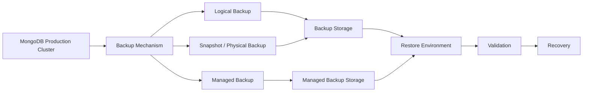
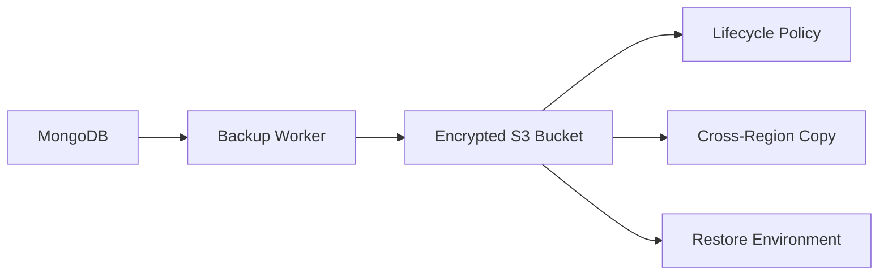
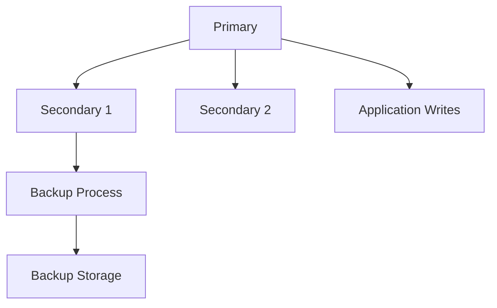
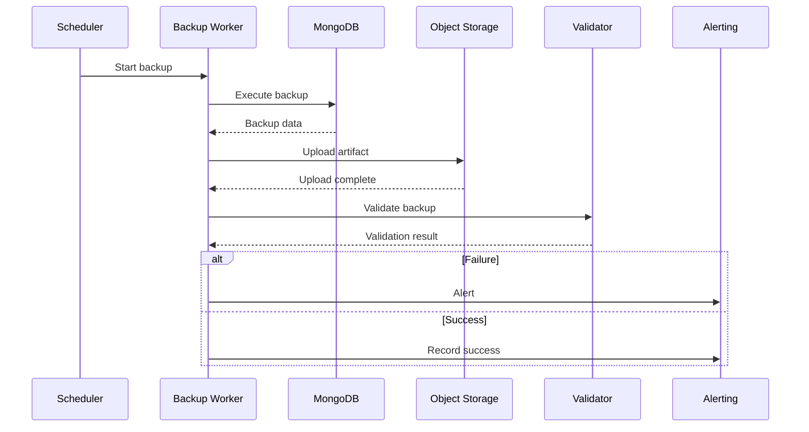

# 07- Backup and Restore Operations

## Overview

MongoDB replication provides high availability, but replication is not a backup strategy. A replica set can replicate an accidental deletion, corrupted application write, or malicious change to every member. Backups provide an independent recovery mechanism for logical errors, infrastructure failures, and disaster scenarios.

A production MongoDB backup strategy should answer:

```text
What data is protected?
How frequently is it backed up?
Where is it stored?
How long is it retained?
Can it be restored?
How quickly can it be restored?
What point in time can be recovered?
```

The operational model is:



A backup that has never been restored should be treated as unverified.

## Backup vs Replication

Replication and backup solve different problems.

| Capability | Replica Set | Backup |
|---|---|---|
| High availability | Yes | No |
| Automatic failover | Yes | No |
| Protection from host failure | Yes | Yes, depending on backup location |
| Protection from accidental deletion | No | Yes |
| Protection from logical corruption | No | Yes |
| Historical recovery | Limited | Yes |
| Point-in-time recovery | Not by replication alone | Supported by appropriate backup architecture |
| Disaster recovery | Limited | Yes |
| Recovery to isolated environment | No | Yes |

Consider:

```text
Application accidentally deletes 500,000 documents
        ↓
Primary processes deletion
        ↓
Secondaries replicate deletion
        ↓
Replica set remains healthy
        ↓
Data is still lost
```

A backup can provide a recovery path.

## Recovery Objectives

Backup design should begin with recovery objectives.

### Recovery Point Objective

RPO answers:

> How much data loss can the business tolerate?

Examples:

```text
RPO = 24 hours
```

may permit daily backups.

```text
RPO = 5 minutes
```

requires a much more frequent recovery mechanism.

### Recovery Time Objective

RTO answers:

> How quickly must the service be restored?

For example:

```text
RTO = 15 minutes
```

requires a significantly different architecture from:

```text
RTO = 24 hours
```

A backup strategy should therefore be designed from:

```text
Business RPO
+
Business RTO
+
Dataset size
+
Write volume
+
Recovery architecture
```

## Backup Strategy

A production backup strategy commonly combines multiple mechanisms.

```text
Logical backup
+
Snapshot / physical backup
+
Continuous or point-in-time recovery
+
Independent backup storage
+
Regular restore testing
```

The correct combination depends on:

- MongoDB deployment model
- Dataset size
- Write volume
- RPO
- RTO
- Recovery complexity
- Budget
- Compliance requirements

## Backup Types

| Backup type | Characteristics | Typical use |
|---|---|---|
| Logical | Exports logical BSON/JSON data | Portability, selective recovery |
| Physical | Copies database storage files or snapshots | Large databases, fast recovery |
| Managed backup | Provider-managed snapshots/PITR | Atlas and managed deployments |
| Oplog-based recovery | Uses operation history for point-in-time recovery | Low-RPO recovery |

No single mechanism is ideal for every recovery scenario.

## Logical Backups

Logical backups extract MongoDB data into portable files.

The standard MongoDB utility is:

```bash
mongodump
```

A restore is performed using:

```bash
mongorestore
```

Logical backups are useful when:

- Dataset size is manageable.
- Portability matters.
- Selective database or collection recovery is required.
- Data needs to be migrated between environments.
- A human-readable operational workflow is preferred.

The main limitation is performance at very large scale.

## `mongodump`

A basic database backup:

```bash
mongodump \
  --uri="$MONGODB_URI" \
  --out="/backups/mongodb/$(date +%Y%m%d-%H%M%S)"
```

A specific database:

```bash
mongodump \
  --uri="$MONGODB_URI" \
  --db=orders \
  --out="/backups/orders-20260922"
```

A specific collection:

```bash
mongodump \
  --uri="$MONGODB_URI" \
  --db=orders \
  --collection=customers \
  --out="/backups/orders-customers-20260922"
```

The connection string should come from secure configuration rather than being hard-coded into scripts.

## Archive Format

An archive can simplify backup handling:

```bash
mongodump \
  --uri="$MONGODB_URI" \
  --archive="/backups/orders-20260922.archive" \
  --gzip
```

This can produce a compressed portable backup artifact.

For production automation, ensure:

- Backup destination has sufficient capacity.
- Credentials are protected.
- Backup files are encrypted where required.
- Exit codes are checked.
- Backup completion is monitored.
- Retention is enforced.

## Backup Authentication

A backup process needs sufficient privileges to read the required data.

Do not use a highly privileged administrative account if a dedicated backup identity can provide the required access.

A production design should look like:

```text
Backup Scheduler
      ↓
Secret Manager
      ↓
Dedicated Backup Credential
      ↓
MongoDB
      ↓
Encrypted Backup Storage
```

## `mongorestore`

Restore an archive:

```bash
mongorestore \
  --uri="$RESTORE_MONGODB_URI" \
  --archive="/backups/orders-20260922.archive" \
  --gzip
```

A database-specific restore can be performed with appropriate namespace mapping.

For example:

```bash
mongorestore \
  --uri="$RESTORE_MONGODB_URI" \
  --archive="/backups/orders-20260922.archive" \
  --gzip \
  --nsInclude="orders.*"
```

Always validate restore syntax and behavior against the MongoDB version used by the environment.

## Restore Into an Isolated Environment

Do not perform the first restore test directly against production.

Prefer:


An isolated restore allows engineers to verify:

- Backup integrity
- Authentication
- Data completeness
- Index availability
- Application compatibility
- Recovery procedure correctness

## Restore Validation

A restore should be validated at multiple levels.

### Structural Validation

Check:

- Database exists
- Collections exist
- Indexes exist
- Expected document counts are present

Example:

```javascript
show dbs
show collections

db.orders.countDocuments()
db.customers.countDocuments()
```

### Data Validation

Check representative records:

```javascript
db.orders.findOne()
db.customers.findOne()
```

For critical systems, validate checksums, record counts, or business-level reconciliation where appropriate.

### Application Validation

Start the application against the restored database and verify:

```text
Authentication
Reads
Writes
Indexes
Critical API endpoints
Background jobs
Transactions
```

A database restore is not complete until the application can operate against the recovered dataset.

## Backup Verification

Backup success should not mean:

```text
mongodump exited with code 0
```

Verification should include:

```text
Backup completed
        ↓
Artifact exists
        ↓
Expected size/range
        ↓
Backup metadata recorded
        ↓
Artifact is readable
        ↓
Restore test succeeds
        ↓
Application validation succeeds
```

## Backup Metadata

Record metadata for every production backup.

Useful fields include:

```text
backup_id
timestamp
MongoDB version
deployment/environment
database
backup type
storage location
size
duration
status
retention date
restore-test status
```

This makes backup operations auditable.

## Backup Retention

Retention should reflect business and regulatory requirements.

A common pattern is:

```text
Recent backups:
High frequency

Older backups:
Lower frequency

Long-term backups:
Lower frequency / archive
```

For example:

| Backup age | Example retention strategy |
|---|---|
| Hours | Frequent recovery points |
| Days | Daily backups |
| Weeks | Weekly backups |
| Months | Monthly archival backups |

The exact policy must be based on organizational requirements.

## Backup Storage

Do not store the only backup copy on the same MongoDB host.

A safer architecture is:

```text
MongoDB
   ↓
Backup
   ↓
Object Storage
   ↓
Separate failure domain
```

For AWS environments, object storage such as Amazon S3 can provide durable backup storage.

Consider:

- Encryption
- Versioning
- Lifecycle policies
- Access control
- Cross-region replication where required
- Object lock or immutability where required

## Backup Encryption

Backup files can contain the entire database.

Protect them with:

- Encryption in transit
- Encryption at rest
- Strong storage access controls
- Key management
- Restricted restore permissions

Do not assume that encrypted MongoDB storage automatically protects separately exported logical backups.

The backup artifact must be protected independently.

## AWS Backup Storage Pattern

A common architecture is:



Use separate permissions for:

```text
Backup writer
Backup reader
Restore operator
Storage administrator
```

This reduces the blast radius of credential compromise.

## Physical Backups and Snapshots

Physical backup approaches capture database storage at a lower level than logical export.

They are often useful for large datasets because restoring raw storage can be substantially faster than reconstructing millions of documents through logical inserts.

Potential mechanisms include:

- Storage snapshots
- Filesystem snapshots
- Managed database snapshots
- Cloud provider snapshots
- MongoDB-supported backup mechanisms

Physical backup procedures must account for MongoDB consistency requirements.

Do not simply copy live database files using an arbitrary filesystem command and assume the resulting files constitute a valid backup.

## Managed Backups

Managed MongoDB platforms can provide automated:

- Snapshots
- Retention
- Point-in-time recovery
- Backup scheduling
- Recovery workflows

MongoDB Atlas provides managed backup capabilities depending on cluster configuration and service tier.

Managed backup reduces operational work but does not remove the need to test recovery.

## Point-in-Time Recovery

Point-in-time recovery allows recovery to a timestamp rather than only to the time of a full snapshot.

Conceptually:

```text
Snapshot
   |
   |------ oplog / incremental history ------|
   |
10:00     10:30     11:00     11:30     12:00
                                  ^
                                  |
                            Recovery point
```

This is especially valuable for:

```text
Accidental deletion at 11:47
```

when the desired recovery point is:

```text
11:46:59
```

rather than the previous night's backup.

## Point-in-Time Recovery Requirements

PITR generally requires:

```text
Base backup
+
Continuous operation history
+
Reliable retention
+
Consistent recovery tooling
```

The exact implementation depends on the MongoDB deployment and backup platform.

## Oplog and Recovery

The oplog contains replication operations and is important for certain recovery mechanisms.

However:

```text
Oplog ≠ backup
```

The oplog is finite and primarily exists for replication.

If the required recovery point is outside the available history, the oplog cannot reconstruct it.

## RPO and Oplog Window

For a replica-set deployment using oplog-assisted recovery, monitor:

```text
Required recovery window
vs
Available oplog window
```

For example:

```text
Required PITR coverage = 24 hours
Oplog window = 8 hours
```

The architecture does not satisfy the intended recovery requirement.

## Backup During High Write Volume

Logical backups can create additional:

- CPU usage
- Disk reads
- Network traffic
- Storage pressure

On high-throughput systems, backup workload must be considered part of capacity planning.

Potential strategies include:

- Running backups against appropriate members
- Using managed snapshots
- Scheduling heavy operations during lower-load periods
- Using incremental/PITR mechanisms where available

Do not automatically run resource-intensive backups against the primary during peak traffic.

## Backup Source Selection

A backup architecture should carefully select where backup work occurs.

Possible choices include:

```text
Primary
Secondary
Dedicated backup-capable member
Managed backup system
```

The choice depends on:

- Backup mechanism
- Replica topology
- Resource capacity
- Consistency requirements
- Provider capabilities

A secondary is not automatically safe to overload with backup work.

## Backup and Replica Sets

A common production architecture is:



The backup system remains independent from ordinary replication.

## Disaster Recovery

Disaster recovery requires a recovery environment, not merely backup files.

A complete DR design includes:

```text
Backup
+
Backup storage
+
Credentials
+
Infrastructure definition
+
MongoDB configuration
+
Application deployment
+
DNS/network configuration
+
Restore procedure
+
Validation procedure
```

Infrastructure-as-code can reduce recovery time.

For example:

```text
Terraform / CloudFormation
        ↓
Network
        ↓
Compute
        ↓
MongoDB
        ↓
Restore backup
        ↓
Deploy application
        ↓
Validate
        ↓
Route traffic
```

## Cross-Region Recovery

For region-level failure, backups should be available outside the affected region.

A conceptual AWS architecture:

```text
Primary Region
     |
     | Backup
     v
S3 Bucket
     |
     | Cross-region replication
     v
DR Region
     |
     v
Restore MongoDB
```

Cross-region backup increases resilience but also introduces:

- Storage cost
- Replication cost
- Operational complexity
- Recovery testing requirements

## Ransomware and Malicious Deletion

Backups should be protected from the same credentials and infrastructure that can modify production data.

Otherwise:

```text
Attacker compromises production
        ↓
Deletes database
        ↓
Deletes accessible backups
        ↓
Recovery becomes impossible
```

Consider:

- Separate backup accounts
- Separate credentials
- Immutable storage
- Restricted deletion permissions
- Object lock where appropriate
- MFA-controlled administrative actions
- Cross-account backup storage

## Backup Access Control

Backup access should follow least privilege.

Separate:

```text
Backup creation
Backup listing
Backup reading
Backup deletion
Restore execution
Backup administration
```

where practical.

A service that only needs to create backups should not automatically be allowed to delete historical backups.

## Backup Monitoring

Monitor:

- Backup success
- Backup failure
- Backup duration
- Backup size
- Backup frequency
- Storage capacity
- Retention compliance
- PITR availability
- Last successful restore test

A useful alert is:

```text
Current time
-
Last successful backup
>
Maximum allowed backup age
```

## Backup Failure Alerts

Backup failures should be treated as production incidents when they threaten the defined RPO.

Useful alerts include:

```text
Backup job failed
Backup not completed within schedule
Backup storage unavailable
Backup size unexpectedly low
Backup size unexpectedly high
Restore test failed
PITR window unavailable
Retention policy violation
```

A successful backup job does not guarantee a successful recovery.

## Restore Testing

Restore testing is one of the most important backup operations.

A practical schedule might include:

```text
Automated restore verification
+
Periodic full recovery drill
+
Disaster-recovery exercise
```

The exact frequency should follow business requirements.

## Restore Drill

A restore drill can follow:

```text
Select backup
    ↓
Provision isolated infrastructure
    ↓
Restore MongoDB
    ↓
Validate collections
    ↓
Validate indexes
    ↓
Validate critical records
    ↓
Start application
    ↓
Run smoke tests
    ↓
Measure recovery time
    ↓
Record issues
```

The result should produce measurable:

```text
Actual RTO
Actual RPO
Restore duration
Operational gaps
```

## Restore to a New Database

For testing or investigation, restoring into a separate database or environment prevents accidental modification of production data.

For example:

```text
Production backup
      ↓
Recovery environment
      ↓
orders_recovery
```

This is useful for:

- Data investigation
- Customer recovery
- Application testing
- Migration testing

## Selective Recovery

Logical backups can be useful when only specific collections or databases need recovery.

Example:

```bash
mongorestore \
  --uri="$RESTORE_MONGODB_URI" \
  --archive="/backups/orders.archive" \
  --gzip \
  --nsInclude="orders.customers"
```

Selective recovery should be tested against real backup artifacts before being required during an incident.

## Full Disaster Recovery

A full recovery is different from restoring one collection.

It may require:

```text
Infrastructure
+
MongoDB
+
Users and roles
+
Indexes
+
Application configuration
+
Secrets
+
Application deployment
+
DNS
+
External dependencies
```

The recovery plan must therefore be broader than `mongorestore`.

## Recovery Runbook

A production recovery runbook should include:

```text
Incident declaration
↓
Determine recovery point
↓
Select backup
↓
Verify backup availability
↓
Provision recovery environment
↓
Restore database
↓
Validate database
↓
Deploy application
↓
Run smoke tests
↓
Validate critical workflows
↓
Route traffic
↓
Monitor
↓
Document recovery
```

## Failure Scenario: Accidental Collection Deletion

### Symptom

A production collection has been deleted.

### Possible Causes

- Operator error
- Application bug
- Incorrect deployment
- Malicious action

### Isolation Strategy

Determine:

```text
When was the collection deleted?
What was the last known-good state?
What recovery points are available?
```

### Diagnostic Commands

Inspect available backups and recovery metadata.

If replica-set state is relevant:

```javascript
rs.status()
```

The replica set itself should not be treated as the recovery source for a logical deletion.

### Root Cause

Identify:

```text
User
Application
Deployment
Security event
```

### Corrective Action

Restore to an isolated environment first.

Then validate the affected data before deciding whether to:

- Restore the collection
- Merge recovered records
- Restore the complete database

### Prevention

- Least-privilege database roles
- Change controls
- Backups
- Restore testing
- Audit logging
- Protected backup storage

## Failure Scenario: Complete Database Host Loss

### Symptom

A MongoDB host is unavailable.

### Possible Causes

- Hardware failure
- Cloud instance failure
- Storage failure
- Host corruption

### Isolation Strategy

Determine whether the replica set still has:

```text
Healthy primary
+
Healthy majority
```

### Corrective Action

If the replica set remains healthy, replace the failed member according to replica-set procedures.

If the entire deployment is unavailable, activate the DR recovery plan.

### Prevention

- Multiple replica members
- Failure-domain distribution
- Independent backups
- Tested restore procedures

## Failure Scenario: Region Loss

### Symptom

The primary cloud region is unavailable.

### Isolation Strategy

Determine whether the DR region contains:

```text
Required backup
+
Required recovery point
+
Infrastructure
```

### Corrective Action

Provision or activate the DR environment and restore according to the recovery runbook.

### Prevention

- Cross-region backups
- Infrastructure-as-code
- Independent credentials
- Regular DR drills

## Backup Performance Considerations

Backup performance depends on:

```text
Dataset size
+
Document size
+
Index size
+
Write rate
+
Storage throughput
+
Network throughput
+
Compression
+
Backup mechanism
```

For large databases, benchmark:

```text
Backup duration
Restore duration
CPU utilization
Disk throughput
Network throughput
```

Do not estimate RTO from backup duration alone.

Restore speed is often the more important number during a disaster.

## Backup Cost

Backup costs include:

- Storage
- Snapshot storage
- Object storage
- Cross-region replication
- Network transfer
- Backup compute
- Restore compute
- Operational maintenance

Retention should balance:

```text
Recovery capability
vs
Cost
```

Do not retain unlimited backups without a defined recovery requirement.

## MongoDB Version Compatibility

Backup and restore procedures should be tested against the MongoDB versions involved.

Before a migration or upgrade, validate:

```text
Backup tool version
+
MongoDB server version
+
Restore target version
```

Do not assume every combination is interchangeable.

For production recovery, follow the MongoDB version-specific compatibility requirements for `mongodump`, `mongorestore`, snapshots, and managed backup mechanisms.

## Backup Automation

A production backup workflow should be automated.

Conceptually:



The automation should fail loudly when:

- Backup command fails
- Upload fails
- Storage is unavailable
- Backup is unexpectedly small
- Validation fails
- Retention processing fails

## Example Backup Script

A production-oriented script should avoid embedding credentials.

```bash
#!/usr/bin/env bash

set -euo pipefail

BACKUP_DIR="/var/backups/mongodb"
TIMESTAMP="$(date -u +%Y%m%dT%H%M%SZ)"
BACKUP_FILE="${BACKUP_DIR}/mongodb-${TIMESTAMP}.archive.gz"

mkdir -p "${BACKUP_DIR}"

mongodump \
  --uri="${MONGODB_URI}" \
  --archive="${BACKUP_FILE}" \
  --gzip

test -s "${BACKUP_FILE}"

echo "MongoDB backup completed: ${BACKUP_FILE}"
```

A real production implementation should additionally provide:

- Remote upload
- Encryption
- Retention
- Monitoring
- Locking against concurrent runs
- Restore validation
- Alerting

## Backup With Kubernetes

When MongoDB is operated in Kubernetes, backups should not depend exclusively on pod-local storage.

A typical workflow is:

```text
CronJob
   ↓
Backup container
   ↓
MongoDB
   ↓
Object storage
```

The backup container should obtain credentials through a secure mechanism rather than storing them in the image or repository.

The backup destination should survive:

```text
Pod deletion
Node failure
Cluster recreation
```

## Backup With Celery

For backend systems already using Celery, backup orchestration can be integrated with existing job infrastructure, but database backups should not depend on application workers if application failure could prevent recovery.

A dedicated operational scheduler is generally easier to reason about.

## Common Mistakes

### Treating Replication as Backup

**Problem:** Replicated deletions and corrupt writes propagate to every member.

**Fix:** Maintain independent backups.

### Never Testing Restore

**Problem:** Backup files may be incomplete, inaccessible, incompatible, or operationally unusable.

**Fix:** Perform regular automated and manual restore validation.

### Storing Backups on the Database Host

**Problem:** Host failure can destroy both production data and backups.

**Fix:** Store backups in independent durable storage.

### Using the Same Credentials for Production and Backups

**Problem:** A compromised production credential can potentially destroy backups.

**Fix:** Separate identities and permissions.

### Ignoring RPO

**Problem:** Daily backups cannot satisfy a five-minute recovery requirement.

**Fix:** Design backup frequency and PITR capabilities from the required RPO.

### Ignoring RTO

**Problem:** A backup may exist but take many hours to restore.

**Fix:** Benchmark restore duration and provision recovery infrastructure appropriately.

### Copying Live Database Files Arbitrarily

**Problem:** Raw filesystem copies may not represent a valid consistent backup.

**Fix:** Use supported snapshot or backup mechanisms.

### Keeping Only One Backup

**Problem:** A corrupted or deleted backup leaves no recovery alternative.

**Fix:** Maintain appropriate backup redundancy and retention.

### Logging Backup Success Without Validation

**Problem:** A successful process does not prove recoverability.

**Fix:** Validate artifacts and perform restore tests.

## Production Backup Checklist

### Backup Strategy

- [ ] RPO is documented.
- [ ] RTO is documented.
- [ ] Backup mechanism is documented.
- [ ] Backup frequency is defined.
- [ ] Retention policy is defined.
- [ ] Independent backup storage exists.
- [ ] Disaster-recovery requirements are documented.

### Security

- [ ] Backup credentials use least privilege.
- [ ] Credentials are stored securely.
- [ ] Backup storage is encrypted.
- [ ] Backup deletion is restricted.
- [ ] Backup storage is isolated from production credentials.
- [ ] Sensitive backup artifacts are access-controlled.

### Reliability

- [ ] Backup failures generate alerts.
- [ ] Backup completion is verified.
- [ ] Backup artifacts are validated.
- [ ] Restore procedures are documented.
- [ ] Restore tests are performed regularly.
- [ ] Cross-region recovery is implemented where required.

### Operations

- [ ] Backup duration is monitored.
- [ ] Backup size is monitored.
- [ ] Storage capacity is monitored.
- [ ] Retention policies are automated.
- [ ] Backup metadata is recorded.
- [ ] Recovery runbooks are maintained.
- [ ] DR drills measure actual RPO and RTO.

## Interview Considerations

### Is a MongoDB replica set a backup?

No.

A replica set provides redundancy and high availability. It does not provide historical recovery from logical errors such as accidental deletion or corrupted application writes.

### What is the difference between `mongodump` and snapshots?

`mongodump` is a logical backup mechanism that exports MongoDB data into a portable representation.

A storage snapshot captures database storage at a lower level and can provide faster backup and restore characteristics for large datasets when performed using a supported, consistent mechanism.

### Why is restore testing important?

Because backup existence does not prove recoverability.

A restore test verifies:

```text
Backup integrity
+
Access
+
Compatibility
+
Data completeness
+
Recovery procedure
+
Application compatibility
```

### What are RPO and RTO?

RPO defines the maximum acceptable amount of data loss.

RTO defines the maximum acceptable time required to restore service.

Backup frequency primarily influences achievable RPO, while backup and infrastructure architecture strongly influence RTO.

### How would you recover from an accidental deletion?

A safe approach is:

```text
Determine deletion timestamp
↓
Identify required recovery point
↓
Select suitable backup/PITR point
↓
Restore into isolated environment
↓
Validate recovered data
↓
Reconcile with current production state
↓
Restore only required data or database
↓
Validate application
```

Avoid immediately overwriting production with a full backup unless the recovery scenario requires it.

### Why is the oplog not a backup?

The oplog is a replication mechanism with finite history. It can support certain recovery workflows, but it is not an independent durable backup strategy and does not protect against every logical or infrastructure failure.

## Key Takeaways

- **Replication provides high availability, not historical recovery; production MongoDB deployments require an independent backup strategy.**
- **Design backups from explicit RPO and RTO requirements, then choose logical backups, snapshots, managed backups, PITR, or a combination that satisfies them.**
- **A backup is not proven until it has been restored and validated; regularly measure actual restore time and recovered data quality.**
- **Protect backup storage and credentials independently from production so accidental deletion, compromise, or ransomware cannot destroy both primary data and recovery copies.**
- **Treat backup, restore, and disaster recovery as automated operational workflows with monitoring, alerting, retention, security controls, and tested runbooks.**