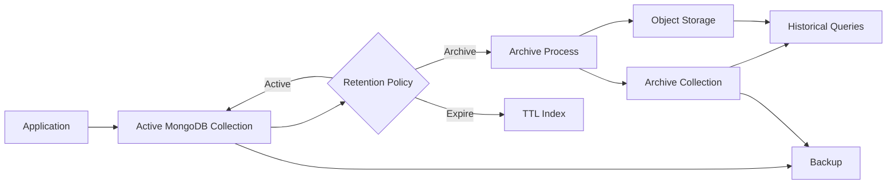
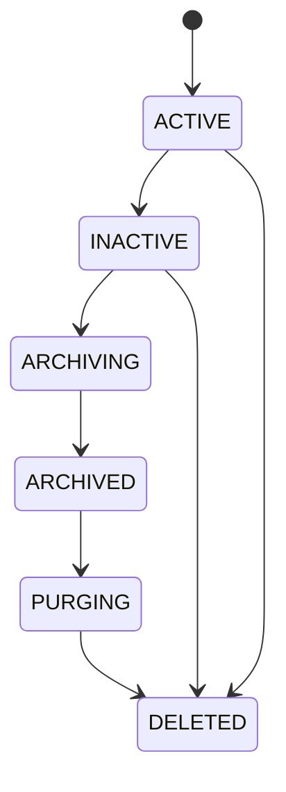
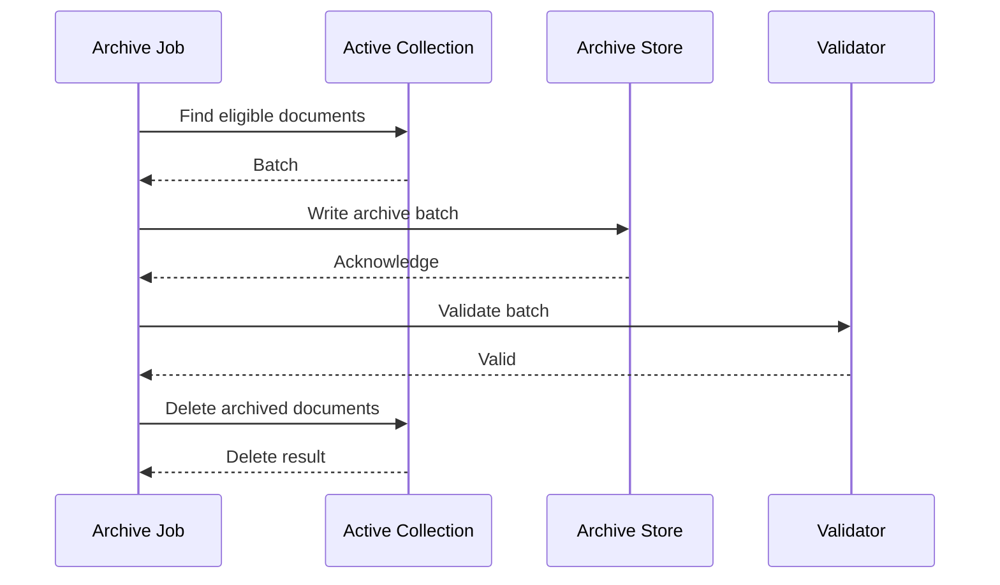
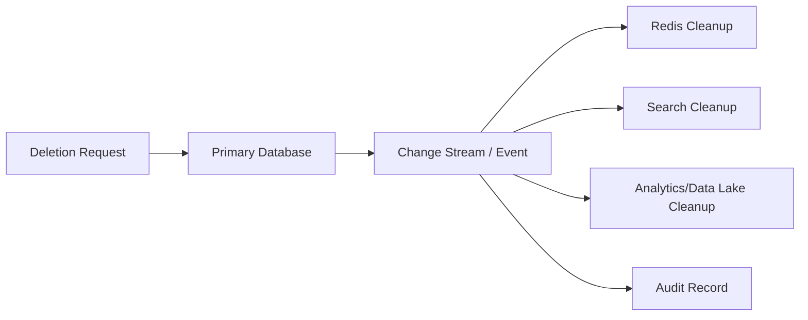

# 08- Data Lifecycle Management

## Overview

MongoDB data lifecycle management defines how data is created, retained, accessed, archived, expired, and ultimately removed.

In production systems, data should not be treated as permanently active unless the business actually requires it. Historical records can become:

- Large
- Rarely accessed
- Expensive to index
- Expensive to back up
- Expensive to replicate
- Subject to retention requirements
- Subject to privacy or deletion requirements

A practical lifecycle is:

```text
Create
  ↓
Active
  ↓
Frequently accessed
  ↓
Less frequently accessed
  ↓
Archive / cold storage
  ↓
Retention expiration
  ↓
Deletion
```

MongoDB provides several mechanisms that can participate in this lifecycle:

| Mechanism | Primary purpose |
|---|---|
| TTL indexes | Automatically expire documents |
| Application jobs | Business-specific lifecycle transitions |
| Aggregation | Identify and transform lifecycle candidates |
| `$merge` | Materialize lifecycle results into another collection |
| `$out` | Replace/create collection from pipeline output |
| Change streams | React to lifecycle events |
| Archival storage | Retain cold data outside the active database |
| Backup/restore | Recover data independently of lifecycle deletion |

The key engineering principle is:

> Retention policy should be a business and operational decision; MongoDB mechanisms should implement that policy safely.

## Data Lifecycle Architecture

A production architecture may separate active and historical data.



The correct architecture depends on access frequency, recovery requirements, compliance requirements, and dataset size.

## Lifecycle Policy Design

Before implementing lifecycle automation, define:

| Question | Example |
|---|---|
| What identifies data age? | `created_at` |
| When does data become inactive? | 90 days |
| Should inactive data be archived? | Yes |
| How long should archived data remain? | 7 years |
| When should active data be deleted? | 2 years |
| Can users request deletion earlier? | Yes |
| Must deletion be auditable? | Yes |
| Can historical data be queried online? | Limited |
| What is the recovery requirement? | 30 days |

Avoid starting with:

```text
"Let's create a TTL index."
```

Start with:

```text
What is the lifecycle policy?
```

Then choose the MongoDB mechanism.

## Lifecycle States

For complex systems, explicit lifecycle states can be useful.



Not every system needs all of these states.

For simple event data:

```text
created_at
+
TTL index
```

may be sufficient.

For regulated or business-critical data, explicit lifecycle state transitions may be safer.

## Timestamp Design

Lifecycle management depends heavily on reliable timestamps.

Prefer storing timestamps as BSON `Date` values rather than strings.

Example:

```javascript
{
    _id: ObjectId("..."),
    created_at: ISODate("2026-09-22T10:00:00Z"),
    updated_at: ISODate("2026-09-22T10:30:00Z")
}
```

Avoid:

```javascript
{
    "created_at": "22-09-2026 10:00:00"
}
```

String timestamps complicate:

- Range queries
- TTL indexes
- Sorting
- Time-zone handling
- Lifecycle automation

## UTC and Time Zones

Store lifecycle timestamps in UTC.

For example:

```text
created_at = 2026-09-22T10:00:00Z
```

Convert to local time only at presentation boundaries.

This prevents lifecycle behavior from becoming dependent on:

- Application server time zones
- Daylight-saving transitions
- Developer workstation configuration
- Regional deployment differences

## Business Time vs Storage Time

A common design mistake is using the wrong timestamp.

For example:

```text
created_at
updated_at
completed_at
last_accessed_at
expires_at
```

These represent different lifecycle concepts.

If orders should be retained for seven years after completion, this is usually more appropriate:

```text
completed_at + retention period
```

rather than:

```text
created_at + retention period
```

The lifecycle clock should match the business rule.

## Explicit Expiration Timestamp

For business-specific expiration, storing an explicit `expires_at` field is often useful.

Example:

```javascript
{
    "_id": ObjectId("..."),
    "session_id": "sess-123",
    "created_at": ISODate("2026-09-22T10:00:00Z"),
    "expires_at": ISODate("2026-09-22T11:00:00Z")
}
```

This allows each document to have a different expiration time.

It is particularly useful for:

- Sessions
- Tokens
- Temporary state
- Invitations
- Verification records
- Cache-like database records

## TTL Indexes

A TTL index allows MongoDB to automatically remove documents after a configured period.

Example:

```javascript
db.sessions.createIndex(
    { "created_at": 1 },
    { expireAfterSeconds: 3600 }
)
```

Documents become eligible for deletion after the configured TTL period.

For a one-hour retention period:

```text
created_at
+
3600 seconds
=
expiration eligibility
```

TTL deletion is performed asynchronously. It should not be treated as an exact-time scheduler.

## TTL with `expireAfterSeconds`

The simplest TTL design is:

```javascript
db.events.createIndex(
    { "created_at": 1 },
    { expireAfterSeconds: 2592000 }
)
```

This represents approximately 30 days.

The lifecycle is:

```text
Document inserted
      ↓
created_at recorded
      ↓
TTL threshold reached
      ↓
Document becomes eligible
      ↓
MongoDB TTL monitor removes it
```

## TTL with `expireAt`

For document-specific expiration times, use a TTL index with:

```javascript
expireAfterSeconds: 0
```

Example:

```javascript
db.tokens.createIndex(
    { "expires_at": 1 },
    { expireAfterSeconds: 0 }
)
```

A document such as:

```javascript
{
    "token": "example",
    "expires_at": ISODate("2026-09-22T12:00:00Z")
}
```

becomes eligible for deletion after `expires_at`.

This is useful when different documents have different expiration times.

## TTL Behavior

TTL expiration is asynchronous.

If a document reaches its expiration timestamp at:

```text
12:00:00
```

do not assume it disappears at exactly:

```text
12:00:00.000
```

There can be a delay due to:

- TTL monitor scheduling
- Database load
- Resource pressure
- Large numbers of expired documents
- Operational conditions

Therefore TTL should not be used as an exact-time security boundary.

For example, do not assume:

```text
expires_at reached
=
document is guaranteed to be physically absent immediately
```

## TTL Use Cases

TTL indexes are well suited to data such as:

| Data | Typical lifecycle |
|---|---|
| Sessions | Minutes/hours |
| Temporary tokens | Minutes |
| Verification codes | Minutes |
| Ephemeral events | Days |
| Application logs | Days/weeks |
| Temporary workflow state | Hours/days |
| Cache-like documents | Minutes/hours |

They are less suitable for complex archival workflows.

## TTL Limitations

TTL indexes do not provide:

- Business workflow orchestration
- Archive transformation
- Approval workflows
- Exact deletion timestamps
- Historical retention reporting
- Multi-step lifecycle processing

For complex lifecycle requirements, use an application or operational workflow.

## TTL and Index Requirements

TTL indexes are indexes and therefore have normal index considerations.

They consume:

- Disk
- Memory
- Write resources
- Maintenance resources

The indexed field must contain appropriate BSON date values for the intended behavior.

Before creating a TTL index, inspect existing indexes:

```javascript
db.sessions.getIndexes()
```

Avoid creating multiple redundant TTL indexes for the same lifecycle field.

## TTL and Arrays

TTL behavior has specific semantics when the indexed field contains arrays of dates. The earliest indexed date can determine expiration eligibility.

Do not use array-based expiration casually.

If a document has:

```javascript
{
    "expires_at": [
        ISODate("2026-09-23T10:00:00Z"),
        ISODate("2026-09-30T10:00:00Z")
    ]
}
```

the lifecycle semantics may not match an intended "expire after all dates" rule.

For predictable lifecycle behavior, prefer a single explicit expiration field.

## TTL and Updates

TTL expiration is based on the indexed expiration value.

If an application updates:

```javascript
expires_at
```

the lifecycle can change accordingly.

This can be useful for:

- Session renewal
- Sliding expiration
- Temporary workflows

But it can also create accidental retention extensions.

Example:

```text
User accesses session
    ↓
Application updates expires_at
    ↓
TTL clock moves forward
```

Document this behavior explicitly.

## Changing a TTL Policy

Retention requirements can change.

For example:

```text
7 days
↓
30 days
```

The index configuration must be changed carefully.

For supported TTL configuration changes, MongoDB provides:

```javascript
collMod
```

For example:

```javascript
db.runCommand({
    collMod: "events",
    index: {
        keyPattern: { created_at: 1 },
        expireAfterSeconds: 2592000
    }
})
```

Always verify the exact MongoDB version and index configuration before modifying production TTL behavior.

## TTL Monitoring

Monitor:

- Number of expired documents
- Collection size
- Storage growth
- TTL deletion behavior
- Database CPU
- Disk utilization
- Application impact

A sudden increase in expiration volume can create additional workload.

For example:

```text
90 days of accumulated temporary data
        ↓
TTL policy corrected
        ↓
Large expiration backlog
        ↓
Increased deletion workload
        ↓
Disk / CPU pressure
```

Retention changes should therefore be capacity-planned.

## Archiving

Archiving means moving data from the active operational store to a lower-cost or less frequently accessed location.

A common architecture is:

```text
Active collection
      ↓
Archive eligibility
      ↓
Copy to archive
      ↓
Validate archive
      ↓
Remove from active collection
```

The critical requirement is:

> Never delete the source before verifying the archive.

## Archive Destinations

Possible destinations include:

| Destination | Use |
|---|---|
| Separate MongoDB collection | Historical queries remain online |
| Separate MongoDB cluster | Isolate historical workload |
| Object storage | Low-cost long-term retention |
| Data lake | Analytics and historical processing |
| Managed archive tier | Provider-specific lifecycle management |

The right destination depends on query requirements.

## Active vs Archive Collections

A simple MongoDB design is:

```text
orders
orders_archive
```

Active collection:

```javascript
{
    "_id": ObjectId("..."),
    "customer_id": "cust-123",
    "status": "completed",
    "completed_at": ISODate("2026-01-01T00:00:00Z")
}
```

Archive collection can contain the same document plus metadata:

```javascript
{
    "_id": ObjectId("..."),
    "customer_id": "cust-123",
    "status": "completed",
    "completed_at": ISODate("2026-01-01T00:00:00Z"),
    "archived_at": ISODate("2026-09-22T00:00:00Z")
}
```

Keeping the same `_id` can simplify traceability.

## Archive Workflow

A production archive process should be idempotent.



The deletion should happen only after successful archive validation.

## Batch Archiving

Do not attempt to archive millions of documents in one massive operation.

Prefer bounded batches:

```text
10,000 documents
    ↓
Archive
    ↓
Validate
    ↓
Delete
    ↓
Next batch
```

Batch size should be benchmarked against:

- Document size
- Network bandwidth
- Storage throughput
- Lock/contention behavior
- Application workload

## Idempotent Archiving

An archive operation may fail after the archive write but before source deletion.

Example:

```text
Write archive
    ↓
Success
    ↓
Process crashes
    ↓
Source not deleted
```

The next execution should safely recognize that the archive copy already exists.

A common strategy is to use the original `_id` as the archive key.

Then:

```javascript
db.orders_archive.updateOne(
    { _id: source._id },
    { $setOnInsert: source },
    { upsert: true }
)
```

This avoids blindly inserting duplicate archive records.

## Archive Verification

Validation can include:

- `_id` exists
- Expected fields exist
- Document count matches batch
- Important business fields match
- Archive metadata exists

For high-value datasets, use stronger reconciliation:

```text
Source batch count
=
Archive batch count
```

and, where practical:

```text
Source identifiers
=
Archive identifiers
```

## Archive Deletion

Only delete source records after successful archive validation.

A safe lifecycle is:

```text
Eligible
   ↓
Archived
   ↓
Validated
   ↓
Source deletion eligible
   ↓
Deleted from active store
```

Avoid:

```text
Find old documents
   ↓
Delete
   ↓
Attempt archive
```

because a failed archive can create irreversible data loss.

## Archiving with Aggregation

Aggregation can identify archive candidates.

Example:

```javascript
db.orders.aggregate([
    {
        $match: {
            status: "completed",
            completed_at: {
                $lt: ISODate("2025-09-22T00:00:00Z")
            }
        }
    },
    {
        $limit: 10000
    }
])
```

An index such as:

```javascript
db.orders.createIndex({
    status: 1,
    completed_at: 1
})
```

may support the candidate-selection query.

Index design should follow the actual archive query shape.

## `$merge` for Lifecycle Workflows

`$merge` can materialize aggregation results into another collection.

Example:

```javascript
db.orders.aggregate([
    {
        $match: {
            status: "completed",
            completed_at: {
                $lt: ISODate("2025-09-22T00:00:00Z")
            }
        }
    },
    {
        $merge: {
            into: "orders_archive",
            on: "_id",
            whenMatched: "keepExisting",
            whenNotMatched: "insert"
        }
    }
])
```

This can simplify archive-copy workflows.

However, `$merge` alone does not prove that the resulting archive is suitable for deletion of the source.

Validation and deletion must remain deliberate.

## `$out` and Lifecycle Workflows

`$out` writes aggregation results to a collection.

It can be useful for controlled rebuilds or transformations, but it is generally not the first choice for incremental archival workflows.

For large production datasets, understand:

- Collection replacement semantics
- Resource consumption
- Index behavior
- Lock/contention implications
- Failure behavior

before using `$out`.

## Lifecycle with Change Streams

Change streams can react to lifecycle events.

For example:

```text
Active collection
      ↓
Change stream
      ↓
Event consumer
      ↓
Archive / audit / downstream processing
```

Change streams are useful when lifecycle actions must integrate with event-driven systems.

Examples:

- Emit archival events
- Update a search system
- Trigger external cleanup
- Synchronize a data lake

Change streams should not replace the retention policy itself.

## Python Lifecycle Worker

A backend service can implement controlled archival with PyMongo.

```python
from datetime import datetime, timedelta, timezone

from pymongo import MongoClient


client = MongoClient(
    "mongodb://localhost:27017/?replicaSet=rs0",
    serverSelectionTimeoutMS=5_000,
)

db = client["orders"]
orders = db["orders"]
archive = db["orders_archive"]

cutoff = datetime.now(timezone.utc) - timedelta(days=365)

cursor = orders.find(
    {
        "status": "completed",
        "completed_at": {"$lt": cutoff},
    },
    batch_size=1_000,
)

for order in cursor:
    archive.update_one(
        {"_id": order["_id"]},
        {
            "$setOnInsert": {
                **order,
                "archived_at": datetime.now(timezone.utc),
            }
        },
        upsert=True,
    )

    orders.delete_one({"_id": order["_id"]})
```

For production use, this pattern should be strengthened with:

- Explicit batch boundaries
- Archive validation
- Retry handling
- Metrics
- Structured logging
- Idempotency
- Controlled concurrency
- Failure recovery

The example demonstrates the lifecycle concept rather than being a complete archival framework.

## Avoiding Delete-after-Insert Risks

The previous pattern contains a subtle failure boundary:

```text
archive write succeeds
        ↓
delete fails
        ↓
duplicate remains in active collection
```

This is generally recoverable because the operation is idempotent.

The more dangerous case is:

```text
delete succeeds
        ↓
archive write fails
```

Therefore:

```text
Archive first
+
Validate
+
Delete second
```

is the safer lifecycle ordering.

## Transactions for Lifecycle Operations

MongoDB transactions can coordinate multiple operations when required.

For example:

```text
Archive document
+
Delete active document
```

could theoretically be performed in a transaction when both operations and the deployment topology support the required transaction semantics.

However, large archival workflows should not place thousands or millions of documents into one transaction.

Prefer:

```text
Small batch
+
Controlled transaction
+
Commit
+
Next batch
```

or an idempotent two-phase application workflow.

## Why Large Lifecycle Transactions Are Dangerous

Large transactions can increase:

- Memory consumption
- Lock duration
- Replication workload
- Oplog usage
- Failure recovery complexity
- Application latency

Lifecycle processing should usually be designed around bounded batches rather than massive transactions.

## Data Deletion

Deletion is irreversible from the active database unless a backup or archive exists.

Deletion mechanisms include:

- TTL indexes
- `deleteOne`
- `deleteMany`
- Archive-and-delete workflows
- Application-level deletion
- Compliance deletion workflows

Choose the mechanism according to the semantics of the data.

## Soft Delete

Soft deletion retains a document while marking it deleted.

Example:

```javascript
{
    "_id": ObjectId("..."),
    "deleted": true,
    "deleted_at": ISODate("2026-09-22T10:00:00Z")
}
```

Advantages:

- Recovery without restore
- Auditability
- Easier debugging
- Reversible business workflows

Limitations:

- Data remains in storage
- Queries must exclude deleted records
- Indexes become more complex
- Privacy requirements may still require physical deletion

Soft delete is not equivalent to data erasure.

## Soft Delete Indexing

If most application queries use:

```javascript
{
    "tenant_id": "tenant-123",
    "deleted": false
}
```

the index should reflect the actual access pattern.

For example:

```javascript
db.orders.createIndex({
    tenant_id: 1,
    deleted: 1,
    created_at: -1
})
```

The correct ordering depends on the complete query shape.

## Partial Index for Active Documents

A partial index can reduce index size when only active records need indexing.

Example:

```javascript
db.orders.createIndex(
    {
        tenant_id: 1,
        created_at: -1
    },
    {
        partialFilterExpression: {
            deleted: false
        }
    }
)
```

This can be useful when deleted or archived records are rarely queried.

## Hard Delete

Hard deletion physically removes documents from the collection's active dataset.

Use it when:

- Retention has expired
- Legal deletion requires it
- Data is temporary
- Business rules require permanent removal

Before implementing hard deletion, establish whether:

- Backups retain the data
- Archives retain the data
- Search indexes retain the data
- Kafka topics retain the data
- Analytics systems retain the data

Deletion must be considered across the complete data ecosystem.

## Distributed Data Deletion

A microservice may have:

```text
MongoDB
+
Redis
+
Kafka
+
Search index
+
Data lake
```

Deleting a MongoDB document does not automatically delete every copy.

A deletion workflow may therefore be:



The architecture must explicitly define which downstream systems must retain or remove the data.

## GDPR and Privacy-Oriented Deletion

Where privacy regulations apply, lifecycle design should distinguish:

```text
Business retention
vs
Privacy deletion
vs
Legal hold
```

A record may be:

```text
Business-retained
```

but still require removal of specific personal data.

Do not assume a TTL index alone satisfies a regulatory deletion requirement.

Regulatory interpretation should be handled with the organization's legal and compliance teams.

## Legal Holds

Some records may need to be retained beyond normal expiration.

This creates a conflict with generic retention automation.

A lifecycle design may use:

```javascript
{
    "retention_until": ISODate("2027-01-01T00:00:00Z"),
    "legal_hold": true
}
```

The archive or deletion process must explicitly account for the hold.

Do not allow a generic cleanup job to bypass legal-hold semantics.

## Retention Metadata

For complex systems, explicit retention metadata can make lifecycle behavior auditable.

Example:

```javascript
{
    "_id": ObjectId("..."),
    "created_at": ISODate("2026-01-01T00:00:00Z"),
    "expires_at": ISODate("2027-01-01T00:00:00Z"),
    "lifecycle_state": "ACTIVE",
    "retention_policy": "ORDER_7Y",
    "legal_hold": false
}
```

This makes the lifecycle decision inspectable.

## Lifecycle State vs Derived State

Avoid storing lifecycle fields that can become inconsistent with timestamps unless the state has independent business meaning.

For example:

```text
expires_at
```

may be sufficient for simple expiration.

Whereas:

```text
lifecycle_state = ARCHIVING
```

can be valuable when the lifecycle is a multi-stage workflow.

Use explicit state when it represents workflow progress, not merely duplicated timestamp information.

## Lifecycle Schema Evolution

Retention policies change.

Examples:

```text
7 days → 30 days
1 year → 3 years
Archive → immediate deletion
```

Store enough metadata to determine which policy applies.

Avoid hard-coding one retention period in multiple services:

```python
RETENTION_DAYS = 365
```

if the policy is expected to evolve.

Prefer centralized configuration or explicit policy identifiers.

## Indexing for Lifecycle Operations

Lifecycle queries often look like:

```javascript
{
    "status": "completed",
    "completed_at": {
        "$lt": cutoff
    }
}
```

A suitable compound index may be:

```javascript
db.orders.createIndex({
    status: 1,
    completed_at: 1
})
```

The actual index should be validated with:

```javascript
db.orders.explain("executionStats").find({
    status: "completed",
    completed_at: {
        $lt: cutoff
    }
})
```

Evaluate:

```text
nReturned
totalKeysExamined
totalDocsExamined
executionTimeMillis
```

Lifecycle jobs are database workloads and must be optimized like user-facing queries.

## Pagination for Lifecycle Jobs

Avoid:

```javascript
skip()
```

for extremely large archival or deletion jobs.

Prefer range-based batching.

Example:

```javascript
db.orders.find({
    completed_at: { $lt: cutoff },
    _id: { $gt: last_id }
}).sort({
    _id: 1
}).limit(1000)
```

The exact pagination key should match the lifecycle query and available indexes.

## Chunking by Time

For very large historical datasets, process data in time windows.

Example:

```text
2024-01-01 → 2024-02-01
2024-02-01 → 2024-03-01
2024-03-01 → 2024-04-01
```

This makes lifecycle processing:

- Predictable
- Restartable
- Observable
- Easier to throttle

## Throttling Lifecycle Jobs

Archival and deletion are background workloads.

Do not allow them to consume all database resources.

Use:

- Batch limits
- Concurrency limits
- Sleep intervals where necessary
- Off-peak scheduling
- Resource monitoring
- Backpressure

A production workflow should prioritize user-facing traffic over background lifecycle processing.

## Lifecycle Jobs and Celery

Celery can schedule lifecycle jobs in Python systems.

Example conceptual schedule:

```text
Celery Beat
    ↓
archive_expired_orders
    ↓
MongoDB batch query
    ↓
Archive
    ↓
Validate
    ↓
Delete
    ↓
Metrics
```

The job should be idempotent because workers can retry after failures.

## Lifecycle Jobs and Kubernetes

Kubernetes CronJobs can execute periodic lifecycle operations.

Example architecture:

```text
CronJob
   ↓
Lifecycle Worker
   ↓
MongoDB
   ↓
Archive Storage
```

Ensure that concurrent executions cannot corrupt lifecycle state.

Use:

- Job concurrency controls
- Distributed locks where necessary
- Idempotent processing
- Bounded batches

## Lifecycle Jobs and Kafka

Kafka can distribute lifecycle events to downstream systems.

For example:

```text
MongoDB
   ↓
Change Stream
   ↓
Kafka
   ↓
Consumers
   ├── Search
   ├── Analytics
   └── Audit
```

Kafka retention is independent from MongoDB retention.

Deleting a MongoDB document does not automatically remove the corresponding Kafka message.

## Lifecycle Monitoring

Monitor:

| Metric | Why |
|---|---|
| Active document count | Dataset growth |
| Archive throughput | Lifecycle capacity |
| Archive backlog | Processing delay |
| Delete throughput | Cleanup rate |
| TTL deletions | Expiration behavior |
| Failed lifecycle jobs | Reliability |
| Archive storage | Cost |
| Lifecycle duration | Capacity planning |
| Oldest unprocessed record | SLA compliance |

A useful operational metric is:

```text
Oldest eligible record
-
Current processing position
```

This indicates lifecycle backlog.

## Lifecycle Backlog

Suppose:

```text
10 million documents are eligible
```

but the lifecycle worker processes:

```text
100,000/day
```

The backlog may become operationally significant.

Monitor:

```text
Eligible records
-
Processed records
```

and ensure processing capacity matches data growth.

## Storage Reclamation

Deleting documents does not necessarily mean the underlying storage immediately shrinks to the same degree.

MongoDB's storage engine manages reusable space internally.

Therefore:

```text
Document deletion
≠
Immediate filesystem shrink
```

Do not schedule destructive operations solely because disk usage is expected to decrease immediately afterward.

Storage behavior should be monitored through MongoDB and infrastructure metrics.

## Large-Scale Deletion

Large `deleteMany()` operations can generate substantial workload.

Potential effects include:

- Replication traffic
- Disk activity
- CPU consumption
- Cache churn
- Oplog growth
- Secondary lag

Prefer controlled batches for large-scale cleanup.

Example conceptual pattern:

```javascript
while (true) {
    const result = db.events.deleteMany({
        created_at: { $lt: cutoff }
    }, {
        limit: 1000
    });

    if (result.deletedCount === 0) {
        break;
    }
}
```

MongoDB command semantics should be checked for the specific deletion API being used; when exact bounded deletion semantics are required, select document identifiers in batches and delete those identifiers explicitly.

## TTL vs Application Cleanup

| Requirement | TTL | Application Job |
|---|---|---|
| Simple time expiration | Excellent | Possible |
| Per-document expiration | Excellent | Possible |
| Archive before deletion | No | Yes |
| Business workflow | No | Yes |
| Legal hold | Limited | Yes |
| Multi-system deletion | No | Yes |
| Complex validation | No | Yes |
| Exact execution time | No | Better control |
| Low operational complexity | High | Lower |

Choose TTL when the lifecycle is genuinely simple.

## TTL vs Archive

TTL:

```text
Expire
↓
Delete
```

Archive:

```text
Expire
↓
Copy
↓
Validate
↓
Retain elsewhere
↓
Delete active copy
```

Do not use TTL when the business requires historical recovery from the active dataset after expiration.

## Common Mistakes

### Using TTL for Regulatory Retention

**Problem:** TTL provides automatic deletion but not complete retention governance.

**Fix:** Model retention, legal hold, archive, audit, and deletion requirements explicitly.

### Deleting Before Archiving

**Problem:** A failed archive can cause irreversible data loss.

**Fix:** Archive, validate, then delete.

### Treating TTL as an Exact Scheduler

**Problem:** TTL deletion is asynchronous.

**Fix:** Use explicit workflow processing when exact timing matters.

### Using Strings for Lifecycle Dates

**Problem:** Sorting, range queries, and TTL behavior become unreliable.

**Fix:** Store timestamps as BSON dates.

### Running Huge Delete Operations

**Problem:** Large deletions can generate substantial replication and storage workload.

**Fix:** Process bounded batches and monitor the database.

### No Idempotency

**Problem:** Worker retries can duplicate archives or corrupt lifecycle state.

**Fix:** Use stable identifiers, upserts, and explicit processing state.

### Ignoring Downstream Copies

**Problem:** MongoDB deletion does not automatically remove data from Redis, Kafka, search systems, or data lakes.

**Fix:** Define the complete distributed data lifecycle.

### Assuming Deletion Reclaims All Storage

**Problem:** Storage engines may reuse deleted space rather than immediately returning it to the operating system.

**Fix:** Monitor actual storage behavior rather than assuming deletion equals filesystem shrinkage.

### Hard-Coding Retention Periods

**Problem:** Policy changes require coordinated code changes.

**Fix:** Centralize lifecycle policy or store explicit policy metadata.

## Production Checklist

### Lifecycle Design

- [ ] Retention policy is documented.
- [ ] Lifecycle timestamps use BSON dates.
- [ ] UTC is used consistently.
- [ ] Business retention and privacy deletion are distinguished.
- [ ] Legal-hold requirements are represented.
- [ ] Lifecycle states are defined where necessary.

### TTL

- [ ] TTL is used only for appropriate data.
- [ ] TTL fields are correctly typed.
- [ ] TTL indexes are monitored.
- [ ] Asynchronous deletion behavior is understood.
- [ ] Retention changes are controlled.

### Archiving

- [ ] Archive destination is independent where appropriate.
- [ ] Archiving is idempotent.
- [ ] Source deletion occurs only after validation.
- [ ] Large datasets are processed in batches.
- [ ] Archive integrity is monitored.

### Performance

- [ ] Lifecycle queries have appropriate indexes.
- [ ] `explain()` has been used for large lifecycle queries.
- [ ] Batch size is controlled.
- [ ] Background jobs are throttled.
- [ ] Replication impact is monitored.
- [ ] Oplog impact is considered.

### Security and Compliance

- [ ] Lifecycle jobs use least-privilege credentials.
- [ ] Sensitive records are handled securely.
- [ ] Deletion requirements are documented.
- [ ] Audit requirements are addressed.
- [ ] Downstream copies are accounted for.
- [ ] Backups are considered when evaluating deletion requirements.

### Operations

- [ ] Lifecycle backlog is monitored.
- [ ] Failed jobs alert operators.
- [ ] Jobs are idempotent.
- [ ] Concurrent executions are controlled.
- [ ] Recovery procedures are documented.
- [ ] Retention changes are tested before production rollout.

## Interview Considerations

### When should you use a TTL index?

Use a TTL index when documents can be automatically removed based primarily on a time-based policy and no complex archive or workflow is required.

Typical examples include:

```text
Sessions
Temporary tokens
Ephemeral events
Temporary workflow state
```

### Why not use TTL for every retention requirement?

TTL provides automatic expiration, but it does not provide:

- Archive workflows
- Business approval
- Legal-hold handling
- Multi-system cleanup
- Exact deletion scheduling
- Recovery workflow management

Complex lifecycle requirements need application or operational orchestration.

### How would you archive millions of MongoDB documents?

Use:

```text
Indexed candidate query
↓
Bounded batches
↓
Idempotent archive write
↓
Validation
↓
Source deletion
↓
Metrics
↓
Repeat
```

Avoid a single massive transaction or unbounded aggregation/deletion.

### How would you prevent archive duplication?

Use a stable identifier such as the original `_id` and an idempotent upsert:

```javascript
db.orders_archive.updateOne(
    { _id: source._id },
    { $setOnInsert: source },
    { upsert: true }
)
```

A retry can then safely encounter an already archived document.

### Does deleting MongoDB data immediately reduce disk usage?

Not necessarily.

MongoDB's storage engine can reuse space internally. Deleting documents and returning storage to the operating system are different concerns.

### How would you design lifecycle management for a microservice?

Start with:

```text
Business retention policy
        ↓
Lifecycle state model
        ↓
Active storage
        ↓
Archive strategy
        ↓
Deletion strategy
        ↓
Downstream data propagation
        ↓
Monitoring
        ↓
Recovery
```

The database mechanism should implement the policy rather than define it.

## Key Takeaways

- **Data lifecycle management starts with explicit retention, archival, deletion, RPO, compliance, and business requirements; MongoDB features implement those policies rather than replacing them.**
- **TTL indexes are ideal for simple time-based expiration, but they are asynchronous and should not be treated as exact schedulers or complete retention-management systems.**
- **Archive before deleting: use bounded, idempotent batches, validate the archived data, and only then remove the active copy.**
- **Lifecycle workloads are real database workloads; index candidate queries, batch large operations, throttle background processing, and monitor replication, storage, CPU, and oplog impact.**
- **A document can exist in MongoDB, Redis, Kafka, search systems, backups, and data lakes simultaneously, so production deletion requires an explicit distributed data-lifecycle strategy.**