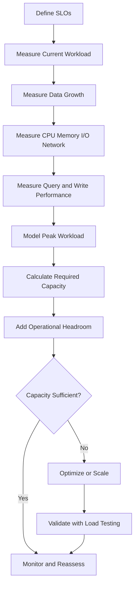
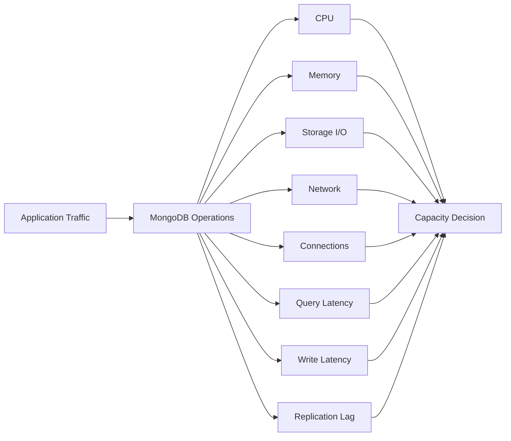

# 09- Capacity Planning

## Overview

MongoDB capacity planning is the process of determining whether the current deployment has enough compute, memory, storage, network, connection, replication, and operational capacity to support current and projected workloads.

Capacity planning is broader than checking disk space.

A MongoDB deployment can run out of effective capacity because of:

- CPU saturation
- Insufficient RAM
- Working-set pressure
- Storage throughput limitations
- Storage capacity exhaustion
- Excessive index growth
- Connection pool pressure
- Replication lag
- Oplog constraints
- Network saturation
- Query inefficiency
- Excessive write amplification
- Large documents
- High aggregation workload
- Sharding imbalance

A useful capacity model is:

```text
Workload
   ↓
Data volume
   ↓
Access patterns
   ↓
Indexes
   ↓
CPU / Memory / Storage / Network
   ↓
Replication overhead
   ↓
Headroom
   ↓
Scaling decision
```

The objective is not to provision the largest possible MongoDB deployment. The objective is to maintain predictable performance and reliability with sufficient operational headroom.

## Capacity Planning Model

A production MongoDB capacity model should consider at least:

| Dimension | Questions |
|---|---|
| Storage | How much data exists today and how fast is it growing? |
| Memory | Does the working set fit comfortably in available memory? |
| CPU | What is the peak query and write processing requirement? |
| I/O | Can storage handle the required read/write throughput and latency? |
| Network | Can replication and application traffic fit within network capacity? |
| Connections | How many application connections can the deployment sustain? |
| Replication | Can secondaries keep up with the primary? |
| Oplog | Is enough replication history retained for operational recovery? |
| Indexes | How large are indexes and how quickly are they growing? |
| Availability | Can the deployment tolerate a node failure while maintaining SLOs? |
| Growth | What happens at 2x, 5x, or 10x current workload? |

## Capacity Planning Workflow

A practical workflow is:



Capacity planning should be continuous rather than a one-time infrastructure exercise.

## Define Workload Characteristics

Before selecting hardware or cluster size, understand the workload.

Important dimensions include:

- Requests per second
- Reads per second
- Writes per second
- Queries per second
- Average document size
- Peak document size
- Documents created per second
- Documents deleted per second
- Index count
- Index size
- Aggregation frequency
- Average query latency
- Peak query latency
- Concurrent connections
- Replication topology
- Data retention period

For example:

```text
Average API traffic:
2,000 requests/sec

Peak traffic:
6,000 requests/sec

MongoDB reads:
4,500/sec

MongoDB writes:
1,000/sec

Average document size:
8 KB

Retention:
2 years
```

These values are more useful for capacity planning than simply saying:

```text
"We have 500 GB of MongoDB data."
```

## Capacity Is a Workload Property

The same dataset can require very different infrastructure depending on the access pattern.

Consider:

```text
Dataset:
500 GB
```

Workload A:

```text
100 reads/sec
20 writes/sec
Highly selective indexed queries
```

Workload B:

```text
20,000 reads/sec
5,000 writes/sec
Large aggregations
Frequent sorting
Large working set
```

The storage requirement is identical, but the compute and I/O requirements are not.

Capacity planning must therefore model both:

```text
Data capacity
+
Workload capacity
```

## Storage Capacity

Storage capacity includes more than raw document size.

A simplified model is:

```text
Required storage
≈
Data
+
Indexes
+
Replication overhead
+
Operational headroom
+
Growth
```

A more practical model is:

```text
Future primary data
+
Future index footprint
+
Node-local replication copy
+
Temporary operational overhead
+
Free-space reserve
```

Do not provision a production database to run at nearly 100% disk utilization.

## Data Growth Rate

Measure data growth over time.

For example:

```text
January     250 GB
February    280 GB
March       315 GB
April       355 GB
```

Approximate monthly growth:

```text
April - January
----------------
      3
```

which is approximately:

```text
35 GB/month
```

A basic projection is:

```text
Future data
=
Current data
+
Growth rate × time
```

Real systems should account for seasonality and workload changes rather than assuming linear growth forever.

## Growth Modeling

Use at least three scenarios:

| Scenario | Assumption |
|---|---|
| Baseline | Expected business growth |
| High growth | Faster-than-expected adoption |
| Stress | Significant traffic/data expansion |

Example:

```text
Current data:        2 TB
Monthly growth:      150 GB

12-month baseline:
2 TB + (150 GB × 12)
≈ 3.8 TB
```

If growth is accelerating, a linear model may understate the requirement.

## Retention and Storage Capacity

Retention policies have a direct impact on capacity.

Suppose:

```text
Incoming data:
100 GB/day

Retention:
90 days
```

Approximate active data:

```text
100 GB × 90
=
9 TB
```

Then account for:

- Indexes
- Replication
- Growth variation
- Operational headroom
- Backup requirements

TTL and archival policies should therefore be part of capacity planning.

## Document Size

MongoDB documents have a maximum BSON document size. Current MongoDB deployments should be designed around the documented limit rather than assuming arbitrarily large documents are supported.

Large documents also increase:

- Network transfer
- Memory pressure
- Cache consumption
- Query latency
- Replication traffic
- Backup volume

A document approaching the BSON size limit is usually an architectural warning rather than merely a storage problem.

## Large Document Capacity

Suppose an API returns:

```json
{
  "customer": "...",
  "transactions": [ ... thousands of entries ... ]
}
```

Embedding every historical transaction can create:

```text
Large document
    ↓
Large reads
    ↓
Large network payloads
    ↓
Higher memory consumption
    ↓
Poor cache efficiency
```

Consider separating high-cardinality historical data into another collection.

## Index Capacity

Indexes can consume substantial storage and memory.

For a collection:

```text
Documents:
1 TB

Indexes:
400 GB
```

the effective storage requirement is not 1 TB.

Indexes also affect write performance because every relevant insert/update may require index maintenance.

Capacity planning should therefore track:

```text
Data size
+
Index size
```

separately.

## Index Growth

Monitor index size over time.

Useful inspection:

```javascript
db.orders.stats()
```

and:

```javascript
db.orders.getIndexes()
```

Index statistics can also help identify indexes that are rarely used.

```javascript
db.orders.aggregate([
    { $indexStats: {} }
])
```

Unused indexes consume capacity without providing meaningful query value.

## Memory Capacity

MongoDB performance is strongly influenced by the working set.

The working set includes the data and indexes that are accessed frequently enough to benefit from memory residency.

The goal is not necessarily:

```text
Entire database fits in RAM
```

but rather:

```text
Frequently accessed data + important indexes
fit comfortably within available memory
```

## Working Set

Consider:

```text
Total dataset:       4 TB
Frequently accessed: 250 GB
Indexes:             100 GB
```

A deployment with sufficient memory for the effective working set can perform well even though the entire dataset is much larger than RAM.

Conversely:

```text
Total dataset:       1 TB
Hot working set:     500 GB
Available memory:    64 GB
```

may experience substantial cache pressure.

## Working Set Pressure

Working-set pressure can cause:

- More disk reads
- Higher query latency
- Increased I/O
- Cache churn
- Lower throughput
- Performance variability

Monitor memory and storage latency together.

High memory pressure alone does not prove MongoDB is unhealthy; the important question is whether memory pressure is translating into application-visible performance degradation.

## Memory and Indexes

Indexes are particularly important because frequently accessed indexes should remain efficiently available.

A query that repeatedly scans a large index while the relevant pages constantly leave memory can experience poor performance even when CPU utilization is moderate.

This is why capacity planning should evaluate:

```text
Working set
+
Index working set
+
Concurrency
```

rather than looking only at total database size.

## CPU Capacity

CPU requirements depend on:

- Query complexity
- Query concurrency
- Aggregation
- Sorting
- Compression
- BSON processing
- Index maintenance
- Write volume
- Replication
- Encryption
- Connection management

A workload with highly selective indexed queries may require less CPU than a workload dominated by large aggregations.

## CPU Saturation

A CPU graph such as:

```text
20% → 35% → 50% → 70% → 90%
```

should not automatically trigger scaling.

Investigate:

- Query latency
- Queueing
- I/O latency
- Connection wait
- Replication lag
- Application latency
- Query shape changes

CPU can be high because MongoDB is efficiently processing a healthy workload.

The key question is:

> Is resource utilization causing an SLO violation or reducing operational headroom?

## Storage I/O Capacity

Storage performance includes:

- Read IOPS
- Write IOPS
- Throughput
- Latency
- Queue depth

A database can have plenty of disk capacity while still being I/O constrained.

For example:

```text
Disk capacity:
4 TB available

Storage latency:
25 ms
```

may be a performance problem even if only 1 TB is used.

## Storage Latency

Storage latency directly influences database latency when required data is not available efficiently in memory.

A simplified flow is:

```text
Application query
      ↓
MongoDB query execution
      ↓
Cache hit?
   ↙       ↘
 Yes        No
 ↓           ↓
Fast       Storage read
             ↓
         Query continues
```

Persistent high storage latency should trigger investigation into:

- Working-set size
- Storage configuration
- Query efficiency
- I/O contention
- Background jobs
- Backup activity

## Network Capacity

MongoDB network usage comes from:

- Application requests
- Query responses
- Writes
- Replication
- Monitoring
- Backup operations
- Administrative operations

Replication can be significant for write-heavy systems.

A simplified model:

```text
Application writes
       ↓
Primary
       ↓
Replication traffic
   ↙       ↘
Secondary Secondary
```

The network must accommodate both application traffic and replication.

## Replication Capacity

A replica set must have enough capacity for secondaries to process the primary's workload.

If:

```text
Primary writes:
20,000 operations/sec

Secondary processing capacity:
15,000 operations/sec
```

replication lag can grow.

The solution may involve:

- Better indexes
- Faster storage
- More CPU
- Query optimization
- Reduced workload
- Better topology
- Scaling the affected node

Simply increasing primary capacity does not solve a secondary bottleneck.

## Replication Lag

Replication lag is a capacity signal.

Conceptually:

```text
Primary operation position
        -
Secondary operation position
=
Replication lag
```

Sustained lag can affect:

- Read-after-write behavior
- Failover readiness
- Majority acknowledgment
- Backup consistency
- Operational recovery

Monitor lag continuously in production.

## Oplog Capacity

The oplog records replication operations.

Capacity planning must ensure that the oplog provides enough history for expected secondary lag and operational scenarios.

The important question is not simply:

```text
"How many GB is the oplog?"
```

but:

```text
"How much time does the oplog represent under the current write workload?"
```

A useful conceptual metric is:

```text
Oplog window
=
Time covered by available oplog history
```

A workload with high write volume can consume the same oplog capacity much faster than a low-write workload.

## Oplog Window

For example:

```text
Oplog window:
72 hours
```

means the available oplog history spans approximately three days under the current workload.

If a secondary requires more time than the available window to recover or catch up, it may require an initial sync depending on the situation.

Capacity planning should therefore monitor the oplog window rather than only its raw size.

## Connection Capacity

MongoDB application capacity is also constrained by connections.

For Python services using PyMongo, each process can maintain its own connection pool.

A deployment with:

```text
20 application pods
```

and:

```text
maxPoolSize = 100
```

can potentially create a much larger aggregate connection footprint than a single application instance.

Conceptually:

```text
Total possible connections
≈
application processes
×
pool size
×
MongoDB server topology
```

The exact footprint depends on the deployment topology and connection behavior.

## Connection Planning

Consider:

```text
8 Kubernetes pods
4 worker processes/pod
maxPoolSize = 50
```

Potential client-side pool capacity can become significant:

```text
8 × 4 × 50
=
1,600
```

This is before considering topology-specific pools and other MongoDB clients.

Do not select pool sizes independently of application concurrency.

## Connection Storms

Scaling an application from:

```text
10 pods
```

to:

```text
100 pods
```

can create a sudden increase in MongoDB connections.

This can cause:

- Connection establishment spikes
- CPU pressure
- Authentication overhead
- Network pressure
- Pool contention

Capacity planning must consider scaling events, not only steady-state traffic.

## Connection Pooling

For PyMongo, reuse a long-lived `MongoClient` within a process.

Avoid:

```python
def get_orders():
    client = MongoClient(MONGODB_URI)
    return client.app.orders
```

for every request.

Prefer application-level lifecycle management:

```python
from pymongo import MongoClient

client = MongoClient(
    MONGODB_URI,
    maxPoolSize=100,
    serverSelectionTimeoutMS=5_000,
)
```

Then reuse the client across requests handled by that process.

## Application Concurrency

MongoDB capacity is closely coupled to application concurrency.

Consider:

```text
FastAPI
  ↓
20 workers
  ↓
Each worker:
50 concurrent database operations
```

This creates a significantly different database workload than:

```text
4 workers
+
10 concurrent operations
```

Capacity planning must model:

```text
Application concurrency
+
Connection pool capacity
+
Database operation latency
```

## Little's Law

A useful engineering relationship is:

```text
Concurrency ≈ Throughput × Latency
```

For example:

```text
Throughput = 2,000 operations/sec
Average MongoDB latency = 10 ms

Concurrency ≈ 2,000 × 0.010
             ≈ 20
```

If latency rises to:

```text
50 ms
```

then:

```text
Concurrency ≈ 2,000 × 0.050
             ≈ 100
```

A latency increase can therefore increase the number of concurrent operations required to maintain the same throughput.

This can create a feedback loop:

```text
Higher latency
    ↓
More concurrency
    ↓
More resource pressure
    ↓
Higher latency
```

## Query Capacity

Capacity planning must distinguish between query shapes.

For example:

```javascript
db.orders.find({
    customer_id: "cust-123"
})
```

is fundamentally different from:

```javascript
db.orders.aggregate([
    { $group: { _id: "$customer_id", total: { $sum: "$amount" } } }
])
```

The second operation can require significantly more CPU, memory, and I/O.

Do not estimate MongoDB capacity from requests per second alone.

## Query Mix

A useful workload model is:

| Operation | Percentage | Cost |
|---|---:|---|
| Point reads | 50% | Low |
| Range reads | 20% | Medium |
| Inserts | 15% | Medium |
| Updates | 10% | Medium |
| Aggregations | 5% | High |

This is more useful than:

```text
10,000 requests/sec
```

without knowing what those requests do.

## Query Performance Before Scaling

Scaling hardware should not compensate for inefficient queries.

A query that performs:

```text
COLLSCAN
```

across hundreds of millions of documents may remain expensive after adding more CPU.

First investigate:

```javascript
db.orders.explain("executionStats").find({
    customer_id: "cust-123"
})
```

Evaluate:

```text
nReturned
totalKeysExamined
totalDocsExamined
executionTimeMillis
```

A capacity problem may actually be a query-design problem.

## Index Capacity

Every index adds:

- Storage usage
- Memory pressure
- Write maintenance
- Build cost
- Backup volume

Therefore:

```text
More indexes
≠
More capacity
```

Poor indexing can reduce overall system capacity.

## Index Build Planning

Large index builds can consume significant resources.

Before building an index on a large production collection, evaluate:

- Collection size
- Index size
- Available storage
- CPU
- Memory
- I/O capacity
- Replication impact
- Deployment method
- Application workload

Index changes should be treated as capacity events.

## Write Capacity

Write capacity depends on:

- Insert rate
- Update rate
- Delete rate
- Document size
- Number of indexes
- Write concern
- Replication topology
- Storage latency
- Transaction usage

For example:

```text
1,000 writes/sec
+
10 indexes
```

can be substantially more expensive than:

```text
1,000 writes/sec
+
2 indexes
```

because each write may require additional index maintenance.

## Write Amplification

A simplified model is:

```text
Logical write
+
Index updates
+
Replication
+
Storage work
=
Physical workload
```

Therefore a workload producing:

```text
1 GB/day logical data
```

may generate substantially more physical I/O.

Do not equate application payload size with storage workload.

## Update Workload

Updates can have different costs.

A small targeted update:

```javascript
db.orders.updateOne(
    { _id: order_id },
    { $set: { status: "completed" } }
)
```

is different from rewriting large documents or modifying indexed fields frequently.

Updates to indexed fields can require index maintenance.

## Hot Documents

A hot document is repeatedly accessed or modified.

Examples:

```text
Account balance
Inventory counter
Global statistics document
Popular product
Shared workflow state
```

Hot documents can create:

- Write contention
- Serialization
- High replication traffic
- Cache pressure

Capacity planning should identify hot-key workloads separately from average workload.

## Hot Collections

A collection can also become hot because most traffic targets a small portion of the dataset.

For example:

```text
1 billion total orders
10 million current orders
```

If almost all requests target current orders, the effective working set is heavily skewed.

This can influence:

- Index design
- Memory requirements
- Archival strategy
- Partitioning
- Sharding

## Aggregation Capacity

Aggregation workloads can consume substantial resources.

Expensive stages include workloads involving:

- Large `$group`
- Large `$sort`
- `$lookup`
- `$unwind`
- Complex expressions
- Large intermediate datasets

Optimize before scaling.

A common pattern is:

```javascript
db.orders.aggregate([
    {
        $match: {
            tenant_id: "tenant-123",
            status: "completed"
        }
    },
    {
        $group: {
            _id: "$customer_id",
            total: { $sum: "$amount" }
        }
    }
])
```

Early filtering can substantially reduce the amount of data processed downstream.

## Capacity and Aggregation Scheduling

Heavy analytics should not necessarily run during peak API traffic.

Consider:

```text
API workload
     +
Analytics workload
     ↓
Shared MongoDB cluster
```

Possible strategies include:

- Scheduling expensive jobs off-peak
- Reducing query scope
- Using dedicated analytics infrastructure
- Using read preferences carefully
- Exporting data to analytical systems
- Caching derived results

Do not route expensive workloads to secondaries without verifying the operational consequences.

## Sharding Capacity

Sharding provides horizontal scaling when a single replica set is no longer appropriate for the workload.

A sharded deployment contains:

```text
Application
    ↓
mongos
    ↓
Shard 1
Shard 2
Shard 3
```

Each shard typically provides its own replica-set architecture.

Sharding introduces additional capacity dimensions:

- Shard key distribution
- Query targeting
- Cross-shard traffic
- Metadata/configuration capacity
- Balancing
- Hot shards
- Scatter-gather queries

## Shard Key and Capacity

A poor shard key can create an apparently scalable cluster with one overloaded shard.

For example:

```text
Shard 1: 80%
Shard 2: 10%
Shard 3: 10%
```

This is not effective horizontal capacity.

Evaluate:

- Cardinality
- Frequency
- Distribution
- Query targeting
- Write distribution
- Monotonicity
- Tenant concentration

## Scatter-Gather Capacity

A query that targets one shard:

```text
mongos
  ↓
Shard 2
```

is generally more efficient than a query that requires:

```text
mongos
  ↓
Shard 1
Shard 2
Shard 3
Shard 4
  ↓
Merge results
```

Capacity planning should therefore include query targeting efficiency.

## Vertical vs Horizontal Scaling

### Vertical scaling

Increase:

- CPU
- RAM
- Storage performance
- Network capacity

Advantages:

- Simpler architecture
- Fewer moving parts
- Easier operations

Limitations:

- Hardware limits
- Larger failure domain
- Cost can increase significantly

### Horizontal scaling

Add:

- Replica members for availability/read distribution
- Shards for data/workload distribution

Advantages:

- Larger aggregate capacity
- Horizontal growth
- Potential workload isolation

Limitations:

- More operational complexity
- Shard-key design
- Cross-shard queries
- More failure scenarios

## Scaling Decision Framework

Use this sequence:

```text
Performance issue
      ↓
Query efficient?
      ↓
Index efficient?
      ↓
Working set adequate?
      ↓
Storage adequate?
      ↓
CPU adequate?
      ↓
Connection capacity adequate?
      ↓
Replication healthy?
      ↓
Scale vertically?
      ↓
Scale horizontally?
```

Scaling should follow diagnosis rather than precede it.

## Capacity Headroom

Do not plan production systems to operate continuously at maximum resource utilization.

Headroom is required for:

- Traffic spikes
- Deployments
- Failover
- Backup operations
- Index builds
- Data migrations
- Rebalancing
- Incident response

A production target should be based on measured workload and SLOs rather than a universal utilization percentage.

## Failure Capacity

High availability changes capacity requirements.

Suppose a replica set has:

```text
Primary
Secondary
Secondary
```

If one node fails, the remaining nodes must still provide acceptable service.

Capacity planning should therefore evaluate:

```text
Normal state
+
One-node failure
+
Recovery state
```

A cluster that is perfectly sized under normal conditions but cannot handle a node failure is under-provisioned for its availability requirement.

## N-1 Capacity

For a three-member replica set:

```text
3 nodes
```

test:

```text
2-node operating condition
```

For a larger topology, define the failure scenario explicitly.

The question is:

> Can the system continue meeting its SLOs after the expected failure event?

## Backup Capacity

Backups consume resources and storage.

Capacity planning should account for:

- Backup storage
- Backup network traffic
- Snapshot overhead
- Logical dump processing
- Restore infrastructure
- Retention periods
- Point-in-time recovery requirements

A backup strategy that works at 500 GB may require redesign at 20 TB.

## Disaster Recovery Capacity

DR capacity depends on:

- RPO
- RTO
- Dataset size
- Restore throughput
- Network bandwidth
- Backup format
- Infrastructure provisioning time

For example:

```text
Dataset:
10 TB

Required RTO:
2 hours
```

implies an average effective recovery throughput of approximately:

```text
10 TB / 2 hours
=
5 TB/hour
```

before accounting for overhead.

If the actual restore system can only process:

```text
1 TB/hour
```

the architecture cannot meet the stated RTO.

## Restore Capacity Testing

Do not estimate recovery capacity theoretically.

Perform actual restore tests.

Measure:

```text
Backup size
Restore duration
Index rebuild duration
Application validation duration
DNS / routing cutover duration
Total recovery time
```

The restore test is part of capacity planning.

## Capacity Monitoring

A production dashboard should include:

### Compute

- CPU utilization
- CPU saturation
- Load
- Query execution time

### Memory

- Resident memory
- Cache behavior
- Working-set indicators
- Memory pressure

### Storage

- Disk utilization
- Disk latency
- IOPS
- Throughput
- Filesystem growth

### Database

- Operations/sec
- Query latency
- Slow queries
- Connections
- Lock/contention indicators
- Collection growth
- Index growth

### Replication

- Replication lag
- Oplog window
- Election activity
- Initial sync activity

### Application

- Requests/sec
- Error rate
- Database latency
- Connection pool wait
- Queue depth

## Capacity Dashboard

A useful dashboard connects infrastructure metrics to application behavior.



Infrastructure metrics without application metrics are often insufficient for capacity decisions.

## Capacity Alerts

Useful alerts include:

| Alert | Why it matters |
|---|---|
| Disk approaching capacity | Prevents storage exhaustion |
| Rapid storage growth | Detects abnormal data growth |
| Sustained query latency | Indicates workload pressure |
| Replication lag | Indicates replica capacity problems |
| Reduced oplog window | Reduces recovery margin |
| Connection pool saturation | Indicates application/database pressure |
| High storage latency | Can increase query latency |
| CPU saturation | May limit throughput |
| Memory pressure | Can increase storage reads |
| Lifecycle backlog | Indicates retention processing capacity issues |

Avoid alerting only on static utilization thresholds.

Combine resource metrics with symptoms.

## Capacity Forecasting

A simple forecast can use:

```text
Current capacity
+
Observed growth rate
+
Peak workload
+
Required headroom
```

For example:

```text
Current data:
3 TB

Growth:
200 GB/month

Projected 12-month data:
3 TB + 2.4 TB
= 5.4 TB
```

Then add:

```text
Indexes
+
Operational headroom
+
Replication topology
+
Expected growth variance
```

## Capacity Forecast Example

Suppose:

```text
Current logical data:     2.5 TB
Monthly growth:           180 GB
Index footprint:          30%
12-month forecast:        4.66 TB logical data
```

Approximate index requirement:

```text
4.66 TB × 0.30
≈ 1.40 TB
```

Approximate data + indexes:

```text
4.66 TB + 1.40 TB
≈ 6.06 TB
```

This is only a planning estimate. Actual index size should be measured because index footprint depends on schema, key sizes, cardinality, multikey behavior, and index design.

## Capacity Testing

Production capacity should be validated through load testing.

Test:

- Normal workload
- Peak workload
- Burst workload
- Read-heavy workload
- Write-heavy workload
- Mixed workload
- Large aggregations
- Failover
- Secondary lag
- Application scaling

Measure:

```text
Throughput
Latency
Error rate
CPU
Memory
I/O
Network
Connections
Replication lag
```

## Performance Regression

Capacity planning should detect changes in workload efficiency.

Example:

```text
January:
5,000 ops/sec at 40% CPU

June:
5,000 ops/sec at 75% CPU
```

Traffic has not increased, but capacity efficiency has deteriorated.

Possible causes include:

- New indexes
- Larger documents
- Changed query patterns
- Poor query plans
- Increased aggregation
- Data distribution changes
- Working-set expansion

Capacity planning should therefore track:

```text
Performance per unit of resource
```

not only absolute resource consumption.

## Capacity Efficiency

Useful ratios include:

```text
Operations/sec per CPU
```

```text
Requests/sec per GB RAM
```

```text
Data growth per month
```

```text
Storage bytes per business event
```

```text
MongoDB operations per API request
```

These metrics make architectural inefficiencies easier to detect.

## MongoDB and Kubernetes

Kubernetes adds another capacity layer.

Consider:

```text
Pod CPU request
Pod CPU limit
Pod memory request
Pod memory limit
Node capacity
MongoDB capacity
```

For application workloads:

```text
More pods
    ↓
More MongoClient instances
    ↓
More connections
    ↓
More MongoDB load
```

Autoscaling the API without accounting for MongoDB capacity can move the bottleneck into the database.

## Autoscaling Considerations

Horizontal Pod Autoscaling should not be configured solely around application CPU.

Monitor:

- Request rate
- Request latency
- Database latency
- Connection pool wait
- MongoDB operations/sec

A useful architecture is:

```text
Traffic spike
    ↓
Application scaling
    ↓
MongoDB workload increase
    ↓
Capacity guardrails
```

Application autoscaling and database capacity planning must be coordinated.

## MongoDB and AWS

For AWS deployments, capacity planning should consider:

- EC2 or managed database sizing
- EBS volume capacity
- EBS throughput
- EBS IOPS
- Network bandwidth
- Instance memory
- Backup storage
- Snapshot retention
- Data transfer
- Availability architecture

Do not select an AWS instance based only on vCPU count.

MongoDB performance depends on the combination of:

```text
CPU
+
Memory
+
Storage
+
Network
+
Workload
```

## Cost Capacity Planning

Capacity planning is also a cost problem.

A larger deployment may provide more:

- CPU
- RAM
- IOPS
- Throughput
- Storage

but increase infrastructure cost.

Evaluate:

```text
Cost
vs
Required SLO
vs
Capacity headroom
```

Avoid optimizing purely for lowest infrastructure cost if the result leaves insufficient operational capacity.

## Cost of Over-Indexing

Suppose an application has:

```text
20 indexes
```

but only:

```text
7
```

are required for production query patterns.

The remaining indexes can create:

- Storage cost
- Memory pressure
- Write overhead
- Backup size
- Index maintenance cost

Index lifecycle management is therefore part of cost capacity planning.

## Capacity Planning for Multi-Tenant Systems

Multi-tenant systems require additional analysis.

Important dimensions include:

- Total tenants
- Documents per tenant
- Requests per tenant
- Largest tenant
- Tenant growth rate
- Query distribution
- Noisy-neighbor behavior

A single large tenant can dominate capacity.

Example:

```text
Tenant A: 50%
Tenant B: 5%
Tenant C: 2%
Remaining tenants: 43%
```

Average tenant metrics would hide the concentration.

Track both:

```text
Global capacity
+
Per-tenant capacity
```

## Noisy Neighbor Risk

In shared MongoDB infrastructure:

```text
Tenant A
    ↓
Heavy aggregation
    ↓
CPU / I/O pressure
    ↓
Tenant B latency increases
```

Mitigation options include:

- Query limits
- Workload isolation
- Separate clusters
- Dedicated analytics infrastructure
- Tenant-aware rate limiting
- Better indexing
- Sharding strategies

Capacity planning should explicitly model the largest tenants.

## Capacity Planning for Background Workers

Celery, Airflow, Kafka consumers, and scheduled jobs can generate substantial MongoDB traffic.

Examples:

```text
Celery workers
     ↓
Bulk updates
     ↓
MongoDB
```

and:

```text
Kafka consumers
     ↓
Event processing
     ↓
MongoDB writes
```

These workloads should be included in capacity calculations.

Do not model only synchronous API traffic.

## Capacity Isolation

If background processing regularly affects user-facing latency, consider:

```text
API workload
+
Background workload
```

using separate infrastructure or controlled scheduling.

Possible strategies include:

- Dedicated MongoDB clusters
- Dedicated read paths
- Off-peak processing
- Queue-based throttling
- Workload-specific indexes
- Analytical data stores

## Common Mistakes

### Planning Only for Disk

**Problem:** The database has sufficient disk but poor latency.

**Cause:** CPU, memory, I/O, or connection capacity was ignored.

**Fix:** Model the full resource profile.

### Assuming More RAM Fixes Everything

**Problem:** Memory is increased without addressing inefficient queries.

**Cause:** Query or index design was not investigated.

**Fix:** Use `explain()` and workload analysis before scaling.

### Ignoring Index Growth

**Problem:** Data size appears manageable but indexes consume substantial capacity.

**Fix:** Track data and index growth separately.

### Ignoring Replication Capacity

**Problem:** Primary performance is acceptable while secondaries fall behind.

**Fix:** Measure replication lag and secondary processing capacity.

### Ignoring Application Scaling

**Problem:** Kubernetes scales API pods and unexpectedly overwhelms MongoDB connections.

**Fix:** Model aggregate connection and operation capacity.

### Planning for Average Traffic

**Problem:** The system performs well during normal traffic but fails during bursts.

**Fix:** Include peak and burst workloads.

### No N-1 Testing

**Problem:** A node failure causes unacceptable performance.

**Fix:** Test capacity with expected failure scenarios.

### Treating Hardware Utilization as the SLO

**Problem:** Engineers optimize for CPU percentage rather than application behavior.

**Fix:** Correlate resource utilization with latency, throughput, and error rate.

### Ignoring Background Workloads

**Problem:** Scheduled jobs consume database capacity during API peaks.

**Fix:** Include Celery, Airflow, Kafka consumers, migrations, backups, and lifecycle jobs in the workload model.

### No Restore Capacity Test

**Problem:** Backups exist but recovery exceeds the required RTO.

**Fix:** Perform regular restore tests and measure actual recovery time.

## Troubleshooting Capacity Problems

Use a structured process:

```text
Symptom
↓
Possible causes
↓
Isolation strategy
↓
Diagnostic commands
↓
Root cause
↓
Corrective action
↓
Prevention
```

### High Query Latency

```text
Symptom
↓
Queries are slower than baseline
↓
Possible causes:
- Poor query plan
- Missing index
- Working-set pressure
- Storage latency
- CPU saturation
- Connection contention
↓
Isolation:
- Inspect explain()
- Check CPU/memory/I/O
- Check connection pool wait
- Compare query shape
↓
Corrective action:
- Optimize query/index
- Increase capacity if required
- Reduce workload
↓
Prevention:
- Performance regression tests
- Query monitoring
- Capacity forecasting
```

### Disk Capacity Growth

```text
Symptom
↓
Storage utilization is increasing rapidly
↓
Possible causes:
- Increased data ingestion
- Large documents
- Index growth
- Retention failure
- Backup/local artifact growth
↓
Isolation:
- Check collection statistics
- Check index sizes
- Check data lifecycle
- Compare historical growth
↓
Corrective action:
- Fix retention
- Archive historical data
- Remove unnecessary indexes
- Expand storage
↓
Prevention:
- Storage forecasting
- Growth alerts
- Lifecycle monitoring
```

### Replication Lag

```text
Symptom
↓
Secondary falls behind primary
↓
Possible causes:
- High write rate
- Slow secondary storage
- CPU saturation
- Network limitations
- Large operations
↓
Isolation:
- Check replication status
- Check secondary resources
- Inspect workload
- Measure storage latency
↓
Corrective action:
- Optimize workload
- Increase secondary capacity
- Reduce burst workload
↓
Prevention:
- Monitor oplog window
- Load test failure scenarios
- Capacity-test secondaries
```

### Connection Pressure

```text
Symptom
↓
Requests wait for database connections
↓
Possible causes:
- Too many application processes
- Pool too small
- Pool too large
- Slow queries
- Application connection leaks
↓
Isolation:
- Inspect application pool metrics
- Inspect MongoDB connections
- Measure query latency
↓
Corrective action:
- Tune pool settings
- Reduce application concurrency
- Fix slow operations
↓
Prevention:
- Capacity model based on pod/process count
- Connection monitoring
- Load testing
```

## Capacity Review Cadence

Capacity reviews should occur:

- Before major launches
- Before significant schema changes
- Before traffic campaigns
- Before retention-policy changes
- Before scaling application fleets
- After major query changes
- After index changes
- After architecture changes
- On a regular operational cadence

A capacity review should answer:

```text
What changed?
What is growing?
What is becoming a bottleneck?
How much headroom remains?
What happens under failure?
When must we scale?
```

## Capacity Planning Checklist

### Workload

- [ ] Read rate is measured.
- [ ] Write rate is measured.
- [ ] Peak traffic is measured.
- [ ] Query mix is understood.
- [ ] Aggregation workload is included.
- [ ] Background workloads are included.
- [ ] Tenant concentration is understood where applicable.

### Storage

- [ ] Current data size is known.
- [ ] Index size is known.
- [ ] Growth rate is measured.
- [ ] Retention policy is included.
- [ ] Large-document growth is monitored.
- [ ] Storage performance is measured.
- [ ] Future capacity is forecast.

### Memory

- [ ] Working set is understood.
- [ ] Important indexes are identified.
- [ ] Memory pressure is monitored.
- [ ] Cache behavior is understood.

### Compute

- [ ] CPU utilization is monitored.
- [ ] CPU saturation is distinguished from normal utilization.
- [ ] Query complexity is included.
- [ ] Aggregation workload is measured.

### Replication

- [ ] Replica-set topology is documented.
- [ ] Secondary capacity is validated.
- [ ] Replication lag is monitored.
- [ ] Oplog window is monitored.
- [ ] N-1 capacity is tested.

### Connections

- [ ] Application process count is known.
- [ ] Connection pool configuration is known.
- [ ] Aggregate connection capacity is modeled.
- [ ] Autoscaling impact is understood.

### Reliability

- [ ] Peak workload has been load-tested.
- [ ] Failover has been tested.
- [ ] Backup/restore capacity has been tested.
- [ ] RPO and RTO are measurable.
- [ ] Operational headroom is maintained.

## Interview Considerations

### What factors determine MongoDB capacity?

A senior-level answer should include:

```text
Workload
+
Data volume
+
Indexes
+
Working set
+
CPU
+
Storage I/O
+
Network
+
Connections
+
Replication
+
Peak traffic
+
Failure scenarios
```

### Is disk size enough to determine MongoDB capacity?

No.

A deployment can have sufficient disk capacity but insufficient:

- CPU
- RAM
- Storage throughput
- Network
- Connection capacity
- Replication capacity

### How do you know when to scale MongoDB?

Start with the observed bottleneck.

```text
Measure
↓
Identify bottleneck
↓
Optimize workload
↓
Validate
↓
Scale if required
↓
Load test
```

Do not automatically scale vertically whenever utilization increases.

### Why does working set matter?

Frequently accessed data and indexes benefit from memory residency. If the working set repeatedly exceeds effective cache capacity, storage reads and cache churn can increase latency.

### Why is replication capacity part of capacity planning?

Because a replica set is not only an availability mechanism. Secondaries must process replicated operations. A primary can remain healthy while a secondary becomes unable to keep up.

### Why is N-1 capacity important?

A highly available deployment must be evaluated under the failure condition it is designed to tolerate. If losing one node causes unacceptable performance, normal-state capacity is insufficient for the stated availability requirement.

### How does Kubernetes autoscaling affect MongoDB capacity?

Scaling application pods can increase:

- MongoDB connections
- Concurrent queries
- Write throughput
- Network traffic

Application autoscaling must therefore be modeled together with database capacity.

### How would you plan capacity for a growing MongoDB deployment?

Use:

```text
Current measurements
+
Historical growth
+
Peak workload
+
Query/index analysis
+
Working-set analysis
+
Replication requirements
+
Failure scenarios
+
RPO/RTO
+
Operational headroom
```

Then validate the model with load and restore testing.

## Key Takeaways

- **MongoDB capacity planning must model workload, data growth, indexes, memory, CPU, storage I/O, network, connections, replication, and failure scenarios rather than disk size alone.**
- **Working-set behavior and index footprint are critical because a database can be much larger than RAM while still performing well if frequently accessed data and indexes remain efficiently cached.**
- **Capacity must include peak traffic, background workloads, application autoscaling, replication overhead, and N-1 failure conditions; normal-state utilization is not sufficient.**
- **Optimize inefficient queries and indexes before scaling infrastructure, then validate scaling decisions with realistic load tests and production performance measurements.**
- **Capacity planning is continuous: track growth, SLOs, resource efficiency, replication health, storage forecasts, connection pressure, and recovery capacity as the system evolves.**