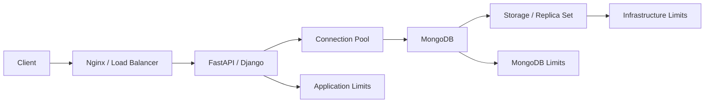
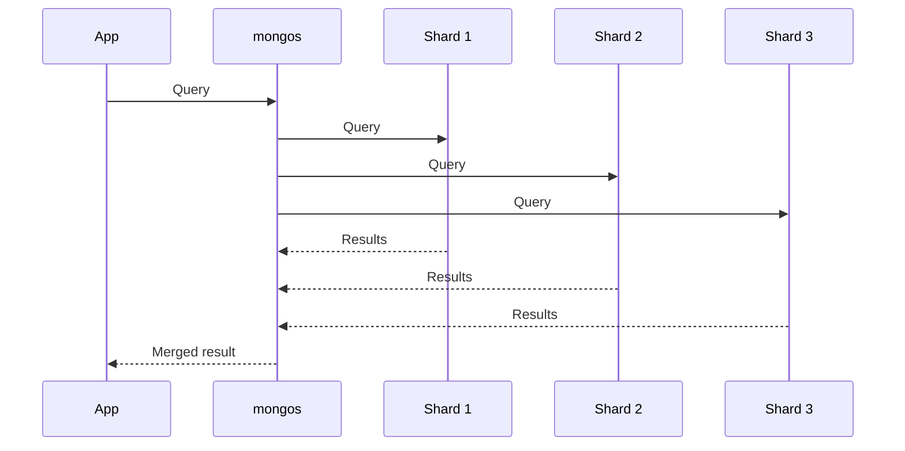
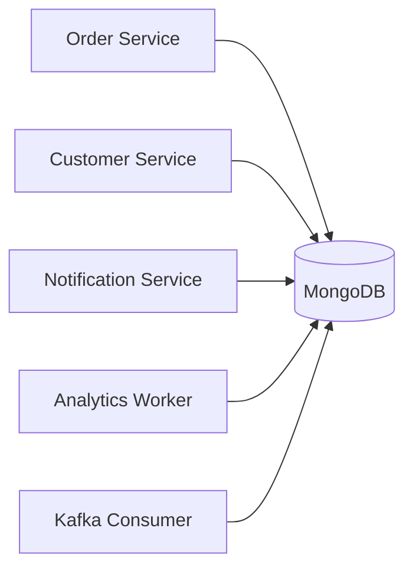

# 10- Service Limits and Quotas

## Overview

MongoDB deployments are constrained by more than CPU, memory, storage, and network capacity. MongoDB itself, the operating environment, managed services such as MongoDB Atlas, and connected infrastructure all impose limits and quotas that can affect application behavior.

A service limit is a boundary on what a system can support or accept. A quota is typically an enforced allocation or usage boundary associated with an account, project, deployment, or resource.

Examples include:

- Maximum BSON document size
- Namespace and collection constraints
- Index constraints
- Connection capacity
- Replica-set topology constraints
- Sharding constraints
- Transaction limits
- Aggregation memory behavior
- Oplog capacity
- Atlas project and cluster limits
- Cloud infrastructure quotas
- Storage and network limits

Limits are important because exceeding them can produce:

- Deployment failures
- Query failures
- Write failures
- Connection failures
- Performance degradation
- Replication problems
- Scaling blockers
- Unexpected cloud costs
- Operational incidents

A senior engineer treats limits as architectural constraints rather than discovering them during production incidents.

## Limits vs Quotas vs Capacity

These concepts are related but different.

| Concept | Meaning | Example |
|---|---|---|
| Limit | A technical boundary | Maximum BSON document size |
| Quota | An allocated or account-level usage boundary | Cloud service quota |
| Capacity | Practical workload the deployment can sustain | 20,000 writes/sec |
| SLO | Required service behavior | p99 latency below 100 ms |
| Headroom | Unused capacity reserved for variation | Capacity reserved for traffic spikes |

A system can be below a hard MongoDB limit while still being operationally overloaded.

For example:

```text
MongoDB document limit:
Not reached

CPU:
95%

Storage latency:
High

Replication lag:
Increasing

Application p99:
500 ms
```

The system is constrained by capacity even though no MongoDB hard limit has been reached.

## Why Limits Matter in Architecture

A typical backend request path looks like:



An application can therefore encounter limits at multiple layers.

Examples:

```text
HTTP request
    ↓
Application concurrency limit
    ↓
MongoDB connection pool
    ↓
MongoDB server
    ↓
Replica-set topology
    ↓
Storage
    ↓
Cloud infrastructure
```

Capacity planning should account for the entire chain.

## MongoDB Hard Limits

MongoDB has documented technical limits that should influence schema and architecture decisions.

Some important categories include:

- BSON document size
- Database and collection naming constraints
- Namespace constraints
- Index constraints
- Transaction constraints
- Aggregation constraints
- Replica-set topology constraints
- Sharding constraints

These limits are version-dependent in some cases, so production architecture should always validate the limits against the MongoDB version actually being deployed.

## BSON Document Size

MongoDB has a maximum BSON document size of **16 MiB**.

This applies to the complete BSON document, including fields and nested structures.

For example:

```json
{
  "_id": "...",
  "customer": "...",
  "transactions": [
    "... potentially thousands of entries ..."
  ]
}
```

A document that grows indefinitely is an architectural risk.

### Why It Matters

Large documents increase:

- Network transfer
- Memory consumption
- Cache pressure
- Replication traffic
- Backup volume
- Serialization cost
- Query latency

### Production Recommendation

Do not design a document so that it approaches the maximum merely because the current implementation fits.

Prefer bounded document growth.

Instead of:

```text
customer
└── all historical transactions
```

consider:

```text
customers
transactions
```

with a reference such as:

```json
{
  "customer_id": "cust-123",
  "amount": 150.00
}
```

## Document Growth Limits

Even documents far below 16 MiB can become problematic.

For example:

```text
Initial document: 20 KB
After 1 year:     2 MB
After 5 years:    10 MB
```

The document has not violated the BSON limit, but its growth may already be causing:

- Larger updates
- More network traffic
- Higher replication cost
- Worse cache efficiency
- Slower reads

Capacity planning must consider document growth rate, not only current size.

## Collection and Namespace Considerations

MongoDB deployments have limits and constraints around:

- Collection names
- Database names
- Namespace lengths
- Number of collections
- Number of indexes
- Number of databases

The practical constraint is often operational rather than a single hard limit.

For example, creating thousands of collections can create:

- Metadata overhead
- More indexes to manage
- More monitoring complexity
- More backup objects
- More deployment complexity

Avoid modeling every customer or request as a separate collection unless the architecture has a specific reason to do so.

Prefer:

```text
orders
users
events
```

over:

```text
customer_001_orders
customer_002_orders
customer_003_orders
...
```

when a shared collection with a tenant key is appropriate.

## Index Limits

Indexes consume resources and are subject to MongoDB's documented index constraints.

Important practical considerations include:

- Number of indexes per collection
- Compound index key constraints
- Index key size
- Multikey behavior
- Index storage footprint
- Index build cost

More indexes do not automatically improve performance.

Each index can increase:

```text
Storage
+
Memory pressure
+
Write cost
+
Backup size
+
Operational complexity
```

## Index Key Size

MongoDB imposes limits on index key sizes.

This matters when indexing:

- Large strings
- Large arrays
- Large embedded structures
- Unbounded user-generated values

A common design mistake is indexing fields simply because they are available without considering their size and cardinality.

Prefer indexes built around actual query patterns.

## Multikey Index Considerations

Indexes involving arrays can become multikey indexes.

For example:

```json
{
  "tags": [
    "python",
    "mongodb",
    "backend"
  ]
}
```

An index on `tags` is multikey.

Large arrays can increase index complexity and storage consumption.

Unbounded arrays are therefore dangerous from both document-growth and index-growth perspectives.

## Transactions and Limits

MongoDB transactions introduce additional constraints and resource considerations.

Transactions should generally be:

- Short-lived
- Small in scope
- Focused on related writes
- Carefully indexed
- Designed to minimize contention

Avoid treating MongoDB transactions as a mechanism for wrapping arbitrary long-running business workflows.

Bad pattern:

```text
Start transaction
    ↓
Call external API
    ↓
Wait for response
    ↓
Process large dataset
    ↓
Publish Kafka message
    ↓
Commit
```

A transaction should not remain open while waiting on external systems.

Prefer:

```text
Validate
↓
Perform database transaction
↓
Commit
↓
Publish/process downstream event
```

using an appropriate event/outbox architecture when atomic database-to-event behavior is required.

## Transaction Resource Considerations

Long transactions can consume resources and increase contention.

Potential consequences include:

- Lock/contention pressure
- Larger transactional state
- Increased latency
- Higher failure probability
- Replication impact

Transactions should therefore be included in workload and capacity testing.

## Aggregation Resource Limits

Aggregation pipelines can consume substantial CPU and memory.

Expensive operations include:

- `$group`
- `$sort`
- `$lookup`
- `$unwind`
- Large `$facet`
- Large intermediate result sets

A pipeline such as:

```javascript
db.orders.aggregate([
    { $sort: { created_at: -1 } },
    { $group: { _id: "$customer_id", total: { $sum: "$amount" } } }
])
```

may process far more data than necessary.

Prefer early filtering:

```javascript
db.orders.aggregate([
    {
        $match: {
            status: "completed",
            created_at: {
                $gte: ISODate("2026-01-01")
            }
        }
    },
    {
        $group: {
            _id: "$customer_id",
            total: { $sum: "$amount" }
        }
    }
])
```

## Aggregation Memory

Some aggregation operations have memory considerations and may spill to disk depending on the operation and configuration.

Do not assume that:

```text
allowDiskUse
```

turns an inefficient aggregation into an inexpensive operation.

Disk spilling can prevent memory exhaustion but may significantly increase I/O and latency.

The correct sequence is:

```text
Reduce input
↓
Use appropriate indexes
↓
Optimize pipeline
↓
Reduce intermediate data
↓
Use disk spilling only when appropriate
```

## Connection Limits

Connection limits exist at several layers:

```text
Application
    ↓
Process
    ↓
MongoClient
    ↓
Connection pool
    ↓
MongoDB
```

A Python service using PyMongo should normally reuse a long-lived `MongoClient` within each process.

For example:

```python
from pymongo import MongoClient

client = MongoClient(
    MONGODB_URI,
    maxPoolSize=100,
    serverSelectionTimeoutMS=5_000,
)
```

Creating a client for every request can cause unnecessary connection churn.

## Application-Level Connection Multiplication

Suppose:

```text
Kubernetes pods:       20
Processes per pod:      4
maxPoolSize:           50
```

A rough client-side pool capacity is:

```text
20 × 4 × 50
=
4,000
```

Actual MongoDB connections depend on topology and driver behavior, but the example demonstrates why application scaling can create a large database connection footprint.

The database must be sized for the aggregate workload.

## Connection Pool Limits

Important PyMongo settings include:

| Setting | Purpose |
|---|---|
| `maxPoolSize` | Maximum concurrent connections in a pool |
| `minPoolSize` | Minimum pool connections maintained |
| `maxConnecting` | Limits concurrent connection establishment |
| `waitQueueTimeoutMS` | Limits time waiting for a pool connection |
| `serverSelectionTimeoutMS` | Limits server selection time |
| `connectTimeoutMS` | Limits connection establishment |
| `socketTimeoutMS` | Limits socket operations |

Do not increase `maxPoolSize` automatically when requests become slow.

If slow queries are the actual bottleneck, increasing the pool can simply create more concurrent pressure.

## Connection Storms

A deployment can encounter a connection storm during:

- Kubernetes scale-out
- Application restart
- Deployment
- Failover
- Network recovery
- Node replacement

For example:

```text
10 pods
   ↓
Deployment
   ↓
100 pods restart
   ↓
Hundreds/thousands of clients initialize
   ↓
MongoDB connection spike
```

Mitigations include:

- Controlled rollout
- Connection pooling
- Appropriate `maxConnecting`
- Startup jitter where appropriate
- Sensible application autoscaling
- Capacity testing

## Replica Set Topology Constraints

Replica sets have architectural constraints around:

- Voting members
- Elections
- Priority
- Hidden members
- Delayed members
- Arbiters
- Initial sync
- Majority acknowledgment

A replica set should be designed around failure domains rather than simply adding members.

For example:

```text
Availability Zone A
    Primary

Availability Zone B
    Secondary

Availability Zone C
    Secondary
```

provides a different failure profile from placing all members on one host or failure domain.

## Voting Members

Replica-set voting configuration affects election behavior and majority calculations.

Adding members indiscriminately can make quorum behavior harder to reason about.

For production deployments:

- Understand voting-member configuration.
- Distribute members across failure domains.
- Validate election behavior.
- Avoid treating arbiters as substitutes for data-bearing members.

## Arbiters

Arbiters participate in elections but do not store data.

They may solve specific voting-topology problems, but they do not provide:

- Additional data redundancy
- Read capacity
- Backup capacity
- Disaster recovery capacity

For production high availability, data-bearing members are generally preferable when infrastructure permits.

## Oplog Constraints

The oplog is a finite replication history.

A critical operational metric is the oplog window:

```text
Current oplog timestamp
-
Oldest retained oplog timestamp
=
Available replication history
```

The window depends on write workload.

High write rates can consume the same oplog storage much faster.

Monitor the window rather than only the oplog size.

## Secondary Lag

Secondary lag can become an operational limit.

```text
Primary
   ↓
High write rate
   ↓
Secondary processing
   ↓
Secondary falls behind
```

Potential causes include:

- CPU saturation
- Storage latency
- Network problems
- Large writes
- Inefficient workload
- Insufficient secondary capacity

A secondary that cannot keep up may eventually require resynchronization.

## Sharding Constraints

Sharded clusters introduce additional architectural limits.

Important areas include:

- Shard-key design
- Shard-key cardinality
- Query targeting
- Chunk distribution
- Balancing
- Hot shards
- Cross-shard queries
- Resharding requirements

A sharded cluster is not automatically horizontally scalable if the workload is poorly distributed.

## Shard-Key Cardinality

A useful shard key should generally provide enough distinct values to distribute data and operations effectively.

Example:

```text
country
```

may have low cardinality.

A key such as:

```text
tenant_id
```

may have sufficient cardinality but still produce hotspots if one tenant dominates traffic.

A compound shard key may be more appropriate depending on access patterns and distribution requirements.

## Monotonically Increasing Keys

Keys that increase monotonically can create write concentration in ranged sharding configurations.

For example:

```text
2026-09-22T10:00
2026-09-22T10:01
2026-09-22T10:02
...
```

can concentrate new writes toward a portion of the key range.

Shard-key selection must consider both:

```text
Distribution
+
Query targeting
```

## Scatter-Gather Constraints

A query that cannot target specific shards may become a scatter-gather operation:



This can increase:

- Network traffic
- CPU
- Latency
- Coordination overhead

Shard-key-aware query design is therefore essential.

## Atlas Limits and Quotas

MongoDB Atlas introduces service-level constraints in addition to MongoDB's database-engine limits.

Depending on the Atlas service, plan, region, and deployment configuration, limits may apply to areas such as:

- Projects
- Clusters
- Database deployments
- Users
- API keys
- Network access configuration
- IP access lists
- Private networking
- Search resources
- Backup resources
- Data transfer
- Storage
- Compute tiers
- Monitoring
- Automation operations

Atlas limits can change as the service evolves.

For production planning, consult the current Atlas documentation and quota information for the specific project, plan, region, and deployment type rather than hard-coding historical values into engineering documentation.

## Atlas Quota Management

Treat Atlas quotas similarly to cloud-provider quotas.

Before a major migration or scale-out:

```text
Identify required resources
        ↓
Check current usage
        ↓
Check service quota
        ↓
Estimate future usage
        ↓
Request quota increase if supported
        ↓
Validate deployment plan
```

Do not wait until deployment automation fails.

## Cloud Infrastructure Quotas

Self-managed MongoDB deployments can also be limited by the underlying cloud platform.

Examples include:

- EC2 instance quotas
- EBS volume limits
- EBS throughput
- EBS IOPS
- Network bandwidth
- Elastic IP limits
- Snapshot capacity
- Availability Zone capacity
- Load-balancer quotas
- Kubernetes node capacity

MongoDB capacity planning must therefore include the infrastructure provider.

## Kubernetes Limits

For MongoDB applications running on Kubernetes, distinguish between:

```text
Pod limits
Node limits
Cluster limits
MongoDB limits
```

For example:

```yaml
resources:
  requests:
    cpu: "500m"
    memory: "1Gi"
  limits:
    cpu: "2"
    memory: "4Gi"
```

A container limit can become a bottleneck even when the MongoDB deployment itself has capacity.

For database workloads, memory limits deserve particular attention because memory pressure can cause instability before application-level metrics clearly identify the problem.

## File Descriptor Limits

MongoDB and operating-system processes rely on file descriptors for:

- Network sockets
- Data files
- Logs
- Other resources

A low operating-system file descriptor limit can become a practical constraint.

On Linux:

```bash
ulimit -n
```

For systemd-managed services, inspect the service configuration and effective limits rather than relying only on the interactive shell's value.

## Operating-System Limits

Self-managed MongoDB deployments should review:

- Open files
- Process/thread limits
- Virtual memory behavior
- Disk scheduler characteristics
- Filesystem configuration
- Network settings
- Container resource limits

OS-level tuning should be based on the MongoDB version and deployment environment.

Avoid blindly copying tuning values from unrelated production environments.

## Backup and Restore Limits

Backup systems introduce their own constraints.

Consider:

```text
Backup size
+
Backup frequency
+
Retention
+
Network bandwidth
+
Storage capacity
+
Restore throughput
```

For example:

```text
Database:
8 TB

Backup retention:
30 days
```

The backup storage requirement can become much larger than the active database depending on backup architecture and retention policy.

## RPO and RTO Constraints

A backup system must satisfy the required recovery objectives.

### RPO

Maximum acceptable data loss.

```text
RPO = 15 minutes
```

means the recovery architecture should limit recoverable data loss to the required window.

### RTO

Maximum acceptable recovery duration.

```text
RTO = 2 hours
```

means the service should be restored within the defined target.

A backup architecture that technically succeeds but violates RTO is operationally insufficient.

## Rate Limits in Applications

MongoDB itself may not be the only source of limits.

Backend services can impose:

- API rate limits
- Worker concurrency limits
- Kafka consumer limits
- Celery concurrency
- Redis connection limits
- HTTP connection limits

Example:

```text
Client
  ↓
API rate limiter
  ↓
FastAPI
  ↓
MongoDB connection pool
  ↓
MongoDB
```

Rate limiting can protect MongoDB by preventing application traffic from exceeding database capacity.

## Backpressure

When MongoDB reaches a practical capacity boundary, applications should apply backpressure.

For example:

```text
MongoDB latency increases
        ↓
Worker queue grows
        ↓
Consumer concurrency increases
        ↓
MongoDB pressure increases
```

Without backpressure, the system can enter a positive feedback loop.

Better:

```text
MongoDB pressure
        ↓
Reduce consumer concurrency
        ↓
Queue grows temporarily
        ↓
Database recovers
        ↓
Consumers gradually increase
```

This pattern is especially relevant to Celery and Kafka consumers.

## Service Limits and Microservices

In a microservice architecture, multiple services may share the same MongoDB deployment.

For example:



One service can consume disproportionate database capacity.

Track:

- Requests by service
- Operations by service
- Connections by service
- Slow queries by service
- Write volume by service

Service-level attribution makes shared capacity problems easier to diagnose.

## Query Limits and Timeouts

Application-level timeouts are essential protection.

Example PyMongo configuration:

```python
from pymongo import MongoClient

client = MongoClient(
    MONGODB_URI,
    serverSelectionTimeoutMS=5_000,
    connectTimeoutMS=2_000,
    socketTimeoutMS=10_000,
    waitQueueTimeoutMS=2_000,
)
```

The exact values should be derived from the application's latency budget.

Avoid using arbitrarily large timeouts because they allow overloaded requests to remain active longer and consume resources.

## Timeout Hierarchy

A useful request path is:

```text
HTTP timeout
    >
Application operation timeout
    >
Connection selection timeout
    >
Socket timeout
```

The exact hierarchy depends on implementation, but the principle is that downstream database operations should not remain active indefinitely.

Timeouts should be consistent with:

- API SLOs
- Retry policies
- Queue visibility timeouts
- Circuit breakers

## Retry Amplification

Retries can turn a capacity problem into a larger capacity problem.

For example:

```text
MongoDB latency increases
        ↓
Request times out
        ↓
Client retries
        ↓
Additional MongoDB operation
        ↓
More load
        ↓
Latency increases further
```

This is retry amplification.

Use:

- Bounded retries
- Exponential backoff
- Jitter
- Idempotent operations
- Appropriate timeout budgets

Do not retry every database error indiscriminately.

## Security and Limits

Security controls can also affect capacity.

Examples:

- TLS encryption
- Authentication
- Authorization
- Auditing
- Encryption at rest
- Network inspection
- Secret-management systems

Security overhead should be included in performance testing.

Never disable security controls simply because they add measurable overhead.

Instead:

```text
Enable production security
↓
Measure performance
↓
Size infrastructure accordingly
```

## Monitoring Service Limits

Track both current usage and distance to important limits.

A useful dashboard can contain:

| Metric | Current | Forecast | Limit | Headroom |
|---|---:|---:|---:|---:|
| Storage | 2.1 TB | 3.8 TB | Deployment limit | Measured |
| Connections | 2,000 | 3,500 | Deployment capacity | Measured |
| Collections | 450 | 700 | Documented constraint | Measured |
| Indexes | 18 | 24 | Documented constraint | Measured |
| Oplog window | 48 h | 30 h | Operational target | 30 h |
| CPU | 55% | 75% | Capacity dependent | Measured |

The exact limit values should be populated from the current deployment and current MongoDB/provider documentation.

## Limit Monitoring Strategy

For each important constraint, maintain:

```text
Current usage
+
Growth rate
+
Known limit
+
Remaining headroom
+
Expected exhaustion date
```

Example:

```text
Storage:
2 TB currently

Growth:
150 GB/month

Capacity:
4 TB usable planning limit

Remaining:
2 TB

Approximate exhaustion:
~13 months
```

This turns monitoring into proactive capacity management.

## Service-Limit Runbook

When approaching a limit:

```text
Detect
↓
Confirm actual limit
↓
Determine whether it is hard or configurable
↓
Measure growth rate
↓
Identify workload causing growth
↓
Optimize or reduce usage
↓
Request quota increase if applicable
↓
Scale infrastructure if necessary
↓
Load test
↓
Document new operating threshold
```

## Production Best Practices

### Maintain a Limit Register

Keep a documented inventory of important limits:

| Area | Limit Type | Monitoring | Owner |
|---|---|---|---|
| BSON | Hard technical limit | Schema review | Backend |
| Indexes | Technical/resource | Index inventory | Database |
| Connections | Capacity | Connection metrics | Platform |
| Oplog | Operational | Oplog window | Database |
| Storage | Capacity | Disk metrics | Platform |
| Atlas | Service quota | Atlas monitoring | Platform |
| Cloud | Provider quota | Cloud console/API | Platform |
| Kubernetes | Resource quota | Cluster metrics | Platform |

### Validate Limits During Design

Review limits before:

- New collection design
- New index strategy
- Large migrations
- Data-retention changes
- Traffic launches
- Sharding
- Replica-set expansion
- Kubernetes scaling
- Atlas expansion

### Keep Limits Version-Aware

Do not permanently embed version-sensitive limits into generic documentation.

Instead:

```text
MongoDB version
+
Deployment type
+
Provider
+
Current documentation
```

should determine the authoritative value.

### Load Test Near Boundaries

Test:

```text
70% expected peak
90% expected peak
100% expected peak
Burst above peak
Failure scenario
Recovery scenario
```

The goal is to understand degradation behavior before production reaches the boundary.

## Common Mistakes

### Treating Every Limit as a Hard Limit

**Problem:** Engineers assume every documented boundary is absolute.

**Cause:** Technical limits, quotas, and practical capacity are mixed together.

**Fix:** Classify each constraint as:

```text
Hard limit
Configurable limit
Provider quota
Operational threshold
Performance capacity
```

### Using Historical Quota Values

**Problem:** Documentation contains outdated Atlas or cloud quota values.

**Cause:** Service limits change.

**Fix:** Link operational procedures to current provider documentation and verify quotas before major changes.

### Increasing Connection Pools Indefinitely

**Problem:** More connections are added whenever latency rises.

**Cause:** Connection pressure is mistaken for query capacity.

**Fix:** Determine whether the bottleneck is pool wait, query execution, CPU, I/O, or storage.

### Ignoring Application Multiplication

**Problem:** A connection pool looks reasonable for one process but becomes excessive across many pods.

**Fix:** Calculate aggregate application connection capacity.

### Ignoring Oplog Window

**Problem:** Oplog size looks adequate, but high write volume dramatically reduces its time coverage.

**Fix:** Monitor time-based oplog window.

### Designing Around the BSON Maximum

**Problem:** Documents are allowed to grow close to the maximum size.

**Fix:** Design bounded documents and control array growth.

### Assuming Sharding Removes All Limits

**Problem:** A sharded cluster still experiences hot shards.

**Cause:** Poor shard-key distribution or query targeting.

**Fix:** Evaluate shard-key cardinality, frequency, distribution, and query patterns.

### Using Timeouts Without Retry Design

**Problem:** Requests time out and immediately retry.

**Fix:** Combine bounded timeouts with controlled, idempotent retry policies.

### Ignoring Failure-State Capacity

**Problem:** Normal-state capacity is sufficient but failover causes severe degradation.

**Fix:** Include N-1 and recovery scenarios in capacity testing.

## Troubleshooting Limit Problems

### Document Too Large

```text
Symptom
↓
Insert/update rejected
↓
Possible causes
- Unbounded array
- Excessive embedded data
- Large payload
↓
Isolation strategy
- Measure BSON size
- Inspect document growth
- Identify largest fields
↓
Root cause
- Unbounded document design
↓
Corrective action
- Reference high-cardinality data
- Split large documents
- Enforce application validation
↓
Prevention
- Schema design review
- Document-size monitoring
- Growth tests
```

### Connection Limit Reached

```text
Symptom
↓
Requests wait for or fail to obtain MongoDB connections
↓
Possible causes
- Too many application processes
- Pool configured too large
- Slow queries
- Connection leaks
- Deployment scale-out
↓
Isolation strategy
- Inspect MongoDB connections
- Inspect application pool metrics
- Measure query latency
↓
Root cause
- Aggregate connection demand exceeds capacity
↓
Corrective action
- Tune pool size
- Reduce concurrency
- Optimize slow queries
- Scale MongoDB if justified
↓
Prevention
- Connection-capacity model
- Autoscaling guardrails
- Load testing
```

### Atlas or Cloud Quota Exhaustion

```text
Symptom
↓
Infrastructure operation cannot create or scale resource
↓
Possible causes
- Account/project quota
- Regional quota
- Resource quota
- Provider-specific limit
↓
Isolation strategy
- Inspect provider quota
- Compare current usage with requested capacity
↓
Root cause
- Requested resource exceeds available quota
↓
Corrective action
- Request quota increase
- Use another supported topology/region
- Reduce resource consumption
↓
Prevention
- Quota inventory
- Pre-launch quota validation
- Growth forecasting
```

### Aggregation Resource Pressure

```text
Symptom
↓
Aggregation becomes slow or resource-intensive
↓
Possible causes
- Large input
- Expensive $group/$sort
- Poor filtering
- Inefficient $lookup
↓
Isolation strategy
- Inspect explain output
- Measure input cardinality
- Review pipeline ordering
↓
Root cause
- Excessive intermediate workload
↓
Corrective action
- Filter earlier
- Improve indexes
- Reduce intermediate data
- Restructure workload
↓
Prevention
- Query performance tests
- Aggregation monitoring
- Resource-aware design
```

## Interview Considerations

### What is the difference between a MongoDB limit and capacity?

A limit is a defined technical or service boundary. Capacity is the workload a deployment can practically sustain while meeting its SLOs.

For example:

```text
MongoDB document maximum:
Hard technical limit

CPU at 90% with p99 latency rising:
Practical capacity boundary
```

### What MongoDB limits should a backend engineer know?

Important categories include:

- BSON document size
- Index constraints
- Collection and namespace constraints
- Transaction constraints
- Aggregation resource behavior
- Replica-set topology constraints
- Oplog behavior
- Sharding constraints
- Connection capacity

The exact numerical values of version- or provider-dependent limits should be verified against current documentation.

### Why is the oplog window more useful than just oplog size?

Because the operational question is:

```text
How long can a secondary be behind and still catch up?
```

A fixed oplog size can represent very different amounts of time depending on write volume.

### Why can increasing `maxPoolSize` make an incident worse?

More connections allow more concurrent operations. If MongoDB is already CPU- or I/O-bound, increasing concurrency can increase contention and latency rather than improving throughput.

### Why does Kubernetes scaling affect MongoDB limits?

Every additional application process can create additional connections and database operations.

Therefore:

```text
Application autoscaling
```

can become:

```text
MongoDB connection and workload scaling
```

without any explicit database configuration change.

### Does sharding remove MongoDB capacity constraints?

No.

Sharding distributes data and workload, but introduces additional constraints around shard-key distribution, query targeting, balancing, cross-shard operations, and operational complexity.

### How should service limits be managed in production?

Maintain a limit register containing:

```text
Limit
Current usage
Growth rate
Remaining headroom
Owner
Monitoring
Mitigation
```

Review it during architecture changes and capacity reviews.

## Key Takeaways

- **Treat MongoDB limits, provider quotas, and practical capacity as different constraints; each requires different monitoring and remediation strategies.**
- **Design around hard MongoDB constraints such as BSON document size, index behavior, transaction characteristics, replica-set topology, and sharding requirements instead of discovering them during production failures.**
- **Model aggregate connection, workload, replication, storage, and infrastructure limits across application processes, Kubernetes, MongoDB, Atlas, and the underlying cloud provider.**
- **Monitor distance to important limits, not just current utilization; use growth rates, workload forecasts, and failure scenarios to identify future exhaustion before it becomes an incident.**
- **Keep service-limit documentation version- and provider-aware, and validate important quotas and limits against current MongoDB and infrastructure documentation before production changes.**