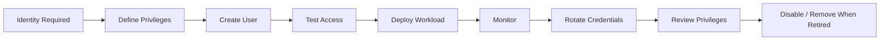
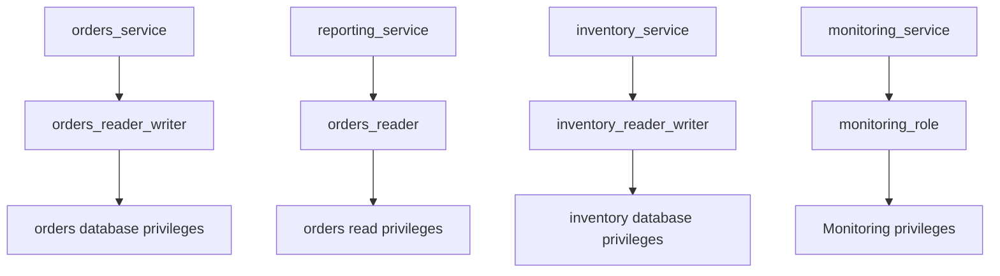
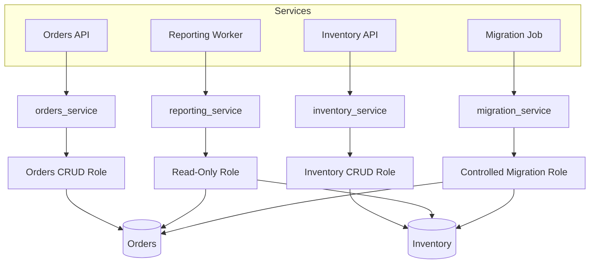

# 03- Users and Roles

## Overview

MongoDB users and roles form the authorization layer around authenticated identities. Authentication establishes who a client is; roles determine what that identity can do.

A production security model should therefore follow:

```text
Client
  ↓
Network Access
  ↓
TLS
  ↓
Authentication
  ↓
User Identity
  ↓
Roles
  ↓
Privileges
  ↓
Database / Collection Operation
```

MongoDB authorization should be designed around **least privilege**, workload boundaries, and operational responsibilities.

A backend service should generally have only the permissions required to perform its intended operations. An application that reads and writes the `orders` database should not automatically receive cluster-wide administrative privileges.

---

## Users

A MongoDB user is an identity that can authenticate to MongoDB and receive privileges through assigned roles.

A user typically has:

- username
- authentication database
- authentication credentials or certificate identity
- assigned roles
- optional custom-role relationships

Conceptually:

```text
User
 ├── Identity
 ├── Authentication configuration
 └── Roles
       └── Privileges
             ├── Actions
             └── Resources
```

The user is the identity boundary; roles define the permissions associated with that identity.

---

## User and Role Separation

MongoDB authorization is easier to operate when identities and permissions are separated.

Instead of creating many users with independently managed privileges:

```text
orders-service
    ├── read orders
    ├── insert orders
    └── update orders

inventory-service
    ├── read inventory
    └── update inventory
```

define appropriate roles and assign them to the corresponding users.

```text
Role
  ↓
Privileges

User
  ↓
Assigned Role
  ↓
Privileges
```

This makes permission changes easier to review and audit.

---

## Built-In Roles

MongoDB provides built-in roles for common authorization requirements.

Examples include:

| Role | General Purpose |
|---|---|
| `read` | Read data from a database |
| `readWrite` | Read and modify data in a database |
| `dbAdmin` | Database administration tasks |
| `userAdmin` | Manage users and roles within a database |
| `clusterMonitor` | Monitoring-oriented cluster access |
| `backup` | Backup-related operations |
| `restore` | Restore-related operations |
| `root` | Broad administrative privileges |

Built-in roles are convenient, but their scope must be reviewed before assigning them to production workloads.

A role name such as `readWrite` should not be interpreted as universally safe. The important question is:

> On which database and resources does this role apply?

---

## Database-Scoped Roles

A role can be assigned against a particular database.

For example:

```javascript
db.createUser({
  user: "orders_service",
  pwd: passwordPrompt(),
  roles: [
    {
      role: "readWrite",
      db: "orders"
    }
  ]
})
```

The resulting identity is intended to operate on the `orders` database rather than receiving unrestricted access to every database.

This is generally preferable to broad cluster-wide permissions for an application service.

---

## Authentication Database vs Authorization Scope

These concepts are related but distinct.

For example:

```text
User:
    orders_service

Authentication database:
    admin

Authorization:
    readWrite on orders
```

A connection could therefore contain:

```text
?authSource=admin
```

while the application operates against:

```text
orders
```

The authentication database determines where the identity is authenticated; the assigned roles determine what the identity can access.

---

## Creating an Application User

A typical service-specific user can be created with:

```javascript
use admin

db.createUser({
  user: "orders_service",
  pwd: passwordPrompt(),
  roles: [
    {
      role: "readWrite",
      db: "orders"
    }
  ]
})
```

The exact role should be reviewed against the application's actual access patterns.

For a production workload, a custom role may provide tighter control than a broad built-in role.

---

## Inspecting Users

To inspect users for the current database:

```javascript
db.getUsers()
```

To inspect a specific user:

```javascript
db.getUser("orders_service")
```

For operational investigation, avoid unnecessarily exposing credential-related information in command output or logs.

---

## User Lifecycle

Production users should have a controlled lifecycle:



User lifecycle management should be part of normal infrastructure operations rather than an ad hoc database task.

---

## Service-Specific Users

A microservice architecture should generally avoid a single shared MongoDB identity.

Prefer:

```text
orders-api
    ↓
orders_service

inventory-api
    ↓
inventory_service

reporting-worker
    ↓
reporting_service
```

This provides:

- clearer auditability
- smaller blast radius
- independent credential rotation
- clearer ownership
- simpler incident investigation

---

## Role Assignment

Roles can be assigned when creating a user:

```javascript
db.createUser({
  user: "reporting_service",
  pwd: passwordPrompt(),
  roles: [
    {
      role: "read",
      db: "orders"
    }
  ]
})
```

A reporting service that only reads data should not receive `readWrite` merely because it is easier to configure.

---

## Multiple Roles

A user can have multiple roles where required.

```javascript
db.createUser({
  user: "analytics_service",
  pwd: passwordPrompt(),
  roles: [
    {
      role: "read",
      db: "orders"
    },
    {
      role: "read",
      db: "inventory"
    }
  ]
})
```

This can be useful for services that legitimately consume multiple databases.

However, each additional role expands the service's authorization surface.

---

## Role Inheritance

Roles can inherit other roles.

Conceptually:

```text
Base Role
   ↓
Inherited Role
   ↓
User
```

This allows reusable permission structures.

For example:

```text
orders_reader
    ↓
analytics_reader
    ↓
analytics_service
```

Inheritance should be used carefully. Deep or complicated role hierarchies can make effective permissions difficult to understand.

Prefer simple role structures that can be reviewed quickly.

---

## Privileges

A privilege consists conceptually of:

```text
Privilege
 ├── Resource
 └── Action
```

The resource identifies what the permission applies to.

The action identifies what the identity can do.

Examples of actions include operations related to:

- reading data
- inserting data
- updating data
- removing data
- creating indexes
- inspecting statistics
- managing users
- administering databases

The important distinction is:

```text
What can the user do?
        +
Where can the user do it?
```

---

## Resources

Authorization should be scoped to the smallest practical resource.

A broad permission:

```text
all databases
```

has a significantly larger blast radius than:

```text
orders.orders
```

The exact resource model depends on the operation and MongoDB role definition.

Senior engineers should therefore evaluate both:

- action scope
- resource scope

when reviewing a role.

---

## Custom Roles

Custom roles are appropriate when built-in roles are too broad for a production workload.

A custom role can define:

- specific privileges
- resource boundaries
- inherited roles

Example:

```javascript
use admin

db.createRole({
  role: "orders_service_role",
  privileges: [
    {
      resource: {
        db: "orders",
        collection: "orders"
      },
      actions: [
        "find",
        "insert",
        "update"
      ]
    }
  ],
  roles: []
})
```

The exact action set should be derived from actual application behavior.

---

## Why Custom Roles Matter

Consider a service that needs:

```text
orders.orders
    find
    insert
    update
```

but does not need:

```text
delete
dropCollection
createUser
grantRole
shutdown
```

A narrowly defined custom role can express that boundary more accurately than a highly privileged built-in role.

This is particularly useful for:

- sensitive workloads
- multi-service environments
- regulated systems
- production data access
- administrative separation

---

## Updating a Custom Role

Roles can evolve as application requirements change.

A change should follow:

```text
Application requirement
        ↓
Privilege analysis
        ↓
Role change
        ↓
Security review
        ↓
Testing
        ↓
Deployment
        ↓
Monitoring
```

Avoid adding permissions simply because an operation failed.

First determine:

```text
Why does the application need this action?
```

---

## Removing Roles

Roles can be removed from users when no longer required.

```javascript
db.revokeRolesFromUser(
  "orders_service",
  [
    {
      role: "readWrite",
      db: "orders"
    }
  ]
)
```

Privilege removal is useful during:

- service retirement
- incident response
- access reviews
- architecture changes
- credential rotation
- migration cleanup

---

## Granting Roles

Roles can be granted to an existing user:

```javascript
db.grantRolesToUser(
  "orders_service",
  [
    {
      role: "read",
      db: "inventory"
    }
  ]
)
```

Permission changes should be reviewed just like application code changes.

A production authorization change can affect application availability and data security simultaneously.

---

## Modifying Users

User properties can be changed with MongoDB user-management commands.

For example:

```javascript
db.updateUser("orders_service", {
  roles: [
    {
      role: "readWrite",
      db: "orders"
    }
  ]
})
```

When changing users in production, prefer explicit role management and controlled change procedures rather than repeatedly replacing complete user configuration without reviewing existing permissions.

---

## Least Privilege

Least privilege means granting only the permissions required for the workload.

A useful decision process is:

```text
Application operation
       ↓
Required MongoDB action
       ↓
Required resource
       ↓
Required role
       ↓
User assignment
```

For example:

```text
GET /orders/{id}
    ↓
find
    ↓
orders.orders
    ↓
orders_reader
    ↓
orders_service
```

This is more defensible than starting with:

```text
root
```

and removing permissions later.

---

## Least-Privilege Design Example

Suppose an order API needs:

```text
Create order
Read order
Update order
```

It does not need:

```text
Delete collection
Create users
Manage roles
Read unrelated databases
```

A custom role might therefore contain only the relevant data operations on the required collection.

---

## Read-Only Services

Reporting and analytics services often require read-only access.

```javascript
db.createUser({
  user: "reporting_service",
  pwd: passwordPrompt(),
  roles: [
    {
      role: "read",
      db: "orders"
    }
  ]
})
```

Read-only identities are useful because accidental writes are blocked at the database authorization layer rather than relying entirely on application behavior.

---

## Administrative Users

Administrative users should be separated from application identities.

```text
Application
    ↓
orders_service
    ↓
Limited data access

DB Administrator
    ↓
Administrative identity
    ↓
Database management
```

Never use an administrative account simply because it makes application configuration easier.

---

## `root` Role

The `root` role provides extremely broad privileges.

It should be reserved for controlled administrative operations.

Do not configure:

```text
FastAPI → root
Django → root
Celery → root
```

A production service with `root` access effectively has database-wide administrative authority.

That dramatically increases the impact of:

- application vulnerabilities
- leaked credentials
- compromised containers
- SSRF-style credential exposure
- insider mistakes

---

## Built-In Role Selection

A practical selection model is:

| Workload | Typical Starting Point | Review |
|---|---|---|
| Read-only application | `read` | Scope database |
| CRUD application | `readWrite` | Consider custom role |
| Monitoring | `clusterMonitor` | Verify monitoring requirements |
| Backup | `backup` | Keep separate from application |
| Restore | `restore` | Restrict operational access |
| Database administration | `dbAdmin` | Highly controlled |
| User management | `userAdmin` | Highly controlled |
| Full administration | `root` | Emergency / administrative use |

These are starting points, not automatic recommendations. Effective permissions must be reviewed against the actual workload.

---

## User and Role Architecture



This model separates:

```text
Identity
    ↓
Role
    ↓
Privilege
    ↓
Resource
```

That separation is valuable for both security and operations.

---

## Roles for Microservices

Consider three services:

```text
Order Service
Inventory Service
Reporting Service
```

A suitable authorization boundary might be:

| Service | MongoDB Identity | Access |
|---|---|---|
| Order | `orders_service` | Orders read/write |
| Inventory | `inventory_service` | Inventory read/write |
| Reporting | `reporting_service` | Orders/inventory read-only |

Avoid allowing every service to access every database.

---

## Cross-Database Access

Some services legitimately require multiple databases.

For example:

```text
analytics_service
    ├── orders: read
    ├── inventory: read
    └── customers: read
```

Grant only the required access.

Do not convert cross-database requirements into:

```text
readWriteAnyDatabase
```

unless the workload genuinely requires that level of access.

---

## Cross-Collection Access

A custom role can restrict access to specific collections where appropriate.

Conceptually:

```text
orders_service
    ├── orders.orders
    │      ├── find
    │      ├── insert
    │      └── update
    │
    └── orders.audit_events
           └── insert
```

This is useful when an application should write audit events but should not modify historical audit records.

---

## Audit Data Protection

Audit collections often deserve stricter permissions than normal application collections.

For example:

```text
Application
    └── INSERT audit event

Auditor
    └── READ audit event

Application
    X UPDATE audit event
    X DELETE audit event
```

This separation helps preserve audit integrity.

---

## Role Design for Background Workers

A worker may require different privileges from the API.

Example:

```text
orders-api
    ├── orders: read
    ├── orders: insert
    └── orders: update

orders-worker
    ├── orders: read
    └── orders: update
```

Do not automatically copy API roles into Celery workers.

Evaluate worker behavior independently.

---

## Role Design for Migrations

Migrations and data backfills may need elevated privileges.

Use a separate operational identity:

```text
migration_service
    ↓
Temporary elevated privileges
    ↓
Migration
    ↓
Validation
    ↓
Privileges reduced / identity retired
```

This prevents a normal application process from inheriting migration-level access.

---

## Role Design for CI/CD

CI/CD systems should not normally use production database administrator credentials.

A deployment pipeline may need:

```text
Application deployment
    ↓
Deploy application
    ↓
No direct production database access
```

If a migration must run:

```text
CI/CD
    ↓
Controlled migration identity
    ↓
Specific migration operation
```

Prefer narrowly scoped credentials and explicit approval for production database changes.

---

## Role Design and Secrets

Roles determine **what** an identity can do.

Secret management determines **who can obtain the credential**.

These are separate controls:

```text
AWS IAM / Kubernetes RBAC
        ↓
Can retrieve MongoDB secret?

MongoDB User + Role
        ↓
Can perform which database actions?
```

Strong MongoDB authorization cannot compensate for unrestricted access to the underlying credential.

---

## Credential Compromise Scenario

Suppose:

```text
orders_service
    ↓
readWrite orders only
```

is compromised.

The attacker may be constrained to that authorization boundary.

If instead:

```text
orders_service
    ↓
root
```

is compromised, the attacker may gain broad database control.

Least privilege therefore limits the blast radius of credential compromise.

---

## Role Inheritance Design

Simple inheritance can reduce duplication:

```text
orders_read
     ↓
orders_reporting
     ↓
reporting_service
```

However, avoid excessively deep role graphs.

A senior engineer should be able to answer:

> What can this production user do?

without traversing a large hierarchy manually.

---

## Authorization Review

Perform periodic reviews of:

- active users
- unused users
- assigned roles
- custom roles
- role inheritance
- database scope
- collection scope
- administrative privileges
- temporary permissions
- service ownership

A useful review output is:

```text
Identity
    ↓
Role
    ↓
Resource
    ↓
Actions
    ↓
Business justification
```

---

## User Deprovisioning

When a service is retired:

```text
Stop workload
    ↓
Confirm no active consumers
    ↓
Remove credentials from secret stores
    ↓
Revoke / remove MongoDB user
    ↓
Remove associated custom roles if unused
    ↓
Verify authentication failures are expected
```

Do not leave unused production identities indefinitely.

---

## Temporary Access

Temporary elevated access should have:

- explicit justification
- defined scope
- defined owner
- expiration process
- auditability

Example:

```text
Incident
   ↓
Temporary admin access
   ↓
Operational fix
   ↓
Verification
   ↓
Privilege removal
```

Permanent elevated privileges are often created because temporary access was never cleaned up.

---

## Python Application Example

A Python service should authenticate using its dedicated identity:

```python
from pymongo import MongoClient

client = MongoClient(
    MONGODB_URI,
    serverSelectionTimeoutMS=5_000,
    connectTimeoutMS=5_000,
    socketTimeoutMS=10_000,
)

orders = client["orders"]["orders"]
```

The application should not need to know or manage role definitions at runtime.

Authorization policy belongs in database administration and infrastructure configuration.

---

## Application-Level Authorization vs MongoDB Roles

MongoDB roles and application authorization solve different problems.

```text
MongoDB Role
    ↓
Can this service modify orders?

Application Authorization
    ↓
Can this authenticated user modify this particular order?
```

For example:

```python
query = {
    "_id": order_id,
    "tenant_id": authenticated_tenant_id,
}
```

MongoDB may authorize the service to execute the query, while the application ensures that the query is scoped to the correct tenant.

---

## Multi-Tenant Systems

A service identity may have:

```text
readWrite orders
```

but that does not automatically enforce:

```text
tenant A cannot access tenant B
```

Tenant isolation is normally implemented through:

- application authorization
- tenant-aware queries
- data-model constraints
- service boundaries
- optionally separate databases or collections depending on architecture

MongoDB roles should not be treated as a replacement for application-level tenant authorization.

---

## Security Boundaries

A mature architecture may use multiple boundaries:

```text
Internet
   ↓
API Gateway / Nginx
   ↓
Application Authentication
   ↓
Application Authorization
   ↓
Service Identity
   ↓
MongoDB Authentication
   ↓
MongoDB Authorization
   ↓
Document / Collection
```

Each layer addresses a different threat.

---

## Monitoring Users and Roles

Monitor for:

- new users
- deleted users
- role changes
- unexpected privilege changes
- administrative operations
- authentication failures
- unusual access patterns

Authorization changes should be treated as security-sensitive infrastructure changes.

---

## Production Change Management

A role change should ideally follow:

```text
Requirement
    ↓
Privilege analysis
    ↓
Role design
    ↓
Security review
    ↓
Non-production test
    ↓
Production deployment
    ↓
Verification
    ↓
Monitoring
```

Do not test authorization changes for the first time during a production incident.

---

## Common Mistakes

### Giving Applications `root`

**Problem:** The application receives broad administrative authority.

**Prevention:** Use a dedicated application role with only required privileges.

### Giving Every Service `readWriteAnyDatabase`

**Problem:** A compromised service can access unrelated application data.

**Prevention:** Scope roles to required databases or collections.

### Sharing One User Across All Services

**Problem:** Access cannot be cleanly attributed or independently revoked.

**Prevention:** Use workload-specific identities.

### Treating `readWrite` as Least Privilege

**Problem:** The role may grant more operations than the application actually requires.

**Prevention:** Evaluate custom roles when the built-in role is too broad.

### Using Database Roles for Tenant Authorization

**Problem:** MongoDB authorization does not automatically understand application-level tenant relationships.

**Prevention:** Enforce tenant scoping in the application and data model.

### Never Removing Temporary Roles

**Problem:** Emergency privileges become permanent privileges.

**Prevention:** Track temporary access with explicit expiration and review.

### Creating Complex Role Hierarchies

**Problem:** Effective permissions become difficult to reason about.

**Prevention:** Prefer simple, auditable inheritance structures.

### Putting Authorization Changes Outside Change Management

**Problem:** Privilege changes can bypass review and auditing.

**Prevention:** Manage role definitions and user changes as controlled infrastructure operations.

---

## Troubleshooting Authorization

Use the following methodology:

```text
Symptom
↓
Operation returns unauthorized
↓
Identify authenticated user
↓
Inspect assigned roles
↓
Inspect inherited roles
↓
Identify required action
↓
Identify target resource
↓
Compare required vs granted privilege
↓
Check authentication database and role database
↓
Correct role assignment
↓
Retest
↓
Prevention
```

The most important diagnostic distinction is:

```text
Authentication failure
        vs
Authorization failure
```

A valid login followed by:

```text
not authorized
```

usually indicates a privilege problem rather than a credential problem.

---

## Useful `mongosh` Commands

Inspect the current authenticated identity:

```javascript
db.runCommand({
  connectionStatus: 1
})
```

Inspect users:

```javascript
db.getUsers()
```

Inspect a specific user:

```javascript
db.getUser("orders_service")
```

Inspect roles:

```javascript
db.getRoles({
  showBuiltinRoles: false
})
```

Inspect a specific custom role:

```javascript
db.getRole("orders_service_role", {
  showPrivileges: true
})
```

These commands are useful when investigating unexpected authorization behavior.

---

## Role Design Checklist

Before creating a production role, answer:

| Question | Example |
|---|---|
| Which service needs access? | `orders-service` |
| Which database? | `orders` |
| Which collections? | `orders`, `audit_events` |
| Which actions? | `find`, `insert`, `update` |
| Does it need delete? | No |
| Does it need administration? | No |
| Does it need another database? | No |
| Is a built-in role sufficient? | Maybe |
| Would a custom role reduce privilege? | Yes |
| How will changes be reviewed? | Infrastructure change |
| How will access be monitored? | Audit/security monitoring |

---

## Production Authorization Model

A production MongoDB environment can use:



The architecture provides separate identities and authorization boundaries for each workload.

---

## Interview Traps

### "Authentication and authorization are the same thing."

They are not.

```text
Authentication → Identity
Authorization  → Permission
```

### "A database user should always use the `root` role."

Incorrect. Application identities should normally use least-privilege roles.

### "The `readWrite` role means the application can read and write only one collection."

Not necessarily. The scope of the role assignment matters.

### "MongoDB roles enforce API-user permissions."

Not directly. MongoDB roles normally authorize the database identity used by the application. Business-level authorization remains an application responsibility.

### "Custom roles are always better."

Not necessarily. Built-in roles can be simpler and easier to maintain when their permissions match the workload. Custom roles are valuable when narrower control is required.

### "Sharing one database user is simpler."

It may be operationally simpler initially, but it weakens attribution, independent credential rotation, and blast-radius control.

---

## Production Best Practices

- Use dedicated users for production workloads.
- Prefer least privilege over convenience.
- Scope permissions to the required database and, where practical, collection resources.
- Use built-in roles when they accurately match the workload.
- Use custom roles when built-in roles are too broad.
- Separate application identities from administrative identities.
- Separate backup, monitoring, migration, and application access where appropriate.
- Review role inheritance for complexity.
- Rotate credentials independently for different services.
- Remove retired users and obsolete roles.
- Keep application authorization separate from MongoDB authorization.
- Manage authorization changes through controlled infrastructure processes.
- Monitor user and role changes.
- Test authorization behavior before production rollout.
- Never expose database credentials or administrative privileges through application configuration unnecessarily.

## Key Takeaways

- **MongoDB users establish workload identities, while roles define the privileges attached to those identities.**
- **Design authorization around least privilege: restrict the required actions to the smallest practical database and collection scope.**
- **Use separate identities for services, workers, migrations, monitoring, backups, and administrators to reduce blast radius and improve auditability.**
- **Use built-in roles when they accurately match the workload and custom roles when finer-grained permissions are required; avoid unnecessarily complex role inheritance.**
- **MongoDB authorization protects database operations, but application-level authorization must still enforce business rules such as tenant isolation and per-user access.**