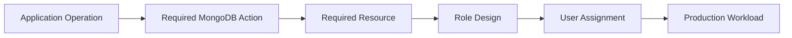
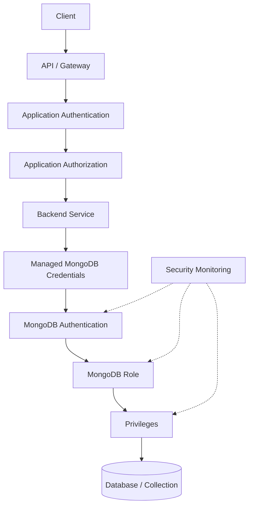

# 04- Authorization and Access Control

## Overview

MongoDB authorization controls which authenticated identities can perform which operations against which resources.

Authentication answers:

```text
Who are you?
```

Authorization answers:

```text
What are you allowed to do?
```

A production authorization model should therefore be designed as:

```text
Network Access
      ↓
TLS
      ↓
Authentication
      ↓
MongoDB User
      ↓
Roles
      ↓
Privileges
      ↓
Database / Collection / Resource
      ↓
MongoDB Operation
```

Authorization is one of the most important security boundaries in a production MongoDB deployment. A compromised application credential is significantly less damaging when the credential can only access the database and operations required by that service.

MongoDB authorization should complement, not replace, application-level authorization. MongoDB controls database operations; the application controls business-level decisions such as whether a particular customer can access a particular order.

---

## Authentication vs Authorization

| Concern | Authentication | Authorization |
|---|---|---|
| Question | Who are you? | What can you do? |
| Primary object | User / identity | Role / privilege |
| Example | `orders_service` successfully authenticates | `orders_service` can update `orders.orders` |
| Failure | Authentication failure | Authorization failure |
| Security goal | Establish identity | Restrict capabilities |
| MongoDB mechanisms | SCRAM, X.509, LDAP, etc. | Roles and privileges |

A valid authentication does not imply unrestricted access.

For example:

```text
orders_service
    ↓
Authentication succeeds
    ↓
User identified
    ↓
Role evaluated
    ↓
find on orders.orders
    ↓
Allowed
```

But:

```text
orders_service
    ↓
Authentication succeeds
    ↓
Role evaluated
    ↓
dropDatabase on production
    ↓
Denied
```

---

## MongoDB Authorization Model

MongoDB authorization is based on roles and privileges.

A simplified model is:

```text
User
  ↓
Assigned Role
  ↓
Privileges
  ├── Actions
  └── Resources
```

For example:

```text
orders_service
    ↓
orders_service_role
    ↓
find
insert
update
    ↓
orders.orders
```

This provides a clear boundary between:

- identity
- permission definition
- resource scope
- allowed operations

---

## Privileges

A privilege defines an allowed action against a resource.

Conceptually:

```text
Privilege = Action + Resource
```

Examples include permissions related to:

- reading documents
- inserting documents
- updating documents
- removing documents
- creating indexes
- inspecting database state
- administering users
- administering roles
- monitoring cluster state

The exact privilege set should be derived from actual workload requirements.

---

## Resource Scope

Resource scope determines where an action is permitted.

Consider:

```text
find
```

A permission can be broad or narrowly scoped.

Conceptually:

```text
find
  ↓
all databases
```

is significantly broader than:

```text
find
  ↓
orders.orders
```

When designing production authorization, evaluate both:

```text
What operation?
        +
Against which resource?
```

---

## Roles

A role groups privileges into a reusable authorization policy.

A user can have:

```text
User
 ├── Role A
 ├── Role B
 └── Role C
```

The effective permissions are derived from the user's assigned roles and inherited roles.

This is preferable to manually managing individual privileges for every user.

---

## Built-In Roles

MongoDB provides built-in roles for common authorization requirements.

Common examples include:

| Role | General purpose |
|---|---|
| `read` | Read access to a database |
| `readWrite` | Read and write access to a database |
| `dbAdmin` | Database administration |
| `userAdmin` | User and role administration |
| `clusterMonitor` | Cluster monitoring |
| `backup` | Backup operations |
| `restore` | Restore operations |
| `root` | Broad administrative access |

A built-in role is useful when its permission boundary matches the workload.

It should not be selected merely because it is convenient.

---

## Role Scope Matters

The same role can have different impact depending on where it is assigned.

For example:

```javascript
{
  role: "readWrite",
  db: "orders"
}
```

is materially different from a broad role that grants write access across multiple databases.

Always evaluate:

```text
Role
+
Database
+
Resource scope
```

rather than looking only at the role name.

---

## Least Privilege

Least privilege means granting only the access required for a workload.

For example, an order API might require:

```text
orders.orders
    find
    insert
    update
```

It may not require:

```text
delete
dropCollection
createUser
grantRole
shutdown
```

The authorization design should therefore start with application behavior rather than with a convenient built-in role.

---

## Permission Derivation

A practical approach is:



For example:

```text
POST /orders
    ↓
insert
    ↓
orders.orders
    ↓
orders_writer
    ↓
orders_service
```

This makes authorization requirements traceable back to real application behavior.

---

## Application Identity Boundaries

Microservices should generally use separate MongoDB identities.

```text
Orders API
    ↓
orders_service

Inventory API
    ↓
inventory_service

Reporting Worker
    ↓
reporting_service
```

This provides:

- independent credential rotation
- better auditability
- smaller blast radius
- clearer service ownership
- easier incident investigation

Avoid a shared identity such as:

```text
application_service
```

for unrelated workloads.

---

## Application Authorization vs MongoDB Authorization

These two layers solve different problems.

```text
HTTP Request
    ↓
Application Authentication
    ↓
Application Authorization
    ↓
Business Rules
    ↓
MongoDB Service Identity
    ↓
MongoDB Authorization
    ↓
Database Operation
```

Suppose a customer requests:

```http
GET /orders/123
```

The application may determine:

```text
Does order 123 belong to this customer?
```

MongoDB authorization determines:

```text
Can orders_service execute find against orders.orders?
```

MongoDB does not automatically understand application concepts such as:

- customer ownership
- subscription tier
- organization membership
- API roles
- resource-level business authorization

Those remain application responsibilities.

---

## Multi-Tenant Authorization

Consider a multi-tenant document:

```json
{
  "_id": "...",
  "tenant_id": "tenant-123",
  "status": "paid",
  "total": 149.99
}
```

MongoDB may authorize the service to read the collection:

```text
orders_service
    ↓
read orders.orders
```

The application must still enforce:

```python
query = {
    "_id": order_id,
    "tenant_id": authenticated_tenant_id,
}
```

This creates two authorization layers:

```text
MongoDB authorization
    ↓
Can the service read the collection?

Application authorization
    ↓
Can this caller read this specific document?
```

---

## Role Inheritance

Roles can inherit other roles.

Conceptually:

```text
Base Role
    ↓
Derived Role
    ↓
User
```

For example:

```text
orders_reader
      ↓
analytics_reader
      ↓
reporting_service
```

Role inheritance can reduce duplication, but excessive nesting makes effective privileges difficult to reason about.

Prefer role structures that can be understood quickly during:

- security reviews
- incident response
- access reviews
- production troubleshooting

---

## Custom Roles

Custom roles are useful when built-in roles are broader than required.

Example:

```javascript
use admin

db.createRole({
  role: "orders_service_role",
  privileges: [
    {
      resource: {
        db: "orders",
        collection: "orders"
      },
      actions: [
        "find",
        "insert",
        "update"
      ]
    }
  ],
  roles: []
})
```

The exact action list should be derived from the application's actual MongoDB operations.

---

## When to Use Custom Roles

Custom roles are particularly useful for:

- sensitive production workloads
- collection-specific access
- read-only audit access
- service-specific permissions
- regulated environments
- tightly controlled operational users
- reducing the scope of broad built-in roles

They introduce additional maintenance overhead, so they should not be created merely for the sake of customization.

---

## Built-In vs Custom Roles

| Consideration | Built-In Role | Custom Role |
|---|---|---|
| Setup | Simple | More involved |
| Maintenance | Low | Higher |
| Precision | Moderate | High |
| Standard workloads | Good fit | Often unnecessary |
| Fine-grained permissions | Limited by role definition | Strong |
| Security review | Usually simpler | Requires role analysis |
| Operational complexity | Lower | Higher |

Use the simplest role model that provides the required security boundary.

---

## Administrative Roles

Administrative privileges should be separated from application privileges.

For example:

```text
orders_service
    ↓
orders application role

database administrator
    ↓
administrative role
```

The application should not receive administrative capabilities simply because an administrator account works during development.

---

## High-Privilege Roles

Roles such as:

```text
root
userAdminAnyDatabase
dbAdminAnyDatabase
readWriteAnyDatabase
```

can have significant blast-radius implications.

Before assigning a broad role, ask:

```text
Why does this workload require this permission?
```

If the answer is:

```text
"It was easier."
```

the role should be reconsidered.

---

## `root` and Production Applications

An application running with `root` privileges creates a very large security boundary.

A compromised application could potentially perform operations far outside its business purpose.

Avoid:

```text
FastAPI
   ↓
root

Django
   ↓
root

Celery
   ↓
root
```

Instead:

```text
FastAPI
   ↓
orders_service_role
   ↓
orders database permissions
```

---

## Database-Level Access

Database-level authorization is appropriate when the service legitimately needs broad access within one database.

For example:

```text
orders_service
    ↓
readWrite
    ↓
orders database
```

This can be operationally simpler than defining permissions collection by collection.

However, if the application only needs access to a small subset of collections, a custom role may provide a smaller security boundary.

---

## Collection-Level Access

Collection-level authorization is useful when workloads have sharply different responsibilities.

Example:

```text
orders_service
    ├── orders.orders
    │      ├── find
    │      ├── insert
    │      └── update
    │
    └── orders.audit_events
           └── insert
```

The application could write audit events without receiving permission to modify historical audit records.

---

## Read-Only Workloads

Reporting systems often need read-only access.

```javascript
db.createUser({
  user: "reporting_service",
  pwd: passwordPrompt(),
  roles: [
    {
      role: "read",
      db: "orders"
    }
  ]
})
```

Read-only authorization provides a database-level safety boundary against accidental writes.

It does not, however, replace application-level access control.

---

## Background Workers

Workers should have authorization based on their actual operations.

For example:

```text
orders-api
    ├── find
    ├── insert
    └── update

orders-worker
    ├── find
    └── update
```

Do not automatically assign the API's role to Celery workers.

A worker that processes events may need:

```text
find
update
insert
```

but no:

```text
delete
```

---

## Migration and Backfill Access

Database migrations and backfills may require temporary privileges that normal application services should not have.

A safer model is:

```text
Migration Job
    ↓
Dedicated migration identity
    ↓
Required elevated privileges
    ↓
Migration execution
    ↓
Validation
    ↓
Access removed or reduced
```

This avoids permanently granting application processes administrative permissions.

---

## Monitoring Roles

Monitoring systems may require permissions different from application workloads.

For example:

```text
Monitoring
    ↓
clusterMonitor
```

rather than:

```text
Monitoring
    ↓
root
```

The monitoring identity should be evaluated against the metrics and operational data it actually needs.

---

## Backup and Restore Roles

Backup and restore operations should generally use dedicated operational identities.

Conceptually:

```text
Application
    ↓
Application role

Backup system
    ↓
Backup role

Restore operator
    ↓
Restore role
```

Separating these identities makes operational access easier to audit and limits application privileges.

---

## Role Changes

Role changes should be treated as security-sensitive changes.

A production workflow should look like:

```text
Requirement
    ↓
Privilege analysis
    ↓
Role modification
    ↓
Security review
    ↓
Non-production testing
    ↓
Production rollout
    ↓
Verification
    ↓
Monitoring
```

Avoid changing roles directly during an incident without recording what changed and why.

---

## Granting Roles

An existing user can receive additional roles:

```javascript
db.grantRolesToUser(
  "orders_service",
  [
    {
      role: "read",
      db: "inventory"
    }
  ]
)
```

Before granting the role, verify:

- business justification
- required resources
- required actions
- owner
- duration
- review process

---

## Revoking Roles

Permissions that are no longer required should be removed.

```javascript
db.revokeRolesFromUser(
  "orders_service",
  [
    {
      role: "read",
      db: "inventory"
    }
  ]
)
```

Privilege removal is particularly important after:

- migrations
- incidents
- temporary access
- service changes
- decommissioning
- architecture migrations

---

## Access Reviews

Production access should be periodically reviewed.

A useful review table is:

| Identity | Role | Resource | Actions | Owner | Required? |
|---|---|---|---|---|---|
| `orders_service` | `orders_writer` | `orders.orders` | Read/write | Orders team | Yes |
| `reporting_service` | `read` | `orders` | Read | Analytics | Yes |
| `old_worker` | `readWrite` | `legacy` | Read/write | Unknown | Review |

Look specifically for:

- inactive users
- unused roles
- temporary permissions
- broad administrative roles
- cross-service access
- stale credentials
- undocumented custom roles

---

## Authorization and Secret Management

Authorization controls what a credential can do.

Secret management controls who can obtain that credential.

For example:

```text
AWS IAM / Kubernetes RBAC
        ↓
Can the workload retrieve the MongoDB secret?
        ↓
MongoDB authentication
        ↓
Which identity is this?
        ↓
MongoDB authorization
        ↓
What can this identity do?
```

These controls should be designed independently.

A perfectly scoped MongoDB role does not help if every workload can retrieve the same credential.

---

## Kubernetes Example

A Kubernetes workload might retrieve its MongoDB connection secret through a controlled secret-management mechanism.

The resulting architecture should be:

```text
Kubernetes Workload
       ↓
Secret Access Policy
       ↓
MongoDB Credentials
       ↓
MongoDB Authentication
       ↓
Service Role
       ↓
Database Permissions
```

Do not put privileged MongoDB credentials into a shared Kubernetes secret consumed by unrelated workloads.

---

## AWS Example

In AWS environments, a typical pattern is:

```text
ECS / EKS Workload
       ↓
IAM Permission
       ↓
Secrets Manager
       ↓
MongoDB Credential
       ↓
MongoDB Authentication
       ↓
MongoDB Role
```

IAM determines whether the workload can retrieve the secret; MongoDB determines what the resulting database identity can do.

---

## Authorization in Python

Application code normally uses the MongoDB identity without embedding authorization logic into every repository method.

```python
from pymongo import MongoClient

client = MongoClient(
    mongodb_uri,
    serverSelectionTimeoutMS=5_000,
    connectTimeoutMS=5_000,
    socketTimeoutMS=10_000,
)

orders_collection = client["orders"]["orders"]
```

The MongoDB user's privileges are configured outside the application.

The application should not contain logic such as:

```python
if production:
    use_root_user()
```

Authorization should be part of the deployment configuration and infrastructure design.

---

## FastAPI Authorization Architecture

A production FastAPI service can have two distinct authorization layers:

```text
HTTP Request
    ↓
FastAPI authentication
    ↓
Application authorization
    ↓
Service / repository layer
    ↓
MongoDB service identity
    ↓
MongoDB authorization
```

For example:

```python
async def get_order(order_id: str, tenant_id: str):
    return await repository.find_one(
        {
            "_id": ObjectId(order_id),
            "tenant_id": tenant_id,
        }
    )
```

The application enforces tenant ownership while MongoDB ensures that the service identity has permission to execute the underlying query.

---

## Django Authorization Architecture

Django's authentication and authorization model should not be confused with MongoDB's authorization model.

A typical architecture is:

```text
Django User
    ↓
Django permissions / application authorization
    ↓
Service layer
    ↓
Repository
    ↓
PyMongo / MongoDB integration
    ↓
MongoDB service identity
    ↓
MongoDB roles
```

MongoDB is not a drop-in replacement for Django's relational ORM authorization semantics.

If using MongoDB through PyMongo or MongoEngine, database authorization should still be independently designed.

---

## gRPC and Microservices

Service-to-service communication introduces another authorization boundary.

For example:

```text
Order Service
    ↓
gRPC
    ↓
Inventory Service
    ↓
MongoDB
```

The Inventory service should use its own MongoDB identity:

```text
inventory_service
```

The Order service should not need Inventory's database credentials simply because it communicates with Inventory.

This preserves service ownership.

---

## Authorization and Redis

Redis may be used as a cache for authorization-related application data, but cached authorization state should not be treated as a replacement for MongoDB authorization.

For example:

```text
API
 ↓
Application authorization
 ↓
Redis cache
 ↓
Business authorization result
 ↓
MongoDB service identity
 ↓
MongoDB authorization
```

MongoDB remains the database-level authorization boundary.

---

## Authorization and Kafka

Kafka consumers should also use workload-specific MongoDB identities.

```text
Kafka Topic
    ↓
orders-worker
    ↓
MongoDB
    ↓
orders_worker_role
```

A Kafka consumer that only updates order status should not automatically inherit the full privileges of the API.

---

## Transactions and Authorization

Transactions execute using the privileges of the authenticated MongoDB user.

For example:

```text
Transaction
    ↓
insert order
    ↓
update inventory
```

The service identity must have permission for both operations.

If the identity lacks one required privilege, the transaction cannot successfully perform that operation.

Authorization therefore needs to be considered when designing transaction boundaries.

---

## Change Streams and Authorization

Change-stream consumers also require appropriate database privileges.

Conceptually:

```text
orders_service
    ↓
Change Stream
    ↓
Order Event
    ↓
Worker
```

The worker should receive only the privileges required for its resulting database operations.

For example:

```text
Change-stream consumer
    ├── read change events
    └── update processing state
```

Avoid granting full administrative permissions simply because a consumer needs change-stream access.

---

## Authorization and High Availability

MongoDB authorization remains relevant during replica-set failover.

The application should connect using a replica-set-aware connection configuration.

```text
Application
    ↓
MongoDB driver
    ↓
Primary
    ↓
Failover
    ↓
New Primary
    ↓
Authorization continues using service identity
```

Authorization is independent of which replica-set member currently serves the operation.

The MongoDB driver handles topology discovery and reconnect behavior; the user's roles remain part of the database authorization model.

---

## Authorization and Sharding

In a sharded deployment:

```text
Application
    ↓
mongos
    ↓
Shard routing
    ↓
Shard
```

Authorization still needs to be designed around the application identity and required operations.

The service should not receive broader privileges merely because the database is sharded.

A production security review should consider:

- application user permissions
- cluster-level privileges
- administrative access
- shard access
- configuration-server administration
- operational identities

---

## Network Security Is Not Authorization

A private network does not automatically authorize an operation.

For example:

```text
VPC
    ↓
Private MongoDB endpoint
```

only controls network reachability.

You still need:

```text
Authentication
    ↓
Authorization
```

The production model should therefore use defense in depth:

```text
Network restrictions
+
TLS
+
Authentication
+
Authorization
+
Application authorization
+
Monitoring
```

---

## Authorization and TLS

TLS protects communication between clients and MongoDB.

Authorization controls operations after the identity is established.

Therefore:

```text
TLS
    ↓
Protects connection
```

while:

```text
MongoDB roles
    ↓
Protect operations
```

Both are required for a secure production deployment.

---

## Authorization Auditability

Authorization systems should make it possible to answer:

```text
Who accessed the database?
What identity did they use?
What role did they have?
What resources were accessible?
When did the permission change?
Who approved the change?
```

Relevant operational controls may include:

- MongoDB auditing where applicable
- centralized logs
- infrastructure-as-code history
- CI/CD deployment history
- cloud audit logs
- access review records

---

## Authorization Monitoring

Monitor for:

- repeated authorization failures
- unexpected role changes
- new privileged users
- unusual administrative activity
- unexpected cross-database access
- privilege escalation
- inactive identities
- sudden access-pattern changes

Authentication failures and authorization failures should be distinguishable in operational telemetry.

---

## Performance Considerations

Authorization itself should not become the reason to use overly broad roles.

However, production security design should also avoid unnecessary operational complexity.

For example:

```text
50 services
    ↓
50 unique custom roles
    ↓
hundreds of inherited roles
```

can become difficult to maintain.

Prefer:

```text
Clear service boundaries
+
Reusable simple roles
+
Small number of custom roles where necessary
```

Security architecture should balance:

- least privilege
- maintainability
- auditability
- operational complexity

---

## Production Authorization Architecture



This separates application-level authorization from database-level authorization while keeping both within the same security architecture.

---

## Authorization Change Management

Treat MongoDB authorization as infrastructure.

Where possible, define roles and users through controlled deployment processes rather than manual production changes.

A mature workflow is:

```text
Role definition
    ↓
Code / infrastructure configuration
    ↓
Pull request
    ↓
Security review
    ↓
Automated validation
    ↓
Non-production deployment
    ↓
Production deployment
    ↓
Verification
```

This makes authorization changes reproducible and auditable.

---

## Infrastructure as Code Considerations

Authorization configuration can be represented through:

- infrastructure-as-code
- deployment scripts
- controlled administrative automation
- secrets-management workflows

Do not store plaintext production passwords in Git.

Separate:

```text
Role definition
```

from:

```text
Credential secret
```

A role can be version-controlled while the password is stored in a secret manager.

---

## Temporary Privileged Access

Production incidents sometimes require elevated access.

A controlled process is:

```text
Incident
    ↓
Identify required privilege
    ↓
Grant temporary access
    ↓
Perform operation
    ↓
Validate result
    ↓
Revoke access
    ↓
Review
```

Do not solve an incident permanently by leaving an administrator role attached to an application user.

---

## Authorization Troubleshooting

Use a consistent diagnostic methodology:

```text
Symptom
↓
Possible causes
↓
Isolation strategy
↓
Diagnostic commands
↓
Root cause
↓
Corrective action
↓
Prevention
```

### Symptom

Example:

```text
MongoServerError: not authorized
```

### Possible Causes

Common causes include:

- incorrect role
- missing role assignment
- incorrect database scope
- missing privilege
- wrong authentication database
- wrong MongoDB user
- application using an unexpected credential
- role change not deployed
- resource mismatch
- operation requiring a privilege the role does not provide

### Isolation Strategy

First determine:

```text
Which MongoDB user authenticated?
```

Then determine:

```text
Which roles does the user have?
```

Then determine:

```text
Which action and resource does the operation require?
```

### Diagnostic Commands

Inspect the authenticated connection:

```javascript
db.runCommand({
  connectionStatus: 1
})
```

Inspect a user:

```javascript
db.getUser("orders_service")
```

Inspect roles:

```javascript
db.getRoles({
  showBuiltinRoles: false
})
```

Inspect a custom role:

```javascript
db.getRole("orders_service_role", {
  showPrivileges: true
})
```

### Root Cause

Typical root causes include:

```text
User
  ↓
Role missing
```

or:

```text
Role
  ↓
Action missing
```

or:

```text
Action
  ↓
Resource scope incorrect
```

### Corrective Action

Apply the smallest required authorization change.

Avoid immediately assigning:

```text
root
```

or:

```text
readWriteAnyDatabase
```

as a troubleshooting shortcut.

### Prevention

Prevent recurring authorization failures through:

- role testing
- automated deployment
- access reviews
- least-privilege analysis
- service-specific identities
- documented privilege requirements
- monitoring

---

## Common Authorization Mistakes

### Using `root` for Applications

**Why it happens:** Development environments often use an administrator account for convenience.

**Risk:** Application compromise can become database-wide compromise.

**Prevention:** Create a dedicated service identity.

---

### Sharing One MongoDB User

**Why it happens:** One credential appears easier to manage.

**Risk:** Poor attribution and large blast radius.

**Prevention:** Use service-specific users.

---

### Granting Permissions Until Errors Stop

**Why it happens:** Engineers may resolve authorization failures reactively.

**Risk:** Privilege creep.

**Prevention:** Identify the exact action and resource required before changing the role.

---

### Confusing Authentication With Authorization

**Why it happens:** Both failures appear during connection or database operations.

**Risk:** Incorrect troubleshooting.

**Prevention:** Determine whether the identity failed to authenticate or the authenticated identity lacks a privilege.

---

### Ignoring Database Scope

**Why it happens:** Engineers focus on the role name.

**Risk:** A valid role may still be assigned with broader scope than intended.

**Prevention:** Review role, database, collection, and action together.

---

### Using MongoDB Roles for Tenant Isolation

**Why it happens:** MongoDB roles appear to provide a complete authorization solution.

**Risk:** Business-level tenant boundaries may not be enforced.

**Prevention:** Apply tenant-aware application authorization and queries.

---

### Keeping Temporary Privileges

**Why it happens:** Temporary incident access is forgotten.

**Risk:** Privilege creep.

**Prevention:** Track temporary access and explicitly revoke it.

---

### Overengineering Custom Roles

**Why it happens:** Least privilege is interpreted as requiring a custom role for every operation.

**Risk:** Authorization becomes difficult to maintain and audit.

**Prevention:** Use built-in roles when they provide an appropriate boundary.

---

## Interview Considerations

### What is MongoDB authorization?

Authorization determines which operations an authenticated MongoDB identity can perform against specific resources.

### What is a role?

A role groups privileges and can be assigned to users.

### What is a privilege?

A privilege combines an allowed action with a resource against which that action can be performed.

### Why is least privilege important?

It reduces the blast radius of:

- credential compromise
- application vulnerabilities
- operator mistakes
- malicious behavior

### Should every microservice use the same MongoDB user?

No. Separate workload identities provide better isolation, auditability, and credential lifecycle management.

### Does MongoDB authorization replace application authorization?

No. MongoDB authorization controls database operations. Application authorization must enforce business-level access rules.

### When should custom roles be used?

When built-in roles are broader than the workload requires and a narrower permission boundary provides meaningful security value.

### Why should applications avoid `root`?

Because application credentials are exposed to application infrastructure and therefore represent a potential attack surface. Excessive database privileges increase the impact of a compromise.

---

## Production Authorization Checklist

### Identity

- [ ] Each production workload has an appropriate identity.
- [ ] Administrative identities are separate from application identities.
- [ ] Retired identities are removed.
- [ ] Credentials can be rotated independently.

### Roles

- [ ] Roles follow least privilege.
- [ ] Database scope is explicitly reviewed.
- [ ] Collection scope is considered where appropriate.
- [ ] Custom roles are used only when justified.
- [ ] Role inheritance remains understandable.
- [ ] Broad administrative roles are tightly controlled.

### Application

- [ ] Application authorization is separate from MongoDB authorization.
- [ ] Tenant boundaries are enforced at the application/data-model layer.
- [ ] Services do not share unnecessary database credentials.
- [ ] Workers have independently reviewed permissions.

### Operations

- [ ] Authorization changes are reviewed.
- [ ] Production role changes are auditable.
- [ ] Temporary privileges have a removal process.
- [ ] Access reviews are performed periodically.
- [ ] Authorization failures are monitored.

### Infrastructure

- [ ] MongoDB credentials are stored in a secret-management system.
- [ ] Network access is restricted.
- [ ] TLS is enabled where required.
- [ ] Database credentials are not committed to source control.
- [ ] Backup and administrative identities are separated from application identities.

## Key Takeaways

- **MongoDB authorization maps authenticated identities to roles, privileges, actions, and resources; least privilege should be the default design principle.**
- **Separate MongoDB identities by workload so applications, workers, migrations, monitoring, backups, and administrators do not share unnecessary privileges.**
- **Use built-in roles when they provide an appropriate boundary and custom roles when finer-grained authorization materially reduces access or blast radius.**
- **MongoDB authorization protects database operations, while application authorization must enforce business rules such as tenant isolation and resource ownership.**
- **Treat authorization changes as production security changes: review them, test them, monitor them, and remove temporary or obsolete privileges.**