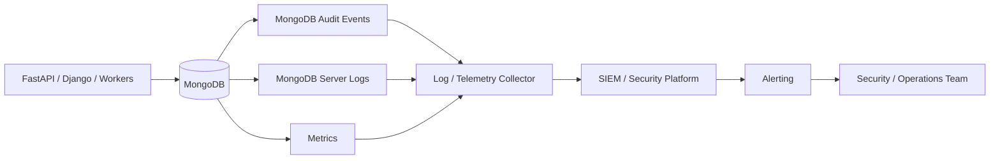

# 07- Auditing and Security Monitoring

## Overview

MongoDB auditing and security monitoring provide visibility into authentication, authorization, administrative changes, database operations, and security-relevant failures.

Authentication answers:

```text
Who is connecting?
```

Authorization answers:

```text
What is that identity allowed to do?
```

Auditing answers:

```text
What security-relevant action occurred, when, where, and under which identity?
```

Monitoring extends this further:

```text
Is the system behaving normally?
Are security controls failing?
Is there suspicious activity?
Is the database becoming unhealthy?
```

A production security architecture should therefore treat auditing and monitoring as a continuous control:

```text
Identity
   ↓
Authentication
   ↓
Authorization
   ↓
Database Operation
   ↓
Audit Event
   ↓
Log Collection
   ↓
SIEM / Monitoring Platform
   ↓
Alert / Investigation / Response
```

MongoDB auditing can record events such as authentication, authorization checks, user and role changes, collection operations, index operations, and other administrative actions. MongoDB's audit facility is available in MongoDB Enterprise and MongoDB Atlas, with deployment-specific configuration differences. :contentReference[oaicite:0]{index=0}

---

## Auditing vs Logging vs Monitoring

These concepts overlap but solve different problems.

| Capability | Primary Question | Example |
|---|---|---|
| Application logging | What did the application do? | `POST /orders` returned `201` |
| MongoDB server logging | What happened inside the server? | Connection or storage warning |
| MongoDB auditing | What security-relevant action occurred? | User attempted unauthorized access |
| Metrics | How healthy is the system? | Replication lag increased |
| Tracing | How did a request move through services? | API → service → MongoDB |
| SIEM | What security events occur across systems? | Correlate MongoDB auth failure with IAM event |
| Alerting | Does someone need to act? | Repeated failed authentication |

A mature production system uses these together.

---

## Security Monitoring Architecture

A typical architecture looks like:



The database should not be treated as the final destination for its own audit trail. Security events should normally be forwarded to a separately controlled logging or security platform.

---

## What MongoDB Auditing Provides

MongoDB audit events can capture security and administrative activity such as:

- authentication attempts
- authorization checks
- user creation
- user modification
- user deletion
- role creation
- role modification
- role deletion
- collection creation
- collection deletion
- index creation
- index changes
- database administration
- sharding-related administration
- configuration-related events
- shutdown events

The exact available actions and event structure depend on MongoDB version and deployment configuration. MongoDB documents audit events using schemas such as the Mongo schema and OCSF schema. :contentReference[oaicite:1]{index=1}

---

## Why Auditing Matters

Auditing is useful for:

### Security investigations

Determine:

```text
Who performed the action?
When?
From where?
Against which database?
Against which collection?
What operation?
Was it successful?
```

### Compliance

Some environments require evidence of:

- privileged access
- administrative changes
- authentication attempts
- authorization decisions
- data-access activity

The exact compliance requirements depend on the organization and regulatory environment.

### Incident response

An audit trail can help establish:

```text
Initial access
    ↓
Authentication
    ↓
Privilege escalation
    ↓
Unauthorized operation
    ↓
Persistence / configuration change
```

### Operational accountability

Auditing makes privileged changes observable instead of relying on shell history or informal operational records.

---

## Audit Event Structure

MongoDB audit messages contain common metadata such as:

- `atype`
- `ts`
- `uuid`
- `users`
- `roles`
- `param`
- `result`

The `atype` identifies the action type, while `result` contains the associated result code. MongoDB also records connection-related information such as remote endpoint information. :contentReference[oaicite:2]{index=2}

A simplified event might look like:

```json
{
  "atype": "authenticate",
  "ts": {
    "$date": "2026-09-21T10:30:00Z"
  },
  "users": [
    {
      "user": "orders-service",
      "db": "admin"
    }
  ],
  "param": {
    "user": "orders-service",
    "db": "admin",
    "mechanism": "SCRAM-SHA-256"
  },
  "result": 0
}
```

Treat the exact event schema as version-dependent and use the MongoDB documentation for the deployed version when building parsers or SIEM rules. :contentReference[oaicite:3]{index=3}

---

## Authentication Audit Events

Authentication events are especially useful for detecting:

- repeated failed logins
- unexpected authentication mechanisms
- access from unexpected networks
- disabled or retired service accounts still being used
- credential abuse

MongoDB records `authenticate` events and distinguishes successful and failed authentication outcomes. MongoDB also records incomplete authentication attempts in supported versions. :contentReference[oaicite:4]{index=4}

Example monitoring logic:

```text
Multiple authentication failures
        ↓
Same account
        ↓
Short time window
        ↓
Same or unusual source
        ↓
Security alert
```

---

## Authorization Audit Events

The `authCheck` audit action records authorization checks.

A simplified event contains information such as:

```json
{
  "atype": "authCheck",
  "param": {
    "command": "find",
    "ns": "orders.orders"
  },
  "result": 13
}
```

MongoDB documents result code `13` as unauthorized for authorization checks. By default, auditing focuses on authorization failures; successful authorization checks require enabling `auditAuthorizationSuccess`. :contentReference[oaicite:5]{index=5}

---

## Authorization Success Auditing

Logging every successful authorization check can produce a large volume of events.

MongoDB documents that enabling `auditAuthorizationSuccess` has greater performance impact than logging only authorization failures. :contentReference[oaicite:6]{index=6}

Therefore, distinguish:

```text
Failed authorization
    ↓
Usually high-value security signal

Successful authorization
    ↓
Potentially very high event volume
```

Do not enable successful authorization auditing globally without understanding the workload.

---

## What to Audit

A useful production audit strategy prioritizes high-value events.

| Event Category | Priority | Example |
|---|---:|---|
| Authentication failures | High | Invalid credentials |
| User creation/deletion | Critical | New privileged user |
| Role changes | Critical | Granting administrative privileges |
| Authorization failures | High | Unauthorized collection access |
| Privileged administrative operations | High | Configuration changes |
| Database/collection DDL | Medium/High | Collection creation |
| Index administration | Medium | Unexpected index creation |
| Routine successful reads | Workload-dependent | Application `find` |
| Routine successful writes | Workload-dependent | Application `insert` |

The exact priority should be determined by the organization's threat model and compliance requirements.

---

## Audit Filters

Audit filters determine which events are captured.

Filtering is important because unrestricted auditing can create:

- high event volume
- increased storage consumption
- higher processing overhead
- larger SIEM ingestion costs
- more difficult investigations

MongoDB supports audit filters for restricting captured events. :contentReference[oaicite:7]{index=7}

Conceptually:

```text
All MongoDB Events
        ↓
Audit Filter
        ↓
Security-Relevant Events
        ↓
Audit Destination
```

---

## Example Audit Filter

A filter can target authentication events:

```yaml
auditLog:
  filter: |
    {
      atype: "authenticate"
    }
```

A filter can also be constructed to focus on specific event classes or users.

The exact filter should be validated against the MongoDB version and deployment configuration before production rollout. MongoDB documents filter configuration for both startup-time and runtime approaches. :contentReference[oaicite:8]{index=8}

---

## Runtime Audit Configuration

MongoDB supports runtime audit configuration for supported deployments.

MongoDB introduced runtime audit filter management in version 5.0, allowing audit configuration to be changed without requiring direct filesystem modification of the server configuration. :contentReference[oaicite:9]{index=9}

This provides:

- separation of responsibilities
- centralized configuration
- reduced dependence on host filesystem access
- operational consistency

For current deployments, use the audit configuration mechanism appropriate to the MongoDB version rather than copying older `setAuditConfig` examples blindly.

---

## Audit Configuration Inspection

Where supported, audit configuration can be inspected using:

```javascript
db.adminCommand({
  getAuditConfig: 1
})
```

MongoDB documents `getAuditConfig` as an administrative command introduced in MongoDB 5.0. Its support differs by deployment type, and it is not supported in MongoDB Atlas clusters. :contentReference[oaicite:10]{index=10}

This distinction matters when writing operational runbooks.

---

## Audit Destinations

MongoDB Enterprise auditing can write events to destinations including:

| Destination | Typical Use |
|---|---|
| Console | Local development/testing |
| Syslog | Host-based centralized logging |
| JSON file | Structured log collection |
| BSON file | Binary audit storage |

MongoDB documents these audit destinations for Enterprise deployments. Atlas has its own managed auditing configuration. :contentReference[oaicite:11]{index=11}

---

## JSON Audit Logs

JSON is generally convenient for centralized log processing.

Example:

```yaml
auditLog:
  destination: file
  format: JSON
  path: /var/log/mongodb/audit.json
```

Structured logs are easier to ingest into:

- Elasticsearch
- OpenSearch
- Splunk
- Datadog
- CloudWatch pipelines
- SIEM platforms

The actual configuration should follow the MongoDB deployment's supported configuration model. :contentReference[oaicite:12]{index=12}

---

## Audit Log Reliability

Audit logs are security evidence and therefore need stronger reliability guarantees than ordinary debug logs.

MongoDB documents that audit events are buffered in memory and periodically written to disk. Events from a single connection are ordered, and for durable database operations MongoDB writes the relevant audit event before journaling the associated operation. :contentReference[oaicite:13]{index=13}

However, MongoDB also documents an important limitation: events can be lost if the server terminates before buffered events are committed to the audit log. :contentReference[oaicite:14]{index=14}

Therefore:

```text
MongoDB audit log
        ↓
Forward quickly
        ↓
Central security platform
        ↓
Independent retention
```

Do not treat the local audit file as the only copy of security evidence.

---

## Audit Destination Failure

MongoDB documents that if the server cannot write to the configured audit destination, the server terminates. :contentReference[oaicite:15]{index=15}

This creates an important production trade-off:

```text
Audit reliability
        vs
Database availability
```

A security architecture should therefore ensure the configured destination is reliable and capacity-managed.

Monitor:

- disk space
- log rotation
- filesystem permissions
- syslog health
- collector availability
- ingestion failures

---

## Audit Log Rotation

Audit files are rotated along with the server log file when file-based auditing is configured. :contentReference[oaicite:16]{index=16}

Operationally, verify:

- rotation frequency
- retention
- compression
- filesystem capacity
- ownership
- permissions
- forwarding behavior

Do not let audit retention consume the database host's filesystem.

---

## Sharded Cluster Auditing

A sharded cluster has multiple security-relevant components:

```text
Application
    ↓
mongos
    ↓
┌──────────────┐
│ Shard 1      │
│ Replica Set  │
└──────────────┘

┌──────────────┐
│ Shard 2      │
│ Replica Set  │
└──────────────┘

Config Server Replica Set
```

MongoDB documents that a complete auditing solution for a sharded cluster involves all `mongod` server processes and `mongos` router processes. :contentReference[oaicite:17]{index=17}

Enabling auditing only on `mongos` is therefore insufficient.

---

## Audit Event Correlation

Security investigations often require correlating events across:

```text
Application
    ↓
Load Balancer
    ↓
mongos
    ↓
mongod
```

MongoDB audit events include connection-related identifiers and endpoint information that can help correlate activity. :contentReference[oaicite:18]{index=18}

A practical correlation model is:

```text
Timestamp
+
User
+
Database
+
Client identity
+
Source address
+
Connection UUID
+
Operation
+
Result
```

In newer MongoDB versions, audit events can also contain intermediate connection information for requests passing through load balancers or `mongos`, depending on the deployment and version. :contentReference[oaicite:19]{index=19}

---

## MongoDB Audit Schema

MongoDB supports multiple audit message schemas depending on deployment and configuration.

The Mongo schema is MongoDB-specific.

The OCSF schema maps events into the Open Cybersecurity Schema Framework model, which can simplify integration with security analytics systems that use OCSF. :contentReference[oaicite:20]{index=20}

This distinction matters when building SIEM parsers:

```text
Mongo schema
    ↓
MongoDB-specific event model

OCSF schema
    ↓
Standardized security-event model
```

Do not write a parser assuming every MongoDB audit deployment produces the same schema.

---

## Security Monitoring Signals

Auditing should feed higher-level detection rules.

Useful signals include:

### Authentication

- repeated failed authentication
- successful login from unusual source
- unexpected authentication mechanism
- authentication for retired accounts

### Authorization

- repeated unauthorized commands
- application account attempting administrative commands
- unexpected collection access
- privilege escalation attempts

### Identity Administration

- user creation
- user deletion
- password or credential changes
- role creation
- role modification
- privilege grants

### Database Administration

- unexpected collection creation
- collection deletion
- index modification
- sharding configuration changes
- unexpected database configuration changes

### Availability

- repeated elections
- replication lag
- secondary failures
- connection spikes
- storage exhaustion

---

## Authentication Failure Detection

A basic detection rule can be expressed as:

```text
IF
    authentication failures >= threshold
AND
    time window <= threshold
THEN
    raise security signal
```

Example:

```text
20 failed authentication attempts
within 5 minutes
for the same account
```

The actual threshold should be based on observed workload and threat modeling.

Avoid hardcoding thresholds without measuring legitimate failure patterns.

---

## Privileged Account Monitoring

Privileged MongoDB identities deserve separate monitoring.

Examples:

```text
admin
securityAdmin
clusterAdmin
root
custom DBA roles
```

A production monitoring system should alert on unexpected use of privileged identities, especially from application networks.

Example:

```text
orders-service
    ↓
Attempts administrative command
    ↓
Unexpected privilege usage
    ↓
Security alert
```

Application service accounts should normally not require broad administrative roles.

---

## Service Account Monitoring

Each microservice should ideally have a distinct MongoDB identity.

Prefer:

```text
orders-service
payments-service
reporting-service
migration-service
```

over:

```text
application
```

with one shared credential.

Benefits include:

- attribution
- least privilege
- credential rotation
- incident containment
- auditability

If `payments-service` is compromised, its audit activity can be separated from other workloads.

---

## Application and Database Correlation

Application logs should include a correlation identifier:

```text
request_id
trace_id
user_id
service_name
```

MongoDB audit events should then be correlated with application events using available connection and timing information.

Example:

```text
API Request
trace_id=abc123
    ↓
orders-service
    ↓
MongoDB
    ↓
Audit event
    ↓
SIEM
```

MongoDB does not automatically know your HTTP trace ID, so application-level correlation may require explicit instrumentation.

---

## Security Monitoring with Python

Application telemetry can be structured:

```python
logger.info(
    "mongo_operation",
    extra={
        "operation": "find_order",
        "collection": "orders",
        "request_id": request_id,
        "service": "orders-api",
    },
)
```

Do not include:

- passwords
- tokens
- encryption keys
- full sensitive documents
- plaintext regulated fields

Audit and application logs should complement each other rather than duplicating sensitive data.

---

## FastAPI Monitoring

A FastAPI request can propagate a correlation ID:

```text
HTTP request
    ↓
Middleware
    ↓
request_id
    ↓
Service layer
    ↓
Repository
    ↓
MongoDB
```

The request ID can then be included in application logs.

For database-side auditing, correlate using:

- timestamp
- authenticated MongoDB user
- source
- operation
- connection information

Do not assume the MongoDB audit record will contain the application's HTTP request ID automatically.

---

## Django Monitoring

Django applications can apply the same architecture:

```text
Django Middleware
      ↓
Correlation ID
      ↓
View / Service
      ↓
Repository
      ↓
MongoDB
```

Application logging and MongoDB auditing should remain separate concerns.

---

## Monitoring Metrics

Security monitoring should be combined with operational metrics.

Useful MongoDB metrics include:

| Area | Metrics |
|---|---|
| Connections | Current connections, connection spikes |
| Authentication | Authentication failures |
| Authorization | Authorization failures |
| Replication | Replication lag |
| Elections | Election frequency |
| Storage | Disk utilization, growth |
| Memory | Resident memory, working set |
| Queries | Slow operations |
| Operations | Read/write rates |
| Audit | Audit event rate, ingestion failures |
| KMS | Key access failures |
| Application | Error rate, latency |

Metrics provide context for audit events.

---

## Security Baselines

Monitoring is more useful when normal behavior is known.

Establish baselines for:

```text
Normal authentication rate
Normal connection count
Normal source networks
Normal privileged activity
Normal read/write volume
Normal query latency
Normal replication lag
Normal audit event volume
```

Then detect deviations.

For example:

```text
Normal:
orders-service → MongoDB from private subnet

Observed:
orders-service → MongoDB from unexpected network

        ↓

Investigate
```

---

## Security Alerts

Useful alerts include:

| Alert | Severity |
|---|---:|
| Repeated authentication failures | High |
| Unauthorized administrative operation | Critical |
| Unexpected privileged login | High |
| Unauthorized collection access | High |
| Privilege/role change | Critical |
| Unexpected user creation | Critical |
| Audit pipeline failure | High |
| Audit disk exhaustion | High |
| Unexpected source network | High |
| Certificate expiration | High |
| KMS access failure | High |

Severity should be adjusted to the organization's environment.

---

## Avoid Alert Fatigue

Not every audit event should create an alert.

Bad architecture:

```text
Every audit event
    ↓
PagerDuty
```

Better:

```text
Audit events
    ↓
Filtering
    ↓
Correlation
    ↓
Detection rules
    ↓
Alert only when actionable
```

Examples of low-value alerts:

- every successful application query
- every routine health check
- every expected service authentication

Examples of higher-value alerts:

- unexpected role changes
- repeated authorization failures
- privileged access from unusual sources
- disabled service account usage

---

## Audit Storage and Retention

Audit retention should be defined explicitly.

Consider:

- security requirements
- compliance requirements
- investigation windows
- storage cost
- log volume
- immutability
- access control

A common architecture is:

```text
MongoDB
   ↓
Audit Log
   ↓
Collector
   ↓
Central Log Platform
   ↓
Hot Retention
   ↓
Long-Term Archive
```

Do not retain unlimited audit logs on MongoDB hosts.

---

## Immutable Security Logs

For high-security environments, audit records should be protected against tampering.

A centralized security platform can provide stronger controls than local files.

The desired property is:

```text
Database Administrator
        ≠
Audit Log Administrator
```

This separation reduces the risk that a compromised or malicious database administrator can silently erase evidence.

---

## Access to Audit Logs

Audit logs themselves contain sensitive information.

They may reveal:

- usernames
- source addresses
- database names
- collection names
- commands
- roles
- client metadata

Therefore:

```text
Audit logs
    ↓
Require access control
```

Do not make audit logs broadly readable to all developers.

---

## Audit Logs and Privacy

Audit events can themselves become sensitive data.

Avoid unnecessarily exposing:

- personal data
- credentials
- tokens
- command arguments containing sensitive values

MongoDB documents that some authorization event arguments may be redacted. :contentReference[oaicite:21]{index=21}

Security monitoring pipelines should still apply their own data-classification and retention controls.

---

## Performance Considerations

Auditing introduces overhead.

The most important performance considerations are:

- event volume
- authorization success auditing
- filter selectivity
- log serialization
- disk I/O
- log forwarding
- SIEM ingestion

MongoDB explicitly notes that auditing authorization successes has greater performance impact than logging authorization failures only. :contentReference[oaicite:22]{index=22}

Therefore:

```text
More visibility
    ↓
More events
    ↓
More CPU / I/O / storage
    ↓
Higher operational cost
```

Measure the impact before enabling high-volume audit categories.

---

## Audit Event Volume

Before enabling broad auditing, estimate:

```text
events / second
×
average event size
×
retention period
```

For example:

```text
2,000 events/sec
×
2 KB/event
≈
4 MB/sec
```

That is approximately:

```text
345 GB/day
```

before compression and additional pipeline overhead.

This is why audit filtering and centralized retention policies matter.

---

## Successful Authorization Auditing Trade-Off

Successful reads and writes can generate enormous event volume.

For an application performing:

```text
10,000 database operations/sec
```

logging every successful authorization decision may create a very large audit stream.

Use successful authorization auditing when the security or compliance requirement justifies the operational cost.

Otherwise, focus on:

- failures
- privileged actions
- identity changes
- administrative operations

---

## Monitoring Replica Sets

Security monitoring should also include replica-set health.

Monitor:

- primary availability
- secondary availability
- replication lag
- election frequency
- rollback events
- oplog window
- connection errors

A security incident and an availability incident can overlap.

For example:

```text
Unexpected network change
        ↓
Secondary connectivity lost
        ↓
Replication lag
        ↓
Election
        ↓
Application errors
```

Operational monitoring can provide context for security investigation.

---

## Monitoring Sharded Clusters

For sharded deployments monitor:

```text
mongos
  ↓
Config servers
  ↓
Shard replica sets
```

Security monitoring should detect:

- unexpected shard configuration changes
- unexpected `mongos` activity
- unauthorized administrative operations
- shard-key administration changes
- config server issues

Audit configuration must cover the complete sharded deployment. :contentReference[oaicite:23]{index=23}

---

## Monitoring Kubernetes Deployments

For Kubernetes-hosted MongoDB, combine:

```text
MongoDB audit events
        +
MongoDB logs
        +
Kubernetes audit logs
        +
Container logs
        +
Cloud logs
```

This allows an investigation to answer:

```text
Who accessed MongoDB?
Which pod made the connection?
Which Kubernetes workload owned the pod?
Which service account was used?
Which node hosted the workload?
```

This is much stronger than looking at MongoDB logs alone.

---

## Monitoring AWS Deployments

An AWS architecture can combine:

```text
MongoDB
   ↓
Audit Events
   ↓
Log Collector
   ↓
CloudWatch / SIEM

AWS CloudTrail
   ↓
AWS Administrative Events
   ↓
SIEM
```

This creates a broader security picture:

```text
Database Activity
+
AWS Infrastructure Activity
+
Application Activity
```

The exact AWS service selection depends on whether MongoDB is self-managed or managed through MongoDB Atlas.

---

## Audit Monitoring for MongoDB Atlas

MongoDB Atlas provides managed database auditing for supported cluster tiers and allows audit filters to be configured. MongoDB documents Atlas auditing support for M10 and larger clusters. :contentReference[oaicite:24]{index=24}

Atlas changes the operational model:

```text
MongoDB
   ↓
Managed infrastructure
   ↓
Atlas audit configuration
   ↓
Central security workflow
```

Do not blindly apply self-managed `mongod` configuration examples to Atlas.

---

## SIEM Integration

A SIEM should normalize and correlate MongoDB audit events with:

- application logs
- AWS CloudTrail
- Kubernetes audit events
- IAM activity
- network events
- endpoint security
- authentication systems

Example:

```text
MongoDB authentication failure
        +
AWS source identity event
        +
Unexpected source IP
        ↓
Correlated security incident
```

The value comes from correlation, not simply collecting more logs.

---

## Security Detection Examples

### Brute-Force Pattern

```text
Multiple authentication failures
        ↓
Same username
        ↓
Same source
        ↓
Short time window
        ↓
Alert
```

### Privilege Escalation Pattern

```text
Application service account
        ↓
Role modification
        ↓
Administrative privilege granted
        ↓
Immediate privileged operation
        ↓
Critical alert
```

### Suspicious Data Access

```text
Normally:
orders-service → orders collection

Observed:
orders-service → users collection
        ↓
Unexpected access pattern
        ↓
Investigate
```

These are detection patterns, not automatic proof of compromise.

---

## Audit Event Investigation

A practical investigation sequence is:

```text
Identify event
    ↓
Identify user
    ↓
Identify source
    ↓
Identify database / namespace
    ↓
Identify command
    ↓
Check result
    ↓
Correlate application logs
    ↓
Correlate infrastructure logs
    ↓
Determine expected vs unexpected
    ↓
Contain if necessary
```

Do not investigate an isolated audit event without considering the surrounding context.

---

## Example Investigation

Suppose the SIEM reports:

```text
Unauthorized MongoDB command
user=orders-service
source=10.20.5.14
namespace=admin.$cmd
```

Investigate:

```text
1. Is 10.20.5.14 an expected application pod?
2. Which Kubernetes workload owns the IP?
3. What command was attempted?
4. Does orders-service normally access admin?
5. Did the service account change recently?
6. Were there preceding authentication failures?
7. Were there role changes?
8. What application deployment was active?
```

The objective is to reconstruct the sequence, not simply react to one event.

---

## Common Mistakes

### Auditing Without Centralization

**Problem:**

Audit logs remain only on the MongoDB host.

**Risk:**

An attacker who compromises the host may also modify or delete the logs.

**Prevention:**

Forward events to a separately controlled security platform.

---

### Logging Everything

**Problem:**

Every successful authorization check is recorded.

**Risk:**

High CPU, I/O, storage, ingestion cost, and alert noise.

**Prevention:**

Use targeted filters and enable high-volume events only when justified.

---

### Auditing Only `mongos`

**Problem:**

Sharded deployment audits only router activity.

**Risk:**

Shard and config-server activity is missing.

**Prevention:**

Enable auditing across the complete deployment. :contentReference[oaicite:25]{index=25}

---

### Treating Application Logs as Database Audits

**Problem:**

The application says:

```text
Order updated
```

**Risk:**

It does not prove which MongoDB identity actually executed the operation or whether the database accepted the authorization.

**Prevention:**

Use application logs and MongoDB auditing together.

---

### Giving Developers Broad Audit Access

**Problem:**

Everyone can read security logs.

**Risk:**

Audit data itself may contain sensitive operational information.

**Prevention:**

Apply least privilege to audit-log access.

---

### No Audit Retention Strategy

**Problem:**

Audit files accumulate indefinitely.

**Risk:**

Disk exhaustion or unpredictable storage costs.

**Prevention:**

Define centralized retention, rotation, compression, and archival policies.

---

### No Certificate / Audit Pipeline Monitoring

**Problem:**

Security controls fail silently.

**Risk:**

The organization believes it is collecting security evidence when it is not.

**Prevention:**

Monitor audit ingestion and security-control health.

---

## Beginner Mistakes

| Mistake | Why It Happens | Better Approach |
|---|---|---|
| Enable all auditing | More logs seems safer | Audit high-value events first |
| Store logs locally | Simple setup | Centralize security logs |
| Alert on every event | Avoid missing incidents | Use correlation and severity |
| Share audit credentials | Operational convenience | Separate access roles |
| Ignore log volume | Underestimated workload | Estimate events/sec and retention |
| Skip audit testing | Configuration appears correct | Generate known test events |

---

## Production Pitfalls

### Audit Pipeline Backpressure

If the external log pipeline cannot ingest events fast enough:

```text
MongoDB
    ↓
Audit event
    ↓
Collector
    ↓
Backpressure
```

The system needs an operational strategy for:

- buffering
- retries
- disk capacity
- dropped events
- alerting

Do not silently discard security events.

### Clock Synchronization

Audit correlation depends heavily on timestamps.

Production systems should maintain reliable time synchronization across:

- MongoDB nodes
- application hosts
- Kubernetes nodes
- logging infrastructure
- SIEM systems

Otherwise:

```text
Event A: 10:00:03
Event B: 09:59:58
```

may appear out of order even when B actually happened later.

### Incomplete Context

An audit event may identify the MongoDB user but not the end-user who initiated the HTTP request.

Use application correlation to bridge:

```text
Human user
    ↓
API request
    ↓
Service identity
    ↓
MongoDB identity
```

---

## Monitoring Runbook

### Authentication Failure

```text
Symptom
↓
Repeated MongoDB authentication failures
↓
Possible causes
    - invalid credentials
    - expired credentials
    - wrong authSource
    - compromised credentials
    - configuration deployment
↓
Isolation
↓
Check audit events + application deployment + source IP
↓
Diagnostic commands / SIEM search
↓
Determine expected vs unexpected
↓
Rotate credentials if compromise is suspected
↓
Prevention
    - secret rotation
    - alerting
    - least privilege
```

### Authorization Failure

```text
Symptom
↓
Unauthorized MongoDB operation
↓
Possible causes
    - missing role
    - incorrect namespace
    - application bug
    - privilege regression
    - malicious request
↓
Isolation
↓
Identify user + command + namespace + source
↓
Compare with expected service permissions
↓
Correct role or application behavior
↓
Prevention
    - RBAC testing
    - permission reviews
    - CI/CD authorization tests
```

### Audit Pipeline Failure

```text
Symptom
↓
Expected audit events missing from SIEM
↓
Possible causes
    - collector failure
    - network issue
    - disk exhaustion
    - parser failure
    - filter misconfiguration
↓
Isolation
↓
Check MongoDB audit destination
↓
Check collector
↓
Check ingestion metrics
↓
Check SIEM parsing
↓
Restore pipeline
↓
Prevention
    - ingestion health checks
    - synthetic audit tests
    - capacity alerts
```

---

## Synthetic Security Tests

Security monitoring should be tested continuously.

For example:

```text
Create controlled failed authentication
        ↓
MongoDB emits audit event
        ↓
Collector receives event
        ↓
SIEM indexes event
        ↓
Detection rule evaluates
        ↓
Expected alert generated
```

This verifies the complete security pipeline.

A security control that has never been tested should not be assumed to work.

---

## CI/CD Security Validation

CI/CD pipelines can validate:

- audit configuration
- audit filters
- required security settings
- TLS configuration
- role definitions
- least-privilege policies
- log parsing rules

For infrastructure-as-code:

```text
Git commit
    ↓
Validation
    ↓
Security tests
    ↓
Review
    ↓
Deployment
    ↓
Post-deployment verification
```

Avoid changing audit configuration manually without documenting the resulting configuration.

---

## Production Security Checklist

### Auditing

- [ ] Required audit categories are identified.
- [ ] Audit filters are reviewed.
- [ ] Authentication failures are monitored.
- [ ] Authorization failures are monitored.
- [ ] Privileged operations are monitored.
- [ ] User and role changes are monitored.
- [ ] Sharded deployments audit all required components.
- [ ] Audit configuration is version-controlled or otherwise governed.

### Log Security

- [ ] Audit logs are centralized.
- [ ] Audit logs have controlled access.
- [ ] Retention is defined.
- [ ] Log rotation is configured.
- [ ] Storage capacity is monitored.
- [ ] Audit data is protected from unauthorized modification.
- [ ] Sensitive information is handled appropriately.

### Monitoring

- [ ] Authentication failures have detection rules.
- [ ] Privilege changes have alerts.
- [ ] Unexpected administrative activity is detected.
- [ ] Audit ingestion failures are detected.
- [ ] Replica-set health is monitored.
- [ ] Connection and query anomalies are monitored.
- [ ] Security events are correlated with application telemetry.

### Incident Response

- [ ] Audit investigation procedures exist.
- [ ] Privileged account procedures exist.
- [ ] Credential rotation procedures exist.
- [ ] Database isolation procedures exist.
- [ ] Audit retention supports the investigation window.
- [ ] Recovery procedures preserve required security evidence.

---

## Interview Considerations

### What is MongoDB auditing?

Auditing records security-relevant and administrative events such as authentication, authorization checks, identity changes, and database administration.

### Why is auditing different from MongoDB logging?

Server logs provide operational information, while auditing provides structured security-oriented records designed to track actions and identities.

### Does MongoDB audit every successful read by default?

No. Authorization failures are audited by default for the relevant authorization-check events. Successful authorization checks require enabling `auditAuthorizationSuccess`, which has greater performance impact. :contentReference[oaicite:26]{index=26}

### Why use audit filters?

To reduce unnecessary event volume, storage, processing, and SIEM costs while retaining security-relevant events.

### What happens if the audit destination cannot be written?

MongoDB documents that the server terminates if it cannot write to the configured audit destination. :contentReference[oaicite:27]{index=27}

### Can audit logs be lost?

Yes. MongoDB documents that buffered audit events can be lost if the server terminates before those events are committed to the audit log. :contentReference[oaicite:28]{index=28}

### How should audit logs be protected?

Centralize them in a separately controlled security platform, restrict access, define retention, and protect them against unauthorized modification.

### How should MongoDB auditing work in a sharded cluster?

Audit the relevant `mongod` processes on shards and config servers as well as `mongos` routers. MongoDB documents that a complete sharded-cluster auditing solution requires auditing across the deployment. :contentReference[oaicite:29]{index=29}

### Should every audit event generate an alert?

No. Auditing is evidence collection; alerting should use filtering, correlation, baselines, and severity to identify actionable security signals.

## Key Takeaways

- **Auditing provides security evidence; monitoring turns that evidence and operational telemetry into detection and response signals.**
- **Prioritize authentication failures, authorization failures, privileged operations, identity changes, and unexpected administrative activity rather than indiscriminately logging everything.**
- **Centralize audit events in a separately controlled security platform and monitor the audit pipeline itself; local audit files alone are not a sufficient security-monitoring architecture.**
- **Successful authorization auditing can generate substantial event volume and performance overhead, so enable it only when its additional visibility justifies the operational cost.**
- **For production investigations, correlate MongoDB audit events with application, Kubernetes, AWS, network, and identity telemetry to reconstruct the complete request and security context.**