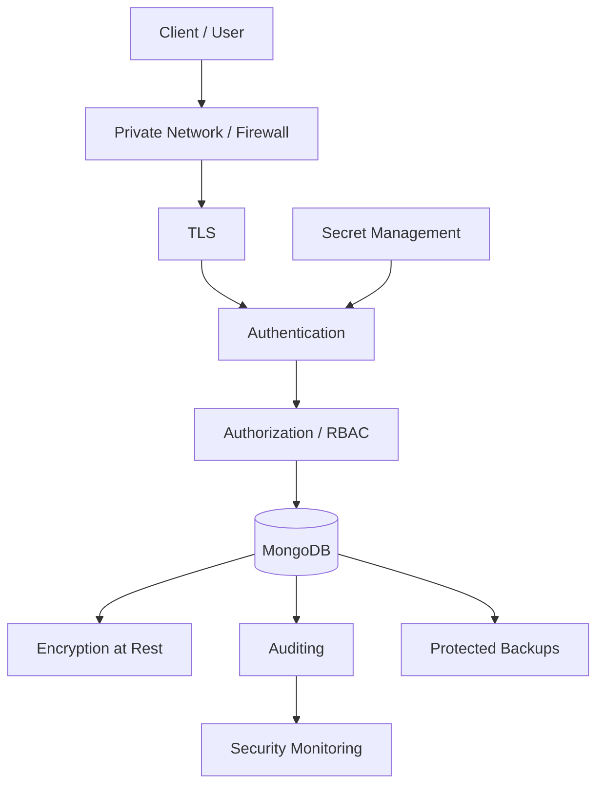
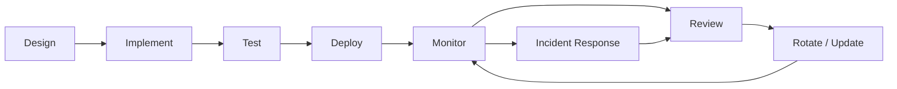

# README

## Overview

This section contains the MongoDB security documentation required to design, implement, operate, and troubleshoot secure MongoDB deployments in backend systems.

The material progresses from security fundamentals to production architecture, with emphasis on:

- Authentication and authorization
- Least-privilege access
- Network isolation
- TLS and encryption
- Auditing and monitoring
- Credential and secret management
- Application-level security
- Backup protection
- Security operations
- Production hardening

The documents are intended to complement the broader MongoDB playbook covering data modeling, queries, indexing, transactions, replication, sharding, Python integration, performance, and operations.

## Navigation

| # | File | Description |
|---|---|---|
| 01 | [01- Security Overview](./01-%20Security%20Overview.md) | MongoDB security model, defense in depth, threat boundaries, and core security controls |
| 02 | [02- Authentication](./02-%20Authentication.md) | Authentication mechanisms, users, credentials, connection authentication, and application identities |
| 03 | [03- Users and Roles](./03-%20Users%20and%20Roles.md) | MongoDB users, built-in roles, custom roles, RBAC, and least-privilege design |
| 04 | [04- Authorization and Access Control](./04-%20Authorization%20and%20Access%20Control.md) | Authorization behavior, privileges, access control, and application authorization patterns |
| 05 | [05- Network Security](./05-%20Network%20Security.md) | Private networking, bind configuration, firewalls, security groups, Kubernetes networking, and administrative access |
| 06 | [06- TLS and Encryption](./06-%20TLS%20and%20Encryption.md) | TLS, encryption in transit, encryption at rest, field-level encryption, certificates, and key management |
| 07 | [07- Auditing and Security Monitoring](./07-%20Auditing%20and%20Security%20Monitoring.md) | Audit events, security monitoring, centralized logging, detection, alerting, and operational visibility |
| 08 | [08- Security Best Practices](./08-%20Security%20Best%20Practices.md) | Production security hardening, defense in depth, application security, incident response, and security checklists |

## Security Learning Path

The recommended progression is:

```text
Security Overview
       ↓
Authentication
       ↓
Users and Roles
       ↓
Authorization
       ↓
Network Security
       ↓
TLS and Encryption
       ↓
Auditing and Security Monitoring
       ↓
Security Best Practices
```

The progression moves from identity and access control toward infrastructure security, data protection, observability, and production hardening.

## Security Architecture

A production MongoDB security model should combine multiple independent controls:



No individual control should be treated as sufficient on its own.

For example:

- Network isolation does not replace authentication.
- Authentication does not replace authorization.
- Authorization does not protect credentials.
- TLS does not protect data stored on disk.
- Encryption does not prevent an authorized application from reading data.
- Auditing does not prevent an attack; it helps detect and investigate it.
- Backups do not improve security if they are themselves exposed.

## Core Security Principles

### Defense in Depth

MongoDB security should use multiple layers:

```text
Network
   ↓
TLS
   ↓
Authentication
   ↓
Authorization
   ↓
Application Validation
   ↓
Encryption
   ↓
Auditing
   ↓
Monitoring
   ↓
Backup / Recovery
```

A failure at one layer should not automatically result in unrestricted database access.

### Least Privilege

Every MongoDB identity should have only the permissions required for its workload.

Typical identities include:

- API services
- Background workers
- Reporting services
- Migration jobs
- Monitoring systems
- Backup processes
- Database administrators

Avoid using `root` or broad administrative roles for normal application traffic.

### Private by Default

MongoDB should normally be deployed inside a private network boundary.

Prefer:

```text
Internet
   ↓
Load Balancer
   ↓
Application
   ↓
Private MongoDB
```

Avoid:

```text
Internet
   ↓
MongoDB:27017
```

### Credentials Are Sensitive Data

Treat MongoDB credentials as secrets.

Do not store credentials in:

- source code
- Git repositories
- Docker images
- Kubernetes manifests
- CI/CD logs
- screenshots
- shared documentation

Use an appropriate secret-management mechanism.

### Backups Are Data

A backup contains the same sensitive information as the primary database.

Backup security must therefore include:

- encryption
- access control
- retention
- auditing
- integrity validation
- recovery testing

## Application Security

MongoDB security extends beyond the database server.

A backend service should generally follow:

```text
HTTP / gRPC Request
        ↓
Authentication
        ↓
Authorization
        ↓
Input Validation
        ↓
Service Layer
        ↓
Repository Layer
        ↓
MongoDB
```

Do not expose arbitrary MongoDB query objects directly through REST or gRPC interfaces.

Protect against:

- NoSQL injection
- unrestricted operators
- unbounded pagination
- expensive regex queries
- cross-tenant access
- excessive aggregation
- sensitive error leakage

## Production Identity Model

A microservice architecture should normally use separate MongoDB identities:

```text
orders-api
    │
    └── orders-service-role

payments-api
    │
    └── payments-service-role

reporting-service
    │
    └── reporting-readonly-role

migration-job
    │
    └── temporary-migration-role
```

This provides:

- better isolation
- smaller blast radius
- clearer audit attribution
- easier credential rotation
- simpler incident investigation

## Environment Security

| Environment | Primary Security Focus |
|---|---|
| Local | Safe defaults and avoiding insecure patterns |
| Development | Controlled credentials and isolated data |
| Staging | Production-like authentication, TLS, roles, and network controls |
| Production | Full defense in depth, auditing, monitoring, backup protection, and incident response |

Development convenience should not become production configuration.

## Security and Backend Technologies

### Python

Use the MongoDB driver with:

- TLS
- controlled timeouts
- connection pooling
- explicit query construction
- secure exception handling
- environment or secret-manager configuration

### FastAPI

Use:

- Pydantic validation
- dependency-based authentication
- service-layer authorization
- repository abstraction
- bounded pagination
- controlled MongoDB filters

### Django

Do not assume MongoDB behaves like Django's native relational ORM.

Use an explicit integration architecture such as:

```text
Django View / API
        ↓
Serializer / Validation
        ↓
Service Layer
        ↓
Repository
        ↓
PyMongo / MongoDB Integration
```

### Kubernetes

Combine:

- NetworkPolicies
- Kubernetes Secrets or an external secret manager
- workload isolation
- restricted administrative access
- TLS
- MongoDB authentication
- monitoring

### AWS

Typical controls include:

- private VPC subnets
- security groups
- IAM for surrounding infrastructure
- AWS Secrets Manager
- AWS KMS
- CloudWatch or centralized monitoring
- encrypted storage
- controlled administrative access

## Security Operations

Security should be treated as an operational lifecycle:



Security controls should be periodically reviewed rather than configured once and forgotten.

## Security Review Checklist

### Network

- [ ] MongoDB is not publicly exposed.
- [ ] Access is restricted to required workloads.
- [ ] Firewall and security-group rules are minimal.
- [ ] Administrative access uses a controlled path.
- [ ] Kubernetes NetworkPolicies are configured where applicable.

### Authentication

- [ ] Authentication is enabled.
- [ ] Application identities are separated.
- [ ] Administrative identities are separated.
- [ ] Credentials are stored securely.
- [ ] Credential rotation is documented.

### Authorization

- [ ] Least privilege is enforced.
- [ ] Broad administrative roles are not used by applications.
- [ ] Collection-level permissions are used where appropriate.
- [ ] Roles are reviewed periodically.
- [ ] Authorization behavior is tested.

### Transport and Encryption

- [ ] Production traffic uses TLS.
- [ ] Certificates are validated.
- [ ] Certificate expiration is monitored.
- [ ] Data-at-rest encryption is configured where required.
- [ ] Backup encryption is enabled.
- [ ] Encryption keys are properly managed.

### Application

- [ ] Client input is validated.
- [ ] Arbitrary MongoDB filters are not exposed.
- [ ] Pagination is bounded.
- [ ] Expensive query patterns are controlled.
- [ ] Tenant isolation is enforced server-side.
- [ ] Database errors are not exposed directly to clients.

### Monitoring

- [ ] Authentication failures are monitored.
- [ ] Authorization failures are monitored.
- [ ] Privileged activity is auditable.
- [ ] Audit logs are protected.
- [ ] Security events are centralized where required.
- [ ] Alerts have defined response procedures.

### Backup and Recovery

- [ ] Backups are encrypted.
- [ ] Backup access is restricted.
- [ ] Backup retention is defined.
- [ ] Restore procedures are documented.
- [ ] Recovery testing is performed.
- [ ] RPO and RTO requirements are defined.

## Common Security Anti-Patterns

| Anti-Pattern | Risk | Better Approach |
|---|---|---|
| Public MongoDB port | Direct attack surface | Private networking |
| Application uses `root` | Excessive blast radius | Dedicated least-privilege role |
| Shared MongoDB credentials | Poor isolation and attribution | Per-service identities |
| Credentials in Git | Credential leakage | Secret manager |
| Disabled TLS verification | Weak server validation | Correct CA and certificate configuration |
| Arbitrary client filters | NoSQL injection | Explicit query construction |
| Unbounded pagination | Resource exhaustion | Maximum page size |
| Client-controlled tenant ID | Cross-tenant access | Derive tenant from authenticated context |
| Unprotected backups | Data exposure | Encryption and restricted access |
| Manual undocumented changes | Configuration drift | Reviewed configuration and IaC |

## Troubleshooting Methodology

Security incidents should be investigated systematically:

```text
Symptom
↓
Possible causes
↓
Isolation strategy
↓
Diagnostic commands / logs
↓
Root cause
↓
Corrective action
↓
Prevention
```

Typical categories include:

- authentication failures
- authorization failures
- TLS failures
- certificate expiration
- network connectivity
- unexpected access
- credential compromise
- audit pipeline failures
- backup-access issues
- tenant-isolation failures

Avoid changing multiple security controls simultaneously during troubleshooting unless required for containment.

## Recommended Reading Order

For someone progressing toward senior backend engineering, use this order:

1. [01- Security Overview](./01-%20Security%20Overview.md)
2. [02- Authentication](./02-%20Authentication.md)
3. [03- Users and Roles](./03-%20Users%20and%20Roles.md)
4. [04- Authorization](./04-%20Authorization.md)
5. [05- Network Security](./05-%20Network%20Security.md)
6. [06- TLS and Encryption](./06-%20TLS%20and%20Encryption.md)
7. [07- Auditing and Security Monitoring](./07-%20Auditing%20and%20Security%20Monitoring.md)
8. [08- Security Best Practices](./08-%20Security%20Best%20Practices.md)

## Key Takeaways

- **MongoDB security is a layered architecture combining network isolation, authentication, authorization, TLS, encryption, auditing, monitoring, and protected backups.**
- **Least privilege and workload-specific identities are central to reducing the blast radius of compromised applications or credentials.**
- **Application-level validation is part of database security; prevent arbitrary queries, NoSQL injection, unbounded workloads, and cross-tenant access.**
- **Production security includes the entire data lifecycle, including credentials, backups, audit logs, encryption keys, administrative access, and recovery procedures.**
- **Security should be continuously tested, monitored, reviewed, and updated rather than treated as a one-time database configuration task.**