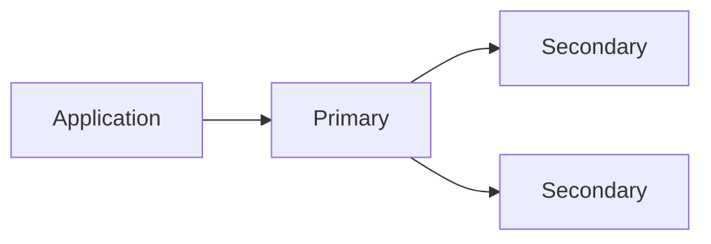
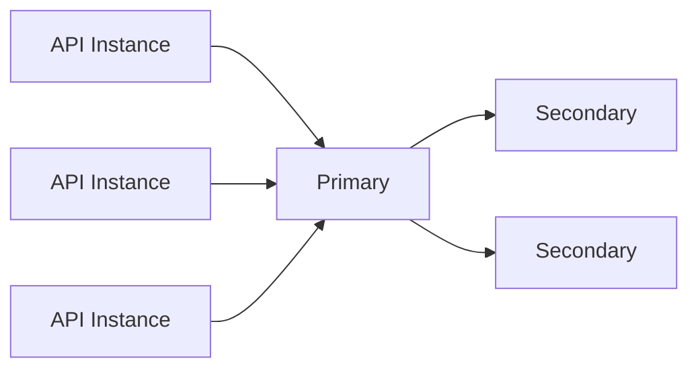
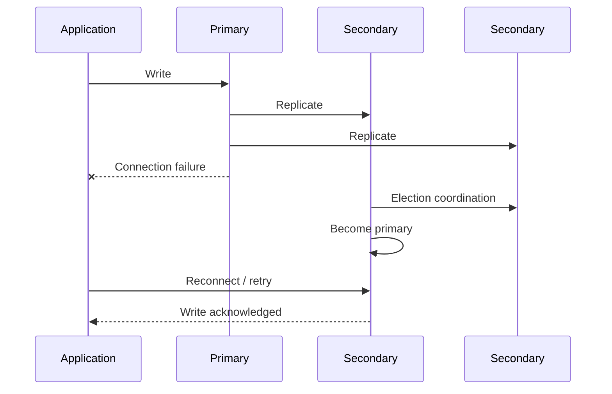
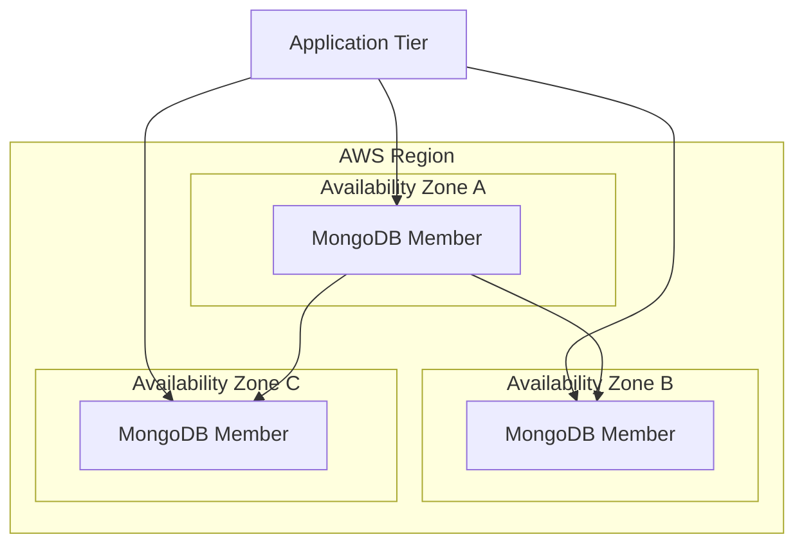
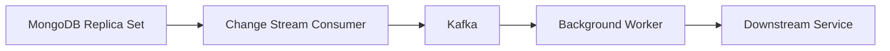
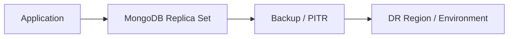

# 06- High Availability Deployment

## Overview

MongoDB high availability (HA) is the ability of a deployment to continue serving application traffic despite failures of individual database processes, hosts, network paths, or infrastructure components.

For MongoDB, high availability is primarily provided through replica sets. A replica set maintains multiple copies of data and uses an election mechanism to select a new primary when the current primary becomes unavailable.

A production HA design must consider more than simply running three MongoDB instances. It must address:

- Replica-set topology
- Failure domains
- Election behavior
- Write durability
- Read behavior
- Application connection handling
- Network connectivity
- Storage
- Monitoring
- Backup and disaster recovery
- Deployment and upgrade procedures

A useful mental model is:

```text
High Availability
        |
        +-- Replica Set
        |      |
        |      +-- Primary
        |      +-- Secondary
        |      +-- Secondary
        |
        +-- Application Topology Awareness
        |
        +-- Failure-Domain Separation
        |
        +-- Durable Storage
        |
        +-- Monitoring
        |
        +-- Recovery Procedures
```

High availability reduces downtime caused by component failures. It does not eliminate the need for backups or disaster recovery.

## High Availability vs Disaster Recovery

These concepts solve different problems.

| Capability | High Availability | Disaster Recovery |
|---|---|---|
| Primary host failure | Yes | Not primarily |
| Secondary failure | Yes, if quorum remains | Not primarily |
| Availability-zone failure | Potentially | Potentially, depending on topology |
| Accidental deletion | No | Yes, with appropriate backups |
| Application bug corrupting data | No | Potentially |
| Entire region failure | Not necessarily | Yes, with cross-region strategy |
| Recovery from backup | Not required for normal failover | Core capability |
| Primary objective | Minimize service interruption | Recover from major failure |

A three-member replica set can provide HA while still having a poor disaster recovery strategy if all members are located in one failure domain.

## Replica Set Architecture

A replica set consists of multiple MongoDB processes maintaining the same logical dataset.

A typical three-member topology is:



The primary normally receives writes.

Secondaries replicate the primary's operations.

If the primary becomes unavailable and an eligible secondary can establish a majority, an election can select a new primary.

The application should connect using a replica-set-aware URI rather than treating MongoDB as a single fixed server.

## Three-Member Replica Set

A common production topology is:

```text
Member 1
  Primary
  AZ-A

Member 2
  Secondary
  AZ-B

Member 3
  Secondary
  AZ-C
```

This provides a majority of:

```text
2 of 3
```

If one member fails, the remaining two can still form a majority.

The exact placement should account for the failure model of the underlying infrastructure.

## Majority and Quorum

For a replica set with `N` voting members, a majority is:

```text
floor(N / 2) + 1
```

Examples:

| Voting members | Majority |
|---:|---:|
| 3 | 2 |
| 5 | 3 |
| 7 | 4 |

Majority matters for elections and for operations using majority-related durability guarantees.

A deployment should not rely on a topology that loses voting majority during an expected infrastructure failure.

## Failure Domains

High availability requires independent failure domains.

Poor topology:

```text
Host A
  ├── MongoDB Member 1
  ├── MongoDB Member 2
  └── MongoDB Member 3
```

A single host failure can remove the entire replica set.

Better:

```text
AZ-A
  └── MongoDB Member 1

AZ-B
  └── MongoDB Member 2

AZ-C
  └── MongoDB Member 3
```

This reduces the probability that one infrastructure failure removes multiple voting members.

The correct topology depends on:

- Cloud provider
- Availability zones
- Network latency
- Compliance requirements
- Cost
- Disaster recovery objectives

## Application Connection Architecture

The application should be topology-aware.



A MongoDB URI can contain multiple members:

```text
mongodb://mongo-1.internal:27017,mongo-2.internal:27017,mongo-3.internal:27017/orders?replicaSet=rs0
```

The driver uses the topology information to identify the current primary.

Avoid application logic such as:

```python
MongoClient("mongodb://10.0.1.20:27017")
```

where the IP represents a particular primary host.

That creates a single-host dependency and undermines failover.

## Driver Topology Discovery

The MongoDB driver maintains information about the cluster topology.

Conceptually:

```text
Application
    |
    v
MongoClient
    |
    +-- Discover members
    |
    +-- Identify primary
    |
    +-- Monitor topology
    |
    +-- Route operations
```

The driver can detect topology changes and select an appropriate server.

This is one reason applications should use supported MongoDB drivers rather than implementing custom primary-discovery logic.

## Failover Flow

When a primary fails:



The exact election and retry timing depends on MongoDB configuration, network conditions, driver behavior, and workload.

Applications should therefore tolerate transient database connectivity errors during failover.

## Elections

An election occurs when the replica set needs to select a new primary.

Common triggers include:

- Primary process failure
- Host failure
- Network partition
- Administrative stepdown
- Replica-set reconfiguration
- Maintenance operations

An election is not instantaneous.

During the transition, applications may observe:

- Temporary write failures
- Connection errors
- Server selection delays
- Retryable errors
- Short periods without a primary

Production applications should be designed around this behavior.

## Primary Stepdown

A controlled primary stepdown is useful during maintenance and failover testing.

For example:

```javascript
rs.stepDown()
```

This causes the current primary to step down and allows another eligible member to be elected.

This should be performed only as part of a controlled operational procedure.

Never use production stepdown commands casually.

## Testing Failover

A high-availability deployment should be tested rather than assumed.

A controlled test might be:

```text
Verify replica health
        ↓
Generate controlled application traffic
        ↓
Step down primary
        ↓
Observe election
        ↓
Observe application errors/retries
        ↓
Verify new primary
        ↓
Verify writes
        ↓
Review metrics and logs
```

The objective is to validate the complete system:

```text
MongoDB
+
MongoDB Driver
+
Application
+
Load Balancer
+
Monitoring
```

Testing only the database election is insufficient.

## Write Concern and High Availability

Write concern influences durability behavior.

For example:

```python
from pymongo import WriteConcern

collection = db.get_collection(
    "orders",
    write_concern=WriteConcern(w="majority"),
)
```

A majority write concern requests acknowledgement based on the configured majority semantics.

This can reduce the risk of acknowledging a write that is present only on the primary and then losing that primary before replication to a majority.

The trade-off can include increased latency.

Therefore:

```text
Stronger durability
        ↕
Potentially higher latency
```

The correct configuration depends on the business requirements.

## Read Preference

High availability does not mean all reads should be sent to secondaries.

Common read preferences include:

| Mode | Typical behavior |
|---|---|
| `primary` | Read from primary |
| `primaryPreferred` | Prefer primary, allow fallback |
| `secondary` | Read from secondary |
| `secondaryPreferred` | Prefer secondary |
| `nearest` | Select eligible low-latency member |

For many transactional backend APIs, `primary` is the simplest consistency model.

Secondary reads can be appropriate for workloads such as:

- Reporting
- Analytics
- Non-critical dashboards
- Read-heavy workloads that tolerate lag

But replication lag must be considered.

## Read-After-Write Behavior

Consider:

```text
Client
  |
  | Create Order
  v
Primary
  |
  | Replication
  v
Secondary
  |
  | Read
  v
Client
```

If the application writes to the primary and immediately reads from a lagging secondary, the read may not observe the newly written data.

This is an important reason to avoid blindly enabling secondary reads for APIs requiring read-after-write consistency.

## Hidden Members

A hidden replica-set member does not normally receive application reads but can still maintain a copy of the data and participate in replication.

Potential uses include:

- Dedicated operational workloads
- Backup-related workloads
- Reporting under controlled conditions

Hidden members should be designed carefully because they still consume:

- CPU
- Memory
- Storage
- Network bandwidth

They are not free copies.

## Priority

Replica-set members can have different election priorities.

Priority affects which members are preferred as primary candidates.

A topology can therefore be designed so that certain members are preferred for primary service.

However, priority should not be used as a substitute for proper failure-domain design.

## Arbiters

An arbiter participates in elections but does not store application data.

This can make an arbiter useful in specific topologies, but it does not provide another copy of the dataset.

Conceptually:

```text
Primary      → Data
Secondary    → Data
Arbiter      → Voting only
```

For production systems where storage capacity permits, data-bearing members generally provide more useful failure tolerance than relying on an arbiter.

## Replication and the Oplog

MongoDB replication uses the oplog to record operations that secondaries replicate.

Conceptually:

```text
Primary
  |
  +-- Oplog
       |
       +-- Secondary 1
       |
       +-- Secondary 2
```

The oplog is a bounded collection.

If a secondary falls too far behind and the required operations are no longer available in the primary's oplog, the secondary may require an initial sync.

Therefore replication monitoring must include lag and oplog window considerations.

## Secondary Lag

Secondary lag can affect:

- Read consistency
- Failover readiness
- Backup processes
- Analytics workloads
- Recovery capability

Monitor:

```text
Replication lag
Oplog window
Disk latency
CPU utilization
Network throughput
Replication errors
```

A healthy replica set is not simply one where all members are reachable.

## Initial Sync

When a member needs to synchronize from scratch, it performs an initial sync process.

This can generate significant:

- Disk I/O
- Network traffic
- CPU usage
- Storage requirements

Do not casually add or rebuild replica members during peak workload periods without capacity analysis.

## Network Partitions

A network partition can be more complicated than a simple host failure.

For example:

```text
        Network Partition
             |
       +-----+-----+
       |           |
     Node A      Node B
     Primary     Secondary
```

MongoDB's election and majority mechanisms help prevent multiple primaries from being independently established under normal replica-set rules.

Applications should nevertheless expect transient connectivity errors during partition and recovery events.

## Split-Brain Considerations

A correct replica-set topology and quorum configuration help prevent multiple members from simultaneously acting as authoritative primary.

Application-side assumptions should therefore be:

```text
MongoDB determines primary
```

rather than:

```text
Application decides which server is primary
```

Do not implement custom primary-election logic in application code.

## Deployment Strategies

High-availability deployment should use controlled rollout strategies.

Common approaches include:

| Strategy | Use |
|---|---|
| Rolling update | Update members sequentially |
| Blue/green | Separate environments and switch traffic |
| Maintenance window | Planned controlled change |
| Managed service rollout | Provider-managed infrastructure change |

For replica sets, rolling maintenance generally means preserving sufficient healthy voting members throughout the operation.

## Rolling Replica-Set Maintenance

A simplified process is:

```text
Validate Replica Health
        ↓
Select One Member
        ↓
Perform Maintenance
        ↓
Verify Member
        ↓
Verify Replication
        ↓
Proceed to Next Member
        ↓
Verify Entire Replica Set
```

Do not take multiple voting members offline simultaneously unless the topology explicitly supports the resulting failure state.

## MongoDB Version Upgrades

A production upgrade should be planned around:

- MongoDB version compatibility
- Driver compatibility
- Application compatibility
- Feature compatibility
- Backup availability
- Rollback strategy
- Monitoring
- Replica-set health

A typical operational workflow is:

```text
Review Compatibility
        ↓
Test in Non-Production
        ↓
Validate Backup
        ↓
Upgrade According to Supported Procedure
        ↓
Monitor Replica Set
        ↓
Validate Application
        ↓
Continue Rollout
```

Do not treat a database version upgrade as an ordinary application restart.

## Docker High Availability

Running MongoDB in Docker does not automatically provide HA.

This:

```yaml
services:
  mongodb:
    image: mongo:8
```

creates one MongoDB container.

It does not create:

- A replica set
- Failover
- Multiple failure domains
- Automatic recovery
- Backup
- Distributed storage

A local Docker replica set can be useful for development and testing, but production MongoDB requires deliberate infrastructure design.

## Kubernetes High Availability

Kubernetes can restart failed containers, but restarting a MongoDB process is not equivalent to database high availability.

A production Kubernetes deployment must consider:

- Stateful storage
- Pod anti-affinity
- Failure domains
- Persistent volumes
- Replica-set topology
- Network identity
- Pod disruption budgets
- Backup
- Upgrade procedures
- Operator or management tooling

Conceptually:

```text
Kubernetes
    |
    +-- MongoDB Pod
    |      |
    |      +-- Persistent Volume
    |
    +-- MongoDB Pod
    |      |
    |      +-- Persistent Volume
    |
    +-- MongoDB Pod
           |
           +-- Persistent Volume
```

The MongoDB replica set remains responsible for database-level replication and elections.

## AWS High Availability

A self-managed AWS deployment can distribute replica-set members across availability zones.



The actual AWS architecture should use private networking and appropriate security controls.

Do not expose MongoDB directly to the public internet merely to make replica-set members reachable.

## MongoDB Atlas

MongoDB Atlas can provide managed infrastructure for high-availability deployments.

The application still needs to understand:

- Connection strings
- Network access
- Authentication
- TLS
- Read/write behavior
- Failover behavior
- Monitoring
- Backup configuration

Managed infrastructure reduces infrastructure-management work but does not eliminate application-level resilience requirements.

## Application Retry Strategy

During failover, a request may fail transiently.

A reasonable architecture is:

```text
HTTP Request
    ↓
Service
    ↓
MongoDB Driver
    ↓
Transient Database Error
    ↓
Bounded Retry if Safe
    ↓
MongoDB
```

Retries should be:

- Bounded
- Backoff-based
- Applied only where safe
- Observable

Do not retry non-idempotent business operations blindly.

For example, retrying an operation that triggers both a database mutation and an external payment call requires application-level idempotency, not merely a database driver retry.

## Transactions During Failover

Transactions can be affected by replica-set topology changes.

Applications should be prepared for transaction errors during:

- Primary stepdown
- Network interruption
- Election
- Transient topology changes

Transaction retry logic should follow MongoDB's supported retry patterns rather than implementing arbitrary loops.

For business operations, combine database transaction semantics with application-level idempotency.

## Change Streams and High Availability

Change streams can resume after certain interruptions when the application persists the appropriate resume token and the required history remains available.

A typical architecture is:



The consumer should consider:

- Resume tokens
- Network failures
- Primary elections
- Idempotent processing
- Backpressure
- Oplog/history availability

A change-stream consumer should not assume that a database connection remains permanently attached to one MongoDB member.

## Monitoring High Availability

Monitor the replica set continuously.

Important signals include:

| Metric / Signal | Why it matters |
|---|---|
| Primary availability | Indicates write availability |
| Member state | Detects unhealthy topology |
| Election events | Detects topology instability |
| Replication lag | Detects secondary degradation |
| Oplog window | Indicates replication/recovery headroom |
| Connections | Detects pool pressure |
| Disk latency | Detects storage bottlenecks |
| Disk capacity | Prevents storage exhaustion |
| CPU | Detects resource saturation |
| Memory | Detects working-set pressure |
| Network | Detects replication/connectivity issues |

Frequent elections should be investigated rather than treated as harmless noise.

## Alerting

Useful HA alerts include:

```text
No primary
Replica member unavailable
Replication lag above threshold
Oplog window below required threshold
Repeated elections
Disk capacity approaching limit
Connection pool saturation
Backup freshness outside RPO
```

Alert thresholds should reflect the actual workload and recovery objectives.

## High Availability and Backups

Replica sets do not replace backups.

Consider this scenario:

```text
Application Bug
      ↓
Incorrect Update
      ↓
Primary
      ↓
Replication
      ↓
Secondary 1
      ↓
Secondary 2
```

The incorrect operation can be replicated successfully to every member.

Backups provide a recovery path for logical corruption and other failure classes that replication cannot prevent.

## Disaster Recovery Architecture

For stronger recovery requirements, combine HA with independent backup and disaster recovery.



High availability protects against certain operational failures.

Disaster recovery protects against larger failures and data-loss scenarios.

## Security Considerations

High-availability members should all use appropriate security controls.

Consider:

- Authentication
- Authorization
- TLS
- Private networking
- Firewall/security-group restrictions
- Secret management
- Certificate rotation
- Encryption at rest
- Auditing
- Least privilege

Replica-set internal communication must also be secured appropriately.

Do not expose individual members publicly just because applications need topology discovery.

## Capacity Planning

HA increases resource consumption.

A replica set requires additional:

- Storage
- CPU
- Memory
- Network bandwidth
- Operational capacity

Replication also creates network traffic:

```text
Primary
  |
  +-- Replication Traffic → Secondary
  |
  +-- Replication Traffic → Secondary
```

Large write workloads can therefore increase network and storage requirements.

Capacity planning should include normal workload plus failure scenarios.

## Failure Scenario Planning

A production HA design should explicitly model failures.

| Failure | Expected behavior |
|---|---|
| Primary process failure | Eligible secondary can be elected |
| Secondary failure | Remaining members continue if majority remains |
| One availability zone failure | Depends on member distribution |
| Network partition | Majority rules determine primary availability |
| Disk failure | Member requires recovery/replacement |
| Application instance failure | Other application instances continue |
| Entire region failure | Requires DR strategy |
| Accidental data deletion | Requires backup/recovery strategy |

The design should document the expected behavior rather than relying on assumptions.

## Production HA Checklist

### Replica Set

- [ ] Replica set contains sufficient voting members.
- [ ] Members are distributed across appropriate failure domains.
- [ ] Members use durable storage.
- [ ] Replica-set configuration is documented.
- [ ] Primary election behavior has been tested.
- [ ] Secondary lag is monitored.
- [ ] Oplog window is monitored.

### Application

- [ ] Application uses a replica-set-aware connection string.
- [ ] MongoDB driver is current and supported.
- [ ] MongoDB client is reused per process.
- [ ] Connection pools are sized for the full fleet.
- [ ] Timeouts are configured.
- [ ] Retry behavior is bounded and observable.
- [ ] Business operations use idempotency where required.

### Security

- [ ] Authentication is enabled.
- [ ] TLS is configured where required.
- [ ] Replica members are on private networks.
- [ ] Least-privilege users are used.
- [ ] Secrets are externally managed.
- [ ] Certificate rotation is tested.

### Operations

- [ ] Elections are monitored.
- [ ] Replica health is monitored.
- [ ] Replication lag is monitored.
- [ ] Storage capacity is monitored.
- [ ] Backups are configured independently.
- [ ] Failover testing is performed.
- [ ] Upgrade procedures are documented.

## Common Mistakes

### Three Members on One Host

**Problem:** A host failure removes every replica member.

**Better approach:** Distribute members across independent failure domains.

### Application Connects to One MongoDB IP

**Problem:** The application cannot automatically adapt to primary changes.

**Better approach:** Use a topology-aware MongoDB URI and supported driver.

### Assuming Replication Equals Backup

**Problem:** Corrupted or accidentally deleted data can replicate to every member.

**Better approach:** Maintain independent backups and test restoration.

### Reading From Secondaries Without Considering Lag

**Problem:** The application can observe stale data.

**Better approach:** Use secondary reads only when the consistency model permits them.

### Over-Sized Connection Pools

**Problem:** Scaling the API fleet can exhaust database connections.

**Better approach:** Calculate connection capacity across all processes and instances.

### Testing Only MongoDB Failover

**Problem:** The database may fail over correctly while the application still fails requests.

**Better approach:** Test the complete application-to-database failover path.

### Treating Kubernetes Restart as HA

**Problem:** Process restart does not provide distributed database replication.

**Better approach:** Use a correctly configured MongoDB replica set and persistent storage.

## Troubleshooting

### No Primary

```text
Symptom
↓
Writes fail or applications report that no primary is available
↓
Possible causes
↓
Primary failure
Network partition
Election in progress
Insufficient voting majority
Replica-set configuration problem
Certificate or authentication failure
↓
Isolation strategy
↓
Inspect replica-set state, member reachability, election history, and network connectivity
↓
Diagnostic commands
```

```javascript
rs.status()
```

```javascript
rs.conf()
```

```javascript
db.hello()
```

```text
Root cause
↓
Determine whether the issue is member failure, network isolation, quorum loss, or configuration
↓
Corrective action
↓
Restore member connectivity or follow the replica-set recovery procedure
↓
Prevention
↓
Monitor member state and test controlled failover
```

### Replication Lag

```text
Symptom
↓
Secondary falls behind the primary
↓
Possible causes
↓
High write volume
Slow storage
CPU saturation
Network latency
Large replication workload
Long-running secondary workload
↓
Isolation strategy
↓
Compare replication lag with CPU, disk, network, and operation rates
↓
Diagnostic commands
```

```javascript
rs.status()
```

```javascript
rs.printSecondaryReplicationInfo()
```

```text
Root cause
↓
Secondary cannot process replicated operations at the required rate
↓
Corrective action
↓
Remove resource bottlenecks, reduce competing workload, or scale the topology
↓
Prevention
↓
Monitor lag, storage latency, and oplog window
```

### Application Does Not Recover After Failover

```text
Symptom
↓
MongoDB elects a new primary but application requests continue failing
↓
Possible causes
↓
Single-host connection string
Old client state
Excessive timeout
Incorrect retry handling
Connection pool exhaustion
Application-level retry bug
↓
Isolation strategy
↓
Verify driver topology discovery, connection URI, pool behavior, and application logs
↓
Diagnostic commands
↓
Application logs
MongoDB topology information
Connection metrics
Replica-set status
↓
Root cause
↓
Application is not correctly handling topology transition
↓
Corrective action
↓
Fix connection configuration or retry behavior
↓
Prevention
↓
Perform end-to-end failover testing before production rollout
```

### Repeated Elections

```text
Symptom
↓
MongoDB repeatedly changes primary
↓
Possible causes
↓
Unstable network
Resource exhaustion
Disk latency
Host instability
Misconfigured topology
Aggressive infrastructure maintenance
↓
Isolation strategy
↓
Correlate election events with host, network, CPU, memory, and storage metrics
↓
Diagnostic commands
```

```javascript
rs.status()
```

```text
Root cause
↓
Identify the infrastructure or database condition triggering elections
↓
Corrective action
↓
Fix the underlying stability problem
↓
Prevention
↓
Alert on election frequency and investigate recurring events
```

## Operational Runbook

A basic primary-failure runbook should follow this pattern:

```text
Detect Failure
    ↓
Confirm Replica-Set State
    ↓
Determine Whether a Primary Exists
    ↓
Verify Application Connectivity
    ↓
Allow / Initiate Supported Election Process
    ↓
Monitor New Primary
    ↓
Verify Replication
    ↓
Verify Application Writes
    ↓
Investigate Failed Member
    ↓
Recover or Replace Member
    ↓
Confirm Full Replica Health
```

Do not manually force topology changes before understanding the current replica-set state.

## Interview Focus

| Question | Key point |
|---|---|
| How does MongoDB provide HA? | Replica sets replicate data and elect a new primary when required |
| Why use three voting members? | Three members can maintain majority after one member fails |
| Why distribute members across availability zones? | To reduce correlated infrastructure failure |
| What happens when the primary fails? | Eligible members can conduct an election and select a new primary |
| Why does an application need a replica-set-aware URI? | The primary can change during failover |
| Does replication replace backups? | No; replicated corruption or deletion can affect every member |
| Why can secondary reads return stale data? | Secondaries can lag behind the primary |
| What is majority? | More than half of the voting members |
| What is an arbiter? | A voting member that does not store a copy of the data |
| Why monitor oplog window? | A lagging member may require initial sync if required history is no longer available |
| Why test application failover instead of only MongoDB failover? | Driver, pooling, retry, and application behavior can still fail |
| Does Kubernetes automatically make MongoDB highly available? | No; process orchestration is not a substitute for replica-set architecture |
| Why are retries during failover dangerous? | Unbounded retries can amplify load and duplicate unsafe operations |
| What is the difference between HA and DR? | HA handles component/service failures; DR handles larger-scale recovery scenarios |

## Key Takeaways

- **MongoDB high availability is primarily built around replica sets, quorum, elections, and topology-aware application drivers—not simply multiple MongoDB processes.**
- **Distribute replica-set members across independent failure domains and continuously monitor primary availability, elections, replication lag, oplog window, storage, and connections.**
- **Application resilience is part of MongoDB HA: use topology-aware connection strings, reusable clients, bounded timeouts, safe retries, and application-level idempotency.**
- **Replica sets provide availability but do not replace backups or disaster recovery; replicated data corruption and accidental deletion can affect every member.**
- **Validate HA through controlled failover, rolling maintenance, upgrade testing, and end-to-end application recovery tests rather than assuming the topology is resilient.**