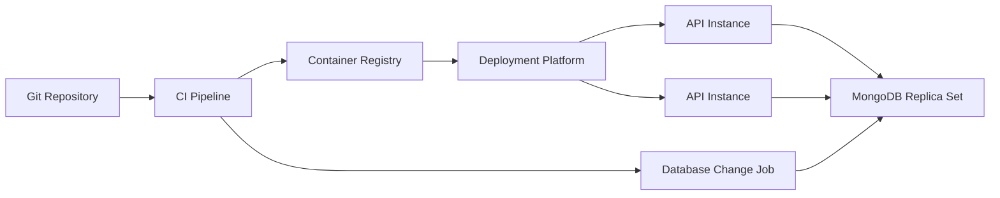
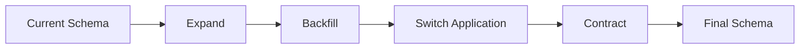
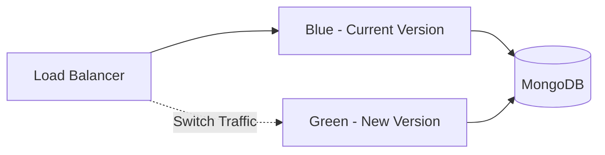
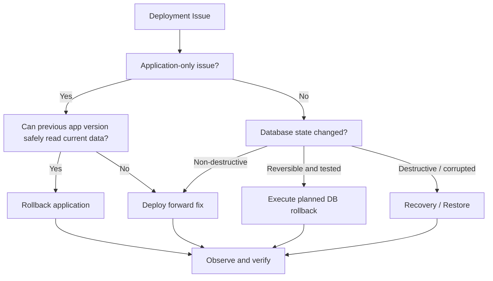
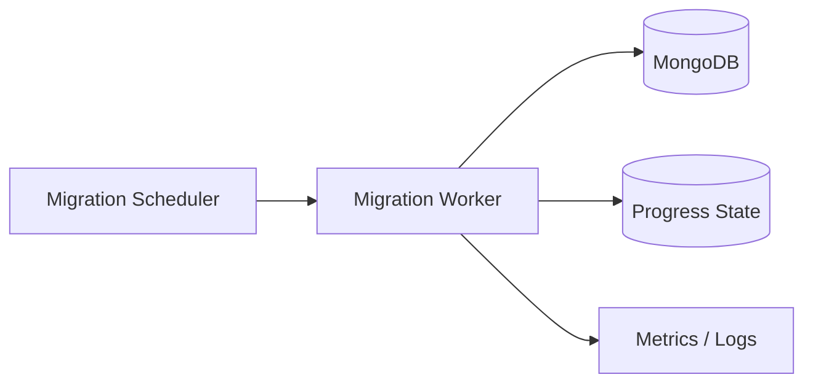

# 07- Deployment and Rollback Strategies

## Overview

MongoDB deployment strategy defines how database infrastructure, configuration, indexes, schema changes, application code, and MongoDB versions are introduced into production while minimizing downtime and operational risk.

MongoDB deployments require different rollout thinking from stateless application deployments because database state is persistent and changes can be difficult to reverse.

A production deployment should therefore distinguish between:

- Application deployment
- MongoDB configuration changes
- Index changes
- Schema changes
- Data migrations
- Replica-set maintenance
- MongoDB version upgrades
- Infrastructure changes
- Rollback procedures

The most important principle is:

> Application rollback and database rollback are not the same operation.

A previous application version can usually be redeployed quickly. A database change may already have modified millions of documents or created an index that cannot simply be "rolled back" by restoring an old application binary.

## Deployment Architecture

A typical backend deployment separates application rollout from MongoDB operations.



This separation allows database changes to be validated and executed independently from application instances.

## Deployment Principles

Production MongoDB deployments should follow these principles:

| Principle | Recommended approach |
|---|---|
| Backward compatibility | New application code should tolerate the existing database state |
| Forward compatibility | Database changes should support the application version being deployed |
| Reversibility | Prefer changes that can be safely reversed |
| Incremental rollout | Avoid unnecessary all-at-once changes |
| Observability | Monitor database and application behavior during rollout |
| Automation | Use repeatable CI/CD and migration procedures |
| Validation | Verify both database state and application behavior |
| Recovery | Maintain tested backup and recovery procedures |
| Isolation | Separate database changes from unrelated application changes |
| Auditability | Record what changed, when, and why |

## Deployment Types

MongoDB production deployments generally fall into several categories.

| Deployment type | Example | Typical risk |
|---|---|---|
| Application-only | Deploy new FastAPI version | Low to moderate |
| Index change | Add compound index | Moderate |
| Schema change | Add required field | Moderate to high |
| Data migration | Transform millions of documents | High |
| Configuration change | Replica-set or TLS configuration | Moderate to high |
| Infrastructure change | Replace database host | High |
| MongoDB upgrade | Version upgrade | High |
| Topology change | Add/remove replica member | Moderate to high |

The deployment strategy should match the failure impact of the change.

## Application Deployment vs Database Deployment

A useful separation is:

```text
Application Deployment
    |
    +-- Python code
    +-- FastAPI / Django
    +-- Docker image
    +-- Configuration

Database Deployment
    |
    +-- Indexes
    +-- Validation rules
    +-- Data migrations
    +-- Replica-set changes
    +-- MongoDB configuration
```

Do not hide destructive database operations inside application startup.

For example, avoid:

```python
@app.on_event("startup")
async def startup():
    migrate_all_documents()
```

A database migration can execute multiple times when several application instances start simultaneously.

Prefer an explicit migration job.

## Backward-Compatible Deployment

Backward compatibility is one of the most important concepts in safe database deployment.

Suppose the current document is:

```json
{
  "_id": "123",
  "name": "Aranya"
}
```

A new application requires:

```json
{
  "_id": "123",
  "name": "Aranya",
  "display_name": "Aranya Majumdar"
}
```

A dangerous deployment immediately requiring `display_name` can break existing documents.

A safer sequence is:

```text
Deploy code that supports both formats
        ↓
Backfill display_name
        ↓
Verify migrated documents
        ↓
Switch application behavior
        ↓
Remove legacy field usage later
```

This is commonly called an expand-and-contract approach.

## Expand-and-Contract Pattern

The pattern is useful for MongoDB schema evolution.



### Expand

Add the new field or structure without removing the old one.

### Backfill

Populate the new structure.

### Switch

Deploy application code that prefers the new structure.

### Contract

Remove obsolete fields or behavior only after the old application version is no longer required.

This approach reduces deployment coupling.

## Example Schema Migration

Suppose the old document contains:

```json
{
  "_id": "order-123",
  "customer": "Aranya"
}
```

The new structure is:

```json
{
  "_id": "order-123",
  "customer": {
    "name": "Aranya"
  }
}
```

Do not immediately delete the old field.

Instead:

```text
Phase 1
Read old + new

Phase 2
Write both

Phase 3
Backfill old documents

Phase 4
Read new

Phase 5
Stop writing old

Phase 6
Remove old
```

This is safer when multiple application versions may temporarily coexist during rolling deployment.

## Rolling Application Deployment

A rolling deployment replaces application instances gradually.

```text
Version 1
  |
  +-- API 1
  +-- API 2
  +-- API 3

Deploy Version 2

  |
  +-- API 1 → V2
  +-- API 2 → V1
  +-- API 3 → V1

Continue

  |
  +-- API 1 → V2
  +-- API 2 → V2
  +-- API 3 → V2
```

During the transition, both application versions may access MongoDB.

Therefore the database schema must support both versions.

## Rolling Deployment Requirements

Before using a rolling deployment, verify:

- Old and new application versions can coexist.
- Database changes are backward compatible.
- APIs remain compatible.
- Background workers can coexist.
- Celery workers can process both message formats where required.
- Kafka consumers can process old and new event formats.
- MongoDB indexes required by the new version exist before traffic reaches the new version.

## Blue-Green Deployment

Blue-green deployment maintains two application environments.



Advantages:

- Fast application rollback
- Clear separation between versions
- Production validation before traffic switching

The major limitation is that both versions may access the same MongoDB data.

Therefore database changes still need to be compatible with both application versions during the transition.

## Canary Deployment

A canary deployment sends a small percentage of traffic to the new application version.

```text
                    +-- V1 -- 95%
Client → Load Balancer
                    +-- V2 -- 5%
```

Monitor:

- Error rate
- MongoDB latency
- Query latency
- Connection pool usage
- CPU
- Memory
- Application exceptions
- Business metrics

If the canary behaves incorrectly, stop the rollout before increasing traffic.

## Deployment Strategy Comparison

| Strategy | Rollback speed | Database compatibility requirement | Infrastructure cost |
|---|---|---|---|
| Rolling | Fast | High | Low |
| Blue-green | Very fast for app | High | Higher |
| Canary | Controlled | High | Moderate |
| Big bang | Potentially slow | Moderate | Low |
| Maintenance window | Depends | Moderate | Variable |

For MongoDB-backed systems, database compatibility often matters more than the application deployment mechanism.

## Database Migration Jobs

Database migrations should generally run as explicit deployment jobs.

For example:

```text
CI/CD
  |
  +-- Build Application
  |
  +-- Run Tests
  |
  +-- Deploy Backward-Compatible Application
  |
  +-- Run Database Migration
  |
  +-- Validate
  |
  +-- Enable New Application Behavior
```

The exact ordering depends on the migration.

Some migrations should happen before application rollout because the new code requires an index or structure to exist.

## Migration Idempotency

A migration should ideally be safe to retry.

For example:

```python
from pymongo import ASCENDING


def ensure_customer_email_index(collection):
    collection.create_index(
        [("customer_id", ASCENDING), ("email", ASCENDING)],
        unique=True,
        name="customer_email_unique",
    )
```

The migration should have deterministic behavior and should not assume that it will run exactly once.

For data migrations, track progress where necessary.

## Large Data Migrations

A migration over millions of documents should not attempt to load the entire collection into application memory.

Avoid:

```python
documents = list(collection.find({}))
```

For large datasets, process bounded batches.

Conceptually:

```text
Collection
    ↓
Query Batch
    ↓
Transform
    ↓
Bulk Write
    ↓
Checkpoint
    ↓
Next Batch
```

A production migration should consider:

- Batch size
- Index usage
- Write throughput
- Lock/resource behavior
- Replication lag
- Failure recovery
- Runtime
- Idempotency
- Progress tracking

## Batch Migration Example

A migration can process documents in bounded batches.

```python
from pymongo import UpdateOne


def migrate_orders(collection, batch_size: int = 500):
    cursor = (
        collection.find(
            {"status": {"$exists": True}, "state": {"$exists": False}},
            {"_id": 1, "status": 1},
        )
        .sort("_id", 1)
        .batch_size(batch_size)
    )

    operations = []

    for document in cursor:
        operations.append(
            UpdateOne(
                {"_id": document["_id"]},
                {"$set": {"state": document["status"]}},
            )
        )

        if len(operations) >= batch_size:
            collection.bulk_write(operations, ordered=False)
            operations.clear()

    if operations:
        collection.bulk_write(operations, ordered=False)
```

The exact migration should be designed around the dataset and production workload.

For very large collections, a migration should also have an explicit progress and resume strategy rather than depending entirely on a single cursor execution.

## Index Deployment

Index creation is a database deployment operation.

Before adding an index, evaluate:

- Query shape
- Selectivity
- Sort requirements
- Index size
- Build resource consumption
- Write overhead
- Existing indexes
- Production traffic

Example:

```javascript
db.orders.createIndex(
  {
    customer_id: 1,
    status: 1,
    created_at: -1
  },
  {
    name: "customer_status_created_at"
  }
)
```

Do not create indexes blindly during application startup.

## Index Rollback

An index can often be removed independently:

```javascript
db.orders.dropIndex("customer_status_created_at")
```

However, dropping an index is not automatically safe.

Before removal:

- Confirm the index is unused or unnecessary.
- Check query performance.
- Verify alternative indexes exist.
- Monitor production workload.
- Understand whether another query depends on it.

Index rollback should be treated as a production change.

## Schema Validation Deployment

Schema validation changes require additional caution.

Suppose a collection currently contains:

```json
{
  "_id": 1,
  "status": "PAID"
}
```

and the new validation requires:

```text
customer_id
status
created_at
```

Applying strict validation immediately can cause existing or older application workflows to fail.

A safer rollout may be:

```text
Audit existing data
        ↓
Fix invalid documents
        ↓
Deploy compatible application
        ↓
Apply validation
        ↓
Monitor validation failures
```

Validation should be introduced with an explicit understanding of existing data.

## MongoDB Replica-Set Deployment

When modifying a replica set, preserve sufficient healthy members for the desired availability.

A simplified rolling procedure is:

```text
Check Replica Health
        ↓
Select Member
        ↓
Maintenance / Upgrade
        ↓
Verify Member
        ↓
Verify Replication
        ↓
Proceed
        ↓
Repeat
```

Do not take multiple voting members offline simultaneously without confirming that the remaining topology can maintain the required quorum.

## MongoDB Version Upgrades

MongoDB version upgrades require compatibility planning.

Before an upgrade, verify:

- Application driver compatibility
- MongoDB version compatibility
- Feature compatibility requirements
- Deployment topology
- Backup availability
- Recovery procedure
- Operational tooling
- Monitoring
- Performance impact

Test the exact upgrade path in a non-production environment.

## Feature Compatibility

MongoDB deployments can use feature compatibility controls to manage compatibility during certain version transitions.

The deployment procedure should follow the supported MongoDB upgrade path for the versions involved.

Do not manually change compatibility settings without understanding the upgrade procedure.

A version upgrade is not complete merely because the MongoDB process reports a newer binary version.

## Upgrade Strategy

A high-availability upgrade can generally follow a rolling pattern where supported:

```text
Validate Compatibility
        ↓
Validate Backup
        ↓
Upgrade Secondary
        ↓
Verify Secondary
        ↓
Repeat for Remaining Members
        ↓
Controlled Primary Transition
        ↓
Upgrade Former Primary
        ↓
Verify Entire Replica Set
        ↓
Complete Compatibility Transition
```

The exact sequence depends on the MongoDB versions and deployment model.

## Primary Stepdown During Maintenance

A controlled primary transition may be useful before planned maintenance.

Example:

```javascript
rs.stepDown()
```

This should only be executed as part of an approved maintenance procedure.

Before stepping down:

- Confirm secondary health.
- Confirm replication lag is acceptable.
- Confirm the application uses a topology-aware driver.
- Monitor application errors.
- Confirm the new primary.
- Verify writes after election.

## Rollback Strategy

Rollback should be classified by the type of change.

| Change | Typical rollback |
|---|---|
| Application code | Redeploy previous version |
| Configuration | Restore previous configuration |
| Index addition | Drop index if safe |
| Index removal | Recreate index |
| Additive field | Stop using field |
| Data transformation | Reverse migration if explicitly designed |
| Destructive migration | Restore or forward-fix |
| MongoDB version | Follow supported downgrade/recovery procedure |
| Data corruption | Restore/PITR and reconcile |

The safest rollback is one that does not require reversing database state.

## Forward Fix vs Rollback

A database rollback is often more dangerous than a forward fix.

For example:

```text
Buggy Application
      ↓
Writes New Field Incorrectly
      ↓
Database Contains Data
      ↓
Application Rolled Back
      ↓
Old Application Cannot Interpret New Data
```

In some cases, deploying a corrected application is safer than attempting to reverse all database writes.

This leads to an important production principle:

> Prefer backward-compatible and forward-fixable database changes over destructive rollback operations.

## Destructive Changes

Examples include:

- Dropping fields
- Deleting documents
- Dropping indexes required by the current application
- Changing data types
- Replacing nested structures
- Removing collections

Destructive changes should be delayed until:

```text
Old Application Removed
+
Migration Verified
+
Backup Validated
+
Rollback Window Closed
```

Do not combine destructive schema changes with the first deployment of new application behavior unless there is a strong reason.

## Deployment Gates

A production deployment can use explicit gates.

```text
Build
  ↓
Unit Tests
  ↓
Integration Tests
  ↓
Migration Validation
  ↓
Deploy
  ↓
Health Check
  ↓
Database Validation
  ↓
Traffic Increase
  ↓
Observe
  ↓
Complete / Roll Back
```

Useful gates include:

- Automated tests
- MongoDB connectivity check
- Replica-set health
- Migration status
- Index existence
- Query performance
- Application readiness
- Error rate
- Latency
- Business metrics

## CI/CD Integration

A GitHub Actions pipeline might conceptually separate application and database operations:

```yaml
jobs:
  test:
    runs-on: ubuntu-latest
    steps:
      - uses: actions/checkout@v4

      - name: Run tests
        run: pytest

  database-migration:
    needs: test
    runs-on: ubuntu-latest
    steps:
      - uses: actions/checkout@v4

      - name: Run database migration
        run: python scripts/migrate.py
        env:
          MONGODB_URI: ${{ secrets.MONGODB_URI }}
          MONGODB_DATABASE: ${{ vars.MONGODB_DATABASE }}

  deploy:
    needs: database-migration
    runs-on: ubuntu-latest
    steps:
      - name: Deploy application
        run: ./scripts/deploy.sh
```

The exact order should be adapted to whether the migration must occur before or after application deployment.

For backward-compatible expand-and-contract changes, the common sequence is:

```text
Deploy Compatible Code
        ↓
Run Migration
        ↓
Verify
        ↓
Enable New Behavior
```

## Kubernetes Deployment

A Kubernetes application rollout can be controlled using standard deployment mechanisms.

A database migration should generally be modeled separately from the API Deployment.

```text
Kubernetes Deployment
    |
    +-- API Pods

Migration Job
    |
    +-- MongoDB
```

Do not rely on every API pod running the migration independently.

A Kubernetes Job can provide a clearer operational boundary.

## Health Checks During Deployment

A readiness check should verify that the application is capable of serving traffic.

For a MongoDB-backed API, this may include:

```text
Process running
    +
Configuration valid
    +
MongoDB reachable
```

A readiness check should not execute expensive database queries on every probe.

Avoid:

```text
Readiness Probe
    ↓
Complex aggregation
    ↓
MongoDB
```

High-frequency health checks can themselves create unnecessary database load.

## Observability During Deployment

Monitor both database and application signals.

| Category | Signals |
|---|---|
| Application | Error rate, latency, throughput |
| MongoDB | Query latency, operations/sec |
| Connections | Active connections, pool wait |
| Replica set | Member health, elections, lag |
| Storage | Disk utilization, I/O latency |
| Indexes | Query usage, performance |
| Migration | Progress, failures, duration |
| Business | Orders, payments, workflow success |

A deployment should have a clear observation window after rollout.

## Deployment Verification

A production deployment should validate:

### Connectivity

```bash
mongosh "$MONGODB_URI" --eval 'db.runCommand({ ping: 1 })'
```

### Replica Set

```javascript
rs.status()
```

### Index

```javascript
db.orders.getIndexes()
```

### Query Performance

```javascript
db.orders.find({
  customer_id: ObjectId("64b000000000000000000001")
}).explain("executionStats")
```

### Application

```text
Health endpoint
Read API
Write API
Critical business workflow
```

Verification should reflect actual application behavior rather than only checking that the process started.

## Rollback Decision Tree



The decision should be based on the actual database state rather than automatically redeploying the previous application version.

## Rollback Runbook

A practical rollback procedure should include:

```text
Detect Deployment Failure
        ↓
Stop Further Rollout
        ↓
Identify Failure Scope
        ↓
Check MongoDB Health
        ↓
Determine Whether Database State Changed
        ↓
Check Application Compatibility
        ↓
Choose Rollback or Forward Fix
        ↓
Execute Controlled Change
        ↓
Verify Database
        ↓
Verify Application
        ↓
Monitor
        ↓
Document Incident
```

Do not execute destructive database rollback commands during an incident without confirming the recovery implications.

## Database Rollback Scenarios

### Additive Field

Usually easy to handle.

```text
New field added
    ↓
Old application ignores it
    ↓
Rollback application
```

No database rollback may be required.

### New Index

Usually reversible:

```javascript
db.orders.dropIndex("customer_status_created_at")
```

But verify that the current application does not depend on the index before removing it.

### Data Transformation

Potentially difficult.

```text
Old data
   ↓
Migration
   ↓
New data
```

If the transformation is not reversible, application rollback may be safer than data rollback.

### Destructive Migration

Potentially requires:

- Backup
- Point-in-time recovery
- Isolated restore
- Data reconciliation

This is why destructive changes should be delayed and carefully controlled.

## Backup Before High-Risk Changes

Before a high-risk database change, verify:

- Latest backup exists
- Backup is within RPO
- Restore procedure is documented
- Recovery environment is available
- Required credentials exist
- Recovery team understands the procedure

For very large databases, a backup does not mean an instant rollback. Restore time must be included in the RTO calculation.

## Migration Observability

Long-running migrations should emit structured progress information.

Example:

```python
logger.info(
    "MongoDB migration progress",
    extra={
        "migration": "backfill_order_state",
        "processed": processed,
        "batch_size": batch_size,
    },
)
```

Useful metrics include:

```text
Documents processed
Documents remaining
Documents failed
Batch duration
Total duration
Write throughput
Replication lag
```

Avoid logging every document individually for large migrations.

## Migration Failure Handling

A migration should distinguish:

```text
Transient failure
    ↓
Retry batch

Permanent data problem
    ↓
Record failure
    ↓
Continue or stop according to policy

Infrastructure failure
    ↓
Pause / resume migration

Unknown consistency problem
    ↓
Stop migration
    ↓
Investigate
```

Never automatically continue through unknown data corruption merely to make the migration finish.

## Long-Running Migration Strategy

For very large collections, consider an architecture such as:



The migration can then resume from a known checkpoint.

The checkpoint itself must be designed carefully so that a failed batch does not create inconsistent progress state.

## Deployment Security

Deployment credentials should have the minimum required privileges.

A CI/CD migration job may need permissions such as:

- Collection read/write
- Index management
- Schema validation changes

It should not automatically receive unrestricted cluster administration privileges unless required.

Separate identities are preferable:

```text
Application User
    ↓
Normal CRUD

Migration User
    ↓
Schema / Index Changes

Database Administrator
    ↓
Infrastructure Operations
```

This limits the blast radius of compromised deployment credentials.

## Production Pitfalls

### Treating Database Rollback Like Git Rollback

Git can restore source code easily. MongoDB data may already have changed irreversibly.

### Running Migrations From Every API Instance

Multiple application instances can execute the same migration concurrently.

Use an explicit migration job or controlled migration mechanism.

### Dropping Old Fields Immediately

Older application instances may still depend on those fields during a rolling deployment.

Use expand-and-contract.

### Creating Large Indexes During Peak Traffic

Index creation can consume significant resources.

Plan and monitor index operations.

### Deploying Application Before Required Indexes Exist

The new version may generate expensive queries or timeouts.

Deploy required indexes before enabling the query path when appropriate.

### Assuming Rollback Means Data Recovery

Rolling back the application does not undo database writes.

Use backups or a deliberately reversible migration when actual data rollback is required.

### No Migration Progress Tracking

A long migration can fail after hours with no clear resume point.

Use checkpoints and observable progress for large migrations.

## Reliability Considerations

A reliable MongoDB deployment process should provide:

- Backward-compatible application changes
- Controlled database migrations
- Tested rollback procedures
- Replica-set health checks
- Backup validation
- Observability
- Deployment gates
- Idempotent migrations
- Clear ownership

Reliability improves when the deployment process minimizes the number of irreversible operations.

## Cost Considerations

Deployment strategy can affect infrastructure cost.

Examples:

- Blue-green deployments may temporarily require additional application capacity.
- Large staging clusters increase testing cost.
- Online migrations consume production CPU, memory, I/O, and network.
- Additional replica members increase storage and compute cost.
- Cross-region deployment increases network and infrastructure costs.

Cost should be evaluated against availability and recovery requirements rather than optimized independently.

## Production Deployment Checklist

### Before Deployment

- [ ] Application and driver compatibility verified.
- [ ] MongoDB change reviewed.
- [ ] Migration tested on representative data.
- [ ] Required indexes identified.
- [ ] Backup freshness verified.
- [ ] Rollback or forward-fix strategy documented.
- [ ] Monitoring dashboards available.
- [ ] Alerts configured.
- [ ] Deployment owner identified.

### During Deployment

- [ ] Replica-set health remains healthy.
- [ ] Application error rate monitored.
- [ ] Database latency monitored.
- [ ] Connection pressure monitored.
- [ ] Migration progress monitored.
- [ ] Replication lag monitored.
- [ ] Traffic increased gradually where appropriate.

### After Deployment

- [ ] Critical APIs verified.
- [ ] Critical database queries verified.
- [ ] Indexes verified.
- [ ] Data migration verified.
- [ ] Replica-set health verified.
- [ ] Error rates returned to expected levels.
- [ ] Business workflows verified.
- [ ] Deployment evidence recorded.

## Interview Focus

| Question | Key point |
|---|---|
| Why is database rollback different from application rollback? | Application binaries are replaceable; persistent database changes may be irreversible |
| What is expand-and-contract? | A schema migration pattern that maintains compatibility while gradually moving to a new structure |
| Why should migrations be idempotent? | They may be retried after partial failures |
| Why separate migration jobs from API startup? | Multiple application instances can otherwise execute migrations concurrently |
| Why can an application rollback fail after a database migration? | The previous application may not understand the new database state |
| When is a forward fix preferable to rollback? | When database state has already changed and reversing it is riskier |
| Why can index changes require deployment planning? | Indexes consume storage and resources and affect query and write performance |
| Why are rolling deployments database-sensitive? | Old and new application versions can temporarily coexist |
| Why use canary deployments? | They limit exposure while validating the new application version |
| Why is a backup important before a destructive migration? | It provides a recovery path when the migration cannot be safely reversed |
| What should be monitored during a large migration? | Progress, errors, write throughput, latency, replication lag, and resource usage |
| Why should MongoDB upgrades be tested separately? | Database versions affect drivers, features, topology behavior, and operational procedures |

## Key Takeaways

- **Treat MongoDB deployment as a coordinated database-and-application change, not simply an application release with a database attached.**
- **Use backward-compatible expand-and-contract migrations so rolling, blue-green, and canary application deployments can safely coexist with the current database state.**
- **Prefer idempotent, observable migration jobs over database mutations hidden inside application startup, especially for large collections and multi-instance deployments.**
- **Do not assume application rollback reverses database changes; use forward fixes for compatible changes and tested recovery procedures for destructive or corrupted data.**
- **Production deployments should have explicit validation gates, backup verification, monitoring, failover awareness, and a documented rollback or recovery runbook.**