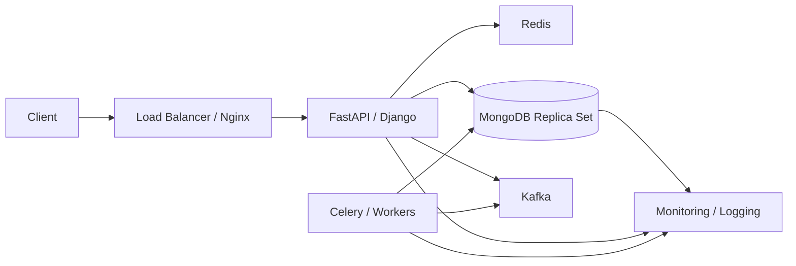

# README

## Overview

This directory covers production deployment of MongoDB for backend systems, from local and containerized environments through managed deployments, production configuration, high availability, and controlled deployment and rollback strategies.

The documentation focuses on deployment decisions rather than generic infrastructure tutorials. It connects MongoDB deployment with Python applications, FastAPI, Django, Docker, Kubernetes, CI/CD, networking, security, backups, observability, and production operations.

## Navigation

| # | File | Description |
|---|---|---|
| 01 | [01- Local MongoDB Deployment](./01-%20Local%20MongoDB%20Deployment.md) | Running MongoDB locally for development, testing, and backend application integration |
| 02 | [02- MongoDB Atlas Deployment](./02-%20MongoDB%20Atlas%20Deployment.md) | Deploying MongoDB using MongoDB Atlas, including networking, security, scaling, and backups |
| 03 | [03- Docker MongoDB Deployment](./03-%20Docker%20MongoDB%20Deployment.md) | Running MongoDB with Docker and Docker Compose, including persistence, networking, and authentication |
| 04 | [04- Production Configuration](./04-%20Production%20Configuration.md) | Production-oriented MongoDB configuration, resource settings, security, networking, and logging |
| 05 | [05- Environment Configuration](./05-%20Environment%20Configuration.md) | Environment-specific configuration, connection strings, secrets, and deployment practices |
| 06 | [06- High Availability Deployment](./06-%20High%20Availability%20Deployment.md) | Replica-set deployment, failover, elections, topology, availability, and production HA architecture |
| 07 | [07- Deployment and Rollback Strategies](./07-%20Deployment%20and%20Rollback%20Strategies.md) | Rolling, blue-green, canary, database migrations, backward compatibility, and rollback strategies |

## Deployment Progression

The recommended progression is:

```text
Local Deployment
      ↓
Atlas / Managed Deployment
      ↓
Docker Deployment
      ↓
Production Configuration
      ↓
Environment Configuration
      ↓
High Availability
      ↓
Deployment and Rollback Strategies
```

This progression moves from basic deployment mechanics toward production architecture and operational reliability.

## Deployment Architecture

A typical production MongoDB-backed backend can be structured as:



The database should be treated as a stateful production dependency with explicit availability, security, backup, and recovery requirements.

## Deployment Concerns

Production MongoDB deployment should address:

- Connection string and environment configuration
- Authentication and authorization
- TLS and network security
- Persistent storage
- Replica-set topology
- High availability
- Backup and recovery
- Monitoring and alerting
- Resource sizing
- Connection pooling
- Index deployment
- Schema migrations
- Deployment compatibility
- Rollback and forward-fix procedures
- Secret management
- Disaster recovery

## Environment Separation

A typical backend system should maintain clear configuration boundaries:

| Environment | Primary purpose | Typical MongoDB setup |
|---|---|---|
| Local | Developer workflow | Local MongoDB or Docker |
| Development | Shared integration | Isolated development database |
| Testing | Automated tests | Ephemeral or dedicated MongoDB |
| Staging | Production-like validation | Managed or dedicated deployment |
| Production | Live workloads | HA replica set or managed cluster |

Production credentials and connection strings should never be reused in lower environments.

## Production Deployment Principles

The deployment documentation follows several core principles:

- Treat MongoDB as persistent state, not an interchangeable application component.
- Keep configuration separate from application code.
- Store credentials in a secret-management system rather than source control.
- Use replica sets for production high availability where the workload requires them.
- Validate backups and recovery procedures rather than assuming backups are usable.
- Make schema and data migrations explicit and observable.
- Prefer backward-compatible changes during rolling deployments.
- Monitor MongoDB and application behavior together.
- Treat destructive database operations as high-risk production changes.
- Maintain a tested rollback or forward-fix strategy.

## Recommended Learning Order

For backend engineers building production MongoDB systems:

1. Understand local deployment and MongoDB connectivity.
2. Learn managed deployment with MongoDB Atlas.
3. Understand Docker-based MongoDB deployment.
4. Learn production configuration and resource management.
5. Understand environment and secret configuration.
6. Learn replica-set-based high availability.
7. Study deployment strategies, migrations, rollback, and recovery.

## Key Takeaways

- **MongoDB deployment should be designed around persistent state, availability, security, and recoverability rather than only process startup.**
- **Environment-specific configuration and secrets should remain separate from application source code and deployment artifacts.**
- **Production MongoDB deployments should explicitly address replica-set health, backups, monitoring, connection management, and failure recovery.**
- **Database migrations and application deployments must be coordinated through backward-compatible deployment strategies.**
- **The deployment strategy should evolve from local development toward managed, highly available, observable, and recoverable production infrastructure.**