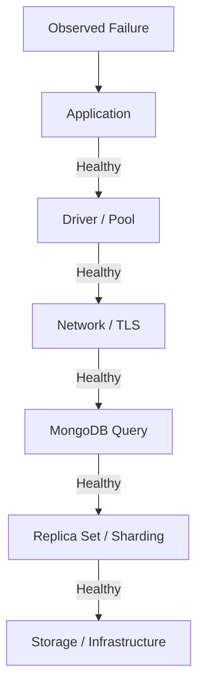

# 01- Troubleshooting Methodology

## Overview

MongoDB troubleshooting should be treated as a structured diagnostic process rather than a collection of commands to try until something works.

Production problems usually cross multiple layers:

```text
Application
    ↓
Driver / Connection Pool
    ↓
Network / TLS / Authentication
    ↓
MongoDB Query Layer
    ↓
Indexes / Query Planner
    ↓
Storage Engine / Memory
    ↓
Replica Set / Sharding
    ↓
Infrastructure
```

A useful troubleshooting process isolates these layers systematically.

The objective is not merely to restore service. A senior engineer should also determine:

- What failed?
- When did it fail?
- Which component introduced the failure?
- What evidence confirms the root cause?
- What was the production impact?
- Why was the problem not detected earlier?
- What prevents recurrence?

## Troubleshooting Principles

Use these principles during MongoDB incidents:

| Principle | Practice |
|---|---|
| Establish symptoms first | Describe the failure using observable facts |
| Preserve evidence | Capture logs, metrics, query plans, and topology state before changing anything |
| Isolate layers | Separate application, network, driver, MongoDB, and infrastructure problems |
| Change one variable at a time | Avoid making multiple unrelated changes during diagnosis |
| Prefer evidence | Use metrics and commands rather than assumptions |
| Protect production data | Avoid destructive diagnostic operations |
| Minimize blast radius | Prefer targeted corrective actions |
| Verify the fix | Confirm both technical and business behavior |
| Document the root cause | Record cause, evidence, correction, and prevention |

## Standard Troubleshooting Methodology

Use the following sequence for most MongoDB production incidents:

```text
Symptom
↓
Possible causes
↓
Isolation strategy
↓
Diagnostic commands
↓
Root cause
↓
Corrective action
↓
Prevention
```

Each stage has a different purpose.

### Symptom

Describe what is actually failing.

Examples:

```text
API requests return MongoServerSelectionTimeoutError.

Query latency increased from 20 ms to 2 seconds.

MongoDB primary changed unexpectedly.

Writes are timing out.

CPU increased after deployment.

Secondary replication lag is growing.

Aggregation queries consume excessive memory.
```

Avoid statements such as:

```text
MongoDB is slow.
```

Prefer:

```text
p95 latency for GET /orders increased from 80 ms to 1.8 s
after deployment version 2026.09.23. Connection pool wait
time also increased.
```

The second description provides measurable evidence and narrows the investigation.

## Possible Causes

Create hypotheses before running diagnostic commands.

For example:

```text
High API latency
    ├── Slow MongoDB query
    ├── Missing index
    ├── Query plan regression
    ├── Connection pool exhaustion
    ├── MongoDB CPU saturation
    ├── Storage latency
    ├── Network latency
    ├── Replica-set election
    └── Application-side processing
```

This prevents tunnel vision.

## Isolation Strategy

The next step is to determine which layer owns the failure.



Do not immediately assume that an application timeout means MongoDB itself is unhealthy.

## Evidence Collection

During an incident, capture evidence before making changes where possible.

Useful evidence includes:

- Application logs
- MongoDB logs
- Error rates
- Request latency
- MongoDB operation latency
- Connection counts
- Connection pool wait time
- CPU
- Memory
- Disk utilization
- Disk I/O latency
- Replica-set status
- Replication lag
- Current primary
- Query plans
- Index definitions
- Collection statistics
- Database statistics
- Recent deployments
- Recent configuration changes
- Recent migrations

A basic incident timeline is useful:

```text
14:02 Deployment started
14:05 API latency increased
14:06 MongoDB connection pool wait increased
14:07 Query latency increased
14:09 Error rate crossed alert threshold
14:12 Deployment stopped
14:15 Root cause identified
14:18 Corrective action applied
14:22 Metrics returned to baseline
```

## Establishing a Baseline

Troubleshooting is easier when normal behavior is known.

Record expected values for:

| Metric | Example baseline |
|---|---:|
| API p95 latency | 120 ms |
| MongoDB query p95 | 35 ms |
| Active connections | 180 |
| Replication lag | < 1 s |
| CPU | 40% |
| Disk utilization | 55% |
| Disk latency | < 5 ms |
| Error rate | < 0.1% |

The exact thresholds depend on the workload.

A metric is useful only when interpreted against expected behavior.

## Basic Connectivity Diagnosis

Start with the least expensive checks.

### MongoDB Ping

```javascript
db.runCommand({ ping: 1 })
```

From `mongosh`:

```bash
mongosh "$MONGODB_URI" --eval 'db.runCommand({ ping: 1 })'
```

A successful ping confirms that the client can communicate with a MongoDB server, but it does not prove that:

- Authentication is correctly configured for the application.
- The correct database is accessible.
- Queries are performant.
- The replica set is healthy.
- The application connection pool is healthy.

## Server Information

Inspect basic server information:

```javascript
db.serverStatus()
```

For targeted diagnostics, retrieve only the relevant sections rather than repeatedly collecting the entire output.

Examples include:

```javascript
db.serverStatus().connections
```

```javascript
db.serverStatus().opcounters
```

```javascript
db.serverStatus().network
```

```javascript
db.serverStatus().mem
```

## Database and Collection Inspection

Useful database-level information:

```javascript
db.stats()
```

Collection-level information:

```javascript
db.orders.stats()
```

These can help identify:

- Collection size
- Storage size
- Document count
- Index count
- Index size
- Storage growth

Statistics should be interpreted alongside workload and historical data.

## Connection Troubleshooting

Connection failures commonly originate from:

- Invalid connection string
- DNS failure
- Network restrictions
- Firewall rules
- Security group rules
- TLS configuration
- Authentication failure
- Incorrect replica-set name
- Server selection timeout
- Connection pool exhaustion
- MongoDB node failure

A useful diagnostic sequence is:

```text
Connection Failure
↓
Resolve hostname
↓
Check network reachability
↓
Check TLS
↓
Check authentication
↓
Check replica-set topology
↓
Check driver configuration
↓
Check connection pool
```

## DNS and Network Isolation

Before investigating MongoDB queries, verify basic connectivity.

From a container or host:

```bash
getent hosts mongodb.example.internal
```

For TCP connectivity:

```bash
nc -vz mongodb.example.internal 27017
```

On Windows, an equivalent connectivity check can be performed with:

```powershell
Test-NetConnection mongodb.example.internal -Port 27017
```

These checks establish whether the problem is occurring before MongoDB receives the request.

## Authentication Troubleshooting

Authentication failures commonly result from:

- Incorrect username
- Incorrect password
- Incorrect authentication database
- Wrong authentication mechanism
- Invalid credentials in the secret store
- Expired or rotated credentials
- Insufficient privileges

Check the effective user:

```javascript
db.runCommand({
  connectionStatus: 1,
  showPrivileges: true
})
```

Do not print passwords or complete connection strings containing credentials into logs.

## Authorization Troubleshooting

Authentication answers:

> Who are you?

Authorization answers:

> What are you allowed to do?

An authenticated application may still receive:

```text
not authorized on database to execute command
```

Investigate:

- User roles
- Target database
- Collection permissions
- Custom roles
- Recently changed privileges

Avoid immediately granting broad roles such as `root` or unrestricted administrative privileges.

## Driver and Connection Pool Diagnosis

Application-level MongoDB failures can occur even when the database itself is healthy.

For Python applications, investigate:

- `MongoClient` configuration
- `maxPoolSize`
- `minPoolSize`
- `maxConnecting`
- `waitQueueTimeoutMS`
- `serverSelectionTimeoutMS`
- `connectTimeoutMS`
- `socketTimeoutMS`
- Retry configuration
- Number of application processes
- Number of application instances

A useful mental model is:

```text
Application Instances
        ↓
Processes / Workers
        ↓
MongoClient per Process
        ↓
Connection Pool
        ↓
MongoDB Servers
```

Pool capacity must be evaluated across the entire application fleet, not just one process.

## Python Connection Diagnostics

A production application can expose safe health information without exposing credentials.

```python
from pymongo import MongoClient
from pymongo.errors import PyMongoError


def check_mongodb(client: MongoClient) -> bool:
    try:
        client.admin.command("ping")
        return True
    except PyMongoError:
        return False
```

Do not create a new `MongoClient` for every request.

Prefer a long-lived client per application process.

## Query Performance Troubleshooting

When an individual query is slow, start with the query itself.

Example:

```javascript
db.orders.find({
  customer_id: ObjectId("64b000000000000000000001"),
  status: "PAID"
}).sort({
  created_at: -1
}).explain("executionStats")
```

Inspect:

- `nReturned`
- `totalKeysExamined`
- `totalDocsExamined`
- Execution time
- `COLLSCAN`
- `IXSCAN`
- `FETCH`
- `SORT`

## Query Diagnosis Pattern

A useful interpretation is:

```text
High execution time
        ↓
Inspect totalDocsExamined
        ↓
Too many documents?
        ↓
Inspect index
        ↓
Check query shape
        ↓
Check sort
        ↓
Check selectivity
        ↓
Check working set / I/O
```

For example:

```text
nReturned = 20
totalDocsExamined = 850000
```

This indicates that MongoDB examined far more documents than it returned.

That does not automatically prove that an index is missing, but it is a strong signal that query/index design requires investigation.

## Detecting a Collection Scan

A query plan containing:

```text
COLLSCAN
```

means MongoDB is scanning collection documents rather than using an index for the relevant access path.

A collection scan may be acceptable for:

- Very small collections
- Administrative operations
- Queries where scanning is genuinely cheaper

It becomes a concern when a large collection is scanned for frequent production requests.

## Index Troubleshooting

Inspect indexes:

```javascript
db.orders.getIndexes()
```

Check index usage where appropriate:

```javascript
db.orders.aggregate([
  { $indexStats: {} }
])
```

Investigate:

- Missing indexes
- Incorrect compound ordering
- Low selectivity
- Duplicate indexes
- Unused indexes
- Excessive index count
- Large index footprint
- Index maintenance overhead

Do not add an index solely because a query is slow.

First determine the query shape and workload.

## Compound Index Diagnosis

Suppose the application frequently runs:

```javascript
db.orders.find({
  customer_id: ObjectId("64b000000000000000000001"),
  status: "PAID"
}).sort({
  created_at: -1
})
```

A candidate index could be:

```javascript
db.orders.createIndex({
  customer_id: 1,
  status: 1,
  created_at: -1
})
```

The index must be evaluated using actual query plans and workload behavior.

Consider:

- Equality fields
- Sort fields
- Range predicates
- Cardinality
- Query frequency
- Write overhead

## Aggregation Troubleshooting

Aggregation failures can originate from:

- Excessive input documents
- Late filtering
- Large `$group`
- Large `$sort`
- Expensive `$lookup`
- Excessive `$unwind`
- Large intermediate datasets
- Memory pressure
- Poor index support
- Application-side post-processing

Inspect the pipeline with:

```javascript
db.orders.explain("executionStats").aggregate([
  {
    $match: {
      status: "PAID"
    }
  },
  {
    $group: {
      _id: "$customer_id",
      total: { $sum: "$amount" }
    }
  }
])
```

A common optimization is to filter as early as possible:

```text
Large collection
      ↓
$match
      ↓
Smaller dataset
      ↓
$group / $sort / $lookup
```

## Pagination Troubleshooting

Large values of `skip()` can become inefficient because MongoDB still has to walk past skipped results.

Instead of:

```javascript
db.orders.find({
  customer_id: ObjectId("64b000000000000000000001")
})
.sort({ created_at: -1 })
.skip(100000)
.limit(50)
```

prefer keyset-style pagination when the access pattern supports it.

For example:

```javascript
db.orders.find({
  customer_id: ObjectId("64b000000000000000000001"),
  created_at: { $lt: ISODate("2026-09-23T10:00:00Z") }
})
.sort({ created_at: -1 })
.limit(50)
```

The query should have an appropriate supporting index.

## Replica-Set Troubleshooting

When MongoDB becomes unavailable or writes fail, inspect replica-set health.

```javascript
rs.status()
```

Also inspect configuration when necessary:

```javascript
rs.conf()
```

Important signals include:

- Primary availability
- Secondary health
- Election activity
- Replication lag
- Member state
- Last heartbeat
- Priority
- Hidden members
- Votes

## Replica-Set Failure Pattern

```text
Application Error
      ↓
Check Current Primary
      ↓
Check rs.status()
      ↓
Check Election Activity
      ↓
Check Secondary Health
      ↓
Check Replication Lag
      ↓
Check Network
      ↓
Check MongoDB Logs
```

An election can temporarily increase application latency or produce transient errors.

Topology-aware MongoDB drivers should generally handle normal topology changes, but application retry behavior still needs to be designed carefully.

## Replication Lag

Replication lag can be caused by:

- High write throughput
- Slow secondary storage
- CPU saturation
- Network latency
- Long-running operations
- Resource contention
- Initial synchronization
- Secondary maintenance

High lag can affect:

- Read-after-write behavior with secondary reads
- Recovery point
- Election readiness
- Backup/recovery assumptions
- Operational resilience

Do not treat replication lag as only a monitoring metric. It can be a direct reliability signal.

## Election Troubleshooting

Unexpected elections may be associated with:

- Node failure
- Network partition
- Process restart
- Resource exhaustion
- Host failure
- Container restart
- Kubernetes rescheduling
- Maintenance
- Clock or infrastructure problems

Investigate the event timeline rather than repeatedly forcing elections.

## Sharded Cluster Troubleshooting

For sharded MongoDB deployments, isolate the problem across:

```text
Client
  ↓
mongos
  ↓
Query Routing
  ↓
Config Servers
  ↓
Shard
  ↓
Replica Set
```

Common problems include:

- Poor shard-key selection
- Scatter-gather queries
- Hot shards
- Imbalanced distribution
- Config-server issues
- `mongos` connectivity problems
- Chunk movement pressure
- High shard CPU or storage usage

A slow query in a sharded cluster is not necessarily caused by the shard that ultimately performs the work. Query targeting and routing behavior must also be inspected.

## Change Stream Troubleshooting

Change stream failures can result from:

- Invalid or expired resume token
- Replica-set topology problems
- Network interruption
- Consumer crashes
- Authentication failure
- Insufficient privileges
- Incorrect resume handling

A consumer should persist resume information appropriately and make event processing idempotent.

Conceptually:

```text
MongoDB Change Stream
        ↓
Consumer
        ↓
Process Event
        ↓
Persist Processing State
        ↓
External Side Effect
```

The exact ordering depends on the consistency and delivery guarantees required by the application.

## Write Performance Troubleshooting

Write latency can increase because of:

- Excessive indexes
- Large documents
- High write volume
- Disk latency
- Majority acknowledgement
- Replication lag
- Hot documents
- Large transactions
- Storage saturation
- Resource contention

Check whether the slowdown is:

```text
Application serialization
        ↓
Network
        ↓
MongoDB processing
        ↓
Storage
        ↓
Replication acknowledgement
```

This prevents assuming that MongoDB query execution is the only contributor.

## Large Document Troubleshooting

Large documents can cause:

- Increased network transfer
- Higher memory usage
- More expensive updates
- Larger working sets
- Increased replication traffic
- Difficult document-level contention patterns

Investigate whether the document should be:

- Split
- Referenced
- Archived
- Accessed through projections
- Modeled differently

A large document is not automatically a problem, but unexplained document growth is an important design signal.

## Hot Document Troubleshooting

A hot document is frequently read or modified by many concurrent operations.

Examples include:

```text
Global counter
Shared account document
Inventory document
Frequently updated session
```

Symptoms can include:

- High write contention
- Increased latency
- Poor throughput
- Uneven workload distribution

Potential approaches include:

- Bucketing
- Sharding state
- Reducing update frequency
- Moving derived counters
- Using append-oriented models
- Redesigning the access pattern

## Memory and Working Set Troubleshooting

Performance can degrade when frequently accessed data and indexes no longer fit comfortably in available memory.

Investigate:

- Working set size
- Index size
- WiredTiger cache behavior
- Memory pressure
- Disk reads
- Host memory
- Container memory limits

Do not respond to every memory issue by simply increasing MongoDB memory allocation.

First determine what data is consuming memory and why.

## Storage Troubleshooting

Storage problems can appear as:

- Increased query latency
- Write latency
- Replication lag
- High I/O wait
- Disk-full conditions
- Unexpected storage growth

Inspect:

```javascript
db.stats()
```

and:

```javascript
db.orders.stats()
```

Also inspect the underlying host or container:

```bash
df -h
```

```bash
iostat
```

Storage diagnostics should correlate MongoDB metrics with infrastructure metrics.

## Logging Troubleshooting

MongoDB logs can help identify:

- Connection failures
- Authentication problems
- Elections
- Replication issues
- Slow operations
- Startup failures
- TLS errors
- Configuration problems

Application logs should include a request or trace identifier that can be correlated with database operations where practical.

Avoid logging:

- Passwords
- Connection strings containing credentials
- Sensitive document contents
- Authentication tokens
- Personal data unless explicitly required

## Monitoring During Troubleshooting

A production MongoDB dashboard should ideally provide:

```text
Application
├── Request rate
├── Error rate
└── Latency

MongoDB
├── Operations
├── Query latency
├── Connections
├── CPU
├── Memory
├── Storage
└── Locks / contention indicators

Replica Set
├── Primary
├── Member health
├── Elections
└── Replication lag

Infrastructure
├── CPU
├── Memory
├── Disk I/O
└── Network
```

The objective is correlation.

For example:

```text
API latency ↑
    +
MongoDB query latency ↑
    +
Disk latency ↑
```

provides stronger evidence than API latency alone.

## Recent Change Analysis

A powerful troubleshooting question is:

> What changed immediately before the problem?

Check:

- Application deployment
- MongoDB version
- Driver version
- Configuration
- Index changes
- Query changes
- Schema migration
- Traffic increase
- Infrastructure changes
- Kubernetes rollout
- Network policy
- Secret rotation
- Certificate rotation

Not every incident is caused by the most recent deployment, but deployment history should be part of the investigation.

## Query Regression After Deployment

A common production pattern is:

```text
Deployment
    ↓
Query shape changes
    ↓
Existing index no longer optimal
    ↓
Documents examined increase
    ↓
MongoDB CPU increases
    ↓
API latency increases
```

Compare query plans before and after deployment.

Do not assume that the same endpoint means the same database workload.

## Security Troubleshooting

Security-related failures should be isolated without weakening security controls as a first response.

Common symptoms:

| Symptom | Possible cause |
|---|---|
| Authentication failed | Invalid credentials or auth configuration |
| Not authorized | Missing role/privilege |
| TLS handshake failure | Certificate or TLS configuration |
| Connection timeout | Network restrictions |
| Works locally but not production | Network path or secret configuration |
| CI migration fails | Deployment identity lacks required privilege |

Avoid temporary fixes such as:

```text
Allow all IPs
Disable TLS
Grant root
Disable authentication
```

These may hide the actual problem while increasing security exposure.

## Troubleshooting With FastAPI

A FastAPI request may follow:

```text
HTTP Request
    ↓
FastAPI
    ↓
Dependency Injection
    ↓
Repository
    ↓
PyMongo
    ↓
MongoDB
```

When an endpoint fails, isolate each layer.

Example:

```python
@app.get("/orders/{order_id}")
def get_order(order_id: str):
    return repository.get_order(order_id)
```

Do not immediately blame MongoDB if the actual problem is:

- Invalid `ObjectId`
- Pydantic validation
- Serialization
- Repository logic
- Timeout configuration
- Incorrect database name

## Troubleshooting With Django

Django introduces additional layers:

```text
HTTP Request
    ↓
Django
    ↓
View / Service
    ↓
Repository
    ↓
PyMongo / MongoDB integration
    ↓
MongoDB
```

When MongoDB operations fail, inspect the application abstraction before assuming the database is responsible.

Do not apply relational ORM assumptions to MongoDB queries without verifying how the chosen Django integration implements them.

## Troubleshooting Background Workers

For Celery or other workers:

```text
Task Queue
    ↓
Worker
    ↓
MongoDB
```

A web request may succeed while the background worker fails because:

- Worker environment variables differ
- Worker network access differs
- Worker credentials differ
- Worker connection pools differ
- Worker concurrency is higher
- Worker uses a different application version

Always compare configuration across API and worker deployments.

## Kubernetes Troubleshooting

For containerized MongoDB clients, investigate:

```text
Pod
 ↓
Environment
 ↓
DNS
 ↓
NetworkPolicy
 ↓
Service / Endpoint
 ↓
TLS
 ↓
MongoDB
```

Useful commands include:

```bash
kubectl get pods
```

```bash
kubectl describe pod <pod-name>
```

```bash
kubectl logs <pod-name>
```

For network diagnostics, execute commands from the affected pod or a diagnostic pod rather than assuming the node network is equivalent.

## Docker Troubleshooting

A common mistake is using:

```text
mongodb://localhost:27017
```

inside an application container.

Inside the container, `localhost` refers to the application container itself.

With Docker Compose, use the MongoDB service name:

```text
mongodb://mongodb:27017/app
```

The exact hostname depends on the Compose service name and network configuration.

## Troubleshooting Environment Configuration

Compare effective configuration across environments without exposing secrets.

Useful fields include:

```text
MONGODB_DATABASE
MONGODB_HOST
MONGODB_PORT
MONGODB_AUTH_SOURCE
MONGODB_REPLICA_SET
MONGODB_TLS
```

Do not log:

```text
MONGODB_URI
```

if it contains credentials.

A safer diagnostic pattern is to log sanitized metadata:

```python
logger.info(
    "MongoDB configuration",
    extra={
        "database": settings.mongodb_database,
        "tls_enabled": settings.mongodb_tls,
        "replica_set": settings.mongodb_replica_set,
    },
)
```

## Common Troubleshooting Mistakes

### Restarting MongoDB Immediately

A restart may remove useful evidence and can make a topology problem worse.

First capture:

- Logs
- Replica status
- Resource metrics
- Current operations
- Recent changes

### Adding an Index Without Measuring

An index may improve one query while increasing write cost and memory usage.

Always validate with `explain()` and workload measurements.

### Increasing Timeouts to Hide Latency

Changing:

```text
serverSelectionTimeoutMS
socketTimeoutMS
```

may reduce visible errors while allowing slow operations to consume more resources.

Fix the underlying problem first.

### Increasing Connection Pool Size Indiscriminately

A larger pool can increase pressure on MongoDB.

Consider the entire fleet:

```text
instances × processes × pool size
```

### Granting Excessive Privileges

A permission error should not automatically result in `root`.

Determine the exact missing privilege.

### Reading From Secondaries to Hide Primary Load

Secondary reads change consistency and workload characteristics.

Use read preference deliberately.

### Using `skip()` for Deep Pagination

Large offsets can increase query work.

Prefer keyset-style pagination when the access pattern supports it.

### Running Expensive Diagnostics Repeatedly

Repeated statistics, aggregations, or profiling operations can create additional load.

Collect only the evidence required for the investigation.

## Production Incident Checklist

### Initial Response

- [ ] Identify the exact symptom.
- [ ] Determine affected services and users.
- [ ] Establish incident start time.
- [ ] Check recent deployments and configuration changes.
- [ ] Check MongoDB availability.
- [ ] Check application error rate and latency.
- [ ] Preserve relevant logs and metrics.

### Database Diagnosis

- [ ] Check connectivity.
- [ ] Check authentication and authorization.
- [ ] Check replica-set health.
- [ ] Check replication lag.
- [ ] Check connection pressure.
- [ ] Check CPU and memory.
- [ ] Check storage and I/O.
- [ ] Inspect affected query plans.
- [ ] Check index definitions and usage.
- [ ] Check recent schema or index changes.

### Corrective Action

- [ ] Identify the confirmed root cause.
- [ ] Choose the smallest safe corrective action.
- [ ] Avoid unrelated changes.
- [ ] Monitor during the change.
- [ ] Verify application behavior.
- [ ] Verify MongoDB health.

### After Recovery

- [ ] Confirm metrics returned to baseline.
- [ ] Document root cause.
- [ ] Document contributing factors.
- [ ] Record corrective actions.
- [ ] Identify monitoring gaps.
- [ ] Create prevention work where appropriate.
- [ ] Validate the incident timeline.

## Root Cause Analysis

A strong root cause statement should describe the technical chain.

Weak:

```text
MongoDB became slow.
```

Better:

```text
A new API query introduced a sort on created_at without a
supporting compound index. The query scanned approximately
850,000 documents for requests returning fewer than 50 documents.
MongoDB CPU increased and API p95 latency rose from 120 ms to 2.1 s.
```

An effective RCA should distinguish:

- Root cause
- Trigger
- Contributing factors
- Detection gap
- Impact
- Corrective action
- Preventive action

## Troubleshooting Decision Matrix

| Symptom | First checks |
|---|---|
| Cannot connect | DNS, network, TLS, authentication, topology |
| Authentication failure | Credentials, auth source, authentication mechanism |
| Authorization failure | User roles and target database |
| Query slow | `explain("executionStats")`, indexes, query shape |
| High CPU | Expensive queries, aggregations, workload increase |
| High memory | Working set, indexes, large documents |
| High disk I/O | Working set, scans, storage workload |
| Write latency | Indexes, disk, replication, hot documents |
| Replication lag | CPU, disk, network, write volume |
| Frequent elections | Node health, network, infrastructure |
| API timeout | Query latency, pool wait, server selection, network |
| Aggregation slow | Early `$match`, indexes, `$group`, `$sort`, `$lookup` |
| Worker failure | Worker configuration, credentials, network, pool |
| Deployment regression | Recent query/code/index/config changes |

## Troubleshooting Command Reference

| Purpose | Command |
|---|---|
| Connectivity | `db.runCommand({ ping: 1 })` |
| Server status | `db.serverStatus()` |
| Database statistics | `db.stats()` |
| Collection statistics | `db.collection.stats()` |
| List indexes | `db.collection.getIndexes()` |
| Index usage | `db.collection.aggregate([{ $indexStats: {} }])` |
| Query plan | `db.collection.find(...).explain("executionStats")` |
| Aggregation plan | `db.collection.explain("executionStats").aggregate([...])` |
| Replica status | `rs.status()` |
| Replica configuration | `rs.conf()` |
| Connection status | `db.runCommand({ connectionStatus: 1 })` |

## Interview Traps

### "A slow query means MongoDB needs an index."

Not necessarily.

The problem may be:

- Incorrect query shape
- Poor selectivity
- Wrong compound index ordering
- Large result set
- Blocking sort
- Large working set
- Storage latency
- Application-side processing

### "COLLSCAN is always bad."

No.

A collection scan over a tiny collection may be cheaper than using an index.

The relevant question is whether the execution plan is appropriate for the workload.

### "Increase connection pool size when requests timeout."

Not necessarily.

Timeouts may result from:

- MongoDB latency
- Connection establishment
- Server selection
- Pool exhaustion
- Network problems

Diagnose the specific timeout first.

### "Replica sets eliminate downtime."

Replica sets provide high availability mechanisms, but failover is not instantaneous and applications must tolerate topology changes.

### "Rolling back the application rolls back MongoDB."

It does not.

Database state may already have changed.

### "A backup means the system is recoverable."

Only if the backup can actually be restored within the required RPO and RTO.

## Key Takeaways

- **MongoDB troubleshooting should proceed from observable symptoms through layer isolation, evidence collection, diagnosis, corrective action, and prevention rather than trial-and-error changes.**
- **Query performance investigations should use real execution statistics, query shapes, index definitions, workload behavior, and resource metrics together.**
- **Production MongoDB incidents require database, driver, application, network, replica-set, and infrastructure signals to be correlated rather than investigated in isolation.**
- **Avoid destructive or broad corrective actions until the root cause is supported by evidence; preserve logs, topology state, query plans, and metrics whenever possible.**
- **A senior troubleshooting process ends with a verified root cause and preventive action, not merely the restoration of service.**