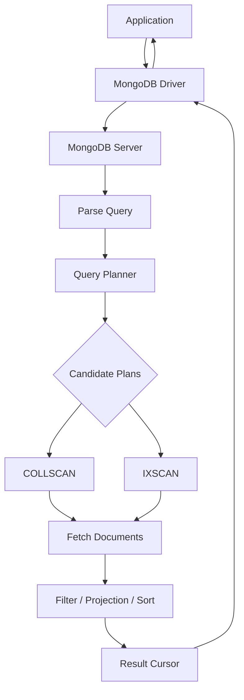

# 03- Query and Filter Issues

## Overview

MongoDB query and filter problems usually fall into one of four categories:

- The query returns incorrect documents.
- The query returns no documents when matches exist.
- The query returns too many documents.
- The query is logically correct but performs poorly.

The first three are primarily correctness problems. The fourth is a performance problem that can become a reliability problem under production load.

A senior engineer should therefore separate **query semantics** from **query execution**:

```text
Query correctness
    ↓
Does the filter express the intended business condition?
    ↓
Query execution
    ↓
Does MongoDB execute that condition efficiently?
    ↓
Production behavior
    ↓
Does latency, memory, CPU, and I/O remain acceptable at scale?
```

A query that returns the correct result but performs a collection scan across hundreds of millions of documents is still a production defect.

## Query Troubleshooting Model

Use the following workflow for query and filter incidents:

```text
Symptom
↓
Possible causes
↓
Isolation strategy
↓
Diagnostic commands
↓
Root cause
↓
Corrective action
↓
Prevention
```

The most important rule is to reproduce the exact query before changing indexes or application code.

## Query Execution Architecture

A simplified MongoDB query path is:



The query planner determines how MongoDB can satisfy the query.

The same logical filter can therefore have dramatically different execution costs depending on:

- Available indexes
- Selectivity
- Sort requirements
- Projection
- Data distribution
- Cardinality
- Query shape
- Collection size
- Working set
- Current server resources

## Establish the Exact Query

Before troubleshooting, capture:

- Collection name
- Exact filter
- Projection
- Sort
- Limit
- Skip
- Read preference
- Relevant application parameters
- Expected result
- Actual result
- Approximate collection size
- Expected latency

For example:

```javascript
db.orders.find(
  {
    customer_id: ObjectId("65f000000000000000000001"),
    status: "pending"
  },
  {
    _id: 1,
    total: 1,
    created_at: 1
  }
).sort({
  created_at: -1
}).limit(50)
```

Do not troubleshoot a query described only as:

```text
The orders query is slow.
```

The exact query shape matters.

## Query Filters

MongoDB filters are expressions describing which documents should match.

Equality:

```javascript
{ status: "pending" }
```

Comparison:

```javascript
{ total: { $gte: 100 } }
```

Multiple conditions:

```javascript
{
  status: "pending",
  total: { $gte: 100 }
}
```

Logical conditions:

```javascript
{
  $or: [
    { status: "pending" },
    { status: "processing" }
  ]
}
```

A query filter should represent the business requirement as precisely as possible.

## Equality Matching Problems

Consider:

```javascript
{ status: "pending" }
```

This does not match:

```javascript
{ status: "Pending" }
```

or:

```javascript
{ status: "PENDING" }
```

MongoDB string equality is case-sensitive unless the query explicitly uses another comparison strategy.

Common causes of unexpected empty results include:

- Case differences
- Leading/trailing whitespace
- Different field names
- Different BSON types
- Different nested paths
- Missing fields
- Incorrect ObjectId construction

## BSON Type Mismatches

MongoDB queries are type-sensitive.

Consider a document:

```javascript
{
  customer_id: ObjectId("65f000000000000000000001")
}
```

This filter is different:

```javascript
{
  customer_id: "65f000000000000000000001"
}
```

The second query searches for a string, not an `ObjectId`.

In Python:

```python
from bson import ObjectId

customer_id = ObjectId(customer_id_string)

document = collection.find_one({
    "customer_id": customer_id
})
```

A frequent API bug is accepting an ID as a string and forgetting to convert it before querying MongoDB.

## Diagnosing BSON Types

Inspect representative documents:

```javascript
db.orders.findOne(
  {},
  {
    customer_id: 1,
    status: 1
  }
)
```

Use `$type` when the type itself needs to be diagnosed:

```javascript
db.orders.aggregate([
  {
    $project: {
      customer_id_type: { $type: "$customer_id" }
    }
  },
  {
    $limit: 20
  }
])
```

The same logical field should generally use a consistent BSON type throughout the collection.

## Missing Fields vs Null Values

These queries are not equivalent:

```javascript
{ middle_name: null }
```

and:

```javascript
{ middle_name: { $exists: false } }
```

A null equality query can match documents where the field is absent as well as documents where the field contains `null`.

To specifically find missing fields:

```javascript
{
  middle_name: {
    $exists: false
  }
}
```

To specifically find explicit `null` values:

```javascript
{
  middle_name: {
    $type: 10
  }
}
```

This distinction becomes important when optional fields have business meaning.

## Comparison Operators

Common comparison operators include:

| Operator | Meaning |
|---|---|
| `$eq` | Equal |
| `$ne` | Not equal |
| `$gt` | Greater than |
| `$gte` | Greater than or equal |
| `$lt` | Less than |
| `$lte` | Less than or equal |
| `$in` | Matches any value in a list |
| `$nin` | Matches values not in a list |

Example:

```javascript
{
  status: {
    $in: ["pending", "processing"]
  },
  total: {
    $gte: 100
  }
}
```

Be careful with `$ne` and `$nin`. They often match a large portion of a collection and may provide poor selectivity.

## Logical Operators

### `$and`

Explicit `$and` is useful when multiple conditions require separate expressions on the same field:

```javascript
{
  $and: [
    { total: { $gte: 100 } },
    { total: { $lte: 1000 } }
  ]
}
```

For simple conditions on different fields, implicit conjunction is usually clearer:

```javascript
{
  status: "pending",
  total: { $gte: 100 }
}
```

### `$or`

```javascript
{
  $or: [
    { status: "pending" },
    { priority: "high" }
  ]
}
```

`$or` queries can require careful index design because each branch may have different selectivity.

### `$nor`

```javascript
{
  $nor: [
    { status: "cancelled" },
    { archived: true }
  ]
}
```

Use exclusion-heavy predicates carefully because they may match a large percentage of the collection.

## Array Query Problems

Consider:

```javascript
{
  tags: ["python", "mongodb", "backend"]
}
```

This query:

```javascript
{
  tags: "mongodb"
}
```

matches documents whose `tags` array contains `"mongodb"`.

Use `$all` when all specified values must exist:

```javascript
{
  tags: {
    $all: ["python", "mongodb"]
  }
}
```

Use `$elemMatch` when multiple conditions must apply to the same array element.

Example:

```javascript
{
  items: {
    $elemMatch: {
      sku: "SKU-100",
      quantity: { $gte: 5 }
    }
  }
}
```

Without `$elemMatch`, separate array predicates can potentially match different elements.

## `$elemMatch` Troubleshooting

Consider:

```javascript
{
  items: [
    { sku: "SKU-100", quantity: 2 },
    { sku: "SKU-200", quantity: 10 }
  ]
}
```

A query that independently tests:

```javascript
{
  "items.sku": "SKU-100",
  "items.quantity": { $gte: 10 }
}
```

can match based on different array elements.

If the business rule requires the same array element to satisfy both conditions, use:

```javascript
{
  items: {
    $elemMatch: {
      sku: "SKU-100",
      quantity: { $gte: 10 }
    }
  }
}
```

This is both a correctness and data-modeling concern.

## Embedded Document Queries

Consider:

```javascript
{
  customer: {
    id: ObjectId("65f000000000000000000001"),
    tier: "gold"
  }
}
```

A query on the complete embedded document:

```javascript
{
  customer: {
    id: ObjectId("65f000000000000000000001"),
    tier: "gold"
  }
}
```

has different semantics from querying individual fields:

```javascript
{
  "customer.id": ObjectId("65f000000000000000000001"),
  "customer.tier": "gold"
}
```

Field-level matching is generally preferable when the requirement is to match specific nested properties rather than an exact embedded-document structure.

## Dot Notation

Nested fields can be queried using dot notation:

```javascript
{
  "customer.address.country": "IN"
}
```

Nested array paths can also be queried:

```javascript
{
  "items.sku": "SKU-100"
}
```

A common mistake is confusing application object notation with MongoDB path notation.

Incorrect:

```javascript
{
  customer.address.country: "IN"
}
```

Correct:

```javascript
{
  "customer.address.country": "IN"
}
```

## Regex Query Problems

Regex queries are useful for controlled search requirements but can become expensive.

Example:

```javascript
{
  email: {
    $regex: "@example.com$"
  }
}
```

A leading wildcard-style pattern such as:

```javascript
{
  email: {
    $regex: ".*example.com"
  }
}
```

can prevent efficient index use.

Prefix queries are generally more index-friendly:

```javascript
{
  username: {
    $regex: "^admin"
  }
}
```

Even then, actual performance should be verified with `explain()`.

For user-facing full-text search, consider whether MongoDB's appropriate text-search capabilities or a dedicated search engine better matches the requirement.

## Case-Insensitive Search

A common mistake is:

```javascript
{
  email: {
    $regex: "^alice@example.com$",
    $options: "i"
  }
}
```

and assuming a normal index will automatically make this efficient.

Case-insensitive matching can have different index implications depending on the query and index configuration.

For high-volume lookup paths, model normalized values explicitly.

For example:

```javascript
{
  email: "alice@example.com",
  email_normalized: "alice@example.com"
}
```

Then index the normalized field:

```javascript
db.users.createIndex({
  email_normalized: 1
}, {
  unique: true
})
```

This is often easier to reason about for exact application lookups.

## `$exists` Problems

Example:

```javascript
{
  deleted_at: {
    $exists: false
  }
}
```

This can be useful for soft-delete models.

However, if most documents do not contain the field, the predicate may have limited selectivity.

A partial index can sometimes align the index with the actual active-document workload:

```javascript
db.orders.createIndex(
  {
    customer_id: 1,
    created_at: -1
  },
  {
    partialFilterExpression: {
      deleted_at: { $exists: false }
    }
  }
)
```

Index design should follow actual query patterns and data distribution.

## `$expr` Queries

`$expr` allows expressions to compare or calculate values during query evaluation.

Example:

```javascript
{
  $expr: {
    $gt: ["$total", "$discounted_total"]
  }
}
```

This is useful when the condition depends on relationships between fields.

However, expression-based predicates can be harder to optimize than straightforward indexed predicates.

Before using `$expr` in a high-volume path, inspect the execution plan.

## Projection Problems

Projection controls which fields are returned.

Example:

```javascript
db.orders.find(
  { status: "pending" },
  {
    _id: 1,
    customer_id: 1,
    total: 1
  }
)
```

Projection can reduce:

- Network payload
- Driver deserialization
- Application memory
- Serialization cost

However, projection alone does not guarantee that MongoDB avoids reading full documents.

A covered query requires the required fields to be available through the index without fetching documents.

## Covered Query

Suppose the query is:

```javascript
db.users.find(
  {
    tenant_id: "tenant-100",
    email: "alice@example.com"
  },
  {
    _id: 0,
    email: 1
  }
)
```

An appropriate index may allow MongoDB to satisfy the query directly from the index.

Verify with:

```javascript
db.users.find(
  {
    tenant_id: "tenant-100",
    email: "alice@example.com"
  },
  {
    _id: 0,
    email: 1
  }
).explain("executionStats")
```

Do not design every query around covered-query behavior. Index size and write overhead must also be considered.

## Sorting Problems

A query can be logically correct but slow because MongoDB must perform an in-memory or disk-backed sort.

Example:

```javascript
db.orders.find({
  customer_id: ObjectId("65f000000000000000000001")
}).sort({
  created_at: -1
})
```

An index aligned with the access pattern may avoid an expensive sort:

```javascript
db.orders.createIndex({
  customer_id: 1,
  created_at: -1
})
```

The exact index should be validated against the full query shape.

## Query and Sort Interaction

Consider:

```javascript
db.orders.find({
  tenant_id: "tenant-100",
  status: "pending"
}).sort({
  created_at: -1
}).limit(50)
```

A candidate index:

```javascript
{
  tenant_id: 1,
  status: 1,
  created_at: -1
}
```

aligns the equality predicates before the sort field.

The general ESR guideline is useful:

```text
Equality → Sort → Range
```

It is a guideline rather than a mechanical rule. Query selectivity, workload, sort requirements, and MongoDB planner behavior must still be evaluated.

## Pagination Problems

Offset pagination often looks simple:

```javascript
db.orders.find({
  customer_id: customer_id
})
.skip(100000)
.limit(50)
```

Large offsets can become increasingly expensive because the database still has to advance through preceding results.

For high-volume APIs, prefer keyset-style pagination.

Example:

```javascript
db.orders.find({
  customer_id: ObjectId("65f000000000000000000001"),
  created_at: {
    $lt: ISODate("2026-09-20T10:00:00Z")
  }
})
.sort({
  created_at: -1
})
.limit(50)
```

For deterministic pagination, use a unique tie-breaker when the primary sort field is not unique:

```javascript
{
  created_at: -1,
  _id: -1
}
```

The pagination predicate and index must be designed together.

## Cursor Misuse

MongoDB returns cursors for query operations.

A cursor should generally be consumed deliberately.

In Python:

```python
cursor = collection.find(
    {"status": "pending"},
    {"_id": 1, "customer_id": 1}
).limit(100)

for order in cursor:
    process(order)
```

Avoid unnecessarily materializing large result sets:

```python
orders = list(collection.find({}))
```

This can consume substantial application memory.

For large exports or batch processing, use controlled batches and cursor iteration.

## Query Result Explosion

A query can return far more data than the API actually needs.

Problem:

```python
orders = list(
    collection.find({
        "status": "pending"
    })
)
```

Better:

```python
cursor = (
    collection.find(
        {"status": "pending"},
        {"_id": 1, "customer_id": 1, "total": 1}
    )
    .limit(500)
)

for order in cursor:
    process(order)
```

For REST APIs, enforce sensible limits rather than allowing clients to request unbounded result sets.

## Index and Filter Mismatch

An index only helps when it aligns with the query workload.

Suppose the application primarily runs:

```javascript
{
  tenant_id: "tenant-100",
  status: "pending"
}
```

but the only index is:

```javascript
{
  created_at: -1
}
```

The existence of an index does not mean the query is indexed effectively.

Inspect the actual execution plan.

## Explain Plans

Use:

```javascript
db.orders.find({
  tenant_id: "tenant-100",
  status: "pending"
}).explain("executionStats")
```

Important metrics include:

| Metric | Meaning |
|---|---|
| `nReturned` | Documents returned |
| `totalKeysExamined` | Index entries examined |
| `totalDocsExamined` | Documents examined |
| `executionTimeMillis` | Observed execution time |
| `COLLSCAN` | Collection scan |
| `IXSCAN` | Index scan |
| `FETCH` | Document fetch |
| `SORT` | Explicit sort stage |

A useful first comparison is:

```text
totalDocsExamined / nReturned
```

A very high ratio can indicate poor selectivity or an inefficient plan.

It is not a universal correctness threshold, but it is a useful diagnostic signal.

## Detecting Collection Scans

Example:

```javascript
db.orders.find({
  customer_id: ObjectId("65f000000000000000000001")
}).explain("executionStats")
```

If the plan contains:

```text
COLLSCAN
```

MongoDB is scanning the collection rather than using an index for the relevant access path.

A collection scan is not automatically a defect.

It can be appropriate when:

- The collection is small.
- The query intentionally examines most documents.
- No selective index can help.

The issue is whether the scan is appropriate for the workload and scale.

## Detecting Excessive Document Examination

Suppose:

```text
nReturned = 20
totalDocsExamined = 2,000,000
```

The query may be returning only 20 documents but examining two million.

Potential causes include:

- Missing index
- Low-selectivity index
- Incorrect compound-index ordering
- Poor data distribution
- Query shape mismatch
- Regex or expression predicate
- Sort mismatch

Investigate the plan before adding indexes blindly.

## Detecting Excessive Key Examination

Consider:

```text
nReturned = 20
totalKeysExamined = 900,000
```

This suggests the index is being scanned much more broadly than the result set.

Possible causes:

- Low-selectivity leading index fields
- Poor compound index ordering
- Large range predicate
- `$ne` or `$nin`
- Poorly targeted query

The right fix may be a different index or a different data-access pattern.

## Slow Query Troubleshooting

Use this sequence:

```text
Slow query
↓
Capture exact query shape
↓
Measure latency
↓
Run explain("executionStats")
↓
Inspect winning plan
↓
Compare nReturned / keys / documents examined
↓
Check sort stages
↓
Check index alignment
↓
Check data distribution
↓
Change query or index
↓
Benchmark again
```

Do not jump directly from:

```text
Query is slow
```

to:

```text
Create an index
```

## Query Optimization Example

Initial query:

```javascript
db.orders.find({
  tenant_id: "tenant-100",
  status: "pending"
}).sort({
  created_at: -1
}).limit(50)
```

Suppose the collection contains millions of documents and the plan shows:

```text
COLLSCAN
SORT
```

A candidate index is:

```javascript
db.orders.createIndex({
  tenant_id: 1,
  status: 1,
  created_at: -1
})
```

Re-run:

```javascript
db.orders.find({
  tenant_id: "tenant-100",
  status: "pending"
}).sort({
  created_at: -1
}).limit(50).explain("executionStats")
```

The desired improvement is not merely:

```text
COLLSCAN → IXSCAN
```

You should also measure:

- Execution time
- Keys examined
- Documents examined
- Memory usage where relevant
- Application latency
- Write overhead introduced by the index

## Query Correctness vs Query Performance

| Situation | Correctness | Performance | Action |
|---|---|---|---|
| Correct result, fast | Good | Good | Keep |
| Correct result, slow | Good | Poor | Optimize |
| Incorrect result, fast | Poor | Good | Fix query |
| Incorrect result, slow | Poor | Poor | Fix semantics first |
| Empty result unexpectedly | Poor | Unknown | Verify field names/types |
| Too many results | Poor | Unknown | Review filter semantics |

Never optimize an incorrect query before establishing the intended behavior.

## Query Planner Issues

MongoDB's query planner evaluates candidate plans and selects a winning plan.

Possible causes of unexpected performance include:

- Data distribution changed
- Index became less selective
- Query shape changed
- Collection grew significantly
- Working set no longer fits memory
- Statistics or planner decisions changed
- A new index altered candidate plans

Use:

```javascript
db.orders.find({
  tenant_id: "tenant-100",
  status: "pending"
}).explain("allPlansExecution")
```

when deeper plan analysis is necessary.

Do not force an index with `hint()` as a permanent fix without understanding why the planner selected another plan.

## Index Hints

For diagnosis:

```javascript
db.orders.find({
  tenant_id: "tenant-100",
  status: "pending"
}).hint({
  tenant_id: 1,
  status: 1,
  created_at: -1
}).explain("executionStats")
```

`hint()` can help compare candidate indexes.

However, hard-coded hints create operational coupling.

A data distribution change can make a previously optimal index suboptimal.

Use hints deliberately and document why they are required.

## Aggregation Filter Problems

Filtering inside aggregation requires understanding pipeline order.

Prefer early filtering:

```javascript
db.orders.aggregate([
  {
    $match: {
      tenant_id: "tenant-100",
      status: "pending"
    }
  },
  {
    $group: {
      _id: "$customer_id",
      total: {
        $sum: "$total"
      }
    }
  }
])
```

This can reduce the number of documents entering later stages.

A common anti-pattern is processing the entire collection before applying a selective `$match`.

## `$lookup` Problems

A `$lookup` can create expensive workloads when the join side is large or insufficiently indexed.

Example:

```javascript
{
  $lookup: {
    from: "customers",
    localField: "customer_id",
    foreignField: "_id",
    as: "customer"
  }
}
```

Troubleshoot:

- Join cardinality
- Foreign-field indexing
- Number of input documents
- Pipeline ordering
- Unnecessary fields
- Result size

Do not assume that because MongoDB is document-oriented, every relationship should be embedded.

## Filter Problems in Python

Build filters explicitly and validate external input.

Avoid directly constructing query operators from untrusted request JSON.

For example, an API that accepts:

```json
{
  "filter": {
    "$where": "..."
  }
}
```

can create serious security and performance problems.

Application code should define the allowed query surface.

Example:

```python
def build_order_filter(status: str | None, customer_id: str | None) -> dict:
    query: dict = {}

    if status is not None:
        query["status"] = status

    if customer_id is not None:
        query["customer_id"] = ObjectId(customer_id)

    return query
```

Treat query construction as an input-validation boundary.

## NoSQL Injection Considerations

MongoDB applications can be vulnerable to query injection when untrusted input is inserted directly into MongoDB operators or expressions.

Risky pattern:

```python
query = request.json["filter"]
collection.find(query)
```

Safer design:

```python
query = {}

if request.json.get("status"):
    query["status"] = request.json["status"]
```

Define an explicit application-level query schema.

This is especially important for:

- REST APIs
- Admin search APIs
- Reporting endpoints
- Dynamic filtering
- Multi-tenant systems

## Multi-Tenant Filter Problems

A common production failure is accidentally omitting the tenant predicate.

Unsafe:

```javascript
{
  status: "pending"
}
```

Safer:

```javascript
{
  tenant_id: tenant_id,
  status: "pending"
}
```

For multi-tenant systems, tenant isolation should be enforced by the application architecture rather than relying on individual developers to remember a filter everywhere.

Repository methods can help centralize this behavior.

## Soft Delete Problems

A soft-delete model might use:

```javascript
{
  deleted_at: null
}
```

or:

```javascript
{
  deleted_at: ISODate("...")
}
```

The application must define consistent semantics.

For example:

```javascript
{
  tenant_id: "tenant-100",
  deleted_at: null,
  status: "active"
}
```

If some code uses:

```javascript
{ deleted_at: { $exists: false } }
```

while other code uses:

```javascript
{ deleted_at: null }
```

the application may produce inconsistent results.

Standardize the data model and query behavior.

## Time and Date Filter Problems

Dates should be stored consistently as BSON dates rather than arbitrary strings when range queries are required.

Preferred:

```javascript
{
  created_at: ISODate("2026-09-20T10:00:00Z")
}
```

Then:

```javascript
{
  created_at: {
    $gte: ISODate("2026-09-20T00:00:00Z"),
    $lt: ISODate("2026-09-21T00:00:00Z")
  }
}
```

Avoid ambiguous local-time strings for production timestamps.

For APIs, define timezone semantics explicitly.

## Inclusive vs Exclusive Time Ranges

A robust interval often uses:

```text
[start, end)
```

For example:

```javascript
{
  created_at: {
    $gte: start,
    $lt: end
  }
}
```

This avoids overlapping adjacent windows.

For daily processing:

```text
2026-09-20T00:00:00Z
≤ created_at <
2026-09-21T00:00:00Z
```

This is particularly useful for:

- Reports
- ETL jobs
- Celery tasks
- Kafka event processing
- Batch exports

## Query Problems in Background Jobs

Batch jobs frequently fail because they assume a stable result set.

Example:

```python
for document in collection.find({"status": "pending"}):
    process(document)
```

If processing changes documents while the cursor is being consumed, the effective workload can become difficult to reason about.

For large workflows, consider:

- Stable batching
- Explicit state transitions
- Deterministic sort
- `_id` or another stable cursor
- Idempotent processing
- Retry-safe updates

A production batch query should have a clear concurrency model.

## Query Consistency Problems

In replica-set deployments, read preference affects which member serves a query.

Possible behavior includes:

```text
primary
primaryPreferred
secondary
secondaryPreferred
nearest
```

Reading from secondaries can introduce replication-lag-related staleness.

A query returning older data is not necessarily a query bug.

Investigate:

- Read preference
- Read concern
- Replica lag
- Application consistency requirements

## Production Query Troubleshooting Checklist

### Correctness

- [ ] Verify the exact filter.
- [ ] Verify field names.
- [ ] Verify BSON types.
- [ ] Check missing vs `null`.
- [ ] Check array semantics.
- [ ] Check `$elemMatch` requirements.
- [ ] Check nested field paths.
- [ ] Check date/time boundaries.
- [ ] Check case sensitivity.
- [ ] Check tenant and soft-delete predicates.

### Performance

- [ ] Run `explain("executionStats")`.
- [ ] Check for `COLLSCAN`.
- [ ] Check `IXSCAN`.
- [ ] Check `nReturned`.
- [ ] Check `totalKeysExamined`.
- [ ] Check `totalDocsExamined`.
- [ ] Check for blocking sort stages.
- [ ] Review compound index ordering.
- [ ] Review selectivity.
- [ ] Check collection growth.
- [ ] Check working-set behavior.

### Application

- [ ] Validate external filter input.
- [ ] Convert ObjectId values correctly.
- [ ] Enforce tenant isolation.
- [ ] Limit result sizes.
- [ ] Avoid unbounded `list(cursor)` operations.
- [ ] Use deterministic pagination.
- [ ] Ensure background jobs are idempotent.

### Operational

- [ ] Compare application and database latency.
- [ ] Check replica-set health.
- [ ] Check replication lag.
- [ ] Check connection-pool behavior.
- [ ] Check recent deployments.
- [ ] Check recent index changes.
- [ ] Compare current data distribution with historical behavior.

## Common Mistakes

### Adding an Index Without Measuring

Problem:

```text
Query slow
↓
Add random index
```

Why it fails:

- The index may not match the query.
- It may increase write cost.
- It may increase memory pressure.
- It may create competing candidate plans.

Correct approach:

```text
Measure
→ Explain
→ Design index
→ Benchmark
→ Monitor
```

### Using `skip()` for Deep Pagination

Problem:

```javascript
.skip(500000)
```

Why it fails:

MongoDB must advance through preceding results.

Prefer range/keyset pagination for large datasets.

### Returning Entire Documents

Problem:

```javascript
find({})
```

with large documents.

Why it fails:

- Higher I/O
- Higher network cost
- Higher application memory usage
- Higher serialization cost

Use projection and bounded result sets.

### Querying the Wrong BSON Type

Problem:

```javascript
{
  _id: "65f000000000000000000001"
}
```

when `_id` is an `ObjectId`.

Fix:

```javascript
{
  _id: ObjectId("65f000000000000000000001")
}
```

### Forgetting Tenant Filters

A missing tenant predicate can become a severe security issue, not merely a query bug.

### Treating `null` and Missing as Identical

Application semantics should explicitly define whether:

```text
field missing
```

and:

```text
field = null
```

represent the same state.

### Assuming Every Index Is Useful

Indexes have costs.

Each additional index can consume:

- Disk
- Memory
- Write bandwidth
- Build time
- Operational maintenance

## Production Query Review

Before shipping a high-volume query, review:

| Area | Questions |
|---|---|
| Correctness | Does the filter represent the exact business rule? |
| Types | Are BSON types consistent? |
| Security | Can users manipulate operators or bypass tenant filters? |
| Indexing | Is the access pattern supported by an appropriate index? |
| Sort | Can the required ordering be served efficiently? |
| Pagination | Is it stable and scalable? |
| Projection | Are unnecessary fields excluded? |
| Cardinality | How many documents can match? |
| Memory | Can result processing exceed application memory? |
| Consistency | Is the selected read behavior appropriate? |
| Scale | How does the query behave at production data volume? |
| Observability | Can latency and failures be measured? |

## Query Regression Prevention

Query performance can degrade without application code changing.

Possible causes:

```text
Collection growth
    ↓
Data distribution changes
    ↓
Index selectivity changes
    ↓
Working set changes
    ↓
Query latency increases
```

Protect important query paths with:

- Representative production-like datasets
- Explain-plan reviews
- Performance benchmarks
- Slow-query monitoring
- Index lifecycle reviews
- Regression tests for critical access patterns
- Application-level latency metrics

A query that performs well against 10,000 documents should not automatically be assumed to perform well against 500 million.

## Interview Traps

### "If the query uses an index, it is optimized."

Not necessarily.

Inspect:

```text
nReturned
totalKeysExamined
totalDocsExamined
executionTimeMillis
```

An inefficient index can still examine a large number of keys.

### "COLLSCAN always means the query is bad."

Not necessarily.

For a small collection or a query returning most documents, a collection scan can be appropriate.

### "`$elemMatch` is only syntactic sugar."

No.

It can change the semantics of how multiple predicates apply to array elements.

### "`skip()` is always fine for pagination."

It can be acceptable for shallow pagination, but deep offsets can become increasingly expensive.

### "Projection makes every query covered."

No.

Projection reduces returned fields but does not automatically eliminate document fetches.

### "Adding more indexes always improves reads."

No.

Indexes consume storage and memory and add write and maintenance overhead.

### "A query returning old data is necessarily wrong."

Not necessarily.

Read preference and read concern can intentionally allow reads from secondaries or different consistency characteristics.

## Key Takeaways

- **Troubleshoot MongoDB queries in two dimensions: first verify filter correctness, then analyze execution efficiency with `explain("executionStats")`.**
- **BSON type mismatches, array semantics, missing-vs-null behavior, date boundaries, and nested-field paths are common causes of incorrect query results.**
- **Index design must follow actual query patterns, including equality predicates, sorting, ranges, selectivity, and pagination requirements; adding indexes blindly creates long-term write and memory costs.**
- **Production APIs should enforce bounded result sets, deterministic pagination, validated filter input, projection, and tenant isolation rather than exposing unrestricted MongoDB queries.**
- **A query must be evaluated against production-scale data and workload characteristics because collection growth, data distribution, replication behavior, and working-set changes can turn a previously acceptable query into an operational problem.**