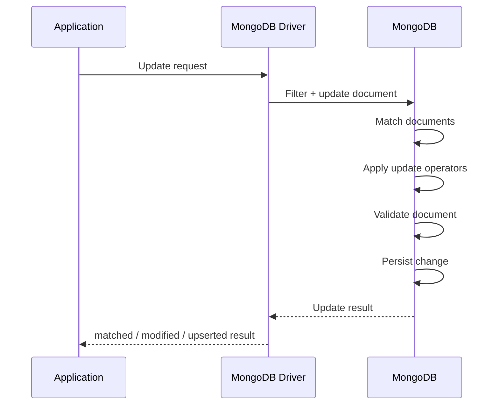
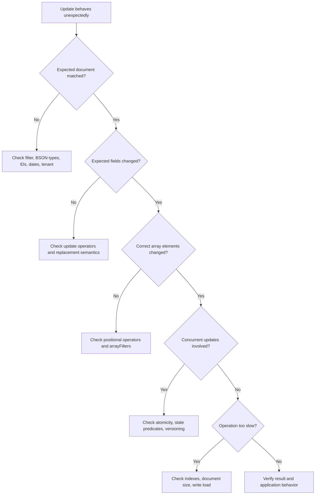

# 04- Update and Array Operation Issues

## Overview

MongoDB update problems are often more dangerous than simple query failures because an incorrect read usually affects one request, while an incorrect update can modify thousands or millions of documents.

The main troubleshooting categories are:

- The update matches no documents.
- The update matches the wrong documents.
- The update changes the wrong fields.
- An array update modifies unintended elements.
- An update creates an unexpected document through upsert.
- A replacement operation removes fields unintentionally.
- Concurrent updates produce unexpected application state.
- Updates are correct but become slow at production scale.
- Retry behavior causes duplicate or repeated state transitions.

A production update should therefore be analyzed across three dimensions:

```text
Filter correctness
        ↓
Does the update target exactly the intended documents?
        ↓
Update semantics
        ↓
Does the update modify exactly the intended fields/elements?
        ↓
Operational behavior
        ↓
Is the operation safe under concurrency, retries, and production scale?
```

MongoDB single-document writes are atomic, but atomicity does not make an incorrectly designed update safe.

## Update Troubleshooting Model

Use the following workflow for update incidents:

```text
Symptom
↓
Possible causes
↓
Isolation strategy
↓
Diagnostic commands
↓
Root cause
↓
Corrective action
↓
Prevention
```

For destructive or high-volume updates, first inspect the filter with a `find()` query before executing the update.

## MongoDB Update Architecture

A simplified update lifecycle is:



For an update operation, distinguish between:

```text
matchedCount
```

and:

```text
modifiedCount
```

A document can match the filter without being modified because the requested value is already present.

## Update Result Semantics

Example:

```python
result = collection.update_one(
    {"_id": order_id},
    {"$set": {"status": "processing"}},
)

print(result.matched_count)
print(result.modified_count)
```

Typical interpretation:

| Result | Meaning |
|---|---|
| `matched_count = 0` | No document matched the filter |
| `matched_count = 1`, `modified_count = 0` | Document matched but no actual change was required |
| `matched_count = 1`, `modified_count = 1` | Document matched and changed |
| `upserted_id != None` | An upsert created a new document |

This distinction is critical when diagnosing application behavior.

## Update One vs Update Many

Use `update_one()` when the business operation is intended for one document:

```python
collection.update_one(
    {"_id": order_id},
    {"$set": {"status": "processing"}},
)
```

Use `update_many()` only when the business rule explicitly applies to multiple documents:

```python
collection.update_many(
    {
        "status": "pending",
        "expires_at": {"$lt": now},
    },
    {
        "$set": {
            "status": "expired"
        }
    },
)
```

A common production mistake is using `update_many()` because the query "looks correct" without first determining the expected match count.

## Verify the Filter Before Updating

For a potentially destructive operation:

```javascript
db.orders.find({
  status: "pending",
  expires_at: {
    $lt: ISODate("2026-09-23T00:00:00Z")
  }
}).count()
```

Then inspect representative documents:

```javascript
db.orders.find({
  status: "pending",
  expires_at: {
    $lt: ISODate("2026-09-23T00:00:00Z")
  }
}).limit(10)
```

Only after validating the result set should the update be executed.

For production operations, capture the expected scope before modifying data.

## Common Filter Failures

An update may match zero documents because of:

- Incorrect field name
- Incorrect BSON type
- Wrong `ObjectId`
- Wrong date range
- Wrong case
- Missing tenant filter
- Incorrect nested path
- Incorrect array condition
- Unexpected `null`
- Incorrect status value
- Soft-delete condition mismatch

For example:

```javascript
{
  customer_id: "65f000000000000000000001"
}
```

will not match:

```javascript
{
  customer_id: ObjectId("65f000000000000000000001")
}
```

## `$set` Problems

`$set` changes specific fields without replacing the entire document.

Example:

```javascript
db.orders.updateOne(
  { _id: ObjectId("65f000000000000000000001") },
  {
    $set: {
      status: "processing",
      updated_at: new Date()
    }
  }
)
```

This is generally safer than replacing a complete document when only a few fields need modification.

A common mistake is accidentally setting a field to the wrong type:

```javascript
{
  $set: {
    retry_count: "3"
  }
}
```

when the schema expects:

```javascript
{
  retry_count: 3
}
```

Schema validation and application-level validation can reduce these failures.

## `$unset` Problems

`$unset` removes a field:

```javascript
db.users.updateOne(
  { _id: user_id },
  {
    $unset: {
      temporary_token: ""
    }
  }
)
```

The value assigned to `$unset` is not the value that remains in the document. The field is removed.

Be careful when application code interprets:

```text
missing
```

differently from:

```text
null
```

Removing a field can therefore change application behavior.

## `$inc` Problems

`$inc` is useful for counters:

```javascript
db.jobs.updateOne(
  { _id: job_id },
  {
    $inc: {
      retry_count: 1
    }
  }
)
```

It is preferable to a read-modify-write sequence such as:

```text
find retry_count
    ↓
increment in application
    ↓
save retry_count
```

because `$inc` performs the increment atomically within the document update.

A type mismatch can cause failure if the target field is not numeric.

## `$mul`

`$mul` multiplies an existing numeric field:

```javascript
db.products.updateMany(
  { category: "legacy" },
  {
    $mul: {
      price: 1.10
    }
  }
)
```

Be especially careful with repeated execution.

An operation intended as a one-time migration can become destructive if accidentally executed twice.

## `$min` and `$max`

`$min` updates a field only when the specified value is less than the current value.

```javascript
db.metrics.updateOne(
  { _id: metric_id },
  {
    $min: {
      minimum_latency_ms: 25
    }
  }
)
```

`$max` behaves similarly in the opposite direction:

```javascript
db.metrics.updateOne(
  { _id: metric_id },
  {
    $max: {
      maximum_latency_ms: 250
    }
  }
)
```

These operators are useful for monotonic metrics and can avoid application-side read-modify-write races.

## `$currentDate`

Use `$currentDate` when the database should assign the current date:

```javascript
db.orders.updateOne(
  { _id: order_id },
  {
    $currentDate: {
      updated_at: true
    }
  }
)
```

This can simplify timestamp handling when the database should be the authoritative source for the update timestamp.

## Replacement Updates

A replacement update replaces the document contents rather than modifying selected fields.

Example:

```javascript
db.users.replaceOne(
  { _id: user_id },
  {
    _id: user_id,
    name: "Alice",
    email: "alice@example.com"
  }
)
```

This is fundamentally different from:

```javascript
db.users.updateOne(
  { _id: user_id },
  {
    $set: {
      name: "Alice",
      email: "alice@example.com"
    }
  }
)
```

A replacement can remove fields that existed in the previous document.

For example:

```text
Existing document
├── name
├── email
├── preferences
└── billing

Replacement document
├── name
└── email
```

The `preferences` and `billing` fields disappear.

## Replacement Update Pitfall

Avoid replacement operations when the intent is a partial update.

This is particularly dangerous when an API accepts a partial request payload and the implementation accidentally converts it into a full-document replacement.

Use:

```text
PATCH semantics → $set / $unset
```

rather than:

```text
partial request → replaceOne()
```

unless full replacement is explicitly intended.

## Nested Field Updates

Use dot notation to update a nested field:

```javascript
db.users.updateOne(
  { _id: user_id },
  {
    $set: {
      "profile.address.city": "Kolkata"
    }
  }
)
```

A common mistake is setting the entire nested object:

```javascript
{
  $set: {
    "profile.address": {
      city: "Kolkata"
    }
  }
}
```

This can remove existing nested fields such as:

```text
street
postal_code
country
```

when the intended change was only to `city`.

## Nested Object Replacement vs Field Update

Compare:

```javascript
{
  $set: {
    "profile.address.city": "Kolkata"
  }
}
```

with:

```javascript
{
  $set: {
    "profile.address": {
      city: "Kolkata"
    }
  }
}
```

The first changes one nested field.

The second replaces the `address` subdocument.

This distinction is a frequent source of accidental data loss.

## Array Update Operations

MongoDB arrays introduce additional update semantics.

Common operations include:

| Operator | Purpose |
|---|---|
| `$push` | Add an element |
| `$addToSet` | Add only if not already present |
| `$pop` | Remove first or last element |
| `$pull` | Remove matching elements |
| `$pullAll` | Remove matching values |
| `$push` with `$each` | Add multiple elements |
| `$push` with `$slice` | Limit retained elements |
| `$push` with `$sort` | Sort array after insertion |
| `$` | Update first matching positional element |
| `$[]` | Update all array elements |
| `$[identifier]` | Update filtered array elements |

Choosing the wrong operator can silently produce incorrect application state.

## `$push`

Basic append:

```javascript
db.users.updateOne(
  { _id: user_id },
  {
    $push: {
      roles: "admin"
    }
  }
)
```

Repeated execution can create duplicates:

```text
["user", "admin", "admin"]
```

If duplicates are not valid, `$addToSet` may be more appropriate.

## `$addToSet`

```javascript
db.users.updateOne(
  { _id: user_id },
  {
    $addToSet: {
      roles: "admin"
    }
  }
)
```

This prevents the same value from being added repeatedly.

However, `$addToSet` does not enforce a general-purpose uniqueness constraint across arbitrary array objects.

## `$push` with `$each`

Add multiple values:

```javascript
db.users.updateOne(
  { _id: user_id },
  {
    $push: {
      roles: {
        $each: ["admin", "reviewer"]
      }
    }
  }
)
```

For large arrays, repeated growth can become a document-modeling problem.

## `$push` with `$slice`

Keep only the most recent elements:

```javascript
db.events.updateOne(
  { _id: document_id },
  {
    $push: {
      recent_events: {
        $each: [new_event],
        $slice: -100
      }
    }
  }
)
```

This is useful for bounded histories.

It prevents unbounded array growth but does not solve all document-growth problems.

## `$push` with `$sort`

For sorted bounded arrays:

```javascript
db.leaderboards.updateOne(
  { _id: board_id },
  {
    $push: {
      scores: {
        $each: [new_score],
        $sort: {
          score: -1
        },
        $slice: 100
      }
    }
  }
)
```

This can be useful for maintaining a bounded top-N list.

Do not use large embedded arrays as an unbounded event store.

## `$pop`

Remove the first element:

```javascript
db.queue.updateOne(
  { _id: queue_id },
  {
    $pop: {
      items: -1
    }
  }
)
```

Remove the last element:

```javascript
{
  $pop: {
    items: 1
  }
}
```

The sign matters.

## `$pull`

Remove matching array elements:

```javascript
db.users.updateOne(
  { _id: user_id },
  {
    $pull: {
      roles: "temporary"
    }
  }
)
```

For arrays of documents:

```javascript
db.orders.updateOne(
  { _id: order_id },
  {
    $pull: {
      items: {
        sku: "SKU-100"
      }
    }
  }
)
```

The filter inside `$pull` applies to array elements.

## `$pull` Troubleshooting

Suppose:

```javascript
{
  items: [
    { sku: "SKU-100", active: true },
    { sku: "SKU-100", active: false }
  ]
}
```

This:

```javascript
{
  $pull: {
    items: {
      sku: "SKU-100"
    }
  }
}
```

removes every matching array element.

If the intention is to remove only a narrower subset:

```javascript
{
  $pull: {
    items: {
      sku: "SKU-100",
      active: false
    }
  }
}
```

The predicate must exactly represent the desired deletion scope.

## `$pullAll`

For explicit values:

```javascript
db.users.updateOne(
  { _id: user_id },
  {
    $pullAll: {
      roles: ["temporary", "deprecated"]
    }
  }
)
```

Use `$pull` when more expressive matching is required.

## Positional `$` Operator

The positional operator:

```text
$
```

updates the first array element matching the query condition.

Example:

```javascript
db.orders.updateOne(
  {
    _id: order_id,
    "items.sku": "SKU-100"
  },
  {
    $set: {
      "items.$.quantity": 5
    }
  }
)
```

The query identifies the matching array element and `$` refers to that first matching element.

## Positional Operator Pitfalls

The filter must identify the array element appropriately.

A common mistake is:

```javascript
db.orders.updateOne(
  { _id: order_id },
  {
    $set: {
      "items.$.quantity": 5
    }
  }
)
```

without an appropriate array-matching condition.

The positional operator is not a general "current array element" variable.

Use filtered positional updates when more precise targeting is required.

## `$[]` All-Elements Operator

`$[]` targets every element of an array.

Example:

```javascript
db.orders.updateOne(
  { _id: order_id },
  {
    $set: {
      "items.$[].active": false
    }
  }
)
```

This updates every `items` element.

This is powerful and potentially dangerous.

Before executing it, verify that **every** array element should change.

## Filtered Positional `$[identifier]`

Use `$[identifier]` when only matching array elements should change.

Example:

```javascript
db.orders.updateOne(
  { _id: order_id },
  {
    $set: {
      "items.$[item].active": false
    }
  },
  {
    arrayFilters: [
      {
        "item.sku": "SKU-100"
      }
    ]
  }
)
```

This targets only array elements whose `sku` matches.

## Array Filter Troubleshooting

A common failure is incorrectly defining the identifier.

The identifier:

```text
item
```

must correspond to:

```javascript
"items.$[item].active"
```

and:

```javascript
{
  "item.sku": "SKU-100"
}
```

must use the same identifier.

A mismatch can result in command errors rather than a successful update.

## Updating Multiple Array Conditions

For nested arrays, filtered positional updates can become complex.

Example:

```javascript
db.orders.updateOne(
  { _id: order_id },
  {
    $set: {
      "items.$[item].discount": 10
    }
  },
  {
    arrayFilters: [
      {
        "item.category": "electronics",
        "item.price": { $gte: 500 }
      }
    ]
  }
)
```

The filter applies to each array element independently.

For highly complex transformations, an aggregation-pipeline update may be easier to reason about.

## Aggregation Pipeline Updates

MongoDB supports update pipelines for transformations requiring expression-based logic.

Example:

```javascript
db.orders.updateMany(
  {
    status: "pending"
  },
  [
    {
      $set: {
        priority: {
          $cond: [
            { $gte: ["$total", 1000] },
            "high",
            "normal"
          ]
        }
      }
    }
  ]
)
```

Pipeline updates are useful when the new value depends on existing document data.

They should not automatically replace simple update operators.

Use the simplest update form that correctly expresses the business rule.

## Array Pipeline Updates

Pipeline updates can also transform arrays.

Example:

```javascript
db.orders.updateOne(
  { _id: order_id },
  [
    {
      $set: {
        items: {
          $map: {
            input: "$items",
            as: "item",
            in: {
              $mergeObjects: [
                "$$item",
                {
                  discounted: {
                    $gte: ["$$item.price", 500]
                  }
                }
              ]
            }
          }
        }
      }
    }
  ]
)
```

This provides more expressive transformations but increases query complexity.

Use pipeline updates when operator-based updates become difficult to verify.

## Upsert Problems

An upsert performs an update if a match exists or inserts a new document if no match exists.

Example:

```javascript
db.settings.updateOne(
  {
    tenant_id: "tenant-100",
    key: "feature_x"
  },
  {
    $set: {
      enabled: true
    }
  },
  {
    upsert: true
  }
)
```

If no document matches, MongoDB creates one based on the update semantics.

Upserts are useful for:

- Configuration
- Idempotent initialization
- Aggregated counters
- Per-entity state

They are dangerous when the filter is incomplete.

## Upsert Filter Problems

Suppose the intended unique identity is:

```text
tenant_id + key
```

but the filter contains only:

```javascript
{
  key: "feature_x"
}
```

The upsert may create or update the wrong logical entity.

For important uniqueness requirements, enforce them with an appropriate unique index.

Example:

```javascript
db.settings.createIndex(
  {
    tenant_id: 1,
    key: 1
  },
  {
    unique: true
  }
)
```

Application-level uniqueness checks alone are vulnerable to races.

## Atomicity

MongoDB guarantees atomicity for operations on a single document.

For example:

```javascript
db.accounts.updateOne(
  { _id: account_id },
  {
    $inc: {
      balance: -100
    }
  }
)
```

The individual document update is atomic.

This does not mean a sequence of separate operations is automatically atomic:

```text
Update account A
        ↓
Update account B
        ↓
Publish event
```

For multi-document invariants, transactions or another consistency design may be required.

## Lost Update Problems

A dangerous pattern is:

```text
Read document
↓
Modify in application
↓
Write entire document
```

Two concurrent workers can overwrite each other's changes.

Example:

```text
Worker A reads version 1
Worker B reads version 1

Worker A writes version 2
Worker B writes version 2

A's change is lost
```

Prefer atomic operators where possible:

```javascript
{
  $inc: {
    retry_count: 1
  }
}
```

or use optimistic concurrency controls.

## Optimistic Concurrency

Include a version field:

```javascript
{
  _id: ObjectId("..."),
  version: 7,
  status: "pending"
}
```

Update using the expected version:

```javascript
db.orders.updateOne(
  {
    _id: order_id,
    version: 7
  },
  {
    $set: {
      status: "processing"
    },
    $inc: {
      version: 1
    }
  }
)
```

If:

```text
matchedCount = 0
```

another process may have modified the document.

This pattern is useful when business state transitions must detect concurrent modifications.

## Conditional State Transitions

Avoid:

```javascript
db.orders.updateOne(
  { _id: order_id },
  {
    $set: {
      status: "shipped"
    }
  }
)
```

when the transition is only valid from a specific state.

Prefer:

```javascript
db.orders.updateOne(
  {
    _id: order_id,
    status: "paid"
  },
  {
    $set: {
      status: "shipped"
    },
    $currentDate: {
      shipped_at: true
    }
  }
)
```

Then inspect:

```text
matchedCount
```

If zero, the transition was not valid at the time of the update.

This is a useful concurrency-safe state-transition pattern.

## Idempotent Updates

Distributed systems retry operations.

A safe update should ideally be idempotent or have a mechanism to detect duplicate processing.

Example:

```javascript
{
  $set: {
    status: "processed"
  }
}
```

is naturally idempotent.

Whereas:

```javascript
{
  $inc: {
    processed_count: 1
  }
}
```

is not idempotent if the same business event can be processed twice.

For event-driven systems using Kafka, Celery, or other retry mechanisms, distinguish:

```text
database operation retry
```

from:

```text
business event duplicate
```

and design accordingly.

## Bulk Update Problems

Bulk writes can improve throughput:

```python
from pymongo import UpdateOne

operations = [
    UpdateOne(
        {"_id": order_id},
        {"$set": {"status": "processed"}},
    )
    for order_id in order_ids
]

result = collection.bulk_write(
    operations,
    ordered=False,
)
```

`ordered=False` can allow independent operations to proceed without preserving input order.

However, bulk operations do not automatically make a business workflow transactional.

Consider:

- Partial failures
- Retry behavior
- Duplicate operations
- Idempotency
- Batch size
- Error reporting

## Array Growth Problems

Arrays are embedded in the parent document.

An unbounded array can cause:

- Increasing document size
- More expensive updates
- More write amplification
- Larger network payloads
- Memory pressure
- Document-size-limit risk
- Hot-document contention

Problematic model:

```javascript
{
  user_id: "...",
  events: [
    // millions of historical events
  ]
}
```

Better designs may include:

```text
User document
    ↓
Current state

Events collection
    ↓
Historical events
```

or a bounded embedded history:

```text
User document
    ↓
Last 100 events
```

Choose based on access patterns.

## Hot Document Problems

A document that is updated by many concurrent workers can become a contention point.

Example:

```javascript
{
  _id: "global",
  request_count: 100000000
}
```

Every request updating:

```javascript
{
  $inc: {
    request_count: 1
  }
}
```

targets the same document.

Atomicity prevents corruption, but high write contention can still limit throughput.

Possible approaches include:

- Sharded counters
- Time-bucketed counters
- Per-worker or per-instance counters
- Asynchronous aggregation
- Redis for high-frequency ephemeral counters where appropriate

The correct design depends on durability and consistency requirements.

## Array Indexing Problems

Indexes on array fields become multikey indexes.

Example:

```javascript
{
  tags: ["python", "mongodb", "backend"]
}
```

Index:

```javascript
db.projects.createIndex({
  tags: 1
})
```

The index supports queries involving array elements.

However, large arrays can increase index size because multiple index entries can be generated for array values.

Avoid indexing large, unbounded arrays without measuring the impact.

## Array and Compound Index Restrictions

Compound indexes involving multiple array fields require careful schema design because multikey behavior can produce significant index expansion and has restrictions around multiple array paths in the same document.

If a workload depends heavily on multiple independent arrays, reconsider whether the data model should be reshaped rather than simply adding another compound index.

## Update Performance

Update cost depends on factors such as:

- Number of documents matched
- Number of documents modified
- Document size
- Index count
- Number of indexed fields affected
- Array size
- Storage performance
- Replication requirements
- Write concern

An update that changes one field can still be expensive when it affects millions of documents.

Avoid running unrestricted production updates such as:

```javascript
db.orders.updateMany(
  {},
  {
    $set: {
      migrated: true
    }
  }
)
```

without a migration strategy.

## Large-Scale Update Strategy

For large migrations:

```text
Identify scope
    ↓
Estimate document count
    ↓
Test on representative data
    ↓
Back up / verify recovery strategy
    ↓
Process in bounded batches
    ↓
Monitor write load
    ↓
Verify results
    ↓
Resume safely if interrupted
```

Use a deterministic filter and batch boundary.

Do not assume that one enormous `updateMany()` is operationally equivalent to many small batches.

## Safe Batch Updates

A common approach is to process document IDs in bounded batches.

Example:

```python
from pymongo import UpdateOne

BATCH_SIZE = 1000

cursor = collection.find(
    {"migrated": {"$ne": True}},
    {"_id": 1},
).sort("_id", 1)

batch = []

for document in cursor:
    batch.append(
        UpdateOne(
            {"_id": document["_id"]},
            {"$set": {"migrated": True}},
        )
    )

    if len(batch) >= BATCH_SIZE:
        collection.bulk_write(batch, ordered=False)
        batch.clear()

if batch:
    collection.bulk_write(batch, ordered=False)
```

For very large collections, design the migration around resumability and a stable partitioning strategy rather than relying solely on cursor position.

## Migration Safety

Production data migrations should have:

- Explicit scope
- Idempotent operations
- Progress tracking
- Retry behavior
- Monitoring
- Rollback or forward-fix strategy
- Validation
- Rate control

Avoid relying on:

```text
"Run it once and hope it completes."
```

A migration should be safe to interrupt and resume.

## Update Validation

After a high-impact update, verify:

```javascript
db.orders.countDocuments({
  status: "processed",
  migrated: true
})
```

Check representative documents:

```javascript
db.orders.find({
  migrated: true
}).limit(10)
```

For stronger validation, compare before and after counts or use deterministic migration markers.

## Schema Validation and Updates

MongoDB schema validation can reject updates that produce invalid documents.

For example, an application may require:

```text
status → string
retry_count → integer
```

An update attempting:

```javascript
{
  $set: {
    retry_count: "3"
  }
}
```

may fail depending on the configured validation rules.

This is useful because update correctness is not solely dependent on application code.

## Update Errors and Partial Failure

For an individual update operation, determine:

- Did the command execute?
- How many documents matched?
- How many were modified?
- Was an upsert performed?
- Did validation fail?
- Did a write concern error occur?

For bulk operations, inspect the returned result and exception details carefully.

Do not treat:

```text
request completed
```

as equivalent to:

```text
all intended documents were successfully modified
```

## Write Concern and Update Reliability

Write concern determines how MongoDB acknowledges writes.

For production workloads, an acknowledged write is generally preferable when the application must know whether MongoDB accepted the operation.

A stronger write concern such as:

```javascript
{
  w: "majority"
}
```

can provide stronger durability characteristics in a replica-set deployment, with corresponding latency and availability trade-offs.

Choose the write concern according to business requirements rather than using one configuration for every workload.

## Retryable Writes and Update Semantics

Drivers can retry certain writes when supported by the deployment and operation.

This improves resilience to transient failures.

However, application-level idempotency still matters.

Consider:

```javascript
{
  $inc: {
    balance: 100
  }
}
```

A retry mechanism and business-level duplicate event processing are different concerns.

For critical financial or state-transition operations, design explicit idempotency and concurrency controls.

## Python Update Patterns

A production repository method should expose business intent rather than arbitrary MongoDB syntax.

Prefer:

```python
def mark_order_processing(order_id):
    result = orders.update_one(
        {
            "_id": order_id,
            "status": "paid",
        },
        {
            "$set": {
                "status": "processing",
            },
            "$currentDate": {
                "updated_at": True,
            },
        },
    )

    return result.matched_count == 1
```

over exposing:

```python
repository.update(filter, arbitrary_update)
```

through an external API boundary.

This keeps database capabilities behind an application-level contract.

## FastAPI Update Endpoints

For a REST endpoint:

```python
from fastapi import HTTPException


def update_order_status(order_id, new_status):
    result = orders.update_one(
        {
            "_id": order_id,
            "status": "paid",
        },
        {
            "$set": {
                "status": new_status,
            }
        },
    )

    if result.matched_count == 0:
        raise HTTPException(
            status_code=409,
            detail="Order is not in a state that permits this transition",
        )
```

The exact HTTP response depends on the API contract, but business-state conflicts should not automatically become generic `500` errors.

## Django Service-Layer Updates

In Django applications using MongoDB through PyMongo or another integration layer, keep update semantics in a service or repository layer.

Example:

```python
def cancel_order(order_id):
    result = orders.update_one(
        {
            "_id": order_id,
            "status": {
                "$in": ["pending", "paid"]
            },
        },
        {
            "$set": {
                "status": "cancelled",
            }
        },
    )

    return result.matched_count == 1
```

Do not assume relational Django ORM semantics automatically apply to MongoDB updates.

## Troubleshooting Array Updates

Use this sequence:

```text
Array update behaves incorrectly
↓
Inspect the original document
↓
Identify the exact target elements
↓
Test the filter with find()
↓
Determine positional semantics
↓
Check $, $[], or $[identifier]
↓
Check arrayFilters
↓
Execute against a test document
↓
Verify the modified document
```

Example inspection:

```javascript
db.orders.findOne(
  { _id: order_id },
  { items: 1 }
)
```

Then test the target condition independently.

## Update Troubleshooting Decision Tree



## Common Array Mistakes

### Using `$push` When Values Must Be Unique

Problem:

```javascript
{
  $push: {
    roles: "admin"
  }
}
```

Repeated calls can create duplicates.

Use `$addToSet` when uniqueness is the intended semantics.

### Updating Every Array Element Accidentally

Problem:

```javascript
{
  $set: {
    "items.$[].active": false
  }
}
```

This modifies every element.

Use `$[identifier]` when only a subset should change.

### Using the Wrong Positional Operator

The difference is significant:

```text
$       → first matching element
$[]     → every element
$[x]    → elements matching arrayFilters
```

Choose based on the business rule.

### Replacing Nested Documents Accidentally

Problem:

```javascript
{
  $set: {
    profile: {
      name: "Alice"
    }
  }
}
```

This can remove existing fields under `profile`.

Use:

```javascript
{
  $set: {
    "profile.name": "Alice"
  }
}
```

when only one nested field should change.

## Common Production Pitfalls

### Unbounded Arrays

Repeatedly appending to an array can create oversized documents and hot-document workloads.

### Large `updateMany()` Operations

A broad update can generate substantial:

- Disk I/O
- Replication traffic
- CPU usage
- Lock/resource pressure
- Application latency

### Missing Tenant Predicates

A missing tenant filter can modify another customer's data.

### Non-Idempotent Retries

Repeated `$inc`, `$push`, or similar operations can produce duplicate business effects when retries are not carefully designed.

### Weak Upsert Identity

An incomplete upsert filter can create multiple logical records.

### Full Replacement for Partial Updates

Replacement operations can remove fields unintentionally.

## Production Update Review

| Concern | Question |
|---|---|
| Filter | Does it target exactly the intended documents? |
| Scope | Is one or many documents expected? |
| Operator | Is `$set`, `$inc`, `$push`, `$pull`, or another operator semantically correct? |
| Arrays | Are only intended elements modified? |
| Upsert | Can an unintended document be created? |
| Concurrency | Can another worker update the same document? |
| Idempotency | Is retrying the operation safe? |
| Validation | Can the update create an invalid document? |
| Performance | Is the filter indexed appropriately? |
| Scale | How many documents may be modified? |
| Recovery | Can the operation be reversed or repaired? |
| Observability | Are matched and modified counts recorded? |

## Operational Monitoring

For significant update workloads, monitor:

- Operation latency
- Documents modified
- Write throughput
- Replication lag
- Storage growth
- CPU
- Disk I/O
- Connection usage
- Error rates
- Write concern failures

For migrations, also track:

```text
Total target documents
Processed
Succeeded
Failed
Remaining
Rate
Estimated completion
```

Avoid running a high-volume migration without visibility into progress.

## Security Considerations

Update endpoints are high-risk authorization boundaries.

Never allow untrusted clients to submit arbitrary MongoDB update operators such as:

```json
{
  "$set": {
    "role": "admin"
  }
}
```

unless the API explicitly intends to expose that field and validates authorization.

Prefer application-defined commands:

```json
{
  "status": "approved"
}
```

and translate them into controlled database updates.

Protect sensitive fields such as:

- Roles
- Permissions
- Account balances
- Tenant identifiers
- Security tokens
- Audit metadata

from arbitrary client modification.

## Disaster Recovery Considerations

Before large-scale data modifications:

- Verify that an appropriate backup exists.
- Confirm recovery procedures.
- Understand the recovery point.
- Test restoration procedures for critical environments.
- Record the migration version.
- Record the intended scope.
- Preserve enough information for forensic analysis.

A backup is not a substitute for a safe update strategy.

## Interview Traps

### "MongoDB updates are atomic, so concurrent updates are always safe."

Single-document operations are atomic, but business-level concurrency can still produce incorrect state.

Use conditional filters, atomic operators, optimistic concurrency, or transactions where appropriate.

### "`$push` and `$addToSet` are equivalent."

They are not.

`$push` appends.

`$addToSet` avoids adding an equal value that is already present.

### "`$` updates every matching array element."

No.

The positional `$` operator targets the first matching array element.

`$[]` targets all elements.

`$[identifier]` targets elements matching `arrayFilters`.

### "A replacement update is the same as `$set`."

No.

Replacement rewrites the document contents and can remove fields.

`$set` changes only specified fields.

### "A successful update means the document changed."

Not necessarily.

A document may match but already contain the requested value.

Always distinguish:

```text
matchedCount
modifiedCount
upsertedId
```

### "A large `updateMany()` is always better than batching."

Not necessarily.

Large updates can create substantial resource pressure and make operational recovery harder.

For large migrations, bounded and resumable processing is often easier to control.

## Key Takeaways

- **Validate the update filter with `find()` before executing high-impact writes; `matchedCount`, `modifiedCount`, and `upsertedId` provide essential diagnostic information.**
- **Use update operators deliberately: `$set` for targeted fields, replacement operations for intentional full-document replacement, and the correct array operator for the intended element scope.**
- **Treat `$`, `$[]`, `$[identifier]`, `$push`, `$addToSet`, `$pull`, and `arrayFilters` as distinct semantics; incorrect array targeting can silently modify the wrong data.**
- **Design updates for concurrency and retries using atomic operators, conditional state transitions, optimistic concurrency, transactions, and idempotency where the business workflow requires them.**
- **Large updates and unbounded arrays are operational concerns: control batch size, monitor write and replication load, validate results, and design migrations to be resumable and recoverable.**